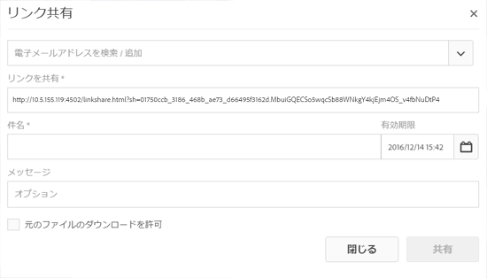
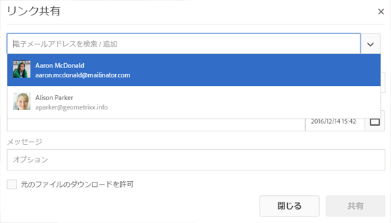
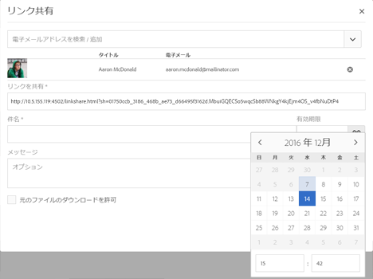
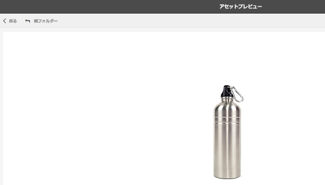
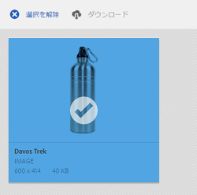
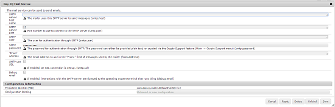

# リンクを使用してアセットを共有 {#asset-link-sharing}

[!DNL Adobe Experience Manager Assets] では、アセット、フォルダー、コレクションを URL として組織のメンバーや外部（パートナーやベンダーを含む）と共有できます。 リンクによるアセットの共有は、外部の関係者が [!DNL Assets] にログインすることなくリソースを利用するための便利な方法です。

>[!PREREQUISITES]
>
>* リンクとして共有するフォルダーまたはアセットに対する編集 ACL 権限が必要です。
>* ユーザーに電子メールを送信するには、で SMTP サーバーの詳細を設定します。 [Day CQ Mail Service](#configmailservice).

## アセットの共有 {#share-assets}

ユーザーと共有するアセットの URL を生成するには、リンク共有ダイアログを使用します。 `/var/dam/share` の場所への管理者特権または読み取り権限を持つユーザーが、共有されたリンクを表示することができます。

1. [!DNL Assets] のユーザーインターフェイスで、リンクとして共有するアセットを選択します。
1. ツールバーの **[!UICONTROL リンクを共有]** . クリックした後に作成されるリンク **[!UICONTROL 共有]** は、事前に [!UICONTROL リンクを共有] フィールドに入力します。 リンクは、 **[!UICONTROL 送信]**.

   

   *図：アセットをリンクとして共有するためのダイアログ。*

1. **[!UICONTROL リンク共有]**&#x200B;ダイアログの電子メールアドレスボックスに、リンクを共有するユーザーの電子メール ID を入力します。1 人または複数のユーザーを追加できます。

   

   *図：アセットへのリンクを [!UICONTROL リンク共有] ダイアログ。*

   >[!NOTE]
   >
   >組織のメンバーでないユーザーの電子メール ID を入力すると、 [!UICONTROL 外部ユーザー] には、ユーザーの電子メール ID のプレフィックスが付きます。

1. 「**[!UICONTROL 件名]**」ボックスに、共有するアセットの件名を入力します。
1. 「**[!UICONTROL メッセージ]**」ボックスに、オプションでメッセージを入力します。

1. 内 **[!UICONTROL 有効期限]** 「 」フィールドで、リンクが機能を停止する日時を指定します。 リンクのデフォルトの有効期間は 1 日です。

   

1. ユーザーがレンディションと共に元のアセットをダウンロードできるようにするには、「 **[!UICONTROL 元のファイルのダウンロードを許可]**. デフォルトでは、ユーザーはリンクとして共有されているアセットのレンディションのみをダウンロードできます。

1. 「**[!UICONTROL 共有]**」をクリックします。リンクが電子メールでユーザーと共有されることを確認するメッセージが表示されます。

1. 共有アセットを表示するには、ユーザーに送信された電子メールに記載されているリンクをクリックします。 アセットのプレビューを生成するには、共有アセットをクリックします。 プレビューを閉じるには、 **[!UICONTROL 戻る]**. フォルダーを共有している場合は、 **[!UICONTROL 親フォルダー]** をクリックして親フォルダーに戻ります。

   

   >[!NOTE]
   >
   >[!DNL Experience Manager] では、サポートされているファイルタイプのアセットのプレビューの生成のみサポートしています。 他の MIME タイプが共有されている場合は、アセットのダウンロードのみ可能で、プレビューはできません。

1. 共有アセットをダウンロードするには、 **[!UICONTROL 選択]** ツールバーでアセットをクリックし、 **[!UICONTROL ダウンロード]** をクリックします。

   

1. リンクとして共有したアセットを表示するには、 [!DNL Assets] ユーザーインターフェイスで [!DNL Experience Manager] ロゴ 選択 **[!UICONTROL ナビゲーション]**. ナビゲーションウィンドウで、「 」を選択します。 **[!UICONTROL 共有リンク]** 共有アセットのリストを表示する。

1. アセットの共有を解除するには、アセットを選択して、 **[!UICONTROL 共有しない]** をクリックします。 確認メッセージが表示されます。 そのアセットのエントリがリストから削除されます。

## Day CQ Mail Service の設定 {#configure-day-cq-mail-service}

1. の [!DNL Experience Manager] ホームページ、に移動します。 **[!UICONTROL ツール]** > **[!UICONTROL 運用]** > **[!UICONTROL Web コンソール]**.
1. サービスのリストから、**[!UICONTROL Day CQ Mail Service]** を探します。
1. クリック **[!UICONTROL 編集]** を選択し、 **[!UICONTROL Day CQ Mail Service]** 彼らの名前に関して詳しく述べた

   * SMTP server host name：電子メールサーバーのホスト名
   * SMTP server port：電子メールサーバーのポート
   * SMTP user：メールサーバーのユーザー名
   * SMTP password：電子メールサーバーのパスワード

   

1. 「**[!UICONTROL 保存]**」をクリックします。

## 最大データサイズの設定 {#configure-maximum-data-size}

リンク共有機能を使用して共有されたリンクからアセットをダウンロードする場合、 [!DNL Experience Manager] はリポジトリーからのアセット階層を圧縮し、アセットを ZIP ファイルで返します。 ただし、ZIP ファイルとして圧縮できるデータ量に制限がないと、膨大なデータが圧縮の対象となり、JVM のメモリ不足エラーの原因となります。この状況による潜在的な DoS 攻撃からシステムを保護するには、Configuration Manager で Day CQ DAM Adhoc Asset Share Proxy Servlet の「**[!UICONTROL Max Content Size (uncompressed)]**」パラメーターを使用して、最大サイズを設定します。****&#x200B;アセットの未圧縮時のサイズが設定値を超えていると、アセットのダウンロード要求は拒否されます。デフォルト値は 100 MB です。

1. 次をクリック： [!DNL Experience Manager] ロゴをクリックし、次ににに移動します。 **[!UICONTROL ツール]** > **[!UICONTROL 運用]** > **[!UICONTROL Web コンソール]**.
1. Web コンソールで、 **[!UICONTROL Day CQ DAM Adhoc Asset Share Proxy Servlet]** 設定。
1. 「**[!UICONTROL Day CQ DAM Adhoc Asset Share Proxy Servlet]**」設定を編集モードで開き、「**[!UICONTROL Max Content Size (uncompressed)]**」パラメーターの値を変更します。

   

1. 変更内容を保存します。

## ベストプラクティスとトラブルシューティング {#best-practices-and-troubleshooting}

* 名前に空白を含むアセットフォルダーまたはコレクションは共有されない場合があります。
* ユーザーが共有アセットをダウンロードできない場合は、 [!DNL Experience Manager] 管理者 [ダウンロード制限](#configure-maximum-data-size) はです。
* 共有アセットへのリンクを含む電子メールを送信できない場合や、他のユーザーが電子メールを受信できない場合は、 [!DNL Experience Manager] 管理者 ( [電子メールサービス](#configure-day-cq-mail-service) が設定されているかどうか。
* リンク共有機能を使用してアセットを共有できない場合は、適切な権限を持っていることを確認してください。[アセットの共有](#share-assets)を参照してください。
* 共有アセットが別の場所に移動されると、そのリンクは機能しなくなります。リンクを再作成し、ユーザーと再共有します。

* リンクを [!DNL Experience Manager] 外部エンティティへのオーサーのデプロイメント。次のリンク共有に使用される URL のみを公開するようにしてください。 `GET` リクエストのみ。 セキュリティ上の理由から、他の URL をブロックします。

   * `http://[aem_server]:[port]/linkshare.html`
   * `http://[aem_server]:[port]/linksharepreview.html`
   * `http://[aem_server]:[port]/linkexpired.html`
   In [!DNL Experience Manager] インターフェイス、アクセス **[!UICONTROL ツール]** > **[!UICONTROL 運用]** > **[!UICONTROL Web コンソール]**. を開きます。 **[!UICONTROL Day CQ Link Externalizer]** を設定し、 **[!UICONTROL ドメイン]** 値が記載されたフィールド `local`, `author`、および `publish`. の `local` および `author` プロパティには、それぞれローカルインスタンスとオーサーインスタンスの URL を指定します。 1 つの [!DNL Experience Manager] オーサーインスタンス、同じ値を次に使用： `local` および `author` プロパティ。 パブリッシュインスタンスの場合は、 [!DNL Experience Manager] パブリッシュインスタンス。
