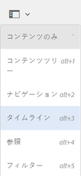
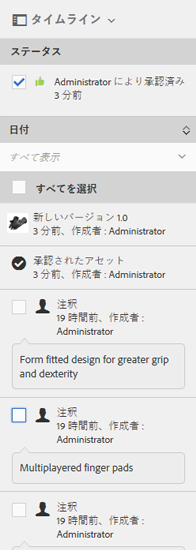

# デジタルアセットの管理 {#managing-assets-with-the-touch-optimized-ui}

>[!CAUTION]
>
>AEM 6.4 の拡張サポートは終了し、このドキュメントは更新されなくなりました。 詳細は、 [技術サポート期間](https://helpx.adobe.com/jp/support/programs/eol-matrix.html). サポートされているバージョンを見つける [ここ](https://experienceleague.adobe.com/docs/?lang=ja).

タッチ操作向け UI( [!DNL Experience Manager] アセット。

この記事では、Adobe Experience Manager Assets のタッチ操作向け UI を使用してアセットを管理および編集する方法について説明します。 ユーザーインターフェイスの基本的な知識については、 [タッチ UI の基本操作](/help/sites-authoring/basic-handling.md). コンテンツフラグメントを管理するには、 [コンテンツフラグメントの管理](content-fragments-managing.md) アセット。

## フォルダーの作成 {#create-folders}

`Nature` に関するすべての画像などの、アセットのコレクションを構成する場合に、それらを保存するフォルダーを作成できます。フォルダーを使用すると、アセットを分類および整理できます。[!DNL Experience Manager] アセットをより適切に機能させるために、フォルダー内のアセットを整理する必要はありません。

>[!NOTE]
>
>* タイプの Assets フォルダーの共有 `sling:OrderedFolder` は、Marketing Cloudとの共有時はサポートされません。 フォルダーを共有する場合は、フォルダーを作成するときに「Ordered」を選択しないでください。
>* Experience Manager では、`subassets` をフォルダーの名前として使用することはできません。これは、複合アセットのサブアセットを含むノード用に予約されているキーワードです。

1. 新しいフォルダーを作成するデジタルアセットフォルダー内の場所に移動します。
1. メニューで、「**[!UICONTROL 作成]**」をクリックします。「**[!UICONTROL 新規フォルダー]**」を選択します。
1. 「**[!UICONTROL タイトル]**」フィールドにフォルダー名を入力します。デフォルトでは、DAM は指定したタイトルをフォルダー名として使用します。 フォルダーを作成したら、デフォルトのフォルダーを上書きし、別のフォルダー名を指定できます。
1. 「**[!UICONTROL 作成]**」をクリックします。作成したフォルダーがデジタルアセットフォルダーに表示されます。

以下の文字（スペース区切りリスト）はサポートされません。

* アセットファイル名に含めてはいけない文字：`* / : [ \ \ ] | # % { } ? &`
* アセットフォルダー名に含めてはいけない文字：`* / : [ \ \ ] | # % { } ? \" . ^ ; + & \t`

## アセットのアップロード {#uploading-assets}

様々な種類のアセット ( 画像、PDFファイル、RAW ファイルなど ) を、ローカルフォルダーまたはネットワークドライブからにアップロードできます。 [!DNL Experience Manager] アセット。

>[!NOTE]
>
>Dynamic Media - Scene7モードでは、ファイルサイズが 2 GB 以下のアセットのみをアップロードできます。

処理プロファイルを割り当てているフォルダーにアセットをアップロードするかどうかを選択できます。

処理プロファイルが割り当てられているフォルダーの場合、プロファイル名がカード表示のサムネールに表示されます。リスト表示では、プロファイル名が「**[!UICONTROL 処理プロファイル]**」に表示されます。詳しくは、[処理プロファイル](processing-profiles.md)を参照してください。

アセットをアップロードする前に、アセットが [サポートされる形式](assets-formats.md).

**アセットをアップロードするには**:

1. Assets Web インターフェイスで、デジタルアセットを追加する場所に移動します。
1. アセットをアップロードするには、以下のいずれかの操作をおこないます。

   * ツールバーの「**[!UICONTROL 作成]**」アイコンをタップします。次に、メニューで「**[!UICONTROL ファイル]**」をタップします。表示されたダイアログで、必要に応じてファイル名を変更できます。
   * アセット 5 をサポートするHTMLーで、アセットをインターフェイスに直接ドラッグします。 ファイル名を変更するためのダイアログは表示されません。

   

   複数のファイルを選択するには、ファイル選択ダイアログで、Ctrl キーまたは Command キーを押しながらアセットを選択します。 iPadからは、一度に 1 つのファイルのみ選択できます。

   サイズの大きなアセット（500 MB 超）のアップロードを一時停止して、同じページから後で再開できます。次をタップします。 **[!UICONTROL 一時停止]** アップロードが開始すると表示されるプログレスバーの横のアイコン。

   

   アセットが大きいと見なされる上限のサイズは設定可能です。 例えば、（500 MB ではなく）1000 MB を超えるアセットを大きなアセットと見なすようにシステムを設定できます。 この場合、 **[!UICONTROL 一時停止]** ボタンが 1,000 MB を超えるサイズのアセットをアップロードすると、プログレスバーに表示されます。

   この **[!UICONTROL 一時停止]** 1,000 MB を超えるファイルが 1,000 MB 未満のファイルでアップロードされた場合、ボタンは表示されません。 ただし、1000 MB 未満のファイルのアップロードをキャンセルした場合、 **[!UICONTROL 一時停止]** ボタンが表示されます。

   サイズ上限を変更するには、CRX リポジトリ内の `fileupload` ノードの `chunkUploadMinFileSize` プロパティを設定してください。

   この **[!UICONTROL 一時停止]** アイコンをクリックすると、アイコンが **[!UICONTROL 再生]** アイコン アップロードを再開するには、 **[!UICONTROL 再生]** アイコン

   

   進行中のアップロードをキャンセルするには、 `X` ボタンをクリックします。 アップロード操作をキャンセルする場合、 [!DNL Experience Manager] Assets は、アセットのアップロード済みの部分を削除します。

   アップロードを再開する機能は、低帯域幅のシナリオやネットワークの異常が発生し、大きなアセットのアップロードに長い時間がかかる場合に特に役立ちます。 アップロード操作を一時停止して、後で状況が改善したら続行できます。 再開すると、一時停止した時点からアップロードが開始されます。

   アップロード処理中、[!DNL Experience Manager] はアップロード中のアセットの部分をデータのチャンクとして CRX リポジトリに保存します。アップロードが完了すると、[!DNL Experience Manager] はリポジトリ内のチャンクを 1 つのデータブロックに統合します。

   未完了のチャンクのアップロードジョブのクリーンアップタスクを設定するには、`https://[aem_server]:[port]/system/console/configMgr/org.apache.sling.servlets.post.impl.helper.ChunkCleanUpTask` に移動してください。

   アセットのアップロード先で既に使用可能なアセットと同じ名前のアセットをアップロードすると、警告ダイアログが表示されます。

   既存のアセットを置き換えるか、別のバージョンを作成するか、アップロードする新しいアセットの名前を変更して両方のアセットを残すかを選択できます。既存のアセットを置き換えると、アセットのメタデータと、以前におこなわれた変更および履歴（注釈、切り抜きなど）は削除されます。 両方のアセットを保持することを選択した場合、新しいアセットの名前が変更されます。

   

   >[!NOTE]
   >
   >次を選択した場合： **[!UICONTROL 置換]** 内 **[!UICONTROL 名前の競合]** ダイアログボックスに、新しいアセットのアセット ID が再生成されます。 この ID は以前のアセットの ID とは異なります。
   >
   >If **[!UICONTROL アセットインサイト]** Adobe Analyticsでのインプレッション数やクリック数の追跡を有効にした場合、この再生成されたアセット ID は、Adobe Analyticsで取り込まれたアセットのデータを無効化します。

   アップロードしたアセットがに存在する場合 [!DNL Experience Manager] アセット、 **[!UICONTROL 検出された重複]** ダイアログボックスに、重複するアセットをアップロードしようとしていることが警告されます。 このダイアログは、既存のアセットのバイナリの SHA 1 チェックサム値が、アップロードするアセットのチェックサム値と一致する場合にのみ表示されます。 この場合、アセットの名前は重要ではありません。 つまり、バイナリの SHA 1 の値が同じ場合、名前が異なるアセットに対してもダイアログが表示されることがあります。

   >[!NOTE]
   >
   >この **[!UICONTROL 検出された重複]** ダイアログは、 **[!UICONTROL 重複の検出]** 機能が有効になっている。 を有効にするには、以下を実行します。 **[!UICONTROL 重複の検出]** 機能： [重複項目の検出の有効化](duplicate-detection.md).

   

   タップ **[!UICONTROL 保持]** 重複したアセットを [!DNL Experience Manager] アセット。 タップ  **[!UICONTROL 削除]** をクリックして、アップロードした重複アセットを削除します。

   [!DNL Experience Manager] Assets では、ファイル名に禁止文字が含まれるアセットをアップロードできません。 許可されていない文字を含むアセットをアップロードしようとすると、 [!DNL Experience Manager] ファイル名に禁止文字が含まれていることに関する警告メッセージが表示され、これらの文字を削除するか使用可能な名前でアップロードするまでアップロードが停止されます。

   組織固有のファイル命名規則に合うように、 **[!UICONTROL アセットをアップロード]** ダイアログボックスでは、アップロードするファイルに長い名前を指定できます。

   

   ただし、以下の文字（スペース区切りリスト）はサポートされていません。
   * アセットファイル名に含めてはいけない文字：`* / : [ \ \ ] | # % { } ? &`
   * アセットフォルダー名に含めてはいけない文字：`* / : [ \ \ ] | # % { } ? \" . ^ ; + & \t`

   さらに、 Assets インターフェイスには、アップロードした最新のアセットまたは最初に作成したフォルダーがすべてのビューに表示されます (**[!UICONTROL カード表示]**, **[!UICONTROL リスト表示]**、および **[!UICONTROL 列表示]**) をクリックします。

   多くの場合、大きなアセットや複数のアセットを同時にアップロードする際に、視覚的なインジケーターを使用して進行状況を評価できます。 この **[!UICONTROL アップロードの進行状況]** ダイアログボックスに、アップロードが成功したファイルと失敗したファイルの数が表示されます。

   

   ファイルがアップロードされる前にアップロード操作をキャンセルした場合、 [!DNL Experience Manager] アセットが現在のファイルのアップロードを停止し、コンテンツを更新します。 ただし、既にアップロードされているファイルは削除されません。

### 順次アップロード {#serial-uploads}

多数のアセットを一括でアップロードすると、大量のシステムリソースが消費され、のパフォーマンスに悪影響を与える可能性があります [!DNL Experience Manager] デプロイメント。 潜在的なボトルネックは、インターネット接続、ディスク上の読み取り/書き込み操作、同時アセットアップロード時のPOST要求数に関する Web ブラウザーの制限です。 バルクアップロード操作が失敗したり、早めに終了したりする場合があります。 つまり、 [!DNL Experience Manager] 一部のファイルの取り込み中に、アセットに失敗したファイルや、ファイルの取り込みに失敗したファイルが存在する場合があります。

この状況を乗り越えるには [!DNL Experience Manager] Assets は、一括アップロード操作中に、すべてのアセットを同時に取り込むのではなく、一度に 1 つのアセットを取り込み（順次アップロード）します。

アセットの順次アップロードは、デフォルトで有効になっています。この機能を無効にし、同時アップロードを許可するには、 `fileupload` ノードを設定し、 `parallelUploads` プロパティを `true`.

### FTP によるアセットのアップロード {#uploading-assets-using-ftp}

Dynamic Mediaを使用すると、FTP サーバーを介したアセットのバッチアップロードが可能になります。 サイズが大きいアセット（1 GB 超）をアップロードしたい場合や、フォルダーとサブフォルダー全体をアップロードしたい場合は、FTP を使用する必要があります。FTP アップロードが定期的に実行されるように設定することもできます。

>[!NOTE]
>
>Dynamic Media - Scene7モードでは、ファイルサイズが 2 GB 以下のアセットのみをアップロードできます。

>[!NOTE]
>
>Dynamic Media - Scene7モードで FTP 経由でアセットをアップロードするには、次の場所にインストール機能パック (FP) 18912をインストールします。 [!DNL Experience Manager] 作成者。 アドビカスタマーサポートに問い合わせて FP-18912 にアクセスし、FTP アカウントの設定を完了してください。詳しくは、 [一括アセット移行用の機能パック18912をインストールしています](/help/assets/bulk-ingest-migrate.md).
>
>アセットのアップロードに FTP を使用する場合、[!DNL Experience Manager] で指定したアップロード設定は無視されます。代わりに、Dynamic Media Classic で定義したファイル処理ルールが使用されます。

**FTP を使用してアセットをアップロードするには**

1. 任意の FTP クライアントを使用して、プロビジョニング電子メールで受け取った FTP ユーザー名とパスワードを使用して FTP サーバーにログインします。 FTP クライアントで、ファイルまたはフォルダーを FTP サーバーにアップロードします。
1. を開きます。 [Dynamic Media Classicデスクトップアプリケーション](https://experienceleague.adobe.com/docs/?lang=jadynamic-media-classic/using/getting-started/signing-out.html#getting-started)をクリックし、プロビジョニング電子メールで受け取った資格情報を使用してアカウントにログインします。
1. グローバルナビゲーションバーで、 **[!UICONTROL アップロード]**.
1. の **[!UICONTROL アップロード]** ページの左上隅付近で、 **[!UICONTROL FTP 経由]** タブをクリックします。
1. ページの左側で、ファイルのアップロード元の FTP フォルダーを選択します。ページの右側で、保存先フォルダーを選択します。
1. ページの右下隅にあるをタップします。 **[!UICONTROL ジョブオプション]** 次に、選択したフォルダー内のアセットに基づいて必要なオプションを設定します。

   詳しくは、 [アップロードジョブオプション](#upload-job-options).

   >[!NOTE]
   >
   >FTP を使用してアセットをアップロードする場合、Dynamic Media Classicで設定したアップロードジョブオプションは、AEMで設定したアセット処理パラメーターよりも優先されます。

1. の右下隅 **[!UICONTROL アップロードジョブオプション]** ダイアログボックスで、をタップします。 **[!UICONTROL 保存]**.
1. の右下隅 **[!UICONTROL アップロード]** ページ、タップ **[!UICONTROL アップロードを送信]**.

   アップロードの進行状況を表示するには、グローバルナビゲーションバーで **[!UICONTROL ジョブ]**. この **[!UICONTROL ジョブ]** ページには、アップロードの進行状況が表示されます。 ユーザーは、[!DNL Experience Manager] で作業を続け、いつでも Dynamic Media Classic のジョブページに戻って進行中のジョブを確認できます。

   進行中のアップロードジョブをキャンセルするには、をタップします **[!UICONTROL キャンセル]** の横 **[!UICONTROL 期間]** 時間。

#### アップロードオプションを設定 {#upload-job-options}

| アップロードオプション | サブオプション | 説明 |
|---|---|---|
| ジョブ名 |  | テキストフィールドにあらかじめ入力されるデフォルト名。ユーザーが入力した名前部分や日付と時刻のスタンプが含まれます。デフォルト名を使用するか、このアップロードジョブ用に独自に作成した名前を入力することができます。 このジョブと他のアップロードジョブや公開ジョブはジョブページに記録されます。ここでジョブのステータスを確認できます。 |
| アップロード後に公開 |  | アップロードしたアセットを自動的に公開します。 |
| 任意のフォルダーでベース名が同じファイルを拡張子に関わらず上書き |  | アップロードしたファイルで同じ名前の既存のファイルが置き換えられるようにする場合は、このオプションを選択します。 このオプションの名前は、 **[!UICONTROL アプリケーション設定]** > **[!UICONTROL 一般設定]** > **[!UICONTROL アプリケーションにアップロード]** > **[!UICONTROL 画像を上書き]**. |
| アップロード時に ZIP または TAR ファイルを解凍 |  |  |
| オプション |  | タップまたはクリック **[!UICONTROL ジョブオプション]** 開く [!UICONTROL アップロードジョブオプション] ダイアログボックスを開き、アップロードジョブ全体に影響を与えるオプションを選択します。 これらのオプションはすべてのファイルタイプで同じです。 アプリケーションの全般設定ページから、ファイルのアップロード用のデフォルトオプションを選択できます。このページを開くには、**[!UICONTROL セットアップ]**／**[!UICONTROL アプリケーション設定]**&#x200B;を選択します。次をタップします。 **[!UICONTROL デフォルトのアップロードオプション]** ボタンをクリックして開きます。 [!UICONTROL アップロードジョブオプション] ダイアログボックス |
|  | セッションに他のセッション属性  | 「一時」または「定期」を選択します。 繰り返しジョブを設定するには、繰り返しオプション（日別、週別、月別、カスタム）を選択して、FTP アップロードジョブを繰り返すタイミングを指定します。 次に、必要に応じてスケジュールオプションを指定します。 |
|  | サブフォルダを含める | アップロードするフォルダ内のすべてのサブフォルダをアップロードします。 アップロードするフォルダーとサブフォルダーの名前は、自動的ににに入力されます。 [!DNL Experience Manager] アセット。 |
|  | 切り抜きツールオプション | 画像の側面から手動で切り抜くには、切り抜きメニューを選択し、「手動」を選択します。 次に、画像の任意の辺または各辺から切り抜くピクセル数を入力します。 切り抜かれる画像の量は、画像ファイルの ppi（ピクセル/インチ）設定によって異なります。 例えば、画像が 150 ppi と表示され、「上」、「右」、「下」、「左」の各テキストボックスに 75 と入力した場合、各辺から半インチずつ切り抜かれます。 画像からホワイトスペースを自動的に切り抜くには、切り抜きメニューを開き、「手動」を選択し、「上」、「右」、「下」、「左」フィールドに画像の各辺から切り抜くピクセル数を入力します。また、切り抜きメニューで「トリミング」を選択し、以下のオプションを選択することもできます。  **トリミング対象カラー** <ul><li>**カラー** - 「カラー」オプションを選択します。次に、隅メニューを選択し、切り抜きたいホワイトスペースの色を最も表現している色の画像の角を選択します。</li><li>**透明度** - 「透明度」オプションを選択します。  **許容値** - スライダーをドラッグして、0 ～ 1 の許容値を指定します。カラーに基づくトリミングの場合は、0 を指定すると、画像の隅で選択した色と完全に一致するピクセルのみが切り抜かれます。1 に近いほど、色の違いに対する許容度が高くなります。  透明度に基づくトリミングでは、切り抜くピクセルが透明な場合のみ、0 を指定してください。1 に近いほど、不透明さに対する許容度が高くなります。</li></ul> これらの切り抜きオプションは非破壊的です。 |
|  | カラープロファイルオプション | 配信に使用する最適化されたファイルを作成する際に、色変換を選択します。<ul><li>初期設定の色の保持：画像にカラースペース情報が含まれる場合は常に、ソース画像の色を維持します。色変換は行われません。 現在のほとんどの画像には、適切なカラープロファイルが既に埋め込まれています。 ただし、CMYK ソース画像に埋め込まれたカラープロファイルが含まれていない場合、カラーは sRGB（標準の赤緑青）カラースペースに変換されます。 sRGB は、Web ページに画像を表示する場合に推奨されるカラースペースです。</li><li>元のカラースペースを保持：元の色を維持し、その時点で色変換を行いません。 カラープロファイルが埋め込まれていない画像の場合、カラー変換は、公開設定で指定されたデフォルトのカラープロファイルを使用しておこなわれます。 カラープロファイルは、このオプションで作成されたファイルの色と一致しない場合があります。 したがって、「デフォルトの色保持」オプションを使用することをお勧めします。</li><li>カスタム開始日/終了日  「変換元」と「変換先」のカラースペースを選択できるメニューが開きます。 この詳細設定オプションは、ソースファイルに埋め込まれているカラー情報よりも優先されます。 送信するすべての画像のカラープロファイルデータが正しくないか不足している場合に、このオプションを選択します。</li></ul> |
|  | 画像編集オプション | 画像のクリッピングマスクを保持し、カラープロファイルを選択できます。  詳しくは、 [アップロード時の画像編集オプションの設定](#setting-image-editing-options-at-upload). |
|  | Postscript オプション | PostScript®ファイルのラスタライズ、ファイルの切り抜き、透明背景の維持、解像度の選択、カラースペースの選択を行うことができます。 [PostScript および Illustrator のアップロードオプションの設定](#setting-postscript-and-illustrator-upload-options)を参照してください。 |
|  | Photoshop Options | Adobe® Photoshop® ファイルからのテンプレート作成、レイヤーの維持、レイヤーの命名方法の指定、テキストの抽出、テンプレートへの画像のアンカー方法の指定を行うことができます。  なお、テンプレートはAEMではサポートされていません。 [Photoshop アップロードオプションの設定](#setting-photoshop-upload-options)を参照してください。 |
|  | PDFオプション | ファイルのラスタライズ、検索単語とリンクの抽出、eCatalog の自動生成、解像度の設定およびカラースペースの選択を行うことができます。  eCatalog はAEMではサポートされていません。   詳しくは、 [PDFアップロードオプションの設定&#x200B;](#setting-pdf-upload-options) **注意**:新規のアップロードで、PDFの抽出で考慮される最大ページ数は 5,000 ページです。 この制限は、2022年12月31日（PT）に（すべての PDF に対して）100 ページに変更されます。 [Dynamic Media の制限](/help/assets/limitations.md)も参照してください。 |
|  | Illustrator Options | Adobe Illustrator® ファイルのラスタライズ、透明背景の維持、解像度の選択、カラースペースの選択を行うことができます。 [PostScript および Illustrator のアップロードオプションの設定](#setting-postscript-and-illustrator-upload-options)を参照してください。 |
|  | eVideo オプション | ビデオプリセットを選択して、ビデオファイルをトランスコードできます。 [eVideo アップロードオプションの設定](#setting-evideo-upload-options)を参照してください。 |
|  | バッチセットプリセット | アップロードしたファイルから画像セットまたはスピンセットを作成するには、使用するプリセットの「アクティブ」列をクリックします。 複数のプリセットを選択できます。プリセットは、Dynamic Media Classicのアプリケーション設定/バッチセットプリセットページで作成します。 バッチセットプリセットの作成について詳しくは、[画像セットとスピンセットの自動生成用のバッチセットプリセットの設定](config-dms7.md#creating-batch-set-presets-to-auto-generate-image-sets-and-spin-sets)を参照してください。 [アップロード時のバッチセットプリセットの設定](#setting-batch-set-presets-at-upload)を参照してください。 |

#### アップロード時の画像編集オプションの設定 {#setting-image-editing-options-at-upload}

AI、EPS、PSD ファイルを含む画像のアップロード時に、**[!UICONTROL アップロードジョブオプション]**&#x200B;ダイアログボックスで以下の編集作業を実行できます。

* 画像の端からホワイトスペースを切り抜きます（上の表の説明を参照してください）。
* 画像の側面から手動で切り抜きます（上の表の説明を参照）。
* カラープロファイルを選択します（上の表のオプションの説明を参照）。
* クリッピングパスからマスクを作成します。
* アンシャープマスクオプションを使用して画像をシャープにする
* ノックアウトの背景

| オプション | サブオプション | 説明 |
|---|---|---|
| クリッピングパスからマスクを作成 |  | クリッピングパス情報に基づいて、画像のマスクを作成します。 このオプションは、画像編集アプリケーションで作成され、クリッピングパスが作成された画像に適用されます。 |
| アンシャープマスク |  | ダウンサンプリングされた最終的な画像に対するシャープフィルター効果を微調整し、効果の強さ、効果の半径（ピクセル単位）、無視されるコントラストのしきい値を制御できます。 この効果では、 Photoshop の「アンシャープマスク」フィルターと同じオプションを使用します。名前から連想される機能と違い、アンシャープマスクとはシャープニングフィルターのことです。「アンシャープマスク」で、必要なオプションを設定します。 設定オプションについては、次の節で説明します。 |
|  | 量 | 端のピクセルに適用するコントラストの量を制御します。 この量は、効果の強さと考えることができます。Dynamic Media と Photoshop での「アンシャープマスク」の量の値の主な違いは、Photoshop では量の範囲が 1%～500% である点です。一方、Dynamic Mediaでは、値の範囲は 0.0 ～ 5.0 です。5.0 の値は、Photoshopでは 500%に相当します。値が 0.9 の場合は 90%と等しくなります。 |
|  | 半径 | エフェクトの半径を制御します。値の範囲は 0 ～ 250 です。  この効果は、画像内のすべてのピクセルで実行され、すべてのピクセルから全方向に放射されます。 半径の単位はピクセルです。例えば、2000 x 2000 ピクセルの画像と 500 x 500 ピクセルの画像で同様のシャープニング効果を得るには、2000 x 2000 ピクセルの画像で 2 ピクセルの半径を設定し、500 x 500 ピクセルの画像で 1 ピクセルの半径値を設定します。 ピクセル数の多い画像には大きい値を使用します。 |
|  | しきい値 | しきい値とは、アンシャープマスクフィルターの適用時に無視されるコントラストの範囲です。このフィルタを使用する際に、画像に「ノイズ」が入り込まないようにすることが重要です。 値の範囲は 0 ～ 255 で、グレースケール画像の明るさステップ数です。 0 =黒、128 = 50%グレー、255 =白。  例えば、しきい値 12 を指定した場合、ノイズの追加を避けるために肌のトーンの明るさの変化が少し無視されますが、まつげが肌に当たる部分など、コントラストの強い領域にエッジのコントラストが追加されます。  例えば、誰かの顔の写真がある場合、アンシャープマスクは、まつ毛と肌がぶつかって明確なコントラストを作り出す場所や滑らかな肌そのものなど、画像のコントラストのある部分に影響を与えます。 最も滑らかな肌でも、明るさの値に微妙な変化を示します。 しきい値を使用しない場合、フィルターは肌のピクセルでこれらの微妙な変化を強調します。 また、まつ毛のコントラストを高めつつ、ノイズの多い望ましくない効果を生み出し、鋭さを高めます。 しきい値は、この問題を解決するために導入されたもので、フィルターに対し、滑らかな肌のようにコントラストが大きく変化しないピクセルを無視するよう指示します。 先ほど示したファスナーのグラフィックで、ファスナーの横の生地に注目してください。しきい値が低すぎてノイズを抑制できなかったので、画像ノイズが発生しています。 |
|  | モノクロ | 選択すると、画像の明るさ（強さ）にアンシャープマスクが適用されます。 選択を解除すると、それぞれの色成分に個別にアンシャープマスクが適用されます。 |
| ノックアウトの背景 |  | 画像をアップロードする際に、画像の背景を自動的に削除します。 この手法は、特定のオブジェクトに注目を集め、忙しい背景から際立たせるのに役立ちます。 選択すると、ノックアウトの背景機能と以下のサブオプションが有効または「オン」になります。 |
|  | 角 | 必須。  ノックアウトする背景色の定義に使用する画像の隅。  次の中から選択できます。 **左上**, **左下**, **右上**&#x200B;または **右下**. |
|  | Fill メソッド | 必須。  設定したコーナーの位置からのピクセルの透明度を制御します。  次のフィル方法から選択できます。 <ul><li>**Flood Fill**  — 指定した [ 角 ] に一致し、接続されているすべてのピクセルを透明にします。</li><li>**ピクセルを一致**  — 画像上の位置に関係なく、一致するすべてのピクセルを透明にします。</li></ul> |
|  | 許容値 | オプション。  設定した [ 角 ] の位置に基づいて、ピクセルカラーの一致で許容される変化量を制御します。  0.0 の値を指定すると、ピクセルの色が完全に一致します。または、1.0 の値を指定すると、最大のバリエーションが可能になります。 |

#### PostScript および Illustrator のアップロードオプション設定 {#setting-postscript-and-illustrator-upload-options}

PostScript(EPS) 画像ファイルまたはIllustrator(AI) 画像ファイルをアップロードする際には、様々な方法で書式設定できます。 ファイルのラスタライズ、透明背景の維持、解像度の選択、カラースペースの選択ができます。PostScript および Illustrator ファイルのフォーマットに関するオプションは、アップロードジョブオプションダイアログボックスのPostScript オプションとIllustrator オプションの下にあります。

| オプション | サブオプション | 説明 |
|---|---|---|
| 処理 |  | 選択 **[!UICONTROL ラスタライズ]** ファイル内のベクトルグラフィックをビットマップ形式に変換します。 |
| レンダリングした画像で透明な背景を維持 |  | ファイルの背景の透明度を維持します。 |
| 解像度 |  | 解像度設定を決定します。 この設定は、ファイルで 1 インチあたりに表示されるピクセル数を決定します。 |
| カラースペース |  | 「カラースペース」メニューを選択し、次のカラースペースオプションから選択します。 |
|  | 自動検出 | ファイルのカラースペースを保持します。 |
|  | RGB として強制 | RGB カラースペースに変換します。 |
|  | CMYK として強制 | CMYK カラースペースに変換します。 |
|  | グレースケールとして強制 | グレースケールカラースペースに変換します。 |

#### Photoshop アップロードオプションの設定 {#setting-photoshop-upload-options}

PSD(Photoshopドキュメント ) ファイルは、画像テンプレートの作成に最も多く使用されます。 PSD ファイルをアップロードするときは、ファイルから画像テンプレートを自動的に作成できます（アップロード画面のテンプレートを作成オプションを選択します）。

レイヤーの含まれる PSD ファイルをテンプレートの作成に使用すると、Dynamic Media はこのファイルから複数の画像を作成します。1 レイヤーにつき 1 画像作成されます。

Photoshop アップロードオプションで、前述した&#x200B;**[!UICONTROL 切り抜きツールオプション]**&#x200B;と&#x200B;**[!UICONTROL カラープロファイルオプション]**&#x200B;を使用します。

>[!NOTE]
>
>テンプレートはAEMではサポートされていません。

| オプション | サブオプション | 説明 |
|---|---|---|
| レイヤーを維持 |  | レイヤーがある場合は、PSD内のレイヤーを個々のアセットにリップします。 アセットレイヤーは PSD に関連付けられたまま維持されます。詳細ビューでPSDファイルを開き、レイヤパネルを選択すると、画層を表示できます。 |
| テンプレートの作成 |  | PSD ファイル内のレイヤーからテンプレートを作成します。 |
| テキストを抽出 |  | テキストを抽出して、ユーザーがビューア内でテキストを検索できるようにします。 |
| レイヤーを背景サイズに拡大 |  | 切り離した画像レイヤーのサイズを、背景レイヤーのサイズに拡大します。 |
| レイヤーの命名 |  | PSD ファイル内のレイヤーを別々の画像としてアップロードします。 |
|  | レイヤー名 | イメージファイルのレイヤ名に従ってPSDに名前を付けます。 例えば、元の PSD ファイルに Price Tag という名前のレイヤーがある場合、Price Tag という名前の画像になります。ただし、PSDファイル内のレイヤー名がデフォルトのPhotoshopレイヤー名（背景、レイヤー 1、レイヤー 2 など）の場合、イメージの名前はPSDファイル内のレイヤー番号に基づいて付けられ、デフォルトのレイヤー名に基づいて付けられません。 |
|  | Photoshopとレイヤー番号 | イメージファイルのレイヤ番号に従ってPSDに名前を付け、元のレイヤ名は無視します。 Photoshop ファイル名の後にレイヤー番号を付けたものが画像の名前になります。例えば、Spring Ad.psd というファイルの 2 番目のレイヤーは、Photoshopでデフォルト以外の名前を持っていたとしても、Spring Ad_2 という名前になります。 |
|  | Photoshopと画層名 | イメージファイルの後にPSDの名前を付け、その後にレイヤ名またはレイヤ番号を付けます。 PSD ファイル内のレイヤー名がデフォルトの Photoshop レイヤー名である場合、レイヤー番号が使用されます。例えば、SpringAd という名前のPSDファイル内の Price Tag という名前のレイヤーには、Spring Ad_Price Tag という名前が付けられます。 レイヤ 2 という名前の既定のレイヤは、Spring Ad_2 と呼ばれます。 |
| アンカー |  | 画像ファイルから作成されたレイヤーコンポジションから生成されたテンプレートに画像をアンカーする方法をPSDします。 デフォルトでは、アンカーが中心です。 中央のアンカーを使用すると、置き換え画像の縦横比に関係なく、置き換え画像を同じスペースに最適に埋めることができます。 この画像を置き換える縦横比が異なる画像は、テンプレートを参照し、パラメーターの置き換えを使用する場合、同じスペースを効果的に占有します。 アプリケーションで、テンプレートの割り当て済み領域を埋めるために置き換え画像が必要な場合は、別の設定に変更します。 |

#### PDF アップロードオプションの設定 {#setting-pdf-upload-options}

PDFファイルをアップロードする際に、様々な方法でフォーマットできます。 ページの切り抜き、検索語の抽出、インチあたりのピクセル数の解像度の入力、カラースペースの選択を行います。 PDFファイルには、多くの場合、トリムマージン、内トンボ、レジストレーションマーク、その他のプリンタのマークが含まれます。 PDF ファイルのアップロード時に、ページの端からこれらのマークをトリミングできます。

抽出で考慮される PDF の最大ページ数は、新規アップロードの場合、5,000 です。この制限は、2022年12月31日（PT）に（すべての PDF に対して）100 ページに変更されます。 [Dynamic Media の制限事項](/help/assets/limitations.md)も参照してください。

>[!NOTE]
>
>eCatalog はAEMではサポートされていません。

次のいずれかのオプションを選択します。

| オプション | サブオプション | 説明 |
|---|---|---|
| 処理 | ラスタライズ | （デフォルト）PDF ファイルのページをリッピングし、ベクターグラフィックスをビットマップイメージに変換します。eCatalog を作成するには、このオプションを選択します。 |
| 抽出 | 単語を検索 | eCatalog ビューアでPDFで検索できるように、キーワードファイルから単語を抽出します。 |
|  | リンク | PDFファイルからリンクを抽出し、eCatalog ビューアで使用される画像マップに変換します。 |
| 複数のページから eCatalog を自動生成PDF |  | eCatalog をPDF・ファイルから自動的に作成 eCatalog の名前は、アップロードしたPDFファイルに基づいて付けられます。 ( このオプションは、アップロード時にPDFファイルをラスタライズする場合にのみ使用できます )。 |
| 解像度 |  | 解像度設定を決定します。 この設定は、PDFファイルで 1 インチあたりに表示されるピクセル数を決定します。 デフォルトは 150 です。 |
| カラースペース |  | カラースペースメニューを選択し、PDFファイルのカラースペースを選択します。 ほとんどのPDFファイルには、RGBと CMYK の両方のカラー画像が含まれます。 RGBの色空間は、オンライン表示に好ましい。 |
|  | 自動検出 | PDF・ファイルのカラー・スペースを保持します。 |
|  | RGB としてレンダリング | RGB カラースペースに変換します。 |
|  | CMYK としてレンダリング | CMYK カラースペースに変換します。 |
|  | グレースケールとしてレンダリング | グレースケールカラースペースに変換します。 |

#### eVideo アップロードオプションの設定 {#setting-evideo-upload-options}

様々なビデオプリセットからを選択して、ビデオファイルをトランスコードできます。

| オプション | サブオプション | 説明 |
|---|---|---|
| アダプティブビデオ |  | モバイル、タブレットおよびデスクトップに配信するビデオを作成するために、あらゆる縦横比で機能する単一のエンコーディングプリセットです。このプリセットでエンコードされたアップロード済みソースビデオは、固定の高さに設定されます。ただし、幅はビデオの縦横比を保持して自動的に拡大・縮小します。 ベストプラクティスは、アダプティブビデオエンコーディングを使用することです。 |
| 単一のエンコーディングプリセット | エンコーディングプリセットを並べ替え | 「名前」または「サイズ」を選択して、「デスクトップ」、「モバイル」、「タブレット」の下に表示されるエンコーディングプリセットを名前または解像度サイズで並べ替えます。 |
|  | デスクトップ | デスクトップコンピューターにストリーミングまたはプログレッシブビデオエクスペリエンスを配信するための MP4 ファイルを作成します。必要な解像度サイズとターゲットデータレートを持つ縦横比を 1 つ以上選択します。 |
|  | モバイル | iPhoneまたは Android モバイルデバイスで配信用の MP4 ファイルを作成します。必要な解像度サイズとターゲットデータレートを持つ 1 つ以上の縦横比を選択します。 |
|  | タブレットなど）のアクティブマーカーを確認する。 | iPadまたは Android タブレットデバイスで配信する MP4 ファイルを作成します。必要な解像度サイズとターゲットデータレートを持つ 1 つ以上の縦横比を選択します。 |

#### アップロード時にバッチセットプリセットを設定 {#setting-batch-set-presets-at-upload}

アップロードした画像から画像セットまたはスピンセットを自動的に作成する場合は、 **[!UICONTROL アクティブ]** 」列を使用します。 複数のプリセットを選択できます。

バッチセットプリセットの作成について詳しくは、[画像セットとスピンセットの自動生成用のバッチセットプリセットの設定](config-dms7.md#creating-batch-set-presets-to-auto-generate-image-sets-and-spin-sets)を参照してください。

### ストリーミングアップロード {#streamed-uploads}

多数のアセットをアップロードする場合、 [!DNL Experience Manager] サーバーが大幅に増加するので、アップロードの効率が低下し、タイムアウトが発生する場合があります。 [!DNL Experience Manager] Assets はアセットのストリーミングアップロードをサポートします。ストリーミングアップロードにより、リポジトリーにアセットをコピーする前にサーバー上の一時フォルダーのアセットストレージを回避することで、アップロード操作中のディスク I/O が低減します。 代わりに、データがリポジトリに直接転送されます。 これにより、大きなアセットをアップロードする時間を短縮し、タイムアウトの可能性を減らすことができます。 ストリーミングアップロードは、でデフォルトで有効になっています。 [!DNL Experience Manager] アセット。

のストリーミングアップロードは無効です [!DNL Experience Manager] servlet-api バージョンが 3.1 未満の JEE サーバーでの実行

### アセットが含まれている ZIP アーカイブの抽出 {#extract-zip-archive-containing-assets}

ZIP アーカイブは、その他のサポートされているアセットと同様にアップロードできます。 同じファイル名規則が ZIP ファイルに適用されます。 [!DNL Experience Manager] を使用すると、ZIP アーカイブを DAM の場所に抽出できます。

一度に 1 つの ZIP アーカイブを選択し、「**[!UICONTROL アーカイブの抽出]**」をクリックして、抽出先フォルダーを選択します。競合を処理するオプションを選択します（存在する場合）。 ZIP ファイル内のアセットが既に保存先フォルダーに存在する場合は、次のいずれかのオプションを選択できます。抽出をスキップ、既存のファイルを置き換える、名前を変更して両方のアセットを保持する、または新しいバージョンを作成する

解凍が完了すると、[!DNL Experience Manager] は通知領域にメッセージを表示します。[!DNL Experience Manager] が ZIP ファイルを解凍している間、作業に戻っても抽出は中断されません。

この機能には、いくつかの制限があります。

* 抽出先に同じ名前のフォルダーが存在する場合、ZIP ファイル内のアセットは既存のフォルダーに抽出されます。

* 抽出をキャンセルしても、既に抽出済みのアセットは削除されません。

* 同時に 2 つの ZIP ファイルを選択して抽出することはできません。 一度に 1 つの ZIP アーカイブのみ抽出できます。

## アセットのプレビュー {#previewing-assets}

**アセットをプレビューするには**:

1. Assets UI で、プレビューするアセットの場所に移動します。
1. 目的のアセットをタップして開きます。

1. プレビューモードでは、[サポートされている画像タイプ](assets-formats.md#supported-raster-image-formats)で（インタラクティブ編集中に）ズームオプションを使用できます。

   アセットにズームインするには、 **[!UICONTROL +]** （またはアセット上の虫眼鏡をタップします）。 ズームアウトするには、をタップします。 **[!UICONTROL -]**. ズームインすると、パンニングによって画像の任意の場所を詳細に確認できます。この **[!UICONTROL ズームをリセット]** 矢印をクリックすると、元のビューに戻ります。

   

   次をタップします。 **[!UICONTROL リセット]** ボタンをクリックして、表示を元のサイズに戻します。

   

>[!MORELIKETHIS]
>
>* [Dynamic Media アセットのプレビュー](/help/assets/previewing-assets.md)
>* [サブアセットの表示](managing-linked-subassets.md#viewing-subassets).

## プロパティの編集 {#editing-properties}

1. メタデータを編集するアセットの場所に移動します。

1. アセットを選択し、 **[!UICONTROL プロパティ]** ツールバーからアセットのプロパティを表示します。 または、アセットカードで **[!UICONTROL プロパティ]** クイックアクションを選択します。

   

1. **[!UICONTROL プロパティ]** ページの様々なタブで、メタデータのプロパティを編集します。例えば、「**[!UICONTROL 基本]**」タブでは、タイトルや説明などを編集します。

   **[!UICONTROL プロパティ]** ページのレイアウトと編集できるメタデータのプロパティは、基になるメタデータスキーマによって変わります。**[!UICONTROL プロパティ]** ページのレイアウトを変更する方法については、 [メタデータスキーマ](metadata-schemas.md) を参照してください。

1. アセットをアクティベートする特定の日付と時間をスケジュールするには、「**[!UICONTROL オンタイム]**」フィールドの横にある日付選択を使用します。

   

1. 特定の期間の後にアセットのアクティベートを解除するには、 **[!UICONTROL オフタイム]** フィールドに入力します。

   アクティベートを解除する日付は、アセットに設定されたアクティベート日より後の日付にしてください。[!UICONTROL オフタイム]の経過後、アセットとそのレンディションは、Assets Web インターフェイスでも HTTP API でも使用できません。

   

1. 「**[!UICONTROL タグ]**」フィールドで、タグを 1 つ以上選択します。カスタムタグを追加するには、ボックスにタグの名前を入力し、 **[!UICONTROL 入力]**. 新しいタグが AEM に保存されます。

   YouTubeでは、公開するためにタグが必要で、YouTubeへのリンクが必要です（適切なリンクが見つかる場合）。
タグを作成するには、次の書き込み権限が必要です： `/content/cq:tags/default` CRX リポジトリ内に保存されます。

1. アセットに評価を指定するには、 **[!UICONTROL 詳細]** 「 」タブをタップし、適切な位置の星をタップして、目的の評価を割り当てます。

   

   アセットに割り当てた評価スコアがの下に表示されます。 **[!UICONTROL 評価]**. アセットを評価したユーザーが受け取った平均評価スコアが、次の場所に表示されます。 **[!UICONTROL 評価]**. さらに、平均評価スコアに貢献する評価スコアの内訳が、以下に表示されます。 **[!UICONTROL 評価の分類]**. 平均評価スコアに基づいてアセットを検索できます。

1. アセットの使用状況の統計を表示するには、 **[!UICONTROL インサイト]** タブをクリックします。

   使用状況の統計は次のとおりです。

   * アセットが表示またはダウンロードされた回数。
   * アセットが使用されたチャネル/デバイス。
   * アセットが最近使用されたクリエイティブソリューション。

   詳しくは、[Assets Insights](touch-ui-asset-insights.md) を参照してください。

1. **[!UICONTROL 保存して閉じる]**&#x200B;をタップします。
1. Assets UI に移動します。 編集されたメタデータのプロパティ（タイトル、説明、評価など）は、カード表示のアセットカードおよびリスト表示の関連する列に表示されます。

## アセットのコピー {#copying-assets}

アセットまたはフォルダーをコピーすると、アセット全体またはフォルダー全体が、そのコンテンツ構造と共にコピーされます。 コピーされたアセットまたはフォルダーは、ターゲットの場所で複製されます。 ソースの場所にあるアセットは変更されません。

アセットの特定のコピーに固有の属性は、繰り越されません。 次に例を示します。

* アセット ID、作成日時、バージョン、バージョン履歴。これらのプロパティの一部は、`jcr:uuid`、`jcr:created`、`cq:name` プロパティによって示されます。

* 作成時間と参照先のパスは、アセットとレンディションごとに一意です。

その他のプロパティおよびメタデータ情報は保持されます。 アセットをコピーする際に、部分コピーは作成されません。

1. Assets UI から 1 つ以上のアセットを選択し、 **[!UICONTROL コピー]** アイコンをクリックします。 または、 **[!UICONTROL コピー]** アセットカードからのクイックアクション

   

   >[!NOTE]
   >
   >**[!UICONTROL コピー]**&#x200B;クイックアクションを使用した場合、一度にコピーできるアセットは 1 つだけです。

1. アセットをコピーする場所に移動します。

   >[!NOTE]
   >
   >同じ場所でアセットをコピーすると、[!DNL Experience Manager] は自動的に名前のバリエーションを生成します。例えば、「Square」というタイトルのアセットをコピーした場合、 [!DNL Experience Manager] コピーのタイトルを Square1 として自動的に生成します。

1. 次をタップします。 **[!UICONTROL 貼り付け]** ツールバーのアセットアイコン：

   

   アセットがこの場所にコピーされます。

   >[!NOTE]
   >
   >ツールバーの&#x200B;**[!UICONTROL 貼り付け]**&#x200B;アイコンが使用できるのは、貼り付け操作が完了するまでです。

## アセットの移動または名前変更 {#moving-or-renaming-assets}

アセット（またはフォルダー）を別の場所に移動した場合、アセットのコピー中に、そのアセット（またはフォルダー）は複製されません。アセット（またはフォルダー）はターゲットの場所に配置され、ソースの場所から削除されます。また、アセットを新しい場所に移動する際に、名前を変更することもできます。
公開済みのアセットを別の場所に移動する場合は、アセットを再公開するオプションがあります。 公開済みのアセットに対するデフォルトの移動操作により、自動的に非公開になります。作成者が [!UICONTROL 再公開] 」オプションを使用して設定できます。

アセットまたはフォルダーを移動するには：

1. 移動するアセットの場所に移動します。

アセットまたはフォルダーを移動するには：

1. 移動するアセットの場所に移動します。

1. アセットを選択し、ツールバーの「**[!UICONTROL 移動]**」オプションをクリックします。
   

1. [!UICONTROL アセットを移動]ウィザードで、次のいずれかの操作を行います。

   * 移動後のアセットの名前を指定します。その後、「**[!UICONTROL 次へ]**」をクリックして先に進みます。

   * 「**[!UICONTROL キャンセル]**」をクリックして、プロセスを停止します。
   >[!NOTE]
   >
   >* 新しい場所に同じ名前のアセットがない場合は、アセットに同じ名前を指定できます。 ただし、同じ名前のアセットが存在する場所にアセットを移動する場合は、別の名前を使用する必要があります。 同じ名前を使用すると、名前のバリエーションが自動的に生成されます。 例えば、アセットの名前が「Square」の場合、コピーの名前は「Square1」になります。
   >* 名前を変更する場合、ファイル名に空白は使用できません。

1. **[!UICONTROL 宛先を選択]**&#x200B;ダイアログで、次のいずれかの操作を行います。

   * アセットの移動先に移動し、「**[!UICONTROL 次へ]**」をクリックして次に進みます。

   * 「**[!UICONTROL 戻る]**」をクリックして、**[!UICONTROL 名前を変更]**&#x200B;画面に戻ります。

1. 移動されるアセットに参照ページ、アセット、コレクションがある場合は、「**[!UICONTROL 宛先を選択]**」タブの横に「**[!UICONTROL 参照を調整]**」タブが表示されます。

   **[!UICONTROL 参照を調整]**&#x200B;画面で次のいずれかの操作を実行します。

   * 新しい詳細に基づいて適応させる参照を指定し、「**[!UICONTROL 移動]**」をクリックして次に進みます。

   * 「**[!UICONTROL 調整]**」列で、アセットへの参照を選択／選択解除します。
   * 「**[!UICONTROL 戻る]**」をクリックして、**[!UICONTROL 宛先を選択]**&#x200B;画面に戻ります。

   * 「**[!UICONTROL キャンセル]**」をクリックして、移動操作を停止します。

   参照を更新しなければ、引き続きアセットの以前のパスが示されます。参照を調整すると、更新され、アセットの新しいパスが反映されます。

### ドラッグ操作を使用したアセットの移動 {#move-using-drag}

アセット（またはフォルダー）を兄弟フォルダーに移動させるには、ユーザーインターフェイスの「[!UICONTROL 移動]」オプションを使用する代わりに、アセットやフォルダーを対象の場所にドラッグできます。ただし、この操作はリスト表示でのみ可能です。

ドラッグ操作でアセットを移動する場合、[!UICONTROL アセットを移動]ウィザードは開かないため、移動中にアセットの名前を変更するオプションは利用できません。さらに、既に公開済みのアセットは、ドラッグ操作によってユーザーの再公開の承認なしで再公開されます。

## レンディションの管理 {#managing-renditions}

1. アセットのレンディション（オリジナルを除く）を追加または削除できます。レンディションを追加または削除するアセットの場所に移動します。

1. アセットをタップして、そのアセットのページを開きます。

   

1. 次をタップします。 **[!UICONTROL グローバルナビゲーション]** アイコンをクリックし、「 **[!UICONTROL レンディション]** を選択します。

   

1. **[!UICONTROL レンディション]**&#x200B;パネルで、アセットに生成されたレンディションのリストを表示します。

   

   >[!NOTE]
   >
   >デフォルトでは、 [!DNL Experience Manager] アセットでは、プレビューモードでアセットの元のレンディションが表示されません。 管理者は、オーバーレイを使用して [!DNL Experience Manager] プレビューモードでオリジナルのレンディションを表示するアセット。

1. 表示または削除するレンディションを選択します。

   **レンディションの削除**

   レンディションを **[!UICONTROL レンディション]** パネルを開き、 **[!UICONTROL レンディションを削除]** アイコン [ツールバー](/help/sites-authoring/basic-handling.md). アセット処理の完了後は、レンディションを一括削除することはできません。個々のアセットについては、ユーザーインターフェイスからレンディションを手動で削除できます。複数のアセットについては、Experience Managerをカスタマイズして、特定のレンディションを削除したり、アセットを削除して削除したアセットを再度アップロードしたりできます。

   

   **新しいレンディションのアップロード**

   アセットの詳細ページに移動し、 **[!UICONTROL レンディションを追加]** アイコンを使用して、アセットの新しいレンディションをアップロードします。

   

   >[!NOTE]
   >
   >**[!UICONTROL レンディション]**&#x200B;パネルからレンディションを選択する場合、ツールバーのコンテキストが変わり、レンディションに関連するアクションのみが表示されます。オプション ( **[!UICONTROL レンディションをアップロード]** アイコンは表示されません。 これらのオプションをツールバーに表示するには、アセットの詳細ページに移動します。

   画像またはビデオアセットの詳細ページに表示するレンディションのサイズを設定できます。指定した寸法に基づいて、 [!DNL Experience Manager] Assets では、レンディションが正確なサイズまたは最も近いサイズで表示されます。

   画像のレンディションサイズをアセットの詳細レベルで設定するには、 **[!UICONTROL renditionpicker]** ノード `libs/dam/gui/content/assets/assetpage/jcr:content/body/content/content/items/assetdetail/items/col1/items/assetview/renditionpicker` 幅プロパティの値を設定します。 画像サイズに基づいてアセットの詳細ページでレンディションをカスタマイズするには、幅の代わりに **[!UICONTROL size (Long) in KB]** プロパティを設定します。サイズベースのカスタマイズの場合、プロパティ **[!UICONTROL preferOriginal]** 一致するレンディションのサイズがオリジナルより大きい場合は、オリジナルが優先されます。

   同様に、 **[!UICONTROL 注釈]** ページ画像をオーバーレイ `libs/dam/gui/content/assets/annotate/jcr:content/body/content/content/items/content/renditionpicker`.

   

   ビデオアセットのレンディションのサイズを設定するには、 **[!UICONTROL videopicker]** CRX リポジトリ内のノード（場所） `/libs/dam/gui/content/assets/assetpage/jcr:content/body/content/content/items/assetdetail/items/col1/items/assetview/videopicker`ノードをオーバーレイし、適切なプロパティを編集します。

   >[!NOTE]
   >
   >ビデオの注釈は、HTML5 互換のビデオ形式に対応したブラウザーでのみサポートされます。また、ブラウザーによってサポートされるビデオ形式が異なります。

サブアセットについて詳しくは、 [サブアセットの管理](managing-linked-subassets.md).

## アセットの削除 {#deleting-assets}

他のページからの入力参照を解決または削除するには、アセットを削除する前に、関連する参照を更新します。

また、オーバーレイを使用して「削除を強制」ボタンを無効にすることで、参照元のアセットの削除と壊れたリンクの放置を禁止します。

アセットを削除するには、dam/asset で削除権限が必要です。変更権限のみがある場合は、アセットメタデータの編集とアセットへの注釈の追加のみが可能です。 ただし、アセットやそのメタデータは削除できません。

**アセットを削除するには**:

1. 削除するアセットの場所に移動します。

1. アセットを選択し、 **[!UICONTROL 削除]** アイコンをクリックします。

   

1. 確認ダイアログボックスで、次のようにタップします。

   * **[!UICONTROL キャンセル]**：アクションを停止します。
   * **[!UICONTROL 削除]** 次の手順に基づいてアクションを確定します。

      * アセットに参照がない場合は、アセットが削除されます。
      * アセットに参照がある場合は、「**[!UICONTROL 1 つ以上のアセットが参照されています。]**」というエラーメッセージが表示されます。「**[!UICONTROL 削除を強制]**」または「**[!UICONTROL キャンセル]**」を選択できます。

   >[!NOTE]
   >
   >他のページからの入力参照を解決または削除するには、アセットを削除する前に、関連する参照を更新します。
   >
   >また、 **[!UICONTROL 削除を強制]** ボタンを使用して参照元のアセットを削除したり、壊れたリンクを離れたりするのを禁止します。

## アセットのダウンロード {#downloading-assets}

詳しくは、 [AEMからのアセットのダウンロード](download-assets-from-aem.md)

## アセットの公開と非公開 {#publish-assets}

[!DNL Experience Manager] オーサーでアセットをアップロード、処理または編集した後、そのアセットをパブリッシュサーバーに公開します。公開すると、アセットを広く利用できるようになります。非公開にするアクションを実行すると、アセットがパブリッシュサーバーから削除されますが、オーサリングサーバーからは削除されません。

[!DNL Dynamic Media] について詳しくは、[ [!DNL Dynamic Media]  アセットの公開](publishing-dynamicmedia-assets.md)を参照してください。

1. 公開するアセットまたはアセットフォルダーの場所、またはパブリッシュ環境から削除する（非公開にする）アセットフォルダーに移動します。

1. 非公開にするアセットまたはフォルダーを選択し、「 」をクリックします。 **[!UICONTROL 公開を管理]**  」オプションを使用します。 また、すばやく公開するには、ツールバーの「**[!UICONTROL クイック公開]**」オプションを選択します。公開したいフォルダーに空のフォルダーが含まれる場合、空のフォルダーは公開されません。

1. 必要に応じて「**[!UICONTROL 公開]**」オプションまたは「**[!UICONTROL 非公開]**」オプションを選択します。

   
   *図：公開および非公開のオプションとスケジュールオプション。*

1. すぐにアセットに対処するには「**[!UICONTROL 今すぐ]**」を選択し、アクションをスケジュールするには「**[!UICONTROL 後で]**」を選択します。「**[!UICONTROL 後で]**」オプションを選択した場合は、日時を選択します。「**[!UICONTROL 次へ]**」をクリックします。

1. パブリッシングの際、アセットが他のアセットを参照する場合は、その参照がウィザードに表示されます。非公開になっているか、前回の公開以降に変更された参照のみが表示されます。公開する参照を選択します。

1. 非公開にする際に、アセットが他のアセットを参照する場合は、非公開にする参照を選択します。**[!UICONTROL 非公開]**&#x200B;をクリックします。確認ダイアログで、「**[!UICONTROL キャンセル]**」をクリックしてアクションを停止するか、「**[!UICONTROL 非公開]**」をクリックして、指定した日付にアセットを非公開にすることを確認します。

アセットやフォルダーの公開または非公開に関する以下の制限事項とヒントを理解します。

* 「[!UICONTROL 公開を管理]」のオプションは、レプリケーション権限を持つユーザーアカウントでのみ使用できます。
* 複雑なアセットを非公開にする場合は、アセットのみを非公開にします。 参照は他の公開済みアセットから参照されている可能性があるので、非公開にしないでください。
* 空のフォルダーは公開されません。
* 処理中のアセットを公開すると、元のコンテンツのみが公開されます。 処理中のレンディションは失われます。処理が完了するのを待ってから、処理が完了したらアセットを公開するか、再公開します。

## 閉じられたユーザーグループの作成 {#closed-user-group}

CUG（閉じられたユーザーグループ）は、AEMから公開された特定のアセットフォルダーへのアクセスを制限するために使用します。 フォルダーに対して CUG を作成した場合、フォルダー（フォルダーのアセットやサブフォルダーを含む）へのアクセスは、割り当てられたメンバーまたはグループにのみ制限されます。 フォルダーにアクセスするには、セキュリティ資格情報を使用してログインする必要があります。

CUG は、アセットへのアクセスを制限する追加の方法です。 また、フォルダーのログインページを設定することもできます。

**閉じられたユーザーグループを作成するには**:

1. Assets UI からフォルダーを選択し、 **[!UICONTROL プロパティ]** アイコンをクリックして、プロパティページを表示します。
1. 「**[!UICONTROL 権限]**」タブで、「**[!UICONTROL 閉じられたユーザーグループ]**」の下でメンバーまたはグループを追加します。

   

1. ユーザーがフォルダーにアクセスしたときにログイン画面を表示するには、「**[!UICONTROL 有効にする]**」オプションを選択します。次に、AEMでログインページへのパスを選択し、変更を保存します。

   

   ログインページへのパスを指定しないと、[!DNL Experience Manager] はパブリッシュインスタンスでデフォルトのログインページを表示します。

1. フォルダーを公開し、パブリッシュインスタンスからアクセスしてみます。 ログイン画面が表示されます。
1. CUG メンバーの場合は、セキュリティ資格情報を入力します。 [!DNL Experience Manager] によって認証されると、フォルダーが表示されます。

## アセットの検索 {#searching-assets}

基本検索について詳しくは、 [検索とフィルター](/help/sites-authoring/search.md#search-and-filter) 」セクションに入力します。 以下を使用： **[!UICONTROL 検索]** パネルを使用して、アセット、タグおよびメタデータを検索します。 ワイルドカードのアスタリスクを使用して、文字列の一部を検索できます。 また、 **[!UICONTROL 検索]** 使用するパネル [検索ファセット](search-facets.md).

最近アップロードしたアセットのメタデータ（タイトル、タグなど）は、オムニサーチボックスに入力したときに表示される候補リストには表示されません。

これは、 [!DNL Experience Manager] Assets は、タイムアウト期間（デフォルトでは 1 時間）の有効期限が切れるまで待ってから、バックグラウンドジョブを実行して、新しくアップロード/更新されたすべてのアセットのメタデータをインデックス化し、候補のリストに追加します。

## クイックアクションを使用 {#quick-actions}

クイックアクションのアイコンは、一度に 1 つのアセットに対してのみ利用できます。デバイスに応じて、次の操作を実行してクイックアクションアイコンを表示します。

* タッチデバイス：タッチ＆ホールド。例えば iPad では、アセットをタップ＆ホールドするとクイックアクションが表示されます。
* 非タッチデバイス：マウスポインターで指す。例えばデスクトップデバイスでは、アセットのサムネールをマウスポインターで指すとクイックアクションバーが表示されます。

### アセットに移動して選択 {#navigating-and-selecting-assets}

次のアイコンを使用して、使用可能な任意の表示（カード、列、リスト）でアセットを表示、ナビゲーションおよび選択できます。 **[!UICONTROL 選択]** アイコン **[!UICONTROL 選択]** は、カード表示でクイックアクションとして表示されます。

リスト表示では、 **[!UICONTROL 選択]** は、リスト内の assets/folder の名前の前のサムネールにマウスアイコンを合わせたときに表示されます。

リスト表示と同様、 **[!UICONTROL 選択]** 列表示でアセットまたはフォルダーの名前の前のサムネールにマウスアイコンを合わせると表示されます。

詳しくは、 [リソースの表示と選択](/help/sites-authoring/basic-handling.md#viewing-and-selecting-resources).

## 画像の編集 {#editing-images}

の編集ツール [!DNL Experience Manager] Assets インターフェイスを使用すると、画像アセットに対して小さな編集ジョブを実行できます。 画像に対して切り抜き、回転、反転、その他の編集ジョブを実行できます。 また、画像マップをアセットに追加することもできます。

画像編集は、次の形式のファイルでサポートされています。

* BMP
* GIF
* PNG
* JPEG

一部のコンポーネントでは、 **[!UICONTROL 全画面表示]** モードには、追加のオプションが用意されています。

TXT ファイルを編集するには、 **[!UICONTROL Day CQ Link Externalizer]** を Configuration Manager 内でクリックします。

画像エディターを使用して画像マップを追加することもできます。 詳しくは、 [画像マップの追加](image-maps.md).

**画像を編集するには**:

1. 編集モードでアセットを開くには、次のいずれかの操作を行います。

   * アセットを選択し、 **[!UICONTROL 編集]** アイコンをクリックします。
   * タップ **[!UICONTROL 編集]** オプションを使用します。
   * アセットページで、 **[!UICONTROL 編集]** アイコンをクリックします。

   

1. 画像を切り抜くには、 **[!UICONTROL 切り抜き]**.

   

1. リストから必要なオプションを選択します。選択したオプションに基づいて、画像に切り抜き領域が表示されます。「**[!UICONTROL フリーハンド]**」オプションを使用すると、縦横比の制限に関係なく画像を切り抜くことができます。

   

1. 切り抜く領域を選択し、画像上でサイズ変更または位置変更を行います。
1. 以下を使用： **[!UICONTROL 完了]** 」オプションを使用して、画像を切り抜くことができます。 タップ **[!UICONTROL 完了]** また、レンディションの再生成もトリガーします。

   

1. 以下を使用： **[!UICONTROL 取り消し]** および **[!UICONTROL やり直し]** 切り抜く前の画像に戻すアイコンと切り抜く前の画像を保持するアイコンをそれぞれ右上に示します。

   

1. 適切な **[!UICONTROL 回転]** アイコンを使用して、画像を時計回りまたは反時計回りに回転します。

   

1. 適切な **[!UICONTROL 反転]** アイコンを使用して画像を水平方向または垂直方向に反転します。

   

1. 次をタップします。 **[!UICONTROL 完了]** アイコンをクリックして変更を保存します。

   

## タイムラインを使用 {#timeline}

この **[!UICONTROL タイムライン]** 選択した項目の様々なイベント（アセットのアクティブなワークフロー、コメント、注釈、アクティビティログ、バージョンなど）を表示できます。

内 [コレクションコンソール](managing-collections-touch-ui.md#navigating-the-collections-console)、 **[!UICONTROL すべて表示]** リストには、コメントとワークフローのみを表示するオプションが用意されています。 さらに、タイムラインは、コンソールに表示される最上位コレクションに対してのみ表示されます。 任意のコレクション内を移動しても、表示されません。

**[!UICONTROL タイムライン]** 複数を含む [コンテンツフラグメントに固有のオプション](content-fragments-managing.md#timeline-for-content-fragments);この機能は、 [[!DNL Experience Manager] 6.4 サービスパック 2(6.4.2.0)](/help/release-notes/sp-release-notes.md) または後で。

**タイムラインを使用するには**:

1. アセットのアセットページを開くか、Assets UI で選択します。
1. 次をタップします。 **[!UICONTROL グローバルナビゲーション]** アイコンをクリックし、を選択します。 **[タイムライン]** を選択します。

   

1. 表示されるリストで、 **[!UICONTROL すべて表示]** コメント、バージョン、ワークフロー、アクティビティに基づいて結果をフィルタリングするリスト。

   

## 注釈の追加 {#annotating}

注釈とは、画像やビデオに追加するコメントまたは注記です。マーケティング担当者は、注釈により、アセットについてコラボレーションし、フィードバックを残すことができます。

ビデオの注釈は、HTML5 互換のビデオ形式に対応したブラウザーでのみサポートされます。以下のビデオ形式 [!DNL Experience Manager] アセットがサポートするアセットは、ブラウザーによって異なります。

コンテンツフラグメントの場合、 [注釈はエディターで作成されます。](content-fragments-variations.md#annotating-a-content-fragment);この機能は、 [[!DNL Experience Manager] 6.4 サービスパック 2(6.4.2.0)](/help/release-notes/sp-release-notes.md) または後で。

複数の注釈を追加してから、それらを保存できます。

ビデオアセットに注釈を追加できます。ビデオに注釈を追加する際は、ユーザーがフレームに注釈を追加できるようにプレーヤーが一時停止します。詳しくは、 [ビデオアセットの管理](managing-video-assets.md) を参照してください。

コレクションに注釈を追加することもできます。 ただし、コレクションに子コレクションが含まれる場合は、注釈やコメントを親コレクションにのみ追加できます。 この **[!UICONTROL 注釈]** オプションは子コレクションには使用できません。

**注釈を追加するには**:

1. 注釈を追加するアセットの場所に移動します。
1. 次をタップします。 **[!UICONTROL 注釈]** 次のいずれかのアイコン：

   * [クイックアクション](managing-assets-touch-ui.md#quick-actions)
   * アセットを選択した後のツールバーから、またはアセットページに移動して

   

1. タイムラインの一番下の&#x200B;**[!UICONTROL コメント]**&#x200B;ボックスにコメントを追加します。または、画像内の任意の領域をマークアップし、 **[!UICONTROL 注釈を追加]** ダイアログボックス

   

1. 注釈についてユーザーに通知するには、ユーザーの電子メールアドレスを指定し、コメントを追加します。 例えば、注釈について Aaron McDonald に通知するには、 @aaと入力します。 一致するすべてのユーザーに関するヒントがリストに表示されます。 リストから Aaron の電子メールアドレスを選択し、コメントでタグ付けします。 同様に、注釈内の任意の場所、またはコメントの前後で追加のユーザーにタグ付けできます。

   >[!NOTE]
   >
   >管理者以外のユーザーには、CRXDE で `/home` に読み取り権限がある場合にのみ候補が表示されます。

   

1. 注釈を追加したら、 **[!UICONTROL 追加]** をクリックして保存します。 注釈に関する通知が Aaron に送信されます。

   

1. タップ **[!UICONTROL 閉じる]** 出る **[!UICONTROL 注釈]** モード。
1. 通知を表示するには、にログインします。 [!DNL Experience Manager] Aaron MacDonald の資格情報を持つアセットをタップし、 **[!UICONTROL 通知]** アイコンをクリックして通知を表示します。

1. 別の色を選択してユーザーを区別するには、 **[!UICONTROL プロファイル]** アイコンとタップ **[!UICONTROL 環境設定]**.

   

1. 目的の色を **[!UICONTROL 注釈カラー]** ボックスをタップし、 **[!UICONTROL 確定]**.

   

### 保存された注釈の表示 {#viewing-saved-annotations}

一度に 1 つの注釈のみ表示できます。

>[!NOTE]
>
>複数の注釈を選択する場合は、最新の注釈がユーザーインターフェイスに表示されます。
>
>複数選択は、注釈付きアセットを PDF で印刷する場合にのみサポートされます。

1. アセットに対して保存された注釈を表示するには、アセットの場所に移動して、そのアセットのアセットページを開きます。

1. 次をタップします。 **[!UICONTROL グローバルナビゲーション]** アイコンをクリックし、次のアイコンをタップします。 **[!UICONTROL タイムライン]** を選択します。

   

1. タイムラインの「**[!UICONTROL すべて表示]**」のリストから「**[!UICONTROL コメント]**」を選択し、注釈に基づいて結果にフィルターを適用します。

   

1. 内のコメントをタップします。 **[!UICONTROL タイムライン]** パネルを使用して、対応する注釈を画像に表示します。

   

1. タップ **[!UICONTROL 削除]** をクリックして、特定のコメントを削除します。

### 注釈の印刷 {#printing-annotations}

アセットに注釈がある場合や、レビューワークフローの対象になっている場合は、オフラインでのレビュー用に注釈とレビューステータス付きでアセットを PDF ファイルとして印刷できます。

注釈またはレビューステータスのみ印刷することも選択できます。

>[!NOTE]
>
>注釈付きアセットを PDF 形式で印刷する際に、複数の注釈を選択できます。

長い注釈は、注釈ファイルで正しくレンダリングされない場合があります。PDFファイル 最適なレンダリングを実現するために、Adobeでは注釈を 50 語に制限することをお勧めします。

注釈とレビューステータスを印刷するには、 **[!UICONTROL 印刷]** アイコンをクリックし、ウィザードの指示に従います。 **[!UICONTROL 印刷]**&#x200B;アイコンは、アセットに注釈またはレビューステータスが少なくとも 1 つ割り当てられている場合にのみ、ツールバーに表示されます。

1. Assets UI から、アセットのプレビューページを開きます。
1. 次のいずれかの操作を行います。

   * すべての注釈とレビューステータスを印刷するには、手順 4 に進みます。
   * 特定の注釈やレビューステータスを印刷するには、 [タイムライン](managing-assets-touch-ui.md#timeline) 次に、手順 3 に進みます。

1. 特定の注釈を印刷するには、 **[!UICONTROL タイムライン]**.

   

   レビューステータスのみを印刷するには、 **[!UICONTROL タイムライン]**.

   

1. ツールバーで、 **[!UICONTROL 印刷]** アイコン

   

1. 次の **[!UICONTROL 印刷]** ダイアログボックスで、注釈またはレビューステータスをPDFに表示する位置を選択します。 例えば、印刷する画像が含まれるページの右上に注釈やステータスを印刷したい場合は、 **[!UICONTROL 左上]** （デフォルト）設定。

   

   印刷するPDFで注釈やステータスを表示する位置に応じて、他の設定も選択できます。 印刷されるアセットとは別のページに注釈やステータスを表示する場合は、「 **[!UICONTROL 次のページ]**.

1. タップ **[!UICONTROL 印刷]**. 手順 2 で選択したオプションに応じて、生成されたPDFは、指定した位置に注釈またはステータスを表示します。 例えば、注釈とレビューステータスの両方を「**[!UICONTROL 左上]**」設定を使用して印刷することを選択した場合、生成される PDF ファイルは次のようになります。

   

1. 右上のオプションを使用して PDF をダウンロードまたは印刷します。

   

   >[!NOTE]
   >
   >アセットにサブアセットがある場合、特定のページに関する注釈と共にすべてのサブアセットを印刷できます。

   レンダリングされたPDFファイルの外観を変更するには、コメントとステータスのフォントカラー、サイズ、スタイル、背景色などを変更するには、 **[!UICONTROL 注釈PDF設定]** から **[!UICONTROL Configuration Manager]**&#x200B;をクリックし、必要なオプションを変更します。 例えば、承認済みステータスの表示色を変更するには、対応するフィールドの色コードを変更します。 注釈のフォントカラーの変更について詳しくは、 [注釈](managing-assets-touch-ui.md#annotating).

   

   レンダリングされたPDFファイルに戻り、更新します。 更新されたPDFには、加えた変更が反映されます。

**注釈を外国語で印刷するには**:アセットに外国語（特に非ラテン言語）の注釈が含まれている場合、まず [!DNL Experience Manager] サーバーがこれらの注釈を印刷できるようにする。 CQ-DAM-Handler-Gibson Font Manager サービスの設定では、必要な言語のフォントがある場所を指定します。

1. を開きます。 **[!UICONTROL CQ-DAM-Handler-Gibson Font Manager サービス]** URL からの設定ページ [https://&lt;server>:&lt;port>/system/console/configMgr/com.day](http://localhost:4502/system/console/configMgr/com.day.cq.dam.handler.gibson.fontmanager.impl.FontManagerServiceImpl).
1. を設定するには、以下を実行します。 **[!UICONTROL CQ-DAM-Handler-Gibson Font Manager サービス]**、次のいずれかの操作を行います。

   * 内 **[!UICONTROL システムフォント]** 「ディレクトリ」オプションで、システム上のフォントディレクトリの完全パスを指定します。 例えば、Macのユーザーの場合、パスを `/Library/Fonts` 内 **[!UICONTROL システムフォント]** ディレクトリオプション。 [!DNL Experience Manager] はこのディレクトリからフォントを取得します。
   * という名前のディレクトリを作成します。 **フォント** 内側 **[!UICONTROL crx-quickstart]** フォルダー。 **[!UICONTROL CQ-DAM-Handler-Gibson Font Manager サービス]** の場所にあるフォントを自動的に取得します。 `crx-quickstart/fonts`. このデフォルトのパスは、 **[!UICONTROL Adobeサーバーフォント]** ディレクトリオプション。
   * システム内のフォント用の新しいフォルダーを作成し、目的のフォントをフォルダーに保存します。 次に、 **[!UICONTROL カスタマーフォント]** ディレクトリオプション。

1. 次にアクセス： **[!UICONTROL 注釈PDF]** URL からの設定 [https://&lt;server>:&lt;port>/system/console/configMgr/com.day](http://localhost:4502/system/console/configMgr/com.day.cq.dam.core.impl.annotation.pdf.AnnotationPdfConfig).
1. の設定 **[!UICONTROL 注釈PDF]** 以下のように正しいフォントファミリのセットを使用します。

   * 文字列 `<font_family_name_of_custom_font, sans-serif>` をフォントファミリオプションに含めます。例えば、注釈を CJK（中国語、日本語、韓国語）で印刷したい場合、フォントファミリオプションに文字列 `Arial Unicode MS, Noto Sans, Noto Sans CJK JP, sans-serif` を含めます。ヒンディー語の注釈を印刷したい場合、適切なフォントをダウンロードし、フォントファミリを Arial Unicode MS, Noto Sans, Noto Sans CJK JP, Noto Sans Devanagari, sans-serif として設定します。

1. [!DNL Experience Manager] インスタンスを再起動します。

次に、 [!DNL Experience Manager] 注釈を CJK（中国語、日本語、韓国語）で印刷するには：

1. 以下のリンクから Google Noto CJK フォントをダウンロードし、Font Manager サービスで設定したフォントディレクトリに保存します。

   * All In One Super CJK フォント：[https://www.google.com/get/noto/help/cjk/](https://www.google.com/get/noto/help/cjk/)
   * Noto Sans（欧文用）：[https://www.google.com/get/noto/](https://www.google.com/get/noto/)
   * 選択した言語用の Noto フォント：[https://www.google.com/get/noto/](https://www.google.com/get/noto/)

1. フォントファミリパラメーターを `Arial Unicode MS, Noto Sans, Noto Sans CJK JP, sans-serif` に設定して、注釈 PDF ファイルを設定します。この設定はデフォルトで使用可能で、すべてのヨーロッパ言語と CJK 言語で機能します。
1. 選択した言語が手順 2 で説明した言語と異なる場合は、デフォルトのフォントファミリに適切な（コンマ区切りの）エントリを追加します。

## アセットのバージョン管理の作成 {#asset-versioning}

バージョン管理では、特定の時点でのデジタルアセットのスナップショットが作成されます。バージョン管理は、後でアセットを以前の状態に復元するのに役立ちます。 例えば、アセットに対して行った変更を取り消したい場合、バージョン管理を使用して未編集のバージョンにアセットを復元できます。

バージョンを作成するシナリオは次のとおりです。

* 別のアプリケーションで画像を変更し、にアップロードします。 [!DNL Experience Manager] アセット。 元の画像が上書きされないように、画像のバージョンが作成されます。
* アセットのメタデータを編集します。
* 既存のアセットをチェックアウトしたり変更を保存したりするには、[!DNL Experience Manager] デスクトップアプリケーションを使用します。アセットが保存されるたびに、新しいバージョンが作成されます。

また、ワークフローを使用して、自動バージョン管理を有効にすることもできます。アセットのバージョンを作成すると、バージョンと共にメタデータとレンディションが保存されます。レンディションによって、同じ画像の代替となる画像が表示されます（例えば、アップロードされた JPEG ファイルの PNG レンディション）。

バージョン管理機能を使用すると、次の操作を実行できます。

* アセットのバージョンを作成します。
* アセットの現在のリビジョンを表示します。
* アセットを以前のバージョンに復元します。

**アセットのバージョン管理を作成するには**:

1. バージョンを作成するアセットの場所に移動し、アセットをクリックしてそのアセットのページを開きます。

1. 次をクリック： **[!UICONTROL グローバルナビゲーション]** アイコン、選択 **[!UICONTROL タイムライン]** を選択します。

   

1. クリック **[!UICONTROL アクション]** 下部に、アセットで実行できるアクションが表示されます。

1. クリック **[!UICONTROL バージョンとして保存]** をクリックして、アセットのバージョンを作成します。

   

1. ラベルとコメントを追加し、「**[!UICONTROL 作成]**」をクリックしてバージョンを作成します。または、 **[!UICONTROL キャンセル]** をクリックして操作を終了します。

   

1. 新しいバージョンを表示するには、 **[!UICONTROL すべて表示]** アセットの詳細ページまたは [!DNL Assets] インターフェイスを選択し、 **[!UICONTROL バージョン]**.

   

1. アセットの特定のバージョンを選択してプレビューするか、Assets UI に表示されるように設定します。

   

   >[!NOTE]
   >
   >また、 [リスト表示](/help/sites-authoring/basic-handling.md#viewing-and-selecting-resources) または [列表示](/help/sites-authoring/basic-handling.md#viewing-and-selecting-resources).

1. Assets UI で特定のバージョンに戻すバージョンに、ラベルとコメントを追加します。

   

1. バージョンのプレビューを生成するには、 **[!UICONTROL バージョンをプレビュー]**.
1. Assets UI でこのバージョンを表示するには、「**[!UICONTROL このバージョンに戻る]**」を選択します。
1. 2 つのバージョンを比較するには、アセットのアセットページに移動し、現在のバージョンと比較するバージョンをクリックします。

   

1. タイムラインで、比較するバージョンを選択し、スライダーを左にドラッグして、現在のバージョンの上にこのバージョンを重ねて表示して比較します。

   

### アセットでのワークフローの開始 {#starting-a-workflow-on-an-asset}

詳しくは、 [ワークフローを [!DNL Experience Manager] アセット](/help/assets/assets-workflow.md#apply-a-workflow-to-an-aem-asset).

## コレクションについて {#collections}

コレクションとは、順序立てられた一連のアセットです。 コレクションを使用して、ユーザー間でアセットを共有します。

* コレクションには、様々な場所のアセットへの参照のみが含まれるので、それらのアセットを様々な場所のアセットに含めることができます。 各コレクションは、アセットの参照整合性を保持します。
* コレクションは、特権レベル（編集、表示など）の異なる複数のユーザー間で共有できます。

ユーザーは複数のコレクションにアクセスできます。 コレクションは、アセットの照合方法に応じて、次のタイプになります。

* を含むコレクション **静的参照リスト** アセット、フォルダーおよび他のコレクションの

* を使用するコレクション **検索条件** およびは、条件に基づいてアセットを動的に設定します。 これは、 **スマートコレクション**.

詳しくは、 [コレクションを管理](managing-collections-touch-ui.md) コレクション管理の詳細。

>[!NOTE]
>
>アセットを作成または編集するには、アカウントに対する適切なアクセス権が必要です。
