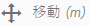
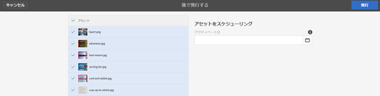
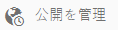

# デジタルアセットの管理 {#managing-assets-with-the-touch-optimized-ui}

AEM Assets のタッチ対応 UI で実行できる様々なアセット管理／編集タスクについて説明します。

この記事では、Adobe Experience Manager(AEM)アセットのタッチ操作向けユーザーインターフェイスを使用して、アセットを管理および編集する方法について説明します。 For an elementary knowledge about the user interface, see [Basic handling of Touch UI](/help/sites-authoring/basic-handling.md). To manage Content Fragments, see [Managing Content Fragments](content-fragments-managing.md) assets.

## フォルダーの作成 {#create-folders}

`Nature` に関するすべての画像などの、アセットのコレクションを構成する場合に、それらを保存するフォルダーを作成できます。フォルダーを使用すると、アセットを分類および整理できます。ただし、効率向上のためには必ずアセットをフォルダーで整理しなければならないということではありません。

>[!NOTE]
>
>* Sharing an Assets folder of the type `sling:OrderedFolder` is not supported when sharing to Marketing Cloud. フォルダーを共有する場合は、フォルダーを作成するときに「Ordered」を選択しないでください。
>* Experience Manager では、`subassets` をフォルダーの名前として使用することはできません。これは、複合アセットのサブアセットを含むノード用に予約されているキーワードです。

1. 新しいフォルダーを作成するデジタルアセットフォルダーの場所に移動します。
1. メニューで、「**[!UICONTROL 作成]**」をクリックします。「**[!UICONTROL 新規フォルダ]**」を選択します。
1. 「**[!UICONTROL タイトル]**」フィールドにフォルダー名を入力します。デフォルトでは、フォルダー名として指定したタイトルが使用されます。フォルダーが作成されると、デフォルトのフォルダー名を上書きして、別のフォルダー名を指定できます。
1. 「**[!UICONTROL 作成]**」をクリックします。作成したフォルダーがデジタルアセットフォルダーに表示されます。

以下の文字（スペース区切りリスト）はサポートされません。

* アセットファイル名に含めてはいけない文字：`* / : [ \ \ ] | # % { } ? &`
* アセットフォルダー名に含めてはいけない文字：`* / : [ \ \ ] | # % { } ? \" . ^ ; + & \t`

## アセットのアップロード {#uploading-assets}

様々な種類のアセット（画像、PDF ファイル、RAW ファイルなど）をローカルフォルダーやネットワークドライブから AEM Assets にアップロードできます。

>[!NOTE]
>
>Dynamic Media - Scene7 モードでは、ファイルサイズが 2 GB 以下のアセットのみアップロードできます。

アセットは、処理プロファイルが割り当てられたまたは割り当てられていないフォルダーにアップロードできます。

処理プロファイルが割り当てられているフォルダーの場合、プロファイル名がカード表示のサムネールに表示されます。リスト表示では、プロファイル名が「**[!UICONTROL 処理プロファイル]**」に表示されます。詳しくは、[処理プロファイル](processing-profiles.md)を参照してください。

アセットをアップロードする前に、アセットが [サポートされている形式であることを確認してください](assets-formats.md)。

**アセットをアップロードするには**:

1. アセットWebインターフェイスで、デジタルアセットを追加する場所に移動します。
1. アセットをアップロードするには、以下のいずれかの操作をおこないます。

   * ツールバーの「**[!UICONTROL 作成]**」アイコンをタップします。次に、メニューで「**[!UICONTROL ファイル]**」をタップします。表示されたダイアログで、必要に応じてファイル名を変更できます。
   * HTML5をサポートするブラウザーで、アセットをインターフェイス上に直接ドラッグします。 ファイル名を変更するためのダイアログは表示されません。

   

   複数のファイルを選択するには、ファイル選択ダイアログで、Ctrl キーまたは Command キーを押しながらアセットを選択します。iPadでは、一度に1つのファイルしか選択できません。

   サイズの大きなアセット（500 MB 超）のアップロードを一時停止して、同じページから後で再開できます。アップロードが開始されたら、プログレスバーの横に表示される&#x200B;**[!UICONTROL 一時停止]**&#x200B;アイコンをタップしてください。

   

   サイズが大きいと見なされるアセットのサイズは変更できます。例えば、（500 MB でなく）1000 MB を超えるサイズのアセットをサイズが大きいと見なすようにシステムを設定できます。この場合、1000 MB を超えるサイズのアセットをアップロードすると、プログレスバーに&#x200B;**[!UICONTROL 一時停止]**&#x200B;ボタンが表示されます。

   The **[!UICONTROL Pause]]**button does not show if a file greater than 1000 MB is uploaded with a file less than 1000 MB. ただし、1000 MB 未満のファイルのアップロードをキャンセルすると、**[!UICONTROL 一時停止&#x200B;]**ボタンが表示されます。

   To modify the size limit, configure the `chunkUploadMinFileSize` property of the `fileupload`node in the CRX repository.

   **[!UICONTROL 一時停止]**&#x200B;アイコンをクリックすると、**[!UICONTROL 再生]**&#x200B;アイコンに切り替わります。To resume uploading, click the **[!UICONTROL Play]** icon.

   

   To cancel an ongoing upload, click the `X` button beside the progress bar. アップロード処理をキャンセルすると、AEM Assets はアセットのアップロード済みの部分を削除します。

   アップロードを再開する機能は、帯域幅が狭く、ネットワークの誤作動によりサイズの大きなアセットのアップロードに時間がかかるシナリオで特に便利です。アップロード処理を一時停止して、後で状況が改善したときに処理を再開できます。再開すると、処理を一時停止した箇所からアップロードが開始されます。

   アップロード処理中、AEM はアップロード中の部分のアセットをデータのチャンクとして CRX リポジトリに保存します。アップロードが完了すると、AEM はリポジトリ内のチャンクを 1 つのブロックに統合します。

   To configure the cleanup task for the unfinished chunk upload jobs, go to `https://[aem_server]:[port]/system/console/configMgr/org.apache.sling.servlets.post.impl.helper.ChunkCleanUpTask`.

   アセットのアップロード先に既に存在するアセットと同じ名前のアセットをアップロードすると、警告ダイアログが表示されます。

   既存のアセットを置き換えるか、別のバージョンを作成するか、アップロードする新しいアセットの名前を変更して両方のアセットを残すかを選択できます。既存のアセットを置き換えると、アセットのメタデータと、以前に行われた変更および履歴（注釈、切り抜きなど）が削除されます。 両方のアセットを保持する場合は、新しいアセットの名前が変更されます。

   

   >[!NOTE]
   >
   >**[!UICONTROL 名前の競合]** ダイアログボックスで「置換 **** 」を選択すると、新しいアセットに対してアセットIDが再生成されます。 この ID は以前のアセットの ID とは異なります。
   >
   >If **[!UICONTROL Asset Insights]** is enabled to track impressions/clicks with Adobe Analytics, this regenerated asset ID invalidates the data-captured for the asset on Adobe Analytics.

   If the asset you upload exists in AEM Assets, the **[!UICONTROL Duplicates Detected]** dialog box warns that you are attempting to upload a duplicate asset. ダイアログは、既存のアセットのバイナリの SHA 1 チェックサムの値がアップロードするアセットのチェックサムの値と一致する場合にのみ表示されます。この場合、アセットの名前は重要ではありません。つまり、名前が異なるアセットでも、バイナリの SHA 1 の値が一致すれば、ダイアログが表示されることがあります。

   >[!NOTE]
   >
   >**[!UICONTROL 検出された重複項目]********[!UICONTROL ダイアログは、重複項目の検出機能が有効な場合にのみ表示されます。重複項目の検出機能を有効にするには、]**&#x200B;重複項目の検出の有効化[を参照してください。](duplicate-detection.md)

   

   Tap **[!UICONTROL Keep]** to retain the duplicate asset in AEM Assets. Tap  **[!UICONTROL Delete]** to delete the duplicate asset you uploaded.

   AEM Assets では、ファイル名に禁止文字が含まれるアセットをアップロードできません。許可されていない文字を含むアセットをアップロードしようとすると、ファイル名に使用できない文字が含まれていることに関する警告メッセージが表示され、AEM Assetsは、これらの文字を削除するか、許可されている名前でアップロードするまで、アップロードを停止します。

   To suit specific file naming conventions for your organization, the **[!UICONTROL Upload Assets]** dialog box lets you specify long names for the files that you upload.

   

   ただし、以下の文字（スペース区切りリスト）はサポートされていません。
   * アセットファイル名に含めてはいけない文字：`* / : [ \ \ ] | # % { } ? &`
   * アセットフォルダー名に含めてはいけない文字：`* / : [ \ \ ] | # % { } ? \" . ^ ; + & \t`

   In addition, the Assets interface displays the most recent asset that you upload or the folder you create first in all the views (**[!UICONTROL Card view]**, **[!UICONTROL List view]**, and **[!UICONTROL Column view]**).

   大きなアセットや複数のアセットを同時にアップロードする場合に、視覚的なインジケーターを使用すると、進行状況を評価できます。 The **[!UICONTROL Upload Progress]** dialog box displays the count of successfully uploaded files and the files that failed to upload.

   

   ファイルがアップロードされる前にアップロード操作をキャンセルすると、AEM Assets が現在のファイルのアップロードを停止し、コンテンツを更新します。ただし、既にアップロードされているファイルは削除されません。

### 順次アップロード {#serial-uploads}

多数のアセットを一括してアップロードすると、システムリソースが大量に消費されるので、AEMデプロイメントのパフォーマンスに悪影響を与える可能性があります。 潜在的なボトルネックは、インターネット接続、ディスク上での読み取り/書き込み操作、同時アセットのアップロード時のPOST要求数に関するWebブラウザの制限などです。 バルクアップロード操作は、失敗または途中で終了する可能性があります。 つまり、AEM Assets で多数のファイルを取り込むときに、一部のファイルを取り込めないことがあったり、まったくファイルを取り込めないことがあります。

この状況を回避するために、AEM Assets は一括アップロード操作時にすべてのアセットを同時に取り込まず、一度に 1 つずつアセットを取り込みます（順次アップロード）。

アセットの順次アップロードは、デフォルトで有効になっています。To disable the feature and allow concurrent uploading, overlay the `fileupload` node in CRXDe and set the value of the `parallelUploads` property to `true`.

### Upload assets using FTP {#uploading-assets-using-ftp}

ダイナミックメディアでは、FTPサーバーを使用してアセットのバッチアップロードが可能になります。 大きいアセット（1 GBを超える）をアップロードする場合、またはフォルダとサブフォルダ全体をアップロードする場合は、FTPを使用する必要があります。 定期的にFTPアップロードを行うように設定することもできます。

>[!NOTE]
>
>Dynamic Media - Scene7 モードでは、ファイルサイズが 2 GB 以下のアセットのみアップロードできます。

>[!NOTE]
>
>ダイナミックメディア — AEMオーサー上のScene7モードインストール機能パック(FP)18912で、FTP経由でアセットをアップロードするには FP-18912にアクセスし、FTPアカウントのセットアップを完了するには、Adobeカスタマーケアにお問い合わせください。 [一括アセット移行用の機能パック 18912 のインストール](/help/assets/bulk-ingest-migrate.md)を参照してください。アセットのアップロードに FTP を使用する場合、AEM で指定したアップロード設定は無視されます。代わりに、Dynamic Media Classic で定義したファイル処理ルールが使用されます。

**FTP によりアセットをアップロードするには**

1. 任意の FTP クライアントを使用して、プロビジョニングメールで受け取った FTP ユーザー名とパスワードで FTP サーバーにログインします。FTP クライアントで、ファイルやフォルダーを FTP サーバーにアップロードします。
1. プロビジョニングメールで受け取った資格情報で [Dynamic Media Classic にログイン](https://www.adobe.com/jp/marketing/experience-manager/scene7-login.html)します。グローバルナビゲーションバーの「**[!UICONTROL アップロード]**」をタップします。

1. On the **[!UICONTROL Upload]** page, near the upper-left corner, tap the **[!UICONTROL Via FTP]** tab.
1. ページの左側でファイルのアップロード元の FTP フォルダーを選択し、ページの右側でアップロード先のフォルダーを選択します。
1. Near the lower-right corner of the page, tap **[!UICONTROL Job Options]** and then set the options you want based on the assets in the folder you selected.

   [アップロードオプションを設定](#upload-job-options)を参照してください。

   >[!NOTE]
   >
   >FTP経由でアセットをアップロードする場合、ダイナミックメディアクラシック(Scene7)で設定したアップロードジョブオプションは、AEMで設定したアセット処理パラメータよりも優先されます。

1. In the lower-right corner of the **[!UICONTROL Upload Job Options]** dialog box, tap **[!UICONTROL Save]**.
1. In the lower-right corner of the **[!UICONTROL Upload]** page, tap **[!UICONTROL Submit Upload]**.

   アップロードの進行状況を確認するには、グローバルナビゲーションバーの「**[!UICONTROL ジョブ]**」をタップします。The **[!UICONTROL Jobs]** page displays the progress of the upload. ユーザーは、AEM で作業を続け、いつでも Dynamic Media Classic のジョブページに戻って進行中のジョブを確認できます。

   進行中のアップロードジョブをキャンセルするには、経過時間の横の「**[!UICONTROL キャンセル]****[!UICONTROL 」をタップします。]**

#### アップロードオプションを設定 {#upload-job-options}

| アップロードオプション | サブオプション | 説明 |
|---|---|---|
| Job Name |  | テキストフィールドにあらかじめ入力されるデフォルト名。ユーザーが入力した名前部分や日付と時刻のスタンプが含まれます。デフォルト名を使用するか、このアップロードジョブ用に独自に作成した名前を入力することができます。 このジョブと他のアップロードジョブや公開ジョブはジョブページに記録されます。ここでジョブのステータスを確認できます。 |
| アップロード後に公開 |  | アップロードしたアセットを自動的に公開します。 |
| 任意のフォルダーでベース名が同じファイルを上書き |  | アップロードするファイルと同じ名前のファイルが既にある場合にアップロードするファイルで置き換えるには、このオプションを選択します。このオプションの名前は、**[!UICONTROL アプリケーション設定]**／**[!UICONTROL 一般設定]**／**[!UICONTROL アプリケーションへのアップロード]**／**[!UICONTROL 画像を上書き]**&#x200B;での設定に応じて異なる可能性があります。 |
| アップロード時にZIPまたはTARファイルを解凍 |  |  |
| オプション |  | Tap/ click **[!UICONTROL Job Options]** to open the [!UICONTROL Upload Job Options] dialog box and choose options that affect the entire upload job. これらのオプションはすべてのファイルタイプで同じです。 アプリケーションの全般設定ページから、ファイルのアップロード用のデフォルトオプションを選択できます。このページを開くには、**[!UICONTROL セットアップ]**／**[!UICONTROL アプリケーション設定]**&#x200B;を選択します。Tap the **[!UICONTROL Default Upload Options]** button to open the [!UICONTROL Upload Job Options] dialog box. |
|  | 実行時 | 「一時」または「定期」を選択します。定期ジョブを設定するには、繰り返しオプション（毎日、毎週、またはカスタム）を選択し、FTP アップロードジョブを反復する頻度を指定します。次に、必要に応じてスケジューリングオプションを指定します。 |
|  | サブフォルダーを含める | アップロードしたいフォルダー内のすべてのサブフォルダーをアップロードします。アップロードするフォルダーとそのサブフォルダーの名前は AEM Assets に自動的に登録されます。 |
|  | 切り抜きツールオプション | 画像の端から手動で切り抜くには、切り抜きメニューを選択し、「手動」を選択します。次に、画像のいずれかの辺または各辺から切り抜くピクセル数を入力します。画像から切り抜かれる範囲は、画像ファイルの ppi（画素密度）設定に応じて異なります。例えば、画像が 150 ppi で表示されている場合に、「上」、「右」、「下」、「左」テキストボックスに 75 と入力すると、各辺から 0.5 inch ずつ切り抜かれます。 画像からホワイトスペースを自動的に切り抜くには、切り抜きメニューを開き、「手動」を選択し、「上」、「右」、「下」、「左」フィールドに画像の各辺から切り抜くピクセル数を入力します。また、切り抜きメニューで「トリミング」を選択し、以下のオプションを選択することもできます。  **トリミング対象カラー** <ul><li>**色** - 「色」オプションを選択します。 次に、隅メニューを選択し、切り抜きたいホワイトスペースの色を最も表現している色の画像の角を選択します。</li><li>****&#x200B;透明度 - 「透明度」オプションを選択します。  **許容値** — スライダをドラッグして、許容値を0 ～ 1の範囲で指定します。色に基づいてトリミングする場合は、0に設定すると、画像の隅で選択した色と正確に一致するピクセルのみが切り抜かれます。 1 に近いほど、色の違いに対する許容度が高くなります。  透明度に基づくトリミングでは、切り抜くピクセルが透明な場合のみ、0 を指定してください。1 に近いほど、不透明さに対する許容度が高くなります。</li></ul> これらの切り抜きツールオプションは、非破壊です（何度でも修正できます）。 |
|  | カラープロファイルオプション | 配信に使用される最適なファイルを作成するときのカラー変換を選択します。<ul><li>デフォルトの色保存：画像にカラースペース情報が含まれる場合はソース画像の色を保持します。カラー変換はおこなわれません。今日ほぼすべての画像に適切なカラープロファイルが埋め込まれています。ただし、CMYK のソース画像にカラープロファイルが埋め込まれていないと、色が standard Red Green Blue（sRGB）カラースペースに変換されます。sRGB は Web ページでの画像表示に最適なカラースペースです。</li><li>オリジナルカラースペースを維持：アップロード時にカラー変換をおこなわずに元の色を保持します。カラープロファイルが埋め込まれていない画像の場合、カラー変換はすべて、公開設定で設定したデフォルトのカラープロファイルを使用しておこなわれます。このカラープロファイルは、このオプションで作成したファイルのカラーと一致しない可能性があります。したがって、「デフォルトの色保存」オプションを使用することをお勧めします。</li><li>カスタム アップロード元／アップロード先  アップロード元とアップロード先のカラースペースを選択できるメニューが開きます。この詳細オプションは、ソースファイルに埋め込まれたカラー情報より優先されます。送信するすべての画像のカラープロファイルデータが正しくないか不足している場合に、このオプションを選択します。</li></ul> |
|  | 画像編集オプション | 画像のクリッピングマスクを保持し、カラープロファイルを選択できます。 [アップロード時の画像編集オプションの設定](#setting-image-editing-options-at-upload)を参照してください。 |
|  | Postscript オプション | PostScript® ファイルのラスタライズ、ファイルの切り抜き、透明背景の維持、解像度の選択、カラースペースの選択をおこなうことができます。 [PostScript および Illustrator のアップロードオプションの設定](#setting-postscript-and-illustrator-upload-options)を参照してください。 |
|  | Photoshop オプション | Adobe® Photoshop® ファイルからのテンプレート作成、レイヤーの維持、レイヤーの命名方法の指定、テキストの抽出、テンプレートへの画像のアンカー方法の指定をおこなうことができます。 テンプレートは AEM ではサポートされていません。 [Photoshop アップロードオプションの設定](#setting-photoshop-upload-options)を参照してください。 |
|  | PDF オプション | ファイルのラスタライズ、検索単語とリンクの抽出、eCatalog の自動生成、解像度の設定、カラースペースの選択をおこなうことができます。  eCatalogはAEMではサポートされていません。  [PDF アップロードオプションの設定](#setting-pdf-upload-options)を参照してください。 |
|  | Illustrator オプション | Adobe Illustrator® ファイルのラスタライズ、透明背景の維持、解像度の選択、カラースペースの選択をおこなうことができます。 [PostScript および Illustrator のアップロードオプションの設定](#setting-postscript-and-illustrator-upload-options)を参照してください。 |
|  | EVideo オプション | ビデオプリセットを選択して、ビデオファイルをトランスコードできます。 [eVideo アップロードオプションの設定](#setting-evideo-upload-options)を参照してください。 |
|  | バッチセットプリセット | アップロードしたファイルから画像セットまたはスピンセットを作成するには、使用したいプリセットの「アクティブ」列をクリックします。複数のプリセットを選択できます。プリセットは、Dynamic Media Classic のアプリケーション設定／バッチセットプリセットページで作成します。 バッチセットプリセットの作成について詳しくは、[画像セットとスピンセットの自動生成用のバッチセットプリセットの設定](config-dms7.md#creating-batch-set-presets-to-auto-generate-image-sets-and-spin-sets)を参照してください。 [アップロード時のバッチセットプリセットの設定](#setting-batch-set-presets-at-upload)を参照してください。 |

#### Set image editing options at upload {#setting-image-editing-options-at-upload}

When uploading image files, including AI, EPS, and PSD files, you can take the following editing actions in the **[!UICONTROL Upload Job Options]** dialog box:

* 画像の端の空白の切り抜き（上の表の説明を参照）
* 画像の側面から手動で切り抜く（上の表の説明を参照してください）。
* カラープロファイルを選択する（上の表でオプションの説明を参照してください）。
* クリッピングパスからマスクを作成する。
* アンシャープマスクオプションで画像にシャープニングを適用する
* ノックアウトの背景

| オプション | サブオプション | 説明 |
|---|---|---|
| クリッピングパスからマスクを作成 |  | クリッピングパス情報に基づいて画像のマスクを作成します。このオプションは、画像編集アプリケーションで作成された、クリッピングパスが作成されている画像に適用されます。 |
| アンシャープマスク |  | 最後のダウンサンプル済み画像でシャープニングフィルター効果を調整し、効果の強さと半径（ピクセル単位）および無視されるコントラストのしきい値を制御することができます。 この効果では、Photoshop のアンシャープマスクフィルターと同じオプションが使用されます。名前から連想される機能と違い、アンシャープマスクとはシャープニングフィルターのことです。「アンシャープマスク」の下で、必要なオプションを設定します。以下の説明に従ってオプションを設定します。 |
|  | 量 | 端のピクセルに適用するコントラストを制御します。 この量は、効果の強さと考えることができます。Dynamic Media と Adobe Photoshop での「アンシャープマスク」の値の主な違いは、Photoshop では範囲が 1%～500% である点です。一方、Dynamic Media では、値範囲は 0.0～5.0 です。5.0 という値は Photoshop の 500% にほぼ相当し、0.9 という値は 90% に相当するようになっています。 |
|  | 半径 | 効果の半径を制御します。値の範囲は 0～250 です。 効果は画像内の全ピクセルに切れ目なく続き、すべてのピクセルから全方向に放射されます。半径はピクセル単位です。例えば、2000 x 2000 ピクセルの画像と 500 x 500 ピクセルの画像で同じシャープニング効果を得たい場合、2000 x 2000 ピクセルの画像では半径を 2 ピクセルに設定し、500 x 500 ピクセルの画像では 1 ピクセルに設定します。ピクセル数の多い画像には大きい値を使用します。 |
|  | しきい値 | しきい値とは、アンシャープマスクフィルターの適用時に無視されるコントラストの範囲です。このフィルターの使用中に画像に「ノイズ」が加わるのを防ぐために重要です。値範囲は 0～255 で、グレースケール画像の明るさのステップ数です。0=黒、128=50% グレー、255=白です。  例えば、しきい値を12に設定すると、ノイズの追加を避けるため、肌のトーンの明るさの微妙な変化は無視されますが、まつげと皮膚が接触する場所などのコントラストの強い領域には、エッジのコントラストが追加されます。  例えば、ある人物の顔写真にアンシャープマスクを適用すると、まつげと皮膚が接触して明確なコントラストを作り出す場所など、画像の中でコントラストの強い部分に影響し、滑らかな肌自体も影響を受けます。 非常に滑らかな肌でも、明るさの値はわずかに変化しています。しきい値を使用しないと、このフィルターはこのような肌部分のピクセルのわずかな変化を強調します。同様に、まつげのコントラストを強めてシャープさを強調し、ノイズのある望ましくない効果を生み出してしまいます。 しきい値は、この問題を解決するために導入されたもので、フィルターに対し、滑らかな肌のようにコントラストが大きく変化しないピクセルは無視するよう指示します。 先ほど示したファスナーのグラフィックで、ファスナーの横の生地に注目してください。しきい値が低すぎてノイズを抑制できなかったので、画像ノイズが発生しています。 |
|  | モノクロ | 選択すると、画像の明るさ（強さ）にアンシャープマスクが適用されます。 選択を解除すると、それぞれの色成分に別々にアンシャープマスクが適用されます。 |
| ノックアウトの背景 |  | アップロード時に画像の背景を自動的に削除します。この技術は、特定の対象に注目を集め、賑やかな背景から際立たせるのに便利です。選択すると、ノックアウトの背景機能および以下のサブオプションが「オン」になります。 |
|  | 隅 | 必須. ノックアウトする背景色の定義に使用される画像の隅。 「**左上**」、「**左下**」、「**右上**」、「**右下**」から選択できます。 |
|  | 塗り方 | 必須. 設定した隅の位置からのピクセルの透明度を制御します。 以下の塗り方から選択できます。 <ul><li>**塗りつぶし** - 指定した隅と一致し、隣接しているすべてのピクセルを透明にします。</li><li>**一致ピクセル** - 画像内での場所に関係なく、一致するすべてのピクセルを透明にします。</li></ul> |
|  | 許容値 | オプション. 設定した隅の場所に基づいて、ピクセル色の一致に許容される差を制御します。 ピクセル色を正確に一致させるには値を 0.0 に、最大差を許容するには値を 1.0 にします。 |

#### Set PostScript and Illustrator upload options {#setting-postscript-and-illustrator-upload-options}

PostScript（EPS）または Illustrator（AI）画像ファイルのアップロード時に、様々な方法でファイルをフォーマットできます。ファイルのラスタライズ、透明背景の維持、解像度の選択、カラースペースの選択ができます。PostScript および Illustrator ファイルのフォーマットに関するオプションは、アップロードオプションを設定ダイアログボックスの「PostScript オプション」と「Illustrator オプション」の下にあります。

| オプション | サブオプション | 説明 |
|---|---|---|
| 処理中 |  | **[!UICONTROL ラスタライズ]**&#x200B;を選択して、ファイル内のベクターグラフィックスをビットマップ形式に変換します。 |
| レンダリングされた画像で透明な背景を保持する |  | ファイルの背景の透明度を維持します。 |
| 解決方法 |  | 解像度設定を決定します。この設定により、ファイル内の 1 inch あたりに表示するピクセル数を決定します。 |
| カラースペース |  | 「カラースペース」メニューを選択し、次のカラースペースオプションから選択します。 |
|  | 自動検出 | ファイルのカラースペースを保持します。 |
|  | RGB として強制 | RGB カラースペースに変換します。 |
|  | CMYKとしてレンダリング | CMYK カラースペースに変換します。 |
|  | グレースケールとして強制 | グレースケールカラースペースに変換します。 |

#### Photoshopアップロードオプションの設定 {#setting-photoshop-upload-options}

Photoshop Document（PSD）ファイルは、画像テンプレートの作成に最もよく使用されます。PSD ファイルをアップロードするときは、ファイルから画像テンプレートを自動的に作成できます（アップロード画面の「テンプレートを作成」オプションを選択します）。

レイヤーの含まれる PSD ファイルをテンプレートの作成に使用すると、Dynamic Media はこのファイルから複数の画像を作成します。1 レイヤーにつき 1 画像作成されます。

Use the **[!UICONTROL Crop Options]** and **[!UICONTROL Color Profile Options]**, described above, with Photoshop upload options.

>[!NOTE]
>
>テンプレートは AEM ではサポートされていません。

| オプション | サブオプション | 説明 |
|---|---|---|
| レイヤーを維持 |  | PSD にレイヤーがあれば切り離して個別のアセットにします。アセットレイヤーは PSD に関連付けられたまま維持されます。詳細ビューで PSD ファイルを開き、レイヤーパネルを選択して、これらを確認できます。 |
| テンプレートを作成 |  | PSD ファイル内のレイヤーからテンプレートを作成します。 |
| テキストを抽出 |  | テキストを抽出して、ユーザーがビューア内でテキストを検索できるようにします。 |
| レイヤーを背景サイズに拡大 |  | 切り離した画像レイヤーのサイズを、背景レイヤーのサイズに拡大します。 |
| レイヤーの名前 |  | PSD ファイル内のレイヤーを別々の画像としてアップロードします。 |
|  | レイヤー名 | PSD ファイル内のレイヤー名に従って画像に名前を付けます。例えば、元の PSD ファイルに Price Tag という名前のレイヤーがある場合、Price Tag という名前の画像になります。ただし、PSD ファイル内のレイヤー名がデフォルトの Photoshop レイヤー名（背景、レイヤー 1、レイヤー 2 など）である場合、画像の名前はデフォルトレイヤー名ではなく PSD ファイル内のレイヤー番号に従って付けられます。 |
|  | Photoshop とレイヤー番号 | PSD ファイル内のレイヤー番号に従って画像の名前を付け、元のレイヤー名は無視します。Photoshop ファイル名の後にレイヤー番号を付けたものが画像の名前になります。例えば、Spring Ad.psd というファイルの 2 番目のレイヤーは、Photoshop でデフォルト以外の名前が付いていたとしても Spring Ad_2 という名前になります。 |
|  | Photoshop とレイヤー名 | PSD ファイル名の後にレイヤー名またはレイヤー番号を付けた名前になります。PSD ファイル内のレイヤー名がデフォルトの Photoshop レイヤー名である場合、レイヤー番号が使用されます。例えば、SpringAd という名前の PSD ファイルに Price Tag という名前のレイヤーがある場合、Spring Ad_Price Tag という名前になります。レイヤー 2 というデフォルト名のレイヤーは Spring Ad_2 となります。 |
| アンカー |  | PSD ファイルから作成されたレイヤーコンポジションから生成されたテンプレートに画像がどのようにアンカーされるのかを指定します。デフォルトで、アンカーは中央です。中央アンカーにより、置換画像の縦横比に関わらず、置換画像で同じ領域をより適切に埋めることができます。この画像を置換する縦横比が異なる画像が、テンプレートの参照時やパラメーターの置き換えの使用時に、同じ領域を効果的に専有します。アプリケーションでテンプレート内の割り当てられた領域を置換画像で埋める必要がある場合、別の設定に変更してください。 |

#### PDFアップロードオプションの設定 {#setting-pdf-upload-options}

PDF ファイルのアップロード時に、様々な方法でファイルをフォーマットできます。ページの切り抜き、検索単語の抽出、ppi 解像度の入力、カラースペースの選択ができます。PDF ファイルにはトリミング余白、内トンボ、登録マーク、その他のプリンター用マークなどが含まれる場合があります。PDF ファイルのアップロード時に、ページの端からこれらのマークを切り抜くことができます。

>[!NOTE]
>
>eCatalog は AEM ではサポートされていません。

次のいずれかのオプションを選択します。

| オプション | サブオプション | 説明 |
|---|---|---|
| 処理中 | ラスタライズ | （デフォルト）PDF ファイルのページをリッピングし、ベクターグラフィックスをビットマップイメージに変換します。eCatalog を作成するには、このオプションを選択します。 |
| 抽出 | 検索ワード | PDF ファイルから単語を抽出し、eCatalog ビューア内でこのファイルをキーワード検索できるようにします。 |
|  | リンク | PDF ファイルからリンクを抽出し、eCatalog ビューアで使用できる画像マップに変換します。 |
| 複数ページの PDFから eCatalog を自動生成 |  | PDF ファイルから eCatalog を自動的に作成します。eCatalog の名前は、アップロードした PDF ファイルと同じになります。（このオプションは、アップロード時に PDF ファイルをラスタライズする場合にのみ使用できます。） |
| 解決方法 |  | 解像度設定を決定します。この設定により、PDF ファイル内の 1 inch あたりに表示するピクセル数を決定します。デフォルトは 150 です。 |
| カラースペース |  | 「カラースペース」メニューを選択し、PDF ファイルのカラースペースを選択します。ほとんどの PDF ファイルには、RGB と CMYK の両方のカラー画像が含まれています。RGB カラースペースはオンラインでの表示に適しています。 |
|  | 自動検出 | PDF ファイルのカラースペースを保持します。 |
|  | RGB として強制 | RGB カラースペースに変換します。 |
|  | CMYK として強制 | CMYK カラースペースに変換します。 |
|  | グレースケールとして強制 | グレースケールカラースペースに変換します。 |

#### eVideoアップロードオプションの設定 {#setting-evideo-upload-options}

様々なビデオプリセットから選択して、ビデオファイルをトランスコードできます。

| オプション | サブオプション | 説明 |
|---|---|---|
| アダプティブビデオ |  | モバイル、タブレットおよびデスクトップに配信するビデオを作成するための、すべての縦横比で機能する単一のエンコーディングプリセットです。 このプリセットでエンコードされたアップロード済みソースビデオは、固定の高さに設定されます。ただし、幅はビデオの縦横比を保持して自動的に拡大・縮小します。 ベストプラクティスは、アダプティブビデオエンコーディングを使用することです。 |
| シングルエンコーディングプリセット | エンコーディングプリセットの並べ替え | 「名前」または「サイズ」を選択して、「デスクトップ」、「モバイル」および「タブレット」に一覧表示されたエンコーディングプリセットを名前順または解像度サイズ順に並べ替えます。 |
|  | デスクトップ | ストリーミングビデオまたはプログレッシブビデオをデスクトップコンピュータに配信するMP4ファイルを作成します。解像度サイズとターゲットデータレートに応じて、1つ以上の縦横比を選択します。 |
|  | モバイル | iPhoneまたはAndroid携帯端末での配信用にMP4ファイルを作成します。解像度サイズとターゲットデータレートに応じて、1つ以上の縦横比を選択します。 |
|  | タブレットなど）のアクティブマーカーを確認する。 | iPadまたはAndroidタブレットデバイスで配信用のMP4ファイルを作成します。解像度サイズとターゲットデータレートを指定し、1つ以上の縦横比を選択します。 |

#### Set Batch Set Presets at upload {#setting-batch-set-presets-at-upload}

If you want to automatically create an Image Set or Spin Set from uploaded images, click the **[!UICONTROL Active** column for the preset you want to use. 複数のプリセットを選択できます。

バッチセットプリセットの作成について詳しくは、[画像セットとスピンセットの自動生成用のバッチセットプリセットの設定](config-dms7.md#creating-batch-set-presets-to-auto-generate-image-sets-and-spin-sets)を参照してください。

### ストリーミングアップロード {#streamed-uploads}

多数のアセットをアップロードする場合、AEM サーバーへの I/O 呼び出しが大幅に増加するので、アップロードの効率が低下し、タイムアウトが発生する場合もあります。AEM Assets はアセットのストリーミングアップロードをサポートします。ストリーミングアップロードにより、リポジトリにアセットをコピーする前にサーバーの一時フォルダーのアセットストレージを回避することで、アップロード操作中のディスクの I/O が低減します。代わりに、データはリポジトリに直接転送されます。これにより、サイズの大きいアセットのアップロードにかかる時間を抑え、タイムアウトが発生する可能性を減少することができます。AEM Assets では、ストリーミングアップロードはデフォルトで有効になっています。

ストリーミングアップロードは、servlet-api バージョンが 3.1 未満の JEE サーバー上で機能する AEM では無効です。

### アセットが含まれている ZIP アーカイブの抽出 {#extract-zip-archive-containing-assets}

ZIP アーカイブは、サポートされているその他のアセットと同じようにアップロードできます。ファイル名についても、同様のルールが ZIP ファイルに適用されます。AEM を使用すると、ZIP アーカイブを DAM の場所に抽出できます。

一度に 1 つの ZIP アーカイブを選択し、「**[!UICONTROL アーカイブの抽出]**」をクリックして、抽出先フォルダーを選択します。ファイルの重複に対処するためのオプションを選択します（該当する場合）。ZIP ファイル内のアセットが抽出先フォルダー内に既に存在する場合は、抽出をスキップする、既存のファイルを置き換える、名前を変更して両方のアセットを保持する、または新しいバージョンを作成する、のいずれかを選択できます。

抽出が完了すると、AEM は通知領域にメッセージを表示します。AEM が ZIP を抽出している間、抽出を中断することなく作業に戻ることができます。

この機能には、いくつかの制限があります。

* 抽出先に同じ名前のフォルダーが存在する場合、ZIP ファイル内のアセットは既存のフォルダーに抽出されます。

* 抽出をキャンセルしても、既に抽出されたアセットは削除されません。

* 2 つの ZIP ファイルを同時に選択して抽出することはできません。一度に抽出できる ZIP アーカイブは 1 つだけです。

## アセットのプレビュー {#previewing-assets}

**アセットをプレビューするには**:

1. アセットUIから、プレビューするアセットの場所に移動します。
1. 目的のアセットをタップして開きます。

1. プレビューモードでは、[サポートされている画像タイプ](assets-formats.md#supported-raster-image-formats)で（インタラクティブ編集中に）ズームオプションを使用できます。

   To zoom into an asset, tap **[!UICONTROL +]** (or tap the magnifying glass on the asset). To zoom out, tap **[!UICONTROL -]**. ズームインすると、パンニングによって画像の任意の場所を詳細に確認できます。「**[!UICONTROL ズームをリセット]**」矢印をクリックすると、元の表示に戻ります。

   

   **[!UICONTROL リセット]**&#x200B;ボタンをタップすると、表示を元のサイズに戻すことができます。

   

>[!MORELIKETHIS]
>
>* [プレビューダイナミックメディアアセット](/help/assets/previewing-assets.md)。
>* [サブアセットの表示](managing-linked-subassets.md#viewing-subassets).

## プロパティの編集 {#editing-properties}

1. メタデータを編集するアセットの場所に移動します。

1. Select the asset, and tap **[!UICONTROL Properties]** from the toolbar to view asset properties. または、アセットカードで&#x200B;**[!UICONTROL プロパティ]**&#x200B;クイックアクションを選択します。

   

1. **[!UICONTROL プロパティ]**&#x200B;ページの様々なタブで、メタデータのプロパティを編集します。例えば、「**[!UICONTROL 基本]**」タブでは、タイトルや説明などを編集します。

   **[!UICONTROL プロパティ]**&#x200B;ページのレイアウトと編集できるメタデータのプロパティは、基になるメタデータスキーマによって変わります。**[!UICONTROL プロパティ]**&#x200B;ページのレイアウトを変更する方法については、[メタデータスキーマ](metadata-schemas.md)を参照してください。

1. アセットをアクティベートする特定の日付と時間をスケジュールするには、「**[!UICONTROL オンタイム]**」フィールドの横にある日付選択を使用します。

   

1. To deactivate the asset after a particular duration, choose the deactivation date and time from the date picker beside the **[!UICONTROL Off Time]** field.

   アクティベートを解除する日付は、アセットに設定されたアクティベート日より後の日付にしてください。[!UICONTROL オフタイム]の経過後、アセットとそのレンディションは、Assets Web インターフェイスでも HTTP API でも使用できません。

   

1. 「**[!UICONTROL タグ]**」フィールドで、タグを 1 つ以上選択します。To add a custom tag, type the name of the tag in the box and press **[!UICONTROL Enter]**. 新しいタグが AEM に保存されます。

   YouTubeには、YouTubeに投稿するためのタグとYouTubeへのリンクが必要です（適切なリンクが見つかる場合）。
To create tags, you require write permission for `/content/cq:tags/default` in the CRX repository.

1. To provide a rating to the asset, tap the **[!UICONTROL Advanced]** tab and then tap the star at the appropriate position to assign the desired rating.

   

   アセットに割り当てた評価スコアは、「**[!UICONTROL あなたの評価]**」の下に表示されます。ユーザーによるアセットの評価の平均スコアは、「**[!UICONTROL 評価]**」の下に表示されます。さらに、平均評価スコアの評価スコアの内訳は、「**[!UICONTROL 評価分類]**」の下に表示されます。平均評価スコアに基づいてアセットを検索できます。

1. To view usage usage statistics for the asset, tap the **[!UICONTROL Insights]** tab.

   使用状況の統計には、次の情報が含まれています。

   * アセットが表示またはダウンロードされた回数。
   * アセットが使用されたチャネルまたはデバイス。
   * アセットが最近使用されたクリエイティブソリューション。

   詳しくは、[アセットインサイト](touch-ui-asset-insights.md)を参照してください。

1. 「**[!UICONTROL 保存して閉じる]**」をタップします。
1. Assets UI に移動します。タイトル、説明、評価など、編集されたメタデータプロパティは、カード表示のアセットカードと、リスト表示の関連する列に表示されます。

## アセットのコピー {#copying-assets}

アセットやフォルダーをコピーすると、そのアセットやフォルダーがコンテンツ構造と共にコピーされます。コピーされたアセットやフォルダーはコピー先に複製されます。コピー元にあるアセットは変更されません。

アセットの特定のコピーに一意に関連付けられる属性は継承されません。例えば、以下のものが該当します。

* アセット ID、作成日時、バージョン、バージョン履歴。これらのプロパティの一部は、`jcr:uuid`、`jcr:created`、`cq:name` プロパティによって示されます。

* 作成時間と参照パスは、各アセットとその各レンディションに対して一意です。

その他のプロパティとメタデータ情報は保持されます。アセットをコピーするときに、部分的なコピーが作成されることはありません。

1. From the Assets UI, select one or more assets, and then tap the **[!UICONTROL Copy]** icon from the toolbar. Alternatively, choose the **[!UICONTROL Copy]** quick action from the asset card.

   

   >[!NOTE]
   >
   >**[!UICONTROL コピー]**&#x200B;クイックアクションを使用した場合、一度にコピーできるアセットは 1 つだけです。

1. アセットをコピーする場所に移動します。

   >[!NOTE]
   >
   >同じ場所でアセットをコピーすると、AEM は自動的に名前のバリエーションを生成します。例えば、「Square」というタイトルのアセットをコピーすると、AEM は自動的にそのコピーのタイトルを「Square1」として生成します。

1. Tap the **[!UICONTROL Paste]** asset icon from the toolbar:

   

   アセットがこの場所にコピーされます。

   >[!NOTE]
   >
   >ツールバーの&#x200B;**[!UICONTROL 貼り付け]**&#x200B;アイコンが使用できるのは、貼り付け操作が完了するまでです。

### アセットの移動または名前変更 {#moving-or-renaming-assets}

1. 移動するアセットの場所に移動します。

1. Select the asset, and tap the **[!UICONTROL Move]** icon from the toolbar.

   

1. In the **[!UICONTROL Move Assets]** wizard, do one of the following:

   * 移動後のアセットの名前を指定します。Then tap **[!UICONTROL Next]** to proceed.
   * Tap **[!UICONTROL Cancel]** to stop the process.

   >[!NOTE]
   >
   >新しい場所に同じ名前のアセットがない場合は、同じ名前を指定できます。ただし、アセットの移動先に同じ名前のアセットが既に存在する場合は、別の名前を使用する必要があります。同じ名前を使用すると、その名前のバリエーションが自動的に生成されます。例えば、「Square」という名前のアセットの場合、自動的にそのコピーの名前が「Square1」として生成されます。

   >[!NOTE]
   >
   >以下の文字（スペース区切りリスト）はサポートされません。
   >* アセットファイル名に含めてはいけない文字：`* / : [ \ \ ] | # % { } ? &`
   >* アセットフォルダー名に含めてはいけない文字：`* / : [ \ \ ] | # % { } ? \" . ^ ; + & \t`

1. On the **[!UICONTROL Select Destination]** page, do one of the following:

   * Navigate to the new location for the assets, and then tap **[!UICONTROL Next]** to proceed.
   * Tap **[!UICONTROL Back]** to return to the **[!UICONTROL Rename]** page.

1. 移動されるアセットに参照ページ、アセット、コレクションがある場合は、「**[!UICONTROL 宛先を選択]**」タブの横に「**[!UICONTROL 参照を調整]**」タブが表示されます。

   Do one of the following on the **[!UICONTROL Adjust References]** page:

   * Specify the references to be adjusted based on the new details, and then tap **[!UICONTROL Move]** to proceed.
   * From the **[!UICONTROL Adjust]** column, select or deselect references to the assets.
   * Tap **[!UICONTROL Back]** to return to the **[!UICONTROL Select Destination]** page.
   * Tap **[!UICONTROL Cancel]** to stop the move operation.

   参照を更新しなければ、引き続きアセットの以前のパスが示されます。参照を調整すると、更新され、アセットの新しいパスが反映されます。

## レンディションの管理 {#managing-renditions}

1. アセットのレンディション（オリジナルを除く）を追加または削除できます。レンディションを追加または削除するアセットの場所に移動します。

1. アセットをタップして、アセットページを開きます。

   

1. グロー **[!UICONTROL バルナビゲーション]** アイコンをタップし、リストから「 **[!UICONTROL レンディション]** 」を選択します。

   

1. **[!UICONTROL レンディション]**&#x200B;パネルで、アセットに生成されたレンディションのリストを表示します。

   

   >[!NOTE]
   >
   >デフォルトで、AEM Assets はプレビューモードでアセットのオリジナルレンディションを表示しません。管理者の場合、オーバーレイを使用して AEM Assets を設定し、プレビューモードでもオリジナルレンディションを表示できます。

1. 表示または削除するレンディションを選択します。

   **レンディションの削除**

   Select a rendition from the **[!UICONTROL Renditions]** panel, and then tap the **[!UICONTROL Delete Rendition]** icon from the [toolbar](/help/sites-authoring/basic-handling.md). アセット処理の完了後は、レンディションを一括削除することはできません。個々のアセットについては、ユーザーインターフェイスからレンディションを手動で削除できます。複数のアセットの場合、Experience Managerをカスタマイズして、特定のレンディションを削除したり、アセットを削除して削除したアセットを再度アップロードしたりできます。

   

   **新しいレンディションのアップロード**

   Navigate to the asset details page for the asset, and tap the **[!UICONTROL Add Rendition]** icon in the toolbar to upload a new rendition for the asset.

   

   >[!NOTE]
   >
   >**[!UICONTROL レンディション]**&#x200B;パネルからレンディションを選択する場合、ツールバーのコンテキストが変わり、レンディションに関連するアクションのみが表示されます。Options, such as the **[!UICONTROL Upload Rendition]** icon is not displayed. これらのオプションをツールバーに表示するには、アセットの詳細ページに移動します。

   画像またはビデオアセットの詳細ページに表示するレンディションのサイズを設定できます。指定するサイズに基づいて、AEM Assets はレンディションを正確なサイズまたは最も近いサイズで表示します。

   To configure rendition dimensions of an image at the asset detail level, overlay the **[!UICONTROL renditionpicker]** node `libs/dam/gui/content/assets/assetpage/jcr:content/body/content/content/items/assetdetail/items/col1/items/assetview/renditionpicker` and configure the value of the width property. 画像サイズに基づいてアセットの詳細ページでレンディションをカスタマイズするには、幅の代わりに **[!UICONTROL size (Long) in KB]** プロパティを設定します。サイズベースのカスタマイズの場合、**[!UICONTROL preferOriginal]** プロパティを使用すると、一致するレンディションのサイズがオリジナルより大きい場合でも、オリジナルが優先されます。

   Similarly, you can customize the **[!UICONTROL Annotation]** page image by overlaying `libs/dam/gui/content/assets/annotate/jcr:content/body/content/content/items/content/renditionpicker`.

   

   To configure rendition dimensions for a video asset, navigate to the **[!UICONTROL videopicker]** node in the CRX repository at the location `/libs/dam/gui/content/assets/assetpage/jcr:content/body/content/content/items/assetdetail/items/col1/items/assetview/videopicker`, overlay the node, and then edit the appropriate property.

   >[!NOTE]
   >
   >ビデオの注釈は、HTML5 互換のビデオ形式に対応したブラウザーでのみサポートされます。また、ブラウザーによってサポートされるビデオ形式が異なります。

サブアセットについて詳しくは、サブアセットの [管理を参照してください](managing-linked-subassets.md)。

## アセットの削除 {#deleting-assets}

他のページからの入力参照を解決または削除するには、アセットを削除する前に、関連する参照を更新します。

また、オーバーレイを使用して「削除を強制」ボタンを無効にすることで、参照元のアセットの削除と壊れたリンクの放置を禁止します。

アセットを削除するには、dam/asset で削除権限が必要です。変更権限のみ付与されている場合、アセットのメタデータの編集とアセットへの注釈の追加のみが可能で、アセットやそのメタデータの削除は実行できません。

**アセットを削除するには**:

1. 削除するアセットの場所に移動します。

1. Select the asset, and tap the **[!UICONTROL Delete]** icon from the toolbar.

   

1. 確認ダイアログボックスで、次をタップします。

   * **[!UICONTROL キャンセル]**：アクションを停止します。
   * **[!UICONTROL 「削除]** 」では、次の条件に基づいてアクションを確認します。

      * アセットに参照がない場合は、アセットが削除されます。
      * If the asset has references, an error-message informs you that **[!UICONTROL One or more assets are referenced]**. You can select **[!UICONTROL Force Delete]** or **[!UICONTROL Cancel]**.

   >[!NOTE]
   >
   >他のページからの入力参照を解決または削除するには、アセットを削除する前に、関連する参照を更新します。
   >
   >Also, disable the **[!UICONTROL Force Delete]** button using an overlay, to disallow users from deleting referenced assets and leaving broken links.

## アセットのダウンロード {#downloading-assets}

See [Download assets from AEM](download-assets-from-aem.md)

## アセットの公開 {#publishing-assets}

処理中のアセットを公開した場合は、オリジナルのコンテンツのみが公開されます。処理中のレンディションは失われます。処理が完了するのを待ってから、処理が完了した後でアセットを公開または再公開します。

公開したいフォルダーに空のフォルダーが含まれる場合、空のフォルダーは公開されません。

For more information specific to Dynamic Media, see [Publishing Dynamic Media Assets](publishing-dynamicmedia-assets.md).

**アセットを公開するには**:

1. 公開するアセットまたはフォルダーの場所に移動します。

1. Either select the **[!UICONTROL Publish]** quick action from the asset card, or select the asset and tap the **[!UICONTROL Quick Publish]** icon from the toolbar.
1. アセットが他のアセットを参照する場合は、その参照がウィザードに表示されます。最後に公開または非公開になってから未公開または変更された参照のみが表示されます。 公開する参照を選択します。

   

1. Tap **[!UICONTROL Publish]** to confirm the activation for the assets.

## アセットの非公開 {#unpublishing-assets}

複雑なアセットを非公開にする場合は、アセットだけを非公開にします。参照は他の公開済みアセットから参照されている可能性があるので、非公開にしないでください。

**アセットを非公開にするには**:

1. 公開フォルダから削除する（非公開にする）アセット環境の場所に移動します。

1. Select the asset or folder to unpublish, and tap the **[!UICONTROL Manage Publication]** icon from the toolbar.

   

1. リストから「**[!UICONTROL 非公開]**」アクションを選択します。

   

1. 後でアセットを非公開にするには、「**[!UICONTROL 後で非公開にする]**」を選択して、アセットを非公開にする日付を選択します。
1. パブリッシュ環境でアセットを非公開にする日付をスケジュールします。
1. アセットが他のアセットを参照する場合は、非公開にする参照を選択します。Tap **[!UICONTROL Unpublish]**.
1. 確認ダイアログボックスで、次のいずれかの操作を行います。

   * Tap **[!UICONTROL Cancel]** to stop the action
   * Tap **[!UICONTROL Unpublish]** to confirm that the assets are unpublished (no longer available on the publish environment) at the specified date.

## Create a Closed User Group {#closed-user-group}

CUG(Closed User Group)は、AEMから発行された特定のアセットフォルダーへのアクセスを制限するために使用します。 フォルダーに対して CUG を作成すると、そのフォルダー（フォルダーのアセットとサブフォルダーを含む）へのアクセスは、割り当てられたメンバーまたはグループのみに制限されます。フォルダーにアクセスするには、セキュリティ資格情報を使用してログインする必要があります。

CUGは、アセットへのアクセスを制限する追加の方法です。 また、フォルダーのログインページを設定することもできます。

**閉じたユーザー・グループを作成するには**:

1. Select a folder from the Assets UI, and tap the **[!UICONTROL Properties]** icon from the toolbar to display the properties page.
1. 「**[!UICONTROL 権限]**」タブで、「**[!UICONTROL 閉じられたユーザーグループ]**」の下でメンバーまたはグループを追加します。

   

1. ユーザーがフォルダーにアクセスしたときにログイン画面を表示するには、「**[!UICONTROL 有効]**」オプションを選択します。次に、AEM 内のログインページへのパスを選択し、変更を保存します。

   

   ログインページへのパスを指定しないと、AEM はパブリッシュインスタンスでデフォルトのログインページを表示します。

1. フォルダーを公開し、パブリッシュインスタンスからアクセスすると、ログイン画面が表示されます。
1. CUG メンバーの場合は、自分のセキュリティ資格情報を入力します。AEM によって認証されると、フォルダーが表示されます。

## アセットの検索 {#searching-assets}

基本的な検索については、[検索とフィルター](/help/sites-authoring/search.md#search-and-filter)で詳しく説明します。Use the **[!UICONTROL Search]** panel to search for assets, tags, and metadata. You can search parts of a string using the wildcard asterisk. In addition, you can customize the **[!UICONTROL Search]** panel using [Search facets](search-facets.md).

最近アップロードしたアセットのメタデータ（タイトル、タグなど）は、「Omnisearch」ボックスに入力したときに表示されるサーチクエリのリストではすぐに使用できません。

これは、AEM Assets ではタイムアウト期間（デフォルトは 1 時間）が経過してから、新しくアップロードまたは更新されたすべてのアセットのメタデータにインデックスを付け、候補のリストに追加するバックグラウンドジョブが実行されるからです。

## クイックアクションの使用 {#quick-actions}

クイックアクションのアイコンは、一度に 1 つのアセットに対してのみ利用できます。デバイスに応じて、次の操作を実行してクイックアクションアイコンを表示します。

* タッチデバイス：タッチ＆ホールド。例えば iPad では、アセットをタップ＆ホールドするとクイックアクションが表示されます。
* 非タッチデバイス：マウスポインターで指す。例えばデスクトップデバイスでは、アセットのサムネールをマウスポインターで指すとクイックアクションバーが表示されます。

### アセットに移動して選択します。 {#navigating-and-selecting-assets}

You can view, navigate through, and select assets with any of the available views (card, column, list) using the **[!UICONTROL Select]** icon. **[!UICONTROL 「選択」は]** 、カード表示にクイックアクションとして表示されます。

In list view, **[!UICONTROL Select]** appears when you hover the mouse icon over the thumbnail before the names of the assets/folder in the list.

Similar to list view, **[!UICONTROL Select]** appears when you hover the mouse icon over the thumbnail before the names of the assets or folder in column view.

For more information, see [Viewing and Selecting your Resources](/help/sites-authoring/basic-handling.md#viewing-and-selecting-resources).

## 画像の編集 {#editing-images}

AEM Assets インターフェイスの編集ツールを使用すると、画像アセットで細かい編集ジョブを実行できます。画像に対して切り抜き、回転、反転などの編集ジョブを実行できます。アセットに画像マップを追加することもできます。

次の形式のファイルの画像編集がサポートされています。

* BMP
* GIF
* PNG
* JPEG

For some components, **[!UICONTROL Full Screen]** mode has additional options available.

To edit a TXT file, set **[!UICONTROL Day CQ Link Externalizer]** from within Configuration Manager.

画像エディターを使用して画像マップを追加することもできます。詳しくは、[画像マップの追加](image-maps.md)を参照してください。

**画像を編集するには**:

1. 編集モードでアセットを開くには、次のいずれかの操作をおこないます。

   * Select the asset and then click the **[!UICONTROL Edit]** icon in the toolbar.
   * カード表示のアセットに表示する「 **[!UICONTROL 編集]** 」オプションをタップします。
   * In the asset page, tap the **[!UICONTROL Edit]** icon in the toolbar.

   

1. 画像を切り抜くには、「切り抜き ****」をタップします。

   

1. リストから必要なオプションを選択します。選択したオプションに基づいて、画像に切り抜き領域が表示されます。「**[!UICONTROL フリーハンド]**」オプションを使用すると、縦横比の制限に関係なく画像を切り抜くことができます。

   

1. 切り抜く領域を選択し、画像上でサイズ変更または位置変更を行います。
1. 画像を切り抜くには、右上隅の **[!UICONTROL 「終了]** 」オプションを使用します。 「 **[!UICONTROL 完了]** 」をタップすると、レンディションの再生成も行われます。

   

1. Use the **[!UICONTROL Undo]** and **[!UICONTROL Redo]** icons on the top right to revert to the un-cropped image or retain the cropped image, respectively.

   

1. Tap the appropriate **[!UICONTROL Rotate]** icon to rotate the image clockwise or anti-clockwise.

   

1. Tap the appropriate **[!UICONTROL Flip]** icon to flip the image horizontally or vertically.

   

1. Tap the **[!UICONTROL Finish]** icon to save the changes.

   

## タイムラインの使用 {#timeline}

The **[!UICONTROL Timeline]** lets you view various events for a selected item, such as active workflows for an asset, comments, annotations, activity logs, and versions.

[コレクションコンソール](managing-collections-touch-ui.md#navigating-the-collections-console)の&#x200B;**[!UICONTROL すべて表示]**&#x200B;リストには、コメントとワークフローだけを表示するオプションがあります。さらに、タイムラインはコンソールにリストされているトップレベルのコレクションについてのみ表示されます。これらのコレクション内を移動する場合、タイムラインは表示されません。

**[!UICONTROL タイムライン]** には、コンテンツフラグメントに固有の [オプションがいくつか含まれています](content-fragments-managing.md#timeline-for-content-fragments)。 この機能には、AEM 6.4 [Service Pack 2(6.4.2.0)](/help/release-notes/sp-release-notes.md) 以降が必要です。

**タイムラインを使用するには**:

1. アセットのアセットページを開くか、Assets UI でアセットページを開きます。
1. グロー **[!UICONTROL バルナビゲーション]** アイコンをタップし、リストから「 **** タイムライン」を選択します。

   

1. リストが表示されたら、「**[!UICONTROL すべて表示]**」リストを使用し、コメント、バージョン、ワークフローおよびアクティビティに基づいて、結果を絞り込みます。

   

## 注釈を追加 {#annotating}

注釈とは、画像やビデオに追加するコメントまたは注記です。マーケティング担当者は、注釈により、アセットについてコラボレーションし、フィードバックを残すことができます。

ビデオの注釈は、HTML5 互換のビデオ形式に対応したブラウザーでのみサポートされます。AEM Assets がサポートするビデオの形式は、ブラウザーによって異なります。

For Content Fragments, [annotations are created in the editor](content-fragments-variations.md#annotating-a-content-fragment); this functionality requires [AEM 6.4 Service Pack 2 (6.4.2.0)](/help/release-notes/sp-release-notes.md) or later.

複数の注釈を追加してから、それらを保存できます。

ビデオアセットに注釈を追加できます。 ビデオに注釈を追加する際は、ユーザーがフレームに注釈を追加できるようにプレーヤーが一時停止します。詳しくは、[ビデオアセットの管理](managing-video-assets.md)を参照してください。

コレクションにも注釈を追加できます。ただし、コレクションに子コレクションが含まれる場合は、親コレクションにのみ注釈やコメントを追加できます。 The **[!UICONTROL Annotate]** option is not available for child collections.

**注釈を追加するには**:

1. 注釈を追加するアセットの場所に移動します。
1. Tap the **[!UICONTROL Annotate]** icon from one of the following:

   * [クイックアクション](managing-assets-touch-ui.md#quick-actions)
   * アセットを選択した後またはアセットページに移動した後に、ツールバーから

   

1. タイムラインの一番下の&#x200B;**[!UICONTROL コメント]**&#x200B;ボックスにコメントを追加します。Alternatively, mark up an area on the image and add an annotation in the **[!UICONTROL Add Annotation]** dialog box.

   

1. 注釈についてユーザーに通知するには、ユーザーの電子メールアドレスを指定して、コメントを追加します。例えば、注釈をアーロン・マクドナルドに通知するには、@aaと入力します。 一致するすべてのユーザーに関するヒントがリストに表示されます。リストからアーロンの電子メールアドレスを選択し、コメントのタグを付けます。 同様に、注釈内の任意の場所、またはコメントの前後で追加のユーザーにタグ付けできます。

   >[!NOTE]
   >
   >管理者以外のユーザーには、CRXDE で `/home` に読み取り権限がある場合にのみ候補が表示されます。

   

1. After adding the annotation, tap **[!UICONTROL Add]** to save it. 注釈に関する通知が Aaron に送信されます。

   

1. 「 **[!UICONTROL 閉じる]** 」をタップして **[!UICONTROL 注釈]** モードを終了します。
1. To view the notification, log in to AEM Assets with Aaron MacDonald&#39;s credentials and tap the **[!UICONTROL Notifications]** icon to view the notification.

1. To choose a different color so you can differentiate between users, tap the **[!UICONTROL Profile]** icon and tap **[!UICONTROL My Preferences]**.

   

1. Specify the desired color in the **[!UICONTROL Annotation Color]** box, then tap **[!UICONTROL Accept]**.

   

### 保存された注釈の表示 {#viewing-saved-annotations}

1. アセットに対して保存された注釈を表示するには、アセットの場所に移動して、そのアセットのアセットページを開きます。

1. グロー **[!UICONTROL バルナビゲーション]** アイコンをタップし、リストから「 **[!UICONTROL タイムライン]** 」をタップします。

   

1. タイムラインの「**[!UICONTROL すべて表示]**」のリストから「**[!UICONTROL コメント]**」を選択し、注釈に基づいて結果にフィルターを適用します。

   

1. Tap a comment in the **[!UICONTROL Timeline]** panel to view the corresponding annotation on the image.

   

1. Tap **[!UICONTROL Delete]** to remove a particular comment.

### 注釈の印刷 {#printing-annotations}

アセットに注釈がある場合や、レビューワークフローの対象になっている場合は、オフラインでのレビュー用に注釈とレビューステータス付きでアセットを PDF ファイルとして印刷できます。

注釈またはレビューステータスのみ印刷することも選択できます。

長い注釈は PDF ファイルに適切にレンダリングされない可能性があります。最適なレンダリングのために、注釈を 50 語以内に制限することをお勧めします。

To print the annotations and review status, tap the **[!UICONTROL Print]** icon and follow the instructions in the wizard. **[!UICONTROL 印刷]**&#x200B;アイコンは、アセットに注釈またはレビューステータスが少なくとも 1 つ割り当てられている場合にのみ、ツールバーに表示されます。

1. Assets UI から、アセットのプレビューページを開きます。
1. 次のいずれかの操作をおこないます。

   * すべての注釈とレビューステータスを印刷するには、手順4に進みます。
   * To print specific annotations and review status, open the [Timeline](managing-assets-touch-ui.md#timeline) and then proceed to step 3.

1. To print specific annotations, select the annotations from the **[!UICONTROL Timeline]**.

   

   To print the review status only, select it from the **[!UICONTROL Timeline]**.

   

1. On the toolbar, tap the **[!UICONTROL Print]** icon.

   

1. From the **[!UICONTROL Print]** dialog box, choose the position you want the annotations or review status to display on the PDF. For example, if you want the annotations or status to print at the top-right of the page that contains the printed image, use the **[!UICONTROL Top-Left]** (default) setting.

   

   注釈やステータスを印刷したPDFに表示する位置に応じて、その他の設定を選択できます。 If you want the annotations or status to appear in a page that is separate from the printed asset, choose **[!UICONTROL Next Page]**.

1. Tap **[!UICONTROL Print]**. 手順2で選択したオプションに応じて、生成されるPDFには、注釈またはステータスが指定した位置に表示されます。 例えば、注釈とレビューステータスの両方を「**[!UICONTROL 左上]**」設定を使用して印刷することを選択した場合、生成される PDF ファイルは次のようになります。

   

1. 右上のオプションを使用して PDF をダウンロードまたは印刷します。

   

   >[!NOTE]
   >
   >アセットにサブアセットがある場合、特定のページに関する注釈と共にすべてのサブアセットを印刷できます。

   To modify the appearance of the rendered PDF file, for example the font color, size, and style, background color of the comments and statuses, open the **[!UICONTROL Annotation PDF configuration]** from **[!UICONTROL Configuration Manager]**, and modify the desired options. 例えば、承認済みステータスの表示色を変更したり、対応フィールドのカラーコードを変更したりします。注釈のフォントカラーの変更について詳しくは、[注釈](managing-assets-touch-ui.md#annotating)を参照してください。

   

   レンダリングされた PDF ファイルに戻り、更新します。更新された PDF に、変更が反映されています。

**外国語で注釈を印刷するには**:
アセットに外国語（特にラテン語以外の言語）の注釈が含まれる場合は、まずAEMサーバーでCQ-DAM-Handler-Gibson Font Manager Serviceを設定し、これらの注釈を印刷できるようにする必要があります。 CQ-DAM-Handler-Gibson Font Manager サービスの設定では、必要な言語のフォントがある場所を指定します。

1. Open the **[!UICONTROL CQ-DAM-Handler-Gibson Font Manager Service]** configuration page from the URL [https://&lt;server>:&lt;port>/system/console/configMgr/com.day.cq.dam.handler.gibson.fontmanager.impl.FontManagerServiceImpl](http://localhost:4502/system/console/configMgr/com.day.cq.dam.handler.gibson.fontmanager.impl.FontManagerServiceImpl).
1. **[!UICONTROL CQ-DAM-Handler-Gibson Font Manager Serviceを設定するには、次のいずれかを実行します]**。

   * In the **[!UICONTROL System Fonts]** directory option, specify the complete path to the fonts directory on your system. For example, if you&#39;re a Mac user, you can specify the path as `/Library/Fonts` in the **[!UICONTROL System Fonts]** directory option. AEM はこのディレクトリからフォントを取得します。
   * **[!UICONTROL crx-quickstart]** フォルダー内に **fonts** という名前のディレクトリを作成する。**[!UICONTROL CQ-DAM-Handler-Gibson Font Manager Service]** は、この場所のフォントを自動的に取得し `crx-quickstart/fonts`ます。 You can override this default path from within the **[!UICONTROL Adobe Server Fonts]** directory option.
   * システムにフォント用の新しいフォルダーを作成し、必要なフォントをこのフォルダーに保存する。Then, specify the complete path to that folder in the **[!UICONTROL Customer Fonts]** directory option.

1. Access the **[!UICONTROL Annotation PDF]** configuration from the URL [https://&lt;server>:&lt;port>/system/console/configMgr/com.day.cq.dam.core.impl.annotation.pdf.AnnotationPdfConfig](http://localhost:4502/system/console/configMgr/com.day.cq.dam.core.impl.annotation.pdf.AnnotationPdfConfig).
1. Configure the **[!UICONTROL Annotation PDF]** with the correct set of font-family as follows:

   * 文字列 `<font_family_name_of_custom_font, sans-serif>` をフォントファミリオプションに含めます。例えば、注釈を CJK（中国語、日本語、韓国語）で印刷したい場合、フォントファミリオプションに文字列 `Arial Unicode MS, Noto Sans, Noto Sans CJK JP, sans-serif` を含めます。ヒンディー語の注釈を印刷したい場合、適切なフォントをダウンロードし、フォントファミリを Arial Unicode MS, Noto Sans, Noto Sans CJK JP, Noto Sans Devanagari, sans-serif として設定します。

1. AEM インスタンスを再起動します。

次の例は、AEMでCJK（中国語、日本語および韓国語）で注釈を印刷するように設定する方法を示しています。

1. 以下のリンクから Google Noto CJK フォントをダウンロードし、Font Manager サービスで設定したフォントディレクトリに保存します。

   * All In One Super CJK フォント：[https://www.google.com/get/noto/help/cjk/](https://www.google.com/get/noto/help/cjk/)
   * Noto Sans（欧文用）：[https://www.google.com/get/noto/](https://www.google.com/get/noto/)
   * 選択した言語用の Noto フォント：[https://www.google.com/get/noto/](https://www.google.com/get/noto/)

1. フォントファミリパラメーターを `Arial Unicode MS, Noto Sans, Noto Sans CJK JP, sans-serif` に設定して、注釈 PDF ファイルを設定します。この設定はデフォルトで使用でき、すべての欧文および CJK 言語で機能します。
1. 選択した言語が手順 2 の言語と異なる場合は、デフォルトフォントファミリに適切なエントリを（コンマで区切って）追加してください。

## アセットのバージョン管理の作成 {#asset-versioning}

バージョン管理では、特定の時点でのデジタルアセットのスナップショットが作成されます。バージョン管理を使用すると、後で、以前の状態にアセットを復元できます。例えば、アセットに対しておこなった変更を取り消したい場合、バージョン管理を使用して未編集のバージョンにアセットを復元できます。

バージョンを作成するシナリオは次のとおりです。

* 別のアプリケーションで画像を変更し、AEM Assets にアップロードします。元の画像が上書きされないように画像のバージョンが作成されます。
* アセットのメタデータを編集します。
* 既存のアセットをチェックアウトしたり変更を保存したりするには、AEM デスクトップアプリケーションを使用します。アセットを保存するたびに、新しいバージョンが作成されます。

また、ワークフローを使用して、自動バージョン管理を有効にすることもできます。アセットのバージョンを作成すると、バージョンと共にメタデータとレンディションが保存されます。レンディションによって、同じ画像の代替となる画像が表示されます（例えば、アップロードされた JPEG ファイルの PNG レンディション）。

バージョン管理機能を使用すると、次の操作を実行できます。

* アセットのバージョンを作成する。
* アセットの現在のリビジョンを表示する。
* 以前のバージョンにアセットを復元する。

**アセットのバージョン管理を作成するには**:

1. バージョンを作成するアセットの場所に移動し、そのアセットページを開きます。

1. Click the **[!UICONTROL Global Navigation]** icon, and the choose **[!UICONTROL Timeline]** from the menu.

   

1. Click **[!UICONTROL Actions]** at the bottom to view the available actions you can perform on the asset.

1. 「**[!UICONTROL 保存するバージョン]**」をクリックして、アセットのバージョンを作成します。

   

1. ラベルとコメントを追加し、「**[!UICONTROL 作成]**」をクリックしてバージョンを作成します。Alternatively, tap **[!UICONTROL Cancel]** to exit the operation.

   

1. To view the new version, open the **[!UICONTROL Show All]** list in the timeline from the asset details page or the [!DNL Assets] interface, and choose **[!UICONTROL Versions]**.

   

1. アセットの特定のバージョンを選択してプレビューするか、Assets UI に表示されるように設定します。

   

   >[!NOTE]
   >
   >You can also select the asset from the [List view](/help/sites-authoring/basic-handling.md#viewing-and-selecting-resources) or the [Column view](/help/sites-authoring/basic-handling.md#viewing-and-selecting-resources).

1. Assets UI で特定のバージョンに戻すバージョンに、ラベルとコメントを追加します。

   

1. To generate a preview for the version, click **[!UICONTROL Preview Version]**.
1. Assets UI でこのバージョンを表示するには、「**[!UICONTROL このバージョンに戻す]**」を選択します。
1. 2つのバージョンを比較するには、アセットのアセットページに移動し、現在のバージョンと比較するバージョンをクリックします。

   

1. タイムラインで、比較するバージョンを選択し、スライダーを左にドラッグして、現在のバージョンの上にこのバージョンを重ねて表示して比較します。

   

### Start a workflow on an asset {#starting-a-workflow-on-an-asset}

See [apply a workflow to an AEM asset](/help/assets/assets-workflow.md#apply-a-workflow-to-an-aem-asset).

## コレクションについて {#collections}

コレクションとは、一連のアセットを順序よく並べたものです。コレクションを使用して、ユーザー間でアセットを共有します。

* 1 つのコレクションにはアセットへの参照のみが含まれるので、様々な場所のアセットを含めることができます。各コレクションは、アセットの参照整合性を維持します。
* コレクションは、特権レベル（編集、表示など）の異なる複数のユーザー間で共有できます。

ユーザーは複数のコレクションにアクセスできます。コレクションは、アセットを照合する方法に基づいて次のタイプに分かれます。

* A collection with a **static reference list** of assets, folders, and other collections.

* A collection that uses a **search criteria** and dynamically populates assets based on the criteria. This is called a **Smart Collection**.

See [Manage Collections](managing-collections-touch-ui.md) for details on collection management.

>[!NOTE]
>
>アセットを作成または編集するには、アカウントに対する適切なアクセス権限が必要です。
