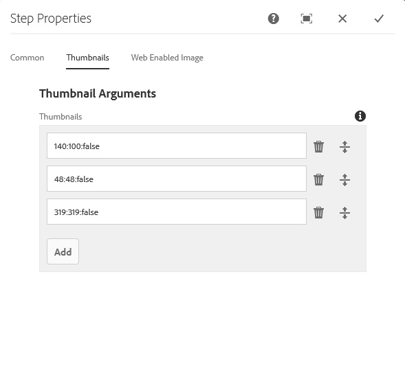
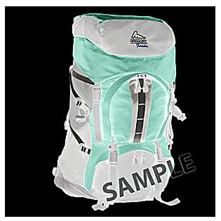
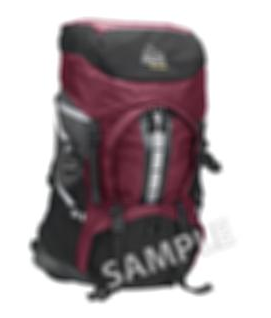

# Dynamic Media 画像プリセットの管理 {#managing-image-presets}

>[!CAUTION]
>
>AEM 6.4 の拡張サポートは終了し、このドキュメントは更新されなくなりました。 詳細は、 [技術サポート期間](https://helpx.adobe.com/jp/support/programs/eol-matrix.html). サポートされているバージョンを見つける [ここ](https://experienceleague.adobe.com/docs/?lang=ja).

画像プリセットを使用すると、AEM Assets は異なるサイズや異なる形式の画像、あるいは動的に生成された他の画像プロパティを設定した画像を動的に配信できます。各画像プリセットは、画像を表示するためのサイズとフォーマットに関するコマンドの事前定義済みのコレクションを表します。 画像プリセットを作成する際に、画像配信のサイズを選択します。 また、画像が表示用に配信される際に、画像の外観が最適化されるように、書式設定コマンドを選択します。

管理者は、アセットを書き出すためのプリセットを作成できます。ユーザは、画像を書き出す際にプリセットを選択できます。また、管理者が指定した仕様に合わせて画像が再フォーマットされます。

レスポンシブな画像プリセットを作成することもできます。レスポンシブな画像プリセットをアセットに適用すると、アセットが表示されるデバイスや画面サイズに応じて変化します。 画像プリセットは、RGB またはグレーに加えて CMYK をカラースペースで使用するよう設定できます。

この節では、画像プリセットの作成、変更および一般的な管理方法について説明します。 作成者は画像をプレビューするときに、いつでも画像プリセットを適用できます。詳しくは、[画像プリセットの適用](image-presets.md)を参照してください。

>[!NOTE]
>
>スマートイメージングは、既存の画像プリセットで機能し、配信の直前にインテリジェンスを使用して、ブラウザーまたはネットワークの接続速度に基づいて画像のファイルサイズをさらに低減します。詳しくは、[スマートイメージング](imaging-faq.md)を参照してください。

## Dynamic Media 画像プリセットを理解する {#understanding-image-presets}

画像プリセットは、ソフトウェアマクロと同様に、サイズとフォーマットに関するコマンドの事前定義済みのコレクションで、名前を付けて保存されます。 画像プリセットの動作を理解するために、Web サイトで、デスクトップとモバイルでの配信用に、各製品画像を異なるサイズ、異なる形式、圧縮率で表示する必要があるとします。

次の 2 つの画像プリセットを作成できます。デスクトップバージョンの場合は 500 x 500 ピクセル、モバイルバージョンの場合は 150 x 150 ピクセルです。 次の名前の 2 つの画像プリセットを作成します。 *拡大* 500 x 500 ピクセルで表示するために *サムネール* 150 x 150 ピクセルで画像を表示する。 拡大およびサムネールサイズで画像を配信する場合、AEMでは「拡大画像プリセット」と「サムネール画像プリセット」の定義を検索します。 その後、AEM は各画像プリセットのサイズと形式の仕様に従って画像を動的に生成します。

動的に配信される際にサイズが縮小された画像は、シャープさとディテールが失われる可能性があります。 このため、各画像プリセットには、特定のサイズで配信される場合に画像を最適化するための書式設定コントロールが含まれています。 これらのコントロールを使用すると、画像が Web サイトやアプリケーションに配信される際に、シャープで明確な画像を生成できます。

管理者は画像プリセットを作成できます。 画像プリセットを作成するには、最初から開始するか、既存のプリセットから開始して新しい名前で保存します。

## Dynamic Media 画像プリセットの管理 {#managing-image-presets-1}

AEMで画像プリセットを管理するには、AEMのロゴをタップしてグローバルナビゲーションコンソールにアクセスし、ツールアイコンをタップして次の場所に移動します。 **[!UICONTROL アセット/画像プリセット]**.


>[!NOTE]
>
>作成した画像プリセットは、アセットをプレビューまたは配信する際の動的レンディションとしても使用できます。
>
>In *Dynamic Media - Scene7モード*、 *not* 画像プリセットが自動的に公開されるので、画像プリセットを公開する必要があります。
>
>In *Dynamic Media — ハイブリッドモード*&#x200B;画像プリセットを手動で公開する必要があります。
>
>[画像プリセットの公開](#publishing-image-presets)を参照してください。

>[!NOTE]
>
>「 **[!UICONTROL レンディション]** 資産の **[!UICONTROL 詳細]** 表示。 表示される画像プリセットの数を増減させることができます。[表示される画像プリセット数の引き上げ](#increasing-or-decreasing-the-number-of-image-presets-that-display)を参照してください。

### Adobe Illustrator（AI）、Postscript（EPS）および PDF のファイル形式 {#adobe-illustrator-ai-postscript-eps-and-pdf-file-formats}

AI、EPS、PDFの各ファイル形式の動的レンディションを生成できるように、AI、AI の取り込みをサポートする場合、画像プリセットを作成する前に次の情報を確認する必要があります。

Adobe Illustrator のファイル形式は PDF のバリアントです。AEM Assetsの主な違いは次のとおりです。

* Adobe Illustrator のドキュメントは複数のレイヤーを持つ単一のページで構成されます。各レイヤーは、メインのIllustratorアセットの下に PNG サブアセットとして抽出されます。
* PDF のドキュメントは 1 つ以上のページで構成されます。各ページは、メインの複数ページPDFドキュメントの下に単一のページアセットサブPDFとして抽出されます。

サブアセットは、`DAM Update Asset` ワークフロー全体で `Create Sub Asset process` コンポーネントによって作成されます。ワークフローにこのプロセスコンポーネントを表示するには、**[!UICONTROL ツール／ワークフロー／モデル／DAM アセットの更新／編集]**&#x200B;をタップします。

「[複数ページファイルのページの表示](/help/assets/managing-linked-subassets.md#view-pages-of-a-multi-page-file)」も参照してください。

  サブアセットまたはページは、アセットを開き、コンテキストメニューをタップし、「**[!UICONTROL サブアセット]**」または「**[!UICONTROL ページ]**」を選択して表示できます。サブアセットは実在のアセットです。つまり、PDF ページは `Create Sub Asset` ワークフローコンポーネントによって抽出されます。その後それらは `page1.pdf` や `page2.pdf` などとして、メインアセットの下に保存されます。保存後、 **[!UICONTROL DAM アセットの更新]** ワークフローで処理されます。

Dynamic Media を使用して AI、EPS または PDF ファイルの動的レンディションを表示および生成するには、次の処理ステップが必要です。

1. 内 **[!UICONTROL DAM アセットの更新]** ワークフロー、 **[!UICONTROL PDF/AI 画像プレビューレンディションをラスタライズ]** プロセスコンポーネントが、設定された解像度を使用して元のアセットの最初のページをラスタライズし、 `cqdam.preview.png` レンディション。

1. この `cqdam.preview.png` その後、 **[!UICONTROL Dynamic Media Process Image Assets]** ワークフロー内のプロセスコンポーネント

>[!NOTE]
>
>**[!UICONTROL DAM アセットの更新]**&#x200B;ワークフローの **[!UICONTROL EPS サムネール]** ステップで、EPS ファイルのサムネールが生成されるようになりました。

### PDF/AI/EPS アセットのメタデータプロパティ {#pdf-ai-eps-asset-metadata-properties}

| **メタデータプロパティ** | **説明** |
|---|---|
| dam:Physicalwidthininches | ドキュメントの幅（インチ単位） |
| dam:Physicalheightininches | ドキュメントの高さ（インチ単位） |

次にアクセスする **[!UICONTROL PDF/AI 画像プレビューレンディションをラスタライズ]** を介してコンポーネントオプションを処理する **[!UICONTROL DAM アセットの更新]** ワークフロー。

左上の Adobe Experience Manager をタップし、**[!UICONTROL ツール／ワークフロー／モデル]**&#x200B;に移動します。の **[!UICONTROL ワークフローモデル]** ページ、選択 **[!UICONTROL DAM アセットの更新]**&#x200B;をクリックし、ツールバーで **[!UICONTROL 編集]**. の **[!UICONTROL DAM アセットの更新ワークフロー]** ページで、をダブルタップします。 **[!UICONTROL PDF/AI 画像プレビューレンディションをラスタライズ]** プロセスコンポーネントを開く **[!UICONTROL ステップのプロパティ]** ダイアログボックス

### PDF/AI 画像プレビューレンディションオプションをラスタライズ {#rasterize-pdf-ai-image-preview-rendition-options}


**PDF または AI ワークフローのラスタライズの引数**

<table> 
 <tbody> 
  <tr> 
   <td><strong>プロセス引数</strong></td>
   <td><strong>デフォルト設定</strong></td>
   <td><strong>説明</strong></td>
  </tr> 
  <tr> 
   <td>MIME タイプ</td>
   <td><p>application/pdf</p> <p>application/postscript</p> <p>application/illustrator<br/> </p> </td>
   <td>PDF または Illustrator のドキュメントと見なされるドキュメントの MIME タイプのリスト。<br/> </td>
  </tr> 
  <tr> 
   <td>最大の幅</td>
   <td>2048</td>
   <td>生成されたプレビューレンディションの最大の幅（ピクセル単位）。<br/> </td>
  </tr> 
  <tr> 
   <td>最大の高さ</td>
   <td>2048</td>
   <td>生成されたプレビューレンディションの最大の高さ（ピクセル単位）。<br/>。 </td>
  </tr> 
  <tr> 
   <td>解像度</td>
   <td>72</td>
   <td>最初のページをラスタライズする解像度 (ppi(ppi))。</td>
  </tr>
 </tbody>
</table>

デフォルトのプロセス引数を使用して、PDF/AI ドキュメントの最初のページが 72 ppi でラスタライズされ、生成されたプレビュー画像のサイズは 2048 x 2048 ピクセルになります。通常のデプロイメントでは、解像度を 150 ppi 以上に増やす必要が生じる場合があります。例えば、300 ppi の US Letter サイズのドキュメントの幅と高さにはそれぞれ最大で 2550 x 3300 ピクセルが必要です。

**[!UICONTROL ラスタライズする解像度を制限する最大の幅と最大の高さ。]******&#x200B;例えば、最大値が変更されず、解像度が 300 ppi に設定されている場合、US Letter ドキュメントは 186 ppi でラスタライズされます。 つまり、ドキュメントは 1581 x 2046 ピクセルです。

この **[!UICONTROL PDF/AI 画像プレビューレンディションをラスタライズ]** プロセスコンポーネントには、メモリに過度に大きな画像が作成されないように、最大値が定義されています。 このような大きな画像は、JVM（Java 仮想マシン）に提供されるメモリをオーバーフローする可能性があります。 設定された数の並列ワークフローを管理するのに十分なメモリを JVM に提供する場合は注意が必要です。各ワークフローには、設定された最大サイズの画像を作成する可能性があります。

### InDesign(INDD) ファイル形式 {#indesign-indd-file-format}

INDD 形式の取り込みをサポートし、このファイル形式の動的レンディションを生成する場合、画像プリセットを作成する前に次の情報を確認することをお勧めします。

InDesignファイルの場合、サブアセットは、Adobe InDesignサーバーがAEMと統合されている場合にのみ抽出されます。 参照元のアセットは、メタデータに基づいてリンクされます。 リンク設定に InDesign Server は不要です。ただし、InDesignファイルと参照元のアセットの間にリンクが作成されるには、InDesignファイルが処理される前に、参照元のアセットがAEM内に存在している必要があります。

詳しくは、 [AEM AssetsとInDesign Serverの統合](indesign.md).

のメディア抽出プロセスコンポーネント **[!UICONTROL DAM アセットの更新]** ワークフローは事前設定済みの複数の実行を実行します **[!UICONTROL スクリプトを拡張]** をクリックしてInDesignファイルを処理します。


この **[!UICONTROL スクリプトを拡張]** 引数内のパス **[!UICONTROL メディア抽出]** プロセスコンポーネント **[!UICONTROL DAM アセットの更新]** ワークフロー。

Dynamic Media 統合では、以下のスクリプトが使用されます。

<table> 
 <tbody> 
  <tr> 
   <td><strong>拡張スクリプト名</strong></td>
   <td><strong>デフォルト</strong></td>
   <td><strong>説明</strong></td>
  </tr> 
  <tr> 
   <td>ThumbnailExport.jsx</td>
   <td>はい</td>
   <td><code>Dynamic Media Process Image Assets</code> プロセスコンポーネントによって最適化され PTIFF レンディションに変換される 300 ppi の <code>thumbnail.jpg</code> レンディションを生成します。<br/> </td>
  </tr> 
  <tr> 
   <td>JPEGPagesExport.jsx</td> 
   <td>はい</td> 
   <td>各ページに 300 ppi のJPEGサブアセットを生成します。 JPEGのサブアセットは、アセットアセットの下に保存された実際のInDesignです。 また、<code>DAM Update Asset</code> ワークフローで最適化され PTIFF に変換されます。<br/> </td>
  </tr> 
  <tr> 
   <td>PDFPagesExport.jsx</td>
   <td>いいえ</td>
   <td>各ページのPDFサブアセットを生成します。 PDFのサブアセットは、前述のように処理されます。 PDFには 1 つのページのみが含まれるので、サブアセットは生成されません。<br/> </td>
  </tr> 
 </tbody> 
</table>

## 画像のサムネールサイズの設定 {#configuring-image-thumbnail-size}

**[!UICONTROL DAM アセットの更新]**&#x200B;ワークフローで設定することにより、サムネールのサイズを設定できます。画像アセットのサムネールサイズの設定にはワークフローで 2 つのステップがあります。1 つ（**[!UICONTROL Dynamic Media プロセスの画像アセット]**）はダイナミック画像アセット用に、もう 1 つは（**[!UICONTROL サムネールを処理]**）は静的サムネール生成または他のすべての処理が失敗した際のサムネール生成に利用されますが、*両方とも*&#x200B;同じ設定になっている必要があります。

**[!UICONTROL Dynamic Media プロセスの画像アセット]**&#x200B;のステップでは、サムネールは Image Server で生成されます。この設定は、**[!UICONTROL サムネールを処理]**&#x200B;のステップで適用される設定とは独立した設定です。**[!UICONTROL サムネールを処理]**&#x200B;のステップで行うサムネールの生成は、サムネール生成で最も遅く、最もメモリを使う方法です。

サムネールのサイズ設定は次の形式で定義します。 **幅:height:中央**&#x200B;例： *80:80:false*. 幅と高さによって、サムネールのサイズがピクセル単位で決まります。中央の値は false または true で、true に設定した場合は、サムネール画像のサイズが設定で指定されたサイズと完全に同じになります。 画像が指定よりも小さいサイズに変更された場合は、サムネール内で中央揃えされます。

>[!NOTE]
>
>* EPSファイルのサムネールサイズは、 **[!UICONTROL EPSサムネール]** ステップ、 **[!UICONTROL 引数]** 下のタブ **[!UICONTROL サムネール]**.
>
>* ビデオのサムネールサイズは「**[!UICONTROL 引数]**」の下にある「**[!UICONTROL 処理]**」タブの **[!UICONTROL FFmpeg サムネール]**&#x200B;のステップで設定します。
>


**サムネールサイズを設定するには**:

1. **[!UICONTROL ツール／ワークフロー／モデル／DAM アセットの更新／編集]**&#x200B;をタップします。
1. 次をタップします。 **[!UICONTROL Dynamic Media Process Image Assets]** 「ステップ」、「 **[!UICONTROL サムネール]** タブをクリックします。 必要に応じてサムネールのサイズを変更し、「**[!UICONTROL OK]**」をタップします。

   

1. **[!UICONTROL サムネールを処理]**&#x200B;のステップをタップし、「**[!UICONTROL サムネール]**」タブをタップします。必要に応じてサムネールのサイズを変更し、をタップします。 **[!UICONTROL OK]**.

   >[!NOTE]
   >
   >**[!UICONTROL サムネールを処理]**&#x200B;ステップのサムネール引数の値が、**[!UICONTROL Dynamic Media プロセスの画像アセット]**&#x200B;ステップのサムネール引数と一致する必要があります。

1. タップ **[!UICONTROL 保存]** をクリックして、ワークフローに対する変更を保存します。

### 表示される Dynamic Media 画像プリセット数の増減 {#increasing-or-decreasing-the-number-of-image-presets-that-display}

作成した画像プリセットは、アセットをプレビューする際の動的レンディションとして使用できます。AEM で、**[!UICONTROL 詳細表示／レンディション]**&#x200B;からアセットを表示すると、様々な動的レンディションが表示されます。表示されるレンディション数の制限を増減させることができます。

**表示されるDynamic Media画像プリセット数を増減させるには：**:

1. に移動します。 **[!UICONTROL CRXDE Lite]** ([http://localhost:4502/crx/de](http://localhost:4502/crx/de)) をクリックします。
1. 画像プリセットリストノード（`/libs/dam/gui/coral/content/commons/sidepanels/imagepresetsdetail/imgagepresetslist`）に移動します。

   

1. 内 **[!UICONTROL 制限]** プロパティを変更するには、 **[!UICONTROL 値]**：デフォルトで 15 に設定され、目的の数に設定されます。
1. 画像プリセットデータソース（`/libs/dam/gui/coral/content/commons/sidepanels/imagepresetsdetail/imgagepresetslist/datasource`）に移動します。

   

1. 「limit」プロパティの数を、目的の数（例：`{empty requestPathInfo.selectors[1] ? "20" : requestPathInfo.selectors[1]}`）に変更します。
1. 「**[!UICONTROL すべて保存]**」をタップします。

### Dynamic Media画像プリセットの作成 {#creating-image-presets}

Dynamic Media 画像プリセットの作成によって、プレビューや公開の際に任意の画像に設定を適用できます。

>[!NOTE]
>
>Internet Explorer 9 を使用する場合、プリセットの作成は保存後すぐにプリセットリストに表示されません。 この問題を回避するには、IE9 のキャッシュを無効にします。

AI、PDF および EPS 形式の取り込みをサポートし、これらのファイル形式の動的レンディションを生成する場合、画像プリセットを作成する前に次の情報を確認することをお勧めします。\
[Adobe Illustrator（AI）、Postscript（EPS）および PDF ファイル形式](#adobe-illustrator-ai-postscript-eps-and-pdf-file-formats)を参照してください。

INDD 形式の取り込みをサポートし、このファイル形式の動的レンディションを生成する場合、画像プリセットを作成する前に次の情報を確認することをお勧めします。[InDesign（INDD）ファイル形式](#indesign-indd-file-format)を参照してください。

>[!NOTE]
>
>Dynamic Media画像プリセットを作成するには、AEM管理者またはAdmin Console管理者としての管理者権限が必要です。

**Dynamic Media画像プリセットを作成するには：**:

1. AEM で、AEM ロゴをタップして、グローバルナビゲーションコンソールにアクセスします。
1. 「**[!UICONTROL ツール]**」アイコンをタップし、**[!UICONTROL アセット／画像プリセット]**&#x200B;に移動します。
1. 「**[!UICONTROL 作成]**」をタップします。

   

   >[!NOTE]
   >
   >この画像プリセットをレスポンシブにするには、「**[!UICONTROL 幅]**」フィールドと「**[!UICONTROL 高さ]**」フィールドの値を消去して空のままにします。

1. の **[!UICONTROL 画像プリセットを編集]** ページで、 **[!UICONTROL 基本]** および **[!UICONTROL 詳細]** 必要に応じてタブに名前を追加します。 オプションの概要については、[画像プリセットオプション](#image-preset-options)で説明しています。プリセットは左側のウィンドウに表示され、他のアセットにすぐに使用できます。

   

1. 「**[!UICONTROL 保存]**」をクリックします。

### レスポンシブな画像プリセットの作成 {#creating-a-responsive-image-preset}

レスポンシブな画像プリセットを作成するには、[画像プリセットの作成](#creating-image-presets)の手順を実行します。**[!UICONTROL 画像プリセットを編集]**&#x200B;ウィンドウで高さと幅を入力する際に、これらの値を消去して空のままにします。

空白のままにすると、この画像プリセットがレスポンシブであることがAEMに示されます。 他の値は適宜変更できます。


>[!NOTE]
>
>画像プリセットをアセットに適用するときに「**[!UICONTROL URL]**」ボタンと「**[!UICONTROL RESS]**」ボタンを表示するには、アセットを公開する必要があります。
>
>Dynamic Media - Scene7モードでは、画像プリセットと画像アセットが自動的に公開されます。
>
>Dynamic Media — ハイブリッドモードでは、画像プリセットと画像アセットを手動で公開する必要があります。

### 画像プリセットオプション {#image-preset-options}

画像プリセットを作成または編集するときに、ここで説明するオプションを使用できます。さらに、Adobeでは次の 3 つを推奨します *ベストプラクティス* 開始するオプションの選択：

* **[!UICONTROL 形式]** (**[!UICONTROL 基本]** タブ ) — 選択 **[!UICONTROL JPEG]** または要件を満たす別の形式を使用できます。すべての Web ブラウザーは、JPEG画像形式をサポートしています。小さいファイルサイズと画質のバランスが取れています。ただし、JPEG形式の画像は非可逆圧縮方式を使用しているので、圧縮設定が低すぎると不要な画像アーティファクトが発生する可能性があります。 このため、アドビは圧縮品質を 75 に設定することをお勧めします。この設定は、画質と小さなファイルサイズのバランスが取れた設定です。
* **[!UICONTROL シンプルシャープを有効にする]**  — 選択しない **[!UICONTROL シンプルシャープを有効にする]** （このシャープフィルターでは、アンシャープマスク設定よりも細かく制御できません）。
* **[!UICONTROL シャープ：再サンプリングモード]**  — 選択 **[!UICONTROL シャープ 2]**.

#### 「基本」タブオプション  {#basic-tab-options}

<table> 
 <tbody> 
  <tr> 
   <td><strong>フィールド</strong></td>
   <td><strong>説明</strong></td>
  </tr> 
  <tr> 
   <td><strong>名前</strong></td>
   <td>スペースを入れずにわかりやすい名前を入力してください。ユーザーが画像のプリセットを認識できるように、名前に画像サイズの仕様を含めます。</td>
  </tr>
  <tr> 
   <td><strong>「幅」と「高さ」</strong></td>
   <td>画像の配信サイズをピクセル単位で入力します。 幅と高さは 0 ピクセルより大きくする必要があります。 いずれかの値が 0 の場合、プリセットは作成されません。両方の値が空の場合、レスポンシブな画像プリセットが作成されます。</td>
  </tr> 
  <tr> 
   <td><strong>形式</strong></td>
   <td><p>メニューから形式を選択します。</p> <p>選択 <strong>JPEG</strong> には、次のその他のオプションが用意されています。</p>
    <ul> 
     <li><strong>画質</strong> - JPEG 圧縮レベルを制御します。この設定は、ファイルサイズと画質の両方に影響します。JPEG 画質の尺度は 1～100 です。スライダーをドラッグすると、この尺度が表示されます。</li> 
     <li><strong>JPG クロミナンスダウンサンプリングを有効にする</strong> - 目は高周波の色情報よりも高周波の輝度に対して敏感であるので、JPEG 画像は画像情報を輝度成分と色の成分に分けています。JPEG 画像が圧縮されると、輝度成分はフル解像度のまま、色成分がピクセルのグループでまとめて平均化されることでダウンサンプリングされます。ダウンサンプリングによって、知覚される画質にはほぼ影響を与えることなく、データ量を半分から 3 分の 1 程度削減できます。ダウンサンプリングは、グレースケールの画像には適用されません。この技術によって圧縮量が削減されます。これは、高コントラストの画像（オーバーレイされたテキストを含む画像など）で役立ちます。</li>
    </ul>
    <div>
      「<strong>GIF</strong>」または「<strong>アルファ付き GIF</strong>」を選択すると、以下の追加の「<strong>GIF カラー量子化</strong>」オプションを入力できます。
    </div>
    <ul> 
     <li><strong>タイプ</strong> - 「<strong>アダプティブ</strong>」（デフォルト）、「<strong>Web</strong>」、「<strong>Macintosh</strong>」のいずれかを選択します。「<strong>アルファ付き GIF</strong>」を選択した場合は、「Macintosh」オプションは選択できません。</li>
     <li><strong>ディザ</strong> - 「<strong>拡散</strong>」または「<strong>オフ</strong>」を選択します。</li>
     <li><strong>色数</strong> - 2～256 の値を入力します。</li>
     <li><strong>カラーリスト</strong> - コンマ区切りのリストを入力します。例えば、白、グレーおよび黒の場合は、"000000,888888,ffffff" と入力します。</li>
    </ul> 
    <div>
      「<strong>PDF</strong>」、「<strong>TIFF</strong>」または「<strong>アルファ付き TIFF</strong>」を選択すると、以下の追加オプションを入力できます。
    </div>
    <ul>
     <li><strong>圧縮</strong> - 圧縮アルゴリズムを選択します。アルゴリズムのPDFは <strong>なし</strong>, <strong>郵便番号</strong>、および <strong>Jpeg</strong>;TIFF: <strong>なし</strong>, <strong>LZW</strong>, <strong>Jpeg</strong>、および <strong>郵便番号</strong>;アルファ付きTIFFの場合は <strong>なし</strong>, <strong>LZW</strong>、および <strong>郵便番号</strong>.</li>
    </ul> <p>「<strong>PNG</strong>」、「<strong>アルファ付き PNG</strong>」または「<strong>EPS</strong>」を選択した場合は、追加オプションはありません。</p> </td>
  </tr>
  <tr>
   <td><strong>シャープ</strong></td>
   <td>「<strong>シンプルシャープを有効にする</strong>」オプションを選択すると、すべての拡大縮小の実行後、画像に対して基本的なシャープフィルターが適用されます。シャープにより、画像を異なるサイズで表示した場合に発生するぼかしを補うことができます。 </td>
  </tr>
 </tbody>
</table>

#### 「詳細」タブオプション  {#advanced-tab-options}

<table>
 <tbody>
  <tr>
   <td><strong>フィールド</strong></td>
   <td><strong>説明</strong></td>
  </tr>
  <tr>
   <td><strong>カラースペース</strong></td>
   <td>カラースペースとして、「<strong>RGB」、「CMYK</strong>」または「<strong>グレースケール</strong>」を選択します。</td>
  </tr>
  <tr>
   <td><strong>カラープロファイル</strong></td>
   <td>作業プロファイルと異なる場合にアセットの変換対象となる出力カラースペースプロファイルを選択します。</td>
  </tr>
  <tr>
   <td><strong>レンダリングインテント</strong></td>
   <td>デフォルトのレンダリングインテントを上書きできます。 レンダリングの目的によって、ターゲットカラープロファイル（色域外）で再現できないカラーに対する影響が決まります。 レンダリングインテントは、ICC プロファイルと互換性がない場合は無視されます。
    <ul> 
     <li>選択 <strong>知覚的</strong> 元の画像の 1 つ以上の色が目的のカラースペースの色域外にある場合に、あるカラースペースの全色域を別のカラースペースに圧縮する。</li>
     <li>「<strong>相対的な色域を維持</strong>」は、現在のカラースペースの 1 色が対象のカラースペースの色域外であるときに、他の色に影響を与えることなく、その色を対象のカラースペースの色域内のできる限り近い色にマップしたい場合に選択します。 </li>
     <li>「<strong>彩度</strong>」は、対象のカラースペースに変換するときに元の画像の色の彩度を再現する場合に選択します。 </li>
     <li>「<strong>絶対的な色域を維持</strong>」は、画像の明るさを変える白点と黒点の調整なしで色を完全に一致させる場合に選択します。</li>
    </ul> </td>
  </tr>
  <tr>
   <td><strong>黒点補正</strong></td>
   <td>出力プロファイルがこの機能をサポートする場合は、このオプションを選択します。 黒点補正は、指定された ICC プロファイルと互換性がない場合、無視されます。</td>
  </tr>
  <tr>
   <td><strong>ディザリング</strong></td>
   <td>このオプションを選択すると、カラーバンディングアーティファクトを回避または軽減できる可能性があります。 </td>
  </tr>
  <tr>
   <td><strong>シャープタイプ</strong></td>
   <td><p>「<strong>なし</strong>」、「<strong>シャープ</strong>」または「<strong>アンシャープマスク</strong>」を選択します。 </p>
    <ul>
     <li>「<strong>なし</strong>」を選択すると、シャープが無効になります。</li>
     <li>「<strong>シャープ</strong>」を選択すると、すべての拡大縮小の実行後、画像に対して基本的なシャープフィルターが適用されます。シャープにより、画像を異なるサイズで表示した場合に発生するぼかしを補うことができます。 </li>
     <li>「<strong>アンシャープマスク</strong>」を選択すると、ダウンサンプリングされた最終的な画像に対するシャープフィルター効果を細かく調整できます。効果の強さ、効果の半径（ピクセル単位）、無視されるコントラストのしきい値を調整できます。この効果では、Photoshop の「アンシャープマスク」フィルターと同じオプションが使用されます。</li>
    </ul> <p>「<strong>アンシャープマスク</strong>」には次のオプションがあります。</p>
    <ul> 
     <li><strong>量</strong> - 端のピクセルに適用されるコントラストを制御します。デフォルトの実数値は 1.0 です。高解像度の画像に対しては、この値を 5.0 まで増やすことができます。「量」は、フィルター強度の尺度だと考えてください。</li>
     <li><strong>半径</strong> - シャープに影響するエッジピクセルの周囲のピクセル数を決定します。高解像度画像の場合は、1 ～ 2 の実数を入力します。 値が小さい場合、エッジのピクセルのみがシャープニングされます。値が大きい場合、より広い範囲のピクセルがシャープニングされます。正しい値は、画像のサイズによって異なります。</li>
     <li><strong>しきい値</strong> - アンシャープマスクフィルターが適用される場合のコントラストの範囲を指定します。つまり、このオプションは、シャープニングされるピクセルが周囲の領域とどの程度違えば、そのピクセルをエッジのピクセルと見なしてシャープニングするかを決定するものです。ノイズが入らないように、2～20 の範囲で様々な整数値を試してください。 </li>
     <li><strong>適用先</strong> - アンシャープを各カラーまたは明るさに適用するかを指定します。</li>
    </ul>
    <div>
      シャープニングについては、  
     <a href="https://experienceleague.adobe.com/docs/experience-manager-64/assets/sharpening_images.pdf">Adobe Dynamic Media Classicの画質とシャープのベストプラクティス</a>.
    </div> </td>
  </tr>
  <tr>
   <td><strong>再サンプリングモード</strong></td>
   <td>を選択します。 <strong>再サンプリングモード</strong> オプション。 画像がダウンサンプリングされる場合に、以下のオプションによって画像がシャープニングされます。
    <ul>
     <li><strong>バイリニア法</strong> - 最速の再サンプリング方法。目に見えるエイリアスアーティファクトが一部発生します。</li>
     <li><strong>バイキュービック法</strong> - CPU 使用率は上昇しますが、目に見えるエイリアスアーティファクトが減少した、よりシャープな画像が生成されます。</li>
     <li><strong>シャープ 2</strong> - バイキュービック法よりも少しシャープな画像を生成できますが、CPU コストはさらに大きくなります。</li>
     <li><strong>バイシャープ</strong> - 画像サイズを縮小するための Photoshop のデフォルトの再サンプリング方法を選択します。Adobe Photoshop では「<strong>バイキュービックシャーパー</strong>」と呼ばれています。</li>
     <li><strong>各色</strong> および <strong>明るさ</strong>  — 各方法は、色または明るさに基づくことができます。 デフォルト <strong>各色</strong> が選択されている。</li>
    </ul> </td>
  </tr>
  <tr>
   <td><strong>プリント解像度</strong></td>
   <td>この画像のプリント用解像度を選択します。デフォルトは 72 ピクセルです。</td>
  </tr>
  <tr>
   <td><strong>画像の修飾子</strong></td>
   <td><p>UI で使用できる共通の画像設定のほか、Dynamic Media では「<strong>画像の修飾子</strong>」フィールドで画像の詳細を多数指定できます。これらのパラメーターは、<a href="https://experienceleague.adobe.com/docs/dynamic-media-developer-resources/image-serving-api/image-serving-api/http-protocol-reference/command-reference/c-command-reference.html?lang=ja">Image Server プロトコルのコマンドリファレンス（英語）</a>で定義されています。</p> <p>重要：API にリストされている次の関数はサポートされていません。</p>
    <ul>
     <li>基本的なテンプレートコマンドおよびテキストレンダリングコマンド：<code>text= textAngle= textAttr= textFlowPath= textFlowXPath= textPath=</code> および <code>textPs=</code></li>
     <li>ローカライゼーションコマンド：<code>locale=</code> および <code>req=xlate</code></li>
     <li><code>req=set</code> は汎用的には使用できません。</li>
     <li><code>req=mbrset</code></li>
     <li><code>req=saveToFile</code></li>
     <li><code>req=targets</code></li>
     <li><code>template=</code></li>
     <li>Dynamic Media のノンコアサービス：SVG、画像レンダリングおよび Web-to-Print</li>
    </ul> </td>
  </tr>
 </tbody>
</table>

## 画像の修飾子による画像プリセットオプションの定義 {#defining-image-preset-options-with-image-modifiers}

また、 **[!UICONTROL 基本]** および **[!UICONTROL 詳細]** 「 」タブを使用すると、画像の修飾子を定義して、画像プリセットを定義する際の他のオプションを指定できます。 画像のレンダリングは、Dynamic Media Image Rendering API に依存しています。 API の詳細は、 [HTTP プロトコルリファレンス](https://experienceleague.adobe.com/docs/dynamic-media-developer-resources/image-serving-api/image-serving-api/http-protocol-reference/c-http-protocol-reference.html).

画像の修飾子を使用して実行できることについて、以下に基本的な例を示します。

>[!NOTE]
>
>一部の画像の修飾子は、[AEM で使用できません](#advanced-tab-options)。

* [op_invert](https://experienceleague.adobe.com/docs/dynamic-media-developer-resources/image-serving-api/image-serving-api/http-protocol-reference/command-reference/r-op-invert.html?lang=ja) - それぞれの色成分を、画像の効果が反対になるように逆転させます。

   ```xml
   &op_invert=1
   ```

   

* [op_blur](https://experienceleague.adobe.com/docs/dynamic-media-developer-resources/image-serving-api/image-serving-api/http-protocol-reference/command-reference/r-op-blur.html?lang=ja) - 画像にぼかしフィルターを適用します。

   ```xml
   &op_blur=25
   ```

   

* コマンドの組み合わせ - op_blur と op-invert

   ```xml
   &op_invert=1&op_blur=25
   ```

   

* [op_brightness](https://experienceleague.adobe.com/docs/dynamic-media-developer-resources/image-serving-api/image-serving-api/http-protocol-reference/command-reference/r-op-brightness.html?lang=ja) - 明るさを増減させます。

   ```xml
   &op_brightness=75
   ```

   

* [opac](https://experienceleague.adobe.com/docs/dynamic-media-developer-resources/image-serving-api/image-serving-api/http-protocol-reference/command-reference/r-opac.html?lang=ja)  — 画像の不透明度を調整します。 前景の不透明度を減らすことができます。

   ```xml
   opac=50
   ```

   

## 画像プリセットの編集 {#modifying-image-presets}

**画像プリセットを編集するには：**:

1. AEM で、AEM ロゴをタップして、グローバルナビゲーションコンソールにアクセスします。
1. 「**[!UICONTROL ツール]**」アイコンをタップし、**[!UICONTROL アセット／画像プリセット]**&#x200B;に移動します。

   

1. プリセットを選択し、をタップします。 **[!UICONTROL 編集]**.
1. の **[!UICONTROL 画像プリセットを編集]** ページで、必要な変更を行い、をタップします。 **[!UICONTROL 保存]**.

## Dynamic Media 画像プリセットを公開する {#publishing-image-presets}

Dynamic Media — ハイブリッドモードを実行している場合は、画像プリセットを手動で公開する必要があります。

Dynamic Media - Scene7モードを実行している場合、画像プリセットは自動的に公開されます。これらの手順を完了する必要はありません。

**Dynamic Media — ハイブリッドモードで画像プリセットを公開するには：**:

1. AEM で、AEM ロゴをタップして、グローバルナビゲーションコンソールにアクセスします。
1. 「**[!UICONTROL ツール]**」アイコンをタップし、**[!UICONTROL アセット／画像プリセット]**&#x200B;に移動します。
1. 画像プリセットのリストから目的の画像プリセットを 1 つ以上選択し、をタップします。 **[!UICONTROL 公開]**.
1. 画像プリセットが公開されると、ステータスが非公開から公開済みに変わります。

   

## ダイナミックメディア画像プリセットを削除 {#deleting-image-presets}

1. AEM で、AEM ロゴをタップして、グローバルナビゲーションコンソールにアクセスします。
1. 「**[!UICONTROL ツール]**」アイコンをタップし、**[!UICONTROL アセット／画像プリセット]**&#x200B;に移動します。
1. プリセットを選択し、をタップします。 **[!UICONTROL 削除]**. プリセットを削除してよいか確認するメッセージが表示されます。「**[!UICONTROL 削除]**」をタップします。
