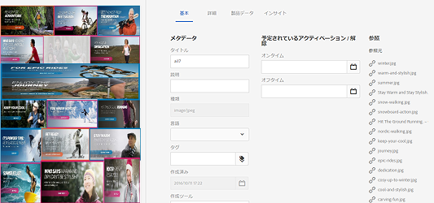
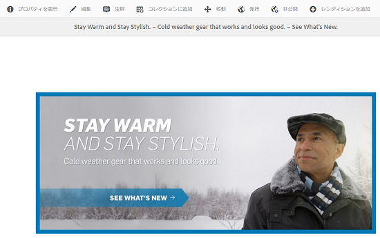
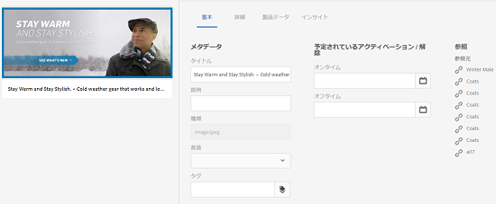
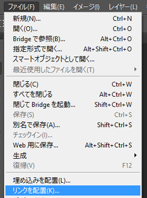

# サブアセットを含む複合アセットの管理 {#managing-compound-assets}

Adobe Experience Manager Assets では、アップロードされたファイルに、リポジトリ内の既存のアセットへの参照が含まれているかどうかを確認できます。 この機能は、サポート対象のファイル形式でのみ使用できます。アップロードされたアセットに [!DNL Experience Manager] アセットの場合、アップロードされたアセットと参照元のアセットの間に双方向のリンクが作成されます。

冗長性の排除に加え、参照 [!DNL Experience Manager] Adobe Creative Cloudアプリケーションのアセットは、コラボレーションを強化し、ユーザーの効率と生産性を向上させます。

[!DNL Experience Manager] Assets がサポート **双方向参照**. 参照元のアセットは、アップロードされたファイルのアセットの詳細ページで確認できます。さらに、の参照ファイルを表示できます。 [!DNL Experience Manager] 参照元のアセットのアセットの詳細ページにあるアセット。

参照は、参照元のアセットのパス、ドキュメント ID およびインスタンス ID に基づいて解決されます。

## Adobe Illustrator:アセットを参照として追加 {#refai}

既存の [!DNL Experience Manager] Adobe Illustratorファイル内のアセット。

1. [[!DNL Experience Manager]  デスクトップアプリケーション](https://experienceleague.adobe.com/docs/experience-manager-desktop-app/using/using.html?lang=ja)を使用して、 Assets リポジトリをローカルコンピューター上のドライブとしてマウントします。[!DNL Experience Manager]マウントしたドライブ内で、参照するアセットの場所に移動します。
1. マウントしたドライブから Illustrator ファイルにアセットをドラッグします。
1. Illustrator ファイルをマウントしたドライブに保存するか、 リポジトリに[アップロード](managing-assets-touch-ui.md#uploading-assets)します。[!DNL Experience Manager]
1. ワークフローが完了したら、そのアセットのアセットの詳細ページに移動します。既存への参照 [!DNL Experience Manager] アセットは、 **[!UICONTROL 依存関係]** 内 **[!UICONTROL 参照]** 列。

   

1. 「**[!UICONTROL 依存関係]**」に表示される参照元のアセットは、現在のファイルとは異なるファイルからも参照できます。参照先のファイルのリストを表示するには、「**[!UICONTROL 依存関係]**」にあるアセットをクリックします。

   

1. ツールバーの「**[!UICONTROL プロパティを表示]**」アイコンをクリックします。プロパティページで、現在のアセットを参照しているファイルのリストが「**[!UICONTROL 基本]**」タブの「**[!UICONTROL 参照]**」列に表示されます。

   

## Adobe InDesign:アセットを参照として追加 {#add-aem-assets-as-references-in-adobe-indesign}

参照する [!DNL Experience Manager] アセットファイル内からInDesignをドラッグ [!DNL Experience Manager] アセットをInDesignファイルに書き出すか、InDesignファイルを ZIP ファイルとして書き出します。

参照元のアセットはに既に存在します [!DNL Experience Manager] アセット。 サブアセットは、 [InDesignサーバーの設定](indesign.md). InDesign ファイルに組み込まれたアセットがサブアセットとして抽出されます。

>[!NOTE]
>
>InDesign サーバーにプロキシが設定されている場合、InDesign のファイルのプレビューが XMP メタデータ内に組み込まれています。この場合、サムネールの抽出は明示的には必要ありません。ただし、InDesign にプロキシが設定されていない場合、InDesign のファイルでサムネールを明示的に抽出する必要があります。

INDD ファイルがアップロードされると、 `xmpMM:InstanceID` および `xmpMM:DocumentID` プロパティをリポジトリに追加します。

###  アセットをドラッグして参照を作成  {#create-references-by-dragging-aem-assets}

この手順は、 [Adobe Illustratorでアセットを参照として追加](#refai).

### ZIP ファイルに書き出してアセットの参照を作成 {#create-references-to-aem-assets-by-exporting-a-zip-file}

1. の手順を実行します。 [ワークフローモデルの作成](/help/sites-developing/workflows-models.md) をクリックして、新しいワークフローを作成します。
1. 以下を使用： [Adobe InDesignのパッケージ機能](https://helpx.adobe.com/indesign/how-to/indesign-package-files-for-handoff.html) をクリックして、ドキュメントを書き出します。Adobe InDesignは、ドキュメントとリンクされたアセットをパッケージとして書き出すことができます。 この場合、書き出されたフォルダーには `Links` フォルダーファイル内のサブアセットを格納するInDesignー。 この `Links` フォルダーが INDD ファイルと同じフォルダーに存在する。
1. ZIP ファイルを作成し、 [!DNL Experience Manager] リポジトリ。
1. 解凍ワークフローを開始します。
1. ワークフローが完了すると、リンクフォルダー内の参照がサブアセットとして自動的に参照されます。参照元のアセットのリストを表示するには、InDesign アセットのアセットの詳細ページに移動して、[パネル](/help/sites-authoring/basic-handling.md#rail-selector)を閉じます。

## Adobe Photoshop:アセットを参照として追加 {#refps}

1. WebDav クライアントを使用して、マウントします。 [!DNL Experience Manager] ドライブとしてのアセット。
1. への参照を作成するには [!DNL Experience Manager] Photoshopファイル内のアセットで、Photoshopの「リンクを配置」機能を使用して、マウントされたドライブ内の対応するアセットに移動します。

   

1. Photoshopファイルをマウントしたドライブに保存するか、 [アップロード](managing-assets-touch-ui.md#uploading-assets) から [!DNL Experience Manager] リポジトリ。
1. ワークフローが完了した後、既存の [!DNL Experience Manager] アセットがアセットの詳細ページに表示されます。

   参照元のアセットを表示するには、アセットの詳細ページで[パネル](/help/sites-authoring/basic-handling.md#rail-selector)を閉じます。

1. 参照元のアセットには、参照元のアセットのリストも含まれています。参照元のアセットのリストを表示するには、アセットの詳細ページに移動して、 [パネル](/help/sites-authoring/basic-handling.md#rail-selector).

>[!NOTE]
>
>複合アセット内のアセットも、ドキュメント ID とインスタンス ID に基づいて参照できます。この機能は、Adobe Illustrator と Adobe Photoshop のバージョンでのみ使用できます。その他の場合、AEM の以前のバージョンと同様に、メインの複合アセット内でリンクされたアセットの相対パスに基づいて参照が実行されます。

## サブアセットの作成 {#generate-subassets}

複数ページ形式 (PDFファイル、AI ファイル、Microsoft PowerPoint およびApple Keynote ファイル、Adobe InDesignファイル ) のアセットをサポートする場合 [!DNL Experience Manager] では、元のアセットの個々のページに対応するサブアセットを生成できます。 これらのサブアセットは *親* アセットを作成し、複数ページ表示を容易にします。 その他の目的では、サブアセットはAEMでは通常のアセットと同じように扱われます。

サブアセットの生成はデフォルトでは無効になっています。サブアセットの生成を有効にするには、次の手順に従います。

1. 管理者としてExperience Managerにログインします。 アクセス **[!UICONTROL ツール/ワークフロー/モデル]**.
1. 選択 **[!UICONTROL DAM アセットの更新]** ワークフローとクリック **[!UICONTROL 編集]**.
1. クリック **[!UICONTROL サイドパネルを切り替え]** と **[!UICONTROL サブアセットを作成]** 手順 ワークフローにステップを追加します。 「**[!UICONTROL 同期]**」をクリックします。

サブアセットを生成するには、次のいずれかの操作をおこないます。

* 新しいアセット：この [!UICONTROL DAM アセットの更新] ワークフローは、AEMにアップロードされた新しいアセットで実行されます。 複数ページの新しいアセットに対してサブアセットが自動生成されます。
* 既存の複数ページアセット：手動で [!UICONTROL DAM アセットの更新] 次のいずれかの手順に従うワークフロー：

   * アセットを選択し、 [!UICONTROL タイムライン] をクリックして、左側のパネルを開きます。 または、キーボードショートカットを使用します `alt + 3`. クリック [!UICONTROL ワークフローを開始]を選択します。 [!UICONTROL DAM アセットの更新]をクリックし、 [!UICONTROL 開始]をクリックし、 [!UICONTROL 続行].
   * アセットを選択し、 [!UICONTROL 作成/ワークフロー] をクリックします。 ポップアップダイアログで、「 」を選択します。 [!UICONTROL DAM アセットの更新] ワークフロー、クリック [!UICONTROL 開始]をクリックし、 [!UICONTROL 続行].

特にMicrosoft Word ドキュメントの場合は、 **[!UICONTROL DAM Word ドキュメントの解析]** ワークフロー。 これにより、 `cq:Page` コンポーネントをMicrosoft Word ドキュメントのコンテンツから削除します。 このドキュメントから抽出された画像は `cq:Page` コンポーネントから参照されます。これらの画像は、サブアセットの生成が無効な場合も抽出されます。

## サブアセットの表示 {#viewing-subassets}

サブアセットは、サブアセットが生成され、選択した複数ページのアセットで使用できる場合にのみ表示されます。 生成されたサブアセットを表示するには、複数ページのアセットを開きます。 ページの左上の領域で、  をクリックし、 **[!UICONTROL サブアセット]** を選択します。 次を選択した場合： **[!UICONTROL サブアセット]** を選択します。 または、キーボードショートカットを使用します `alt + 5`.

## 複数ページファイルのページの表示 {#view-pages-of-a-multi-page-file}

ページビューア機能 ( [!DNL Experience Manager] アセット。 複数ページのアセットを開き、 **[!UICONTROL ページを表示]** を選択します。 開いたページビューアにはアセットのページと、各ページを参照およびズームするためのコントロールが表示されます。

InDesign では、InDesign サーバーを使用してページを抽出できます。InDesign ファイルの作成中にページのプレビューが保存されている場合は、ページを抽出するために InDesign サーバーを使用する必要はありません。

ツールバー、左側のレールおよびページビューアコントロールで、次のオプションを使用できます。

* **[!UICONTROL デスクトップアクション]** を使用して特定のサブアセットを開く、または表示するには [!DNL Experience Manager] デスクトップアプリケーション。 所要時間 [デスクトップアクションの設定](https://experienceleague.adobe.com/docs/experience-manager-desktop-app/using/using.html?lang=ja#desktopactions-v2) を使用している場合は、 [!DNL Experience Manager] デスクトップアプリケーション。

* **[!UICONTROL プロパティ]** オプションを選択すると、 [!UICONTROL プロパティ] 特定のサブアセットのページ。

* **[!UICONTROL 注釈]** 「 」オプションを使用すると、特定のサブアセットに注釈を付けることができます。 別のサブアセットで使用する注釈は、親アセットを表示用に開いたときに収集されて表示されます。

* **[!UICONTROL ページ概要]** 「 」オプションを選択すると、すべてのサブアセットが同時に表示されます。

* **[!UICONTROL タイムライン]** 「 」オプションをクリックし、  ファイルのアクティビティストリームを表示します。

## ベストプラクティスと制限事項 {#best-practice-limitation-tips}

* サブアセットの生成は、あらゆるリソースのデプロイメントで非常にExperience Managerを消費する可能性があります。 複雑なアセットがアップロードされたときにサブアセットを生成する場合は、 DAM アセットの更新ワークフローにこのステップを追加します。 オンデマンドでサブアセットを生成する場合は、別のワークフローを作成してサブアセットを生成します。 専用のワークフローを使用すると、 DAM アセットの更新ワークフローの他の手順をスキップし、計算リソースを保存できます。

>[!MORELIKETHIS]
>
>* [Adobe Experience Manager デスクトップアプリケーションの使用](https://experienceleague.adobe.com/docs/experience-manager-desktop-app/using/using.html?lang=ja)

