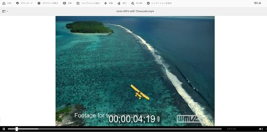
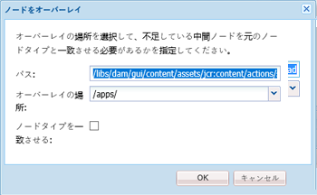
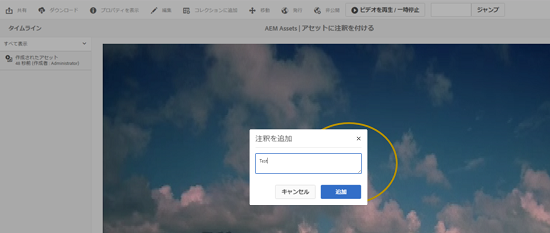
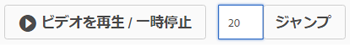
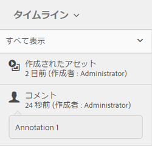

# ビデオアセットの管理 {#managing-video-assets}

>[!CAUTION]
>
>AEM 6.4 の拡張サポートは終了し、このドキュメントは更新されなくなりました。 詳細は、 [技術サポート期間](https://helpx.adobe.com/jp/support/programs/eol-matrix.html). サポートされているバージョンを見つける [ここ](https://experienceleague.adobe.com/docs/?lang=ja).

Adobe Experience Manager Assets でビデオアセットを管理および編集する方法について説明します。 また、Dynamic Mediaの使用をライセンスされている場合は、 [Dynamic Mediaビデオドキュメント](video.md).

## ビデオアセットのアップロードとプレビュー {#uploading-and-previewing-video-assets}

[!DNL Experience Manager] Assets は、拡張子が MP4 のビデオアセットのプレビューを生成します。 アセットの形式が MP4 でない場合は、FFmpeg パックをインストールしてプレビューを生成します。FFmpeg は、OGG タイプと MP4 タイプのビデオレンディションを作成します。これらのレンディションは、 [!DNL Experience Manager] Assets ユーザーインターフェイス。

1. デジタルアセットフォルダーまたはサブフォルダー内で、デジタルアセットを追加する場所に移動します。
1. アセットをアップロードするには、「 」をクリックまたはタップします **[!UICONTROL 作成]** ツールバーで、「 **[!UICONTROL ファイル]**. または、アセット領域に直接ドロップします。 アップロード操作について詳しくは、[アセットのアップロード](managing-assets-touch-ui.md#uploading-assets)を参照してください。
1. カード表示でビデオをプレビューするには、ビデオアセットの&#x200B;**[!UICONTROL 再生]**&#x200B;ボタンをタップします。

   

   ビデオの一時停止や再生は、 **[!UICONTROL カード]** 表示のみ。 再生/一時停止ボタンは **[!UICONTROL リスト]** 表示

1. 次をタップします。 **[!UICONTROL 編集]** ビデオを **[!UICONTROL 詳細]** 表示

   ビデオは、ブラウザーのネイティブなビデオプレーヤーで再生されます。再生、一時停止、音量の調節およびビデオの全画面表示を行うことができます。

   

## 2 GB を超えるアセットをアップロードするための設定 {#configuration-to-upload-video-assets-that-are-larger-than-gb}

デフォルトでは、 [!DNL Experience Manager] ファイルサイズの上限により、2 GB を超えるアセットはアップロードできません。 ただし、この上限は CRXDE Lite を開き、`/apps` ディレクトリ配下にノードを作成することで上書きできます。ノードには、同じノード名とディレクトリ構造および類似した順序のノードプロパティが必要です。

に加えて [!DNL Experience Manager] Assets の設定で、大きなアセットをアップロードするには、次の設定を変更します。

* トークンの有効期間を増やします。詳しくは、web コンソールの [!UICONTROL Adobe Granite CSRF サーブレット]を `https://[aem_server]:[port]/system/console/configMgr` で参照してください。詳しくは、[CSRF 保護](/help/sites-developing/csrf-protection.md)を参照してください。
* Dispatcher の設定で `receiveTimeout` を増やします。詳しくは、[Adobe Experience Manager Dispatcher の設定](https://experienceleague.adobe.com/docs/experience-manager-dispatcher/using/configuring/dispatcher-configuration.html?lang=ja#renders-options)を参照してください。

>[!NOTE]
>
>この [!DNL Experience Manager] クラシックユーザーインターフェイスには、2 GB のファイルサイズ制限はありません。 また、サイズの大きなビデオでは、エンドツーエンドのワークフローが完全にはサポートされません。

ファイルサイズの制限を高めに設定するには、`/apps` ディレクトリで次の手順を実行します。

1. AEM で、**[!UICONTROL ツール／一般／CRXDE Lite]** をタップします。
1. 内 **[!UICONTROL CRXDE Lite]** ページの左側にあるディレクトリウィンドウで、に移動します。 `/libs/dam/gui/content/assets/jcr:content/actions/secondary/create/items/fileupload`. ディレクトリウィンドウを表示するには、 `>>` アイコン
1. ツールバーで、 **[!UICONTROL ノードをオーバーレイ]**. または、コンテキストメニューの「**[!UICONTROL ノードをオーバーレイ]**」を選択します。
1. **[!UICONTROL ノードをオーバーレイ]**&#x200B;ダイアログで「**[!UICONTROL OK]**」をタップします。

   

1. ブラウザーを更新します。オーバーレイノード `/apps/dam/gui/content/assets/jcr:content/actions/secondary/create/items/fileupload` が選択されます。
1. サイズ上限を必要なサイズに増やすには、「**[!UICONTROL プロパティ]**」タブで適切な値をバイト単位で入力します。例えば、 `32212254720` の値を使用して、サイズ制限を 30 GB に増やします。

1. ツールバーで、 **[!UICONTROL すべて保存]**.
1. AEM で、**[!UICONTROL ツール／操作／Web コンソール]**&#x200B;をタップします。
1. の **[!UICONTROL Adobe Experience Manager Web コンソールバンドル]** ページの **[!UICONTROL 名前]** テーブルの列で、を探してタップします。 **[!UICONTROL AdobeGranite Workflow External Process Job Handler]**.
1. 内 **[!UICONTROL AdobeGranite Workflow External Process Job Handler]** ページで、両方に秒を設定します。 **[!UICONTROL デフォルトのタイムアウト]** および **[!UICONTROL 最大タイムアウト]** フィールド `18000` （5 時間）
1. 「**[!UICONTROL 保存]**」をタップします。
1. AEMで、 **[!UICONTROL ツール/ワークフロー/モデル]**.
1. の **[!UICONTROL ワークフローモデル]** ページ、選択 **[!UICONTROL Dynamic Media Encode Video]**&#x200B;次に、 **[!UICONTROL 編集]**.
1. の **[!UICONTROL ワークフロー]** ページで、をダブルタップします。 **[!UICONTROL Dynamic Mediaビデオサービスのプロセス]** コンポーネント。
1. **[!UICONTROL ステップのプロパティ]**&#x200B;ダイアログボックスの「**[!UICONTROL 共通]**」タブにある「**[!UICONTROL 詳細設定]**」を展開します。
1. 「**[!UICONTROL タイムアウト]**」フィールドの値を `18000` に指定し、「**[!UICONTROL OK]**」をタップして **[!UICONTROL Dynamic Media エンコーディングビデオ]**&#x200B;ワークフローページに戻ります。
1. ページ上部の、 **[!UICONTROL Dynamic Media Encode Video]** ページタイトルをタップします。 **[!UICONTROL 保存]**.

## ビデオアセットを公開する {#publishing-video-assets}

ビデオアセットを公開すると、URL として Web ページに含めることや、Web ページに埋め込むことができます。[アセットの公開](publishing-dynamicmedia-assets.md)を参照してください。

## ビデオアセットに注釈を付ける {#annotating-video-assets}

1. Assets コンソールで、 **[!UICONTROL 編集]** アセットカードのアイコンをクリックして、アセットの詳細ページを表示します。
1. 次をタップします。 **[!UICONTROL プレビュー]** アイコンをクリックしてビデオを再生します。
1. ビデオに注釈を付けるには、 **[!UICONTROL 注釈]** 」ボタンをクリックします。 注釈がビデオ内の特定の時点（フレーム）に追加されます。

   注釈を付ける際に、キャンバスに描画して、その描画をコメントに含めることができます。 コメントはAdobe Experience Manager Assets に自動的に保存されます。

   

   注釈ウィザードを終了するには、 **[!UICONTROL 閉じる]**.

1. ビデオ内の特定のポイントにジャンプするには、テキストフィールドに時間（秒）を指定し、 **[!UICONTROL ジャンプ]**. 例えば、ビデオの最初の 20 秒をスキップするには、 `20` 」と入力します。

   

1. 注釈をクリックすると、タイムラインに表示されます。 タップ **[!UICONTROL 削除]** をクリックして、注釈をタイムラインから削除します。

   
