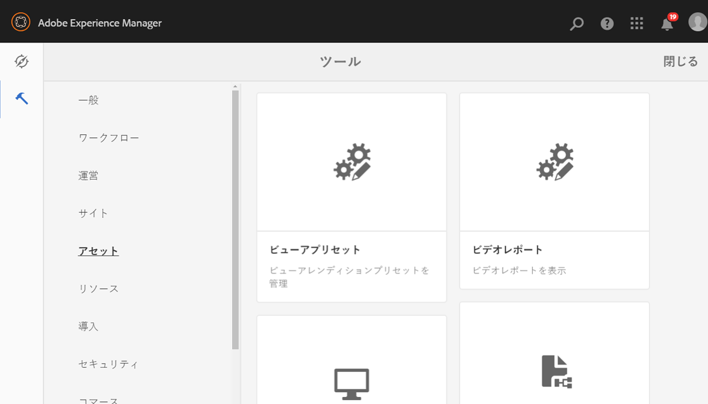
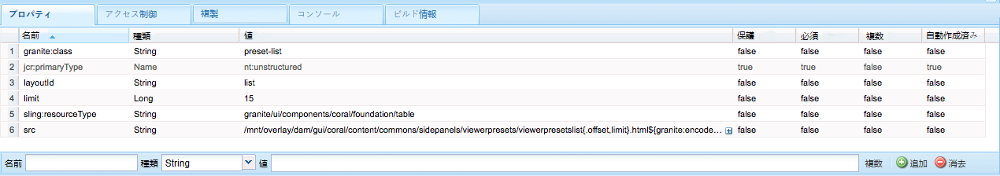
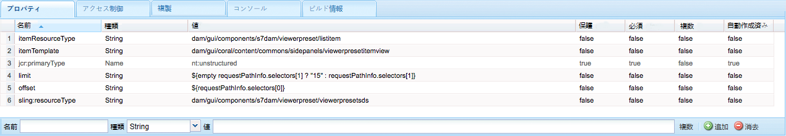
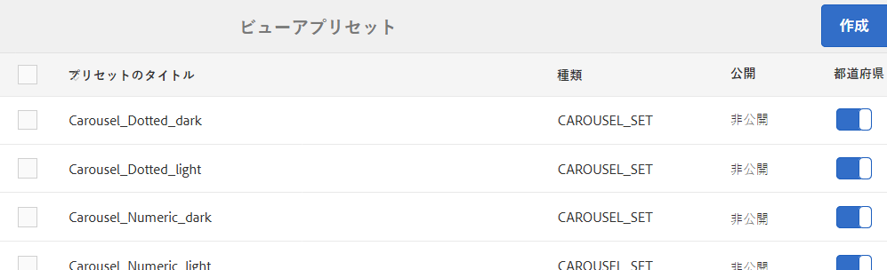

# Dynamic Mediaビューアプリセットの管理{#managing-viewer-presets}

Dynamic Mediaビューアプリセットは、ユーザがコンピュータの画面や携帯端末上でリッチメディアアセットを表示する方法を決定する設定の集まりです。 管理者は、ビューアプリセットを作成できます。設定は、幅広いビューア設定オプションで使用できます。例えば、ビューアの表示サイズやズームの動作を変更できます。

独自のHTML5ビューアプリセットを作成してカスタマイズする手順については、AdobeDynamic Media *HTML5ビューアSDK APIドキュメント*&#x200B;を参照してください。 この SDK は、SDK 自体に組み込まれている IS パブリッシュサーバーで使用できます。ライブラリバージョンごとに、専用の SDK ドキュメントが付属しています。

パス: `<scene7_domain>/s7sdk/<library_version>/docs/jsdocs/index.html`.\
例：3.10 SDK:[https://s7d1.scene7.com/s7sdk/3.10/docs/jsdoc/index.html](https://s7d1.scene7.com/s7sdk/3.10/docs/jsdoc/index.html)

『[AdobeDynamic Mediaビューアリファレンスガイド](https://experienceleague.adobe.com/docs/dynamic-media-developer-resources/library/home.html)』も参照してください。

ここでは、ビューアプリセットを作成、編集および管理する方法について説明します。アセットをプレビューする際は、いつでもビューアプリセットを適用できます。詳しくは、[ビューアプリセットの適用](viewer-presets.md)を参照してください。

>[!NOTE]
>
>*事前に定義された標準提供ビューアプリセット*&#x200B;を編集するシナリオはサポートされていません。標準提供ビューアプリセットを編集しようとすると、そのビューアプリセットを新しい名前で保存するように指示されます。

## ビューアのキーボードアクセシビリティ  {#keyboard-accessibility-for-viewers}

すべての標準提供ビューアでキーボードアクセシビリティがサポートされています。

[キーボードアクセシビリティとナビゲーション](https://experienceleague.adobe.com/docs/dynamic-media-developer-resources/library/c-keyboard-accessibility.html)に関するページも参照してください。

## Dynamic Mediaビューアプリセットの管理{#managing-presets}

AEMで&#x200B;**[!UICONTROL ツール/アセット/ビューアプリセット]**&#x200B;をタップして、プレビュービューアプリセットを追加、編集、削除、公開、非公開およびできます。

>[!NOTE]
>
>デフォルトで、アセットの詳細ビューでビューアを選択するときに、15 個のビューアプリセットが表示されます。この制限は増やすことができます。[表示されるビューアプリセットの数を増やす](#increasing-the-number-of-viewer-presets-that-display)を参照してください。

## レスポンシブデザイン Web ページのビューアサポート {#viewer-support-for-responsive-designed-web-pages}

Web ページごとに異なるニーズがあります。例えば、個別のブラウザーウィンドウで HTML5 ビューアを開くリンクを示す Web ページが必要な場合や、ホスティングページに直接 HTML5 ビューアを埋め込む必要が生じる場合があります。後者の場合、Web ページのレイアウトは静的なものになる場合と、または、*レスポンシブ*&#x200B;で、デバイスごと、ブラウザーウィンドウのサイズごとに表示方法が変わる場合があります。 これらのニーズに対応するために、Dynamic Media に付属する事前定義済みの標準提供 HTML5 ビューアはすべて、静的な Web ページとレスポンシブデザイン Web ページの両方をサポートしています。

レスポンシブビューアを Web ページに埋め込む方法について詳しくは、*画像サービング API ヘルプ*&#x200B;の[レスポンシブ画像ライブラリ](https://experienceleague.adobe.com/docs/dynamic-media-developer-resources/image-serving-api/image-serving-api/responsive-static-image-library/c-about-responsive-static-image-library.html)を参照してください。

>[!NOTE]
>
>標準提供ビューアを使用するには、まずすべて公開する必要があります。\
>[ビューアプリセットの公開](#publishing-viewer-presets)を参照してください。

## ビューアプリセットのシステムの互換性{#viewer-preset-system-compatibility}

Dynamic Media に付属するすべての標準提供ビューアプリセットは、次のシステムと完全に互換します。

* デスクトップ
* Apple iPhone
* Apple iPad
* Android Smartphone
* Android Tablet
* ビデオの場合、[Blackberry](https://developer.blackberry.com/devzone/develop/supported_media/bb_media_support_at_a_glance.html#kba1328730952678)および[Windows Phone 8](https://msdn.microsoft.com/library/windows/apps/ff462087%28v=vs.105%29.aspx)で、MP4再生の追加サポートが提供されます。

### ビューアプリセット用のリッチメディアタイプ{#rich-media-types-for-viewer-presets}

管理者は、新しいビューアプリセットの作成時に次のリッチメディアタイプを追加してカスタマイズすることができます。

| リッチメディアの種類 | 説明 |
|:---|:---|
| **カルーセルセット** | ホットスポットや画像マップ、またはその両方が 2 つ以上の一連の画像に追加されます。お客様は画像を左右にパンし、画像のホットスポットをクリックして追加の詳細情報を入力したり、Web サイトのカテゴリ、ホームまたはランディングページから直接購入したりできます。 |
| **フライアウトズーム** | オリジナル画像の横に、第 2 のズームされた領域の画像を表示します。使用できるコントロールはありません。ユーザーは表示したい領域上に選択範囲を動かします。 |
|  | このビューアの全体的な帯域幅使用量を算出する場合は、メイン画像とフライアウト画像の両方がビューアに配信されることを考慮してください。メイン画像のサイズ（ステージの幅と高さ）とズーム率によってフライアウト画像のサイズが決まります。フライアウトファイルのサイズが大きくなりすぎないようにするには、これら 2 つの値のバランスを取る必要があります。つまり、メイン画像のサイズが大きい場合は、ズーム率の値を小さくします。（フライアウトの幅と高さによってフライアウトウィンドウのサイズが決まりますが、ビューアに配信されるフライアウト画像のサイズが決まるわけではありません）。 |
|  | 例えば、メイン画像のサイズが 350 x 350 ピクセルで、ズーム率が 3 の場合、生成されるフライアウト画像は 1,050 x 1,050 ピクセルになります。メインの画像サイズが 300 x 300 ピクセルで、ズーム率が 4 の場合、フライアウト画像は 1,200 x 1,200 ピクセルになります。JPEG 画質の設定（推奨設定は 80～90）によっては、ファイルサイズを大幅に削減できます。推奨されるズーム率は、メイン画像のサイズに応じて 2.5～4 となります。 |
| **インラインズーム** | ズームされた領域の画像を元のビューア内に表示します。使用するコントロールはありません。つまり、ユーザーは表示する領域上に選択範囲を動かします。 |
| **画像セット** | 画像セットビューアでは、サムネール画像をクリックしてアイテムの様々なビューやカラーを表示できます。このビューアは、画像を接近して確認するためのズームツールも提供しています。 |
| **インタラクティブ画像** | ユーザーがクリックして追加の詳細情報を入力したり、Web サイトのカテゴリ、ホームまたはランディングページから直接購入したりするためのホットスポットを画像の一部に追加します。 |
| **インタラクティブビデオ** | ユーザーがクリックして追加の詳細情報を入力したり、Web サイトのカテゴリ、ホームまたはランディングページから直接購入したりするためのサムネールをビデオ内のタイムラインセグメントに追加します。 |
| **混在メディア** | 1 つのビューアで異なる複数のタイプのメディアを表示します。スピンセット、画像セット、画像およびビデオを含めることができます。 |
| **パノラマ画像** | パノラマ画像ビューアと PanoramicVR ビューアは、球パノラマ画像をレンダリングして、室内、物件、場所、風景などをあらゆる角度から見ることができる臨場感あふれる体験をユーザーに提供します。 |
|  | アップロードする画像が球パノラマとして適格となるには、以下の一方または両方の条件を満たしている必要があります。 <ul><li>縦横比が 2:1 である必要があります。</li><li>キーワード equirectangular、または spherical および panorama、または spherical および panoramic でタグ付けされている必要があります。[タグの使用](../sites-authoring/tags.md)を参照してください。</li></ul> |
|  | 縦横比とキーワードの両方の条件が、アセットの詳細ページと「パノラマメディア」WCM コンポーネントのパノラマアセットに適用されます。 |
|  | 重要：このビューアは Dynamic Media（Scene7 モード）でのみ使用できます。 |
| **スピンセット** | ユーザーがオブジェクトを回転させて、様々な面や角度を確認できるように、複数の画像ビューを提供します。 |
| **ビデオ** | プログレッシブまたはアダプティブビットレートストリーミングを使用してビデオを再生します。アダプティブビットレートストリーミングでは、自動的にデバイスと帯域幅を検出して、適切な画質のビデオを適切な形式で配信します。 |
| **垂直方向ズーム** | 垂直方向ズームビューアを使用すると、製品画像の閲覧エクスペリエンスを最大限に高めて、ユーザーにとって最適な製品の表示を実現できます。スウォッチを垂直方向に配置することで、次のような利点があります。 <ul><li>スウォッチが一画面に収まらないようにします。 ユーザのデスクトップ画面のサイズに応じて、水平方向のスウォッチ’では、ユーザがページを下にスクロールするまでスウォッチが表示されませんでした。 ビューア内に垂直方向にスウォッチを配置することで、ユーザーの画面サイズに関係なく、確実にスウォッチが表示されるようになります。</li><li>メイン画像のサイズが最大化されます。水平方向のスウォッチの場合、スウォッチが表示されるようにページ上にスペースを確保する必要があります。この配置により、メイン画像のサイズが縮小されていました。ただし、スウォッチの垂直方向レイアウトでは、このスペースを確保する必要がありません。そのため、メイン画像のサイズを最大化できます。</li></ul> |
| **ズーム** | ユーザーが領域をクリックしてズームインできます。ユーザーは、ズームイン、ズームアウトおよび画像をデフォルトのサイズにリセットするためのコントロールをクリックできます。 |

## 標準搭載のビューアプリセット{#list-of-out-of-the-box-viewer-presets}のリスト

次の表に、Dynamic Mediaに付属の定義済みの初期設定済みビューアプリセットを示します。

[ライブデモ](https://landing.adobe.com/jp/na/dynamic-media/ctir-2755/live-demos.html)も参照してください。

ビューアでサポートされている Web ブラウザーとオペレーティングシステムのバージョンについては、ビューアのリリースノートに記載されています。

[ビューアリファレンスガイド](https://experienceleague.adobe.com/docs/dynamic-media-developer-resources/library/home.html)の目次の&#x200B;*ビューアリリースノート*&#x200B;を参照してください。

>[!NOTE]
>
>Dynamic Media の標準提供のすべてのビューアプリセットは既にアクティベートされて（オンになって）いますが、それらを公開する必要があります。\
>[ビューアプリセットの公開](#publishing-viewer-presets)を参照してください。
>
>作成して追加する新しいビューアプリセットは、公開済みの&#x200B;*と*&#x200B;の両方でアクティブ化する必要があります。\
> [ビューアプリセットのアクティベートとアクティベート解除](#activating-or-deactivating-viewer-presets)と[ビューアプリセットの公開](#publishing-viewer-presets)を参照してください。

| ビューアプリセットのタイトル | タイプ | CSS ファイル名 |
|:---|:---|:---|
| Carousel_Dotted_dark | カルーセルセット | html5_carouselviewer_dotted_dark.css |
| Carousel_Dotted_light | カルーセルセット | html5_carouselviewer_dotted_light.css |
| Carousel_Numeric_dark | カルーセルセット | html5_carouselviewer_numeric_dark.css |
| Carousel_Numeric_light | カルーセルセット | html5_carouselviewer_numeric_light.css |
| Flyout | フライアウトズーム | html5_flyoutviewer.css |
| ImageSet_dark | 画像セット | html5_zoomviewer_dark.css |
| ImageSet_light | 画像セット | html5_zoomviewer_light.css |
| InlineMixedMedia_dark | 混在メディア | html5_inlinemixedmediaviewer_dark.css |
| InlineMixedMedia_light | 混在メディア | html5_inlinemixedmediaviewer_light.css |
| InlineZoom | フライアウトズーム | html5_inlinezoomviewer.css |
| MixedMedia_dark | 混在メディア | html5_mixedmediaviewer_dark.css |
| MixedMedia_light | 混在メディア | html5_mixedmediaviewer_light.css |
| PanoramicImage | パノラマ画像 | html5_panoramicimage.css |
| PanoramicImageVR | パノラマ画像 | html5_panoramicimage.css |
| Shoppable_Banner | インタラクティブ画像 | html5_interactiveimage.css |
| Shoppable_Video_dark | インタラクティブビデオ | html5_interactivevideoviewer_dark.css |
| Shoppable_Video_light | インタラクティブビデオ | html5_interactivevideovewer_light.css |
| SpinSet_dark | スピンセット | html5_spinviewer_dark.css |
| SpinSet_light | スピンセット | html5_spinviewer_light.css |
| ビデオ（クローズドキャプションのサポートを含む） | ビデオ | html5_videoviewer.css |
| Video_social（クローズドキャプションとソーシャルメディアのサポートを含む） | ビデオ | html5_videoviewersocial.css |
| Zoom_dark | ズーム | html5_basiczoomviewer_dark.css |
| Zoom_light | ズーム | html5_basiczoomviewer_light.css |
| ZoomVertical_dark | 垂直方向ズーム | html5_zoomverticalviewer_dark.css |
| ZoomVertical_light | 垂直方向ズーム | html5_zoomverticalviewer_light.css |

### サポートされているモバイルビューアのジェスチャーに関する表 {#supported-mobile-viewers-gestures-matrix}

次の表に、iOS、Android 2.x および Android 3.x デバイスでサポートされているモバイルビューアのジェスチャーを示します。

| ジェスチャー | フライアウトズーム | ズーム | スピン |
|---|---|---|---|
| **ドラッグ** | パン | パン | パン |
| **タップ** | フライアウトウィンドウを表示 | ユーザーインターフェイスを表示または非表示 | ユーザーインターフェイスを表示または非表示 |
| **ダブルタップ** | 適用なし | ズームインまたはリセット | ズームインまたはリセット |
| **ピンチオープン** | 適用なし | ズームイン（iOS、Android 3x のみ） | ズームイン（iOS、Android 3x のみ） |
| **ピンチクローズ** | 適用なし | ズームアウト（iOS、Android 3x のみ） | ズームアウト（iOS、Android 3x のみ） |
| **スワイプ** | スイッチバーをスクロール | 画像をスクロール | スピン |
| **フリック** | スイッチバーをスクロール | 画像をスクロール | スピン |

## {#increasing-the-number-of-viewer-presets-that-display}を表示するDynamic Mediaビューアプリセットの数の増加

**[!UICONTROL 詳細ビュー／ビューア]**&#x200B;でアセットを表示したとき、AEM には様々なビューアプリセットが表示されます。表示されるビューアの数を増減できます。

**表示するDynamic Mediaビューアプリセットの数を増やすには**:

1. **[!UICONTROL CRXDE Lite]** ([http://localhost:4502/crx/de](http://localhost:4502/crx/de))に移動します。
1. ビューアプリセットリストノード（`/libs/dam/gui/coral/content/commons/sidepanels/viewerpresets/viewerpresetslist`）に移動します。

   

1. 「**[!UICONTROL limit]**」プロパティで、「**[!UICONTROL 値]**」（デフォルトで 15 に設定されています）を目的の数に変更します。
1. ビューアプリセットデータソース（`/libs/dam/gui/coral/content/commons/sidepanels/viewerpresets/viewerpresetslist/datasource`）に移動します。

   

1. **[!UICONTROL limit]**&#x200B;プロパティで、数値を目的の数値（例：`{empty requestPathInfo.selectors[1] ? "20" : requestPathInfo.selectors[1]}`）に変更します
1. 「**[!UICONTROL すべて保存]**」をタップします。

## 新しいDynamic Mediaビューアプリセットの作成{#creating-a-new-viewer-preset}

ビューアプリセットを作成しておくと、アセットの表示やアセットとの対話のための様々な設定を適用できます。ただし、新しいビューアプリセットを作成する必要はありません。デフォルトの、すぐに使えるビューアプリセットが既に AEM Assets に付属していますので、これを使用できます。

新しいビューアプリセットを作成することを選んだ場合、ビューアプリセットを保存すると、ビューアプリセットページのそのビューアの状態が自動的にアクティベート済みになります（「**オン**」に設定されます）。****&#x200B;この状態は、**[!UICONTROL Dynamic Media]**&#x200B;コンポーネントと&#x200B;**[!UICONTROL インタラクティブメディア]**&#x200B;コンポーネントで、また、画像やビデオをプレビューするたびに表示されることを意味します。

一部のビューアプリセットには、ビューアの全体的な動作に影響する専用の設定があります。作成するビューアプリセットによっては、これらの特別な考慮事項について注意する必要があります。

[インタラクティブビューアプリセットの作成に関する考慮事項](#special-considerations-for-creating-an-interactive-viewer-preset)を参照してください。

[カルーセルバナーのビューアプリセットの作成に関する考慮事項](#special-considerations-for-creating-a-carousel-banner-viewer-preset)を参照してください。

**新しいDynamic Mediaビューアプリセットを作成するには**:

1. AEMの左上隅にあるAEMロゴをタップし、左のレールで&#x200B;**[!UICONTROL ツール/アセット/ビューアプリセット]**&#x200B;をタップします。

   

1. **[!UICONTROL ビューアプリセット]**&#x200B;ページのツールバーで、「**[!UICONTROL 作成]**」をタップします。
1. **[!UICONTROL 新規ビューアプリセット]**&#x200B;ダイアログボックスで、「**[!UICONTROL プリセット名]**」フィールドに新しいプリセットの名前を入力します。この名前は慎重に選択してください。「**[!UICONTROL 作成]**」をタップした後は編集できません。

   後でプリセットを保存する場合は、ビューアプリセットページの&#x200B;**[!UICONTROL プリセットタイトル]**&#x200B;列のヘッダーの下に名前が表示されます。

1. **[!UICONTROL リッチメディアの種類]**&#x200B;ドロップダウンメニューで、作成するビューアプリセットの種類を選択し、ページの右上隅にある「**[!UICONTROL 作成]**」をタップします。

   [ビューアプリセットのリッチメディアタイプ](#rich-media-types-for-viewer-presets)を参照してください。

1. **ビューアプリセットを編集**&#x200B;ページで、「**[!UICONTROL 外観]**」タブをタップします。
1. 次のいずれかの操作をおこないます。

   * 「**[!UICONTROL 選択したタイプ]**」プルダウンメニューで、ビジュアルデザインをカスタマイズするコンポーネントを選択します。または、ビューア内の任意の視覚要素をタップして、設定用に選択することもできます。

        Visual Editor を使用すると、特定のプロパティがスタイルに与える効果を確認できます。プロパティを設定または調整するだけで、Visual Editor の左にあるサンプルを使用して、ビューア上での効果を瞬時に確認できます。

      各タイプのビューアプリセットに対するCSSスタイルプロパティは、[ビューアリファレンスガイド](https://experienceleague.adobe.com/docs/dynamic-media-developer-resources/library/home.html)の「ビューアのカスタマイズ」ヘルプトピックで説明されています。**

      例えば、`Mixed_Media` タイプのビューアプリセットを作成している場合、プロパティのリストと各プロパティの説明については、[混在メディアビューアのカスタマイズ](https://experienceleague.adobe.com/docs/dynamic-media-developer-resources/library/viewers-aem-assets-dmc/mixed-media/customing-mixed-media/c-html5-mixedmedia-viewer-customizingviewer.html)を参照してください。

   * スタイル設定を別個の CSS ファイルで定義している場合は、その CSS ファイルを AEM Assets にアップロードできます。「**[!UICONTROL 選択したタイプ]**」プルダウンメニュー（表示するには Visual Editor を上にスクロールする必要が生じる場合があります）の下の「**[!UICONTROL CSS を読み込み]**」をタップし、アップロードした CSS ファイルを探してビューアプリセットと関連付けます。

        CSS ファイルを読み込むと、Visual Editor は、その CSS に正しいビューアマーカーが使用されているかを確認します。例えば、ズームビューアを作成している場合、読み込むすべての CSS ルールが、親のビューアエレメントに定義されているズームビューアのクラス名 `.s7mixedmediaviewer` を使用して定義されている必要があります。

      指定ビューアの CSS マーカーが正しく定義された CSS であれば、自作した任意の CSS を読み込むことができます（CSS マーカーについては、『[ビューアリファレンスガイド](https://experienceleague.adobe.com/docs/dynamic-media-developer-resources/library/home.html)』の「*&lt;viewer name>* ビューアのカスタマイズ」のヘルプトピックを参照してください。例えば、ズームビューアの CSS マーカーについては、[ズームビューアのカスタマイズ](https://experienceleague.adobe.com/docs/dynamic-media-developer-resources/library/viewers-aem-assets-dmc/zoom/customizing-zoom/c-html5-20-zoom-viewer-customizingviewer.html)を参照してください）。ただし、Visual Editor が一部の CSS 値を理解できないこともありえます。そのような場合、Visual Editor は、CSS が正常に機能するように、エラーを上書きしようとします。
   >[!NOTE]
   >
   >RAW 形式で CSS を直接編集する場合は、「選択したタイプ」プルダウンメニュー（表示するには Visual Editor を上にスクロールする必要が生じる場合があります）の下の「**[!UICONTROL CSS を表示／非表示]**」をタップします。****
   >
   >Visual Editor と同様に、CSS でプロパティを直接変更すると、ビューアサンプルにその効果がすぐに反映されます。また、同時に、Visual Editor でもその同じプロパティが自動的に更新されます。このことから、RAW である CSS エディターと、Visual Editor のどちらを使用しても、また交互に使用してもかまいません。

   >[!NOTE]
   >
   >ボタンのアートワークの場合は、2 倍画像を選択し、高解像度のアートワークをアップロードします。インタラクティブ画像やショッパブルバナーを操作する場合は、すぐに使える様々なホットスポットボタンから選択することもできます。

1. （オプション）**[!UICONTROL ビューアプリセットを編集]**&#x200B;ページの上部近くにある「**[!UICONTROL デスクトップ]**」、「**[!UICONTROL タブレット]**」または「**[!UICONTROL 電話]**」をタップして、デバイスと画面の種類ごとに表示スタイルを一意に定義します。
1. **[!UICONTROL ビューアプリセットを編集]**&#x200B;ページで、「**動作**」タブをタップします。 または、設定するビジュアル要素をビューアでタップまたはクリックして選択することもできます。
1. 「**[!UICONTROL 選択したタイプ]**」プルダウンメニューで、動作を変更するコンポーネントを選択します。

   Visual Editor 内の多くのコンポーネントには、詳しい説明が関連付けられています。この説明は、コンポーネントを展開して関連パラメーターを表示したときに、青いボックス内に示されます。

   一部のビューアタイプには、「**IS コマンド**」テキストフィールドに画像サービングコマンドを指定できるコンポーネントがあります。使用できるコマンドのリストについては、[画像サービング API リファレンス（英語）](https://experienceleague.adobe.com/docs/dynamic-media-developer-resources/image-serving-api/image-serving-api/c-is-home.html)を参照してください。

   >[!NOTE]
   >
   >**スマートフォンやタブレットなどのタッチデバイスを使用している場合は...**
   >
   >テキストフィールドに値を入力後、ユーザーインターフェイス内をタップすると、変更内容が送信され、仮想キーボードが閉じられます。**[!UICONTROL Enter]** キーをタップした場合は、何も実行されません。

1. ページの右上隅にある「**[!UICONTROL 保存]**」をタップします。
1. 新しいビューアプリセットを公開します。プリセットを Web サイトで使用するには、まずそのプリセットを公開する必要があります。

   [ビューアプリセットの公開](#publishing-viewer-presets)を参照してください。

## インタラクティブビデオのビューアプリセットの作成に関する考慮事項  {#special-considerations-for-creating-an-interactive-viewer-preset}

**パネル内の画像サムネールのディスプレイモードについて**

インタラクティブビデオビューアプリセットを作成または編集する場合、**[!UICONTROL 動作]**&#x200B;タブの&#x200B;**[!UICONTROL 選択されたコンポーネント]**&#x200B;プルダウンメニューから`InteractiveSwatches`を選択したときに、**[!UICONTROL 表示モード]**&#x200B;を使用する設定を選択できます。 選択するディスプレイモードは、ビデオの再生中にサムネールを表示する方法とタイミングに影響します。`segment`表示モード（デフォルト）または`continuous`表示モードを選択できます。

| ディスプレイモード | 説明 |
|---|---|
| [!UICONTROL セグメント] | [!UICONTROL セグメント]は、既製のインタラクティブなビデオのビューアプリセット Shoppable_Video_light と Shoppable_Video_dark および自身で作成するすべてのインタラクティブなビデオのビューアプリセットのデフォルトのディスプレイモードです。 |
|  | このモードでは、ビデオセグメントに割り当てられているサムネールの数がディスプレイパネル内に表示されるスポットの数よりも少ない場合、次または前のサブセグメントがパネル内の空のスポットを満たすように引っ張り込まれることはありません。つまり、特定のビデオセグメントに割り当てられたスウォッチの表示が保持されます。 |
| [!UICONTROL 連続] | [!UICONTROL 連続]表示モードでは、セグメント内のサムネールの数がパネルに表示されている数より少ない場合、ビューアは次のセグメント、または前のセグメント（最後のサムネールが表示される場合）から自動的にサムネールを表示します。 |

**インタラクティブビデオビューアの自動スクロール動作について**

インタラクティブビデオビューア内のサムネールの自動スクロール動作は、選択したディスプレイモードとは独立して機能します。

インタラクティブビデオビューアプリセットを作成または編集する場合は、「**[!UICONTROL 動作]**」タブから「**[!UICONTROL 自動スクロール]**」にアクセスします。 **[!UICONTROL 選択したコンポーネント]**&#x200B;ドロップダウンメニューの「ビヘイビアー」タブで、「**[!UICONTROL InteractiveSwatches]**」をタップします。「ISコマンド」テキストフィールドの下に、「**[!UICONTROL 自動スクロール]**」チェックボックスが表示されます。

ビューアプリセットで「**[!UICONTROL 自動スクロール」]**&#x200B;を無効（チェックボックスをオフ）にした場合、ユーザーによるビデオの再生中、パネルにはビデオの全長につき最初のサムネール画像のみが表示されます。ただし、ユーザーは必要に応じて上下の矢印アイコンを使用してサムネール間を手動でスクロールできます。

ビューアプリセットで「**[!UICONTROL 自動スクロール]**」を有効（チェックボックスをオン）にすると、ビデオの再生中、セグメントの開始時に、ビデオセグメントに割り当てられたサムネール画像まで表示がスクロールされます。ただし、セグメントによっては特定のサムネールが前後のサムネールの 2 倍の時間表示されることもあります。この動作は、セグメント内のサムネールの数がパネルに表示される数よりも多く、均等に分割できないことが原因で発生します。

図解してみましょう。30 秒のビデオセグメントが 1 つあるとします。30 秒の間に表示されるサムネールは合計で 9 個です。ブラウザーは 4 つのサムネールがディスプレイパネルに表示できるようにサイズ設定されています。30 秒のビデオの時間セグメントは 3 つのサブセグメントに分割されています。次の表に、指定の時間サブセグメントに表示されるサムネールの内訳を示します。

| **ビデオのサブセグメント** | **サブセグメントの時間（秒単位）** | **パネルに表示されるサムネール** |
|---|---|---|
| 1 | 0～10 | 1、2、3、4 |
| 2 | 10～20 | 4、5、6、7 |
| 3 | 20～30 | 6、7、8、9 |

ビデオサブセグメント 3 が、割り当てられているサムネールを超えて拡張されることはありません。また、サムネール 4、6、7 は、他のサムネールの 2 倍の時間パネルに表示されます。

ビューアでは次のロジックに従い、サイドパネルに表示できる数に基づいて表示するサムネールの数を決めています。

* サブセグメントの数 = 次のサブセグメントに切り上げ（サムネールの数／サムネールパネル内に表示されるスロットの数（ブラウザー画面のサイズに基づく））

   前述の表の例では、「9 サムネール / 4 スロット = 2.25 サブセグメント」（ビューアのロジックにより 2.25 を 3 に切り上げ）になります。

* サムネールの数 = 次のサムネールに切り上げ（サムネールの数／ビデオサブセグメントの数）

   前述の表の例では、「9 サムネール / 3 ビデオサブセグメント = 3 サムネール」になります。

* サブセグメントの表示時間 = ビデオの合計再生時間／ビデオサブセグメントの数

   前述の表の例では、「30 秒 / 3 ビデオサブセグメント = 各ビデオサブセグメントで 10 秒」の再生時間になります。

### カルーセルバナービューアのプリセット{#special-considerations-for-creating-a-carousel-banner-viewer-preset}を作成する場合の特別な考慮点

カルーセルバナーのビューアプリセットを作成するときに、ホットスポットのスタイル変更は次のように実行できます。

|  | **説明** | **アクション** |
|---|---|---|
| **ホットスポットアイコン** | ホットスポットに使用するアイコンを変更する | ホットスポットアイコンの画像を変更するには、「**[!UICONTROL 外観]**」タブで、「**[!UICONTROL 選択したコンポーネント]**」の「**[!UICONTROL ImageMapEffect]**」をタップします。「**[!UICONTROL アイコン]**」で「**[!UICONTROL 背景]**」を選択し、「**[!UICONTROL 画像]**」フィールドで目的に背景画像に移動します。 |

## Dynamic Mediaビューアプリセットのアクティブ化/非アクティブ化{#activating-or-deactivating-viewer-presets}

オーサーモードでビューアプリセットがアクティベートされているかどうかで、ユーザーインターフェイスに表示されるビューアプリセットが変わります。初期設定では、ビューアプリセットを作成した後のビューアプリセットは&#x200B;*On*&#x200B;です。 プリセットをオフにすると、オーサーモードでは表示されなくなります。プリセットを公開する場合は、オン／オフに関係なく、常に公開されます。リストが不安定になった場合や、ビューアプリセットを使用可能にしないように設定した場合は、ビューアプリセットを非アクティブにすることができます。

**Dynamic Mediaビューアプリセットをアクティブ化または非アクティブ化するには**:

1. AEMの左上隅にあるAEMロゴをタップし、左のレールで&#x200B;**[!UICONTROL ツール/アセット/ビューアプリセット]**&#x200B;をタップします。
1. **[!UICONTROL ビューアプリセット]**&#x200B;ページの&#x200B;**[!UICONTROL 状態]**&#x200B;列ヘッダーの下で、切り替えボタンをタップして、ビューアプリセットをアクティブ化または非アクティブ化します。

   アクティベートされたビューアプリセットには、（青いボックスで）右側にトグルしたアイコンが示されます。アクティベート解除されたビューアプリセットには、（薄いグレーのボックスで）左側にトグルしたアイコンが示されます。

## Dynamic Mediaビューアプリセットを公開{#publishing-viewer-presets}

ビューアプリセットの状態をアクティブ化（または&#x200B;*オン*&#x200B;にする）とは、ビューアプリセットがDynamic Mediaコンポーネント、インタラクティブメディアコンポーネントで、またアセットを表示したときに必ず表示されることを意味します。

ただし、ビューアプリセットを使用してアセットを配信するには、ビューアプリセットも公開する必要があります。 アセットのURLまたは埋め込みコードを取得するには、すべてのビューアプリセットを&#x200B;*および*&#x200B;公開する必要があります。 Dynamic Media に付属しているすべての既製ビューアプリセットをアクティベートして公開する必要があります。自分で作成して追加したカスタムビューアプリセットは自動的にアクティベートされますが、やはり手動で公開する必要があります。

[ビューアプリセットのアクティベートとアクティベート解除](#activating-or-deactivating-viewer-presets)を参照してください。

[アセットのプレビュー](previewing-assets.md)も参照してください。

**Dynamic Mediaビューアプリセットを公開するには**:

1. AEMの左上隅にあるAEMロゴをタップし、左のレールで&#x200B;**[!UICONTROL ツール/アセット/ビューアプリセット]**&#x200B;をタップします。
1. 公開するビューアプリセットを 1 つ以上選択します。
1. ツールバーの&#x200B;**[!UICONTROL 公開]**&#x200B;アイコンをタップします。

## Dynamic Mediaビューアプリセットの並べ替え{#sorting-viewer-presets}

**Dynamic Mediaビューアプリセットを並べ替えるには**:

1. AEM の左上隅にある AEM ロゴをタップし、左側のパネルで&#x200B;**ツール**（ハンマーアイコン）／**[!UICONTROL Assets／ビューアプリセット]**&#x200B;をタップします。
1. 「**[!UICONTROL プリセットのタイトル]**」、「**[!UICONTROL タイプ]**」、「**[!UICONTROL 公開]**」または「**[!UICONTROL 状態]**」をクリックして、その見出しの列でソートします。例えば、「**[!UICONTROL タイプ]**」をクリックすると、ビューアプリセットのタイプが、アルファベット順で、またはアルファベットの逆の順序でソートされます。

## Dynamic Mediaビューアプリセットの編集{#editing-viewer-presets}

*事前に定義された標準提供ビューアプリセット*&#x200B;を編集するシナリオはサポートされていません。標準提供ビューアプリセットを編集すると、新しい名前で保存するように指示されます。

**Dynamic Mediaビューアプリセットを編集するには**:

1. AEMの左上隅にあるAEMロゴをタップし、左のレールで&#x200B;**[!UICONTROL ツール/アセット/ビューアプリセット]**&#x200B;をタップします。
1. ビューアプリセットのタイトルの左側にあるチェックボックスをオンにして、プリセットを選択します。
1. ツールバーの「**[!UICONTROL 編集]**」をタップします。
1. **[!UICONTROL ビューアプリセットを編集]**&#x200B;ページで、ビューアプリセットに対して適宜変更をおこないます。
1. 次のいずれかの操作をおこないます。

   * 「**[!UICONTROL 保存]**」をタップして変更内容を保存し、ビューアプリセットページに戻ります。****
   * 「**[!UICONTROL キャンセル]**」をタップして変更内容をキャンセルし、ビューアプリセットページに戻ります。****

## カスタムDynamic Mediaビューアプリセットの削除{#deleting-custom-viewer-presets}

作成して Dynamic Media に追加したビューアプリセットを削除できます。

**カスタムのDynamic Mediaビューアプリセットを削除するには**:

1. AEMの左上隅にあるAEMロゴをタップし、左のレールで&#x200B;**[!UICONTROL ツール/アセット/ビューアプリセット]**&#x200B;をタップします。
1. **[!UICONTROL ビューアプリセット]**&#x200B;ページで、**[!UICONTROL プリセットタイトル]**&#x200B;を確認し、**[!UICONTROL ごみ箱]**&#x200B;アイコンをタップします。
1. 「**[!UICONTROL 削除]**」をタップします。

## アセットへの Dynamic Media ビューアプリセットの適用 {#applying-a-viewer-preset-to-an-asset}

アセットと選択したビューアを既に公開している場合は、ビューアプリセットの選択後に「**[!UICONTROL URL]**」ボタンと「**[!UICONTROL 埋め込み]**」ボタンが表示されます。

**Dynamic Mediaビューアプリセットをアセットに適用するには**:

1. アセットを開き、ページの左上隅付近にあるドロップダウンメニュータップして、「**[!UICONTROL ビューア]**」を選択します。

   >[!NOTE]
   >
   >アセットと選択したビューアを既に公開している場合は、ビューアプリセットの選択後に「**[!UICONTROL URL]**」ボタンと「**[!UICONTROL 埋め込み]**」ボタンが表示されます。

1. 左側のウィンドウからビューアプリセットを選択して、アセットに適用します。

   [この URL をコピー](linking-urls-to-yourwebapplication.md)して、他のユーザーと共有できます。

## Dynamic Mediaビューアプリセットを使用したアセットの配信{#delivering-assets-with-viewer-presets}

ビューアプリセットの URL を取得する方法については、[Web アプリケーションへの URL のリンク](linking-urls-to-yourwebapplication.md)を参照してください。[Web ページへのビデオビューアの埋め込み](embed-code.md)も参照してください。

AEM を WCM として使用している場合は、ビューアプリセットを使用するアセットをページに直接追加できます。[ページへの Dynamic Media アセットの追加](adding-dynamic-media-assets-to-pages.md)を参照してください。
