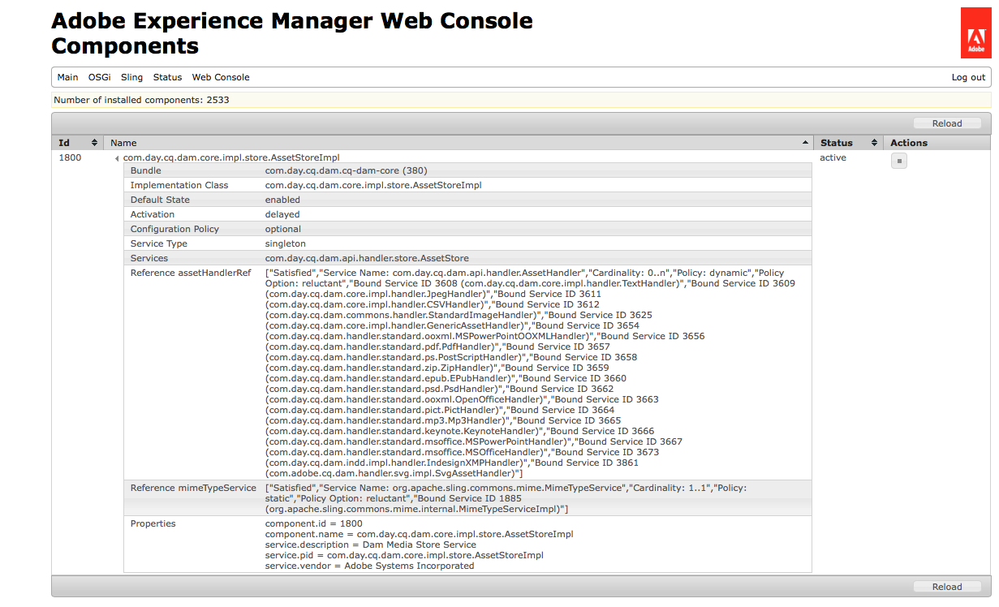

# メディアハンドラーとワークフローを使用したアセットの処理{#processing-assets-using-media-handlers-and-workflows}

Adobe Experience Managerアセットには、アセットを処理するための初期設定のワークフローとメディアハンドラーのセットが用意されています。 ワークフローは、一般的なアセット管理と処理タスクを定義し、特定のタスク(サムネールの生成やメタデータの抽出など)をメディアハンドラに委任します。

特定のタイプまたは形式のアセットがサーバーにアップロードされたときに自動的に実行されるワークフローを定義できます。 処理手順は、一連のExperience ManagerAssetsメディアハンドラーとして定義されます。 Adobe Experience Managerは、[組み込みのハンドラー](#default-media-handlers)を提供しています。その他には、[カスタム開発](#creating-a-new-media-handler)か、[コマンドラインツール](#command-line-based-media-handler)にプロセスを委任することで定義できます。

メディアハンドラーは、Experience Managerアセット内のサービスで、アセットに対して特定のアクションを実行します。 例えば、MP3オーディオファイルがExperience Managerにアップロードされると、ワークフローは、メタデータを抽出してサムネールを生成するMP3ハンドラをトリガーします。 メディアハンドラーは、ワークフローと共に使用します。 一般的なMIMEタイプのほとんどは、Experience Manager内でサポートされます。 次のいずれかの操作を行うと、アセットに対して特定のタスクを実行できます

* ワークフローの拡張または作成
* メディアハンドラーの拡張または作成
* メディアハンドラーの無効化または有効化

>[!NOTE]
>
>各形式でサポートされるExperience Managerアセットおよび機能でサポートされるすべての形式については、[サポートされるアセットの形式](assets-formats.md)のページを参照してください。

## デフォルトのメディアハンドラー{#default-media-handlers}

次のメディアハンドラーは、Experience Managerアセット内で使用でき、最も一般的なMIMEタイプを処理します。

| ハンドラー名 | サービス名（システムコンソールでの名称） | サポートされる MIME タイプ |
|---|---|---|
| [!UICONTROL TextHandler] | com.day.cq.dam.core.impl.handler.TextHandler | text/plain |
| [!UICONTROL PdfHandler] | com.day.cq.dam.handler.standard.pdf.PdfHandler | <ul><li>application/pdf</li><li>application/illustrator</li></ul> |
| [!UICONTROL JpegHandler] | com.day.cq.dam.core.impl.handler.JpegHandler | image/jpeg |
| [!UICONTROL Mp3Handler] | com.day.cq.dam.handler.standard.mp3.Mp3Handler | audio/mpeg<br><b>重要</b> - MP3ファイルをアップロードすると、サードパーティのライブラリを使用して [処理されます](http://www.zxdr.it/programmi/SistEvolBDD/LibJava/doc/de/vdheide/mp3/MP3File.html)。MP3に可変ビットレート(VBR)がある場合、ライブラリは不正確な近似長を計算します。 |
| [!UICONTROL ZipHandler] | com.day.cq.dam.handler.standard.zip.ZipHandler | <ul><li>application/java-archive </li><li> application/zip</li></ul> |
| [!UICONTROL PictHandler] | com.day.cq.dam.handler.standard.pict.PictHandler | image/pict |
| [!UICONTROL StandardImageHandler] | com.day.cq.dam.core.impl.handler.StandardImageHandler | <ul><li>image/gif </li><li> image/png </li> <li>application/photoshop </li> <li>image/jpeg </li><li> image/tiff </li> <li>image/x-ms-bmp </li><li> image/bmp</li></ul> |
| [!UICONTROL MSOfficeHandler] | com.day.cq.dam.handler.standard.msoffice.MSOfficeHandler | application/msword |
| [!UICONTROL MSPowerPointHandler] | com.day.cq.dam.handler.standard.msoffice.MSPowerPointHandler | application/vnd.ms-powerpoint |
| [!UICONTROL OpenOfficeHandler] | com.day.cq.dam.handler.standard.ooxml.OpenOfficeHandler | <ul><li>application/vnd.openxmlformats-officedocument.wordprocessingml.document</li><li> application/vnd.openxmlformats-officedocument.spreadsheetml.sheet</li><li> application/vnd.openxmlformats-officedocument.presentationml.presentation</li></ul> |
| [!UICONTROL EPubHandler] | com.day.cq.dam.handler.standard.epub.EPubHandler | application/epub+zip |
| [!UICONTROL GenericAssetHandler] | com.day.cq.dam.core.impl.handler.GenericAssetHandler | アセットからデータを抽出するためのハンドラーが他に見つからなかった場合のフォールバック |

すべてのハンドラーは以下のタスクを実行できます。

* アセットから使用できるすべてのメタデータを抽出する
* アセットからサムネール画像を作成する

以下のようにアクティブなメディアハンドラーを表示できます。

1. ブラウザーで、`http://localhost:4502/system/console/components` です。
1. リンク `com.day.cq.dam.core.impl.store.AssetStoreImpl` をクリックします。
1. すべてのアクティブなメディアハンドラーリストが表示されます。次に例を示します。



## ワークフロー内でメディアハンドラーを使用してアセット{#using-media-handlers-in-workflows-to-perform-tasks-on-assets}に対してタスクを実行する

メディアハンドラーは、ワークフローで使用されるサービスです。

Experience Managerには、アセットを処理するためのデフォルトのワークフローがいくつかあります。 表示するには、ワークフローコンソールを開き、「**[!UICONTROL モデル]**」タブをクリックします。Experience Managerアセットとの開始に使用されるワークフロータイトルは、アセット固有のものです。

特定の要件に従って、既存のワークフローを拡張し、新しいワークフローを作成してアセットを処理できます。

次の例は、**[!UICONTROL AEM Assets同期]**&#x200B;ワークフローを拡張して、PDFドキュメントを除くすべてのアセットに対してサブアセットを生成する方法を示しています。

### メディアハンドラーの無効化／有効化 {#disabling-enabling-a-media-handler}

メディアハンドラーを無効または有効にするには、Apache Felix Web Management Console を使用します。メディアハンドラーを無効にすると、そのアセットに対してメディアハンドラーのタスクは実行されません。

メディアハンドラーを有効または無効にするための手順

1. ブラウザーで、`https://<host>:<port>/system/console/components` です。
1. メディアハンドラーの名前の横にある「**[!UICONTROL Disable]**」をクリックします。例：`com.day.cq.dam.handler.standard.mp3.Mp3Handler`
1. ページを更新します。メディアハンドラーの横に、無効であることを示すアイコンが表示されます。
1. メディアハンドラーを有効にするには、メディアハンドラーの名前の横にある「**[!UICONTROL Enable]**」をクリックします。

### メディアハンドラーの作成{#creating-a-new-media-handler}

新しいメディアタイプをサポートする場合、またはアセットに対して特定のタスクを実行する場合は、メディアハンドラーを作成する必要があります。 ここでは、その進め方について説明します。

#### 重要なクラスおよびインターフェイス  {#important-classes-and-interfaces}

実装を開始するための最適な方法は、最も多くの点について対応し、適切なデフォルト動作を提供している付属の抽象実装から継承することです。それが `com.day.cq.dam.core.AbstractAssetHandler` クラスです。

このクラスには、抽象的なサービス記述子が用意されています。そのため、このクラスから継承し、maven-sling-plugin を使用する場合、inherit フラグを `true` に設定する必要があります。

次のメソッドを実装します。

* `extractMetadata()`：使用可能なすべてのメタデータを抽出します。
* `getThumbnailImage()`：渡されたアセットからサムネール画像を作成します。
* `getMimeTypes()`：アセットの MIME タイプを返します。

以下にテンプレートの例を示します。

`package my.own.stuff; /** * @scr.component inherit="true" * @scr.service */ public class MyMediaHandler extends com.day.cq.dam.core.AbstractAssetHandler { // implement the relevant parts } `

インターフェイスとクラスには以下が含まれます。

* `com.day.cq.dam.api.handler.AssetHandler` インターフェイス：特定の MIME タイプのサポートを追加するサービスを記述します。MIME型を追加するには、このインターフェイスを実装する必要があります。 このインターフェイスには、特定のドキュメントの読み込みと書き出し、サムネールの作成およびメタデータの抽出をおこなうメソッドがあります。
* `com.day.cq.dam.core.AbstractAssetHandler` クラス：その他すべてのアセットハンドラー実装の基礎として機能し、よく使用される機能を提供します。
* `com.day.cq.dam.core.AbstractSubAssetHandler` クラス：
   * その他すべてのアセットハンドラー実装の基礎として機能し、よく使用される機能を提供します。さらに、サブアセットの抽出についてよく使用される機能も提供します。
   * 実装を開始する最善の方法は、ほとんどの処理を行い、適切なデフォルト動作を提供する、提供された抽象実装から継承することです。com.day.cq.dam.core.AbstractAssetHandlerクラス
   * このクラスには、抽象的なサービス記述子が用意されています。そのため、このクラスから継承し、maven-sling-plugin を使用する場合、inherit フラグを true に設定する必要があります。

次のメソッドを実装する必要があります。

* `extractMetadata()`：使用できるすべてのメタデータを抽出します。
* `getThumbnailImage()`：渡されたアセットのサムネール画像を作成します。
* `getMimeTypes()`:このメソッドは、アセットのMIMEタイプを返します。

以下にテンプレートの例を示します。

package my.own.stuff; /&amp;ast;&amp;ast; &amp;ast; @scr.component inherit=&quot;true&quot; &amp;ast; @scr.service &amp;ast;/ public class MyMediaHandler extends com.day.cq.dam.core.AbstractAssetHandler { // 関係する部分を実装 }

インターフェイスとクラスには以下が含まれます。

* `com.day.cq.dam.api.handler.AssetHandler` インターフェイス：特定の MIME タイプのサポートを追加するサービスを記述します。MIME型を追加するには、このインターフェイスを実装する必要があります。 このインターフェイスには、特定のドキュメントの読み込みと書き出し、サムネールの作成およびメタデータの抽出をおこなうメソッドがあります。
* `com.day.cq.dam.core.AbstractAssetHandler` クラス：その他すべてのアセットハンドラー実装の基礎として機能し、よく使用される機能を提供します。
* `com.day.cq.dam.core.AbstractSubAssetHandler` クラス：その他すべてのアセットハンドラー実装の基礎として機能し、よく使用される機能を提供します。さらに、サブアセットの抽出についてよく使用される機能も提供します。

#### 例：特定の Text Handler の作成 {#example-create-a-specific-text-handler}

この節では、透かし付きのサムネールを生成する特定のテキストハンドラーを作成します。

以下の手順を実行します。

Avenプラグインを使用してEclipseをインストールおよび設定し、Mavenプロジェクトに必要な依存関係を設定する方法については、[開発ツール](../sites-developing/dev-tools.md)を参照してください。

次の手順を実行した後、txtファイルをExperience Managerにアップロードすると、ファイルのメタデータが抽出され、透かし付きの2つのサムネールが生成されます。

1. Eclipseで、`myBundle` Mavenプロジェクトを作成します。

   1. メニューバーで、**[!UICONTROL ファイル/新規/その他]**&#x200B;をクリックします。
   1. ダイアログボックスで、Mavenフォルダーを展開し、「Mavenプロジェクト」を選択して、「**[!UICONTROL 次へ]**」をクリックします。
   1. 「**[!UICONTROL 単純なプロジェクトを作成]**」ボックスと「**[!UICONTROL デフォルトのワークスペースの場所を使用]**」ボックスをオンにし、「**[!UICONTROL 次へ]**」をクリックします。
   1. 次の値を使用してMavenプロジェクトを定義します。

      * Group Id：com.day.cq5.myhandler
      * Artifact Id：myBundle
      * 名前：マイExperience Managerバンドル
      * 説明：これは私のExperience Managerバンドルです
   1. 「**[!UICONTROL Finish]**」をクリックします。


1. Java™コンパイラをバージョン1.5に設定します。

   1. `myBundle`プロジェクトを右クリックし、「プロパティ」を選択します。
   1. Java™コンパイラを選択し、次のプロパティを1.5に設定します。

      * Compiler compliance level
      * Generated .class files compatibility
      * Source compatibility
   1. 「**[!UICONTROL OK]**」をクリックします。ダイアログウィンドウで、「Yes」をクリックします。


1. pom.xml ファイルのコードを以下のコードで書き換えます。

   ```xml
   <project xmlns="https://maven.apache.org/POM/4.0.0" xmlns:xsi="https://www.w3.org/2001/XMLSchema-instance"
    xsi:schemaLocation="https://maven.apache.org/POM/4.0.0 https://maven.apache.org/maven-v4_0_0.xsd">
    <modelVersion>4.0.0</modelVersion> 
    <!-- ====================================================================== --> 
    <!-- P A R E N T P R O J E C T D E S C R I P T I O N --> 
    <!-- ====================================================================== -->
    <parent>
     <groupId>com.day.cq.dam</groupId>
     <artifactId>dam</artifactId>
     <version>5.2.14</version>
     <relativePath>../parent</relativePath>
    </parent> 
    <!-- ====================================================================== --> 
    <!-- P R O J E C T D E S C R I P T I O N --> 
    <!-- ====================================================================== -->
    <groupId>com.day.cq5.myhandler</groupId>
    <artifactId>myBundle</artifactId>
    <name>My CQ5 bundle</name>
    <version>0.0.1-SNAPSHOT</version>
    <description>This is my CQ5 bundle</description>
    <packaging>bundle</packaging> 
    <!-- ====================================================================== --> 
    <!-- B U I L D D E F I N I T I O N --> 
    <!-- ====================================================================== -->
    <build>
     <plugins>
      <plugin>
       <groupId>org.apache.felix</groupId>
       <artifactId>maven-scr-plugin</artifactId>
      </plugin>
      <plugin>
       <groupId>org.apache.sling</groupId>
       <artifactId>maven-sling-plugin</artifactId>
       <configuration>
        <slingUrlSuffix>/libs/dam/install/</slingUrlSuffix>
       </configuration>
      </plugin>
      <plugin>
       <groupId>org.apache.felix</groupId>
       <artifactId>maven-bundle-plugin</artifactId>
       <extensions>true</extensions>
       <configuration>
        <instructions>
         <Bundle-Category>cq5</Bundle-Category>
         <Export-Package> com.day.cq5.myhandler </Export-Package>
        </instructions>
       </configuration>
      </plugin>
     </plugins>
    </build> 
    <!-- ====================================================================== --> 
    <!-- D E P E N D E N C I E S --> 
    <!-- ====================================================================== -->
    <dependencies>
     <dependency>
      <groupId>com.day.cq.dam</groupId>
      <artifactId>cq-dam-api</artifactId>
      <version>5.2.10</version>
      <scope>provided</scope>
     </dependency>
     <dependency>
      <groupId>com.day.cq.dam</groupId>
      <artifactId>cq-dam-core</artifactId>
      <version>5.2.10</version>
      <scope>provided</scope>
     </dependency>
     <dependency>
      <groupId>com.day.cq</groupId>
      <artifactId>cq-commons</artifactId>
     </dependency>
     <dependency>
      <groupId>javax.jcr</groupId>
      <artifactId>jcr</artifactId>
     </dependency>
     <dependency>
      <groupId>org.apache.felix</groupId>
      <artifactId>org.osgi.compendium</artifactId>
     </dependency>
     <dependency>
      <groupId>org.slf4j</groupId>
      <artifactId>slf4j-api</artifactId>
     </dependency>
     <dependency>
      <groupId>commons-lang</groupId>
      <artifactId>commons-lang</artifactId>
     </dependency>
     <dependency>
      <groupId>commons-collections</groupId>
      <artifactId>commons-collections</artifactId>
     </dependency>
     <dependency>
      <groupId>commons-io</groupId>
      <artifactId>commons-io</artifactId>
     </dependency>
     <dependency>
      <groupId>com.day.commons</groupId>
      <artifactId>day-commons-gfx</artifactId>
     </dependency>
     <dependency>
      <groupId>com.day.commons</groupId>
      <artifactId>day-commons-text</artifactId>
     </dependency>
     <dependency>
      <groupId>com.day.cq.workflow</groupId>
      <artifactId>cq-workflow-api</artifactId>
     </dependency>
     <dependency>
      <groupId>com.day.cq.wcm</groupId>
      <artifactId>cq-wcm-foundation</artifactId>
      <version>5.2.22</version>
     </dependency>
    </dependencies>
   ```

1. `myBundle/src/main/java`の下にJava™クラスを含むパッケージ`com.day.cq5.myhandler`を作成します。

   1. 「myBundle」で`src/main/java`を右クリックし、「新規」、「パッケージ」の順に選択します。
   1. `com.day.cq5.myhandler`という名前を付け、「完了」をクリックします。

1. Java™クラス`MyHandler`を作成します。

   1. Eclipseの`myBundle/src/main/java`で、`com.day.cq5.myhandler`パッケージを右クリックし、「新規」、「クラス」の順に選択します。
   1. ダイアログウィンドウで、Java™ Class MyHandlerという名前を付け、「完了」をクリックします。 MyHandler.java ファイルが作成され、このファイルが開きます。
   1. `MyHandler.java`で既存のコードを次のコードに置き換え、変更を保存します。

   ```java
   package com.day.cq5.myhandler; 
   import java.awt.Color; 
   import java.awt.Rectangle; 
   import java.awt.image.BufferedImage; 
   import java.io.IOException; 
   import java.io.InputStream; 
   import java.io.InputStreamReader; 
   import javax.jcr.Node; 
   import javax.jcr.RepositoryException; 
   import javax.jcr.Session; 
   import org.apache.commons.io.IOUtils; 
   import org.slf4j.Logger; 
   import org.slf4j.LoggerFactory; 
   import com.day.cq.dam.api.metadata.ExtractedMetadata; 
   import com.day.cq.dam.core.AbstractAssetHandler; 
   import com.day.image.Font; 
   import com.day.image.Layer; 
   import com.day.cq.wcm.foundation.ImageHelper; 
   
   /** 
    * The <code>MyHandler</code> can extract text files 
    * @scr.component inherit="true" immediate="true" metatype="false" 
    * @scr.service 
    * 
    **/ 
   
   public class MyHandler extends AbstractAssetHandler { 
    /** * Logger instance for this class. */ 
    private static final Logger log = LoggerFactory.getLogger(MyHandler.class); 
    /** * Music icon margin */ 
    private static final int MARGIN = 10; 
    /** * @see com.day.cq.dam.api.handler.AssetHandler#getMimeTypes() */ 
    public String[] getMimeTypes() {
     return new String[] {"text/plain"}; 
    }
   
    public ExtractedMetadata extractMetadata(Node asset) { 
     ExtractedMetadata extractedMetadata = new ExtractedMetadata(); 
     InputStream data = getInputStream(asset); 
     try { 
      // read text data 
      InputStreamReader reader = new InputStreamReader(data); 
      char[] buffer = new char[4096]; 
      String text = ""; 
      while (reader.read(buffer) != -1) { 
       text += new String(buffer); 
      } 
      reader.close(); 
      long wordCount = this.wordCount(text); 
      extractedMetadata.setProperty("text", text); 
      extractedMetadata.setMetaDataProperty("Word Count",wordCount); 
      setMimetype(extractedMetadata, asset); 
     } catch (Throwable t) { 
      log.error("handling error: " + t.toString(), t); 
     } finally { 
      IOUtils.closeQuietly(data); 
     } 
     return extractedMetadata; } 
    // ----------------------< helpers >---------------------------------------- 
    protected BufferedImage getThumbnailImage(Node node) { 
     ExtractedMetadata metadata = extractMetadata(node); 
     final String text = (String) metadata.getProperty("text"); 
     // create text layer 
     final Layer layer = new Layer(500, 600, Color.WHITE); 
     layer.setPaint(Color.black); 
     Font font = new Font("Arial", 12); 
     String displayText = this.getDisplayText(text, 600, 12); 
     if(displayText!=null && displayText.length() > 0) {
      // commons-gfx Font class would throw IllegalArgumentException on empty or null text 
      layer.drawText(10, 10, 500, 600, displayText, font, Font.ALIGN_LEFT, 0, 0); 
     } 
     // create watermark and merge with text layer 
     Layer watermarkLayer; 
     try { 
      final Session session = node.getSession(); 
      watermarkLayer = ImageHelper.createLayer(session, "/content/dam/geometrixx/icons/certificate.png"); 
      watermarkLayer.setX(MARGIN); 
      watermarkLayer.setY(MARGIN); 
      layer.merge(watermarkLayer); 
     } catch (RepositoryException e) { 
      // TODO Auto-generated catch block 
      e.printStackTrace(); 
     } catch (IOException e) { 
      // TODO Auto-generated catch block 
      e.printStackTrace(); } 
     layer.crop(new Rectangle(510, 600)); 
     return layer.getImage(); } 
    // ---------------< private >----------------------------------------------- 
    /** 
     * This method cuts lines if the text file is too long..
     * * @param text
     * * text to check
     * * @param height
     * * text box height (px)
     * * @param fontheight
     * * font height (px) 
     * * @return the text which will fit into the box 
     */ 
    private String getDisplayText(String text, int height, int fontheight) { 
     String trimmedText = text.trim(); 
     int numOfLines = height / fontheight; 
     String lines[] = trimmedText.split("\n"); 
     if (lines.length <= numOfLines) { 
      return trimmedText; 
     } else { 
      String cuttetText = ""; 
      for (int i = 0; i < numOfLines; i++) { 
       cuttetText += lines[i] + "\n"; 
      } 
      return cuttetText; 
     } 
    } 
    /**
     * * This method counts the number of words in a string 
     * * @param text the String whose words would like to be counted
     * * @return the number of words in the string
     * */ 
    private long wordCount(String text) { 
     // We need to keep track of the last character, if we have two whitespace in a row we don't want to double count.
     // The starting of the document is always a whitespace.
     boolean prevWhiteSpace = true; 
     boolean currentWhiteSpace = true; 
     char c; long numwords = 0; 
     int j = text.length(); 
     int i = 0; 
     while (i < j) { 
      c = text.charAt(i++); 
      if (c == 0) { break; } 
      currentWhiteSpace = Character.isWhitespace(c); 
      if (currentWhiteSpace && !prevWhiteSpace) { numwords++; } 
      prevWhiteSpace = currentWhiteSpace; 
     } 
     // If we do not end with a whitespace then we need to add one extra word.
     if (!currentWhiteSpace) { numwords++; } 
     return numwords; 
    } 
   }
   ```

1. Java™クラスをコンパイルし、バンドルを作成します。

   1. myBundleプロジェクトを右クリックし、「**[!UICONTROL 実行]**」を選択して、「**[!UICONTROL Mavenインストール]**」を選択します。
   1. バンドル`myBundle-0.0.1-SNAPSHOT.jar` （コンパイルされたクラスを含む）が`myBundle/target`の下に作成されます。

1. CRXエクスプローラーで、`/apps/myApp`の下にノードを作成します。 名前= `install`、種類= `nt:folder`。
1. バンドル`myBundle-0.0.1-SNAPSHOT.jar`をコピーし、`/apps/myApp/install`の下に格納します（WebDAVなど）。 新しいテキストハンドラがExperience Managerでアクティブになります。
1. ブラウザーで、Apache Felix Web Management Console を開きます。「コンポーネント」タブを選択し、デフォルトのテキストハンドラー`com.day.cq.dam.core.impl.handler.TextHandler`を無効にします。

## コマンドラインベースのメディアハンドラー {#command-line-based-media-handler}

Experience Managerを使用すると、ワークフロー内の任意のコマンドラインツールを実行して、アセット（ImageMagickなど）を変換し、新しいレンディションをアセットに追加できます。 Experience Managerサーバーをホストするディスクにコマンドラインツールをインストールし、ワークフローにプロセスステップを追加して設定します。 `CommandLineProcess`と呼ばれる呼び出されたプロセスは、特定のMIMEタイプに従ってフィルターを生成し、新しいレンディションに基づいて複数のサムネールを作成します。

次の変換は、Experience Managerアセット内で自動的に実行および保存できます。

* [ImageMagick](https://www.imagemagick.org/script/index.php) および [Ghostscript](https://www.ghostscript.com/) を使用した EPS および AI 変換
* [FFmpeg](https://ffmpeg.org/) を使用した FLV ビデオのトランスコーディング
* [LAME](http://lame.sourceforge.net/) を使用した MP3 エンコーディング
* [SOX](http://sox.sourceforge.net/) を使用したオーディオ処理

>[!NOTE]
>
>非 Windows システムでは、ファイル名に一重引用符（&#39;）を含むビデオアセットのレンディションの生成中に FFMpeg ツールがエラーを返します。ビデオファイルの名前に一重引用符が含まれている場合は、Experience Managerにアップロードする前に削除してください。

`CommandLineProcess` プロセスは、リストに表示されている順序で以下の操作を実行します。

* MIME タイプを指定した場合、そのタイプに従ってファイルをフィルターします。
* Experience Managerサーバーをホストするディスク上に一時ディレクトリを作成します。
* 元のファイルを一時ディレクトリにストリーミングします。
* ステップの引数で定義されたコマンドを実行します。このコマンドは、Experience Managerを実行しているユーザーの権限で、一時ディレクトリ内で実行されています。
* 結果をExperience Managerサーバーのレンディションフォルダーにストリームバックします。
* 一時ディレクトリを削除します。
* 指定した場合は、それらのレンディションに基づいてサムネールを作成します。サムネールの数とサイズは、ステップの引数で定義されます。

### ImageMagick {#an-example-using-imagemagick}の使用例

次の例は、コマンドライン処理手順の設定方法を示しています。 MIMEタイプgifまたはtiffのアセットがExperience Managerサーバーの`/content/dam`に追加されるたびに、元のアセットの反転画像が3つのサムネール（140x100、48x48および10x250）と共に作成されます。

この処理手順を行うには、ImageMagickを使用します。 Experience ManagerサーバーをホストするディスクにImageMagickをインストールします。

1. ImageMagick のインストール. 詳しくは、[ImageMagickドキュメント](https://www.imagemagick.org/script/download.php)を参照してください。
1. コマンドラインで `convert` を実行できるようにツールを設定します。
1. ツールが適切にインストールされているかどうかを確認するには、コマンド `convert -h` をコマンドラインで実行します。

   コンバートツールで使用可能なすべてのオプションを含むヘルプ画面が表示されます。

   >[!NOTE]
   >
   >Windows®の一部のバージョン（Windows® SEなど）では、Windows®インストールに含まれるネイティブの変換ユーティリティと競合するので、convertコマンドを実行できません。 このような場合は、画像ファイルをサムネールに変換するために使用する ImageMagick ユーティリティの完全パスを指定します。例： `"C:\Program Files\ImageMagick-6.8.9-Q16\convert.exe" -define jpeg:size=319x319 ${filename} -thumbnail 319x319 cq5dam.thumbnail.319.319.png`

1. ツールが正しく実行されるかどうかを確認するには、作業ディレクトリにJPG画像を追加し、コマンドラインでコマンド`convert <image-name>.jpg -flip <image-name>-flipped.jpg`を実行します。

   反転画像がディレクトリに追加されます。

コマンドラインプロセスのステップを **[!UICONTROL DAM アセット更新]**&#x200B;ワークフローに追加します。

1. **[!UICONTROL ワークフロー]**&#x200B;コンソールを開きます。
1. 「**[!UICONTROL モデル]**」タブで、**[!UICONTROL DAM アセット更新]**&#x200B;モデルを編集します。
1. 以下のように、**[!UICONTROL Web enabled rendition]** ステップの設定を変更します。

   `mime:image/gif,mime:image/tiff,tn:140:100,tn:48:48,tn:10:250,cmd:convert ${directory}/${filename} -flip ${directory}/${basename}.flipped.jpg`

1. ワークフローを保存します。

変更したワークフローをテストするには、`/content/dam` にアセットを追加します。

1. ファイルシステムで、選択したTIFF画像を取得します。 名前を `myImage.tiff` に変更し、WebDAV などを使用して、`/content/dam` にコピーします。
1. **[!UICONTROL CQ5 DAM]** コンソール（例：`http://localhost:4502/libs/wcm/core/content/damadmin.html`）を開きます。
1. アセット `myImage.tiff` を開き、反転画像と 3 つのサムネールが作成されたことを確認します。

#### CommandLineProcessプロセスステップ{#configuring-the-commandlineprocess-process-step}を設定

ここでは、**[!UICONTROL の]**&#x200B;プロセス引数`CommandLineProcess`を設定する方法について説明します。[!UICONTROL プロセスの引数]の値はコンマで区切り、値を空白で開始しないでください。

| 引数のフォーマット | 説明 |
|---|---|
| mime:&lt;mime-type> | オプション引数。アセットのMIMEタイプが引数の1つと同じ場合は、プロセスが適用されます。 <br>いくつかのMIME型を定義できます。 |
| tn:&lt;width>:&lt;height> | オプション引数。プロセスにより、引数で定義されたサイズのサムネールが作成されます。<br>複数のサムネールを定義できます。 |
| cmd: &lt;command> | 実行するコマンドを定義します。 この構文はコマンドラインツールによって異なります。1 つのコマンドのみを定義できます。<br>次の変数を使用して、コマンドを作成できます。<br>`${filename}`入力ファイルの名前（original.jpgなど）  <br> `${file}`:入力ファイルのフルパス名(例：/tmp/cqdam0816.tmp/original.jpg)  <br> `${directory}`:入力ファイルのディレクトリ。例：/tmp/cqdam0816.tmp  <br>`${basename}`:入力ファイルの名前（拡張子なし）。例： original  <br>`${extension}`:入力ファイルの拡張子（jpgなど） |

例えば、Experience ManagerサーバーをホストするディスクにImageMagickがインストールされていて、**CommandLineProcess**&#x200B;をImplementation、次の値をProcess Arguments **として使用してプロセス手順を作成する場合：**

`mime:image/gif,mime:image/tiff,tn:140:100,tn:48:48,tn:10:250,cmd:convert ${directory}/${filename} -flip ${directory}/${basename}.flipped.jpg`

次に、ワークフローを実行すると、手順はMIMEタイプとして`image/gif`または`mime:image/tiff`を持つアセットにのみ適用されます。 元の画像の反転した画像が作成され、.jpgに変換されて、次の3つのサムネールが作成されます。140x100、48x48、10x250

ImageMagick を使用して 3 つの標準のサムネールを作成するには、以下の[!UICONTROL プロセス引数]を使用します。

`mime:image/tiff,mime:image/png,mime:image/bmp,mime:image/gif,mime:image/jpeg,cmd:convert ${filename} -define jpeg:size=319x319 -thumbnail "319x319>" -background transparent -gravity center -extent 319x319 -write png:cq5dam.thumbnail.319.319.png -thumbnail "140x100>" -background transparent -gravity center -extent 140x100 -write cq5dam.thumbnail.140.100.png -thumbnail "48x48>" -background transparent -gravity center -extent 48x48 cq5dam.thumbnail.48.48.png`

ImageMagick を使用して Web 対応レンディションを作成するには、以下の[!UICONTROL プロセス引数]を使用します。

`mime:image/tiff,mime:image/png,mime:image/bmp,mime:image/gif,mime:image/jpeg,cmd:convert ${filename} -define jpeg:size=1280x1280 -thumbnail "1280x1280>" cq5dam.web.1280.1280.jpeg`

>[!NOTE]
>
>`CommandLineProcess`手順は、アセット（タイプ`dam:Asset`のノード）またはアセットの子孫にのみ適用されます。
