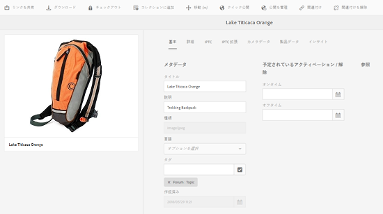

# メタデータの編集と追加 {#how-to-edit-or-add-metadata}

メタデータは、検索可能なアセットに関する追加情報です。画像をアップロードすると自動的に抽出されます。既存のメタデータを編集したり、新しいメタデータプロパティを既存のフィールドに追加（例えば、メタデータフィールドが空白の場合など）したりすることができます。

どの企業でも、メタデータの語彙を制御して信頼性を確保する必要があります。そのため、AEM Assets では、新しいメタデータプロパティをアドホックに追加することはできません。作成者は、アセットの新しいメタデータフィールドを追加することはできませんが、開発者は追加できます。[アセットの新しいメタデータプロパティの作成](meta-edit.md#editing-metadata-schema)を参照してください。

## アセットのメタデータの編集 {#editing-metadata-for-an-asset}

メタデータを編集するには、次の手順に従います。

1. 次のいずれかの操作をおこないます。

   * Assets UI でアセットを選択し、ツールバーの「**[!UICONTROL プロパティを表示]**」アイコンをクリックまたはタップします。
   * アセットのサムネールから、「**[!UICONTROL プロパティを表示]**」クイックアクションを選択します。
   * アセットページで、ツールバーの&#x200B;**[!UICONTROL プロパティを表示]**&#x200B;アイコンをクリックまたはタップします。

   アセットページに、アセットのメタデータがすべて表示されます。このメタデータは、AEM Assets にアップロードされた（取り込まれた）ときに、自動的に抽出されたものです。

   

1. 様々なタブで必要に応じてメタデータを編集したら、ツールバーの「**[!UICONTROL 保存]**」をクリックまたはタップして、変更内容を保存します。「**[!UICONTROL 閉じる]**」をクリックまたはタップして、Assets Web インターフェイスに戻ります。

   >[!NOTE]
   >
   >テキストフィールドが空の場合、現在設定されているメタデータはありません。フィールドに値を入力して保存すると、そのメタデータプロパティを追加できます。

アセットのメタデータへの変更内容は、XMP データの一部として元のバイナリに書き戻されます。この操作は、AEM のメタデータの書き戻しワークフローによって実行されます。既存のプロパティ（`dc:title` など）への変更は上書きされ、新しく作成されたプロパティ（`cq:tags` などのカスタムプロパティを含む）はスキーマとともに追加されます。

XMP の書き戻しは、[技術要件](/help/sites-deploying/technical-requirements.md)に示されたプラットフォームおよびファイル形式でサポートされ、有効になります。

## メタデータスキーマの編集 {#editing-metadata-schema}

メタデータスキーマの編集方法について詳しくは、[メタデータスキーマフォームの編集](metadata-schemas.md#editing-metadata-schema-forms)を参照してください。

## AEM 内でのカスタム名前空間の登録 {#registering-a-custom-namespace-within-aem}

AEM 内での独自の名前空間を追加できます。cq、jcr、sling など事前に定義された名前空間があるように、リポジトリメタデータと xml 処理用の名前空間を設定できます。

1. ノードタイプ管理ページ`https://[AEM_server]:[port]/crx/explorer/nodetypes/index.jsp`に移動します。
1. ページ上部の「**[!UICONTROL 名前空間]**」をクリックまたはタップします。ウィンドウに名前空間管理ページが表示されます。

1. 名前空間を追加するには、下部の「**[!UICONTROL 新規]**」をクリックまたはタップします。
1. XML 名前空間規則に従って、カスタム名前空間を指定（URI 形式の id と、その id に関連付けられているプレフィックスを指定）したら、「**[!UICONTROL 保存]**」をクリックまたはタップします。

## ヒントと制限事項 {#best-practices-limitations}

* タッチUIを使用したメタデータの更新により、`dc`名前空間のメタデータのプロパティが変更されます。 HTTP APIを使用して更新をおこなうと、`jcr`名前空間のメタデータプロパティが変更されます。 [HTTP API](/help/assets/mac-api-assets.md#update-asset-metadata)を使用してメタデータを更新する方法を参照してください。

>[!MORELIKETHIS]
>
>* [メタデータとそのアセットでのニーズについて](metadata.md)

