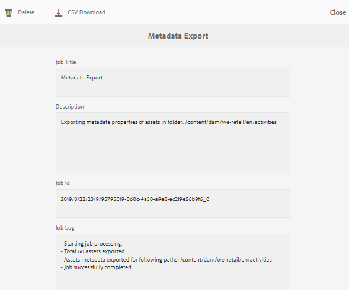

# メタデータの一括インポートとエクスポート{#bulk-metadata-import-and-export}

AEM Assets では、CSV ファイルを使用して、アセットのメタデータを一括で読み込むことができます。CSV ファイルを読み込むことで、最近アップロードされたアセットや既存のアセットの一括更新をおこなうことができます。また、サードパーティシステムから CSV 形式でアセットメタデータを一括で取り込むこともできます。

## メタデータの読み込み  {#import-metadata}

メタデータの読み込みは非同期であり、システムのパフォーマンスに影響はありません。ワークフロー実行フラグがチェックされている場合、XMP 書き戻しアクティビティが発生するので、複数のアセットのメタデータを同時に更新すると、リソースが集中的に使用されるおそれがあります。他のユーザーのパフォーマンスへの影響を防ぐために、リーンサーバーの使用時にインポートを計画します。

>[!NOTE]
>
>カスタム名前空間にメタデータを読み込むには、まず、その名前空間を登録します。

メタデータを一括で読み込むには、次の手順に従います。

1. Assets ユーザーインターフェイスに移動して、ツールバーの「**[!UICONTROL 作成]**」をタップまたはクリックします。
1. メニューから「**[!UICONTROL メタデータ]**」を選択します。
1. **[!UICONTROL メタデータの読み込み]**&#x200B;ページで、**[!UICONTROL ファイルを選択]**&#x200B;をタップまたはクリックします。  メタデータが入った CSV ファイルを選択します。
1. CSVファイルに次のパラメーターが含まれていることを確認します。

   | メタデータ読み込みパラメーター | 説明 |
   |:---|:---|
   | [!UICONTROL バッチサイズ] | メタデータを読み込むバッチ内のアセット数。デフォルト値は 50 です。最大値は 100 です。 |
   | [!UICONTROL フィールドセパレーター] | デフォルト値は`,` — カンマです。 他の文字も指定できます。 |
   | [!UICONTROL 複数の値の区切り文字] | メタデータ値のセパレーター。デフォルト値は`|` — パイプです。 |
   | [!UICONTROL ワークフローを開始] | デフォルトでは false です。trueに設定した場合に、`DAM Metadata WriteBack Workflow`に対してデフォルトのランチャー設定が有効になります(メタデータをバイナリのXMPデータに書き込みます)。 起動ワークフローを有効にすると、システムのパフォーマンスに影響を与えます。 |
   | [!UICONTROL アセットパス列名] | アセットが含まれている、CSV ファイルの列名を定義します。 |

1. ツールバーの「**[!UICONTROL 読み込み]**」をタップまたはクリックします。メタデータが読み込まれると、通知が通知インボックスに送信されます。アセットのプロパティページに移動し、メタデータ値がアセットに正常に読み込まれたかどうかを確認します。

メタデータの読み込み時に日付とタイムスタンプを追加するには、日付と時刻の `YYYY-MM-DDThh:mm:ss.fff-00:00` 形式を使用します。日付と時刻は `T` で区切られます。`hh` は 24 時間形式の時間、`fff` はナノ秒、`-00:00` はタイムゾーンオフセットです。例えば、`2020-03-26T11:26:00.000-07:00` は、2020 年 3 月 26 日の午前 11:26:00.000 PST 時間です。

>[!CAUTION]
>
>日付形式が `YYYY-MM-DDThh:mm:ss.fff-00:00` と一致しない場合、日付値は設定されません。書き出されたメタデータ CSV ファイルの日付形式は、`YYYY-MM-DDThh:mm:ss-00:00` 形式になります。インポートする場合は、`fff` で示すナノ秒値を追加して、有効な形式に変換します。

## メタデータの書き出し {#export-metadata}

メタデータの一括書き出しの使用例は次のとおりです。

* アセットの移行時にサードパーティシステムにメタデータを読み込む。
* より広範なプロジェクトチームとアセットメタデータを共有する。
* メタデータをテストまたは監査してコンプライアンスを確保する。
* メタデータを外部化して個別にローカライズできるようにする。

複数のアセットのメタデータを CSV 形式で書き出すことができます。メタデータは非同期的に書き出され、システムのパフォーマンスに影響を及ぼしません。メタデータを書き出すため、AEM はアセットノード `jcr:content/metadata` とその子ノードのプロパティを走査し、メタデータプロパティを CSV ファイルに書き出します。

複数のアセットのメタデータを一括で書き出すには、次の手順に従います。

1. メタデータを書き出すアセットを含んだアセットフォルダーを選択します。ツールバーの「**[!UICONTROL メタデータを書き出し]**」を選択します。

1. [!UICONTROL メタデータの書き出し]ダイアログで、CSVファイルの名前を指定します。 サブフォルダーのアセットのメタデータを書き出すには、「**[!UICONTROL サブフォルダーのアセットを含める]**」を選択します。

   

1. 目的のオプションを選択します。ファイル名を指定し、必要に応じて日付を指定します。
1. **[!UICONTROL 書き出すプロパティ]**&#x200B;で、すべてのプロパティを書き出すか、特定のプロパティを書き出すかを指定します。 書き出す&#x200B;**[!UICONTROL 選択した]**&#x200B;プロパティを選択する場合は、必要なプロパティを追加します。

1. ツールバーの「**[!UICONTROL 書き出し]**」をタップまたはクリックします。メタデータが書き出されることを確認するメッセージが表示されます。メッセージを閉じます。

1. 書き出しジョブのインボックス通知を開きます。ジョブを選択し、ツールバーの「**[!UICONTROL 開く]**」をクリックします。メタデータが含まれている CSV ファイルをダウンロードするには、ツールバーの「**[!UICONTROL CSV ダウンロード]**」をタップまたはクリックします。「**[!UICONTROL 閉じる]**」をクリックします。

   
