# メタデータプロファイル {#metadata-profiles}

メタデータプロファイルを使用すると、フォルダー内のアセットに初期設定のメタデータを適用できます。メタデータプロファイルを作成し、フォルダに適用します。その後フォルダにアップロードするアセットは、メタデータプロファイルで設定した初期設定のメタデータを継承します。

## メタデータプロファイルの追加 {#adding-a-metadata-profile}

1. AEMロゴをタップまたはクリックし、**[!UICONTROL ツール/アセット/メタデータプロファイル]**&#x200B;に移動し、**[!UICONTROL 作成]**&#x200B;をタップします。
1. メタデータプロファイルのタイトル（「サンプルメタデータ」など）を入力し、「**[!UICONTROL 送信]**」をクリックします。メタデータプロファイルの&#x200B;**[!UICONTROL フォーム]**&#x200B;を編集が表示されます。

   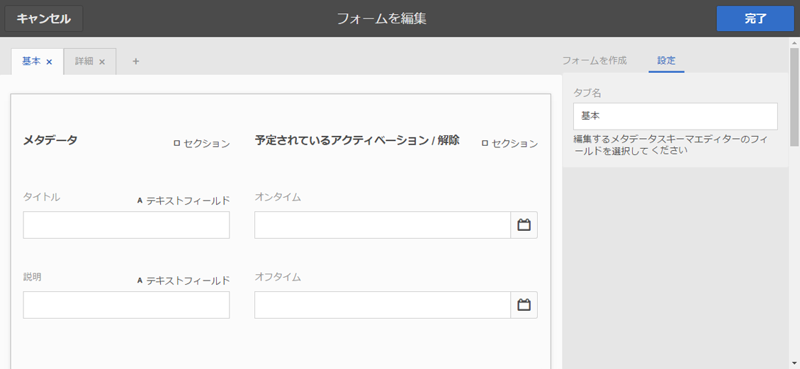

1. コンポーネントをクリックし、「**[!UICONTROL 設定]**」タブでプロパティを設定します。例えば、**[!UICONTROL 説明]**&#x200B;コンポーネントをクリックして、そのプロパティを編集します。

   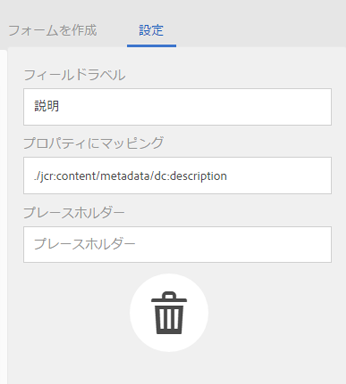

   **[!UICONTROL 説明]**&#x200B;コンポーネントについて、次のプロパティを編集します。

   * **[!UICONTROL フィールドラベル]**:メタデータプロパティの表示名です。ユーザーの参照用のみで使用します。
   * **[!UICONTROL プロパティにマップ]**:このプロパティの値は、リポジトリに保存されるアセットノードの相対パス/名前を提供します。この値は常にと開始する必要があります。これは、パスがアセットのノード下にあることを示している `./` からです。

   

   「**[!UICONTROL プロパティにマッピング]**」に指定した値は、アセットのメタデータノード下のプロパティとして保存されます。例えば、「**[!UICONTROL プロパティにマッピング]**」の名前として `/jcr:content/metadata/dc:desc` を指定した場合、AEM Assets はアセットのメタデータノードに値 `dc:desc` を保存します。

   * **[!UICONTROL デフォルト値]**：メタデータコンポーネントのデフォルト値を追加するには、このプロパティを使用します。例えば、「My description」と指定すると、この値がアセットのメタデータノードの `dc:desc` プロパティに割り当てられます。

   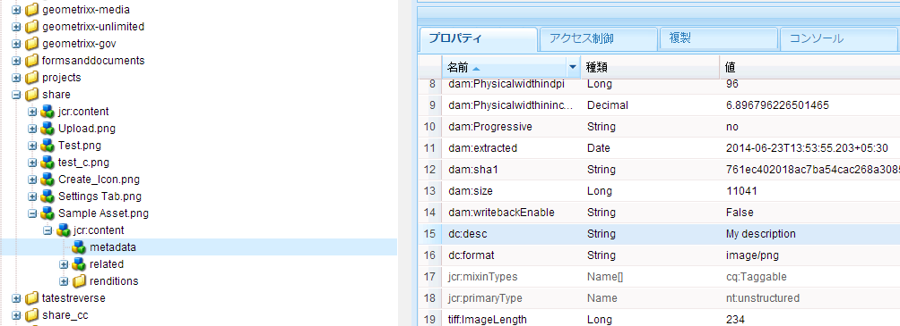

   >[!NOTE]
   >
   >新しいメタデータプロパティにデフォルト値を追加します（にまだ存在しない）。 `/jcr:content/metadata` ノード)は、デフォルトでは、アセットのプロパティページにプロパティとその値を表示しま **** せん。アセットの[!UICONTROL プロパティ]ページで新しいプロパティを表示するには、対応するスキーマフォームを変更します。

1. （オプション）「**[!UICONTROL フォームを作成]**」タブから「**[!UICONTROL フォームを編集]**」に追加追加のコンポーネントを追加し、「**[!UICONTROL 設定]**」タブでプロパティを設定します。次のプロパティは、「**[!UICONTROL フォームを作成]**」タブから使用できます。

| コンポーネント | プロパティ |
|---|---|
| [!UICONTROL セクションヘッダー] | フィールドラベル、 説明 |
| [!UICONTROL 1 行のテキスト] | フィールドラベル，  プロパティにマップ，  デフォルト値 |
| [!UICONTROL 複数値テキスト] | フィールドラベル，  プロパティにマップ，  デフォルト値 |
| [!UICONTROL 数値] | フィールドラベル，  プロパティにマップ，  デフォルト値 |
| [!UICONTROL 日付] | フィールドラベル，  プロパティにマップ，  デフォルト値 |
| [!UICONTROL 標準タグ] | フィールドラベル，  プロパティにマップ，  既定値，  説明 |

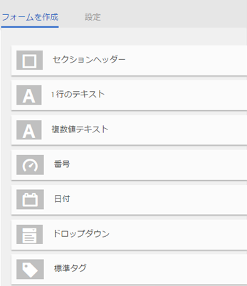

1. 「**[!UICONTROL 完了]**」をクリックします。メタデータプロファイルは、**[!UICONTROL メタデータプロファイル]**&#x200B;ページのプロファイルのリストに追加されます。

   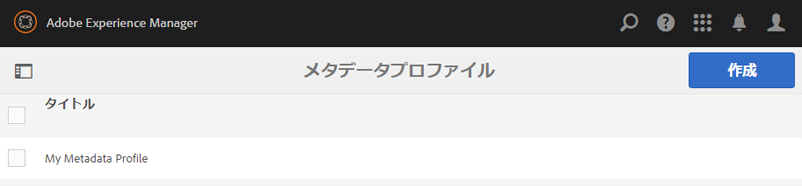

## メタデータプロファイルのコピー {#copying-a-metadata-profile}

1. **[!UICONTROL メタデータプロファイル]**&#x200B;ページから、プロファイルを選択してコピーします。

   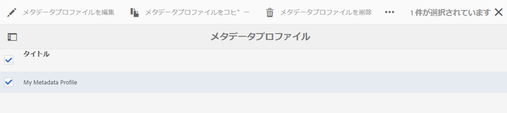

1. ツールバーの&#x200B;**[!UICONTROL コピー]**&#x200B;をクリックします。
1. 「**[!UICONTROL メタデータプロファイルをコピー]**」ダイアログで、プロファイルの新しいコピーのタイトルを入力します。
1. 「**[!UICONTROL コピー]**」をクリックします。プロファイルのコピーが、**[!UICONTROL メタデータプロファイル]**&#x200B;ページのプロファイルのリストに表示されます。

   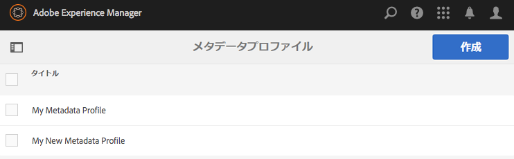

## メタデータプロファイルの削除 {#deleting-a-metadata-profile}

1. **[!UICONTROL メタデータプロファイル]**&#x200B;ページで、削除するプロファイルを選択します。

   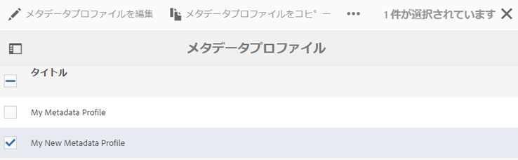

1. ツールバーの&#x200B;**[!UICONTROL メタデータプロファイル]**&#x200B;を削除をクリックします。
1. ダイアログボックスで、「**[!UICONTROL 削除]**」をクリックして削除操作を確定します。 メタデータプロファイルがリストから削除されます。

## フォルダーへのメタデータプロファイルの適用 {#applying-a-metadata-profile-to-folders}

フォルダーにメタデータプロファイルを割り当てると、サブフォルダーは自動的に親フォルダーのプロファイルを継承します。つまり、フォルダーに適用できるのは 1 つのメタデータプロファイルのみとなります。そのため、アセットをアップロード、保存、使用およびアーカイブする場所のフォルダー構造については入念に検討してください。

フォルダーに異なるメタデータプロファイルを割り当てた場合、新しいプロファイルが以前のプロファイルよりも優先されます。以前に存在していたフォルダーのアセットは変更されずに維持されます。新しいプロファイルは、その後にフォルダーに追加されるアセットに対して適用されます。

プロファイルが割り当てられているフォルダーは、ユーザーインターフェイスでカード名にプロファイルの名前が表示されます。

特定のフォルダーまたはすべてのアセットにグローバルにメタデータプロファイルを適用できます。

### 特定のフォルダーへのメタデータプロファイルの適用 {#applying-metadata-profiles-to-specific-folders}

**[!UICONTROL ツール]**&#x200B;メニュー内から、またはフォルダー内にいる場合は「**[!UICONTROL プロパティ]**」から、メタデータプロファイルをフォルダーに適用できます。この節では、メタデータプロファイルをフォルダーに適用する両方の方法について説明します。

既にプロファイルが割り当てられているフォルダーには、フォルダー名のすぐ下にプロファイルの名前が表示されます。

#### プロファイルユーザーインターフェイスからのフォルダーへのメタデータプロファイルの適用 {#applying-metadata-profiles-to-folders-from-profiles-user-interface}

1. AEM のロゴをタップし、**[!UICONTROL ツール／アセット／メタデータプロファイル]**&#x200B;に移動します。
1. 1 つまたは複数のフォルダーに適用するメタデータプロファイルを選択します。

   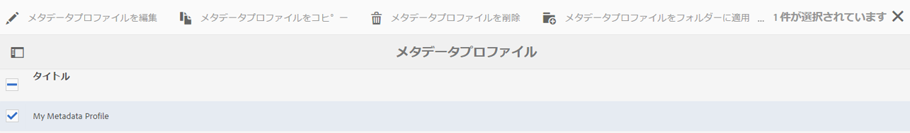

1. 「**[!UICONTROL メタデータプロファイルをフォルダーに適用]**」をタップし、新たにアップロードしたアセットを受け取る 1 つまたは複数のフォルダーを選択して、「**[!UICONTROL 完了]**」をタップします。既にプロファイルが割り当てられているフォルダーには、フォルダー名のすぐ下にプロファイルの名前が表示されます。

#### 「プロパティ」からのフォルダーへのメタデータプロファイルの適用 {#applying-metadata-profiles-to-folders-from-properties}

1. 左側のレールで、「**[!UICONTROL アセット]**」をタップし、メタデータプロファイルを適用するフォルダーに移動します。
1. チェックマークをタップして対象のフォルダーを選択し、「**[!UICONTROL プロパティ]**」をタップします。

1. 「**[!UICONTROL メタデータプロファイル]**」タブを選択し、ドロップダウンメニューからプロファイルを選択して、「**[!UICONTROL 保存]**」をクリックします。

   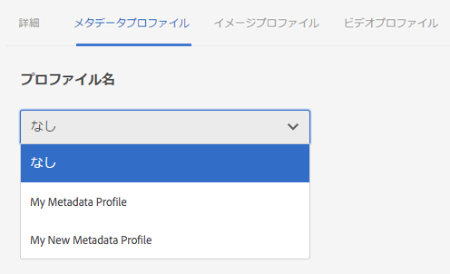

   既にプロファイルが割り当てられているフォルダーには、フォルダー名のすぐ下にプロファイルの名前が表示されます。

### メタデータプロファイルのグローバルな適用 {#applying-a-metadata-profile-globally}

特定のフォルダーにプロファイルを適用できるだけでなく、グローバルにプロファイルを適用することもできます。これにより、AEM Assets にアップロードされている、すべてのフォルダー内にあるすべてのコンテンツに、選択したプロファイルを適用できます。メタデータプロファイルをグローバルに適用するには、次の手順に従います。

1. 次のいずれかの操作をおこないます。

   * `https://[aem_server]:[port]/mnt/overlay/dam/gui/content/assets/foldersharewizard.html/content/dam`に移動し、適切なプロファイルを適用して、「**[!UICONTROL 保存]**」をタップまたはクリックします。

      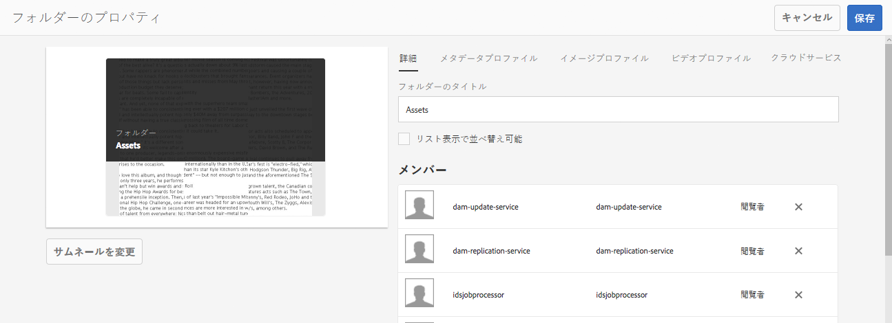

   * CRXDE Lite で、`/content/dam/jcr:content` ノードに移動します。プロパティ `metadataProfile:/etc/dam/metadata/dynamicmedia/<name_of_metadata_profile>` を追加し、「**[!UICONTROL すべて保存]**」をタップします。

      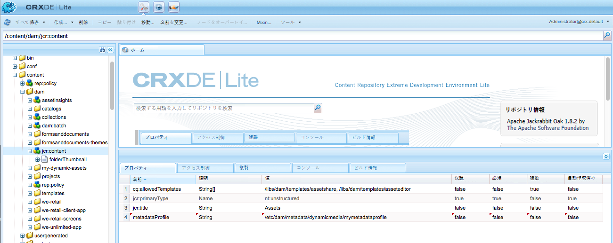

## フォルダ{#removing-a-metadata-profile-from-folders}からのメタデータプロファイルの削除

フォルダーからメタデータプロファイルを削除すると、サブフォルダーは自動的に親フォルダーのプロファイルの削除状態を継承します。ただし、フォルダー内で実行されたファイルの処理はそのまま維持されます。

**[!UICONTROL ツール]**&#x200B;メニュー内で、またはフォルダー内にいる場合は「**[!UICONTROL プロパティ]**」で、メタデータプロファイルをフォルダーから削除できます。この節では、メタデータプロファイルをフォルダーから削除する両方の方法について説明します。

### プロファイルユーザーインターフェイス{#removing-metadata-profiles-from-folders-via-profiles-user-interface}を使用して、フォルダーからメタデータプロファイルーを削除

プロファイルのユーザーインターフェイスを介して、フォルダからメタデータプロファイルを削除するには、次の手順に従います。

1. AEM のロゴをタップし、**[!UICONTROL ツール／アセット／メタデータプロファイル]**&#x200B;に移動します。
1. 1 つまたは複数のフォルダーから削除するメタデータプロファイルを選択します。
1. 「**[!UICONTROL フォルダーからメタデータプロファイルーを削除]**」をタップし、プロファイルーの削除に使用するフォルダーまたは複数のフォルダーを選択して、「**[!UICONTROL 完了]**」をタップします。

   名前がフォルダー名の下に表示されなくなっていることで、メタデータプロファイルがフォルダーに適用されていないことを確認できます。

### プロパティ{#removing-metadata-profiles-from-folders-via-properties}を使用して、フォルダーからメタデータプロファイルを削除します

1. AEM のロゴをタップして「**[!UICONTROL アセット]**」に移動した後、メタデータプロファイルを削除するフォルダーに移動します。
1. チェックマークをタップして対象のフォルダーを選択し、「**[!UICONTROL プロパティ]**」をタップします。
1. 「**[!UICONTROL メタデータプロファイル]**」タブを選択し、ドロップダウンメニューから「**[!UICONTROL なし]**」を選択します。 「**[!UICONTROL 保存]**」をタップします。

既にプロファイルが割り当てられているフォルダーには、フォルダー名のすぐ下にプロファイルの名前が表示されます。
