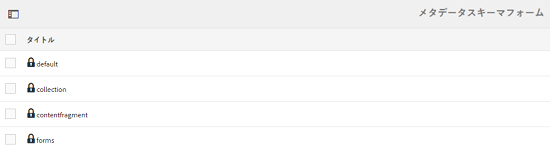

# メタデータスキーマ {#metadata-schemas}

Adobe Experience Manager(AEM)Assetsでは、メタデータスキーマは、特定のスキーマを使用するアセットに対して表示されるプロパティページのレイアウトとメタデータプロパティを定義します。 メタデータプロパティには、タイトル、説明、MIME タイプなどが含まれます。

メタデータスキーマフォームエディターを使用して、既存のスキーマを変更したり、カスタムメタデータスキーマを追加したりできます。

1. To view the properties page for an asset, click or tap the **[!UICONTROL View Properties]** from **[!UICONTROL Quick Actions]** on the asset tile in Card view.

   

   Alternatively, select an asset and then click or tap the **[!UICONTROL Properties]** icon from the toolbar.

   

1. 様々なタブで、編集可能なメタデータプロパティを編集します。

   

   アセットの MIME タイプを変更するには、カスタムメタデータスキーマフォームを使用するか、既存のフォームを変更します。詳しくは、[メタデータスキーマフォームの編集](metadata-schemas.md#editing-metadata-schema-forms)を参照してください。特定の MIME タイプのメタデータスキーマを変更すると、現在の MIME タイプのアセットおよびすべてのアセットサブタイプのプロパティページのレイアウトが変更されます。For example, modifying a `jpeg` schema under `default/image` only modifies the metadata layout (asset properties) for assets with MIME type `IMAGE/JPEG`. ただし、デフォルトスキーマを編集する場合は、すべてのタイプのアセットのメタデータのレイアウトを変更します。

1. フォームやテンプレートのリストを表示するには、AEM のロゴをクリックし、**[!UICONTROL ツール／アセット／メタデータスキーマ]**&#x200B;に移動します。

   

   AEM では次のテンプレートが用意されています。

   * **デフォルト**：アセットのメタデータスキーマの基本フォームです。
   次の子フォームは、デフォルトフォームのプロパティを継承します。

   i. **image**: Schema form for assets with the MIME type `image`, for example, `image/jpeg`, `image/png`, and so on.

   「image」フォームには、次の子フォームテンプレートがあります。

   a. **jpeg**: Schema form for assets with sub type jpeg.

   b. **tiff**: Schema form for the assets with sub type TIFF.

   ii.**application**:MIMEタイプがapplicationのアセット（、など）のスキ `application/pdf`ーマ `application/zip`フォームです。

   a. **pdf**: Schema form for assets with sub type PDF.

   iii. **ビデオ**:MIMEタイプがビデオのアセット（など）のスキ `video/avi`ーマ `video/mp4` フォーム。

   * **コレクション**:コレクションのスキーマフォーム
   * **** contentfragment:コンテンツフラグメントのスキーマフォーム
   * **forms**:このスキーマフォームは [Adobe Experience Manager Formsに関連しています](/help/forms/home.md)

>[!NOTE]
>
>スキーマフォームの子フォームを表示するには、スキーマフォーム名をクリックまたはタップします。

## メタデータスキーマフォームの追加 {#adding-a-metadata-schema-form}

1. To add a custom template to the list, click **[!UICONTROL Create]** from the toolbar.

   >[!NOTE]
   >
   >未編集のテンプレートの前には、鍵のアイコンが表示されます。 テンプレートをカスタマイズすると、テンプレートの前のロックアイコンが消えます。

1. In the dialog, enter the title of the schema form and click **[!UICONTROL Create]** to complete the form creation process.

   

## メタデータスキーマフォームの編集 {#editing-metadata-schema-forms}

新しく追加したメタデータスキーマフォームまたは既存のメタデータスキーマフォームを編集できます。メタデータスキーマフォームには、以下の要素が含まれています。

* タブ
* タブ内のフォーム項目

これらのフォーム項目を CRX リポジトリのメタデータノード内のフィールドにマップしたり、フォーム項目を設定したりできます。

新しいタブまたはフォーム項目をメタデータスキーマフォームに追加できます。親から派生したタブとフォームアイテムはロック状態です。 子レベルではこれらを変更できません。

1. In the **[!UICONTROL Schema Forms]** page, select the check box before a form and then click **[!UICONTROL Edit]** on the toolbar.

   

1. **[!UICONTROL メタデータスキーマエディター]**&#x200B;ページで、アセットのプロパティページをカスタマイズします。「**[!UICONTROL フォームを作成]**」タブのコンポーネントタイプのリストから「**[!UICONTROL 基本]**」タブに、1 つ以上のコンポーネントをドラッグします。

   

1. コンポーネントを設定するには、コンポーネントを選択して、「**[!UICONTROL 設定]**」タブでそのプロパティを変更します。

### 「フォームを作成」タブ内のコンポーネント{#components-within-the-build-form-tab}

The **[!UICONTROL Build Form]** tab lists form items that you use in your schema form. 「**[!UICONTROL 設定]**」タブに、「**[!UICONTROL フォームを作成]**」タブで選択した各項目の属性が表示されます。「**[!UICONTROL フォームを作成]**」タブで使用できるフォーム項目を次の表に示します。

| コンポーネント名 | 説明 |
|---|---|
| [!UICONTROL セクションヘッダー] | 共通コンポーネントのリストに対してセクションヘッダーを追加します。 |
| [!UICONTROL 1 行のテキスト] | 1 行のテキストプロパティを追加します。これは文字列として保存されます。 |
| [!UICONTROL 複数値テキスト] | 複数値テキストプロパティを追加します。これは文字列の配列として保存されます。 |
| [!UICONTROL 番号] | 数値コンポーネントを追加します。 |
| [!UICONTROL 日付] | 日付コンポーネントを追加します。 |
| [!UICONTROL ドロップダウン] | ドロップダウンリストを追加します。 |
| [!UICONTROL 標準タグ] | タグを追加します。 |
| [!UICONTROL スマートタグ] | メタデータタグを自動的に追加して、検索機能を強化します。 |
| [!UICONTROL 非表示のフィールド] | 非表示のフィールドを追加します。このフィールドは、アセットの保存時に POST パラメーターとして送信されます。 |
| [!UICONTROL アセットの参照元] | このアセットが参照しているアセットのリストを表示するには、このコンポーネントを追加します。 |
| [!UICONTROL アセットの参照] | このアセットを参照しているアセットのリストを表示するには、このコンポーネントを追加します。 |
| [!UICONTROL 製品リファレンス] | このアセットとリンクされている製品のリストを表示するには、このコンポーネントを追加します。 |
| [!UICONTROL アセット評価] | アセットを評価するオプションを表示するには、このコンポーネントを追加します。 |
| [!UICONTROL コンテキストメタデータ] | アセットのプロパティページにある他のメタデータタブの表示を制御するために追加します。 |

### メタデータコンポーネントの編集 {#editing-the-metadata-component}

フォームのメタデータコンポーネントのプロパティを編集するには、コンポーネントをクリックし、「**[!UICONTROL 設定]**」タブで次のすべてのプロパティまたはサブセットを編集します。

**フィールドラベル**:アセットのプロパティページに表示されるメタデータプロパティの名前。

**プロパティにマッピング**：このプロパティには、CRX リポジトリ内の保存先のアセットノードへの相対パスまたは名前を指定します。It starts with `./` because indicating that the path is under the asset&#39;s node.

このプロパティの有効な値は次のとおりです。

* `./jcr:content/metadata/dc:title`：アセットのメタデータノードにプロパティ `dc:title` として値を格納します。

* `./jcr:created`:アセットのノードにJCRプロパティを表示します。 表示プロパティ上でこれらのプロパティを設定する場合は、これらのプロパティは保護されているので、「編集を無効にする」としてマークすることをお勧めします。Otherwise, the error [!UICONTROL Asset(s) failed to modify] results when you save the asset&#39;s properties.

コンポーネントがメタデータスキーマフォームに適切に表示されるように、プロパティのパスにはスペースを含めないでください。

**プレースホルダー**：このプロパティを使用して、メタデータプロパティに関連するプレースホルダーテキストを指定します。

**必須**：プロパティページでメタデータプロパティを必須としてマークするには、このプロパティを使用します。

**編集を無効にする**：プロパティページでメタデータプロパティを編集不可にするには、このプロパティを使用します。

**空白のフィールドを読み取り専用として表示**：プロパティページでメタデータプロパティに値がなくても表示するには、このプロパティをオンにします。デフォルトでは、メタデータプロパティに値がない場合、プロパティページには表示されません。

**順序付きリストを表示**:このプロパティを使用して、選択肢の順番付きリストを表示します

**選択肢**：リストの選択肢を指定するには、このプロパティを使用します。

**説明**：メタデータコンポーネントの短い説明を追加するには、このプロパティを使用します。

**クラス**：プロパティに関連付けられているオブジェクトクラス。

**削除アイコン** ：スキーマフォームからコンポーネントを削除するには、このアイコンをクリックします。

>[!NOTE]
>
>非表示のフィールドコンポーネントには、これらの属性は含まれていません。代わりに、属性の名前、値、フィールドラベル、説明などのプロパティが含まれています。非表示のフィールドコンポーネントの値は、アセットの保存時に常に POST パラメーターとして送信されます。この値は、アセットのメタデータとして保存されません。

「**[!UICONTROL 必須]**」オプションを選択した場合、必須のメタデータが設定されていないアセットを検索できます。**[!UICONTROL フィルター]**&#x200B;パネルで、「**[!UICONTROL メタデータの検証]**」述語を展開して、「**[!UICONTROL 無効]**」オプションを選択します。検索結果に、スキーマフォームで設定した必須のメタデータが設定されていないアセットが表示されます。

任意のスキーマフォームの任意のタブにコンテキストメタデータコンポーネントを追加すると、そのコンポーネントは、特定のスキーマが適用されるアセットのプロパティページにリストとして表示されます。 このリストには、Contextual Metadataコンポーネントを適用したタブを除く他のすべてのタブが含まれます。 現在、この機能は、コンテキストに応じてメタデータの表示を制御する基本的な機能を提供しています。

コンテキストメタデータコンポーネントが適用されているタブに加えて、プロパティページの任意のタブを組み込むには、リストからタブを選択します。タブがプロパティページに追加されます。

### Specify properties in JSON file {#specifying-properties-in-json-file}

「**[!UICONTROL 設定]**」タブのオプションでプロパティを指定する代わりに、対応するキーと値のペアを指定することで JSON ファイルでオプションを定義できます。「**[!UICONTROL JSON パス]**」フィールドに JSON ファイルのパスを指定します。

### スキーマフォームでのタブの追加または削除 {#adding-deleting-a-tab-in-the-schema-form}

スキーマエディターで、タブを追加または削除できます。デフォルトのスキーマフォームには、「**[!UICONTROL 基本]**」、「**[!UICONTROL 詳細]**」、「**[!UICONTROL IPTC]**」および「**[!UICONTROL IPTC 拡張]**」タブがデフォルトで含まれています。

Click `+` to add a new tab on a schema form. By default, the new tab has the name `Unnamed-1`. You can modify the name from the **[!UICONTROL Settings]** tab. Click `X` to delete a tab.

## メタデータスキーマフォームの削除 {#deleting-metadata-schema-forms}

AEM では、カスタムのスキーマフォームのみを削除できます。デフォルトのスキーマフォームまたはテンプレートを削除することはできません。ただし、これらのフォームでのカスタムの変更内容は削除できます。

フォームを削除するには、フォームを選択して&#x200B;**[!UICONTROL 削除]**&#x200B;アイコンをクリックします。

>[!NOTE]
>
>デフォルトのフォームに対するカスタム変更を削除すると、メタデータスキーマインターフェイスにロックアイコンが再び表示され、フォームがデフォルトの状態に戻ったことを示します。

>[!NOTE]
>
>AEM Assets の既製のメタデータスキーマフォームは削除できません。

## MIME タイプ用のスキーマフォーム {#schema-forms-for-mime-types}

AEM Assets には、様々な MIME タイプですぐに使用できるデフォルトのフォームが用意されています。ただし、様々な MIME タイプのアセットにカスタムのフォームを追加することができます。

### Add new forms for MIME types {#adding-new-forms-for-mime-types}

適切なフォームタイプの下で新規フォームを作成します。For example, to add a new template for the `image/png` subtype, create the form under the `image` forms. スキーマフォームのタイトルはサブタイプ名です。In this case, the title is `png`.

### Use an existing schema template for various MIME types {#using-an-existing-schema-template-for-various-mime-types}

別のMIMEタイプに対して既存のテンプレートを使用できます。 例えば、MIMEタイプのアセ `image/jpeg` ットに対してフォームを使用しま `image/png`す。

この場合は、CRX リポジトリ内の `/etc/dam/metadataeditor/mimetypemappings` に新しいノードを作成します。そのノードの名前を指定し、次のプロパティを定義します。

| 名前 | 説明 | タイプ | 値 |
|---|---|---|---|
| `exposedmimetype` | マッピングする既存のフォームの名前 | `String` | `image/jpeg` |
| `mimetypes` | List of MIME types that use the form defined in the `exposedmimetype` attribute | `String` | `image/png` |

AEM Assets では、次の MIME タイプとスキーマフォームがマッピングされます。

| スキーマフォーム | MIME タイプ |
|---|---|
| image/jpeg | image/pjpeg |
| image/tiff | image/x-tiff |
| application/pdf | application/postscript |
| application/x-ImageSet | Multipart/Related; type=application/x-ImageSet |
| application/x-SpinSet | Multipart/Related; type=application/x-SpinSet |
| application/x-MixedMediaSet | Multipart/Related; type=application/x-MixedMediaSet |
| video/quicktime | video/x-quicktime |
| video/mpeg4 | video/mp4 |
| video/avi | video/avi, video/msvideo, video/x-msvideo |
| video/wmv | video/x-ms-wmv |
| video/flv | video/x-flv |

## メタデータスキーマへのアクセス権の付与 {#granting-access-to-metadata-schemas}

メタデータスキーマ機能は、管理者のみが使用できます。 ただし、管理者は、フォルダーに対して **[!UICONTROL Create]**、 **[!UICONTROL Modify]**、 **[!UICONTROL Delete]** の各権限を指定することで、管理者以外のユーザーにアクセス権を付与で `/conf` きます。

## フォルダー固有のメタデータの適用 {#applying-folder-specific-metadata}

AEM Assets では、メタデータスキーマのバリアントを定義して、それを特定のフォルダーに適用できます。

例えば、デフォルトのメタデータスキーマのバリアントを定義して、それをフォルダーに適用できます。変更したスキーマを適用すると、フォルダー内のアセットに適用されている元のデフォルトのメタデータスキーマがオーバーライドされます。

このスキーマが適用されているフォルダーにアップロードされたアセットのみが、バリアントのメタデータスキーマに定義されている変更されたメタデータに従います。

元のスキーマが適用されている他のフォルダーのアセットは、引き続き元のスキーマに定義されているメタデータに従います。

アセットごとのメタデータの継承は、階層の第 1 レベルのフォルダーに適用されているスキーマに基づきます。言い換えると、フォルダーにサブフォルダーがない場合、そのフォルダー内のアセットはそのフォルダーに適用されているスキーマからメタデータを継承します。

フォルダーにサブフォルダーがあり、サブフォルダーレベルで別のスキーマが適用されている場合、そのサブフォルダー内のアセットはそのサブフォルダーレベルで適用されているスキーマからメタデータを継承します。ただし、サブフォルダーレベルにスキーマが適用されていない、または同じスキーマが適用されている場合、サブフォルダーのアセットは親フォルダーレベルに適用されているスキーマからメタデータを継承します。

1. AEM のロゴをクリックし、**[!UICONTROL ツール／アセット／メタデータスキーマ]**&#x200B;に移動します。**[!UICONTROL メタデータスキーマフォーム]**&#x200B;ページが表示されます。
1. フォーム（デフォルトのメタデータフォームなど）の前にあるチェックボックスをオンにし、「**[!UICONTROL コピー]**」アイコンをクリックまたはタップしてカスタムフォームとして保存します。Specify a custom name for the form, for example `my_default`. カスタムフォームを作成することもできます。

   

1. In the **[!UICONTROL Metadata Schema Forms]** page, select the `my_default` form, and then click **[!UICONTROL Edit]**.

1. In the **[!UICONTROL Metadata Schema Editor]** page, add a text field to the schema form. For example add a field with the label **[!UICONTROL Category]**.

   

1. 「**[!UICONTROL 保存]**」をクリックします。変更されたフォームは&#x200B;**[!UICONTROL メタデータスキーマフォーム]**&#x200B;ページにリストされます。
1. ツールバーの「**[!UICONTROL フォルダーに適用]**」をクリックまたはタップしてカスタムメタデータをフォルダーに適用します。

   

1. Select the folder on which to apply the modified schema and then click/tap **[!UICONTROL Apply]**.

   

1. フォルダーに他のメタデータが適用されている場合は、既存のメタデータスキーマを上書きする旨の警告メッセージが表示されます。Click **[!UICONTROL Overwrite]**.
1. Click **[!UICONTROL OK]** to close the success message.
1. 変更したメタデータスキーマを適用したフォルダーに移動します。

## 必須メタデータの定義 {#defining-mandatory-metadata}

必須フィールドをフォルダーレベルで定義すると、そのフォルダーにアップロードされるアセットに強制的に適用されます。以前に定義した必須フィールドにメタデータが指定されていないアセットをアップロードすると、アセットに指定されていないメタデータをカード表示で視覚的に確認できます。

>[!NOTE]
>
>メタデータフィールドは、別のフィールドの値に基づいて、必須フィールドとして定義できます。AEM のカード表示では、このような必須メタデータフィールドのメタデータがなくても警告メッセージは表示されません。

1. AEM のロゴをクリックし、**[!UICONTROL ツール／アセット／メタデータスキーマ]**&#x200B;に移動します。**[!UICONTROL メタデータスキーマフォーム]**&#x200B;ページが表示されます。
1. デフォルトのメタデータフォームをカスタムフォームとして保存します。For example, save it as `my_default`.

   

1. カスタムフォームを編集します。必須フィールドを追加します。For example, add a **Category** field and make the field mandatory.

   

1. 「**[!UICONTROL 保存]**」をクリックします。変更されたフォームは&#x200B;**[!UICONTROL メタデータスキーマフォーム]**&#x200B;ページにリストされます。カスタムメタデータをフォルダーに適用するには、フォームを選択し、ツールバーの「 **[!UICONTROL Apply to Folder(s)]** 」をクリックまたはタップします。

1. フォルダーに移動し、カスタムフォームに追加した必須フィールドにメタデータが指定されていないアセットをアップロードします。アセットのカード表示に、必須フィールドに指定されていないメタデータについてメッセージが表示されます。

   

1. （オプション）アクセス `http://[server]:[port]/system/console/components/`。 Configure and enable `com.day.cq.dam.core.impl.MissingMetadataNotificationJob` component that is disabled by default. AEM がアセット上にあるメタデータの妥当性をチェックする頻度を設定します。この設定により、`hasValidMetadata` プロパティがアセットの jcr:content に追加されます。AEM はこのプロパティを使用して検索の結果をフィルターできます。

>[!NOTE]
>
>If an asset is added after the scheduled check, the asset is not flagged with `hasValidMetadata` until  the next scheduled check. アセットは中間検索結果に表示されません。

>[!C注意]
>
>メタデータの検証チェックは、大量のリソースを必要とするので、システムのパフォーマンスに影響を及ぼす可能性があります。検証チェックのスケジュール設定は、適切におこなう必要があります。AEMデプロイメントにパフォーマンスの問題がある場合は、このジョブを無効にしてみてください。
