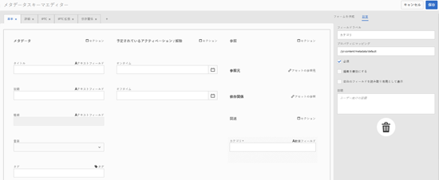

# メタデータスキーマ {#metadata-schemas}

[!DNL Experience Manager Assets]には、メタデータスキーマがプロパティページのレイアウトと、特定のスキーマを使用するアセットに対して表示されるメタデータプロパティを定義します。 メタデータプロパティには、タイトル、説明、MIME タイプなどが含まれます。既存のスキーマを変更したり、カスタムのメタデータスキーマを追加するには、メタデータスキーマフォームエディターを使用します。

アセットのプロパティページを表示して編集するには、次の手順に従います。

1. カード表示のアセットタイルのクイックアクションで、**[!UICONTROL 表示のプロパティ]**&#x200B;をクリックまたはタップします。

   

   または、アセットを選択し、ツールバーの&#x200B;**[!UICONTROL プロパティ]**&#x200B;アイコンをクリックまたはタップします。

   

1. 使用可能なタブで、編集可能な様々なメタデータプロパティを編集できます。 ただし、プロパティページの「[!UICONTROL 基本]」タブで[!UICONTROL Type]アセットを変更することはできません。

   

   アセットの MIME タイプを変更するには、カスタムメタデータスキーマフォームを使用するか、既存のフォームを変更します。詳しくは、[メタデータスキーマフォームの編集](metadata-schemas.md#editing-metadata-schema-forms)を参照してください。特定の MIME タイプのメタデータスキーマを変更すると、現在の MIME タイプのアセットおよびすべてのアセットサブタイプのプロパティページのレイアウトが変更されます。例えば、`default/image`の下の`jpeg`スキーマを変更すると、MIMEタイプ`IMAGE/JPEG`を持つアセットのメタデータレイアウト（アセットプロパティ）のみが変更されます。 ただし、デフォルトスキーマを編集する場合は、すべてのタイプのアセットのメタデータのレイアウトを変更します。

## メタデータスキーマフォーム {#default-metadata-schema-forms}

フォーム/テンプレートのリストを表示するには、[!DNL Experience Manager]インターフェイスで&#x200B;**[!UICONTROL ツール]**/**[!UICONTROL アセット]**/**[!UICONTROL メタデータスキーマ]**&#x200B;に移動します。

[!DNL Experience Manager] には、次のメタデータスキーマフォームテンプレートが用意されています。

| テンプレート |  | 説明 |
|---|---|---|
| [!UICONTROL default] |  | アセットのベースメタデータスキーマフォーム。 |
|  | 次の子フォームは、[!UICONTROL デフォルト]フォームのプロパティを継承します。 |  |
|  | <ul><li> [!UICONTROL dm_video]</li></ul> | Dynamic Mediaビデオのスキーマフォーム。 |
|  | <ul><li> [!UICONTROL 画像]</li></ul> | MIMEタイプが「image」であるアセットのスキーマフォーム（例：image/jpeg、image/png）。   この  画像フォームには、次の子フォームテンプレートがあります。 <ul><li> [!UICONTROL jpeg]:サブタイプが [!UICONTROL jpegのアセットのスキーマフォーム]。</li> <li>[!UICONTROL tiff]:サブタイプが [!UICONTROL tiffのアセットのスキーマフォーム]。</li></ul> |
|  | <ul><li> [!UICONTROL アプリケーション]</li></ul> | application/ pdf、application/ zipなど、MIMEタイプが「application」のアセットのスキーマフォーム。  [!UICONTROL pdf]:サブタイプpdfのアセットのスキーマフォーム |
|  | <ul><li>[!UICONTROL ビデオ]</li></ul> | video/avi、video/mp4など、MIMEタイプが「video」のアセットのスキーマフォーム。 |
| [!UICONTROL collection] |  | コレクションのスキーマフォーム。 |
| [!UICONTROL contentfragment] |  | コンテンツフラグメントのスキーマフォーム。 |
| [!UICONTROL forms] |  | このスキーマ形式は[Adobe Experience Manager Forms](/help/forms/home.md)に関するものです。 |

>[!NOTE]
>
>スキーマフォームの子フォームを表示するには、スキーマフォーム名をクリックまたはタップします。

## メタデータスキーマフォームの追加 {#adding-a-metadata-schema-form}

1. リストにカスタムテンプレートを追加するには、ツールバーの「**[!UICONTROL 作成]**」をクリックします。

   >[!NOTE]
   >
   >未編集のテンプレートには、その前に鍵のアイコンが表示されます。 テンプレートをカスタマイズすると、テンプレートの前のロックアイコンが消えます。

1. ダイアログで、スキーマフォームのタイトルを入力し、「**[!UICONTROL 作成]**」をクリックしてフォーム作成プロセスを完了します。

   

## メタデータスキーマフォームの編集 {#editing-metadata-schema-forms}

新しく追加したメタデータスキーマフォームまたは既存のメタデータスキーマフォームを編集できます。メタデータスキーマフォームには、以下の要素が含まれています。

* タブ
* タブ内のフォーム項目

これらのフォーム項目を CRX リポジトリのメタデータノード内のフィールドにマップしたり、フォーム項目を設定したりできます。

新しいタブまたはフォーム項目をメタデータスキーマフォームに追加できます。親から派生したタブおよびフォーム項目はロック状態です。子レベルではこれらを変更できません。

1. **[!UICONTROL スキーマForms]**&#x200B;ページで、フォームの前のチェックボックスを選択し、ツールバーの「**[!UICONTROL 編集]**」をクリックします。

   

1. **[!UICONTROL メタデータスキーマエディター]**&#x200B;ページで、アセットのプロパティページをカスタマイズします。それには、「**[!UICONTROL フォームを作成]**」タブのコンポーネントタイプのリストから「**[!UICONTROL 基本]**」タブに、1 つ以上のコンポーネントをドラッグします。

   

1. コンポーネントを設定するには、コンポーネントを選択して、「**[!UICONTROL 設定]**」タブでそのプロパティを変更します。

### 「フォームを作成」タブ内のコンポーネント{#components-within-the-build-form-tab}

「**[!UICONTROL フォームを作成]**」タブには、スキーマフォーム内で使用するフォーム項目が表示されます。「**[!UICONTROL 設定]**」タブに、「**[!UICONTROL フォームを作成]**」タブで選択した各項目の属性が表示されます。「**[!UICONTROL フォームを作成]**」タブで使用できるフォーム項目を次の表に示します。

| コンポーネント名 | 説明 |
|---|---|
| [!UICONTROL セクションヘッダー] | 共通コンポーネントのリストに対してセクションヘッダーを追加します。 |
| [!UICONTROL 1 行のテキスト] | 1 行のテキストプロパティを追加します。これは文字列として保存されます。 |
| [!UICONTROL 複数値テキスト] | 複数値テキストプロパティを追加します。これは文字列の配列として保存されます。 |
| [!UICONTROL 番号] | 数値コンポーネントを追加します。 |
| [!UICONTROL 日付] | 日付コンポーネントを追加します。 |
| [!UICONTROL ドロップダウン] | ドロップダウンリストを追加します。 |
| [!UICONTROL 標準タグ] | タグを追加します。 |
| [!UICONTROL スマートタグ] | メタデータタグを自動的に追加して、検索機能を強化します。 |
| [!UICONTROL 非表示のフィールド] | 非表示のフィールドを追加します。このフィールドは、アセットの保存時に POST パラメーターとして送信されます。 |
| [!UICONTROL アセットの参照元] | このアセットが参照しているアセットのリストを表示するには、このコンポーネントを追加します。 |
| [!UICONTROL アセットの参照] | このアセットを参照しているアセットのリストを表示するには、このコンポーネントを追加します。 |
| [!UICONTROL 製品リファレンス] | このアセットとリンクされている製品のリストを表示するには、このコンポーネントを追加します。 |
| [!UICONTROL アセット評価] | アセットを評価するオプションを表示するには、このコンポーネントを追加します。 |
| [!UICONTROL コンテキストメタデータ] | アセットのプロパティページにある他のメタデータタブの表示を制御するために追加します。 |

### メタデータコンポーネントの編集 {#editing-the-metadata-component}

フォームのメタデータコンポーネントのプロパティを編集するには、コンポーネントをクリックし、「**[!UICONTROL 設定]**」タブで次のすべてのプロパティまたはサブセットを編集します。

**フィールドラベル**：アセットのプロパティページに表示されるメタデータプロパティの名前。

**プロパティにマッピング**：このプロパティには、CRX リポジトリ内の保存先のアセットノードへの相対パスまたは名前を指定します。この値は、パスがアセットノードの配下にあることを示しているので、「`./`」で始まります。

このプロパティの有効な値は次のとおりです。

* `./jcr:content/metadata/dc:title`：アセットのメタデータノードにある値を、プロパティ `dc:title` として格納します。

* `./jcr:created`:アセットのノードでJCRプロパティを表示します。表示プロパティ上でこれらのプロパティを設定する場合は、これらのプロパティは保護されているので、「編集を無効にする」としてマークすることをお勧めします。それ以外の場合は、アセットのプロパティを保存すると、[!UICONTROL アセットの結果を変更できませんでした。]

コンポーネントがメタデータスキーマフォームに適切に表示されるように、プロパティのパスにはスペースを含めないでください。

**プレースホルダー**：このプロパティを使用して、メタデータプロパティに関連するプレースホルダーテキストを指定します。

**必須**：プロパティページでメタデータプロパティを必須としてマークするには、このプロパティを使用します。

**編集を無効にする**：プロパティページでメタデータプロパティを編集不可にするには、このプロパティを使用します。

**空白のフィールドを読み取り専用として表示**：プロパティページでメタデータプロパティに値がなくても表示するには、このプロパティをオンにします。デフォルトでは、メタデータプロパティに値がない場合、プロパティページには表示されません。

**リストを並べ替えて表示**：選択肢のリストを並べ替えて表示するには、このプロパティを使用します。

**選択肢**：リストの選択肢を指定するには、このプロパティを使用します。

**説明**：メタデータコンポーネントの短い説明を追加するには、このプロパティを使用します。

**クラス**：プロパティに関連付けられているオブジェクトクラス。

**削除** アイコンこのアイコンをクリックすると、スキーマフォームからコンポーネントが削除されます。

>[!NOTE]
>
>非表示のフィールドコンポーネントには、これらの属性は含まれていません。代わりに、属性の名前、値、フィールドラベル、説明などのプロパティが含まれています。非表示のフィールドコンポーネントの値は、アセットの保存時に常に POST パラメーターとして送信されます。この値は、アセットのメタデータとして保存されません。

「**[!UICONTROL 必須]**」オプションを選択した場合、必須のメタデータが設定されていないアセットを検索できます。**[!UICONTROL フィルター]**&#x200B;パネルで、「**[!UICONTROL メタデータの検証]**」述語を展開して、「**[!UICONTROL 無効]**」オプションを選択します。検索結果に、スキーマフォームで設定した必須のメタデータが設定されていないアセットが表示されます。

コンテキストメタデータコンポーネントを任意のスキーマフォームの任意のタブに追加すると、そのコンポーネントは、特定のスキーマが適用されるアセットのプロパティページにリストとして表示されます。 このリストには、コンテキストメタデータコンポーネントを適用したタブを除く、他のすべてのタブが含まれます。現在、この機能は、コンテキストに応じてメタデータの表示を制御する基本的な機能を提供しています。

コンテキストメタデータコンポーネントが適用されているタブに加えて、プロパティページの任意のタブを組み込むには、リストからタブを選択します。タブがプロパティページに追加されます。

### JSON ファイルでのプロパティの指定 {#specifying-properties-in-json-file}

「**[!UICONTROL 設定]**」タブのオプションでプロパティを指定する代わりに、対応するキーと値のペアを指定することで JSON ファイルでオプションを定義できます。「**[!UICONTROL JSON パス]**」フィールドに JSON ファイルのパスを指定します。

### スキーマフォームでのタブの追加または削除 {#adding-deleting-a-tab-in-the-schema-form}

スキーマエディターで、タブを追加または削除できます。デフォルトのスキーマフォームには、「**[!UICONTROL 基本]**」、「**[!UICONTROL 詳細]**」、「**[!UICONTROL IPTC]**」および「**[!UICONTROL IPTC 拡張]**」の各タブがデフォルトで含まれています。

「`+`」をクリックすると、スキーマフォームに新しいタブを追加できます。新しいタブにはデフォルトで「`Unnamed-1`」という名前が付けられます。この名前は、「**[!UICONTROL 設定]**」タブで編集できます。タブを削除するには、「`X`」をクリックします。

## メタデータスキーマフォームの削除 {#deleting-metadata-schema-forms}

AEM では、カスタムのスキーマフォームのみを削除できます。デフォルトのスキーマフォームまたはテンプレートを削除することはできません。ただし、これらのフォームでのカスタムの変更内容は削除できます。

フォームを削除するには、フォームを選択して&#x200B;**[!UICONTROL 削除]**&#x200B;アイコンをクリックします。

>[!NOTE]
>
>デフォルトのフォームに対するカスタム変更を削除すると、メタデータスキーマインターフェイスに錠前のアイコンが再び表示され、フォームがデフォルトの状態に戻ったことを示します。

>[!NOTE]
>
>AEM Assets の既製のメタデータスキーマフォームは削除できません。

## MIME タイプ用のスキーマフォーム  {#schema-forms-for-mime-types}

AEM Assets には、様々な MIME タイプですぐに使用できるデフォルトのフォームが用意されています。ただし、様々な MIME タイプのアセットにカスタムのフォームを追加することができます。

### 追加MIMEタイプ用の新しいフォーム{#adding-new-forms-for-mime-types}

適切なフォームタイプに新規フォームを作成します。例えば、サブタイプ`image/png`に新しいテンプレートを追加するには、`image`フォームの下にフォームを作成します。 スキーマフォームのタイトルはサブタイプ名です。この場合、タイトルは`png`です。

### 様々なMIMEタイプに対して既存のスキーマテンプレートを使用{#using-an-existing-schema-template-for-various-mime-types}

別の MIME タイプに対して既存のテンプレートを使用できます。例えば、MIME タイプ `image/png` のアセットに対して `image/jpeg` フォームを使用します。

この場合は、CRX リポジトリ内の `/etc/dam/metadataeditor/mimetypemappings` に新しいノードを作成します。そのノードの名前を指定し、次のプロパティを定義します。

| 名前 | 説明 | タイプ | 値 |
|---|---|---|---|
| `exposedmimetype` | マッピングする既存フォームの名前 | `String` | `image/jpeg` |
| `mimetypes` | `exposedmimetype` 属性で定義したフォームを使用する MIME タイプのリスト | `String` | `image/png` |

AEM Assets では、次の MIME タイプとスキーマフォームがマッピングされます。

| スキーマフォーム | MIME タイプ |
|---|---|
| image/jpeg | image/pjpeg |
| image/tiff | image/x-tiff |
| application/pdf | application/postscript |
| application/x-ImageSet | Multipart/Related; type=application/x-ImageSet |
| application/x-SpinSet | Multipart/Related; type=application/x-SpinSet |
| application/x-MixedMediaSet | Multipart/Related; type=application/x-MixedMediaSet |
| video/quicktime | video/x-quicktime |
| video/mpeg4 | video/mp4 |
| video/avi | video/avi, video/msvideo, video/x-msvideo |
| video/wmv | video/x-ms-wmv |
| video/flv | video/x-flv |

## メタデータスキーマへのアクセス権の付与 {#granting-access-to-metadata-schemas}

メタデータスキーマ機能は、管理者のみが使用できます。 ただし、管理者は、`/conf`フォルダーの&#x200B;**[!UICONTROL 作成]**、**[!UICONTROL 変更]**、**[!UICONTROL 削除]**&#x200B;の各権限を指定することで、管理者以外のユーザーへのアクセスを提供できます。

## フォルダー固有のメタデータの適用 {#applying-folder-specific-metadata}

AEM Assets では、メタデータスキーマのバリアントを定義して、それを特定のフォルダーに適用できます。

例えば、デフォルトのメタデータスキーマのバリアントを定義して、それをフォルダーに適用できます。変更したスキーマを適用すると、フォルダー内のアセットに適用されている元のデフォルトのメタデータスキーマがオーバーライドされます。

このスキーマが適用されているフォルダーにアップロードされたアセットのみが、バリアントのメタデータスキーマに定義されている変更されたメタデータに従います。

元のスキーマが適用されている他のフォルダーのアセットは、引き続き元のスキーマに定義されているメタデータに従います。

アセットごとのメタデータの継承は、階層の第 1 レベルのフォルダーに適用されているスキーマに基づきます。言い換えると、フォルダーにサブフォルダーがない場合、そのフォルダー内のアセットはそのフォルダーに適用されているスキーマからメタデータを継承します。

フォルダーにサブフォルダーがあり、サブフォルダーレベルで別のスキーマが適用されている場合、そのサブフォルダー内のアセットはそのサブフォルダーレベルで適用されているスキーマからメタデータを継承します。ただし、サブフォルダーレベルにスキーマが適用されていない、または同じスキーマが適用されている場合、サブフォルダーのアセットは親フォルダーレベルに適用されているスキーマからメタデータを継承します。

1. AEM のロゴをクリックし、**[!UICONTROL ツール／アセット／メタデータスキーマ]**&#x200B;に移動します。**[!UICONTROL メタデータスキーマフォーム]**&#x200B;ページが表示されます。
1. フォーム（デフォルトのメタデータフォームなど）の前にあるチェックボックスをオンにし、「**[!UICONTROL コピー]**」アイコンをクリックまたはタップしてカスタムフォームとして保存します。そのフォームに `my_default` などの名前を付けます。カスタムフォームを作成することもできます。

   

1. **[!UICONTROL メタデータスキーマForms]**&#x200B;ページで、`my_default`フォームを選択し、**[!UICONTROL 編集]**&#x200B;をクリックします。

1. **[!UICONTROL メタデータスキーマエディター]**&#x200B;ページで、スキーマフォームにテキストフィールドを追加します。例えば、「**[!UICONTROL カテゴリ]**」というラベルのフィールドを追加します。

   

1. 「**[!UICONTROL 保存]**」をクリックします。変更されたフォームは&#x200B;**[!UICONTROL メタデータスキーマフォーム]**&#x200B;ページにリストされます。
1. ツールバーの「**[!UICONTROL フォルダーに適用]**」をクリックまたはタップしてカスタムメタデータをフォルダーに適用します。

   

1. 変更されたスキーマを適用するフォルダーを選択し、「**[!UICONTROL 適用]**」をクリックまたはタップします。

   

1. フォルダーに他のメタデータが適用されている場合は、既存のメタデータスキーマを上書きする旨の警告メッセージが表示されます。「**[!UICONTROL 上書き]**」をクリックします。
1. 「**[!UICONTROL OK]**」をクリックして、成功メッセージを閉じます。
1. 変更したメタデータスキーマを適用したフォルダーに移動します。

## 必須メタデータの定義  {#defining-mandatory-metadata}

必須フィールドをフォルダーレベルで定義すると、そのフォルダーにアップロードされるアセットに強制的に適用されます。以前に定義した必須フィールドにメタデータが指定されていないアセットをアップロードすると、アセットに指定されていないメタデータをカード表示で視覚的に確認できます。

>[!NOTE]
>
>メタデータフィールドは、別のフィールドの値に基づいて、必須フィールドとして定義できます。AEM のカード表示では、このような必須メタデータフィールドのメタデータがなくても警告メッセージは表示されません。

1. AEM のロゴをクリックし、**[!UICONTROL ツール／アセット／メタデータスキーマ]**&#x200B;に移動します。**[!UICONTROL メタデータスキーマフォーム]**&#x200B;ページが表示されます。
1. デフォルトのメタデータフォームをカスタムフォームとして保存します。例えば、`my_default` として保存します。

   

1. カスタムフォームを編集します。必須フィールドを追加します。例えば、「**カテゴリ**」フィールドを追加して、それを必須フィールドにします。

   

1. 「**[!UICONTROL 保存]**」をクリックします。変更されたフォームは&#x200B;**[!UICONTROL メタデータスキーマフォーム]**&#x200B;ページにリストされます。カスタムメタデータをフォルダーに適用するには、フォームを選択し、ツールバーの「**[!UICONTROL フォルダーに適用]**」をクリックまたはタップします。

1. フォルダーに移動し、カスタムフォームに追加した必須フィールドにメタデータが指定されていないアセットをアップロードします。アセットのカード表示に、必須フィールドに指定されていないメタデータについてメッセージが表示されます。

   

1. （オプション）`http://[server]:[port]/system/console/components/` にアクセスします。`com.day.cq.dam.core.impl.MissingMetadataNotificationJob` コンポーネントを設定して有効にします。このコンポーネントはデフォルトで無効になっています。AEM がアセット上にあるメタデータの妥当性をチェックする頻度を設定します。この設定により、`hasValidMetadata` プロパティがアセットの jcr:content に追加されます。AEM はこのプロパティを使用して検索の結果をフィルターできます。

>[!NOTE]
>
>スケジュール済みチェックの後に追加されたアセットは、次回のスケジュール済みチェックが実行されるまでは `hasValidMetadata` のフラグが設定されません。アセットは中間の検索結果に表示されません。

>[!CAUTION]
>
>メタデータの検証チェックは、大量のリソースを必要とするので、システムのパフォーマンスに影響を及ぼす可能性があります。検証チェックのスケジュール設定は、適切におこなう必要があります。AEM展開にパフォーマンスの問題がある場合は、このジョブを無効にしてみてください。
