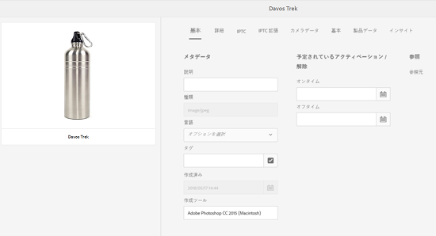

# メタデータスキーマ {#metadata-schemas}

In [!DNL Experience Manager Assets]の場合、メタデータスキーマは、プロパティページのレイアウトと、その特定のスキーマを使用するアセットに関して表示されるメタデータプロパティを定義します。 メタデータプロパティには、タイトル、説明、MIME タイプなどが含まれます。既存のスキーマを変更したり、カスタムのメタデータスキーマを追加するには、メタデータスキーマフォームエディターを使用します。

アセットのプロパティページを表示して編集するには、次の手順に従います。

1. クリックまたはタップ **[!UICONTROL プロパティを表示]** カード表示のアセットタイル上のクイックアクションから。

   

   または、アセットを選択し、 **[!UICONTROL プロパティ]** アイコンをクリックします。

   

1. 使用可能なタブで、編集可能な様々なメタデータプロパティを編集できます。ただし、プロパティページの「[!UICONTROL 基本]」タブではアセット[!UICONTROL タイプ]を変更できません。

   

   アセットの MIME タイプを変更するには、カスタムメタデータスキーマフォームを使用するか、既存のフォームを変更します。詳しくは、 [メタデータスキーマFormsの編集](metadata-schemas.md#editing-metadata-schema-forms) を参照してください。 特定の MIME タイプのメタデータスキーマを変更すると、現在の MIME タイプとすべてのアセットサブタイプを持つアセットのプロパティページレイアウトが変更されます。 例えば、 `jpeg` のスキーマ `default/image` によって変更されるのは、MIME タイプがのアセットのメタデータのレイアウト（アセットのプロパティ）のみです `IMAGE/JPEG`. ただし、デフォルトスキーマを編集する場合は、すべてのタイプのアセットのメタデータのレイアウトを変更します。

## メタデータスキーマフォーム {#default-metadata-schema-forms}

フォームやテンプレートの一覧を表示するには、 [!DNL Experience Manager] インターフェイスに移動 **[!UICONTROL ツール]** > **[!UICONTROL Assets]** > **[!UICONTROL メタデータスキーマ]**.

[!DNL Experience Manager] には、次のメタデータスキーマフォームテンプレートが用意されています。

| テンプレート |  | 説明 |
|---|---|---|
| [!UICONTROL default] |  | アセットの基本メタデータスキーマフォーム |
|  | 次の子フォームは、[!UICONTROL default] フォームのプロパティを継承します。 |  |
|  | <ul><li> [!UICONTROL dm_video]</li></ul> | Dynamic Media ビデオのスキーマフォーム |
|  | <ul><li> [!UICONTROL 画像]</li></ul> | MIME タイプが「image」のアセットのスキーマフォーム（例：image/jpeg、image/png）。  [!UICONTROL 画像] フォームには、次の子フォームテンプレートがあります。 <ul><li> [!UICONTROL jpeg]：サブタイプが [!UICONTROL jpeg] であるアセットのスキーマフォーム</li> <li>[!UICONTROL tiff]:サブタイプのアセットのスキーマフォーム [!UICONTROL tiff].</li></ul> |
|  | <ul><li> [!UICONTROL application]</li></ul> | application/pdf、application/zip など、MIME タイプが「application」のアセットのスキーマフォーム。  [!UICONTROL pdf]:サブタイプ pdf のアセットのスキーマフォーム。 |
|  | <ul><li>[!UICONTROL video]</li></ul> | video/avi、video/mp4 など、MIME タイプが「video」のアセットのスキーマフォーム。 |
| [!UICONTROL collection] |  | コレクションのスキーマフォーム |
| [!UICONTROL contentfragment] |  | コンテンツフラグメント用のスキーマフォームです。 |
| [!UICONTROL Forms] |  | このスキーマフォームは [Adobe Experience Manager Forms](/help/forms/home.md) に関連するものです。 |

>[!NOTE]
>
>スキーマフォームの子フォームを表示するには、スキーマフォーム名をクリックまたはタップします。

## メタデータスキーマフォームの追加 {#adding-a-metadata-schema-form}

1. リストにカスタムテンプレートを追加するには、ツールバーの「**[!UICONTROL 作成]**」をクリックします。

   >[!NOTE]
   >
   >編集されていないテンプレートの前にはロックアイコンが表示されます。 テンプレートをカスタマイズすると、そのテンプレートの前にあるロックアイコンが表示されなくなります。

1. ダイアログで、スキーマフォームのタイトルを入力し、 **[!UICONTROL 作成]** をクリックして、フォームの作成プロセスを完了します。

   

## メタデータスキーマフォームの編集 {#editing-metadata-schema-forms}

新しく追加したメタデータスキーマフォームまたは既存のメタデータスキーマフォームを編集できます。メタデータスキーマフォームには、以下の内容が含まれます。

* タブ
* タブ内のフォーム項目。

これらのフォーム項目を CRX リポジトリーのメタデータノード内のフィールドにマップしたり、フォーム項目を設定したりできます。

メタデータスキーマフォームに新しいタブやフォーム項目を追加できます。 親から派生したタブおよびフォーム項目はロック状態です。子レベルではこれらを変更できません。

1. 内 **[!UICONTROL スキーマForms]** ページで、フォームの前のチェックボックスをオンにし、 **[!UICONTROL 編集]** をクリックします。

   

1. **[!UICONTROL メタデータスキーマエディター]**&#x200B;ページで、アセットのプロパティページをカスタマイズします。それには、「**[!UICONTROL フォームを作成]**」タブのコンポーネントタイプのリストから「**[!UICONTROL 基本]**」タブに、1 つ以上のコンポーネントをドラッグします。

   

1. コンポーネントを設定するには、コンポーネントを選択して、「**[!UICONTROL 設定]**」タブでそのプロパティを変更します。

### 「フォームを作成」タブ内のコンポーネント  {#components-within-the-build-form-tab}

「**[!UICONTROL フォームを作成]**」タブには、スキーマフォーム内で使用するフォーム項目が表示されます。「**[!UICONTROL 設定]**」タブに、「**[!UICONTROL フォームを作成]**」タブで選択した各項目の属性が表示されます。「**[!UICONTROL フォームを作成]**」タブで使用できるフォーム項目を次の表に示します。

| コンポーネント名 | 説明 |
|---|---|
| [!UICONTROL セクションヘッダー] | 共通コンポーネントのリストに対してセクションヘッダーを追加します。 |
| [!UICONTROL 1 行のテキスト] | 1 行のテキストプロパティを追加します。これは文字列として保存されます。 |
| [!UICONTROL 複数値テキスト] | 複数値テキストプロパティを追加します。これは文字列の配列として保存されます。 |
| [!UICONTROL 数値] | 数値コンポーネントを追加します。 |
| [!UICONTROL 日付] | 日付コンポーネントを追加します。 |
| [!UICONTROL ドロップダウン] | ドロップダウンリストを追加します。 |
| [!UICONTROL 標準タグ] | タグを追加します。 |
| [!UICONTROL スマートタグ] | メタデータタグを自動的に追加して、検索機能を強化します。 |
| [!UICONTROL 非表示のフィールド] | 非表示のフィールドを追加します。このフィールドは、アセットの保存時に POST パラメーターとして送信されます。 |
| [!UICONTROL アセットの参照元] | このアセットが参照しているアセットのリストを表示するには、このコンポーネントを追加します。 |
| [!UICONTROL アセットの参照] | このアセットを参照しているアセットのリストを表示するには、このコンポーネントを追加します。 |
| [!UICONTROL 製品リファレンス] | このアセットとリンクされている製品のリストを表示するには、このコンポーネントを追加します。 |
| [!UICONTROL アセット評価] | アセットを評価するオプションを表示するには、このコンポーネントを追加します。 |
| [!UICONTROL コンテキストメタデータ] | アセットのプロパティページにある他のメタデータタブの表示を制御するために追加します。 |

### メタデータコンポーネントの編集 {#editing-the-metadata-component}

フォームのメタデータコンポーネントのプロパティを編集するには、コンポーネントをクリックし、「**[!UICONTROL 設定]**」タブで次のすべてのプロパティまたはサブセットを編集します。

**フィールドラベル**：アセットのプロパティページに表示されるメタデータプロパティの名前。

**プロパティにマッピング**：このプロパティには、CRX リポジトリ内の保存先のアセットノードへの相対パスまたは名前を指定します。この値は、パスがアセットノードの配下にあることを示しているので、「`./`」で始まります。

このプロパティの有効な値は次のとおりです。

* `./jcr:content/metadata/dc:title`：アセットのメタデータノードにある値を、プロパティ `dc:title` として格納します。

* `./jcr:created`:アセットのノードにある JCR プロパティを表示します。 表示プロパティ上でこれらのプロパティを設定する場合は、これらのプロパティは保護されているので、「編集を無効にする」としてマークすることをお勧めします。それ以外の場合は、エラー [!UICONTROL アセットを変更できませんでした] 結果は、アセットのプロパティを保存したときに表示されます。

コンポーネントがメタデータスキーマフォームに適切に表示されるように、プロパティのパスにはスペースを含めないでください。

**プレースホルダー**:メタデータプロパティに関する関連するプレースホルダーテキストを指定するには、このプロパティを使用します。

**必須**:プロパティページでメタデータプロパティを必須としてマークするには、このプロパティを使用します。

**編集を無効にする**:プロパティページでメタデータプロパティを編集不可にするには、このプロパティを使用します。

**空白のフィールドを読み取り専用として表示**：プロパティページでメタデータプロパティに値がなくても表示するには、このプロパティをオンにします。デフォルトでは、メタデータプロパティに値がない場合、プロパティページには表示されません。

**リストを並べ替えて表示**：選択肢のリストを並べ替えて表示するには、このプロパティを使用します。

**選択肢**:リストの選択肢を指定するには、このプロパティを使用します

**説明**：メタデータコンポーネントの短い説明を追加するには、このプロパティを使用します。

**クラス**:プロパティが関連付けられているオブジェクトクラス。

**削除アイコン** このアイコンをクリックすると、スキーマフォームからコンポーネントが削除されます。

>[!NOTE]
>
>非表示のフィールドコンポーネントには、これらの属性は含まれていません。代わりに、属性名、値、フィールドラベル、説明などのプロパティが含まれます。 非表示フィールドコンポーネントの値は、アセットが保存されるたびにPOSTパラメーターとして送信されます。 アセットのメタデータとして保存されません。

「**[!UICONTROL 必須]**」オプションを選択した場合、必須のメタデータが設定されていないアセットを検索できます。**[!UICONTROL フィルター]**&#x200B;パネルで、「**[!UICONTROL メタデータの検証]**」述語を展開して、「**[!UICONTROL 無効]**」オプションを選択します。検索結果に、スキーマフォームで設定した必須のメタデータが設定されていないアセットが表示されます。

スキーマフォームの任意のタブにコンテキストメタデータコンポーネントを追加すると、そのコンポーネントは、その特定のスキーマが適用されるアセットのプロパティページにリストとして表示されます。 このリストには、コンテキストメタデータコンポーネントを適用したタブを除く、他のすべてのタブが含まれます。現在、この機能は、コンテキストに応じてメタデータの表示を制御する基本的な機能を提供しています。

コンテキストメタデータコンポーネントが適用されているタブに加えて、プロパティページに任意のタブを含めるには、リストからタブを選択します。 タブがプロパティページに追加されます。

### JSON ファイルでのプロパティの指定 {#specifying-properties-in-json-file}

「**[!UICONTROL 設定]**」タブのオプションでプロパティを指定する代わりに、対応するキーと値のペアを指定することで JSON ファイルでオプションを定義できます。「**[!UICONTROL JSON パス]**」フィールドに JSON ファイルのパスを指定します。

### スキーマフォームでのタブの追加または削除 {#adding-deleting-a-tab-in-the-schema-form}

スキーマエディターで、タブを追加または削除できます。デフォルトのスキーマフォームには、「**[!UICONTROL 基本]**」、「**[!UICONTROL 詳細]**」、「**[!UICONTROL IPTC]**」および「**[!UICONTROL IPTC 拡張]**」の各タブがデフォルトで含まれています。

「`+`」をクリックすると、スキーマフォームに新しいタブを追加できます。新しいタブにはデフォルトで「`Unnamed-1`」という名前が付けられます。この名前は、「**[!UICONTROL 設定]**」タブで編集できます。タブを削除するには、「`X`」をクリックします。

## メタデータスキーマフォームの削除 {#deleting-metadata-schema-forms}

[!DNL Experience Manager] では、カスタムのスキーマフォームのみを削除できます。デフォルトのスキーマのフォームやテンプレートを削除することはできません。 ただし、これらのフォームでのカスタムの変更はすべて削除できます。

フォームを削除するには、フォームを選択して&#x200B;**[!UICONTROL 削除]**&#x200B;アイコンをクリックします。

>[!NOTE]
>
>デフォルトフォームに対するカスタムの変更を削除すると、ロックアイコンがメタデータスキーマインターフェイスに再び表示され、フォームがデフォルトの状態に戻ったことが示されます。

>[!NOTE]
>
>内の標準提供のメタデータスキーマフォームを削除することはできません。 [!DNL Experience Manager] アセット。

## MIME タイプ用のスキーマフォーム {#schema-forms-for-mime-types}

[!DNL Experience Manager] Assets には、あらゆる MIME タイプに対応したデフォルトのフォームがあらかじめ用意されています。 ただし、様々な MIME タイプのアセットにカスタムのフォームを追加することができます。

### MIME タイプ用の新しいフォームの追加 {#adding-new-forms-for-mime-types}

適切なフォームタイプに新規フォームを作成します。例えば、 `image/png` サブタイプを指定し、 `image` フォーム。 スキーマフォームのタイトルはサブタイプ名です。この場合、タイトルは「`png`」です。

### 様々な MIME タイプ用の既存スキーマテンプレートの使用 {#using-an-existing-schema-template-for-various-mime-types}

別の MIME タイプに対して既存のテンプレートを使用できます。例えば、MIME タイプ `image/png` のアセットに対して `image/jpeg` フォームを使用します。

この場合は、CRX リポジトリ内の `/etc/dam/metadataeditor/mimetypemappings` に新しいノードを作成します。そのノードの名前を指定し、次のプロパティを定義します。

| 名前 | 説明 | タイプ | 値 |
|---|---|---|---|
| `exposedmimetype` | マッピングする既存フォームの名前 | `String` | `image/jpeg` |
| `mimetypes` | `exposedmimetype` 属性で定義したフォームを使用する MIME タイプのリスト | `String` | `image/png` |

[!DNL Experience Manager] Assets では、次の MIME タイプとスキーマフォームがマッピングされます。

| スキーマフォーム | MIME タイプ |
|---|---|
| image/jpeg | image/pjpeg |
| image/tiff | image/x-tiff |
| application/pdf | application/postscript |
| application/x-ImageSet | Multipart/Related; type=application/x-ImageSet |
| application/x-SpinSet | Multipart/Related; type=application/x-SpinSet |
| application/x-MixedMediaSet | Multipart/Related; type=application/x-MixedMediaSet |
| video/quicktime | video/x-quicktime |
| video/mpeg4 | video/mp4 |
| video/avi | video/avi, video/msvideo, video/x-msvideo |
| video/wmv | video/x-ms-wmv |
| video/flv | video/x-flv |

## メタデータスキーマへのアクセス権の付与 {#granting-access-to-metadata-schemas}

メタデータスキーマ機能は、管理者のみが使用できます。 ただし、管理者が管理者以外のユーザーにアクセス権を付与するには、 **[!UICONTROL 作成]**, **[!UICONTROL 変更]**、および **[!UICONTROL 削除]** の権限 `/conf` フォルダー。

## フォルダー固有のメタデータの適用 {#applying-folder-specific-metadata}

[!DNL Experience Manager] Assets では、メタデータスキーマのバリアントを定義して、特定のフォルダーに適用できます。

例えば、デフォルトのメタデータスキーマのバリアントを定義して、フォルダーに適用できます。 変更したスキーマを適用すると、フォルダー内のアセットに適用されている元のデフォルトのメタデータスキーマが上書きされます。

このスキーマが適用されるフォルダーにアップロードされたアセットのみが、バリアントメタデータスキーマで定義された変更済みメタデータに準拠します。

元のスキーマが適用されている他のフォルダー内のアセットは、元のスキーマで定義されたメタデータに引き続き従います。

アセットによるメタデータの継承は、階層の第 1 レベルのフォルダーに適用されるスキーマに基づいておこなわれます。 つまり、フォルダーにサブフォルダーが含まれていない場合、フォルダー内のアセットは、フォルダーに適用されているスキーマからメタデータを継承します。

フォルダーにサブフォルダーがある場合、サブフォルダーレベルで別のスキーマが適用されている場合、サブフォルダー内のアセットは、サブフォルダーレベルで適用されているスキーマからメタデータを継承します。 ただし、サブフォルダーレベルでスキーマや同じスキーマが適用されていない場合、サブフォルダーのアセットは親フォルダーレベルで適用されたスキーマからメタデータを継承します。

1. 次をクリック： [!DNL Experience Manager] ロゴをクリックし、 **[!UICONTROL ツール/アセット/メタデータスキーマ]**. **[!UICONTROL メタデータスキーマフォーム]**&#x200B;ページが表示されます。
1. フォーム（デフォルトのメタデータフォームなど）の前のチェックボックスを選択し、 **[!UICONTROL コピー]** アイコンをクリックし、カスタムフォームとして保存します。 そのフォームに `my_default` などの名前を付けます。カスタムフォームを作成することもできます。

   

1. **[!UICONTROL メタデータスキーマフォーム]**&#x200B;ページで、`my_default` フォームを選択し、「**[!UICONTROL 編集]**」をクリックします。

1. **[!UICONTROL メタデータスキーマエディター]**&#x200B;ページで、スキーマフォームにテキストフィールドを追加します。例えば、「**[!UICONTROL カテゴリ]**」というラベルのフィールドを追加します。

   

1. 「**[!UICONTROL 保存]**」をクリックします。変更されたフォームは&#x200B;**[!UICONTROL メタデータスキーマフォーム]**&#x200B;ページにリストされます。
1. ツールバーの「**[!UICONTROL フォルダーに適用]**」をクリックまたはタップしてカスタムメタデータをフォルダーに適用します。

   

1. 変更されたスキーマを適用するフォルダーを選択し、「**[!UICONTROL 適用]**」をクリックまたはタップします。

   

1. フォルダーに他のメタデータが適用されている場合は、既存のメタデータスキーマを上書きする旨の警告メッセージが表示されます。「**[!UICONTROL 上書き]**」をクリックします。
1. 「**[!UICONTROL OK]**」をクリックして、成功メッセージを閉じます。
1. 変更したメタデータスキーマを適用したフォルダーに移動します。

## 必須メタデータの定義 {#defining-mandatory-metadata}

必須フィールドをフォルダーレベルで定義すると、そのフォルダーにアップロードされるアセットに強制的に適用されます。前に定義した必須フィールドのメタデータが欠落しているアセットをアップロードすると、欠落しているメタデータがカード表示のアセットに視覚的に示されます。

>[!NOTE]
>
>メタデータフィールドは、別のフィールドの値に基づいて、必須フィールドとして定義できます。カード表示で、 [!DNL Experience Manager] このような必須メタデータフィールドにメタデータがないことに関する警告メッセージは表示されません。

1. 次をクリック： [!DNL Experience Manager] ロゴをクリックし、 **[!UICONTROL ツール/アセット/メタデータスキーマ]**. **[!UICONTROL メタデータスキーマフォーム]**&#x200B;ページが表示されます。
1. デフォルトのメタデータフォームをカスタムフォームとして保存します。例えば、`my_default` として保存します。

   

1. カスタムフォームを編集します。 必須フィールドを追加します。 例えば、「**カテゴリ**」フィールドを追加して、それを必須フィールドにします。

   

1. 「**[!UICONTROL 保存]**」をクリックします。変更されたフォームは&#x200B;**[!UICONTROL メタデータスキーマフォーム]**&#x200B;ページにリストされます。カスタムメタデータをフォルダーに適用するには、フォームを選択し、 **[!UICONTROL フォルダーに適用]** をクリックします。

1. フォルダーに移動し、カスタムフォームに追加した必須フィールドにメタデータが指定されていないアセットをアップロードします。アセットのカード表示では、必須フィールドに指定されていないメタデータに関するメッセージが表示されます。

   

1. （オプション）`http://[server]:[port]/system/console/components/`にアクセスします。`com.day.cq.dam.core.impl.MissingMetadataNotificationJob` コンポーネントを設定して有効にします。このコンポーネントはデフォルトで無効になっています。アセット上にあるメタデータの妥当性を [!DNL Experience Manager] がチェックする頻度を設定します。この設定により、プロパティが追加されます `hasValidMetadata` をアセットの jcr:content にコピーします。 このプロパティを使用すると、 [!DNL Experience Manager] では、検索の結果をフィルタリングできます。

>[!NOTE]
>
>スケジュール済みチェックの後に追加されたアセットは、次回のスケジュール済みチェックが実行されるまでは `hasValidMetadata` のフラグが設定されません。アセットは中間の検索結果に表示されません。

>[!CAUTION]
>
>メタデータの検証チェックはリソースを大量に消費し、システムのパフォーマンスに影響を与える可能性があります。 検証チェックのスケジュール設定は、適切に行う必要があります。この [!DNL Experience Manager] 展開にパフォーマンスの問題があります。このジョブを無効にしてみてください。
