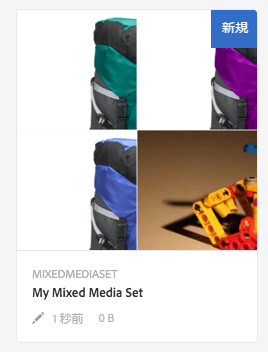
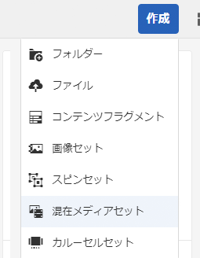
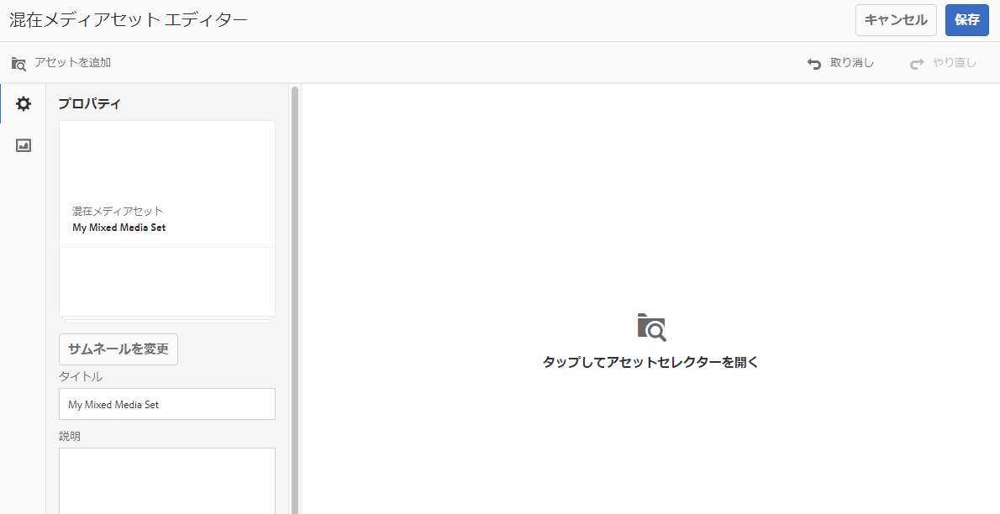
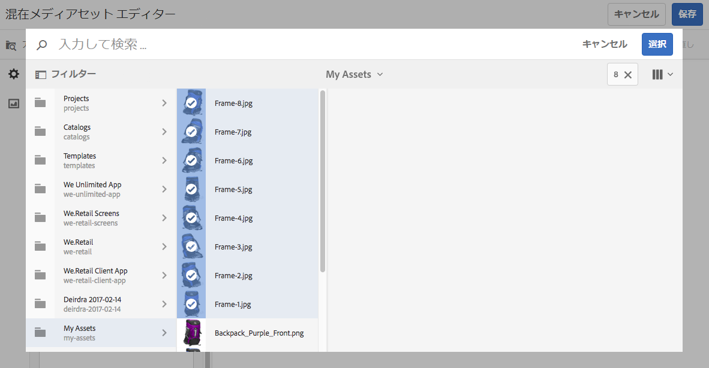
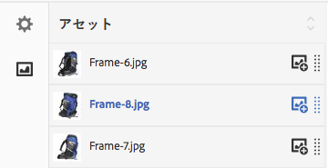

# 混在メディアセット {#mixed-media-sets}

混在メディアセットは、画像、画像セット、スピンセットおよびビデオを 1 つのプレゼンテーションで混在させて表示するものです。

混在メディアセットのバナーには、「**[!UICONTROL MixedMediaSet]**」と表示されます。また、混在メディアセットが公開されている場合、公開日が&#x200B;**[!UICONTROL 地球]**&#x200B;アイコン付きでバナーに表示され、最終変更日も&#x200B;**[!UICONTROL 鉛筆]**&#x200B;アイコン付きで表示されます。

>[!NOTE]
>
>アセットユーザーインターフェイスについて詳しくは、[タッチ UI を使用したアセットの管理](managing-assets-touch-ui.md)を参照してください。

## クイックスタート：混在メディアセット {#quick-start-mixed-media-sets}

混在メディアセットをすぐに使い始めるには、次の手順を実行します。

1. [アセットをアップロードします](#uploading-assets)。

   まずは混在メディアセット用の画像およびビデオをアップロードします。必要に応じて、[画像セット](image-sets.md)と[スピンセット](spin-sets.md)を作成します。ユーザーは混在メディアセットビューアで画像をズームできるので、画像を選択する際にはズームを考慮します。最大サイズで 2,000 ピクセル以上の画像を使用してください。

1. [混在メディアセットを作成します。](#creating-mixed-media-sets)

   混在メディアセットを作成するには、ア **[!UICONTROL セット]** ページで **[!UICONTROL 作成/混在メディアセットをタップし]**、セットに名前を付けます。 アセットを選択し、画像の表示順序を選択します。

   [セレクターの操作](working-with-selectors.md)を参照してください。

1. 必要に応じて[混在メディアビューアプリセット](managing-viewer-presets.md)を設定します。

   管理者は、混在メディアセットビューアプリセットを作成または編集できます。混在メディアセットを特定のビューアプリセットで表示するには、混在メディアセットを選択し、左側のレールのドロップダウンメニューで「**[!UICONTROL ビューア]**」を選択します。

   **[!UICONTROL ツール／アセット／ビューアプリセット]**&#x200B;を選択して、ビューアプリセットを作成または編集します。

   詳しくは、[ビューアプリセットの追加と編集](managing-viewer-presets.md)を参照してください。

1. [混在メディアセットをプレビューします。](#previewing-mixed-media-sets)

   混在メディアセットを選択すると、プレビューできます。サムネールアイコンをクリックして、選択したビューアでの混在メディアセットの表示を確認します。**[!UICONTROL ビューア]**&#x200B;メニューから様々なビューアを選択できます。このメニューは左側のレールのドロップダウンメニューにあります。

1. [混在メディアセットを公開します。](#publishing-mixed-media-sets)

   混在メディアセットを公開すると、URL と埋め込み文字列がアクティベートされます。また、[ビューアプリセットを公開](managing-viewer-presets.md#publishing-viewer-presets)する必要があります。

1. [URL を Web アプリケーションにリンクする](linking-urls-to-yourwebapplication.md)か、[ビデオビューアまたは画像ビューアを埋め込みます](embed-code.md)。

   混在メディアセットの URL コールが作成され、混在メディアセットの公開後にそれらの URL コールがアクティベートされます。アセットをプレビューする際に、これらの URL をコピーできます。または、URL を Web サイトに埋め込むこともできます。

   混在メディアセットを選択し、左側のレールのドロップダウンメニューで「**[!UICONTROL ビューア]**」を選択します。

   詳しくは、[Web ページへの混在メディアセットのリンク](linking-urls-to-yourwebapplication.md)および[ビデオビューアまたは画像ビューアの埋め込み](embed-code.md)を参照してください。

必要に応じて、[混在メディアセット](#editing-mixed-media-sets)を編集できます。また、[混在メディアセットのプロパティ](managing-assets-touch-ui.md#editing-properties)を表示および変更することができます。

>[!NOTE]
>
>If you have issues creating sets, see [Troubleshooting Dynamic Media - Scene7 mode](troubleshoot-dms7.md).

## アセットのアップロード {#uploading-assets}

まずは混在メディアセット用の画像およびビデオをアップロードします。ユーザーは混在メディアセットビューアで画像をズームできるので、画像を選択する際には必ずズームを考慮してください。最大サイズで 2,000 ピクセル以上の画像を使用してください。

また、混在メディアセットにスピンセットまたは画像セットを追加する場合は、それらのセットも作成します。

## 混在メディアセットの作成 {#creating-mixed-media-sets}

混在メディアセットには画像、画像セット、スピンセットおよびビデオを追加できます。ファイル、画像セットおよびスピンセットを公開できる状態にしてから、混在メディアセットに追加するようにしてください。

画像セットに追加したアセットは、自動的に英数字順で追加されます。追加後に、手動でアセットの順番を変更したり、並べ替えたりすることができます。

**混在メディアセットを作成するには：**:

1. Assets で、混在メディアセットを作成する場所に移動し、**作成**／**[!UICONTROL 混在メディアセット]**&#x200B;を選択します。アセットを格納しているフォルダー内からセットを作成することもできます。

   

1. In the **[!UICONTROL Mixed Media Set Editor]** page, in **[!UICONTROL Title]**, enter a name for the Mixed Media Set. この名前は、混在メディアセット全般のバナーに表示されます。オプションで、説明を入力します。

   

   >[!NOTE]
   >
   >混在メディアセットを作成するときに、混在メディアセットのサムネールを変更したり、AEM で混在メディアセット内のアセットに基づいてサムネールを自動的に選択したりすることができます。サムネールを選択するには、「**[!UICONTROL サムネールを変更]**」をクリックし、画像を選択します（他のフォルダーに移動して画像を探すこともできます）。サムネールを選択した状態で、混在メディアセットからサムネールを自動的に生成することにした場合は、「**[!UICONTROL 自動サムネールに切り替え]**」を選択します。

1. Tap the **[!UICONTROL Asset Selector]** to select assets that you want to include in your Mixed Media Set. Select them and tap **[!UICONTROL Select]**.

   With the **[!UICONTROL Asset Selector]**, you can search for assets by typing in a keyword and tapping **[!UICONTROL Return]**. フィルターを適用して、検索結果を絞り込むこともできます。パス、コレクション、ファイルタイプおよびタグでフィルタリングできます。フィルターを選択してから、ツールバーの&#x200B;**[!UICONTROL フィルター]**&#x200B;アイコンをタップします。Change the view by selecting the View icon and selecting **[!UICONTROL List]**, **[!UICONTROL Column]**, or **[!UICONTROL Card]** view.

   [セレクターの操作](working-with-selectors.md)を参照してください。

   

1. 必要に応じて、アセットをリスト内で上下にドラッグしてアセットを並べ替えます（ドラッグするには、並べ替えアイコンを選択する必要があります）。

   

   If you want to add thumbnails, click the **[!UICONTROL +]** icon next to the image and navigate to the thumbnail you want. すべてのサムネール画像の選択が完了したら、「 **[!UICONTROL 保存]**」をタップします。

   >[!NOTE]
   >
   >アセットを追加する場合は、「**[!UICONTROL アセットを追加]**」をタップします。

1. アセットを削除するには、対応するチェックボックスを選択して、「**[!UICONTROL アセットを削除]**」をタップします。
1. プリセットを適用するには、右上隅にある「**[!UICONTROL プリセット]**」をタップし、アセットに適用するプリセットを選択します。
1. 「**[!UICONTROL 保存]**」をクリックします。新しく作成した混在メディアセットが、作成先のフォルダーに表示されます。

## 混在メディアセットの編集 {#editing-mixed-media-sets}

[アセットの編集と同じように](managing-assets-touch-ui.md)、ユーザーインターフェイスで直接、混在メディアセット内のアセットに対して様々な編集タスクを実行できます。また、混在メディアセットでは次のアクションも実行できます。

* 混在メディアセットへのアセットの追加
* 混在メディアセット内のアセットの並べ替え
* 混在メディアセット内のアセットの削除
* ビューアプリセットの適用
* デフォルトサムネールの変更

**混在メディアセットを編集するには**:

1. 次のいずれかの操作をおこないます。

   * 混在メディアセットアセットの上にマウスポインターを置き、**[!UICONTROL 編集]**（鉛筆アイコン）をタップします。
   * 混在メディアセットアセットの上にマウスポインターを置き、**[!UICONTROL 選択]**（チェックマークアイコン）をタップしてからツールバーの「**[!UICONTROL 編集]**」をタップします。
   * 混在メディアセットアセットをタップし、ツールバーの「**[!UICONTROL 編集]**」（鉛筆アイコン）をタップします。

1. 混在メディアセットエディターで、次のいずれかをおこないます。

   * アセットを並べ替えるには - 左側のパネルで「**[!UICONTROL アセット]**」（写真アイコン）をタップし、アセットを新しい位置にドラッグします。
   * アセットを追加するには - ツールバーの「**[!UICONTROL アセットを追加]**」をタップします。アセットに移動します。追加するアセットごとに、（アセットの名前ではなく）アセットの画像の上にマウスポインターを置き、チェックマークアイコンをタップします。右上隅にある「**[!UICONTROL 選択]**」をタップします。
   * アセットを削除するには - 左側のパネルで「**[!UICONTROL アセット]**」（写真アイコン）をタップし、アセットを選択します。ツールバーの「**[!UICONTROL アセットを削除]**」をタップします。
   * アセットを名前の昇順または降順に並べ替えるには、左側のパネルで「**[!UICONTROL アセット]**」（写真アイコン）をタップします。「**[!UICONTROL アセット]**」見出しの右側にある上向きまたは下向きキャレットアイコンをタップします。

   >[!NOTE]
   >
   >* To delete an entire Mixed Media Set, from any viewing mode (such as **[!UICONTROL Card]** view or **[!UICONTROL Column]** view) navigate to the Mixed Media Set. アセットの上にマウスポインターを置き、チェックマークアイコンをタップして選択します。Press **[!UICONTROL Backspace]** on the keyboard, or tap **[!UICONTROL More]** (three dots) on the toolbar, then tap **[!UICONTROL Delete]**.
   >* You can edit the assets in a Mixed Media Set by navigating to the set, tapping **[!UICONTROL Set Members]** in the left rail, and then tapping the **[!UICONTROL Pencil]** icon on an individual asset to open the editing window.

1. Tap **[!UICONTROL Save** when you are done editing.

   >[!NOTE]
   >
   >* 混在メディアセット内のアセットを編集するには - 混在メディアセットに移動します。Tap (do not select) the set to open it in the AEM **[!UICONTROL Set Preview]** page. In the left rail, tap the down caret to open the drop-down list, then tap **[!UICONTROL Set Members]**. In the **[!UICONTROL Set Members]** page, hover on an asset, then tap **[!UICONTROL Edit]** (pencil icon) to open the editing page.
   >* To delete an entire Mixed Media Set - From any viewing mode (such as **[!UICONTROL Card]** view or **[!UICONTROL Column]** view), navigate to the Mixed Media Set. セットの上にマウスポインターを置き、「**[!UICONTROL 選択]**」（チェックマークアイコン）をタップします。キーボードの **[!UICONTROL Backspace]** キーを押すか、「**[!UICONTROL 詳細]**」（連続する 3 つのドット）をタップしてから「**[!UICONTROL 削除]**」をタップします。

## 混在メディアセットのプレビュー {#previewing-mixed-media-sets}

混在メディアセットのプレビュー方法について詳しくは、[アセットのプレビュー](previewing-assets.md)を参照してください。

## 混在メディアセットの公開 {#publishing-mixed-media-sets}

混在メディアセットの公開方法について詳しくは、[アセットの公開](publishing-dynamicmedia-assets.md)を参照してください。

>[!NOTE]
>
>混在メディアデットを初めて公開したときに配信サービスで完全に終了しない場合は、混在メディアセットを2回目に公開する必要がある場合があります。

