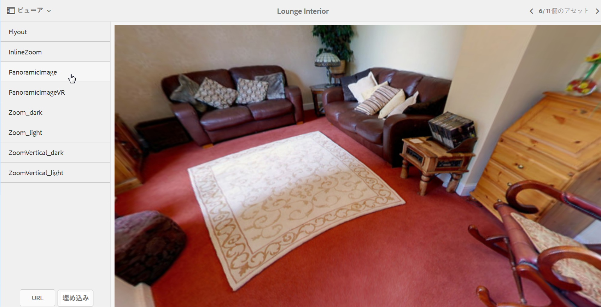

# パノラマ画像 {#panoramic-images}

ここでは、パノラマ画像ビューアを使用して球パノラマ画像をレンダリングし、室内、物件、場所、風景などをあらゆる角度から見ることができる臨場感あふれる体験を提供する方法について説明します。

[ビューアプリセットの管理](managing-viewer-presets.md)も参照してください。

## パノラマ画像ビューアで使用するアセットのアップロード {#uploading-assets-for-use-with-the-panoramic-image-viewer}

アップロードするアセットが、パノラマ画像ビューアで使用する球パノラマ画像として適格となるには、アセットが以下の一方または両方の条件を満たしている必要があります。

* 縦横比が 2 である必要があります。

   次の&#x200B;**[!UICONTROL CRXDE Lite]**&#x200B;のデフォルトの縦横比設定である2を上書きできます。

   `/conf/global/settings/cloudconfigs/dmscene7/jcr:content`

* キーワード `equirectangular`、または `spherical` と `panorama`、または `spherical` と `panoramic` でタグ付けされている必要があります。[タグの使用](/help/sites-authoring/tags.md)を参照してください。

縦横比とキーワードの両方の条件が、アセットの詳細ページと「**[!UICONTROL パノラマメディア]**」 コンポーネントのパノラマアセットに適用されます。

パノラマ画像ビューアで使用するアセットをアップロードするには、[アセットのアップロード](managing-assets-touch-ui.md#uploading-assets)を参照してください。

## Dynamic Mediaクラシックの設定{#configuring-dynamic-media-classic-scene}

パノラマ画像ビューアをAEM内で正しく動作させるには、パノラマ画像ビューアプリセットをDynamic MediaクラシックおよびDynamic Mediaクラシック固有のメタデータと同期して、JCRでビューアプリセットを更新する必要があります。 これを行うには、次の方法でDynamic Mediaクラシックを設定します。

1. [各会社アカウントのDynamic Mediaクラシックデスクトップ](https://experienceleague.adobe.com/docs/dynamic-media-classic/using/intro/dynamic-media-classic-desktop-app.html?lang=en#system-requirements-dmc-app) アプリケーションにサインインします。

1. ページの右上隅付近で、**[!UICONTROL 設定／アプリケーション設定／公開設定／Image Server]** をクリックします。
1. **[!UICONTROL Image Server公開]**&#x200B;ページの上部近くにある&#x200B;**[!UICONTROL 公開コンテキスト]**&#x200B;ドロップダウンメニューで、「**[!UICONTROL 画像サービング]**」を選択します。

1. 同じ&#x200B;**[!UICONTROL Image Server公開]**&#x200B;ページで、「**[!UICONTROL 属性を要求]**」という見出しを探します。
1. 「**[!UICONTROL Request Attributes]**」という見出しの下で、**[!UICONTROL Reply Image Size Limit]**&#x200B;を探します。 次に、関連する&#x200B;**[!UICONTROL 幅]**&#x200B;および&#x200B;**[!UICONTROL 高さ]**&#x200B;フィールドで、パノラマ画像に使用できる最大画像サイズを大きくします。

   Dynamic Mediaクラシックの制限は25,000,000ピクセルです。 縦横比が2:1の画像で許可される最大サイズは7000 x 3500です。 ただし、通常のデスクトップ画面の場合、4096 x 2048 ピクセルで十分です。

   >[!NOTE]
   >
   >許容される最大画像サイズ以内の画像のみがサポートされます。サイズ制限を超える画像を要求すると、403 応答が生成されます。

1. 「**[要求属性]**」の見出しで、次の操作を行います。

   * **[!UICONTROL リクエストの不明化モード]**&#x200B;を&#x200B;**[!UICONTROL 無効]**&#x200B;に設定します。
   * **[!UICONTROL Request Locking Mode]**&#x200B;を&#x200B;**[!UICONTROL Disabled]**&#x200B;に設定します。

   これらの設定は、AEMで&#x200B;**[!UICONTROL パノラマメディア]**&#x200B;コンポーネントを使用する場合に必要です。

1. **[!UICONTROL Image Server公開]**&#x200B;ページの下部で、左側の「**[!UICONTROL 保存]**」をタップします。

1. 右下隅の「**[!UICONTROL 閉じる]**」をタップします。

### パノラマメディア コンポーネントのトラブルシューティング {#troubleshooting-the-panoramic-media-wcm-component}

WCMの&#x200B;**[!UICONTROL パノラマメディア]**&#x200B;コンポーネントに画像をドロップし、コンポーネントプレースホルダーが折りたたまれた場合は、次のトラブルシューティングを行うことができます。

* 403 Forbidden エラーが発生する場合は、要求された画像のサイズが大きすぎることが原因となっている可能性があります。[Dynamic Mediaクラシックの設定](#configuring-dynamic-media-classic-scene)の「*返信画像のサイズ制限*」の設定を確認します。

* アセットの&#x200B;*無効なロック*&#x200B;またはページに表示される&#x200B;*解析エラー*&#x200B;の場合は、**[!UICONTROL 不明化モードを要求]**&#x200B;と&#x200B;**[!UICONTROL 要求ロックモード]**&#x200B;をオンにして無効にします。
* 汚染されたキャンバスエラーの場合は、画像アセットに対する以前の要求に対して&#x200B;**[!UICONTROL ルールセット定義ファイルパスを設定し、CTN]**&#x200B;を無効にします。
* サポートされている制限を超えるサイズの画像を要求した後に画質が大幅に低下した場合は、**[!UICONTROL JPEG エンコード属性／画質]**&#x200B;の設定が空でないことを確認します。**[!UICONTROL クォリティ]**&#x200B;フィールドの一般的な設定は`95`です。 この設定は、**[!UICONTROL Image Server公開]**&#x200B;ページにあります。 このページにアクセスするには、[Dynamic Mediaクラシックの設定](#configuring-dynamic-media-classic-scene)を参照してください。

## パノラマ画像のプレビュー {#previewing-panoramic-images}

詳しくは、[アセットのプレビュー](previewing-assets.md)を参照してください。

## パノラマ画像の公開  {#publishing-panoramic-images}

[アセットの公開](publishing-dynamicmedia-assets.md)を参照してください。
