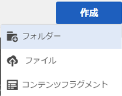
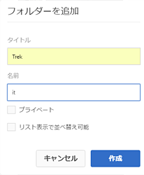
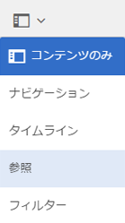
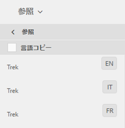

# 翻訳用アセットの準備 {#preparing-assets-for-translation}

多言語アセットとは、複数の言語のバイナリ、メタデータ、タグを含むアセットです。通常、アセットのバイナリ、メタデータ、タグに使用される言語は 1 つですが、多言語プロジェクト用に他の言語へと翻訳されます。

Adobe Experience Manager Assets では、多言語アセットはフォルダーに含まれ、各フォルダーに異なる言語のアセットが格納されます。

各言語のフォルダーは言語コピーと呼ばれます。言語コピーのルートフォルダー（言語ルート）が、言語コピー内のコンテンツの言語を識別します。例： */content/dam/it* は、イタリア語の言語コピー用のイタリア語言語ルートです。 ソースアセットの翻訳の実行時に適切な言語がターゲットになるように、言語コピーは、[正しく設定された言語ルート](preparing-assets-for-translation.md#creating-a-language-root)を使用する必要があります。

最初にアセットを追加した言語コピーが言語プライマリです。言語プライマリは、他の言語に翻訳されるソースです。

サンプルフォルダー階層にはいくつかの言語ルートが含まれています。

```java
/content
    /- dam
             |- en
             |- fr
             |- de
             |- es
             |- it
             |- ja
             |- zh
```

翻訳するアセットを準備するには、次の手順を実行します。

1. 言語プライマリの言語ルートを作成します。例えば、サンプルフォルダー階層の英語言語コピーの言語ルートは `/content/dam/en` です。[言語ルートの作成](preparing-assets-for-translation.md#creating-a-language-root)に記載の情報に従って言語ルートが正しく設定されていることを確認してください。

1. 言語プライマリにアセットを追加します。
1. 言語コピーが必要な各ターゲット言語の言語ルートを作成します。

## 言語ルートの作成 {#creating-a-language-root}

言語ルートを作成するには、フォルダーを作成し、「名前」プロパティの値として ISO 言語コードを使用します。言語ルートを作成したら、言語ルート内の任意のレベルに言語コピーを作成できます。

例えば、サンプル階層のイタリア語言語コピーのルートページの「名前」プロパティは `it` になります。「名前」プロパティは、リポジトリー内の asset ノードの名前として使用されます。そのため、このプロパティによってアセットのパスが指定されます(`https://[AEM_server]:[port]/assets.html/content/dam/it/*`)

1. アセットコンソールで「**[!UICONTROL 作成]**」をクリックまたはタップし、メニューから「**[!UICONTROL フォルダー]**」を選択します。

   

1. 「名前」フィールドに、`<language-code>` の形式で国コードを入力します。

   

1. 「**[!UICONTROL 作成]**」をクリックまたはタップします。アセットコンソール内に言語ルートが作成されます。

## 言語ルートの表示 {#viewing-language-roots}

タッチ操作向け UI には参照パネルが用意されており、このパネルには内で作成された言語ルートのリストが表示されます [!DNL Experience Manager] アセット。

1. アセットコンソールで、言語コピーを作成する言語プライマリを選択します。
1. グローバルナビゲーションアイコンをクリックまたはタップして、「**[!UICONTROL 参照]**」を選択して参照パネルを開きます。

   

1. 参照パネルで、「**[!UICONTROL 言語コピー]**」をクリックまたはタップします。アセットの言語コピーが言語コピーパネルに表示されます。

   
