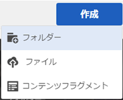
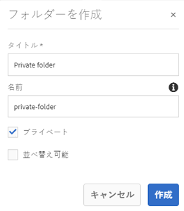
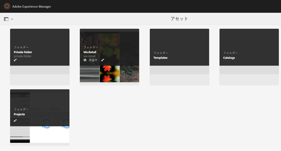
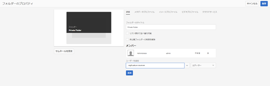
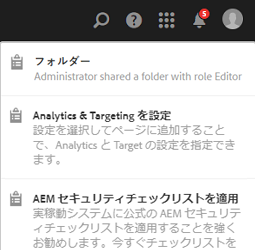

# プライベートフォルダーの共有 {#private-folder-sharing}

Adobe Experience Manager Assetsユーザーインターフェイスで、自分だけが使用できるプライベートフォルダーを作成できます。 このプライベートフォルダーを他のユーザーと共有して、他のユーザーに様々な特権を割り当てることもできます。ユーザーはフォルダーに対して、割り当てられた特権のレベルに応じた様々なタスク（フォルダー内のアセットの表示、アセットの編集など）を実行できます。

1. アセットコンソールのツールバーの「**[!UICONTROL 作成]**」をタップまたはクリックし、メニューの「**[!UICONTROL フォルダー]**」を選択します。

   

1. **[!UICONTROL フォルダーを追加]**&#x200B;ダイアログで、フォルダーのタイトルと名前（オプション）を入力して、「**[!UICONTROL プライベート]**」を選択します。

   

1. 「**[!UICONTROL 作成]**」をタップまたはクリックします。UI 内にプライベートフォルダーが作成されます。

   

1. フォルダーを他のユーザーと共有し、特権を割り当てるには、フォルダーを選択し、ツールバーの「**[!UICONTROL プロパティ]**」アイコンをクリックまたはタップします。

   

   >[!NOTE]
   >
   >フォルダーを共有するまで、他のユーザーにはフォルダーが表示されません。

1. フォルダーのプロパティページで、「**[!UICONTROL ユーザーを追加]**」リストからユーザーを選択し、プライベートフォルダーでの役割をそのユーザーに割り当てて、「**[!UICONTROL 追加]**」をクリックします。

   

   >[!NOTE]
   >
   >フォルダーを共有するユーザーに、各種役割（編集者、所有者、閲覧者など）を割り当てることができます。ユーザーに所有者の役割を割り当てると、ユーザーにフォルダーにエディター特権が付与されます。さらに、フォルダーを他のユーザーと共有できるようになります。編集者の役割を割り当てると、ユーザーがプライベートフォルダーのアセットを編集できるようになります。閲覧者の役割を割り当てると、ユーザーがプライベートフォルダーのアセットを表示できるようになります。

1. 「**[!UICONTROL 保存]**」をクリックします。割り当てた役割に応じて、ユーザーが[!DNL Experience Manager] Assetsにログインする際に、プライベートフォルダーに対する一連の権限が割り当てられます。
1. 「**[!UICONTROL OK]**」をクリックして、確認メッセージを閉じます。
1. フォルダーを共有するユーザーに対して、共有に関する通知が送信されます。ユーザーの資格情報を使用して[!DNL Experience Manager] Assetsにログインし、通知を表示します。

   

1. 通知アイコンをタップまたはクリックすると、通知のリストが開きます。

   

1. 管理者によって共有されたプライベートフォルダーのエントリをクリックまたはタップして、フォルダーを開きます。

>[!NOTE]
>
>プライベートフォルダーを作成するには、プライベートフォルダーを作成する親フォルダーに対する ACL の読み取りおよび編集権限が必要です。管理者でない場合、これらの権限は */content/dam* でデフォルトでは有効になっていません。この場合、プライベートフォルダーを作成またはフォルダー設定を表示する前に、ユーザー ID またはグループ用にそれらの権限を取得します。
