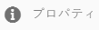

# プライベートフォルダーの共有 {#private-folder-sharing}

>[!CAUTION]
>
>AEM 6.4 の拡張サポートは終了し、このドキュメントは更新されなくなりました。 詳細は、 [技術サポート期間](https://helpx.adobe.com/jp/support/programs/eol-matrix.html). サポートされているバージョンを見つける [ここ](https://experienceleague.adobe.com/docs/?lang=ja).

Adobe Experience Manager Assets ユーザーインターフェイスで、自分だけが使用できるプライベートフォルダーを作成できます。 このプライベートフォルダーを他のユーザーと共有して、他のユーザーに様々な特権を割り当てることもできます。ユーザーはフォルダーに対して、割り当てられた特権のレベルに応じた様々なタスク（フォルダー内のアセットの表示、アセットの編集など）を実行できます。

1. アセットコンソールのツールバーの「**[!UICONTROL 作成]**」をタップまたはクリックし、メニューの「**[!UICONTROL フォルダー]**」を選択します。

   

1. 内 **[!UICONTROL フォルダーを追加]** ダイアログで、フォルダのタイトルと名前（任意）を入力し、「 」を選択します。 **[!UICONTROL プライベート]**.

   

1. 「**[!UICONTROL 作成]**」をタップまたはクリックします。UI でプライベートフォルダーが作成されます。

   

1. フォルダーを他のユーザーと共有し、特権を割り当てるには、フォルダーを選択し、ツールバーの「**[!UICONTROL プロパティ]**」アイコンをクリックまたはタップします。

   

   >[!NOTE]
   >
   >フォルダーを共有するまで、他のユーザーにはフォルダーが表示されません。

1. フォルダーのプロパティページで、 **[!UICONTROL ユーザーを追加]** リストを開き、プライベートフォルダーのユーザーに役割を割り当てて、 **[!UICONTROL 追加]**.

   

   >[!NOTE]
   >
   >フォルダーを共有するユーザーには、エディター、所有者、閲覧者などの様々な役割を割り当てることができます。 ユーザーに所有者の役割を割り当てると、ユーザーにフォルダーにエディター特権が付与されます。さらに、フォルダーを他のユーザーと共有できるようになります。編集者の役割を割り当てた場合、ユーザーはプライベートフォルダー内のアセットを編集できます。 閲覧者の役割を割り当てた場合、ユーザーはプライベートフォルダー内のアセットのみを表示できます。

1. 「**[!UICONTROL 保存]**」をクリックします。割り当てた役割に応じて、ユーザーがにログインしたときに、プライベートフォルダーに対する一連の権限が割り当てられます。 [!DNL Experience Manager] アセット。
1. 「**[!UICONTROL OK]**」をクリックして、確認メッセージを閉じます。
1. フォルダーを共有するユーザーに、共有通知が送信されます。 にログインします。 [!DNL Experience Manager] 通知を表示するユーザーの資格情報を持つアセット。

   

1. 通知アイコンをタップまたはクリックして、通知のリストを開きます。

   

1. 管理者が共有したプライベートフォルダーのエントリをクリックまたはタップして、フォルダーを開きます。

>[!NOTE]
>
>プライベートフォルダーを作成するには、プライベートフォルダーを作成する親フォルダーに対する読み取りおよび編集の ACL 権限が必要です。 管理者でない場合、これらの権限はデフォルトでは有効になっていません。 */content/dam*. この場合、プライベートフォルダーの作成またはフォルダー設定の表示を試みる前に、ユーザー ID/グループに対するこれらの権限を取得してください。
