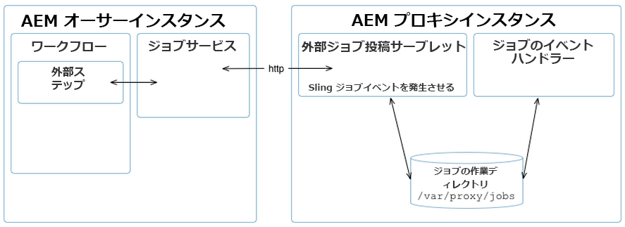

# Assets プロキシ開発 {#assets-proxy-development}

>[!CAUTION]
>
>AEM 6.4 の拡張サポートは終了し、このドキュメントは更新されなくなりました。 詳細は、 [技術サポート期間](https://helpx.adobe.com/jp/support/programs/eol-matrix.html). サポートされているバージョンを見つける [ここ](https://experienceleague.adobe.com/docs/?lang=ja).

Adobe Experience Manager Assets では、プロキシを使用して、特定のタスクの処理を配布します。

プロキシは、特定の（場合によっては別の）ものです [!DNL Experience Manager] ジョブの処理と結果の作成を担当するプロセッサーとしてプロキシワーカーを使用するインスタンス。 プロキシワーカーは、幅広いタスクに使用できます。の場合、 [!DNL Experience Manager] アセットプロキシ — 内でレンダリングするアセットの読み込みに使用できます。 [!DNL Experience Manager] アセット。 例えば、 [IDS プロキシワーカー](indesign.md) はInDesign Serverを使用して、で使用するファイルを処理します [!DNL Experience Manager] アセット。

プロキシが個別の [!DNL Experience Manager] インスタンスである場合は、[!DNL Experience Manager] オーサリングインスタンスの負荷の軽減に役立ちます。デフォルトでは、 [!DNL Experience Manager] Assets は、同じ JVM（プロキシ経由で外部化）でアセット処理タスクを実行し、 [!DNL Experience Manager] オーサリングインスタンス。

## プロキシ（HTTP アクセス） {#proxy-http-access}

プロキシは、次の場所で処理ジョブを受け入れるように設定されている場合、HTTP サーブレットを通じて使用できます。 `/libs/dam/cloud/proxy`. このサーブレットは、投稿されたパラメーターから Sling ジョブを作成します。 これがプロキシジョブキューに追加され、適切なプロキシワーカーに接続されます。

### サポートされる操作 {#supported-operations}

* `job`

   **要件**：パラメーター `jobevent` をシリアル化されたバリューマップとして設定する必要があります。ジョブプロセッサー用の `Event` の作成に使用します。

   **結果**：新しいジョブが追加されます。成功した場合、一意のジョブ ID が返されます。

```shell
curl -u admin:admin -F":operation=job" -F"someproperty=xxxxxxxxxxxx"
    -F"jobevent=serialized value map" http://localhost:4502/libs/dam/cloud/proxy
```

* `result`

   **要件**：パラメーター `jobid` を設定する必要があります。

   **結果**：ジョブプロセッサーによって作成されたノードの JSON 表現が返されます。

```shell
curl -u admin:admin -F":operation=result" -F"jobid=xxxxxxxxxxxx"
    http://localhost:4502   /libs/dam/cloud/proxy
```

* `resource`

   **要件**：パラメーター jobid を設定する必要があります。

   **結果**：指定されたジョブに関連付けられているリソースが返されます。

```shell
curl -u admin:admin -F":operation=resource" -F"jobid=xxxxxxxxxxxx"
    -F"resourcePath=something.pdf" http://localhost:4502/libs/dam/cloud/proxy
```

* `remove`

   **要件**：パラメーター jobid を設定する必要があります。

   **結果**：見つかった場合にジョブが削除されます。

```shell
curl -u admin:admin -F":operation=remove" -F"jobid=xxxxxxxxxxxx"
    http://localhost:4502/libs/dam/cloud/proxy
```

### プロキシワーカー {#proxy-worker}

プロキシワーカーは、ジョブの処理と結果の作成を担当するプロセッサです。 ワーカーはプロキシインスタンスにあり、プロキシワーカーとして認識されるには、[sling JobProcessor](https://sling.apache.org/site/eventing-and-jobs.html) を実装する必要があります。

>[!NOTE]
>
>作業者は、実装する必要があります [sling JobProcessor](https://sling.apache.org/site/eventing-and-jobs.html) 代理人として認識される。

### クライアント API {#client-api}

[`JobService`](https://helpx.adobe.com/experience-manager/6-4/sites/developing/using/reference-materials/javadoc/index.html) は、ジョブを作成および削除し、ジョブの結果を取得するためのメソッドを提供する OSGi サービスとして使用できます。このサービスのデフォルトの実装（`JobServiceImpl`）は、HTTP クライアントを使用して、リモートプロキシサーブレットと通信します。

API の使用例を以下に示します。

```java
@Reference
 JobService proxyJobService;

 // to create a new job
 final Hashtable props = new Hashtable();
 props.put("someproperty", "some value");
 props.put(JobUtil.PROPERTY_JOB_TOPIC, "myworker/job"); // this is an identifier of the worker
 final String jobId = proxyJobService.addJob(props, new Asset[]{asset});

 // to check status (returns JobService.STATUS_FINISHED or JobService.STATUS_INPROGRESS)
 int status = proxyJobService.getStatus(jobId)

 // to get the result
 final String jsonString = proxyJobService.getResult(jobId);

 // to remove job and cleanup
 proxyJobService.removeJob(jobId);
```

### クラウドサービスの設定 {#cloud-service-configurations}

>[!NOTE]
>
>プロキシ API のリファレンスドキュメントは、以下で参照できます。 [`com.day.cq.dam.api.proxy`](https://helpx.adobe.com/experience-manager/6-4/sites/developing/using/reference-materials/javadoc/com/day/cq/dam/commons/proxy/package-summary.html).

プロキシとプロキシワーカーの両方の設定は、クラウドサービスの設定を通じて使用できます。クラウドサービスの設定は、 [!DNL Experience Manager] Assets **ツール** コンソールまたは `/etc/cloudservices/proxy`. 各プロキシワーカーは、 ワーカーに固有の設定の詳細 （例： `/etc/cloudservices/proxy/workername`）で、`/etc/cloudservices/proxy` にノードを追加するように想定されています。

>[!NOTE]
>
>詳しくは、 [Indesign Server プロキシワーカーの設定](indesign.md#configuring-the-proxy-worker-for-indesign-server) および [Cloud Services設定](../sites-developing/extending-cloud-config.md) を参照してください。

API の使用例を以下に示します。

```java
@Reference(policy = ReferencePolicy.STATIC)
 ProxyConfig proxyConfig;
 
 // to get proxy config
 Configuration cloudConfig = proxyConfig.getConfiguration();
 final String value = cloudConfig.get("someProperty", "defaultValue");

 // to get worker config
 Configuration cloudConfig = proxyConfig.getConfiguration("workername");
 final String value = cloudConfig.get("someProperty", "defaultValue");
```

### カスタマイズしたプロキシワーカーの開発 {#developing-a-customized-proxy-worker}

この [IDS プロキシワーカー](indesign.md) は、 [!DNL Experience Manager] InDesign アセットの処理をアウトソースするために既に標準で提供されている Assets プロキシワーカー。

独自のを開発および設定することもできます [!DNL Experience Manager] Assets プロキシワーカー：お客様の派遣およびアウトソーシングを行う専門的なワーカーを作成します。 [!DNL Experience Manager] アセット処理タスク。

独自のカスタムプロキシワーカーを設定するには、次の操作が必要です。

* （Sling イベントを使用して）次のように設定および実装します。

   * カスタムジョブトピック
   * カスタムジョブイベントハンドラー

* その後、JobService API を使用して次の操作を行います。

   * プロキシへのカスタムジョブのディスパッチ
   * ジョブを管理

* ワークフローからプロキシを使用する場合は、WorkflowExternalProcess API と JobService API を使用してカスタム外部ステップを実装する必要があります。

次の図と手順で、作業を進める方法を説明します。



>[!NOTE]
>
>以下の手順では、Indesign の同等のものを参照例として示します。

1. [Sling ジョブ](https://sling.apache.org/site/eventing-and-jobs.html)が使用されるので、ユーザーの使用例向けにジョブトピックを定義する必要があります。

   例として、IDS プロキシワーカーの `IDSJob.IDS_EXTENDSCRIPT_JOB` を参照してください。

1. 外部ステップは、イベントのトリガーを設定し、完了するまで待ちます。これは、id に対するポーリングでおこなわれます。 新しい機能を実装するには、独自の手順を開発する必要があります。

   `WorkflowExternalProcess` を実装してから、JobService API およびジョブトピックを使用してジョブイベントを準備し、JobService（OSGi サービス）にディスパッチします。

   例として、IDS プロキシワーカーの `INDDMediaExtractProcess`.java を参照してください。

1. トピックにジョブハンドラーを実装します。 このハンドラーは、特定のアクションを実行し、ワーカー実装と見なされるように開発が必要です。

   例として、IDS プロキシワーカーの `IDSJobProcessor.java` を参照してください。

1. dam-commons の `ProxyUtil.java` を使用します。これにより、DAM プロキシを使用してジョブをワーカーにディスパッチできます。

>[!NOTE]
>
>What [!DNL Experience Manager] Assets プロキシフレームワークには、プールメカニズムが標準で用意されていません。
>
>このInDesign統合により、indesign サーバーのプール (IDSPool) にアクセスできます。 このプールは InDesign の統合に固有で、 [!DNL Experience Manager] Assets プロキシフレームワーク。

>[!NOTE]
>
>結果の同期：
>
>同じプロキシを使用する n 個のインスタンスでは、処理結果はプロキシと共に保持されます。 これはクライアントのジョブです ([!DNL Experience Manager] オーサー ) を使用して、ジョブの作成時にクライアントに提供されるのと同じ一意のジョブ ID を使用して、結果をリクエストします。 プロキシでは、単にジョブを実行し、リクエストに備えて結果を準備しておくだけです。
