# 関連アセット {#related-assets}

>[!CAUTION]
>
>AEM 6.4 の拡張サポートは終了し、このドキュメントは更新されなくなりました。 詳細は、 [技術サポート期間](https://helpx.adobe.com/jp/support/programs/eol-matrix.html). サポートされているバージョンを見つける [ここ](https://experienceleague.adobe.com/docs/?lang=ja).

Adobe Experience Manager Assets では、関連アセット機能を使用して、組織のニーズに基づいて手動でアセットを関連付けることができます。 例えば、同様のトピック上のアセットや画像/ビデオにライセンスファイルを関連付けることができます。 特定の共通属性を共有するアセットを関連付けることができます。 また、この機能を使用して、アセット間にソースと派生の関係を作成することもできます。 例えば、INDD ファイルから生成されたPDFファイルがある場合、そのPDFファイルをそのソース INDD ファイルに関連付けることができます。

これにより、ベンダーや代理店と低解像度のファイル (PDF/JPGなど ) を共有し、要求に応じてのみ高解像度のファイル（INDD など）を利用できるように柔軟に設定できます。

## アセットの関連付け {#relating-assets}

1. Assets のインターフェイスから、関連付けをおこなうアセットのプロパティページを開きます。

   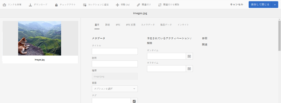

   または、リスト表示からアセットを選択します。

   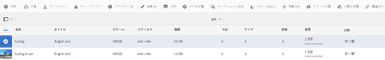

   コレクションからアセットを選択することもできます。

   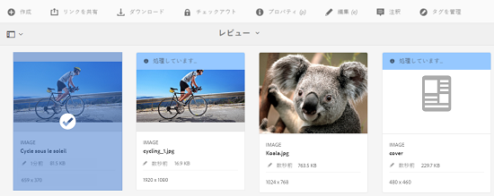

1. 別のアセットを選択したアセットに関連付けるには、 **[!UICONTROL 関連付け]** アイコンをクリックします。

   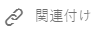

1. 次のいずれかの操作をおこないます。

   * アセットのソースファイルを関連付けるには、「 **[!UICONTROL ソース]** を選択します。
   * 派生ファイルを関連付けるには、リストから「**[!UICONTROL 派生]**」を選択します。
   * アセット間に双方向の関係を作成するには、 **[!UICONTROL その他]** を選択します。

   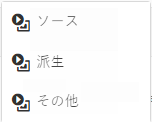

1. 次の **[!UICONTROL アセットを選択]** 画面で、関連付けるアセットの場所に移動して選択します。

   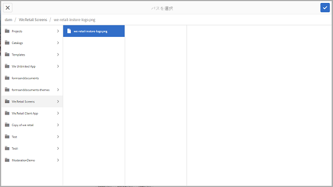

1. 次をクリックまたはタップします。 **[!UICONTROL 確認]** アイコン
1. 「**[!UICONTROL OK]**」をクリックまたはタップして、ダイアログを閉じます。手順 3 で選択した関係に応じて、関連付けられたアセットが「**[!UICONTROL 関連]**」セクションの適切なカテゴリに表示されます。例えば、関連付けたアセットが現在のアセットのソースファイルの場合は、そのアセットがの下に表示されます。 **[!UICONTROL ソース]**.

   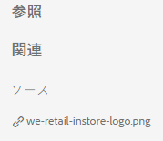

1. アセットの関連付けを解除するには、 **[!UICONTROL 関連付けを解除]** アイコンをクリックします。

   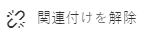

1. **[!UICONTROL 関係を削除]**&#x200B;ダイアログで、関連付けを解除するアセットを選択して、「**[!UICONTROL 関連付けを解除]**」をクリックまたはタップします。

   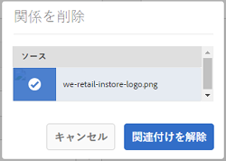

1. クリック/タップ **[!UICONTROL OK]** をクリックしてダイアログを閉じます。 関係を削除したアセットは、「**[!UICONTROL 関連]**」セクションの関連付けられたアセットのリストから削除されます。

## 関連アセットの翻訳 {#translating-related-assets}

関連アセット機能を使用してアセット間にソース/派生関係を作成すると、翻訳ワークフローでも役立ちます。 派生アセットに対して翻訳ワークフローを実行する場合、 [!DNL Experience Manager] Assets は、ソースファイルが参照するアセットを自動的に取得し、翻訳用に組み込みます。 これにより、ソースアセットが参照するアセットが、ソースおよび派生アセットと共に翻訳されます。 例えば、英語の言語コピーに、次に示すように派生アセットとそのソースファイルが含まれるシナリオを考えてみましょう。

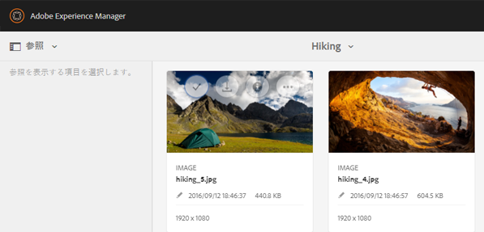

ソースファイルが別のアセットに関連付けられている場合、 [!DNL Experience Manager] Assets は参照元のアセットを取得し、翻訳用に組み込みます。

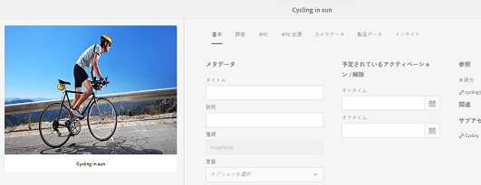

1. 次の手順に従って、ソースフォルダー内のアセットをターゲット言語に翻訳します。 [新しい翻訳プロジェクトを作成](translation-projects.md#create-a-new-translation-project). 例えば、この場合、アセットをフランス語に翻訳します。
1. プロジェクトページから、翻訳フォルダーを開きます。

   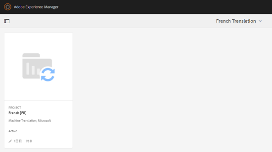

1. プロジェクトタイルをクリックまたはタップして、詳細ページを開きます。

   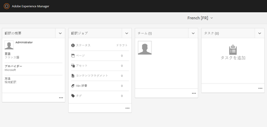

1. 翻訳ジョブカードの下の省略記号をクリックまたはタップして、翻訳ステータスを表示します。

   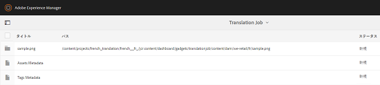

1. アセットを選択し、「 」をクリックまたはタップします。 **[!UICONTROL アセットで表示]** ツールバーからアセットの翻訳ステータスを表示します。

   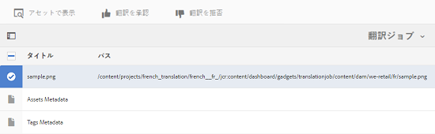

1. ソースに関連するアセットが翻訳されたかどうかを確認するには、ソースアセットをクリックまたはタップします。

   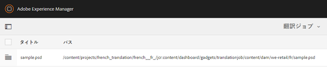

1. ソースに関連付けられているアセットを選択し、「**[!UICONTROL アセットで表示]**」をクリックまたはタップします。翻訳された関連アセットが表示されます。

   
