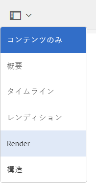

# 3D アセットのレンダリング {#rendering-d-assets}

AEM で操作して保存した 3D アセットをレンダリングして、Web コンテンツページで使用する 2D 画像を作成できます。

[ページコンテンツの編集](/help/sites-authoring/qg-page-authoring.md#editing-your-page-content)を参照してください。

## 3D アセットをレンダリングする際のパフォーマンスに関する考慮事項 {#performance-considerations-when-rendering-d-assets}

3D コンテンツのレンダリングには、CPU やメモリなどのサーバーリソースが著しく消費されます。そのため、レンダリングには多大な時間がかかることがよくあります。レンダリング時間は、モデルサイズとサーバーのハードウェアはもちろん、以下の様々な要因によって大幅に異なります。

* **レンダラーの選択**。

   AEM 3D のデフォルトの Rapid Refine™ レンダラーは、レンダリング時間を短縮するために、やや品質を低下させています。それでも多くのアプリケーションに高品質なレンダリングを提供しています。サードパーティ製アプリケーションに付属のレンダラー（Autodesk® Maya® または Autodesk® 3ds Max® によってデプロイされる V-Ray™ や NVIDIA® Mental Ray® など）は、幅広い設定が可能で、ステージのデザイン時にパフォーマンスと品質のバランスを取ります。

* **IBL と従来のライティング**。

   この要因は、デフォルトの Rapid Refine レンダラーにはあまり影響しませんが、Mental Ray などのサードパーティ製レンダラーでは、従来のポイントライトまたはスポットライトを使用した場合に比べ、IBL ステージを使用したレンダリングが大幅にスピードダウンします。

一般的に、Rapid Refine レンダラーで大きな画像をレンダリングするには数分かかります。しかし、サードパーティ製レンダラーを最高品質に設定すると、数十分、場合によっては数時間かかることがよくあります。

サーバーの過負荷を防ぐために、必要に応じて変換、処理およびレンダリングジョブがサーバーのキューに登録されます。カード表示では、直近にアップロードしたアセットに「レンダリング待機中...」というメッセージが表示されます。このステータスは、現在のレンダリングジョブが開始できるように、他の処理ジョブまたはレンダリングジョブが終了する必要があることを示します。

>[!NOTE]
>
>AEM 3D のインタラクティブビューに表示されているマテリアルに関わらず、3D アセットは常に元のマテリアルを使用してレンダリングされます。この機能は、組み込みの Rapid Refine レンダラーとすべてのネイティブレンダラーの両方に適用されます。

**3Dアセットをレンダリングするには**:

1. 表示する 3D アセットを開きます。

   [3D アセットの表示](viewing-3d-assets.md)を参照してください。

1. Adobe Experience Manager の&#x200B;**[!UICONTROL ナビゲーション]**&#x200B;ページで「**[!UICONTROL アセット]**」をタップします。
1. ページの右上隅付近にある「**[!UICONTROL 表示]**」ドロップダウンリストで「**[!UICONTROL カード表示]**」をタップします。
1. レンダリングする 3D オブジェクトに移動します。
1. 3D オブジェクトのカードをタップして、アセットの詳細ページで開きます。
1. ページの左上隅付近にあるドロップダウンリストをタップして、「**[!UICONTROL レンダリング]**」を選択します。

   

1. アセットの詳細ページの右上隅近くにある「**[!UICONTROL ステージセレクター]**」アイコン（スポットライト）をタップし、3Dオブジェクトに適用する背景と明るさを持つステージ名を選択します。

   [AEM 3D でのステージの使用](about-the-use-of-stages-in-aem-3d.md)を参照してください。

   

   **[!UICONTROL ステージセレクターアイコン]**

1. アセットの詳細ページの左側の&#x200B;**[!UICONTROL レンダリング]**&#x200B;ドロップダウンリストで、レンダラーを選択します。

   デフォルトの **Rapid Refine** レンダラーは常に表示されます。選択したステージがネイティブ形式の場合は、対応するサードパーティ製レンダラーもリストに表示され、選択できるようになります。

   [AEM 3D でのステージの使用](about-the-use-of-stages-in-aem-3d.md)を参照してください。

1. 次の操作を実行します。

   * 「**[!UICONTROL 幅]**」および「**[!UICONTROL 高さ]**」フィールドに、イメージをレンダリングするピクセル単位の幅と高さを入力します。
   * 「**[!UICONTROL イメージ名]**」フィールドに、レンダリングされたイメージの名前を入力します。
   * [**[!UICONTROL 書き出しパス]**]フィールドに、レンダリングしたイメージを保存するパスを入力します。 または、**[!UICONTROL 参照]**&#x200B;アイコンをタップし、場所を指定します。
   * （オプション）「**[!UICONTROL 既存の画像を上書き]e**」チェックボックスをオンまたはオフにします。

1. アセットの詳細ページの右上隅近くにある「**[!UICONTROL カメラセレクター]**」アイコンをタップします。 レンダリングした画像に適用するカメラ視野を選択します。

   左右または上下のバーは、レンダリングされる視野の部分を示す視覚的なインジケーターです。選択したステージにカメラが含まれる場合は、事前定義されたカメラを選択できます。

   

   **[!UICONTROL カメラセレクターアイコン]**

1. 「**[!UICONTROL レンダリングを開始]**」をタップして、レンダリングプロセスを開始します。

   レンダリングが開始されたことを示すメッセージが一時的に表示されます。便宜上、このメッセージには、選択した出力フォルダーへのリンクも含まれており、このフォルダーに直接移動できます。
