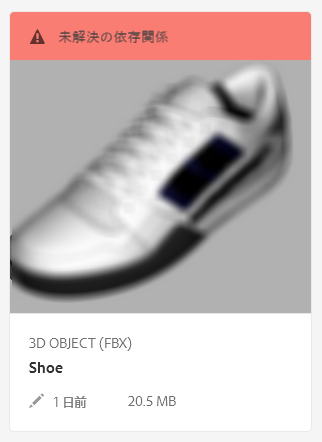

# ファイルの依存関係の解決 {#resolving-file-dependencies}

テクスチャマップファイルなど、プライマリ 3D モデルファイルの依存関係は、可能な場合には自動的に解決されます。この機能は、アセットフォルダー付近で、3D ファイル内にあるものと同じ名前を持つファイルを AEM が検索すると実行されます。If one or more dependencies are unresolvable during the Creating preview processing stage, the asset&#39;s card displays the following red banner message in the **[!UICONTROL Card View]**:

**ファイルの依存関係を解決するには**:

1. In the **[!UICONTROL Card View]**, hover the pointer over the **[!UICONTROL Unresolved Dependencies]** banner message on the card, then tap the **[!UICONTROL Exclamation Point]** icon.

   

1. On the **[!UICONTROL Metadata Properties]** page, tap the **[!UICONTROL Dependencies]** tab.

   The files that AEM could not auto-resolve are listed under the **[!UICONTROL Original Paths]** column, in red.

1. 次の操作を 1 つ以上おこないます。

   * **依存関係を参照して選択する**（この選択肢は、依存性ファイルを既にアップロード済みであることを前提としています）。

      1. Tap the **[!UICONTROL File Browse]** icon to the left of the red path.
      1. On the **[!UICONTROL Select Content]** page, navigate to the missing file, then tap on the file&#39;s card to select it.
      1. In the upper-left corner of the **[!UICONTROL Select Content]** page, tap **[!UICONTROL Close]** (X icon) to return to the **[!UICONTROL View Properties]** page.
   * **依存関係をアップロードする**（この選択肢は、見つからなかったファイルをまだアップロードしていないことを前提としています）。

      1. 見つからなかったパスとファイル名を書き留めます。
      1. プロパティページの右上隅にある「**[!UICONTROL 閉じる]**」をタップします。

   After the files are uploaded return to **[!UICONTROL View Properties > Dependencies]** page. 新たにアップロードされたアセットが、参照されているファイルとして正しく一覧表示されるようになります。

   * **依存関係を無視する**。

      If a missing dependency is no longer needed, under the **[!UICONTROL Referenced Asset]** column, in the text field to the left of the missing file, type `n/a` so that AEM 3D ignores the file.

1. Near the upper-right corner of the **[!UICONTROL View Properties]** page, tap **[!UICONTROL Save]**.
1. Tap **[!UICONTROL Close]** to return to the **[!UICONTROL Card View]**.

   アセットは、新しく解決された依存関係で自動的に再処理されます。

