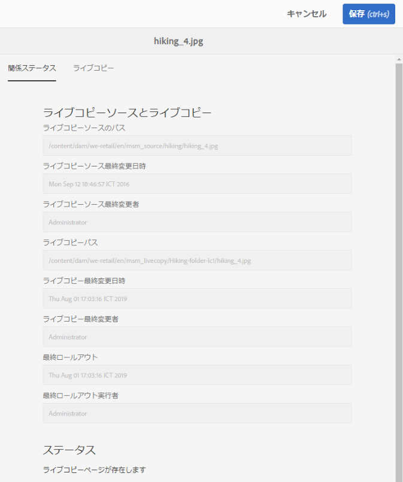
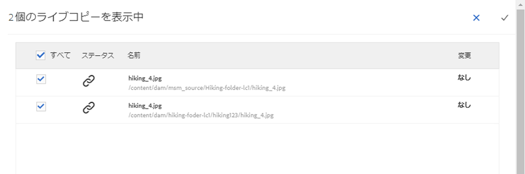

# MSM for を使用したアセットの再利用[!DNL Assets]{#reuse-assets-using-msm-for-assets}

[!DNL Adobe Experience Manager]のマルチサイトマネージャー(MSM)機能を使用すると、1回作成して複数のWeb上の場所で再利用するコンテンツをユーザーが再利用できます。 [!DNL Assets]機能のMSMと同じ機能がデジタルアセットにも使用できます。 [!DNL Assets]にMSMを使用すると、次のことができます。

* 一度アセットを作成した後、そのアセットのコピーを作成して、サイトの他の領域で再利用する。
* 複数のコピーを同期させ、元のプライマリ・コピーを1回更新して、変更内容を子コピーにプッシュします。
* 親アセットと子アセットの間のリンクを一時的または永続的に休止してローカルに変更をおこなう。

## 前提条件 {#msm-prerequisites}

[!DNL Assets]にMSMを使用するには、少なくとも[!DNL Experience Manager] 6.4 Service Pack 5をインストールします。 詳しくは、[最新のサービスパック](/help/release-notes/sp-release-notes.md)のリリースノートを参照してください。

## 利点と概念の理解 {#understand-benefits-concepts}

### 仕組みと利点 {#how-it-works-the-benefits}

複数の Web サイトで同じコンテンツ（テキストとアセット）を再利用するための使用シナリオを理解するには、[考えられる MSM シナリオ](/help/sites-administering/msm.md)を参照してください。[!DNL Experience Manager] では、元のアセットとそのリンクコピーとのリンクを維持します。このコピーはライブコピー（LC）と呼ばれます。リンクが維持されるので、変更を一元化して、多くのライブコピーにプッシュすることができます。これにより、重複コピー管理の制限をなくしつつ、更新を迅速化することができます。変更の伝播はエラーがなく、一元化されています。この機能により、選択した一部のライブコピーに限定した更新も可能になります。ユーザは、リンクのデタッチ、つまり継承の中断、および次回のプライマリコピーの更新時に上書きされないローカル編集を行って、変更をロールアウトできます。 分離は、選択した一部のメタデータフィールドまたはアセット全体に対しておこなうことができます。これにより、元々プライマリコピーから継承されたアセットをローカルで更新する柔軟性が得られます。

MSM では、ソースアセットとそのライブコピーとのライブ関係を次の目的で維持します。

* ソースアセットの変更がライブコピーにも適用（ロールアウト）されます。つまり、ライブコピーはソースと同期しています。

* ライブ関係を休止してライブコピーを更新することも、一部の限られたフィールドについて継承を解除することもできます。ソースに対する変更はライブコピーに適用されなくなります。

### MSM for Assets の用語集  {#glossary-msm-for-assets}

* **Source：元** のアセットまたはフォルダー。ライブコピーの派生元となるプライマリコピー。

* **ライブコピー：ソ** ースと同期しているソースアセットまたはソースフォルダーのコピー。ライブコピーは、さらに別のライブコピーのソースになることができます。[LC の作成方法](#create-live-copy-asset)を参照してください。

* **継承：ライブコピー** のアセット/フォルダーと、システムが更新の送信先を記憶する際に使用するソースとの間のリンク/参照。メタデータフィールドの継承は詳細なレベルで存在します。ソースとそのライブコピーとのライブ関係を維持しながら、一部のメタデータフィールドの継承を解除することができます。

* **ロールアウト**:ソースに対して行われた変更を、そのソースのライブコピーの下流にプッシュするアクション。ロールアウトアクションを使用して、一度に 1 つ以上のライブコピーを更新することができます。[ロールアウト](#rollout-action)を参照してください。

* **ロールアウト設定：どのプロパティをどのように、いつ、どのように同期するかを決定する** ルール。これらの設定はライブコピーの作成時に適用され、後で編集できます。子は親アセットからロールアウト設定を継承できます。[!DNL Assets]のMSMの場合は、[標準]ロールアウト設定のみを使用します。 その他のロールアウト設定は、[!DNL Assets]のMSMでは使用できません。

* **同期：展開に加えて、** ソースからライブコピーに更新を送信することで、ソースとライブコピーの間に同一性を持たせる別のアクション。同期は特定のライブコピーに対して開始され、このアクションでソースから変更内容が取得されます。このアクションを使用すると、ライブコピーのいずれか 1 つだけを更新することができます。[同期アクション](#about-synchronize-action)を参照してください。

* **休止：ライブコピーとソースアセット/フォルダーの間のライブ関係を** 一時的に削除します。関係は再開できます。[休止アクション](#suspend-and-resume-relationship)を参照してください。

* **再開：ライブリレーションシップを** 再開し、ライブコピーを再度開始がソースから更新を受け取るようにします。[再開アクション](#suspend-and-resume-relationship)を参照してください。

* **リセット：** リセット操作は、ローカルの変更を上書きして、ライブコピーを再びソースのレプリカにします。また、継承のキャンセルを解除し、すべてのメタデータフィールドに対して継承をリセットします。後でローカルに変更を加えるには、特定のフィールドの継承を再びキャンセルする必要があります。[LC に対するローカルの変更](#make-local-modifications-to-live-copy)を参照してください。

* **Detach：ライブコピーのアセット/フォルダのライブリレーションシップを** 取り消すことはできません。分離アクションの後、ライブコピーはソースから更新内容を受け取ることができなくなり、ライブコピーではなくなります。[関係の解除](#remove-live-relationship)を参照してください。

## アセットのライブコピーの作成 {#create-live-copy-asset}

1 つ以上のソースアセットまたはフォルダーからライブコピーを作成するには、次のいずれかを実行します。

* **方法1**:ソースアセットを選択し、上部の **[!UICONTROL 作成]** / **[!UICONTROL ライブ]** コピー元ツールバーをクリックします。
* ****&#x200B;方法 2：AEM ユーザーインターフェイスの右上隅で、**[!UICONTROL 作成／ライブコピー]**&#x200B;をクリックします。

アセットまたはフォルダーのライブコピーを 1 つずつ作成できます。それ自体がライブコピーであるアセットまたはフォルダーから派生したライブコピーを作成できます。

この使用例では、コンテンツフラグメント（CF）はサポートされていません。ライブコピーを作成しようとすると、CF は関係を除きそのままコピーされます。コピーされた CF はある時点でのスナップショットであり、元の CF が更新されても更新されません。

最初の方法でライブコピーを作成するには、次の手順に従います。

1. ソースアセットまたはフォルダーを選択します。ツールバーで&#x200B;**[!UICONTROL 作成／ライブコピー]**をクリックします。
   
1. ソースアセットまたはフォルダーを選択します。「**[!UICONTROL 次へ]**」をクリックします。
1. タイトルと名前を入力します。アセットには子はありません。フォルダーのライブコピーを作成する場合は、子を含めるか含めないかを選択できます。
1. ロールアウト設定を選択します。「**[!UICONTROL 作成]**」をクリックします。

2 番目の方法でライブコピーを作成するには、次の手順に従います。

1. AEM インターフェイスの右上隅で&#x200B;**[!UICONTROL 作成／ライブコピー]**をクリックします。
   
1. ソースアセットまたはフォルダーを選択します。「**[!UICONTROL 次へ]**」をクリックします。
1. 保存先フォルダーを選択します。「**[!UICONTROL 次へ]**」をクリックします。
1. タイトルと名前を入力します。アセットには子はありません。フォルダーのライブコピーを作成する場合は、子を含めるか含めないかを選択できます。
1. ロールアウト設定を選択します。「**[!UICONTROL 作成]**」をクリックします。

>[!NOTE]
>
>ソースまたはライブコピーが移動されても、関係は保持されます。ライブコピーが削除されると、関係は解除されます。

## ソースおよびライブコピーの各種プロパティおよびステータスの表示 {#view-properties-statuses-source-and-lc}

AEM ユーザーインターフェイスの様々な領域で、ライブコピーの情報や MSM 関連ステータス（関係、同期、ロールアウトなど）を表示できます。アセットとフォルダーに対しては次の 2 通りの方法があります。

* ライブコピーアセットを選択し、**[!UICONTROL プロパティ]**&#x200B;ページで情報を探します。
* ソースフォルダーを選択し、**[!UICONTROL ライブコピーコンソール]**&#x200B;から各ライブコピーの詳細情報を探します。

>[!TIP]
>
>複数の個別のライブコピーのステータスを確認するには、最初の方法を使用して&#x200B;**[!UICONTROL プロパティ]**&#x200B;ページを確認します。 多数のライブコピーのステータスを確認するには、2番目の方法を使用して&#x200B;**[!UICONTROL 関係ステータス]**&#x200B;ページを確認します。

### ライブコピーの情報とステータス {#information-status-of-one-lc}

ライブコピーアセットまたはフォルダーの情報とステータスを確認するには、次の手順に従います。

1. ライブコピーアセットまたはフォルダーを選択します。ツールバーの「**[!UICONTROL プロパティ]**」をクリックします。または、キーボードショートカット `p` を使用します。
1. 「**[!UICONTROL ライブコピー]**」をクリックします。ソースのパス、休止ステータス、同期ステータス、前回のロールアウト日、前回のロールアウトをおこなったユーザーを確認できます。
   
1. 子アセットがライブコピー設定を借用するかどうかを選択できます。
1. ライブコピーがロールアウト設定を親から継承するか、設定を変更するかを指定するオプションを選択できます。

### フォルダーのすべてのライブコピーの情報とステータス {#information-status-of-all-lcs-of-folder}

[!DNL Experience Manager] には、ソースフォルダーの全ライブコピーのステータスを確認できるコンソールが用意されています。このコンソールには、すべての子アセットのステータスが表示されます。

1. ソースフォルダーを選択します。ツールバーの「**[!UICONTROL プロパティ]**」をクリックします。または、キーボードショートカット `p` を使用します。
1. 「**[!UICONTROL ライブコピーのソース]**」をクリックします。コンソールを開くには、「**[!UICONTROL ライブコピーの概要]**」をクリックします。このダッシュボードには、すべての子アセットの最上位ステータスが表示されます。
   
1. ライブコピーフォルダー内の各アセットに関する詳細情報を表示するには、アセットを選択し、ツールバーの「**[!UICONTROL 関係ステータス]**」をクリックします。
   

>[!TIP]
>
>参照しすぎなくても、他のフォルダーのライブコピーのステータスをすばやく確認できます。 **[!UICONTROL ライブコピーの概要]**&#x200B;インターフェイスの上部中央からフォルダーを変更します。

### ソースの参照パネルのクイックアクション {#quick-actions-from-references-rail-for-source}

ソースアセットまたはフォルダーの場合は、参照パネルから以下の情報を参照したり以下のアクションを直接実行したりできます。

* ライブコピーのパスを参照する。
* [!DNL Experience Manager]ユーザーインターフェイスで特定のライブコピーを開くか、表示します。
* 更新内容を特定のライブコピーに同期させる。
* 特定のライブコピーについて、関係を休止したりロールアウト設定を変更したりする。
* ライブコピーの概要コンソールにアクセスする。

ソースアセットまたはフォルダーを選択し、左側のパネルを開いて「**[!UICONTROL 参照]**」をクリックします。あるいは、アセットまたはフォルダーを選択し、キーボードショートカット `Alt + 4` を使用します。

特定のライブコピーの場合は、「**[!UICONTROL ライブコピーを編集]**」をクリックすると、関係を休止したり、ロールアウト設定を変更したりできます。

### ライブコピーの参照パネルのクイックアクション  {#quick-actions-from-references-rail-for-live-copy}

ライブコピーアセットまたはフォルダーの場合は、参照パネルから以下の情報を参照したり以下のアクションを直接実行したりできます。

* ソースのパスを参照する。
* [!DNL Experience Manager]ユーザーインターフェイスで特定のライブコピーを開くか、表示します。
* 更新内容をロールアウトする。

ライブコピーアセットまたはフォルダーを選択し、左側のパネルを開いて「**[!UICONTROL 参照]**」をクリックします。あるいは、アセットまたはフォルダーを選択し、キーボードショートカット `Alt + 4` を使用します。

## ソースからライブコピーへの変更の伝播 {#propagate-modifications-from-source-to-live-copies}

ソースが変更されると、同期アクションまたはロールアウトアクションを使用して変更内容をライブコピーに伝播できます。両方のアクションの違いを理解するには、[用語集](#glossary-msm-for-assets)を参照してください。

### ロールアウトアクション {#rollout-action}

ソースアセットからロールアウトアクションを開始して、全部または選択した一部のライブコピーを更新できます。

1. ライブコピーアセットまたはフォルダーを選択します。ツールバーの「**[!UICONTROL プロパティ]**」をクリックします。または、キーボードショートカット `p` を使用します。
1. 「**[!UICONTROL ライブコピーのソース]**」をクリックします。ツールバーの&#x200B;**[!UICONTROL ロールアウト]**&#x200B;をクリックします。
1. 更新するライブコピーを選択します。「**[!UICONTROL ロールアウト]**」をクリックします。
1. 子アセットに対する更新内容をロールアウトするには、「**[!UICONTROL ソースとすべての子をロールアウト]**」をオンにします。
   

>[!NOTE]
>
>ソースアセットでおこなわれた変更は、直接関係するライブコピーにのみロールアウトされます。ライブコピーが別のライブコピーから派生したものである場合、派生したライブコピーには変更内容はロールアウトされません。

または、特定のライブコピーを選択した後に、[!UICONTROL 参照]レールからロールアウト操作を開始することもできます。 詳しくは、[ライブコピーの参照パネルのクイックアクション](#quick-actions-from-references-rail-for-live-copy)を参照してください。このロールアウト方法では、選択したライブコピーとその子（任意指定）のみ更新されます。

### 同期アクションについて {#about-synchronize-action}

同期アクションは、ソースの変更内容を取り込んで、選択したライブコピーにのみ適用します。同期アクションでは、継承のキャンセル後におこなわれたローカルの変更を尊重して維持します。ローカルの変更は上書きされず、キャンセルした継承も復元されません。同期アクションは 3 通りの方法で開始できます。

| [!DNL Experience Manager]インターフェイスの場所 | 使用するタイミングと理由 | 使用方法 |
|---|---|---|
| [!UICONTROL 参照パネル] | ソースが既に選択されているときにすばやく同期させます。 | [ソースの参照パネルのクイックアクション](#quick-actions-from-references-rail-for-source)を参照 |
| [!UICONTROL プロパティ]ページのツールバー | ライブコピーのプロパティが既に開いているときに同期を開始します。 | [ライブコピーの同期](#synchronize-live-copy)を参照 |
| [!UICONTROL ライブコピーの概要コンソール] | ソースフォルダーが選択されている場合、または[!UICONTROL ライブコピーの概要]コンソールが既に開いている場合に、複数のアセットをすばやく同期します（必ずしもすべてではありません）。 同期アクションは一度に 1 つのアセットに対して開始されますが、複数のアセットの同期を一度に実行する手軽な方法です。 | [ライブコピーフォルダー内の多数のアセットに対するアクション](#take-actions-on-many-assets-in-lcfolder)を参照 |

### ライブコピーの同期  {#synchronize-live-copy}

同期アクションを開始するには、ライブコピーの&#x200B;**[!UICONTROL プロパティ]**&#x200B;ページを開き、「**[!UICONTROL ライブコピー]**」をクリックして、ツールバーで目的のアクションをクリックします。

同期アクションに関連するステータスと情報を確認するには、[フォルダー](#information-status-of-all-lcs-of-folder)のすべてのライブコピーの情報とステータスを参照してください。

>[!NOTE]
>
>関係が休止されている場合は、ツールバーの同期アクションは使用できません。同期アクションは[!UICONTROL 参照]レールで使用できますが、ロールアウトが成功した場合でも変更は反映されません。

## 関係の休止と再開 {#suspend-and-resume-relationship}

関係を一時的に休止して、ソースアセットまたはフォルダーの変更内容をライブコピーが受け取らないようにすることができます。また、関係を再開して、ソースの変更内容の受け取りをライブコピーが再び開始するようにすることもできます。

関係を休止または再開するには、ライブコピーの&#x200B;**[!UICONTROL プロパティ]**&#x200B;ページを開き、「**[!UICONTROL ライブコピー]**」をクリックして、ツールバーで目的のアクションをクリックします。

または、**[!UICONTROL ライブコピーの概要]**&#x200B;コンソールから、ライブコピーフォルダー内の複数のアセットについて、関係をすばやく休止または再開することができます。[ライブコピーフォルダー内の多数のアセットに対するアクションの実行](#take-actions-on-many-assets-in-lcfolder)を参照してください。

## ライブコピーのローカル編集 {#make-local-modifications-to-live-copy}

ライブコピーは、元のソースの作成時のレプリカです。ライブコピーのメタデータ値はソースから継承されます。メタデータフィールドでは、ソースアセットのそれぞれのフィールドについて継承を個別に維持します。

ただし、ライブコピーをローカルに変更して、一部の限定されたプロパティを変更する柔軟性があります。ローカルに変更するには、目的のプロパティの継承をキャンセルします。1 つ以上のメタデータフィールドの継承がキャンセルされても、アセットのライブ関係と他のメタデータフィールドの継承は保持されます。同期やロールアウトでローカルの変更内容が上書きされることはありません。これを行うには、ライブコピーアセットの&#x200B;**[!UICONTROL プロパティ]**&#x200B;ページを開き、メタデータフィールドの横にある&#x200B;**[!UICONTROL 継承をキャンセル]**&#x200B;オプションをクリックします。

ローカルの変更をすべて取り消して、アセットをソースの状態に戻すことができます。リセットアクションはローカルの変更をすべて完全かつ即座に無効にし、すべてのメタデータフィールドに関して継承を復元します。元に戻すには、ライブコピーアセットの&#x200B;**[!UICONTROL プロパティ]**&#x200B;ページでツールバーの「**[!UICONTROL リセット]**」クリックします。

## ライブ関係の解除 {#remove-live-relationship}

分離アクションを使用して、ソースとライブコピーとの関係を完全に解除できます。ライブコピーは、分離後、スタンドアロンのアセットまたはフォルダーになります。分離後直ちに、新しいアセットとして AEM インターフェイスに表示されます。ライブコピーをソースから分離するには、次の手順に従います。

1. ライブコピーアセットまたはフォルダーを選択します。ツールバーの「**[!UICONTROL プロパティ]**」をクリックします。または、キーボードショートカット `p` を使用します。
1. 「**[!UICONTROL ライブコピー]**」をクリックします。ツールバーの「**[!UICONTROL 分離]**」をクリックします。表示されるダイアログで「**[!UICONTROL 分離]**」クリックします。
   

>[!CAUTION]
>
>ダイアログで「[!UICONTROL 分離]」をクリックするとすぐに、関係が解除されます。プロパティページで「[!UICONTROL キャンセル]」をクリックしても、関係を元に戻すことはできません。

または、**[!UICONTROL ライブコピーの概要]**&#x200B;コンソールでライブコピーフォルダー内の複数のアセットをすばやく分離することができます。[ライブコピーフォルダー内の多数のアセットに対するアクションの実行](#take-actions-on-many-assets-in-lcfolder)を参照してください。

## ライブコピーフォルダー内の多数のアセットに対するアクションの実行 {#take-actions-on-many-assets-in-lcfolder}

ライブコピーフォルダーに複数のアセットがある場合、アセットごとにアクションを開始するのは面倒なことがあります。ライブコピーコンソールから、多数のアセットに対して基本アクションをすばやく開始できます。上記の方法は、個々のアセットに対して引き続き機能します。

1. ソースフォルダーを選択します。ツールバーの「**[!UICONTROL プロパティ]**」をクリックします。または、キーボードショートカット p を使用します。
1. 「ライブコピーのソース」をクリックします。コンソールを開くには、「**[!UICONTROL ライブコピーの概要]**」をクリックします。
1. このダッシュボードで、ライブコピーフォルダーからライブコピーアセットを選択します。ツールバーで目的のアクションをクリックします。**[!UICONTROL 編集]**、**[!UICONTROL 同期]**、**[!UICONTROL リセット]**、**[!UICONTROL 休止]**、**[!UICONTROL 切り離し]**が使用できます。 選択したソースフォルダーとライブ関係にある任意の数のライブコピーフォルダーに含まれている任意のアセットに対して、これらの操作をすばやく開始できます。
   

## MSM for Assets の拡張 {#extend-msm-for-assets}

AEM では、MSM Java API を使用して機能を拡張することができます。Assets の場合、拡張は MSM for Sites の場合と同じように機能します。詳しくは、[Multi Site Manager の拡張](../sites-developing/extending-msm.md)を参照してください。具体的な作業については、以下の節を参照してください。

* [Java API の概要](../sites-developing/extending-msm.md#overview-of-the-java-api)
* [新しい同期アクションの作成](../sites-developing/extending-msm.md#creating-a-new-synchronization-action)
* [新しいロールアウト設定の作成](../sites-developing/extending-msm.md#creating-a-new-rollout-configuration)
* [シンプルな LiveActionFactory クラスの作成と使用](../sites-developing/extending-msm.md#creating-and-using-a-simple-liveactionfactory-class)

>[!NOTE]
>
>* MSM for Sites におけるブループリントは、MSM for Assets ではライブコピーソースと呼ばれます。
>* サイトを作成ウィザードでの章ステップの削除は、MSM for Assets ではサポートされていません。
>* ページプロパティに対する MSM ロックの設定（タッチ操作対応 UI）は、MSM for Assets ではサポートされていません。

## ライブコピーに対するアセット管理タスクの影響 {#impact-of-asset-management-tasks-on-live-copies}

ライブコピーとソースは、ある程度までデジタルアセットとして管理できるアセットまたはフォルダーです。AEM における一部のアセット管理タスクは、ライブコピーに特定の影響を及ぼします。

* ライブコピーをコピーすると、最初のライブコピーと同じソースのライブコピーアセットが作成されます。
* ソースまたはソースのライブコピーを移動しても、ライブ関係は保持されます。
* 編集アクションはライブコピーアセットには機能しません。
* チェックアウトアクションはライブコピーアセットには使用できません。
* ソースフォルダーの場合は、レビュータスクを作成するオプションが使用可能です。
* アセットリストをリスト表示および列表示で表示する場合、ライブコピーアセットまたはフォルダーには「ライブコピー」と表示されます。これにより、フォルダー内のライブコピーを識別しやすくなります。

## MSM for Assets と MSM for Sites の比較 {#compare-msm-for-assets-and-sites}

多くのシナリオで、MSM for Assets の動作は MSM for Sites の機能と一致します。注意すべき重要な違いは次のとおりです。

* MSM for Sites ではブループリントとそのライブコピーを比較できますが、MSM for Assets ではソースとそのライブコピーを比較することはできません。
* MSM for Sites の場合は子があるのが普通ですが、MSM for Assets の場合はそうではありません。個々のアセットのライブコピーを作成する際に、子を含めるか含めないかを選択するオプションはありません。
* サイトを作成ウィザードでの章ステップの削除は、MSM for Assets ではサポートされていません。
* ページプロパティに対する MSM ロックの設定（タッチ操作対応 UI）は、MSM for Assets ではサポートされていません。
* MSM for Assets の場合は、標準ロールアウト設定のみ使用します。それ以外のロールアウト設定は、MSM for Assets では使用できません。

## アセットに対するMSMの制限{#limitations-of-msm-for-assets}

アセットに関するMSMの制限を以下に示します。

* この使用例では、コンテンツフラグメント（CF）はサポートされていません。ライブコピーを作成しようとすると、CF は関係を除きそのままコピーされます。コピーされた CF はある時点でのスナップショットであり、元の CF が更新されても更新されません。

* MSMは、メタデータの書き戻しが有効な場合は機能しません。 書き戻し時に、継承が中断します。
