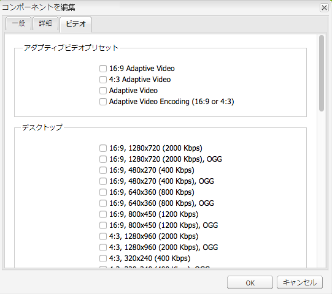
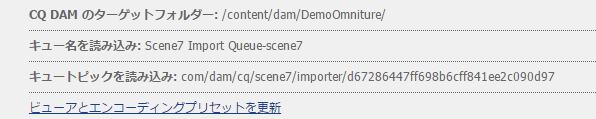
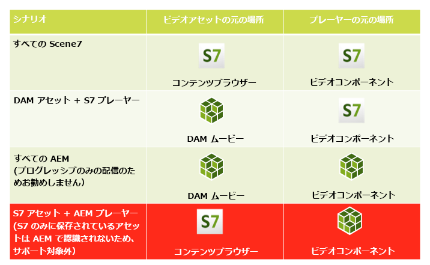

# ビデオ {#video}

アセットは、ビデオアセットを一元的に管理するためのツールです。この機能を使用して、ビデオをアセットに直接アップロードし、Dynamic Mediaクラシックに自動エンコードできます。 また、アセットから直接Dynamic Mediaクラシックビデオにアクセスして、ページをオーサリングすることもできます。

Dynamic Mediaクラシックビデオ統合により、最適化されたビデオの提供先がすべての画面（自動デバイスおよび帯域幅検出）に拡張されます。

**[!UICONTROL Scene7ビデオ]**&#x200B;コンポーネントは、デバイスと帯域幅の検出を自動的に実行し、デスクトップ、タブレット、モバイルで適切な形式と品質のビデオを再生します。

単一のビデオアセットだけでなく、アダプティブビデオセットも含めることができます。 アダプティブビデオセットは、複数の画面にわたってシームレスにビデオを再生するために必要なすべてのビデオレンディションを対象としたコンテナです。 アダプティブビデオセットは、同じビデオを異なるビットレートおよび形式でエンコードしたバージョンをグループ化します。 例えば、400 kbps、800 kbps、1000 kbpsです。 アダプティブビデオセットは、S7ビデオコンポーネントと共に、複数の画面タイプ間でのアダプティブビデオストリーミングに使用します。 デスクトップ、iOS、Android、BlackBerry、Windows携帯端末など。

詳しくは、[Dynamic Mediaクラシックのアダプティブビデオセットに関するドキュメントを参照してください。](https://experienceleague.adobe.com/docs/experience-manager-cloud-service/assets/dynamicmedia/video-profiles.html#dynamicmedia)

## FFMPEGとDynamic Mediaクラシックについて{#about-ffmpeg-and-scene}

デフォルトのビデオエンコーディングプロセスは、ビデオプロファイルとの FFMPEG ベースの統合の使用に基づいています。そのため、組み込みの DAM 収集ワークフローには、ffmpeg ベースの次の 2 つのワークフローのステップが含まれています。

* FFMPEG のサムネール
* FFMPEG エンコーディング

Dynamic Mediaクラシック統合を有効にして設定しても、これら2つのワークフロー手順は、設定済みのDAMインジェストワークフローから自動的に削除または非アクティブ化されません。 Experience Managerで既にFFMPEGベースのビデオエンコーディングを使用している場合は、オーサリング環境にFFMPEGがインストールされている可能性があります。 この場合、DAMを使用して取り込む新しいビデオは2回エンコードされます。をFFMPEGエンコーダーから、またはDynamic Mediaクラシック統合から1回呼び出します。

AEMで設定され、FFMPEGがインストールされているFFMPEGベースのビデオエンコーディングがある場合は、2つのFFMPEGワークフローをDAMインジェストワークフローから削除できます。

## サポートされるファイル形式 {#supported-formats}

Scene7 ビデオコンポーネントでは次の形式がサポートされます。

* F4V H.264
* MP4 H.264

## ビデオのアップロード先の指定  {#deciding-where-to-upload-your-video}

ビデオアセットのアップロード先の指定は、次の条件によって決まります。

* ビデオアセットのワークフローが必要かどうか
* ビデオアセットのバージョン管理が必要かどうか

これらの質問のいずれかまたは両方に対する回答が「はい」の場合は、ビデオをAdobeDAMに直接アップロードします。 両方の質問に対する回答が「いいえ」の場合は、ビデオを直接Dynamic Mediaクラシックにアップロードします。 各シナリオのワークフローについては、次の節で説明します。

### ビデオを直接 Adobe DAM にアップロードする場合 {#if-you-are-uploading-your-video-directly-to-adobe-dam}

アセットのワークフローまたはバージョン管理が必要な場合は、まずAdobeDAMにアップロードします。 推奨されるワークフローは次のとおりです。

1. ビデオアセットをAdobeDAMにアップロードし、自動的にエンコードしてDynamic Mediaクラシックに公開します。
1. Experience Managerで、コンテンツファインダーの&#x200B;**[!UICONTROL Movies]**&#x200B;タブのWCMのビデオアセットにアクセスします。
1. **[!UICONTROL Scene7ビデオ]**&#x200B;または&#x200B;**[!UICONTROL Foundationビデオ]**&#x200B;コンポーネントを持つ作成者。

### ビデオを Scene7 にアップロードする場合 {#if-you-are-uploading-your-video-to-scene}

アセットのワークフローやバージョン管理が必要ない場合は、アセットをScene7にアップロードします。 推奨されるワークフローは次のとおりです。

1. Dynamic Mediaクラシックでは、[Scene7に対するFTPのアップロードとエンコードのスケジュール設定を行います（システム自動化）](https://experienceleague.adobe.com/docs/dynamic-media-classic/using/upload-publish/uploading-files.html#preparing-your-assets-and-folders-for-uploading)。
1. Experience Managerで、コンテンツファインダーの&#x200B;**[!UICONTROL Scene7]**&#x200B;タブのWCMのビデオアセットにアクセスします。
1. **[!UICONTROL Scene7ビデオ]**&#x200B;コンポーネントを持つ作成者。

## Scene7 ビデオとの統合の設定 {#configuring-integration-with-scene-video}

ユニバーサルプリセットを設定するには：

1. **[!UICONTROL クラウドサービス]**&#x200B;で、**[!UICONTROL Scene7]** の設定に移動して、「**[!UICONTROL 編集]**」をクリックします。
1. 「**[!UICONTROL ビデオ]**」タブを選択します。

   

   >[!NOTE]
   >
   >クラウド設定がページにない場合は、「**[!UICONTROL ビデオ]**」タブが表示されません。

1. アダプティブビデオエンコーディングプロファイル、組み込みの単一のビデオエンコーディングプロファイルまたはカスタムビデオエンコーディングプロファイルを選択します。

   >[!NOTE]
   >
   >ビデオプリセットの意味について詳しくは、[Dynamic Mediaクラシックドキュメント](https://experienceleague.adobe.com/docs/dynamic-media-classic/using/setup/application-setup.html#video-presets-for-encoding-video-files)を参照してください。
   >
   >ユニバーサルプリセットを設定する際に両方のアダプティブビデオセットを選択するか、「**[!UICONTROL アダプティブビデオエンコーディング]**」オプションを選択することをお勧めします。

1. 選択したエンコーディングプロファイルは、この Scene7 クラウド設定用に指定した CQ DAM のターゲットフォルダーにアップロードされたすべてのビデオに自動的に適用されます。必要に応じて、別のターゲットフォルダーに別のエンコーディングプロファイルを適用することで、複数の Scene7 クラウド設定を指定できます。

## ビューアとエンコーディングプリセットの更新  {#updating-viewer-and-encoding-presets}

Scene7でプリセットが更新された場合は、Experience Managerでビデオのビューアおよびエンコーディングプリセットを更新する必要があります。 このような場合は、クラウド設定のScene7設定に移動し、「**[!UICONTROL ビューアとエンコーディングプリセットを更新]**」をクリックします。

## AdobeDAM {#uploading-your-master-video}からScene7にマスタービデオをアップロード中

1. Scene7 のエンコーディングプロファイルと共にクラウド設定を指定した CQ DAM のターゲットフォルダーに移動します。
1. 「**[!UICONTROL アップロード]**」をクリックして、マスタービデオをアップロードします。ビデオのアップロードとエンコーディングは、DAM Update Assetワークフローが完了し、**[!UICONTROL Scene7]**&#x200B;に発行にチェックマークが付いた後に完了します。

   >[!NOTE]
   >
   >ビデオサムネールの生成には時間がかかります。

   DAMマスタービデオをビデオコンポーネントにドラッグすると、配信用にScene7でエンコードされたプロキシレンディションがすべて&#x200B;**&#x200B;アクセスされます。

## 基盤ビデオコンポーネントと Scene7 ビデオコンポーネントの比較 {#foundation-video-component-versus-scene-video-component}

Experience Managerを使用する場合、サイトで使用できるビデオコンポーネントと、Scene7のビデオコンポーネントの両方にアクセスできます。 これらのコンポーネントに互換性はありません。

Scene7 ビデオコンポーネントは、Scene7 ビデオでのみ使用できます。Foundationコンポーネントは、Experience Manager（ffmpegを使用）およびScene7ビデオから保存されたビデオと連携します。

次のマトリックスは、どのコンポーネントを使用するかを説明しています。

>[!NOTE]
>
>S7ビデオコンポーネントは、標準搭載のユニバーサルビデオプロファイルを使用します。 ただし、Experience ManagerでHTML5ベースのビデオプレーヤーを取得できます。 標準搭載のHTML5ビデオプレーヤーの埋め込みコードをコピーして、Experience Managerページに配置します。

## Experience Managerビデオコンポーネント{#aem-video-component}

Scene7のビデオを見る際にScene7のビデオコンポーネントを使用することをお勧めする場合でも、完全性を保つために、Scene7のビデオをFoundation Video Componentと共に使用してください。

### Experience ManagerビデオとScene7ビデオの比較{#aem-video-and-scene-video-comparison}

次の表に、Foundation VideoコンポーネントとScene7ビデオコンポーネントの間でサポートされる機能の高レベルな比較を示します。

|  | Experience Manager基盤のビデオ | Scene7 ビデオ |
|---|---|---|
| アプローチ | HTML5 における最優先のアプローチです。Flash は HTML5 以外のフォールバックでのみ使用されます。 | ほとんどのデスクトップでは Flash です。HTML5 はモバイルとタブレットで使用されます。 |
| 配信 | プログレッシブ | アダプティブストリーミング |
| 追跡 | 可 | 可 |
| 拡張性 | 可 | 可 （[HTML5ビューアSDK APIドキュメント](https://s7d1.scene7.com/s7sdk/3.10/docs/jsdoc/index.html)を含む） |
| モバイルビデオ | 可 | はい |

### 設定  {#setting-up}

#### ビデオプロファイルの作成 {#creating-video-profiles}

様々なビデオエンコーディングは、Scene7クラウド設定で選択したScene7エンコーディングプリセットに従って作成されます。 Foundation Videoコンポーネントでこれらを使用するには、選択した各Scene7エンコーディングプリセットに対してビデオプロファイルを作成する必要があります。 このメソッドにより、ビデオコンポーネントはそれに応じてDAMレンディションを選択できます。

>[!NOTE]
>
>新しいビデオプロファイルおよびビデオプロファイルに対する変更をアクティベートして公開する必要があります。

1. Experience Managerで、**[!UICONTROL ツール]/[!UICONTROL 設定コンソール]**&#x200B;をタップします。
1. 設定コンソール&#x200B;****&#x200B;から、ナビゲーションツリーの&#x200B;**[!UICONTROL ツール/DAM/ビデオプロファイル]**&#x200B;に移動します。
1. Scene7ビデオプロファイルの作成を参照してください。 **[!UICONTROL New...]**&#x200B;ドロップダウンリストで、「**[!UICONTROL ページを作成]**」を選択し、Scene7ビデオプロファイルテンプレートを選択します。 新しいビデオプロファイルページに名前を付け、「**[!UICONTROL 作成]**」をクリックします。

   

1. 新しいビデオプロファイルを編集します。最初にクラウド設定を選択します。次に、クラウド設定で選択したものと同じエンコーディングプリセットを選択します。

   

   | プロパティ | 説明 |
   |---|---|
   | Scene7 クラウド設定 | エンコーディングプリセットで使用するクラウド設定です。 |
   | Scene7 エンコーディングプリセット | このビデオプロファイルをマップするために使用するエンコーディングプリセットです。 |
   | HTML5 ビデオタイプ | このプロパティを使用すると、HTML5ビデオソース要素のtypeプロパティの値を設定できます。 この情報は、S7 エンコーディングプリセットでは提供されませんが、HTML5 ビデオ要素を使用してビデオを適切にレンダリングするために必要です。共通の形式用のリストが提供されますが、他の形式用に上書きできます。 |

   ビデオコンポーネントで使用する、クラウド設定で選択したすべてのエンコーディングプリセットについて、この手順を繰り返します。

#### デザインの設定{#configuring-design}

**[!UICONTROL Foundation Video]**&#x200B;コンポーネントは、ビデオソースリストの構築に使用するビデオプロファイルを知っている必要があります。 ビデオコンポーネントデザインダイアログボックスを開き、新しいビデオプロファイルを使用するためのコンポーネントデザインを設定します。

>[!NOTE]
>
>モバイルページで&#x200B;**[!UICONTROL Foundation Video]**&#x200B;コンポーネントを使用する場合、モバイルページのデザインでこれらの手順を繰り返します。

>[!NOTE]
>
>デザインに変更を加えるには、デザインをアクティベーションして、公開で有効にする必要があります。

1. **[!UICONTROL Foundation Video]**&#x200B;コンポーネントのデザインダイアログボックスを開き、「**[!UICONTROL プロファイル]**」タブに変更します。 次に、そのまま使用できるプロファイルを削除し、新しいS7ビデオプロファイルを追加します。 デザインダイアログボックス内のプロファイルリストの順序によって、レンダリング時のビデオソース要素の順序が定義されます。
1. HTML5をサポートしていないブラウザーの場合、ビデオコンポーネントを使用してFlashのフォールバックを設定できます。 ビデオコンポーネントデザインダイアログボックスを開き、「**[!UICONTROL Flash]**」タブに移動します。 Flash Playerの設定を行い、Flash Playerのフォールバックプロファイルを割り当てます。

#### チェックリスト {#checklist}

1. S7クラウド設定の作成を参照してください。 ビデオエンコーディングプリセットが設定されていて、インポーターが実行されていることを確認します。
1. クラウド設定で選択した各ビデオエンコーディングプリセット用の S7 ビデオプロファイルを作成します。
1. ビデオプロファイルをアクティベートする必要があります。
1. ページ上の&#x200B;**[!UICONTROL Foundation Video]**&#x200B;コンポーネントのデザインを設定します。
1. デザインの変更が完了したら、デザインをアクティベートします。

