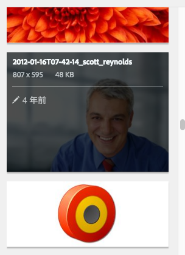

# ページへのDynamic Media Classicコンポーネントの追加 {#adding-scene-features-to-your-page}

Adobe Dynamic Media Classicは、リッチメディアアセットを管理、強化、公開、および Web、モバイル、電子メール、インターネットに接続されたディスプレイと印刷できる、ホストソリューションです。

Dynamic Media Classicで公開されたAEMアセットは、様々なビューアで表示できます。

* ズーム
* フライアウト
* ビデオ
* 画像テンプレート
* 画像

デジタルアセットをAEMからDynamic Media Classicに直接公開したり、デジタルアセットをDynamic Media ClassicからAEMに公開したりできます。

このドキュメントでは、デジタルアセットをAEMからDynamic Media Classicに公開する方法と、その逆の方法について説明します。 また、ビューアについても詳しく説明します。AEM for Dynamic Media Classicの設定について詳しくは、 [Dynamic Media ClassicとAEMの統合](/help/sites-administering/scene7.md).

[画像マップの追加](image-maps.md)も参照してください。

AEM でのビデオコンポーネントの使用について詳しくは、[ビデオ](video.md)を参照してください。

>[!NOTE]
>
>Dynamic Media Classicのアセットが正しく表示されない場合は、Dynamic Media が [無効](config-dynamic.md#disabling-dynamic-media) ページを更新します。

## アセットからDynamic Media Classicへの手動公開 {#manually-publishing-to-scene-from-assets}

デジタルアセットは、次の手順でDynamic Media Classicに公開できます。

* [クラシック UI を使用して Assets コンソールから](/help/sites-classic-ui-authoring/manage-assets-classic-s7.md#publishing-from-the-assets-console)
* [クラシック UI を使用してアセットから](/help/sites-classic-ui-authoring/manage-assets-classic-s7.md#publishing-from-an-asset)
* [CQ Target フォルダーの外部からのクラシックユーザーインターフェイス](/help/sites-classic-ui-authoring/manage-assets-classic-s7.md#publishing-assets-from-outside-the-cq-target-folder)

>[!NOTE]
>
>AEMはDynamic Media Classicに非同期で公開します。 次をクリックした後： **[!UICONTROL 公開]**( アセットがDynamic Media Classicに公開されるまで数秒かかる場合があります )。

## Dynamic Media Classicコンポーネント {#scene-components}

AEMでは、次のDynamic Media Classicコンポーネントを使用できます。

* ズーム
* フライアウト（ズーム）
* 画像テンプレート
* 画像
* ビデオ

>[!NOTE]
>
>これらのコンポーネントはデフォルトでは使用できないので、で選択する必要があります。 **[!UICONTROL デザイン]** モードを使用してください。

これらが **[!UICONTROL デザイン]** モードでは、他のAEMコンポーネントと同様に、コンポーネントをページに追加できます。 まだDynamic Media Classicに公開されていないアセットは、同期済みフォルダー内、ページ上、またはDynamic Media Classicクラウド設定を使用している場合、Dynamic Media Classicに公開されます。

>[!NOTE]
>
>カスタムビューアを作成および開発し、コンテンツファインダーを使用する場合は、 **[!UICONTROL allowfullscreen]** パラメーター。

### Flash ビューアのサポート終了に関する通知 {#flash-viewers-end-of-life-notice}

Adobe Dynamic Media Classicは、2017 年 1 月 31 日にFlashビューアプラットフォームのサポートを終了しました。

### ページへのDynamic Media Classicコンポーネント (Scene7) の追加 {#adding-a-scene-component-to-a-page}

Dynamic Media Classic(Scene7) コンポーネントをページに追加する操作は、任意のページにコンポーネントを追加する操作と同じです。 Dynamic Media Classicコンポーネントについて、以降の節で詳しく説明します。

**ページにDynamic Media Classic(Scene7) コンポーネントを追加するには**:

1. AEMで、Dynamic Media Classic(Scene7) コンポーネントを追加するページを開きます。

1. 使用できるDynamic Media Classicコンポーネントがない場合は、 **[!UICONTROL デザイン]** モード、青い境界線の付いた任意のコンポーネントをタップ、 **[!UICONTROL 親]** アイコン、 **[!UICONTROL 設定]** アイコン In **[!UICONTROL Parsys （デザイン）]**&#x200B;をクリックし、使用可能にするDynamic Media Classicのすべてのコンポーネントを選択して、 **[!UICONTROL OK]**.

   

1. クリック **[!UICONTROL 編集]** 戻る **[!UICONTROL 編集]** モード。

1. サイドキックのDynamic Media Classicグループからページの目的の場所にコンポーネントをドラッグします。

1. 次をクリック： **[!UICONTROL 設定]** アイコンをクリックして、コンポーネントを開きます。

1. コンポーネントの編集を必要に応じておこない、「**[!UICONTROL OK]**」をクリックして変更内容を保存します。
1. 画像またはビデオをコンテンツブラウザーからページに追加したDynamic Media Classicコンポーネントにドラッグします。

   >[!NOTE]
   >
   >タッチ UI のみで、画像またはビデオをページに配置したDynamic Media Classicコンポーネントにドラッグ&amp;ドロップする必要があります。 Dynamic Media Classicコンポーネントの選択と編集の後でのアセットの選択はサポートされていません。

### レスポンシブサイトへのインタラクティブな表示エクスペリエンスの追加 {#adding-interactive-viewing-experiences-to-a-responsive-website}

アセットのレスポンシブデザインとは、アセットが表示される場所に適応することを意味します。レスポンシブデザインを使用すると、同じアセットを複数のデバイスで効果的に表示できます。

[Web ページのレスポンシブデザイン](/help/sites-developing/responsive.md)も参照してください。

**レスポンシブサイトにインタラクティブな表示エクスペリエンスを追加するには**:

1. AEMにログインし、 [設定済みのAdobe Dynamic Media ClassicCloud Services](/help/sites-administering/scene7.md#configuring-scene-integration) Dynamic Media Classicコンポーネントを使用できます。

   >[!NOTE]
   >
   >Dynamic Media Classicコンポーネントを使用できない場合は、 [デザインモードで有効にするには](/help/sites-authoring/default-components-designmode.md).

1. Web サイト内の **[!UICONTROL Dynamic Media Classic]** 有効なコンポーネント、ドラッグ **[!UICONTROL 画像]** コンポーネントをページに追加します。
1. コンポーネントを選択し、設定アイコンをタップします。
1. 内 **[!UICONTROL Dynamic Media Classic Settings]** タブで、ブレークポイントを調整します。

   

1. ビューアがレスポンシブにサイズ変更され、すべてのインタラクションがデスクトップ、タブレットおよびモバイル用に最適化されていることを確認します。

### すべてのDynamic Media Classicコンポーネントに共通の設定 {#settings-common-to-all-scene-components}

設定オプションは異なりますが、次の操作はすべての [!UICONTROL Dynamic Media Classic] コンポーネント：

* **[!UICONTROL ファイル参照]**
参照するファイルを参照します。 ファイル参照は、アセット URL を表示しますが、必ずしも URL コマンドやパラメーターを含む完全なDynamic Media Classic URL ではありません。 このフィールドにDynamic Media Classic URL のコマンドとパラメーターを追加することはできません。 それらは、コンポーネントの対応する機能を使用して追加する必要があります。
* **[!UICONTROL 幅]**
幅を設定できます。
* **[!UICONTROL 高さ]**
高さを設定できます。

これらの設定オプションを設定するには、例えば、Dynamic Media Classicコンポーネントを開く（ダブルクリックする）と、 **[!UICONTROL ズーム]** コンポーネント：

### ズーム {#zoom}

HTML5 ズームコンポーネントで、 **[!UICONTROL +]** 」ボタンをクリックします。

アセットの下部にはズームツールが用意されています。タップ **[!UICONTROL +]** を拡大します。 タップ **[!UICONTROL -]** 減らす。 次をタップ **[!UICONTROL x]** または「ズームをリセット」矢印を使用すると、画像は読み込み時の元のサイズに戻ります。 斜めの矢印をタップして、全画面表示にします。 タップ **[!UICONTROL 編集]** コンポーネントを設定する場合。 このコンポーネントを使用すると、 [すべての [!UICONTROL Dynamic Media Classic] コンポーネント](#settings-common-to-all-scene-components).

### フライアウト {#flyout}

HTML5 **[!UICONTROL フライアウト]** コンポーネントの場合、アセットは分割画面で表示されます。アセットを指定されたサイズで残し、ズーム部分の右側が表示されます。 タップ **[!UICONTROL 編集]** コンポーネントを設定する場合。 このコンポーネントを使用すると、 [すべてのDynamic Media Classicコンポーネントに共通の設定](#settings-common-to-all-scene-components).

>[!NOTE]
>
>次に、 **[!UICONTROL フライアウト]** コンポーネントでカスタムサイズが使用され、そのカスタムサイズが使用されて、コンポーネントのレスポンシブ設定が無効になります。
>
>次に、 **[!UICONTROL フライアウト]** コンポーネントは、 **[!UICONTROL デザインビュー]**&#x200B;を指定した場合は、デフォルトのサイズが使用され、コンポーネントが拡張され、コンポーネントのレスポンシブ設定に応じてページレイアウトのサイズに調整されます。ただし、コンポーネントのレスポンシブ設定には制限があることに注意してください。を **[!UICONTROL フライアウト]** レスポンシブ設定のコンポーネント。フルページで拡大して使用しないでください。それ以外の場合は、 **[!UICONTROL フライアウト]** は、ページの右の境界線を越えて拡大する場合があります。

### 画像 {#image}

ザDynamic Media Classic **[!UICONTROL 画像]** コンポーネントを使用すると、Dynamic Media Classicの修飾子、画像またはビューアプリセット、シャープニングなどのDynamic Media Classic機能を画像に追加できます。 ザDynamic Media Classic **[!UICONTROL 画像]** コンポーネントは、AEMの特別なDynamic Media Classic機能を備えた他の画像コンポーネントと似ています。 この例では、画像にDynamic Media Classic URL 修飾子が含まれています。 **&amp;op_invert=1** 適用済み

* **[!UICONTROL タイトル、代替テキスト]**
内 **[!UICONTROL 詳細]** 「 」タブで、グラフィックの表示をオフにしているユーザー向けのタイトルと代替テキストを画像に追加します。

* **[!UICONTROL URL、で開く]**
からアセットを設定して、リンクを開くことができます。 「**[!UICONTROL URL]**」と「**[!UICONTROL 次のウィンドウで開く]**」で、同じウィンドウで開くか新しいウィンドウで開くかを指定します。

* **[!UICONTROL ビューアプリセット]**
ドロップダウンメニューから既存のビューアプリセットを選択します。 探しているビューアプリセットが表示されない場合は、表示できるように設定する必要があります。詳しくは、[ビューアプリセットの管理](/help/assets/managing-viewer-presets.md)を参照してください。画像プリセットを使用している場合は、ビューアプリセットを選択できません。逆の場合も同様です。

* **[!UICONTROL Dynamic Media Classic Configuration]**
SPS からアクティブな画像プリセットを取得するために使用するDynamic Media Classic設定を選択します。

* **[!UICONTROL 画像プリセット]**
ドロップダウンメニューから既存の画像プリセットを選択します。 探している画像プリセットが表示されない場合は、表示できるように設定する必要があります。[画像プリセットの管理](/help/assets/managing-image-presets.md)を参照してください。画像プリセットを使用している場合は、ビューアプリセットを選択できません。逆の場合も同様です。

* **[!UICONTROL 出力形式]**
画像の出力形式（例：jpeg）を選択します。 選択する出力形式によっては、追加の設定オプションが表示される場合があります。[画像プリセットのベストプラクティス](/help/assets/managing-image-presets.md#image-preset-options)を参照してください。

* **[!UICONTROL シャープ]**
画像にシャープを適用する方法を選択します。 シャープニングについて詳しくは、[画像プリセットのベストプラクティス](/help/assets/managing-image-presets.md#image-preset-options)および[シャープニングのベストプラクティス](/help/assets/assets/sharpening_images.pdf)を参照してください。

* **[!UICONTROL URL 修飾子]**
追加のDynamic Media Classic画像コマンドを指定すると、画像エフェクトを変更できます。 詳しくは、[画像プリセット](/help/assets/managing-image-presets.md)および「[コマンドリファレンス](https://experienceleague.adobe.com/docs/dynamic-media-developer-resources/image-serving-api/image-serving-api/http-protocol-reference/command-reference/c-command-reference.html)」を参照してください。

* **[!UICONTROL ブレークポイント]**
レスポンシブ Web サイトの場合は、ブレークポイントを調整する必要があります。 ブレークポイントはコンマ（,）で区切って指定してください。

### 画像テンプレート {#image-template}

[Dynamic Media Classic画像テンプレート](https://experienceleague.adobe.com/docs/dynamic-media-classic/using/template-basics/creating-template.html#creating-the-initial-template) は、Dynamic Media Classicに読み込まれたPhotoshopコンテンツに重ね合わされ、可変性を考慮してコンテンツとプロパティがパラメーター化されました。 **[!UICONTROL 画像テンプレート]**&#x200B;コンポーネントを使用すると、画像を読み込んで、テキストを AEM で動的に変更できます。また、ClientContext の値を使用するように&#x200B;**[!UICONTROL 画像テンプレート]**&#x200B;コンポーネントを設定できます。これにより、各ユーザーが個別に画像を活用できます。

タップ **[!UICONTROL 編集]** コンポーネントを設定する場合。 次の項目を設定できます。 [すべてのDynamic Media Classicコンポーネントに共通の設定](#settings-common-to-all-scene-components) と、この節で説明するその他の設定。

* **[!UICONTROL ファイル参照、幅、高さ]**
すべてのDynamic Media Classicコンポーネントに共通の設定を参照してください。

   >[!NOTE]
   >
   >Dynamic Media Classic URL のコマンドとパラメーターをファイル参照 URL に直接追加することはできません。 これらは、**[!UICONTROL パラメーター]**&#x200B;パネルのコンポーネントの UI でのみ定義できます。

* **[!UICONTROL タイトル、代替テキスト]**
「 Dynamic Media Classic画像テンプレート」タブで、グラフィックの表示をオフにしているユーザー向けのタイトルと代替テキストを画像に追加します。

* **[!UICONTROL URL、で開く]**
からアセットを設定して、リンクを開くことができます。 「URL」と「次のウィンドウで開く」で、同じウィンドウで開くか新しいウィンドウで開くかを指定します。

* **[!UICONTROL パラメータパネル]**
画像を読み込む際に、画像からの情報がパラメーターに事前に設定されます。 動的に変更できるコンテンツがない場合、このウィンドウは空になります。

#### テキストの動的な変更 {#changing-text-dynamically}

テキストを動的に変更するには、新しいテキストをフィールドに入力して、「**[!UICONTROL OK]**」をクリックします。この例では、「**[!UICONTROL 価格]**」が $50 で、送料が 99 セントです。

画像内のテキストが変更されます。をタップして、テキストを元の値に戻すことができます。 **[!UICONTROL リセット]** をクリックします。

#### ClientContext の値を反映したテキストの変更 {#changing-text-to-reflect-the-value-of-a-client-context-value}

フィールドを ClientContext の値にリンクするには、 **[!UICONTROL 選択]** client-context メニューを開くには、clientcontext を選択し、 **[!UICONTROL OK]**. この例では、「名前」フィールドとプロファイル内の書式設定された名前とのリンクに基づいて名前が変わります。

現在ログインしているユーザーの名前がテキストに反映されます。フィールドの横にある「**[!UICONTROL リセット]**」をクリックすると、テキストを元の値に戻すことができます。

#### Dynamic Media Classic画像テンプレートをリンクにする {#making-the-scene-image-template-a-link}

1. Dynamic Media Classicを含むページ上 **[!UICONTROL 画像テンプレート]** コンポーネント、タップ **[!UICONTROL 編集]**.
1. 内 **[!UICONTROL URL]** 「 」フィールドに、画像がタップされたときの移動先 URL を入力します。 「**[!UICONTROL 次のウィンドウで開く]**」フィールドで、ターゲットを新しいウィンドウと同じウィンドウのどちらで開くかを選択します。

   

1. 「**[!UICONTROL OK]**」をタップします。

### ビデオコンポーネント {#video-component}

ザDynamic Media Classic **[!UICONTROL ビデオ]** ( サイドキックの「Dynamic Media Classic」セクションから利用可能な ) コンポーネントは、デバイスと帯域幅の検出を使用して、適切なビデオを各画面に表示します。 このコンポーネントは HTML5 ビデオプレーヤー（チャネルを超えて使用可能な単一のビューア）です。

このコンポーネントはアダプティブビデオセット（単一の MP4 ビデオまたは単一の F4V ビデオ）で使用できます。

詳しくは、 [ビデオ](s7-video.md) ビデオとDynamic Media Classicの統合の連携について詳しくは、こちらを参照してください。 また、 [Dynamic Media Classicビデオコンポーネントと基盤ビデオコンポーネントの比較](s7-video.md).

### ビデオコンポーネントに関する既知の制限事項 {#known-limitations-for-the-video-component}

マスタービデオがアップロードされると、Adobe DAM および WCM が表示されます。次に示すプロキシアセットは表示されません。

* Dynamic Media Classicエンコードされたレンディション
* Dynamic Media Classicアダプティブビデオセット

Dynamic Media Classicビデオコンポーネントでアダプティブビデオセットを使用する場合、ビデオのサイズに合わせてコンポーネントのサイズを変更する必要があります。

## Dynamic Media Classic Content Browser {#scene-content-browser}

Dynamic Media Classicのコンテンツブラウザーを使用すると、Dynamic Media ClassicのコンテンツをAEMで直接表示できます。 コンテンツブラウザーにアクセスするには、 **[!UICONTROL コンテンツファインダー]**&#x200B;を選択します。 **[!UICONTROL Dynamic Media Classic]** （タッチ操作向け UI）または **[!UICONTROL S7]** アイコンをクリックします。 どちらの UI を使用しても機能は同じです。

設定が複数ある場合、AEM では既定で[デフォルト設定](/help/sites-administering/scene7.md#configuring-a-default-configuration)が表示されます。様々な設定を、Dynamic Media Classicコンテンツブラウザーのドロップダウンメニューで直接選択できます。

>[!NOTE]
>
>* アドホックフォルダーにあるアセットは、Dynamic Media Classicコンテンツブラウザーに表示されません。
>* 条件 [プレビューの保護が有効になっています](/help/sites-administering/scene7.md#configuring-the-state-published-unpublished-of-assets-pushed-to-scene)に設定されている場合、Dynamic Media Classic上の公開済みアセットと未公開アセットの両方がDynamic Media Classicコンテンツブラウザーに表示されます。
>* 表示されない **[!UICONTROL Dynamic Media Classic]** または **[!UICONTROL S7]** アイコンをコンテンツブラウザーのオプションとして使用する場合は、 [AEMと連携するDynamic Media Classicの設定](/help/sites-administering/scene7.md).
>* ビデオの場合、Dynamic Media Classicコンテンツブラウザーは次の機能をサポートしています。
   >   * アダプティブビデオセット：複数の画面でシームレスに再生するために必要なすべてのビデオレンディションのコンテナ
   >   * 単一の MP4 ビデオ
   >   * 単一の F4V ビデオ

### タッチ操作向け UI でのコンテンツの参照 {#browsing-content-in-the-touch-optimized-ui}

タッチ対応 UI またはクラシック UI を使用してコンテンツブラウザーにアクセスできます。現時点では、タッチ対応 UI には次の制限事項があります。

* Dynamic Media Classicの FXG およびFlashアセットはサポートされていません。

選択によるDynamic Media Classicアセットの参照 **[!UICONTROL Dynamic Media Classic]** 3 番目のドロップダウンメニューから。 Dynamic Media Classic/AEMの統合を設定していない場合、Dynamic Media Classicはリストに表示されません。

>[!NOTE]
>
>* Dynamic Media Classicコンテンツブラウザーは、約 100 個のアセットを読み込み、名前順に並べ替えます。
>* セキュリティで保護されたプレビューサーバーが設定されている場合、ブラウザーはそのプレビューサーバーを使用してサムネールとアセットをレンダリングします。

>

また、ブラウザー内でアセットの上にマウスポインターを置くと、解像度の情報、サイズ、変更後の日数およびファイル名を参照できます。

* アダプティブビデオセットとテンプレートの場合は、サムネール用のサイズ情報が生成されません。
* アダプティブビデオセットの場合は、サムネール用の解像度が生成されません。

### コンテンツブラウザーでのDynamic Media Classicアセットの検索 {#searching-for-scene-assets-with-the-content-browser}

Dynamic Media Classicアセットの検索は、AEMアセットの検索と似ていますが、検索時に、実際にはAEMに直接読み込むのではなく、Dynamic Media Classicシステムにアセットのリモートビューが表示される点が異なります。

クラシック UI またはタッチ操作向け UI を使用して、アセットを表示および検索できます。インターフェイスによって検索方法は多少異なります。

どちらの UI で検索する場合でも、次の基準でフィルターを適用できます（ここでは、タッチ操作向け UI を示しています）。

* **[!UICONTROL キーワードを入力]**
アセットを名前で検索できます。 検索時には、入力したキーワードで始まるファイル名が検索されます。例えば、「swimming」という単語を入力すると、入力した順序どおりの文字列で始まるアセットファイルの名前が検索されます。アセットを検索するには、キーワードを入力した後、必ず Enter キーを押してください。

* **[!UICONTROL フォルダー/パス]**
表示されるフォルダーの名前は、選択した設定に基づいています。 フォルダーアイコンをタップしてサブフォルダーを選択し、チェックマークをタップして選択すると、下位レベルまでドリルダウンできます。

キーワードを入力してフォルダーを選択すると、AEM ではそのフォルダーがとすべてのサブフォルダーが検索されます。ただし、検索時にキーワードを入力しない場合は、フォルダーを選択してもそのフォルダー内のアセットしか表示されず、サブフォルダーは含まれません。

デフォルトでは、AEM は、選択したフォルダーとすべてのサブフォルダーを検索します。

* **[!UICONTROL アセットのタイプ]**
選択 **[!UICONTROL Dynamic Media Classic]** Dynamic Media Classicコンテンツを参照します。 このオプションは、Dynamic Media Classicが設定されている場合にのみ使用できます。

* **[!UICONTROL 設定]**
複数のDynamic Media Classic設定を [!UICONTROL Cloud Services]を選択する場合は、ここで選択できます。 そのため、選択した設定に基づいてフォルダーが変わります。

* **[!UICONTROL アセットタイプ]**
Dynamic Media Classicブラウザー内で、結果をフィルタリングして、次のいずれかを含めることができます。画像、テンプレート、ビデオおよびアダプティブビデオセットを参照してください。 アセットタイプを選択しない場合、AEM ではデフォルトですべてのアセットタイプが検索されます。

>[!NOTE]
>
>* クラシック UI では、**Flash** と **FXG** も検索できます。現時点では、タッチ対応 UI でのこれらのフィルタリングはサポートされていません。
>
>* ビデオを検索するときは、単一のレンディションが検索されています。結果は、元のレンディション（&amp;ast;.mp4 のみ）とエンコードされたレンディションを返します。
>* アダプティブビデオセットを検索する場合、検索にキーワードを追加した場合にのみ、フォルダーとすべてのサブフォルダーを検索します。 キーワードを追加しない場合、AEM はサブフォルダーを検索しません。

>

* **[!UICONTROL 公開ステータス]**
公開ステータスに基づいてアセットをフィルタリングできます。 **[!UICONTROL 非公開]** または **[!UICONTROL 公開済み]**. 選択しない場合は、 **[!UICONTROL 公開ステータス]**、AEMはデフォルトで、すべての公開ステータスを検索します。

