# [!DNL Experience Manager] でのアセットの検索  {#search-assets-in-aem}

フィルターパネルを使用した[!DNL Experience Manager]での必要なアセットの検索方法と検索で表示されたアセットの使用方法を説明します。

アセット、フォルダー、タグおよびメタデータを検索するには、フィルターパネルを使用します。ワイルドカードのアスタリスクを使用して、文字列の一部を検索できます。

フィルターパネルには、一般的な分類順ではなく、複数の方法でアセットおよびフォルダーを検索する様々なオプションが用意されています。

次のオプション（述語）に基づいて検索できます。

* ファイルタイプ
* ファイルサイズ
* フィールド名
* 最終変更
* ステータス
* 向き
* スタイル
* インサイト

<!-- TBD keystroke 65 article and port applicable changes here. This content goes. -->

フィルターパネルをカスタマイズし、[検索ファセット](search-facets.md)を使用して検索述語を追加したり、削除したりすることができます。フィルターパネルを表示するには、次の手順を実行します。

1. Assets ユーザーインターフェイスで、をタップまたはクリックします。  をクリックして、「オムニサーチ」ボックスを表示します。
1. 検索語句を入力して、Enter キーを押します。または、検索語句を入力しないで Enter キーを押します。スペースも入力しないでください。スペースを入力すると、検索は実行されません。

1. グローバルナビゲーションアイコンをタップまたはクリックします。フィルターパネルが表示されます。

   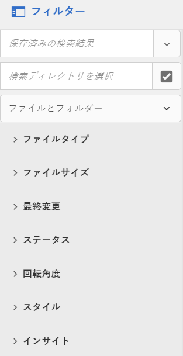

   検索する項目のタイプによって異なりますが、一致した数が検索結果の上部に表示されます。

   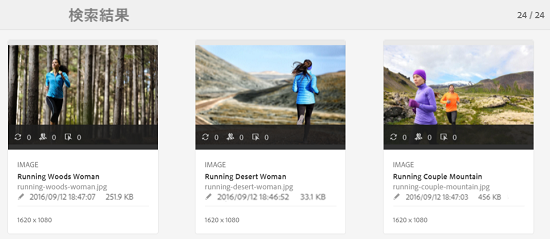

## ファイルタイプの検索 {#search-for-file-types}

フィルターパネルでは、より詳細に検索することが可能であり、検索機能の用途を拡大できます。必要な詳細レベルまで簡単にドリルダウンできます。

例えば、画像を検索する場合は、**[!UICONTROL ファイルタイプ]**&#x200B;述語を使用して、ビットマップ画像またはベクトル画像を選択します。

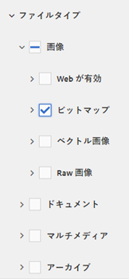

画像の MIME タイプを指定して、検索の範囲をさらに絞り込むことができます。

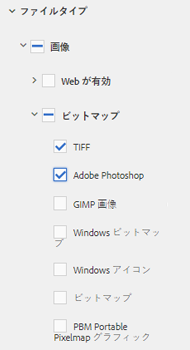

同様に、ドキュメントを検索する場合は、PDF や MS Word などの形式を指定できます。

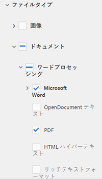

## ファイルサイズに基づく検索 {#search-based-on-file-size}

ファイルサイズに基づいてアセットを検索するには、**ファイルサイズ**&#x200B;述語を使用します。サイズ範囲の下限と上限を指定して、検索を絞り込むことができます。測定単位を指定することもできます（KB、MB など）。

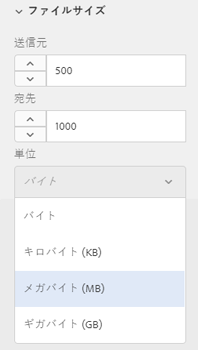

## アセットの最終変更日に基づく検索 {#search-based-on-when-assets-are-last-modified}

作業中のアセットを管理したり、レビューワークフローを監視したりする場合は、正確なタイムスタンプに基づいてアセットの最終変更日を検索できます。例えば、アセットが変更された前日または翌日を指定します。

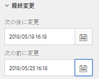

また、次のオプションを使用して、検索の精度を高めることもできます。

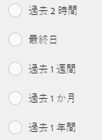

## ステータスに基づく検索 {#search-based-on-status}

様々なステータスのタイプ（公開、承認、チェックアウト、有効期限など）に基づいてアセットを検索するには、**ステータス**&#x200B;述語を使用します。

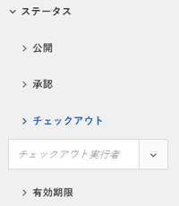

例えば、アセットの公開を監視する場合は、該当するオプションを使用して、公開されているアセットを検索できます。

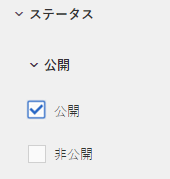

アセットのレビューステータスを監視する場合は、該当するオプションを使用して、承認されているアセットまたは承認待ちのアセットを検索します。

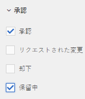

## インサイトデータに基づく検索 {#search-based-on-insights-data}

様々な Creative アプリから取得した使用状況の統計に基づいてアセットを検索するには、**インサイト**&#x200B;の述語を使用します。使用状況データは、次のカテゴリーの下にグループ化されます。

* 使用状況のスコア
* インプレッション数
* クリック
* アセットが表示されるメディアチャネル

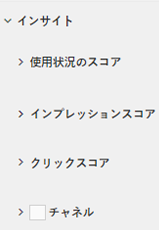
