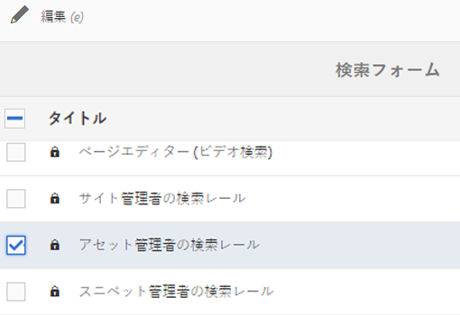
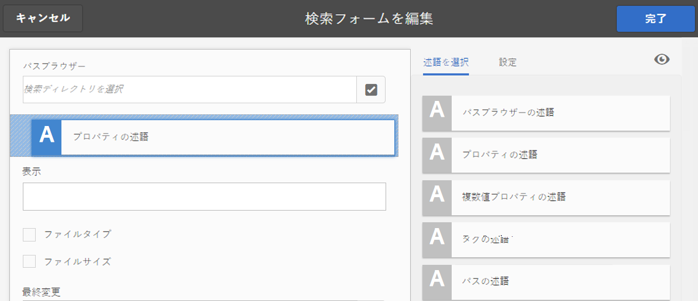
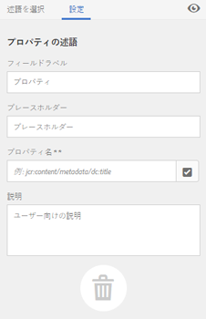
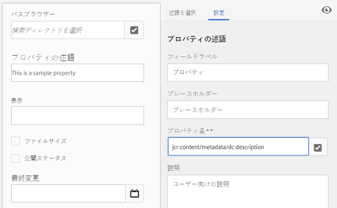
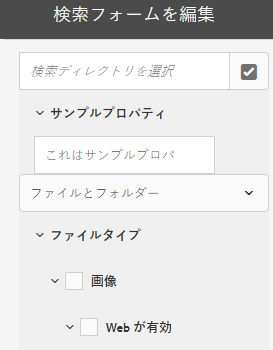
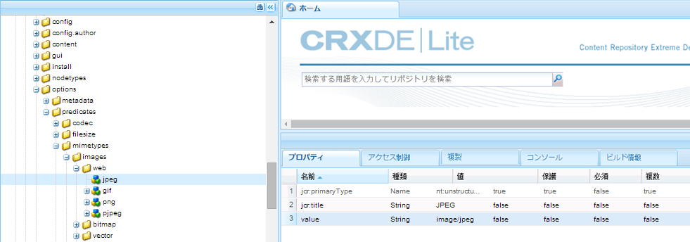
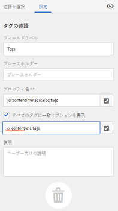
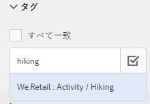

# 検索ファセット {#search-facets}

>[!CAUTION]
>
>AEM 6.4 の拡張サポートは終了し、このドキュメントは更新されなくなりました。 詳細は、 [技術サポート期間](https://helpx.adobe.com/jp/support/programs/eol-matrix.html). サポートされているバージョンを見つける [ここ](https://experienceleague.adobe.com/docs/?lang=ja).

AEM で検索ファセットを作成、変更および使用する方法について説明します。

Adobe Experience Manager (AEM) Assets の企業全体のデプロイメントには、多くのアセットが格納されています。AEMの汎用検索機能のみを使用する場合は、適切なアセットの検索が大変で時間がかかることがあります。

フィルターパネルの検索ファセットを使用すると、検索エクスペリエンスに精度を追加し、検索機能をより効率的で汎用性の高いものにできます。 検索ファセットには複数のディメンション（述語）が追加され、より複雑な検索を実行できます。 フィルターパネルには、いくつかの標準ファセットが含まれています。 また、カスタム検索ファセットを追加することもできます。

つまり、検索ファセットを使用すると、事前に決定された単一の分類上の順序ではなく、複数の方法でアセットを検索できます。目的の詳細レベルまで簡単にドリルダウンして、より焦点を絞った検索をおこなうことができます。

例えば、イメージを探している場合、ビットマップとベクトルイメージのどちらを選択できます。 画像の MIME タイプを指定することで、検索の範囲をさらに絞り込むことができます。 同様に、ドキュメントを検索する場合は、PDF や MS Word などの形式を指定できます。

## 述語の追加 {#adding-a-predicate}

フィルターパネルに表示される検索ファセットは、述語を使用した基盤となる検索フォームで定義されます。より多くのファセットや別のファセットを表示するには、述語をデフォルトフォームに追加するか、選択したファセットを含むカスタムフォームを使用します。

フルテキスト検索を行うには、フルテキストの述語をフォームに追加します。指定した 1 つのプロパティと一致するアセットを検索するには、プロパティの述語を使用します。 オプションの述語を使用すると、特定のプロパティの 1 つ以上の値と一致するアセットを検索できます。 日付範囲の述語を追加すると、指定した日付範囲で作成されたアセットを検索できます。

1. 次をタップまたはクリックします。 [!DNL Experience Manager] ロゴをクリックし、に移動します。 **[!UICONTROL ツール]** > **[!UICONTROL 一般]** > **[!UICONTROL 検索Forms]**.
1. 検索フォームページで、「**[!UICONTROL アセット管理者の検索レール]**」を選択し、「**編集**」 をタップします。

   

   アセット管理者の検索レールを探して選択

   >[!NOTE]
   >
   >事前設定済みの **アセット管理者の検索レール** 以前から [!DNL Experience Manager] バージョン：次の手順を実行します。
   > 
   >1. に移動します。 */conf/global/settings/dam/search/facets/assets/jcr:content/items* （CRX-DE 内）
   >1. を削除します。 **type** ノード。
   >1. パス */libs/settings/dam/search/facets/assets/jcr:content/items* から、ノード&#x200B;**アセット、ディレクトリ、typeor、excludepaths**、および **searchtype** を、手順 1 のパスにコピーします。
   >1. 変更を保存します。


1. 検索フォームを編集ページで、「**[!UICONTROL 述語を選択]**」タブからメインウィンドウに述語をドラッグします。例えば、「**[!UICONTROL プロパティの述語]**」をドラッグします。

   

   述語のドラッグ＆ドロップによる検索フィルターのカスタマイズ

1. 「設定」タブで、その述語のフィールドラベル、プレースホルダーテキストおよび説明を入力します。述語に関連付けるメタデータプロパティの有効な名前を指定します。

   「設定」タブのヘッダーラベルは、選択した述語のタイプを示します。

   

   「設定」タブを使用した述語の必須オプションの指定

1. 「**[!UICONTROL プロパティ名]**」フィールドで、述語に関連付けるメタデータプロパティの有効な名前を指定します。実行される検索に基づく名前です。例えば、`jcr:content/metadata/dc:description` や `./jcr:content/metadata/dc:description` を入力します。

   選択ダイアログから既存のノードを選択することもできます。

   

   「プロパティ名」フィールドでのメタデータプロパティと述語の関連付け

1. 「**[!UICONTROL プレビュー]**」をタップまたはクリックして、述語追加後のフィルターパネルの表示に関するプレビューを生成します。
1. プレビューモードで述語のレイアウトを確認します。

   

   変更送信前の検索フォームのプレビュー

1. プレビューを閉じるには、プレビューの右上隅にある「**[!UICONTROL 閉じる]**」 をタップまたはクリックします。
1. 「**[!UICONTROL 完了]**」をタップして、設定を保存します。
1. Assets ユーザーインターフェイスの検索パネルに移動します。プロパティの述語がパネルに追加されています。
1. 検索するアセットの説明をテキストボックスに入力します。例えば、&quot;Adobe&quot; と入力します。検索を実行すると、「Adobe」に一致する説明を含むアセットが検索結果に表示されます。

## オプションの述語の追加 {#adding-an-options-predicate}

オプションの述語を使用すると、フィルターパネルで複数の検索オプションを追加できます。 フィルターパネルでこれらのオプションを 1 つ以上選択して、アセットを検索できます。 例えば、ファイルタイプに基づいてアセットを検索するには、検索フォームで「画像」、「マルチメディア」、「ドキュメント」、「アーカイブ」などのオプションを設定します。 これらのオプションを設定後、フィルターパネルで「画像」オプションを選択すると、GIF、JPEG、PNG などのタイプのアセットに対して検索が実行されます。

オプションをそれぞれのプロパティにマップするには、オプション用のノード構造を作成し、「オプションの述語」の「プロパティ名」プロパティに親ノードのパスを指定します。親ノードのタイプは `sling`:`OrderedFolder` とする必要があります。オプションのタイプは `nt:unstructured` とする必要があります。オプションノードには、`jcr:title` プロパティと `value` プロパティを設定する必要があります。

`jcr:title` プロパティは、フィルターパネルに表示される、オプションのわかりやすい名前です。`value` フィールドは、指定されたプロパティと照合するためにクエリで使用されます。

オプションを選択すると、検索がオプションノードの `value` プロパティとその子ノード（存在する場合）に基づいて実行されます。オプションノード以下のツリー全体がトラバースされ、各子ノードの `value` プロパティが OR 演算子によって結合されて、検索クエリが作成されます。

例えば、ファイルタイプとして「画像」を選択した場合、アセットの検索クエリは OR 演算子によって `value` プロパティを結合することで作成されます。例として、画像の検索クエリは、プロパティ `jcr:content/metadata/dc:format` に対して *image/jpeg*、*image/gif*、*image/png*、*image/pjpeg*、*image/tiff* として一致する結果を OR 演算で結合することにより作成されます。



CRXDE に見られるように、ファイルタイプの値プロパティは、検索クエリを動作させるために使用されます。

CRX リポジトリーのオプションでノード構造を手動で作成する代わりに、対応するキーと値のペアを指定することで JSON ファイルでオプションを定義することもできます。JSON ファイルのパスを「**[!UICONTROL プロパティ名]**」フィールドに指定します。例えば、キーと値のペア `image/bmp`、`image/gif`、`image/jpeg`、`image/png` を定義し、次の JSON ファイルのサンプルに示すように、それらの値を指定します。「**[!UICONTROL プロパティ名]**」フィールドで、このファイルの CRX パスを指定できます。

```json
{
    "options" :
 [
          {"value" : "image/bmp","text" : "BMP"},
          {"value" : "image/gif","text" : "GIF"},
          {"value" : "image/jpeg","text" : "JPEG"},
          {"value" : "image/png","text" : "PNG"}
 ]
}
```

既存のノードを使用する場合は、選択ダイアログを使用して指定します。

>[!NOTE]
>
>オプションの述語は、求める動作を実行するためにプロパティの述語を組み合わせたカスタムのラッパーです。現時点で、この機能をネイティブにサポートする REST エンドポイントは存在しません。

1. 次をタップします。 [!DNL Experience Manager] ロゴをクリックし、に移動します。 **[!UICONTROL ツール/一般/検索Forms]**.
1. **[!UICONTROL 検索フォーム]**&#x200B;ページで、「**[!UICONTROL アセット管理者の検索レール]**」を選択し、「編集」アイコンをタップします。
1. **[!UICONTROL 検索フォームを編集]**&#x200B;ページで、「**[!UICONTROL 述語を選択]**」タブからメインウィンドウに&#x200B;**[!UICONTROL オプションの述語]**&#x200B;をドラッグします。
1. 「**[!UICONTROL 設定]**」タブで、プロパティのラベルと名前を入力します。例えば、アセットの形式に基づいてアセットを検索するには、ラベルに対してわかりやすい名前（例：**[!UICONTROL ファイルタイプ]**）を指定します。検索実行の基準となるプロパティをプロパティフィールドに指定します（例：`jcr:content/metadata/dc:format.`）。
1. 次のいずれかの操作を行います。

   * 「**[!UICONTROL プロパティ名]**」フィールドで、オプションのノードを定義する JSON ファイルのパスを指定し、対応するキーと値のペアを指定します。
   * タップ  「オプション」フィールドの横にある「表示テキスト」と「値」を使用して、フィルターパネルに入力するオプションの表示テキストと値を指定します。 別のオプションを追加するには、をタップまたはクリックします  をクリックし、手順を繰り返します。

1. ユーザーが一度に複数のファイルタイプのオプション（例：「画像」、「ドキュメント」、「マルチメディア」、「アーカイブ」）を選択可能にするには、「**[!UICONTROL 単一の選択]**」チェックボックスをオフにします。「**[!UICONTROL 単一の選択]**」をオンにすると、ユーザーは一度に 1 つのファイルタイプのオプション選択できます。

   

   オプションの述語で使用可能なフィールド

1. 「**説明**」フィールドに説明を任意で入力し、「**[!UICONTROL 完了]**」をクリックします。
1. 検索パネルに移動します。オプションの述語が&#x200B;**検索**&#x200B;パネルに追加されています。**[!UICONTROL ファイルタイプ]**&#x200B;のオプションがチェックボックスとして表示されます。

## 複数値プロパティの述語の追加 {#adding-a-multi-value-property-predicate}

複数値プロパティの述語を使用すると、複数の値でアセットを検索できます。に複数の製品の画像があるシナリオを考えてみましょう。 [!DNL Experience Manager] 各画像のアセットとメタデータには、製品に関連付けられた SKU 番号が含まれます。 この述語を利用すれば、複数の SKU 番号で製品の画像を検索できます。

1. [!DNL Experience Manager] ロゴをクリックし、**[!UICONTROL ツール]**／**[!UICONTROL 一般]**／**[!UICONTROL 検索フォーム]**&#x200B;に移動します。
1. 検索フォームページで、「**[!UICONTROL アセット管理者の検索レール]**」を選択し、「**編集**」 をタップします。
1. 検索フォームを編集ページで、「**[!UICONTROL 述語を選択]**」タブからメインウィンドウに&#x200B;**[!UICONTROL 複数値プロパティの述語]**&#x200B;をドラッグします。
1. 「**[!UICONTROL 設定]**」タブで、述語のラベルとプレースホルダーテキストを入力します。プロパティフィールドに検索したいプロパティ名を指定します（例：`jcr:content/metadata/dc:value`）。選択ダイアログを使用してノードを選択することもできます。
1. 「**[!UICONTROL 区切り文字サポート]**」が選択されていることを確認します。「**[!UICONTROL 入力区切り文字]**」フィールドで、それぞれの値を区切る文字を指定します。デフォルトでは、コンマが区切り文字に指定されています。別の区切り文字を指定できます。
1. 「**説明**」フィールドに説明を任意で入力し、「**[!UICONTROL 完了]**」をタップします。
1. Assets ユーザーインターフェイスのフィルターパネルに移動します。**[!UICONTROL 複数値プロパティ]**&#x200B;の述語がパネルに追加されています。
1. 「複数値」フィールドに複数の値を区切り文字で区切って指定し、検索を実行します。 述語は、指定した値と完全に一致するテキストを取得します。

## タグ用述語の追加 {#adding-a-tags-predicate}

タグの述語を使用すると、タグに基づいてアセットを検索できます。デフォルトでは、 [!DNL Experience Manager] Assets では、指定したタグに基づいて、1 つ以上のタグと一致するアセットを検索します。 つまり、検索クエリは、指定したタグを使用して OR 演算を実行します。 ただし、「すべてのタグを一致」オプションを使用して、指定したすべてのタグを含むアセットを検索することができます。

1. [!DNL Experience Manager] ロゴをクリックし、**[!UICONTROL ツール]**／**[!UICONTROL 一般]**／**[!UICONTROL 検索フォーム]**&#x200B;に移動します。
1. 検索フォームページで、「**[!UICONTROL アセット管理者の検索レール]**」を選択し、「**編集**」 をタップします。
1. 検索フォームを編集ページで、「**[!UICONTROL 述語を選択]**」タブからメインウィンドウにタグの述語をドラッグします。
1. 「設定」タブで、述語のプレースホルダーテキストを入力します。プロパティフィールドに検索したいプロパティ名を指定します（例：*jcr:content/metadata/cq:tags*）。または、選択ダイアログから CRXDE のノードを選択することもできます。
1. 「タグ」リストに様々なタグを入力するために、この述語の「ルートタグのパス」プロパティを設定します。
1. すべての指定したタグを含むアセットを検索するには、「**[!UICONTROL すべてのタグに一致オプションを表示]**」を選択します。

   

   タグの述語の一般的な設定

1. 「**[!UICONTROL 説明]**」フィールドに説明を任意で入力し、「**[!UICONTROL 完了]**」をクリックまたはタップします。
1. 検索パネルに移動します。**[!UICONTROL タグ]**&#x200B;の述語が検索パネルに追加されています。
1. アセットを検索するタグを指定するか、候補リストから選択します。

   

   タグの名前を入力する際にAEMが提供する提案

1. 選択 **[!UICONTROL すべて一致]** をクリックして、指定したすべてのタグを含む一致を検索します。

## その他の述語の追加 {#adding-other-predicates}

プロパティの述語やオプションの述語の追加と同様の手順で、検索パネルにその他の次の述語を追加できます。

| 述語名 | 説明 | プロパティ |
|---|---|---|
| [!UICONTROL フルテキスト] | アセットノード全体でフルテキスト検索を実行する検索用述語。jcr:contains 演算子でマッピングされます。アセットノードの特定の部分に対してフルテキスト検索を実行する場合は、相対パスを指定できます。 | <ul><li>ラベル</li><li>プレースホルダー</li><li>プロパティ名</li><li>説明</li></ul> |
| [!UICONTROL パスブラウザー] | 事前設定されたルートパスのフォルダーとサブフォルダーのアセットを検索するための検索用述語。 | <ul><li>プレースホルダー</li><li>ルートパス</li><li>説明</li></ul> |
| [!UICONTROL パス] | 場所の結果をフィルタリングする場合に使用します。 オプションとして様々なパスを指定できます。 | <ul><li>ラベル</li><li>パス</li><li>説明</li></ul> |
| [!UICONTROL 公開ステータス] | 公開ステータスに基づいてアセットを検索するための検索用述語。 | <ul><li>ラベル</li><li>プロパティ名</li><li>説明</li></ul> |
| [!UICONTROL 相対的な日付] | アセットの相対的な作成日に基づいてアセットを検索するための検索用述語。例えば、2 か月前、3 週間前などのようにオプションを設定できます。 | <ul><li>ラベル</li><li>プロパティ名</li><li>相対的な日付</li></ul> |
| [!UICONTROL 範囲] | 指定した範囲内にあるアセットを検索するための検索用述語。 検索パネルで、範囲の最小値と最大値を指定できます。 | <ul><li>ラベル</li><li>プロパティ名</li><li>説明</li></ul> |
| [!UICONTROL 日付の範囲] | 指定した日付プロパティの範囲内で作成されたアセットを検索するための検索用述語。検索パネルで、日付選択機能を使用して開始日と終了日を指定できます。 | <ul><li>ラベル</li><li>プレースホルダー</li><li>プロパティ名</li><li>範囲テキスト (開始)</li><li>範囲テキスト (終了)</li><li>説明</li></ul> |
| [!UICONTROL 日付] | 日付プロパティに基づいて、スライダーを使用してアセットを検索するための検索用述語。 | <ul><li>ラベル</li><li>プロパティ名</li><li>説明</li></ul> |
| [!UICONTROL ファイルサイズ] | サイズに基づいてアセットを検索するための検索用述語。スライダーベースの述語で、設定可能なノードからスライダーオプションを選択します。 デフォルトのオプションは、CRX リポジトリーの /libs/dam/options/predicates/filesize で定義されています。ファイルサイズはバイト単位で指定します。 | <ul><li>ラベル</li><li>プロパティ名</li><li>パス</li><li>説明</li></ul> |
| [!UICONTROL 最終変更アセット] | 最近変更されたアセットを検索するための検索用述語。 | <ul><li>プロパティ名</li><li>プロパティ値</li><li>説明</li></ul> |
| [!UICONTROL 公開ステータス] | 公開ステータスに基づいてアセットを検索するための検索用述語。 | <ul><li>ラベル</li><li>プロパティ名</li><li>説明</li></ul> |
| [!UICONTROL レーティング] | 平均評価に基づいてアセットを検索するための検索用述語。 | <ul><li>ラベル</li><li>プロパティ名</li><li>オプションのパス</li><li>説明</li></ul> |
| [!UICONTROL 有効期限ステータス] | 有効期限に基づいてアセットを検索するための検索用述語。 | <ul><li>ラベル</li><li>プロパティ名</li><li>説明</li></ul> |
| [!UICONTROL 非表示] | アセットを検索するための非表示フィールドプロパティを定義する検索用述語。 | <ul><li>プロパティ名</li><li>プロパティ値</li><li>説明</li></ul> |

## デフォルトの検索ファセットの復元 {#restoring-default-search-facets}

デフォルトでは、ロックアイコンは&#x200B;**[!UICONTROL 検索フォーム]**&#x200B;ページの「**[!UICONTROL アセット管理者の検索レール]**」の前に表示されます。フォームに検索ファセットを追加した場合、ロックアイコンが表示されなくなります。これはデフォルトのフォームが変更されたことを示します。


検索フォームページのオプションに対するロックアイコンは、デフォルト設定がそのままになっており、カスタマイズされていないことを示します。

デフォルトの検索ファセットを復元するには、次の手順を実行します。

1. **[!UICONTROL 検索フォーム]**&#x200B;ページで「**[!UICONTROL アセット管理者の検索レール]**」を選択します。
1. タップ **[!UICONTROL 削除]**  」と入力します。
1. 確認ダイアログで、「**[!UICONTROL 削除]**」をタップして、カスタムの変更を削除します。

   検索ファセットへのカスタムの変更を削除すると、**[!UICONTROL 検索フォーム]**&#x200B;ページの「**[!UICONTROL アセット管理者の検索レール]**」の前にロックアイコンが再び表示されるようになります。

## ユーザーの権限 {#user-permissions}

管理者のロールが割り当てられていない場合に、検索ファセットに関連する編集、削除およびプレビューアクションを実行するために必要な権限を次に示します。

| アクション | 権限 |
|---|---|
| [!UICONTROL 編集] | CRX の/apps ノードに対する読み取りおよび書き込み権限 |
| [!UICONTROL 削除] | CRX の/apps ノードに対する読み取り、書き込みおよび削除権限 |
| [!UICONTROL プレビュー] | CRX の/var/dam/content ノードに対する読み取り、書き込みおよび削除権限。 また、/apps ノードの読み取りおよび書き込み権限。 |

>[!MORELIKETHIS]
>
>* [Assets の検索機能の拡張](searchx.md)
>* [アセットの検索](search-assets.md)
>* [ビデオアセットの検索](search-video-assets.md)

