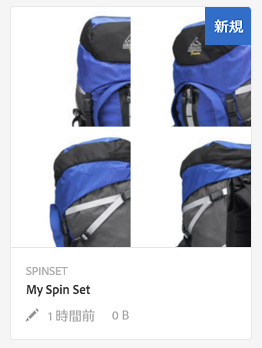
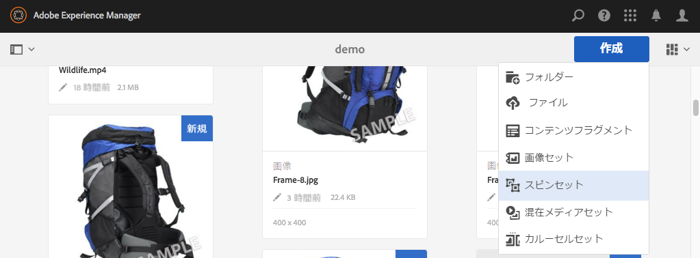
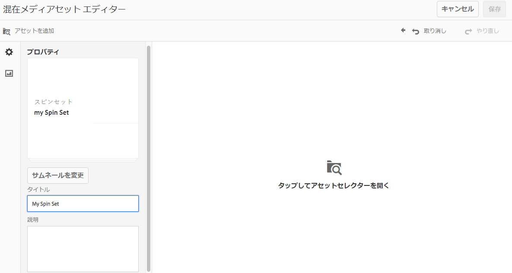
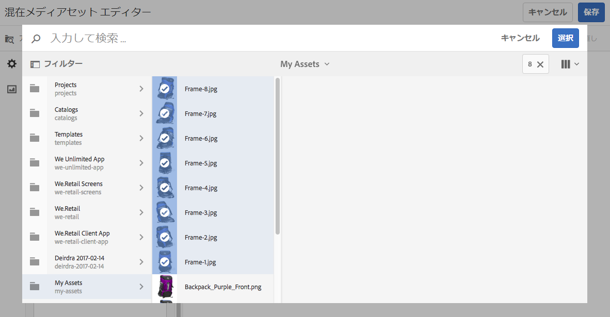
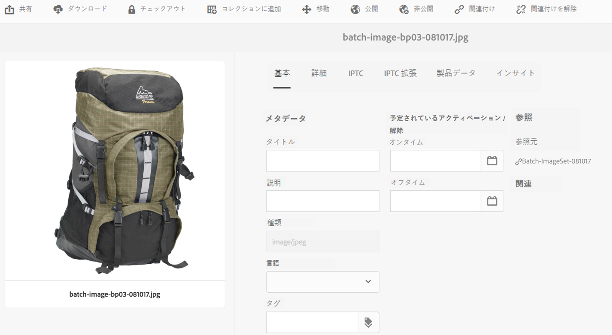

# スピンセット {#spin-sets}

スピンセットは、物体を回転させて調べるという現実世界の操作をシミュレートしたものです。スピンセットによって、あらゆる角度からアイテムを表示して、あらゆる角度から重要な細部を目で確認できます。

スピンセットは、360 度の閲覧エクスペリエンスをシミュレートします。Dynamic Media は、ビューアがアイテムを回転できる単一軸のスピンセットを提供します。さらに、ユーザーは「自由形式」のズームを実行し、マウスを数回クリックするだけで任意のビューをパンできます。このようにして、ユーザーは特定の視点からより詳しくアイテムを調べることができます。

スピンセットのバナーには、「**[!UICONTROL SPINSET]**」と表示されます。また、スピンセットが公開されている場合、公開日が&#x200B;**[!UICONTROL 地球]**&#x200B;アイコン付きでバナーに表示され、最終変更日も&#x200B;**[!UICONTROL 鉛筆]**&#x200B;アイコン付きで表示されます。

>[!NOTE]
>
>アセットユーザーインターフェイスについて詳しくは、[タッチ UI を使用したアセットの管理](managing-assets-touch-ui.md)を参照してください。

## クイックスタート：スピンセット {#quick-start-spin-sets}

スピンセットをすばやく習得するには、次のワークフローに従います。

1. [複数ビュー用の画像をアップロードします。](#uploading-assets-for-spin-sets)

   アイテムの写真は最低でも、1 次元スピンセットで 8～12 個、2 次元スピンセットで 16～24 個必要になります。アイテムが回転および反転している印象を与えるためには、写真を一定の間隔で撮影する必要があります。例えば、1 次元スピンセットに 12 個の写真を含める場合、写真を撮影するごとに 30 度ずつ（360/12）アイテムを回転します。

1. [スピンセットを作成します。](#creating-spin-sets)

   スピンセットを作成するには、**[!UICONTROL 作成/スピンセット]**&#x200B;を選択し、セットに名前を付け、アセットを選択して、画像を表示される順に並べ替えます。

   [セレクターの操作](working-with-selectors.md)を参照してください。

   >[!NOTE]
   >
   >また、[バッチセットプリセット](/help/assets/config-dms7.md#creating-batch-set-presets-to-auto-generate-image-sets-and-spin-sets)を使用して、スピンセットを自動的に作成することもできます。
   >
   >*バッチセットは、アセット取り込みの一環としてIPS(Image Production System)によって作成され、Dynamic Media-Scene7モードでのみ使用できます*。

1. 必要に応じて[スピンセットビューアプリセット](managing-viewer-presets.md)を設定します。

   管理者は、スピンセットビューアのプリセットを作成または変更できます。 ビューアプリセットを使用してスピンセットを表示するには、スピンセットを選択し、左側のパネルのドロップダウンメニューで「**[!UICONTROL ビューア]**」を選択します。

   **[!UICONTROL ツール／アセット／ビューアプリセット]**&#x200B;を選択して、ビューアプリセットを作成または編集します。

   詳しくは、[ビューアプリセットの追加と編集](managing-viewer-presets.md)を参照してください。

1. [スピンセットを表示します。](#viewing-spin-sets)

   バッチセットプリセットを使用して作成したセットを表示したり、それらのセットにアクセスしたりするには、3 つの方法があります（バッチセットプリセットを使用して作成したセットは、ユーザーインターフェイスに表示&#x200B;*されません*）。

1. [スピンセットをプレビューします。](previewing-assets.md)

   スピンセットを選択すると、プレビューできます。スピンセットを回転します。**[!UICONTROL ビューア]**&#x200B;メニューから様々なビューアを選択できます。このメニューは左側のレールのドロップダウンメニューにあります。

1. [スピンセットを公開します。](publishing-dynamicmedia-assets.md)

   スピンセットを公開すると、スピンセット内の画像の表示順序がアクティブになります。 スピンがスムーズに 360 度のビューを描けるように画像を並べてください。**** URLと **** 埋め込み文字列。また、[ビューアプリセットを公開](managing-viewer-presets.md)する必要があります。

1. [URL を Web アプリケーションにリンクする](linking-urls-to-yourwebapplication.md)か、[ビデオビューアまたは画像ビューアを埋め込みます](embed-code.md)。

   スピンセットを公開すると、AEM AssetsはスピンセットのURL呼び出しを作成し、アクティブにします。これらのURLは、アセットをプレビューするときにコピーできます。または、それらをWebサイトに埋め込むこともできます。

   スピンセットを選択し、左側のレールのドロップダウンメニューで「**[!UICONTROL ビューア]**」を選択します。

   詳しくは、[Web ページへのスピンセットのリンク](linking-urls-to-yourwebapplication.md)と[ビデオビューアまたは画像ビューアの埋め込み](embed-code.md)を参照してください。

必要に応じて、スピンセット[を](#editing-spin-sets)編集できます。 さらに、[スピンセットのプロパティ](managing-assets-touch-ui.md#editing-properties)を表示して編集することもできます。

## スピンセット用のアセットのアップロード {#uploading-assets-for-spin-sets}

アイテムの写真は最低でも、1 次元スピンセットで 8～12 個、2 次元スピンセットで 16～24 個必要になります。アイテムが回転および反転している印象を与えるためには、写真を一定の間隔で撮影する必要があります。例えば、1 次元スピンセットに 12 個の写真を含める場合、写真を撮影するごとに 30 度ずつ（360/12）アイテムを回転します。

スピンセット用の画像のアップロードは、[AEM Assets での他のアセットのアップロード](managing-assets-touch-ui.md)と同様に実行できます。

### スピンセット画像の撮影に関するガイドライン {#guidelines-for-shooting-spin-set-images}

ここでは、スピンセット画像に関するベストプラクティスを説明します。一般に、スピンセット内の画像が多いほど、画像のスピン効果が向上します。ただし、セット内に多くの画像を追加すると、画像の読み込みにかかる時間も長くなります。AEM では、スピンセットで使用する画像の撮影について、次のガイドラインに従うことを推奨します。

* 最低でも、1 次元スピンセットで 8～12 個、2 次元スピンセットで 16～24 個の画像を使用するようにします。360 度回転できるようにするには、最小で 8 個の画像が必要になります。2 次元スピンセットの作成には多大な労力がかかるので、1 次元スピンセットのほうが一般的です。
* 可逆圧縮形式を使用します。TIFF および PNG が推奨されます。
* 真っ白または他の高コントラストの背景上にアイテムが表示されるように、すべての画像をマスクします。オプションで、シャドウを追加します。
* 製品の細部に十分に光を当て、ピントを合わせるようにします。
* ファッション衣料の場合は、マネキンやモデルに着せてスピン画像を撮影します。多くの場合、ガラス製のマネキンを使用してマネキンを完全にマスクするか、画像内に定型化されたマネキンを表示します。角度を定義することで、モデルによるスピンセットを作成できます。床にテープを貼って角度をマークし、モデルが撮影ごとに動いて向きを変えるための手助けをします。

## スピンセットの作成  {#creating-spin-sets}

スピンセット内での画像の表示順は重要です。スピンがスムーズに 360 度のビューを描けるように画像を並べてください。

>[!NOTE]
>
>[バッチセットプリセット](/help/assets/config-dms7.md#creating-batch-set-presets-to-auto-generate-image-sets-and-spin-sets)を使用してスピンセットを自動的に作成することもできます。
>
>バッチセットは、アセット取り込みの一環としてIPS(Image Production System)によって作成され、Dynamic Media-Scene7モードでのみ使用できます。
>
>[Dynamic Media - Scene7 モードの設定](/help/assets/config-dms7.md#creating-batch-set-presets-to-auto-generate-image-sets-and-spin-sets)の「画像セットおよびスピンセットを自動生成するためのバッチセットプリセットの作成」を参照してください。

**スピンセットを作成するには:**

1. アセットで、スピンセットを作成する場所に移動し、「**[!UICONTROL 作成]**」をタップし、「**[!UICONTROL スピンセット]**」を選択します。 アセットを格納しているフォルダー内からセットを作成することもできます。

   

1. **[!UICONTROL スピンセットエディター]**&#x200B;ページの&#x200B;**[!UICONTROL タイトル]**&#x200B;フィールドにスピンセットの名前を入力します。 この名前は、スピンセット全般のバナーに表示されます。オプションで、説明を入力します。

   

   スピンセットを作成する場合は、スピンセットのサムネールを変更するか、AEMがスピンセット内のアセットに基づいて自動的にサムネールを選択できるようにします。 サムネールを選択するには、**[!UICONTROL サムネールを変更]**&#x200B;をタップします。任意の画像を選択します（他のフォルダーに移動して画像を検索することもできます）。 サムネールを選択した状態で、スピンセットからサムネールを自動的に生成する場合は、「**[!UICONTROL 自動サムネールに切り替え]**」を選択します。

1. 次のいずれかの操作をおこないます。

   * **[!UICONTROL スピンセットエディター]**&#x200B;ページの左上隅近くにある「**[!UICONTROL 追加アセット]**」をタップします。
   * **[!UICONTROL スピンセットエディター]**&#x200B;ページの中央近くで、**[!UICONTROL タップしてアセットセレクター]**&#x200B;を開きます。

   スピンセットに含めるアセットをタップして選択しします。選択済みのアセットにはチェックマークアイコンが付いています。作業が完了したら、ページの右上隅付近にある「**[!UICONTROL 選択]**」をタップします。

   アセットセレクターでは、キーワードを入力して **[!UICONTROL Enter]** キーをタップすることで、アセットを検索することができます。フィルターを適用して、検索結果を絞り込むこともできます。パス、コレクション、ファイルタイプおよびタグでフィルタリングできます。フィルターを選択してから、ツールバーの&#x200B;**[!UICONTROL フィルター]**&#x200B;アイコンをタップします。表示を変更するには、ページの右上隅近くにある&#x200B;**[!UICONTROL 表示]**&#x200B;アイコンをタップし、**[!UICONTROL 列表示]**、**[!UICONTROL カード表示]**&#x200B;または&#x200B;**[!UICONTROL リスト表示]**&#x200B;をタップします。

   [セレクターの操作](working-with-selectors.md)を参照してください。

   

1. 画像セットに追加したアセットは、自動的に英数字順で追加されます。追加後に、手動でアセットの順番を変更したり、並べ替えたりすることができます。必要に応じて、アセットの&#x200B;**[!UICONTROL 並べ替え]**&#x200B;アイコンをアセットのファイル名の右側にドラッグして、設定リストの上下に画像の並べ替えを行います。

   

1. （オプション）次のいずれかの操作をおこないます。

   * 画像を削除するには、画像を選択し、「**[!UICONTROL アセットを削除]**」をタップします。
   * ページの右上隅付近にプリセットを適用するには、「**[!UICONTROL プリセット]**」をタップした後、すべてのアセットに一度に適用するプリセットを選択します。

1. 「**[!UICONTROL 保存]**」をタップします。新しく作成したスピンセットは、作成元のフォルダに表示されます。

## スピンセットの表示 {#viewing-spin-sets}

スピンセットは、ユーザーインターフェイスで作成することも、[バッチセットプリセット](/help/assets/config-dms7.md#creating-batch-set-presets-to-auto-generate-image-sets-and-spin-sets)を使用して自動的に作成することもできます。ただし、バッチセットプリセットを使用して作成したセットは、ユーザーインターフェイスに表示&#x200B;*されません*。バッチセットプリセットを使用して作成されたセットには、3つの方法でアクセスできます。 （これらの方法は、ユーザインターフェイスでスピンセットを作成した場合でも使用できます）。

[スピンセットの編集](#editing-spin-sets)の説明に従って、ユーザーインターフェイスを使用してセットを表示することもできます。

**スピンセットを表示するには:**

1. 個々のアセットのプロパティを開きます。（「**[!UICONTROL セットのメンバー]**」の下に）選択したアセットがメンバーとして含まれるセットが表示されます。セット全体を表示するには、セット名をタップします。

   

1. 任意のセットのメンバー画像で、**[!UICONTROL セット]**&#x200B;メニューを選択して、アセットがメンバーとして含まれているセットを表示します。

   

1. 検索で&#x200B;**[!UICONTROL フィルター]**&#x200B;を選択し、**[!UICONTROL Dynamic Media]**&#x200B;を展開して、**[!UICONTROL セット]**&#x200B;を選択します。

   ユーザインターフェイスで手動で作成したか、バッチセットプリセットを使用して自動的に作成した一致セットが返されます。 自動セットの場合、検索クエリは、**[!UICONTROL 「]**&#x200B;を含む」検索条件を使用したAEM検索とは異なる&#x200B;**[!UICONTROL 検索条件を持つ]**&#x200B;開始を使用して実行されます。 フィルターを「**[!UICONTROL セット]**」に設定するのが、自動セットを検索する唯一の方法です。

   

## スピンセットの編集 {#editing-spin-sets}

スピンセットには、次のような様々な編集タスクを実行できます。

* スピンセットへの画像の追加
* スピンセット内の画像の並べ替え
* スピンセットのアセットの削除
* ビューアプリセットの適用
* スピンセットの削除

**スピンセットを編集するには:**

1. 次のいずれかの操作をおこないます。

   * スピンセットアセット上にマウスポインターを置き、**[!UICONTROL 編集]**（鉛筆アイコン）をタップします。
   * スピンセットアセット上にマウスポインターを置き、**[!UICONTROL 選択]**（チェックマークアイコン）をタップした後、ツールバーの「**[!UICONTROL 編集]**」をタップします。
   * スピンセットアセットをタップしてから、ツールバーの&#x200B;**[!UICONTROL 編集]**（鉛筆アイコン）をタップします。

1. スピンセットを編集するには、次のいずれかの操作をおこないます。

   * 画像を並べ替えるには、画像を新しい位置までドラッグします（並べ替えアイコンを選択して項目を移動します）。
   * 項目を昇順または降順で並べ替えるには、列見出しをタップします。
   * アセットを追加するか、既存のアセットを更新するには、「**[!UICONTROL 追加アセット]**」をタップします。 アセットに移動して選択し、右上隅の「**[!UICONTROL 選択]**」をタップします。AEM でサムネール用に使用されている画像を別の画像に置き換えて削除しても、元のアセットは表示されたままになります。
   * アセットを削除するには、アセットを選択し、「**[!UICONTROL アセットを削除]**」をタップします。
   * プリセットを適用するには、**[!UICONTROL プリセット]**&#x200B;アイコンをタップし、プリセットを選択します。
   * スピンセット全体を削除するには、スピンセットに移動して選択し、「**[!UICONTROL 削除]**」を選択します

      >[!NOTE]
      >* スピンセット内の画像を編集するには、セットに移動し、左のレールで「**[!UICONTROL メンバーを設定]**」をタップし、次に個々のアセットで「**[!UICONTROL 編集]**」（鉛筆アイコン）をタップして編集ウィンドウを開きます。

1. 編集が完了したら、「**[!UICONTROL 保存]**」をクリックします。

## スピンセットのプレビュー  {#previewing-spin-sets}

詳しくは、[アセットのプレビュー](previewing-assets.md)を参照してください。

## スピンセットの公開  {#publishing-spin-sets}

[アセットの公開](publishing-dynamicmedia-assets.md)を参照してください。
