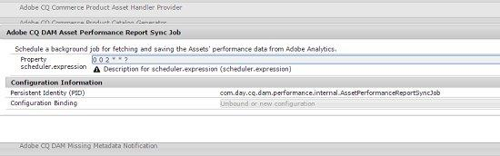

# アセットインサイト {#asset-insights}

アセットインサイト機能を使用して、サードパーティの Web サイト、マーケティングキャンペーン、Adobeのクリエイティブソリューションで使用されるアセットのユーザーの評価と使用状況統計を追跡する方法について説明します。

アセットインサイト機能を使用すると、サードパーティの Web サイト、マーケティングキャンペーン、Adobeのクリエイティブソリューションで使用されるアセットのユーザーの評価と使用状況統計を追跡し、パフォーマンスと人気に関するインサイトを導き出すことができます。

アセットインサイトでは、アセットの評価回数、クリック数、インプレッション数（アセットが Web サイトに読み込まれた回数）など、ユーザーのアクティビティの詳細を取得します。これらの統計情報に基づいてアセットにスコアを割り当てます。スコアとパフォーマンス統計を使用して、人気が高いアセットをカタログやマーケティングキャンペーンなどに含めるために選ぶことができます。このような統計に基づいて、アセットのアーカイブやライセンスの更新ポリシーを策定することさえできます。

アセットインサイトがアセットの使用状況統計を Web サイトから取得するためには、アセットの埋め込みコードを Web サイトのコードに組み込む必要があります。

アセットインサイトでアセットの使用状況統計を表示できるようにするには、最初に [!DNL Adobe Analytics] からのレポートデータをフェッチするようにこの機能を設定します。詳しくは、[アセットインサイトの設定](touch-ui-configuring-asset-insights.md)を参照してください。オンプレミスのインストールでこの機能を使用するには、を購入します。 [!DNL Adobe Analytics] 別途ライセンスします。 のお客様 [!DNL Managed Services] 受信 [!DNL Analytics] ～に付随するライセンス [!DNL Experience Manager]. 詳しくは、 [Managed Services製品説明](https://helpx.adobe.com/legal/product-descriptions/adobe-experience-manager-managed-services.html).

>[!NOTE]
>
>インサイトは画像に対してのみサポートされており、提供されています。

## アセットの統計の表示 {#viewing-statistics-for-an-asset}

メタデータページでアセットインサイトのスコアを確認できます。

1. Assets ユーザーインターフェイス（UI）から、アセットを選択し、ツールバーの「**[!UICONTROL プロパティ]**」アイコンをタップまたはクリックします。
1. プロパティページで、「**[!UICONTROL インサイト]**」タブをタップまたはクリックします。
1. 「**[!UICONTROL インサイト]**」タブで、アセットの使用状況の詳細を確認します。「**[!UICONTROL スコア]**」セクションには、アセットの全体的な使用状況とパフォーマンスのスコアが表示されます。

   使用状況のスコアは、アセットが様々なソリューションで使用された回数です。

   「**[!UICONTROL インプレッション数]**」のスコアは、アセットが Web サイトに読み込まれた回数です。「**[!UICONTROL クリック数]**」の下に表示される数値は、アセットがクリックされた回数です。

1. 「**[!UICONTROL 使用状況の統計]**」セクションを見て、アセットが含まれているエンティティや最近使用されたクリエイティブソリューションを確認します。使用率が高いほど、ユーザーの間で人気のあるアセットであることを意味します。使用状況データは、次の見出しの下に表示されます。

   * **[!UICONTROL アセット]**：アセットが、コレクションまたは複合アセットに含まれた回数
   * **[!UICONTROL Web およびモバイル]**：アセットが Web サイトまたはアプリに含まれた回数
   * **[!UICONTROL ソーシャル]**：アセットが Adobe Social や Adobe Campaign などのソリューションで使用された回数
   * **[!UICONTROL 電子メール]**：アセットが電子メールキャンペーンで使用された回数

   

   >[!NOTE]
   >
   >アセットインサイト機能は、 [!DNL Adobe Analytics] 定期的に、「ソリューション」セクションには最新のデータが表示されない場合があります。 データが表示される期間は、Assets Insights が取得する取得操作のスケジュールによって異なります [!DNL Analytics] データ。

1. 特定の期間のアセットのパフォーマンス統計をグラフィカルに表示するには、「**[!UICONTROL パフォーマンス統計]**」セクションで期間を選択します。クリック数やインプレッション数などの詳細がグラフの傾向線として表示されます。

   

   >[!NOTE]
   >
   >「ソリューション」セクションのデータとは異なり、「パフォーマンス統計」セクションには最新のデータが表示されます。

1. パフォーマンスデータを得るために Web サイトに組み込んだアセットの埋め込みコードを取得するには、アセットのサムネールの下の「**[!UICONTROL 埋め込みコードの取得]**」をクリックします。サードパーティの Web ページに埋め込みコードを組み込む方法について詳しくは、 [Web ページでのページトラッカーと埋め込みコードの使用](touch-ui-using-page-tracker.md).

   

## アセットの集計統計の表示 {#viewing-aggregate-statistics-for-assets}

**[!UICONTROL インサイト表示]**&#x200B;を使用すると、フォルダー内のすべてのアセットのスコアを同時に表示できます。

1. Assets UI で、インサイトを表示するアセットを含むフォルダーに移動します。
1. ツールバーの「レイアウト」アイコンをタップまたはクリックして、「**[!UICONTROL インサイト表示]**」オプションを選択します。
1. このページには、アセットの使用状況スコアが表示されます。様々なアセットのレーティングを比較して、洞察を導きます。

## バックグラウンドジョブのスケジュール設定 {#scheduling-background-job}

アセットインサイトは、Adobe Analyticsレポートスイートからアセットの使用状況データを定期的に取得します。 デフォルトでは、Assets Insights は、24 時間おきの午前 2 時にバックグラウンドジョブを実行してデータを取得します。 この間隔と時刻は、「**[!UICONTROL Adobe CQ DAM Asset Performance Report Sync Job]**」サービスを Web コンソールで設定して変更できます。

1. 次をタップします。 [!DNL Experience Manager] ロゴをクリックし、に移動します。 **[!UICONTROL ツール/操作/ Web コンソール]**.
1. **[!UICONTROL Adobe CQ DAM Asset Performance Report Sync Job]** サービス設定を開きます。

   

1. プロパティスケジューラーの式にスケジューラーの目的の頻度とジョブの開始時間を指定します。変更内容を保存します。
