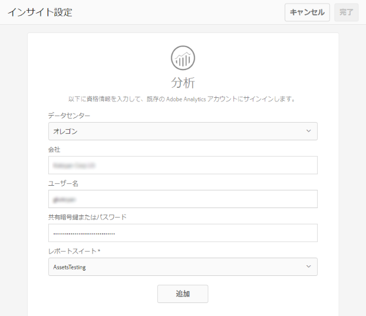

# アセットインサイトの設定 {#configuring-asset-insights}

Adobe Experience Manager（AEM）Assets は、サードパーティの Web サイトで使用される AEM アセットに関する使用状況データを Adobe Analytics からフェッチします。アセットインサイトでこのようなデータを取得して洞察を得るためには、最初に Adobe Analytics と統合するようにこの機能を設定します。

>[!NOTE]
>
>インサイトのサポートおよび提供がおこなわれるのは、画像に対してのみです。

1. AEM で&#x200B;**[!UICONTROL ツール／アセット]**&#x200B;をクリックします。

   

1. 「**[!UICONTROL インサイト設定]**」カードをクリックします。
1. ウィザードで、データセンターを選択し、会社名、ユーザー名、パスワードなどの資格情報を指定します。

   

1. 「**[!UICONTROL 認証]**」をクリックまたはタップします。
1. AEM によって資格情報が認証されたら、**[!UICONTROL レポートスイート]**&#x200B;リストから、アセットインサイトでデータをフェッチする Adobe Analytics レポートスイートを選択します。「**[!UICONTROL 追加]**」をクリックします。
1. AEMでレポートスイートを設定したら、「**[!UICONTROL 完了]**」をクリックまたはタップします。

## ページトラッカー {#page-tracker}

 Analytics アカウントを設定すると、ページトラッカーコードが生成されます。サードパーティの Web サイトで使用される AEM アセットをアセットインサイトで追跡できるようにするには、Web サイトコードにトラッカーコードを組み込みます。AEM Assets のページトラッカーユーティリティを使用してページトラッカーコードを生成してください。サードパーティの Web サイトにページトラッカーコードを組み込む方法について詳しくは、[Web ページでのページトラッカーと埋め込みコードの使用](touch-ui-using-page-tracker.md)を参照してください。

1. AEMで、**[!UICONTROL ツール/アセット]**&#x200B;をクリックします。

   

1. **[!UICONTROL ナビゲーション]**&#x200B;ページで、「**[!UICONTROL インサイトページトラッカー]**」カードをクリックします。
1. **[!UICONTROL ダウンロード]**&#x200B;アイコンをクリックしてページトラッカーコードをダウンロードします。