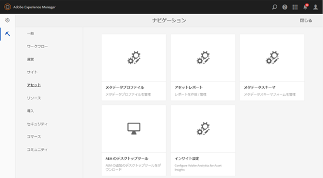

# アセットインサイトの設定 {#configuring-asset-insights}

Adobe Experience Manager Assets が [!DNL Experience Manager] Adobe Analyticsのサードパーティ Web サイトで使用されるアセット。 アセットインサイトでこのデータを取得してインサイトを生成できるようにするには、まずAdobe Analyticsと統合する機能を設定します。

>[!NOTE]
>
>インサイトのサポートおよび提供が行われるのは、画像に対してのみです。

1. AEM で&#x200B;**[!UICONTROL ツール／アセット]**&#x200B;をクリックします。

   

1. 「**[!UICONTROL インサイト設定]**」カードをクリックします。
1. ウィザードで、データセンターを選択し、会社名、ユーザー名、パスワードなどの資格情報を指定します。

   

1. 「**[!UICONTROL 認証]**」をクリックまたはタップします。
1. [!DNL Experience Manager] によって資格情報が認証されたら、**[!UICONTROL レポートスイート]**&#x200B;リストから、アセットインサイトでデータをフェッチする Adobe Analytics レポートスイートを選択します。「**[!UICONTROL 追加]**」をクリックします。
1. 後 [!DNL Experience Manager] レポートスイートを設定し、 **[!UICONTROL 完了]**.

## ページトラッカー {#page-tracker}

 Analytics アカウントを設定すると、ページトラッカーコードが生成されます。アセットインサイトでの追跡を有効にするには [!DNL Experience Manager] サードパーティの Web サイトで使用されるアセットの場合は、Web サイトコードにページトラッカーコードを含めます。 でのページトラッカーユーティリティの使用 [!DNL Experience Manager] ページトラッカーコードを生成するアセット。 サードパーティの Web サイトにページトラッカーコードを組み込む方法について詳しくは、[Web ページでのページトラッカーと埋め込みコードの使用](touch-ui-using-page-tracker.md)を参照してください。

1. AEMで、 **[!UICONTROL ツール/アセット]**.

   

1. **[!UICONTROL ナビゲーション]**&#x200B;ページで、「**[!UICONTROL インサイトページトラッカー]**」カードをクリックします。
1. **[!UICONTROL ダウンロード]**&#x200B;アイコンをクリックしてページトラッカーコードをダウンロードします。
