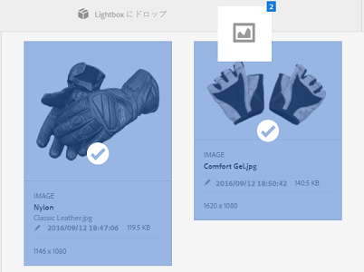

# Lightbox {#lightbox}

AEM Assets の Lightbox について学習します。

Lightbox は、アセットに容易にアクセスするための特別なタイプのコレクションです。Lightbox にすぐにアクセスして、アセットを追加または削除できます。Lightbox は、個人用の画像ギャラリーとして使用することができます。

Adobe Experience Manager（AEM）Assets のユーザーである場合、Lightbox は、アプリケーションに最初にログインしたときに自動的に作成されます。この Lightbox は自分専用です。他のユーザーはこの Lightbox にアクセスできません。

## Lightbox へのアセットの追加  {#adding-assets-to-lightbox}

1. Assets のユーザーインターフェイスで、Lightbox に追加するアセットを選択します。
1. アセットを **[!UICONTROL Lightbox にドロップ]**&#x200B;ゾーンにドラッグします。ドロップゾーンがアクティブになり、ラベルが「**[!UICONTROL ドロップして追加]**」に変わったらアセットを放します。

   

1. ダイアログで「**[!UICONTROL 追加]**」をタップまたはクリックし、ダイアログを閉じてプロセスを完了します。選択したアセットが Lightbox に追加されます。
1. Lightbox を表示するには、コレクションコンソールに移動します。
1. 「**[!UICONTROL Lightbox]**」をタップまたはクリックして、その中のアセットを表示します。

   >[!NOTE]
   >
   >Lightbox はコレクションに似ていますが、コレクションに対して通常実行するすべてのアクションを実行できるわけではありません。例えば、Lightbox の設定を削除、共有または表示することはできません。また、Lightbox を他のコレクションに追加することはできません。ただし、Lightbox 内のアセットを編集することはできます。

## Lightbox からのアセットの削除 {#removing-assets-from-lightbox}

1. コレクションコンソールに移動し、「Lightbox」をタップまたはクリックしてそのアセットを表示します。
1. 削除するアセットを選択します。
1. ツールバーの「**[!UICONTROL 削除]**」をタップまたはクリックします。
1. ダイアログで「**[!UICONTROL 削除]**」をタップまたはクリックして、削除アクションを確定します。アセットが Lightbox から削除されます。

