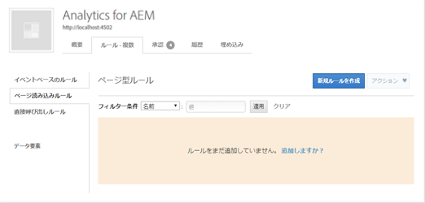
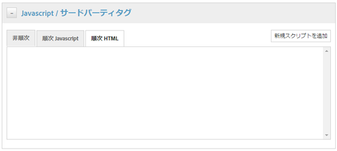
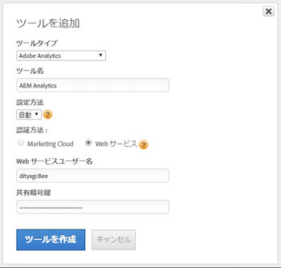
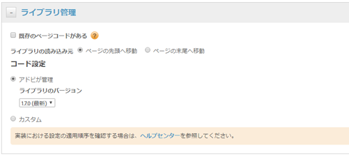
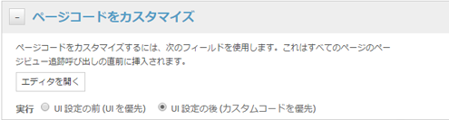

# DTMを使用したアセットインサイトの有効化 {#enabling-asset-insights-through-dtm}

Adobe Dynamic Tag Management は、デジタルマーケティングツールをアクティベートするツールです。これは Adobe Analytics のユーザーに無償で提供されます。トラッキングコードをカスタマイズして、サードパーティのCMSソリューションでAssets Insightsを使用できるようにするか、DTMを使用してAssets Insightsタグを挿入することができます。 インサイトのサポートおよび提供がおこなわれるのは、画像に対してのみです。

>[!CAUTION]
>
>AdobeDTMは[!DNL Adobe Experience Platform]のために廃止され、まもなく[提供終了](https://medium.com/launch-by-adobe/dtm-plans-for-a-sunset-3c6aab003a6f)に達します。 Adobeでは、アセットのインサイト](https://experienceleague.adobe.com/docs/experience-manager-learn/assets/advanced/asset-insights-launch-tutorial.html)に[ [!DNL Adobe Experience Platform] を使用することをお勧めします。

DTMを使用してアセットインサイトを有効にするには、次の手順を実行します。

1. [!DNL Experience Manager]ロゴをタップまたはクリックし、**[!UICONTROL ツール]** / **[!UICONTROL アセット]** / **[!UICONTROL インサイト設定]**&#x200B;に移動します。
1. [DTMを使用した [!DNL Experience Manager] インスタンスのCloud Service](../sites-administering/dtm.md)

   [https://dtm.adobe.com](https://dtm.adobe.com/)にログオンすると、APIトークンが使用可能になります。プロファイルアイコンから&#x200B;**[!UICONTROL アカウント設定]**&#x200B;にアクセスします。 [!DNL Experience Manager Sites]とAssets Insightsの統合はまだ機能しているので、Assets Insightsの観点からは、この手順は必要ありません。

1. [https://dtm.adobe.com](https://dtm.adobe.com/) にログオンし、必要に応じて会社を選択します。
1. Web プロパティを作成するか既存の Web プロパティを開きます。

   * 「**[!UICONTROL Webプロパティ]**」タブを選択し、「**[!UICONTROL プロパティを追加]**」をタップまたはクリックします。
   * 必要に応じてフィールドを更新し、「**[!UICONTROL プロパティを作成]**」をタップまたはクリックします（[ドキュメント](https://helpx.adobe.com/jp/experience-manager/using/dtm.html)を参照）。

   

1. 「**[!UICONTROL ルール]**」タブで、ナビゲーションウィンドウから「**[!UICONTROL ページ型ルール]**」を選択し、「**[!UICONTROL 新しいルールを作成]**」をタップまたはクリックします。

   

1. **[!UICONTROL Javascript /Third Party Tags]**&#x200B;を展開します。 次に、「**[!UICONTROL 順次HTML]**」タブで「**[!UICONTROL 新しいスクリプトを追加]**」をタップまたはクリックして、スクリプトダイアログを開きます。

   

1. [!DNL Experience Manager]ロゴをタップまたはクリックし、**[!UICONTROL ツール/アセット]**&#x200B;に移動します。
1. 「**[!UICONTROL インサイトページトラッカー]**」をタップまたはクリックし、トラッカーコードをコピーして、手順6で開いたスクリプトダイアログに貼り付けます。 変更内容を保存します。

   >[!NOTE]
   >
   >* `AppMeasurement.js` は削除されました。これは、DTM の Adobe Analytics ツールで使用できるはずです。
   >* `assetAnalytics.dispatcher.init()`への呼び出しは削除されます。 この関数は、DTM の Adobe Analytics ツールの読み込みが完了すると呼び出されるはずです。
   >* アセットインサイトページトラッカーがホストされている場所(AEM、CDNなど)によっては、スクリプトソースの出所を変更する必要が生じる場合があります。
   >* AEMがホストするページトラッカーの場合、ソースは、Dispatcherインスタンスのホスト名を使用してパブリッシュインスタンスを指す必要があります。


1. [https://dtm.adobe.com](https://dtm.adobe.com) を開きます。Web プロパティの「概要」をクリックし、「ツールを追加」をクリックするか既存の Adobe Analytics ツールを開きます。ツールの作成時に、「設定方法」を「自動」に設定できます。

   

   必要に応じてステージング／実稼動版レポートスイートを選択します。

1. **[!UICONTROL 「ライブラリ管理」]**&#x200B;を展開し、**[!UICONTROL 「]**&#x200B;でのライブラリの読み込み」が&#x200B;**[!UICONTROL 「ページ上部]**」に設定されていることを確認します。

   

1. 「**[!UICONTROL ページコードをカスタマイズ]**」を展開し、「**[!UICONTROL エディターを開く]**」をクリックまたはタップします。

   

1. 次のコードをウィンドウに貼り付けます。

   ```java
   var sObj;
   
   if (arguments.length > 0) {
     sObj = arguments[0];
   } else {
     sObj = _satellite.getToolsByType('sc')[0].getS();
   }
   _satellite.notify('in assetAnalytics customInit');
   (function initializeAssetAnalytics() {
     if ((!!window.assetAnalytics) && (!!assetAnalytics.dispatcher)) {
       _satellite.notify('assetAnalytics ready');
       /** NOTE:
           Copy over the call to 'assetAnalytics.dispatcher.init()' from Assets Pagetracker
           Be mindful about changing the AppMeasurement object as retrieved above.
       */
       assetAnalytics.dispatcher.init(
             "",  /** RSID to send tracking-call to */
             "",  /** Tracking Server to send tracking-call to */
             "",  /** Visitor Namespace to send tracking-call to */
             "",  /** listVar to put comma-separated-list of Asset IDs for Asset Impression Events in tracking-call, e.g. 'listVar1' */
             "",  /** eVar to put Asset ID for Asset Click Events in, e.g. 'eVar3' */
             "",  /** event to include in tracking-calls for Asset Impression Events, e.g. 'event8' */
             "",  /** event to include in tracking-calls for Asset Click Events, e.g. 'event7' */
             sObj  /** [OPTIONAL] if the webpage already has an AppMeasurement object, please include the object here. If unspecified, Pagetracker Core shall create its own AppMeasurement object */
             );
       sObj.usePlugins = true;
       sObj.doPlugins = assetAnalytics.core.updateContextData;
       assetAnalytics.core.optimizedAssetInsights();
     }
     else {
       _satellite.notify('assetAnalytics not available. Consider updating the Custom Page Code', 4);
     }
   })();
   ```

   * DTMのページ型ルールには、pagetracker.jsコードのみが含まれます。 `assetAnalytics` のフィールドはすべて、デフォルト値の上書きと見なされます。これらは、デフォルトでは必要ありません。
   * `_satellite.getToolsByType('sc')[0].getS()`が初期化され、`assetAnalytics,dispatcher.init`が使用可能になっていることを確認した後、コードは`assetAnalytics.dispatcher.init()`を呼び出します。 このため、手順 11 ではこのコードの追加をスキップできます。
   * インサイトページトラッカーコード（**[!UICONTROL ツール/アセット/インサイトページトラッカー]**）内のコメントで示したように、ページトラッカーが`AppMeasurement`オブジェクトを作成しない場合、最初の3つの引数（RSID、トラッキングサーバー、訪問者名前空間）は無関係です。 これを示すため代わりに空の文字列が渡されます。

       その他の引数は、インサイト設定ページ（**[!UICONTROL ツール／アセット／インサイト設定]**）で設定された内容に対応しています。

   * AppMeasurement オブジェクトは、すべての使用可能な SiteCatalyst エンジンで `satelliteLib` に対するクエリを実行して取得されます。複数のタグが設定されている場合は、配列セレクターのインデックスをそれに応じて変更します。配列のエントリは、DTM インターフェイスで使用可能な SiteCatalyst ツールの順に並んでいます。

1. 保存してコードエディターウィンドウを閉じ、変更をツール設定に保存します。
1. 「**[!UICONTROL 承認]**」タブで、承認待ちの両方を承認します。 DTM タグを Web ページに挿入する準備ができました。WebページにDTMタグを挿入する方法について詳しくは、[カスタムページテンプレートへのDTMの統合](https://web.archive.org/web/20180816221834/https://blogs.adobe.com/experiencedelivers/experience-management/integrating-dtm-custom-aem6-page-template)に関するアーカイブページを参照してください。
