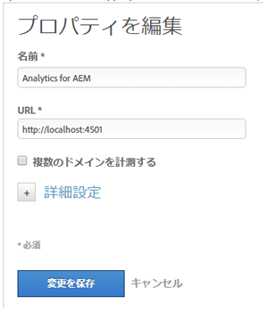

# DTM を使用したアセットインサイトの有効化 {#enabling-asset-insights-through-dtm}

Adobe Dynamic Tag Management は、デジタルマーケティングツールをアクティベートするツールです。これは Adobe Analytics のユーザーに無償で提供されます。トラッキングコードをカスタマイズして、サードパーティの CMS ソリューションで Assets Insights を使用できるようにするか、DTM を使用して Assets Insights タグを挿入できます。 インサイトのサポートおよび提供が行われるのは、画像に対してのみです。

>[!CAUTION]
>
>AdobeDTM は非推奨（のため）になりました [!DNL Adobe Experience Platform] そしてすぐにに到達する [提供終了](https://medium.com/launch-by-adobe/dtm-plans-for-a-sunset-3c6aab003a6f). Adobeが推奨する [use [!DNL Adobe Experience Platform] アセットインサイト](https://experienceleague.adobe.com/docs/experience-manager-learn/assets/advanced/asset-insights-launch-tutorial.html).

DTM を使用して Assets Insights を有効にするには、次の手順を実行します。

1. 次をタップまたはクリックします。 [!DNL Experience Manager] ロゴをクリックし、に移動します。 **[!UICONTROL ツール]** > **[!UICONTROL Assets]** > **[!UICONTROL インサイト設定]**.
1. [設定 [!DNL Experience Manager] DTMCloud Serviceを使用したインスタンス](../sites-administering/dtm.md)

   にログオンすると、API トークンが使用できるようになります。 [https://dtm.adobe.com](https://dtm.adobe.com/) および訪問 **[!UICONTROL アカウント設定]** を「プロファイル」アイコンから選択します。 この手順は、Assets Insights の観点からは必要ありません。これは、 [!DNL Experience Manager Sites] と Assets Insights は、現在も有効です。

1. [https://dtm.adobe.com](https://dtm.adobe.com/) にログオンし、必要に応じて会社を選択します。
1. Web プロパティを作成するか既存の Web プロパティを開きます。

   * を選択します。 **[!UICONTROL Web プロパティ]** 「 」タブをクリックし、次に「 」をタップまたはクリックします。 **[!UICONTROL プロパティを追加]**.
   * 必要に応じてフィールドを更新し、をタップまたはクリックします。 **[!UICONTROL プロパティを作成]** ( [ドキュメント](https://helpx.adobe.com/jp/experience-manager/using/dtm.html)) をクリックします。

   

1. 内 **[!UICONTROL ルール]** タブ、選択 **[!UICONTROL ページ型ルール]** ナビゲーションウィンドウで、をタップまたはクリックします。 **[!UICONTROL 新規ルールの作成]**.

   

1. 展開 **[!UICONTROL Javascript /サードパーティタグ]**. 次に、をタップまたはクリックします。 **[!UICONTROL 新しいスクリプトを追加]** 内 **[!UICONTROL 順次HTML]** タブをクリックして、スクリプトダイアログを開きます。

   

1. 次をタップまたはクリックします。 [!DNL Experience Manager] ロゴをクリックし、に移動します。 **[!UICONTROL ツール/アセット]**.
1. タップまたはクリック **[!UICONTROL インサイトページトラッカー]**&#x200B;トラッカーコードをコピーし、手順 6 で開いたスクリプトダイアログに貼り付けます。 変更内容を保存します。

   >[!NOTE]
   >
   >* `AppMeasurement.js` が削除されました。 これは、DTM の Adobe Analytics ツールで使用できるはずです。
   >* への呼び出し `assetAnalytics.dispatcher.init()` が削除されました。 この関数は、DTM の Adobe Analytics ツールの読み込みが完了すると呼び出されるはずです。
   >* アセットインサイトページトラッカーがホストされている場所 (AEM、CDN など ) に応じて、スクリプトソースのオリジンを変更する必要がある場合があります。
   >* AEMでホストされるページトラッカーの場合、ソースは、Dispatcher インスタンスのホスト名を使用してパブリッシュインスタンスを指す必要があります。


1. [https://dtm.adobe.com](https://dtm.adobe.com) を開きます。Web プロパティの「概要」をクリックし、「ツールを追加」をクリックするか既存の Adobe Analytics ツールを開きます。ツールの作成時に、「設定方法」を「自動」に設定できます。

   

   必要に応じてステージング／実稼動版レポートスイートを選択します。

1. 展開 **[!UICONTROL ライブラリ管理]**、および **[!UICONTROL ライブラリの読み込み先]** が **[!UICONTROL Page Top]**.

   

1. 展開 **[!UICONTROL ページコードのカスタマイズ]**&#x200B;をクリックまたはタップします。 **[!UICONTROL 編集画面を開く]**.

   

1. 次のコードをウィンドウに貼り付けます。

   ```java
   var sObj;
   
   if (arguments.length > 0) {
     sObj = arguments[0];
   } else {
     sObj = _satellite.getToolsByType('sc')[0].getS();
   }
   _satellite.notify('in assetAnalytics customInit');
   (function initializeAssetAnalytics() {
     if ((!!window.assetAnalytics) && (!!assetAnalytics.dispatcher)) {
       _satellite.notify('assetAnalytics ready');
       /** NOTE:
           Copy over the call to 'assetAnalytics.dispatcher.init()' from Assets Pagetracker
           Be mindful about changing the AppMeasurement object as retrieved above.
       */
       assetAnalytics.dispatcher.init(
             "",  /** RSID to send tracking-call to */
             "",  /** Tracking Server to send tracking-call to */
             "",  /** Visitor Namespace to send tracking-call to */
             "",  /** listVar to put comma-separated-list of Asset IDs for Asset Impression Events in tracking-call, e.g. 'listVar1' */
             "",  /** eVar to put Asset ID for Asset Click Events in, e.g. 'eVar3' */
             "",  /** event to include in tracking-calls for Asset Impression Events, e.g. 'event8' */
             "",  /** event to include in tracking-calls for Asset Click Events, e.g. 'event7' */
             sObj  /** [OPTIONAL] if the webpage already has an AppMeasurement object, please include the object here. If unspecified, Pagetracker Core shall create its own AppMeasurement object */
             );
       sObj.usePlugins = true;
       sObj.doPlugins = assetAnalytics.core.updateContextData;
       assetAnalytics.core.optimizedAssetInsights();
     }
     else {
       _satellite.notify('assetAnalytics not available. Consider updating the Custom Page Code', 4);
     }
   })();
   ```

   * DTM のページ型ルールには、pagetracker.js コードのみが含まれます。 `assetAnalytics` のフィールドはすべて、デフォルト値の上書きと見なされます。これらは、デフォルトでは必要ありません。
   * コードが `assetAnalytics.dispatcher.init()` 確かめた後で `_satellite.getToolsByType('sc')[0].getS()` が初期化され、 `assetAnalytics,dispatcher.init` が使用可能です。 このため、手順 11 ではこのコードの追加をスキップできます。
   * インサイトページトラッカーコード (**[!UICONTROL ツール/アセット/インサイトページトラッカー]**)、ページトラッカーで `AppMeasurement` オブジェクトの場合、最初の 3 つの引数（RSID、トラッキングサーバー、訪問者名前空間）は無関係です。 これを示すため代わりに空の文字列が渡されます。

       その他の引数は、インサイト設定ページ（**[!UICONTROL ツール／アセット／インサイト設定]**）で設定された内容に対応しています。

   * AppMeasurement オブジェクトは、すべての使用可能な SiteCatalyst エンジンで `satelliteLib` に対するクエリを実行して取得されます。複数のタグが設定されている場合は、配列セレクターのインデックスをそれに応じて変更します。配列のエントリは、DTM インターフェイスで使用可能な SiteCatalyst ツールの順に並んでいます。

1. コードエディターウィンドウを保存して閉じ、変更をツール設定に保存します。
1. 内 **[!UICONTROL 承認]** 「 」タブで、承認待ちの状態を両方とも承認します。 DTM タグを Web ページに挿入する準備ができました。Web ページに DTM タグを挿入する方法について詳しくは、次のアーカイブページを参照してください： [カスタムページテンプレートへの DTM の統合](https://web.archive.org/web/20180816221834/https://blogs.adobe.com/experiencedelivers/experience-management/integrating-dtm-custom-aem6-page-template).
