# 翻訳プロジェクトの作成 {#creating-translation-projects}

言語コピーを作成するには、Assets UI の参照パネルに表示される以下の言語コピーワークフローのいずれかを実行します。

**作成と翻訳**

このワークフローでは、翻訳されるアセットは、翻訳先言語の言語ルートにコピーされます。また、選択するオプションによって異なりますが、アセットに対応する翻訳プロジェクトがプロジェクトコンソールで作成されます。設定によっては、翻訳プロジェクトを手動で開始することも、翻訳プロジェクトの作成後すぐに自動的に実行することもできます。

**言語コピーを更新**

このワークフローを実行すると、追加のアセットグループが翻訳され、特定のロケールの言語コピーに含められます。この場合、翻訳されたアセットが追加されるターゲットフォルダーには翻訳済みのアセットが既に含まれています。

>[!NOTE]
>
>アセットバイナリは、翻訳サービスプロバイダーがバイナリの翻訳をサポートしている場合にのみ翻訳されます。

>[!NOTE]
>
>PDF や InDesign ファイルなど複雑なアセットの翻訳ワークフローを起動しても、サブアセットまたはレンディション（ある場合）は翻訳のために送信されません。

## 作成と翻訳ワークフロー {#create-and-translate-workflow}

最初は、作成と翻訳ワークフローを使用して、特定の言語の言語コピーを生成します。ワークフローには次のオプションがあります。

* 構造のみを作成
* 新しい翻訳プロジェクトを作成
* 既存の翻訳プロジェクトに追加

### 構造のみを作成 {#create-structure-only}

「**構造のみを作成**」オプションを使用して、ソース言語ルート内のソースフォルダーの階層と一致するように、ターゲット言語ルート内にターゲットフォルダー階層を作成します。この場合、ソースアセットが宛先フォルダーにコピーされます。ただし、翻訳プロジェクトは生成されません。

1. Assets UI で、ターゲット言語ルート内に構造を作成するソースフォルダーを選択します。
1. **[!UICONTROL 参照]**&#x200B;パネルを開き、「**[!UICONTROL コピー]**」の下の「**[!UICONTROL 言語コピー]**」をクリックまたはタップします。

   

1. 一番下の「**[!UICONTROL 作成と翻訳]**」をクリックまたはタップします。

   

1. 「**[!UICONTROL ターゲット言語]**」リストで、フォルダー構造を作成しようとしている言語を選択します。

   

1. 「**[!UICONTROL プロジェクト]**」リストで「**[!UICONTROL 構造のみを作成]**」を選択します。

   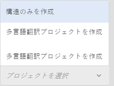

1. 「**[!UICONTROL 作成]**」をクリックまたはタップします。ターゲット言語の新しい構造が、「**[!UICONTROL 言語コピー]**」の下に表示されます。

   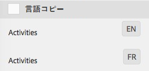

1. このリストで構造をクリックまたはタップしてから、「**[!UICONTROL アセットで表示]**」をクリックまたはタップしてターゲット言語内のフォルダー構造に移動します。

   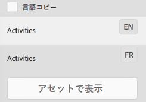

### 新しい翻訳プロジェクトを作成 {#create-a-new-translation-project}

このオプションを使用すると、翻訳されるアセットは、翻訳先言語の言語ルートにコピーされます。選択するオプションによって異なりますが、アセットに対応する翻訳プロジェクトがプロジェクトコンソールで作成されます。設定によっては、翻訳プロジェクトを手動で開始することも、翻訳プロジェクトの作成後すぐに自動的に実行することもできます。

1. Assets UI で、言語コピーを作成しようとするソースフォルダーを選択します。
1. **[!UICONTROL 参照]**&#x200B;パネルを開き、「**[!UICONTROL コピー]**」の下の「**[!UICONTROL 言語コピー]**」をクリックまたはタップします。

   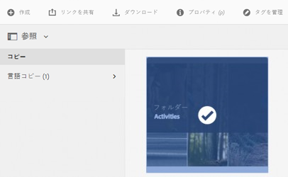

1. 一番下の「**[!UICONTROL 作成と翻訳]**」をクリックまたはタップします。

   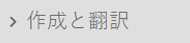

1. 「**[!UICONTROL ターゲット言語]**」リストで、フォルダー構造を作成しようとしている言語を選択します。

   

1. 「**[!UICONTROL プロジェクト]**」リストで「**[!UICONTROL 新しい翻訳プロジェクトを作成]**」を選択します。

   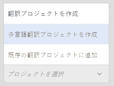

1. 「**[!UICONTROL プロジェクトタイトル]**」フィールドに、プロジェクトのタイトルを入力します。

   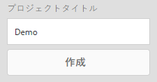

1. 「**[!UICONTROL 作成]**」をクリックまたはタップします。ソースフォルダーのアセットが、手順 4 で選択したロケールのターゲットフォルダーにコピーされます。

   

1. そのフォルダーに移動するには、言語コピーを選択してから「**[!UICONTROL アセットで表示]**」をクリックします。

   

1. プロジェクトコンソールに移動します。翻訳フォルダーはプロジェクトコンソールにコピーされます。

   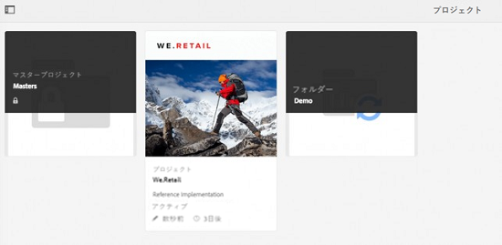

1. フォルダーを開くと翻訳プロジェクトが表示されます。

   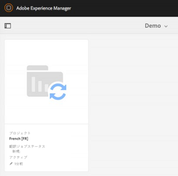

1. プロジェクトをクリックまたはタップして詳細ページを開きます。

   

1. 翻訳ジョブのステータスを表示するには、「**[!UICONTROL 翻訳ジョブ]**」タイルの一番下にある省略記号をクリックします。

   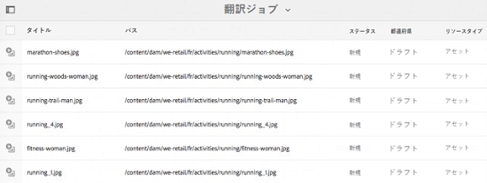

   ジョブステータスの詳細については、[翻訳ジョブのステータスの監視](/help/sites-administering/tc-manage.md#monitoring-the-status-of-a-translation-job)を参照してください。

1. Assets UI に移動し、翻訳済みアセットそれぞれのプロパティページを開き、翻訳されたメタデータを表示します。

   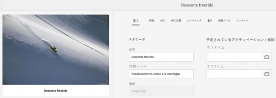

   >[!NOTE]
   >
   >この機能は、アセットに対してもフォルダーに対しても使用できます。フォルダーではなくアセットを選択すると、言語ルートまでのフォルダーの全階層がコピーされて、アセットの言語コピーが作成されます。

### 既存の翻訳プロジェクトに追加 {#add-to-existing-translation-project}

このオプションを使用すると、前の翻訳ワークフローの実行後にユーザーがソースフォルダーに追加したアセットに対して、翻訳ワークフローが実行されます。新しく追加されたアセットのみが、既に翻訳済みのアセットを含むターゲットフォルダーにコピーされます。この場合、新しい翻訳プロジェクトは作成されません。

1. Assets UI で、翻訳されていないアセットを含むソースフォルダーに移動します。
1. 翻訳するアセットを選択して、**[!UICONTROL 参照パネル]**&#x200B;を開きます。「**[!UICONTROL 言語コピー]**」セクションに、現在使用可能な翻訳コピーの数が表示されます。
1. 「**[!UICONTROL コピー]**」の下の「**[!UICONTROL 言語コピー]**」をクリックまたはタップします。使用可能な翻訳コピーのリストが表示されます。
1. 一番下の「**[!UICONTROL 作成と翻訳]**」をクリックまたはタップします。

   

1. 「**[!UICONTROL ターゲット言語]**」リストで、フォルダー構造を作成しようとしている言語を選択します。

   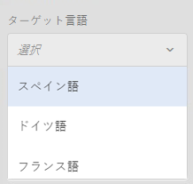

1. 「**[!UICONTROL プロジェクト]**」リストで「**[!UICONTROL 既存の翻訳プロジェクトに追加]**」を選択して、翻訳ワークフローをフォルダーに対して実行します。

   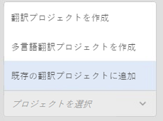

   >[!NOTE]
   >
   >「**[!UICONTROL 既存の翻訳プロジェクトに追加]**」オプションを選択すると、プロジェクトの設定が既存のプロジェクトの設定と完全に一致する場合にのみ、翻訳プロジェクトが既存のプロジェクトに追加されます。それ以外の場合は、新しいプロジェクトが作成されます。

1. 「**[!UICONTROL 既存の翻訳プロジェクト]**」リストで、翻訳のためのアセットを追加するプロジェクトを選択します。

   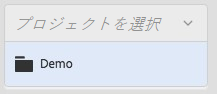

1. 「**[!UICONTROL 作成]**」をクリックまたはタップします。翻訳されるアセットがターゲットフォルダーに追加されます。更新されたフォルダーが、「**[!UICONTROL 言語コピー]**」セクションに表示されます。

   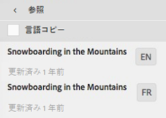

1. プロジェクトコンソールに移動し、追加先の既存の翻訳プロジェクトを開きます。
1. 翻訳プロジェクトをクリックまたはタップして、プロジェクトの詳細ページを表示します。

   

1. 「**翻訳ジョブ**」タイルの一番下にある省略記号をクリックまたはタップして、翻訳ワークフローのアセットを表示します。翻訳ジョブリストには、アセットのメタデータとタグのエントリも表示されます。これらのエントリは、アセットのメタデータとタグも翻訳されることを意味します。

   >[!NOTE]
   >
   >タグまたはメタデータのエントリを削除した場合は、どのアセットのタグまたはメタデータも翻訳されません。

   >[!NOTE]
   >
   >機械翻訳を使用する場合は、アセットのバイナリは翻訳されません。

   >[!NOTE]
   >
   >翻訳ジョブに追加したアセットがサブアセットを含んでいる場合は、問題を避けるために、サブアセットを選択して翻訳から除外してください。

1. アセットの翻訳を開始するには、「**[!UICONTROL 翻訳ジョブ]**」タイルの矢印をクリックまたはタップし、リストから「**[!UICONTROL 開始]**」を選択します。

   

   翻訳ジョブの開始を通知するメッセージが表示されます。

   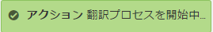

1. 翻訳ジョブのステータスを表示するには、「**[!UICONTROL 翻訳ジョブ]**」タイルの一番下の省略記号をクリックまたはタップします。

   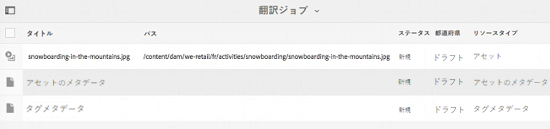

   詳しくは、 [翻訳ジョブのステータスの監視](/help/sites-administering/tc-manage.md#monitoring-the-status-of-a-translation-job).

1. 翻訳が完了すると、ステータスが「レビューへの準備完了」に変更されます。Assets UI に移動し、翻訳済みアセットそれぞれのプロパティページを開き、翻訳されたメタデータを表示します。

## 言語コピーを更新 {#update-language-copies}

このワークフローを実行すると、追加のアセットのセットが翻訳され、特定のロケールの言語コピーに含められます。この場合、翻訳されたアセットが追加されるターゲットフォルダーには翻訳済みのアセットが既に含まれています。オプションの選択に応じて、翻訳プロジェクトが作成されるか、既存の翻訳プロジェクトが新しいアセットを含むように更新されます。「言語コピーを更新」ワークフローには次のオプションがあります。

* 新しい翻訳プロジェクトを作成
* 既存の翻訳プロジェクトに追加

### 新しい翻訳プロジェクトを作成 {#create-a-new-translation-project-1}

このオプションを使用すると、言語コピーを更新する一連のアセットに対して翻訳プロジェクトが作成されます。

1. Assets UI で、アセットを追加したソースフォルダーを選択します。
1. **[!UICONTROL 参照]**&#x200B;パネルを開き、「**[!UICONTROL コピー]**」の下の「**[!UICONTROL 言語コピー]**」をクリックまたはタップして言語コピーのリストを表示します。
1. 「**[!UICONTROL 言語コピー]**」の前のチェックボックスを選択し、適切なロケールに対応するターゲットフォルダーを選択します。

   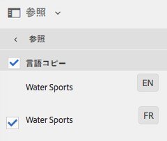

1. 下部の「**[!UICONTROL 言語コピーを更新]**」をクリックまたはタップします。

   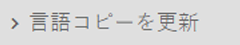

1. 「**[!UICONTROL プロジェクト]**」リストで「**[!UICONTROL 新しい翻訳プロジェクトを作成]**」を選択します。

   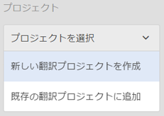

1. 「**[!UICONTROL プロジェクトタイトル]**」フィールドに、プロジェクトのタイトルを入力します。

   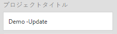

1. 「**[!UICONTROL 開始]**」をクリックまたはタップします。
1. プロジェクトコンソールに移動します。翻訳フォルダーはプロジェクトコンソールにコピーされます。

   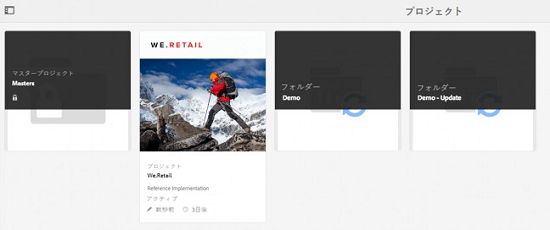

1. フォルダーを開くと翻訳プロジェクトが表示されます。

   

1. プロジェクトをクリックまたはタップして詳細ページを開きます。

   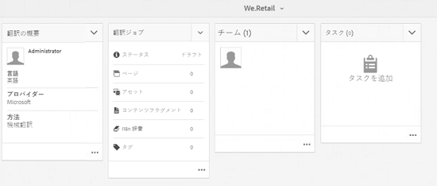

1. アセットの翻訳を開始するには、「**[!UICONTROL 翻訳ジョブ]**」タイルの矢印をクリックし、リストから「**[!UICONTROL 開始]**」を選択します。

   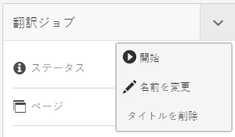

   翻訳ジョブの開始を通知するメッセージが表示されます。

   

1. 翻訳ジョブのステータスを表示するには、「**[!UICONTROL 翻訳ジョブ]**」タイルの一番下の省略記号をクリックまたはタップします。

   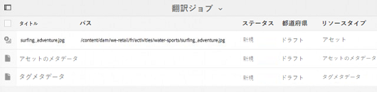

   ジョブステータスの詳細については、[翻訳ジョブのステータスの監視](../sites-administering/tc-manage.md#monitoring-the-status-of-a-translation-job)を参照してください。

1. Assets UI に移動し、翻訳済みアセットそれぞれのプロパティページを開き、翻訳されたメタデータを表示します。

### 既存の翻訳プロジェクトに追加 {#add-to-existing-translation-project-1}

このオプションを使用すると、アセットのセットが既存の翻訳プロジェクトに追加され、選択したロケールの言語コピーが更新されます。

1. Assets UI で、アセットフォルダーを追加したソースフォルダーを選択します。
1. **[!UICONTROL 参照]**&#x200B;パネルを開き、「**[!UICONTROL コピー]**」の下の「**[!UICONTROL 言語コピー]**」をクリックまたはタップして、言語コピーのリストを表示します。

   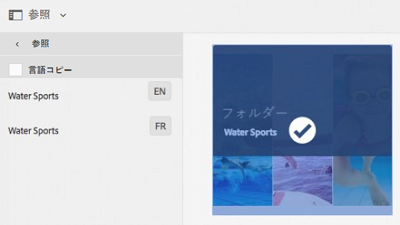

1. 「**[!UICONTROL 言語コピー]**」の前のチェックボックスをオンにします。これによりすべての言語コピーが選択されます。翻訳先のロケールに対応する言語コピーを除き、他のコピーの選択を解除します。

   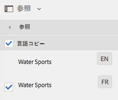

1. 下部の「**[!UICONTROL 言語コピーを更新]**」をクリックまたはタップします。

   

1. 「**[!UICONTROL プロジェクト]**」リストで「**[!UICONTROL 既存の翻訳プロジェクトに追加]**」を選択します。

   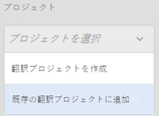

1. 「**[!UICONTROL 既存の翻訳プロジェクト]**」リストで、翻訳のためのアセットを追加するプロジェクトを選択します。

   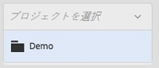

1. 「**[!UICONTROL 開始]**」をクリックまたはタップします。
1. [既存の翻訳プロジェクトに追加](translation-projects.md#add-to-existing-translation-project)の手順 9～14 を参照して、この手順の続きを完了させます。

## 一時的な言語コピーの作成 {#creating-temporary-language-copies}

翻訳ワークフローを実行して、元のアセットを編集したバージョンで言語コピーを更新するとき、翻訳済みアセットをユーザーが承認するまで、既存の言語コピーが維持されます。[!DNL Experience Manager] Assets は、新たに翻訳されたアセットを一時的な場所に格納しておき、ユーザーがアセットを明示的に承認した後で既存の言語コピーを更新します。ユーザーがアセットを承認しないと、言語コピーは変更されません。

1. 先ほど言語コピーを作成した「**[!UICONTROL 言語コピー]**」でソースルートフォルダーをクリックまたはタップしてから、「**[!UICONTROL Assets で表示]**」をクリックまたはタップすると、 Assets でフォルダーが開きます。[!DNL Experience Manager]

   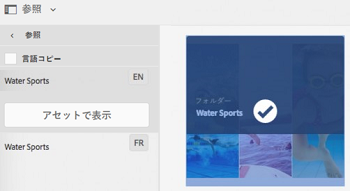

1. Assets UI で、既に翻訳したアセットを選択し、ツールバーの「**[!UICONTROL 編集]**」アイコンをクリックまたはタップしてアセットを編集モードで開きます。

   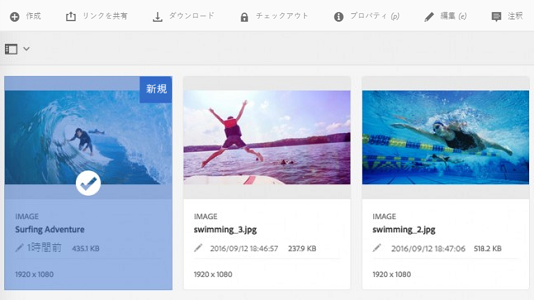

1. アセットを編集して、変更内容を保存します。
1. [既存の翻訳プロジェクトに追加](#add-to-existing-translation-project)の手順 2～14 を実行して、言語コピーを更新します。
1. 「**[!UICONTROL 翻訳ジョブ]**」タイルの一番下にある省略記号をクリックまたはタップします。**[!UICONTROL 翻訳ジョブ]**&#x200B;ページのアセットのリストで、翻訳済みバージョンのアセットが格納されている一時的な場所を確認できます。

   

1. 「**[!UICONTROL タイトル]**」の横にあるチェックボックスをオンにします。
1. ツールバーの「**[!UICONTROL 翻訳を承認]**」をクリックまたはタップし、ダイアログの「**[!UICONTROL 確定]**」をクリックまたはタップすると、ターゲットフォルダー内の翻訳済みアセットが、編集されたアセットの翻訳済みバージョンで上書きされます。

   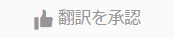

   >[!NOTE]
   >
   >翻訳ワークフローが対象のアセットを更新できるようにするには、アセットとメタデータの両方を承認します。

   「**[!UICONTROL 翻訳を拒否]**」をクリックまたはタップすると、ターゲットロケールルートにあるアセットの最初の翻訳バージョンが保持され、編集されたバージョンは拒否されます。

   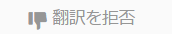

1. アセットコンソールに移動し、翻訳済みアセットそれぞれのプロパティページを開き、翻訳されたメタデータを表示します。

アセットのメタデータを効率的に翻訳するためのヒントについては、次のアーカイブページを参照してください： [メタデータを効率的に翻訳するための 5 つの手順](https://web.archive.org/web/20181217033517/https://blogs.adobe.com/experiencedelivers/experience-management/translate_aemassets_metadata/).
