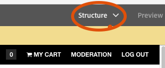
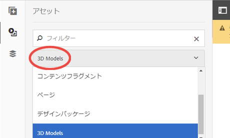

# Working with the 3D Sites component {#working-with-the-d-sites-component}

AEM 3Dには、3Dモデルのインタラクティブな表示をWebページに実装するためのAEM Sitesコンポーネントが含まれています。

After you have added your 3D component, you can [view the 3D asset in that component.](viewing-3d-assets.md)

## ページテンプレートへの 3D コンポーネントの追加 {#adding-the-d-component-to-the-page-template}

ページ上に配置する前に、ページ内で3Dコンポーネントを有効にする必要があります。 See [Editing templates](/help/sites-authoring/templates.md#editing-a-template-layout-template-author) for detailed information on enabling components in templates.

**ページテンプレートへの 3D コンポーネントの追加**:

1. **[!UICONTROL ツール／一般／テンプレート]**&#x200B;に移動します。

1. 3D コンポーネントを有効にするページテンプレートに移動し、テンプレートを選択します。

1. 「**[!UICONTROL 編集]**」をタップしてテンプレートを開きます。
1. ページの右上付近にあるドロップダウンメニューで、「**[!UICONTROL 構造]**」モードを選択します（まだアクティブでない場合）。

   

1. Tap in the **[!UICONTROL Layout Container]** region to select it.

1. Tap the **[!UICONTROL Policy]** button to open the **[!UICONTROL Policy Editor]**.
1. In the **[!UICONTROL Properties]** section, select the **[!UICONTROL 3D]** checkmark, and then tap **[!UICONTROL Done]** to save the changes and close the **[!UICONTROL Policy Editor]**.

   これで、このテンプレートを使用するすべてのページに3Dサイトコンポーネントを配置できます。

## Web ページへの 3D ビューアコンポーネントの追加 {#adding-the-d-viewer-component-to-a-web-page}

>[!CAUTION]
>
>このバージョンの AEM 3D では、Web ページごとに 3D コンポーネントのインスタンスを 1 つだけサポートします。同じページ上の複数の3Dコンポーネントが正しく機能しません。

**3D ViewerコンポーネントをWebページに追加するには**:

1. AEM Sitesを開き、3Dコンポーネントを追加するWebページを選択します。

1. **[!UICONTROL 編集]**（鉛筆）アイコンをタップして、ページをページエディターで開きます。Make sure **[!UICONTROL Edit]** mode near the top right of page is selected.

   

1. パネルセレクターをタップして、サイドパネルを開きます。

1. Tap the plus sign icon to open the **[!UICONTROL Components]** list.

1. **[!UICONTROL 3D Viewer]** コンポーネントをコンポーネント **** リストから、3Dビューアを表示するページ上の場所にドラッグします。

## 3D コンポーネントの設定 {#configuring-the-d-component}

1. In the AEM Sites page editor, select the **[!UICONTROL 3D Viewer]** component that you previously added to the page.

1. **[!UICONTROL 設定]**&#x200B;アイコン（レンチ）をタップして、コンポーネント設定ダイアログボックスを開きます。

   次のコンポーネントプロパティを設定できます。

   <table> 
    <tbody> 
    <tr> 
    <td>プロパティ</td> 
    <td>説明</td> 
    <td>適用性</td> 
    </tr> 
    <tr> 
    <td>高さ (px)</td> 
    <td>3D コンポーネントの目的の高さをピクセル単位で指定します。空の場合、デフォルトの 600 ピクセルになります。</td> 
    <td> </td> 
    </tr> 
    <tr> 
    <td>Stage Name</td> 
    <td>
使用可能なステージのリストから 3D ステージを選択します。ステージは背景とライティングを提供します。
 
See <a href="/help/assets/about-the-use-of-stages-in-aem-3d.md" target="_blank">About the use of stages in AEM 3D Sites</a>.
 </td> 
    <td>Adobe Dimensionアセットでは無視されます。</td> 
    </tr> 
    <tr> 
    <td>自動スピン速度(RPM)</td> 
    <td>
3D ビューアは、読み込みとリセットの後に、カメラの周りを継続的に回ります。自動スピンは、ユーザーが手動で周回操作を開始すると終了します。
 
次の値を使用して、RPMでスピン速度を指定できます。
 
        <ul> 
        <li>正の値を設定して右へスピン</li> 
        <li>負の値を左スピンに設定します</li> 
        <li>0を設定すると、自動スピンが無効になります。</li> 
        </ul> 
デフォルトは3 RPMで、完全な回転あたり20秒に相当します。    <strong>注意：</strong> スピン速度は、60/秒のフレームレートを前提とします。 この速度は、通常、より強力なグラフィックスハードウェア上の小さいモデルから適度なサイズのモデルで達成されます。 大きいモデルや低速のデバイスは、低い速度で自動スピンします。
 </td> 
    <td>Adobe Dimensionアセットでは無視されます。</td> 
    </tr> 
    <tr> 
    <td>ナビゲーションボタンの色</td> 
    <td>カラーピッカーを使用して、ビューアのコントロールボタンのメインの色を選択します。</td> 
    <td>Adobe Dimensionアセットでは無視されます。</td> 
    </tr> 
    <tr> 
    <td>ナビゲーションカーソルを合わせたときの色</td> 
    <td>カラーピッカーを使用して、ビューアのコントロールボタンのポイント時および選択時の色を選択します。</td> 
    <td>Adobe Dimensionアセットでは無視されます。</td> 
    </tr> 
    <tr> 
    <td>スウォッチを表示</td> 
    <td>将来的に使用するため。</td> 
    <td>Adobe Dimensionアセットでは無視されます。</td> 
    </tr> 
    <tr> 
    <td>GLTFカメラプリセットを表示</td> 
    <td>Adobe Dimensionアセットに存在する可能性のあるカメラプリセットを表示または非表示にします。</td> 
    <td>Adobe Dimension資産のみ。</td> 
    </tr> 
    <tr> 
    <td>GLTF背景色</td> 
    <td>3Dモデルに背景が含まれない場合のデフォルトの背景色。</td> 
    <td>Adobe Dimension資産のみ。</td> 
    </tr> 
    </tbody> 
   </table>

1. チェックマークをタップして、変更内容を保存します。

   コンポーネント設定ダイアログで使用できる設定に加えて、多くのグローバル設定を使用でき、CRXDE Liteを使用して変更できます。
これらのグローバル設定について詳しくは、[詳細設定](advanced-config-3d.md)を参照してください。

## コンポーネントへの 3D モデルの割り当て {#assigning-a-d-model-to-the-component}

1. In the AEM Sites page editor, click the **[!UICONTROL Assets]** icon to open the Assets list in the side panel.

1. Select the **[!UICONTROL 3D Models]** filter to hide unwanted asset types.

   

1. 編集中のページに表示する 3D アセットを検索するか、スクロールして見つけます。

1. Drag the 3D asset from the **[!UICONTROL Assets]** list to the **[!UICONTROL 3D Viewer]** component previously placed on the page.

   Adobe Dimensionアセットは、glTFオープン標準に基づく新しいビューア技術を使用してレンダリングされますが、他のすべての3Dアセットタイプは、従来のAEM 3D webGLビューアに依存します。 3Dモデルのタイプに基づいて、適切なビューアが自動的に選択されます。

## 3Dコンポーネントを含むWebページのプレビュー {#previewing-a-web-page-that-has-a-d-component}

While the web page is in **[!UICONTROL Edit]** mode, the 3D component displays the 3D model but no interaction with the model is possible.

3Dコンポーネントの機能に完全にアクセスして、ページエディターでWebページをプレビューできます。

See also [Viewing 3D assets in the Sites 3D component](viewing-3d-assets.md#viewing-d-assets-in-the-sites-d-component).

**3Dコンポーネントを含むWebページをプレビューするには**:

1. 次のいずれかの操作をおこないます。

   * Near the upper-right of the page, click **[!UICONTROL Preview]** to enter preview mode.
   * ブラウザーのページ URL から `/edit.html` を削除します。

## ページとアセットの公開 {#publishing-the-page-and-assets}

アセットの公開方法について詳しくは、[アセットの公開](managing-assets-touch-ui.md)を参照してください。ページの公開方法について詳しくは、[ページの公開](/help/sites-authoring/publishing-pages.md)を参照してください。

>[!NOTE]
>
>Using the **[!UICONTROL Publish Page]** menu item on the **[!UICONTROL Page Information]** menu will publish the page and all primary page dependencies. この方法でページを公開した場合、3D モデルや 3D ステージで参照される可能性のあるセカンダリの依存関係（テクスチャマップや IBL 画像など）は公開されません。
>
>Adobeでは、3Dアセットを参照するWebページを公開する前に、すべての3Dアセットとその依存関係をAEM Assetsから直接公開することをお勧めします。

