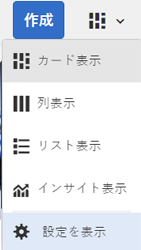
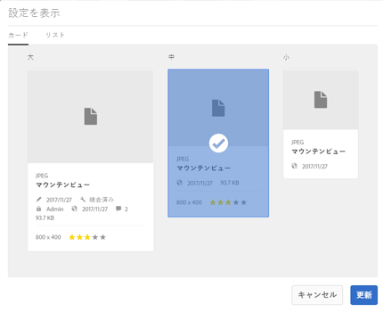
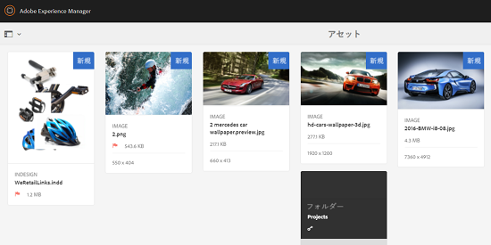
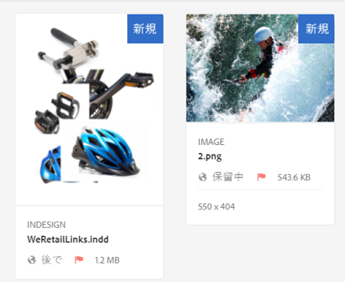
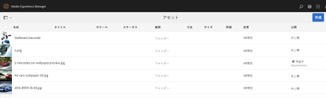
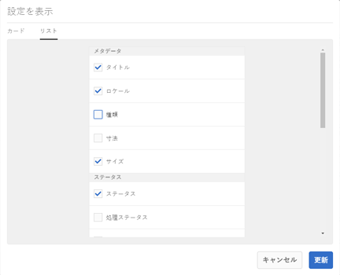
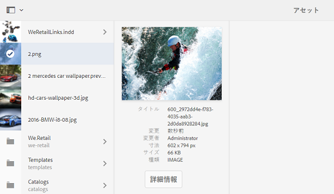
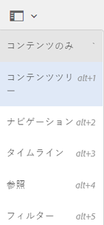
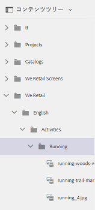

# Assets のユーザーエクスペリエンスの強化 {#user-experience-enhancements-in-assets}

AEM 6.4 Assetsには、シームレスなユーザーエクスペリエンスを提供し、生産性を向上させるいくつかの操作性の改善が含まれています。 市場開拓コンテンツの作成および管理速度の向上は、ビジネスのコンテンツ速度を改善します。

インターフェイスが応答性に優れ、大きなアセットポートフォリオを効率的に管理できます。 項目リストが長い場合でも、迅速に検索、表示、並べ替えおよびスムーズなスクロールをおこなうことができます。

カード、リスト、列などの様々な表示をパーソナライズできます。例えば、カード表示に表示するサムネールのサイズを設定できます。 リスト表示では、リスト内のアセットに対して表示する詳細レベルを設定できます。AEM 6.4 Assets には新しいツリー表示が含まれています。これを使用すると、簡単にアセットリポジトリ内を移動してアセットを見つけることができます。

## 遅延読み込み  {#lazy-loading}

AEM 6.4 Assets でアセットを参照または検索すると、一度に最大 200 個のアセットが表示されます。結果はより高速にスクロールでき、長いリストの結果を閲覧する場合に特に便利です。 大量のアセットが一度に読み込まれるので、スムーズに参照することができます。

アセットをタップまたはクリックして詳細ページをレビューした場合に、結果ページに戻るには、ツールバーの「戻る」ボタンをタップまたはクリックします。

## カード表示の改善 {#card-view-improvements}

使用するデバイスおよび必要な詳細の内容に応じて、カード表示のアセットのサムネールのサイズを変更できます。これにより、表示をパーソナライズして、表示されるサムネールの数を制御できます。

カード表示のサムネールのサイズを変更するには、次の手順を実行します。

1. ツールバーのレイアウトアイコンをタップまたはクリックし、「**[!UICONTROL 表示設定]**」オプションを選択します。

   

1. **[!UICONTROL 表示設定]**&#x200B;ダイアログで、目的のサムネールサイズを選択し、「**[!UICONTROL 更新]**」をタップまたはクリックします。

   

1. 選択したサイズで表示されるサムネールをレビューします。

   

カード表示のタイルには、公開ステータスなどの追加情報が表示されています。

## リスト表示の改善点 {#list-view-improvements}

リスト表示の最初の列には、デフォルトでアセットのファイル名が表示されます。公開ステータスや処理ステータス、ロケールなどの追加情報も表示されます。

表示する詳細の内容を設定できます。「レイアウト」アイコンをタップまたはクリックして「**[!UICONTROL 設定を表示]**」オプションを選択し、**[!UICONTROL 設定を表示]**&#x200B;ダイアログで表示する列を指定します。

## 列表示の改善点 {#column-view-improvements}

カード表示とリスト表示に加えて、列表示からアセットの詳細ページに移動できるようになりました。列表示のアセットを選択して、アセットのスナップショットの下の「**[!UICONTROL 詳細情報]**」をタップまたはクリックします。

## ツリー表示 {#tree-view}

AEM 6.4 Assets にはツリー表示があります。これを使用すると、簡単にアセット階層を参照して、目的のアセットやフォルダーに移動できます。

ツリー表示を開くには、`Assets UI`のGlobalNavアイコンをタップまたはクリックし、メニューから「**[!UICONTROL コンテンツツリー]**」を選択します。

コンテンツ階層から目的のアセットに移動します。

## アセットの詳細への移動 {#navigating-asset-details}

アセットの詳細ページのツールバーに「前へ」ボタンと「次へ」ボタンが追加され、フォルダー内のすべての画像を連続して表示できるようになりました。

使用しているデバイスによって異なりますが、スワイプするか、キーボードの矢印キーを使用しても、画像間を移動できます。

選択したレイアウトによって異なりますが、次の方法でアセットの詳細ページを開くことができます。

| **表示** | **アセットの詳細ページを開く方法** |
|---|---|
| [!UICONTROL カード表示] | アセットタイルをタップまたはクリックします。 |
| [!UICONTROL リスト表示] | リスト内のアセットの行エントリをタップまたはクリックします。 |
| [!UICONTROL 列表示] | アセットのスナップショットから「**[!UICONTROL 詳細]**」ボタンをタップまたはクリックします。 |

「前へ」ボタンと「次へ」ボタンを使用して、アセット間を移動します。

