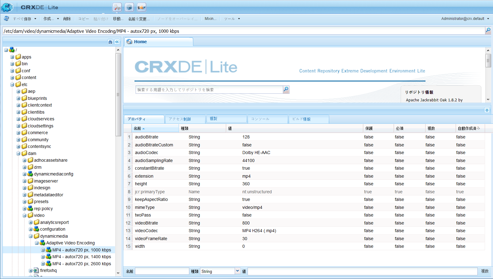
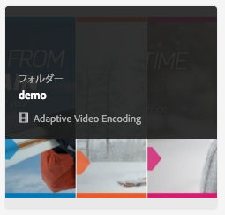
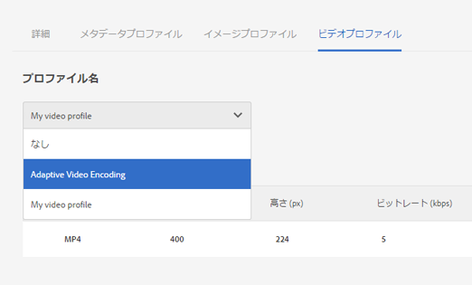
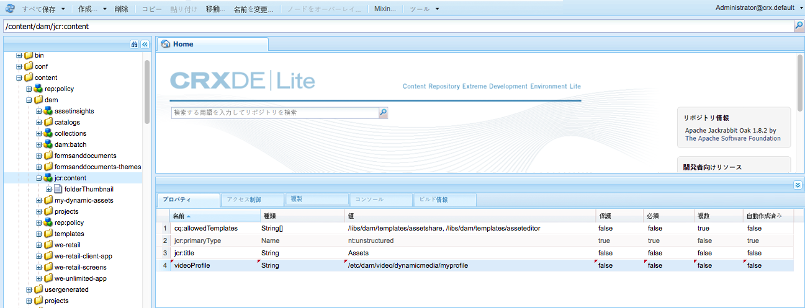

# Dynamic Media video profiles {#video-profiles}

Dynamic Media には、事前定義済みのアダプティブビデオエンコーディングプロファイルが最初から付属しています。この標準提供プロファイルの設定は、ユーザーができる限り最高の閲覧エクスペリエンスを得られるように最適化されています。アダプティブビデオエンコーディングプロファイルを使用してマスタービデオをエンコーディングすると、再生中にビデオプレーヤーによって、顧客のインターネット接続速度に応じてビデオストリームの品質が自動調整されます。これがアダプティブストリーミングと呼ばれるものです。

ビデオの品質を決めるその他の要因には、次のようなものがあります。

* **アップロードされたマスタービデオの解像度**

   MP4 ビデオが 240p、360p などの低い解像度で録画された場合、高画質でストリーミングすることはできません。

* **ビデオプレーヤーのサイズ**

   By default, the **[!UICONTROL Width]** in the Adaptive Video Encoding profile is set to **[!UICONTROL Auto]**. 再生中は、プレーヤーのサイズに応じた最適な品質が使用されます。

[ビデオエンコーディングのベストプラクティス](video.md#best-practices-for-encoding-videos)も参照してください。

>[!NOTE]
>
>ビデオのメタデータと関連するビデオ画像サムネールを生成するためには、ビデオ自体に対して Dynamic Media のエンコーディングプロセスを実行する必要があります。AEM では、Dynamic Media を有効にしていて、ビデオ Cloud Services を設定している場合は、**[!UICONTROL Dynamic Media エンコーディングビデオ]**&#x200B;ワークフローによってビデオがエンコードされます。このワークフローは、ワークフローの処理履歴とエラー情報を取り込みます。
>
>詳しくは、[ビデオエンコーディングと YouTube への公開の進行状況の監視](video.md#monitoring-video-encoding-and-youtube-publishing-progress)を参照してください。If you have enabled Dynamic Media and set up video cloud services, the **[!UICONTROL Dynamic Media Encode Video]** workflow automatically takes effect when you upload a video. （Dynamic Media を使用していない場合は、**[!UICONTROL DAM アセットの更新]**&#x200B;ワークフローが有効になります）。
>
>メタデータは、アセットの検索時に役に立ちます。サムネールは、エンコーディング中に生成される静的なビデオ画像です。They are required by the AEM system and used in the user interface to help you visually identify videos in the **[!UICONTROL Cards View]**, **[!UICONTROL Search Results]** view, and the **[!UICONTROL Asset List]** view. You can see the generated thumbnails when you tap the **[!UICONTROL Renditions]** icon (a painter&#39;s palette) of an encoded video.

ビデオプロファイルの作成が完了したら、そのプロファイルを 1 つまたは複数のフォルダーに適用します。[ビデオプロファイルのフォルダーへの適用](#applying-a-video-profile-to-folders)を参照してください。

他のアセットタイプへの高度な処理パラメーターの定義については、[アセット処理の設定](config-dms7.md#configuring-asset-processing)を参照してください。

## アダプティブビデオエンコーディングプリセット {#adaptive-video-encoding-presets}

次の表に、モバイルデバイス、タブレットデバイスおよびデスクトップコンピューターへのアダプティブビデオストリーミングにおけるベストプラクティスとなるエンコーディングプロファイルを示します。これらのプリセットは、任意の縦横比のビデオで使用できます。

<table> 
 <tbody> 
  <tr> 
   <td><strong>ビデオ形式のコーデック</strong></td> 
   <td><strong>ビデオサイズ - 幅（px）</strong></td> 
   <td><strong>ビデオサイズ - 高さ（px）</strong></td> 
   <td><strong>縦横比を保持しますか？</strong></td> 
   <td><strong>ビデオビットレート（Kbps）</strong></td> 
   <td><strong>ビデオフレームレート（fps）</strong></td> 
   <td><strong>オーディオコーデック</strong></td> 
   <td><strong>オーディオビットレート（Kbps）</strong></td> 
  </tr> 
  <tr> 
   <td>
MP4 H.264（mp4）
 </td> 
   <td>auto</td> 
   <td>360</td> 
   <td>はい</td> 
   <td>730</td> 
   <td>30</td> 
   <td>Dolby HE-AAC</td> 
   <td>128</td> 
  </tr> 
  <tr> 
   <td>
MP4 H.264（mp4）
 </td> 
   <td>auto</td> 
   <td>540</td> 
   <td>はい</td> 
   <td>2,000  </td> 
   <td>30</td> 
   <td>Dolby HE-AAC</td> 
   <td>128</td> 
  </tr> 
  <tr> 
   <td>
MP4 H.264（mp4）
 </td> 
   <td>auto</td> 
   <td>720  </td> 
   <td>はい</td> 
   <td>3000  </td> 
   <td>30</td> 
   <td>Dolby HE-AAC</td> 
   <td>128</td> 
  </tr> 
 </tbody> 
</table>

## Creating a Dynamic Media video encoding profile for adaptive streaming {#creating-a-video-encoding-profile-for-adaptive-streaming}

Dynamic Media には、最高の閲覧エクスペリエンスを実現できるよう最適化された、事前定義済みのアダプティブビデオエンコーディングプロファイル（MP4 H.264 向けのビデオアップロード設定のグループ）が付属しています。ビデオのアップロード時にこのプロファイルを使用できます。

この事前定義済みプロファイルがニーズに合わない場合は、独自のアダプティブビデオエンコーディングプロファイルを作成することもできます。When you use the setting **[!UICONTROL Encode for adaptive streaming]**–*a best practice*– all encoding presets that you add to the profile are validated to ensure that all videos have the same aspect ratio. さらに、エンコーディングされたビデオは、ストリーミング向けの複数ビットレート設定として扱われます。

ビデオエンコーディングプロファイルの作成時に、ユーザー補助の目的で、ほとんどのエンコーディングオプションに対して推奨されるデフォルト設定があらかじめ入力されます。ただし、推奨されるデフォルト値以外の値を選択する場合は、再生中にビデオ品質が低下したり、その他のパフォーマンス問題が発生したりする可能性があることに注意してください。

プロファイル内のすべての MP4 H.264 ビデオエンコーディングプリセットで、次の値について、プロファイル内の個々のエンコーディングプリセットで同じ値が使用され、アダプティブストリーミングを実行できることが検証されます。

* ビデオ形式のコーデック - MP4 H.264（.mp4）
* オーディオコーデック
* オーディオビットレート
* 縦横比を保持
* 2 パスエンコーディング
* 固定ビットレート
* H264 プロファイル
* オーディオのサンプリングレート

値が異なる場合も、プロファイルの作成をそのまま続行できますが、アダプティブストリーミングは実行できなくなることに注意してください。ユーザーには単一ビットレートのストリーミングが示されます。プロファイル内の個々のエンコーディングプリセットで同じ値を使用するようにエンコーディング設定を編集することをお勧めします(Note that the video profile/preset editor should enforce parity of the adaptive video encoding settings if **[!UICONTROL Encode for adaptive streaming]** is enabled.)

[プログレッシブストリーミング用のビデオエンコーディングプロファイルの作成](#creating-a-video-encoding-profile-for-progressive-streaming)も参照してください。

[ビデオエンコーディングのベストプラクティス](video.md#best-practices-for-encoding-videos)も参照してください。

他のアセットタイプへの高度な処理パラメーターの定義については、[アセット処理の設定](config-dms7.md#configuring-asset-processing)を参照してください。

ビデオプロファイルの作成が完了したら、1つまたは複数のフォルダにビデオフォルダを適用します。

**アダプティブストリーミング用のダイナミックメディアビデオエンコーディングプロファイルを作成するには**:

1. Tap or click the AEM logo and navigate to **[!UICONTROL Tools > Assets > Video Profiles]**.
1. 「**[!UICONTROL 作成]**」をタップクリックして、新しいビデオプロファイルを追加します。

1. プロファイルの名前と説明を入力します。
1. 「**[!UICONTROL アダプティブストリーミング用にエンコーディング]**」チェックボックスがオンになっている（デフォルト）ことを確認します。
1. 「**[!UICONTROL ビデオエンコーディングプリセットを追加]**」をタップします。
1. 「**[!UICONTROL 基本]**」タブで、ビデオとオーディオのオプションを設定します。

   各オプションの横にある情報アイコンをタップすると、追加の説明や、選択したビデオ形式のコーデックに応じた推奨設定が表示されます。

1. 「ビデオサイズ」ヘッダーの下で、「**[!UICONTROL 縦横比を保持]**」チェックボックスがオンになっていることを確認します。
1. ビデオフレームサイズの解像度をピクセル単位で設定します。**[!UICONTROL auto]** 値を使用すると、ソースの縦横比（幅と高さの比率）に合わせて自動的に拡大／縮小されます。例えば、「auto x 480」や「640 x auto」のようになります。

   次のいずれかの操作をおこないます。

   * 「**[!UICONTROL 幅]**」フィールドに「**[!UICONTROL auto]**」と入力します。「**[!UICONTROL 高さ]**」フィールドに値をピクセル単位で入力します。
   * To help you visualize the size of the video, tap the **[!UICONTROL Information]** icon (i) to the right of **[!UICONTROL Height]** to open the **[!UICONTROL Size Calculator]** page. **[!UICONTROL サイズ計算ツール]**&#x200B;を使用して、必要なビデオサイズ（青のボックスで表示）を設定します。完了したら、右上隅の「**[!UICONTROL X]**」をタップします。

1. （オプション）「**[!UICONTROL 詳細]**」タブをタップし、「**[!UICONTROL デフォルト値を使用]**」チェックボックスがオンになっている（推奨）ことを確認します。または、ビデオおよびオーディオの詳細設定を変更します。
1. ページの右上隅の「**[!UICONTROL 保存]**」をタップして、プリセットを保存します。
1. 次のいずれかの操作をおこないます。

   * 手順 5～10 を繰り返して、その他のエンコーディングプリセットを作成します。（アダプティブビデオストリーミングの場合は、複数のビデオプリセットが必要です）。
   * ページの右上隅の「**[!UICONTROL 保存]**」をもう一度タップして、プロファイルを保存します。

## エンコーディングジョブの進行状況の監視 {#monitoring-the-progress-of-an-encoding-job}

ビデオエンコーディングジョブの進行状況を目視で監視できるように、処理インジケーター（進行状況バー）が表示されます。

`error.log` ファイルで、エンコーディングジョブの進行状況を監視し、エンコーディングが完了したか、またはジョブのエラーが発生したかを確認することもできます。`error.log` は、AEM インスタンスのインストール先の `logs` フォルダーにあります。

## Creating a Dynamic Media video encoding profile for progressive streaming {#creating-a-video-encoding-profile-for-progressive-streaming}

「**[!UICONTROL アダプティブストリーミング用にエンコーディング]**」オプションを使用しない場合は、プロファイルに追加されるすべてのエンコーディングプリセットが、単一ビットレートのストリーミングまたはプログレッシブビデオ配信用の個々のビデオレンディションとして扱われることに注意してください。また、すべてのビデオレンディションが同じ縦横比であることを確認するための検証は実行されません。

実行しているモードに応じて、サポートされるビデオ形式のコーデックは次のようになります。

* ダイナミックメディア —Scene7モード： H.264 (.mp4)
* ダイナミックメディアハイブリッドモード： H.264 (.mp4)、WebM

[アダプティブストリーミング用のビデオエンコーディングプロファイルの作成](#creating-a-video-encoding-profile-for-adaptive-streaming)も参照してください。

[ビデオエンコーディングのベストプラクティス](video.md#best-practices-for-encoding-videos)も参照してください。

他のアセットタイプへの高度な処理パラメーターの定義については、[アセット処理の設定](config-dms7.md#configuring-asset-processing)を参照してください。

ビデオプロファイルの作成が完了したら、1つまたは複数のフォルダにビデオフォルダを適用します。

**プログレッシブストリーミング用のダイナミックメディアビデオエンコーディングプロファイルを作成するには：**

1. AEM のロゴをタップし、**[!UICONTROL ツール／Assets／ビデオプロファイル]**&#x200B;に移動します。
1. 「**[!UICONTROL 作成]**」をタップクリックして、新しいビデオプロファイルを追加します。
1. プロファイルの名前と説明を入力します。
1. Clear the **[!UICONTROL Encode for adaptive streaming]** check box.
1. 「**[!UICONTROL ビデオエンコーディングプリセットを追加]**」をタップします。
1. 「**[!UICONTROL 基本]**」タブで、ビデオとオーディオのオプションを設定します。

   Tap the **[!UICONTROL Information]** icon next to each option for additional descriptions or recommended settings based on the selected video format codec.

1. (Optional) Under the **Video Size** heading, uncheck **[!UICONTROL Keep aspect ratio]**.
1. In the **[!UICONTROL Width]** field, enter **[!UICONTROL auto]**; to the right of the **[!UICONTROL Height]** field, tap the **[!UICONTROL Information]** icon. **[!UICONTROL サイズ計算ツール]**&#x200B;ページを使用して、必要なビデオのサイズ（青いボックス）を設定します。完了したら、「**[!UICONTROL X]**」をタップします。
1. （オプション）次のいずれかの操作をおこないます。

   * 「**[!UICONTROL 詳細]**」タブをタップし、「**[!UICONTROL デフォルト値を使用]**」チェックボックスがオンになっている（推奨）ことを確認します。
   * 「**[!UICONTROL デフォルト値を使用]**」チェックボックスをオフにして、必要なビデオ設定とオーディオ設定を指定します。

      Tap the **[!UICONTROL Information]** icon next to each option for additional descriptions or recommended settings based on the selected video format codec.

1. ページの右上隅の「**[!UICONTROL 保存]**」をタップして、プリセットを保存します。
1. 次のいずれかの操作をおこないます。

   * 手順 5～10 を繰り返して、その他のエンコーディングプリセットを作成します。
   * ページの右上隅の「**[!UICONTROL 保存]**」をタップして、プロファイルを保存します。

## カスタムで追加するビデオエンコーディングパラメーターの使用 {#using-custom-added-video-encoding-parameters}

AEM でビデオプロファイルを作成または編集する際にはユーザーインターフェイスに表示されない、高度なビデオエンコーディングパラメーターを利用して、既存のビデオエンコーディングプロファイルを編集できます。You custom add one or more advanced parameters—such as **[!UICONTROL minBitrate]** and **[!UICONTROL maxBitrate]**—to your existing profile.

**カスタムで追加するビデオエンコーディングパラメーターを使用するには**：

1. AEM のロゴをタップして、**[!UICONTROL ツール／一般／CRXDE Lite]** に移動します。
1. **[!UICONTROL CRXDE Lite]** ページの左側の **[!UICONTROL Explorer]** パネルで、次の場所に移動します。

   `/conf/global/settings/dam/dm/presets/video/*name_of_video_encoding_profile_to_edit*`

1. In the panel on the lower-right side of the page, from the **[!UICONTROL Properties]** tab, specify the **[!UICONTROL Name]**, **[!UICONTROL Type]**, and **[!UICONTROL Value]** of the parameter you want to use.

   以下の高度なパラメーターを使用できます。

   <table> 
    <tbody> 
    <tr> 
    <td><strong>名前</strong></td> 
    <td><strong>説明</strong>  </td> 
    <td><strong>型</strong>  </td> 
    <td><strong>値</strong></td> 
    </tr> 
    <tr> 
    <td><code>h264Level</code></td> 
    <td>エンコーディングに使用する H.264 レベル。通常、この値は、使用しているエンコーディング設定に基づいて自動的に決定されます。</td> 
    <td><code>String</code></td> 
    <td>
H.264 レベルの 10 倍の数値
 
（例えば、3.0 の場合は 30、1.3 の場合は 13 のように指定します）
 
デフォルト値はありません。
 </td> 
    </tr> 
    <tr> 
    <td><code>keyframe</code></td> 
    <td>キーフレーム間のターゲットフレーム数。2～10 秒ごとにキーフレームが生成されるようにこの値を計算します。例えば、1 秒あたり 30 フレームの場合、キーフレーム間隔は 60～300 にします。  キーフレーム間隔を短くすると、アダプティブビデオエンコーディングでストリームのシークと切り替えの動作が向上し、動きの多いビデオの画質も向上します。ただし、キーフレームが増えるとファイルのサイズも増えるので、通常、キーフレーム間隔を短くすると、特定のビットレートでの全体的なビデオの画質は低下します。</td> 
    <td><code>String</code></td> 
    <td>
正の数。
 
初期設定は 300 です。
 
HLS（HTTP ライブストリーミング）の推奨値は 60～90 です。
 </td> 
    </tr> 
    <tr> 
    <td><code>minBitrate</code></td> 
    <td>
可変ビットレートエンコーディングに可能な最小ビットレート（Kbps）。
 
このパラメーターは、ビデオエンコーディングプロファイルを作成または編集するときに「詳細」タブで「<strong>固定ビットレートを使用</strong>」の選択をオフにした場合にのみ適用されます。
 
<a href="/help/assets/video.md#bitrate">ビットレート</a>も参照してください。
 </td> 
    <td><code>String</code></td> 
    <td>
正の数（Kbps）。
 
デフォルト値はありません。
 </td> 
    </tr> 
    <tr> 
    <td><code>maxBitrate</code></td> 
    <td>
可変ビットレートエンコーディングに可能な最大ビットレート（Kbps）。
 
このパラメーターは、ビデオエンコーディングプロファイルを作成または編集するときに「詳細」タブで「<strong>固定ビットレートを使用</strong>」の選択をオフにした場合にのみ適用されます。
 
<a href="/help/assets/video.md#bitrate">ビットレート</a>も参照してください。
 </td> 
    <td><code>String</code></td> 
    <td>
正の数（Kbps）。
 
デフォルト値はありません。ただし、推奨値は、エンコーディングのビットレートの最大 2 倍です。
 </td> 
    </tr> 
    <tr> 
    <td><code>audioBitrateCustom</code></td> 
    <td>オーディオコーデックでサポートされている場合、オーディオストリームに固定ビットレートを強制的に適用するには、値を <code>true</code> に設定します。</td> 
    <td><code>String</code></td> 
    <td>
<code>true</code>／<code>false</code>
 
デフォルトは <code>false</code> です。
 
HLS（HTTP ライブストリーミング）の推奨値は <code>false</code> です。
 
 
 </td> 
    </tr> 
    </tbody> 
   </table>

   

1. ページの右下隅付近にある「**[!UICONTROL 追加]**」をタップします。
1. 次のいずれかの操作をおこないます。

   * 手順 3 および 4 を繰り返して、ビデオエンコーディングプロファイルに別のパラメーターを追加します。
   * ページの左上隅付近にある「**[!UICONTROL すべて保存]**」をタップします。

1. **[!UICONTROL CRXDE Lite]** ページの左上隅にある「 **[!UICONTROL ホーム]** 」アイコンをタップして、AEMに戻ります。

### ダイナミックメディアビデオエンコーディングプロファイルの編集 {#editing-a-video-encoding-profile}

作成したビデオエンコーディングプロファイルを編集して、そのプロファイル内のビデオプリセットを追加、編集または削除することができます。

デフォルトでは、Dynamic Media に付属している定義済みの既製&#x200B;**[!UICONTROL アダプティブビデオエンコーディング]**&#x200B;プロファイルを編集することはできません。代わりに、プロファイルを手軽にコピーし、新しい名前で保存することができます。その後、コピーしたプロファイルで目的のプリセットを編集できます。

[ビデオエンコーディングのベストプラクティス](video.md#best-practices-for-encoding-videos)も参照してください。

他のアセットタイプへの高度な処理パラメーターの定義については、[アセット処理の設定](config-dms7.md#configuring-asset-processing)を参照してください。

**ダイナミックメディアビデオエンコーディングプロファイルを編集するには**:

1. AEM のロゴをタップし、**[!UICONTROL ツール／Assets／ビデオプロファイル]**&#x200B;に移動します。
1. On the **[!UICONTROL Video Profiles]** page, check one video profile name.
1. ツールバーの「**[!UICONTROL 編集]**」をタップします。
1. On the **[!UICONTROL Video Encoding Profile]** page, edit the name and description, as desired.
1. ベストプラクティスとしては、「**[!UICONTROL アダプティブストリーミング用にエンコーディング]**」チェックボックスは必ずオンにします。

   アダプティブストリーミングの説明を参照するには、情報アイコンをタップします（プログレッシブビデオプロファイルを編集する場合は、このチェックボックスをオンにしないでください）。

1. Under the **[!UICONTROL Video Encoding Presets]** heading, add, edit, or delete video encoding presets that make up the profile.

   Tap the **[!UICONTROL Information]** icon next to each option on the **[!UICONTROL Basic]** and **[!UICONTROL Advanced]** tabs for additional descriptions or recommended settings based on the selected video format codec.

1. ページの右上隅にある「**[!UICONTROL 保存]**」をタップします。

### ダイナミックメディアビデオエンコーディングプロファイルのコピー {#copying-a-video-encoding-profile}

1. AEM のロゴをタップし、**[!UICONTROL ツール／Assets／ビデオプロファイル]**&#x200B;に移動します。
1. On the **[!UICONTROL Video Profiles]** page, check one video profile name.
1. ツールバーの「**[!UICONTROL コピー]**」をタップします。
1. On the **[!UICONTROL Video Encoding Profile]** page, enter a new name for the profile.
1. ベストプラクティスとしては、「**[!UICONTROL アダプティブストリーミング用にエンコーディング]**」チェックボックスは必ずオンにします。アダプティブストリーミングの説明を参照するには、情報アイコンをタップします（プログレッシブビデオプロファイルをコピーする場合は、このチェックボックスをオンにしないでください）。

   Dynamic Media（ハイブリッドモード）では、WebM ビデオプリセットがビデオプロファイルに含まれている場合は、すべてのプリセットを MP4 にする必要があるので、**[!UICONTROL アダプティブストリーミング用にエンコーディング]**&#x200B;をオンにすることはできません。
1. Under the **[!UICONTROL Video Encoding Presets]** heading, add, edit, or delete video encoding presets that make up the profile.

   Tap the **[!UICONTROL Information]** icon next to each option on the **[!UICONTROL Basic]** and **[!UICONTROL Advanced]** tabs for recommended settings and descriptions.

1. ページの右上隅にある「**[!UICONTROL 保存]**」をタップします。

### ダイナミックメディアビデオエンコーディングプロファイルの削除 {#deleting-a-video-encoding-profile}

1. AEM のロゴをタップし、**[!UICONTROL ツール／Assets／ビデオプロファイル]**&#x200B;に移動します。
1. On the **[!UICONTROL Video Profiles]** page, check one or more video profile names.
1. ツールバーの「**[!UICONTROL 削除]**」をタップします。
1. 「**[!UICONTROL OK]**」をタップします。

## Applying a Dynamic Media video profile to folders {#applying-a-video-profile-to-folders}

フォルダーにビデオプロファイルを割り当てると、サブフォルダーは自動的に親フォルダーのプロファイルを継承します。つまり、フォルダーに 1 つのビデオプロファイルのみを適用すればよいことになります。そのため、アセットをアップロード、保存、使用およびアーカイブする場所のフォルダー構造については入念に検討してください。

フォルダーに異なるビデオプロファイルを割り当てた場合、新しいプロファイルが以前のプロファイルよりも優先されます。以前に存在していたフォルダーのアセットは変更されずに維持されます。新しいプロファイルは、その後にフォルダーに追加されるアセットに対して適用されます。

プロファイルが割り当てられているフォルダーは、ユーザーインターフェイスでカード名にプロファイルの名前が表示されます。

ビデオプロファイルは、特定のフォルダーに適用することも、すべてのアセットに全体的に適用することもできます。

### 特定のフォルダーへのビデオプロファイルの適用 {#applying-video-profiles-to-specific-folders}

**[!UICONTROL ツール]**&#x200B;メニュー内からフォルダーにビデオプロファイルを適用するか、またはフォルダー内にいる場合は「**[!UICONTROL プロパティ]**」から適用します。この節では、フォルダーにビデオプロファイルを適用するこれら両方の方法について説明します。

既にプロファイルが割り当てられているフォルダーには、フォルダー名のすぐ下にプロファイルの名前が表示されます。

#### Applying Dynamic Media video profiles to folders from Profiles user interface {#applying-video-profiles-to-folders-from-profiles-user-interface}

1. AEM のロゴをタップし、**[!UICONTROL ツール／Assets／ビデオプロファイル]**&#x200B;に移動します。
1. 1 つまたは複数のフォルダーに適用するビデオプロファイルを選択します。
1. 「**[!UICONTROL プロファイルをフォルダーに適用]**」をタップし、新たにアップロードされたアセットを受け取る 1 つまたは複数のフォルダーを選択して、「**[!UICONTROL 適用]**」をタップします。既にプロファイルが割り当てられているフォルダーには、フォルダー名のすぐ下にプロファイルの名前が表示されます。

#### Applying Dynamic Media video profiles to folders from Properties {#applying-video-profiles-to-folders-from-properties}

1. Tap the AEM logo and navigate to **[!UICONTROL Assets]** and then to the folder that you want to apply a video profile to.
1. チェックマークをタップして対象のフォルダーを選択し、「**[!UICONTROL プロパティ]**」をタップします。
1. Select the **[!UICONTROL Video Profiles]** tab and select the profile from the drop-down menu and tap **[!UICONTROL Save &amp; Close]**. 既にプロファイルが割り当てられているフォルダーには、フォルダー名のすぐ下にプロファイルの名前が表示されます。

   

### ダイナミックメディアビデオプロファイルのグローバルな適用 {#applying-a-video-profile-globally}

特定のフォルダーにプロファイルを適用できるだけでなく、グローバルにプロファイルを適用することもできます。これにより、AEM Assets にアップロードされている、すべてのフォルダー内にあるすべてのコンテンツに、選択したプロファイルを適用できます。

**ダイナミックメディアビデオプロファイルをグローバルに適用するには**:

1. CRXDE Lite で、`/content/dam/jcr:content` ノードに移動します。
1. videoProfile追加プロパティ： ****`/etc/dam/video/dynamicmedia/<name_of_video_encoding_profile>`
1. 「**[!UICONTROL すべて保存]**」をタップします。

## Removing a Dynamic Media video profile from folders {#removing-a-video-profile-from-folders}

フォルダーからビデオプロファイルを削除すると、サブフォルダーは自動的に親フォルダーのプロファイルの削除状態を継承します。ただし、フォルダー内で実行されたファイルの処理はそのまま維持されます。

**[!UICONTROL ツール]**&#x200B;メニュー内から、またはフォルダー内にいる場合は「**[!UICONTROL フォルダー設定]**」から、フォルダーのビデオプロファイルを削除できます。この節では、両方の方法でフォルダーからビデオプロファイルを削除する方法について説明します。

### Removing Dynamic Media video profiles from folders by way of Profiles user interface {#removing-video-profiles-from-folders-via-profiles-user-interface}

1. AEM のロゴをタップし、**[!UICONTROL ツール／Assets／ビデオプロファイル]**&#x200B;に移動します。
1. 1 つまたは複数のフォルダーから削除するビデオプロファイルを選択します。
1. Tap **[!UICONTROL Remove Profile from Folder(s)]** and select the folder or multiple folders you want use to remove the profile from and tap **[!UICONTROL Remove]**.

   名前がフォルダー名の下に表示されなくなっていることで、ビデオプロファイルがフォルダーに適用されていないことを確認できます。

### Removing Dynamic Media video profiles from folders by way of Properties {#removing-video-profiles-from-folders-via-properties}

1. Tap the AEM logo and navigate to **[!UICONTROL Assets]** and then to the folder that you want to remove a video profile from.
1. チェックマークをタップして対象のフォルダーを選択し、「**[!UICONTROL プロパティ]**」をタップします。
1. Select the **[!UICONTROL Video Profiles]** tab and select **[!UICONTROL None]** from the drop-down menu and tap **[!UICONTROL Save &amp; Close]**. 既にプロファイルが割り当てられているフォルダーには、フォルダー名のすぐ下にプロファイルの名前が表示されます。

