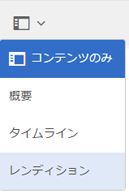
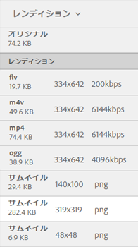

# ビデオレンディション {#video-renditions}

Adobe Experience Manager Assets は、OGG、FLV など、様々な形式のビデオアセット用のビデオレンディションを生成します。

AEM Assets では、メディアアセットの静的レンディションと動的レンディション（DM エンコードされたレンディション）がサポートされています。

静的レンディションは、FFMPEG（システムパスにインストールされ、使用できるもの）を使用してネイティブに生成され、コンテンツリポジトリに保存されます。

DM エンコードされたレンディションは、プロキシサーバーに保存され、実行時に提供されます。

AEM Assets では、クライアント側でのこのようなレンディションの再生をサポートしています。

特定のビデオアセットのレンディションを表示するには、アセットのページを開いて、グローバルナビゲーションアイコンをタップします。次に、リストから「**[!UICONTROL レンディション]**」を選択します。

ビデオレンディションのリストが&#x200B;**[!UICONTROL レンディション]**&#x200B;パネルに表示されます。

DM エンコードされたレンディションのプロキシサーバーを設定するには、[Dynamic Media クラウドサービス](config-dynamic.md)を設定します。

必要なパラメーターを指定してビデオレンディションを生成するには、[対応するビデオプロファイルを作成](video-profiles.md)します。

プロキシサーバーを設定し、ビデオプロファイルを作成したら、このビデオプリセットを処理プロファイルに追加して、その処理プロファイルをフォルダーに適用することができます。

>[!NOTE]
>
>Internet Explorer 11 では、OGG および WAV ファイルのオーディオは再生できません。拡張子 OGG または WAV を持つアセットの場合、アセットの詳細ページに「無効なソース」というエラーメッセージが表示されます。
>
>MS Edge および iPad では、OGG ファイルは再生できません。サポートされていない形式であるというエラーが表示されます。
