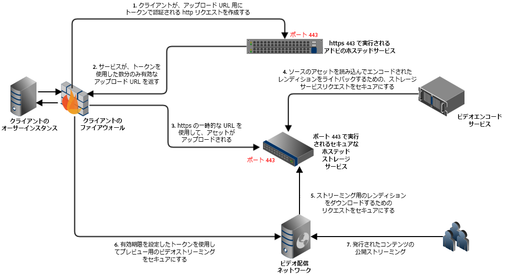
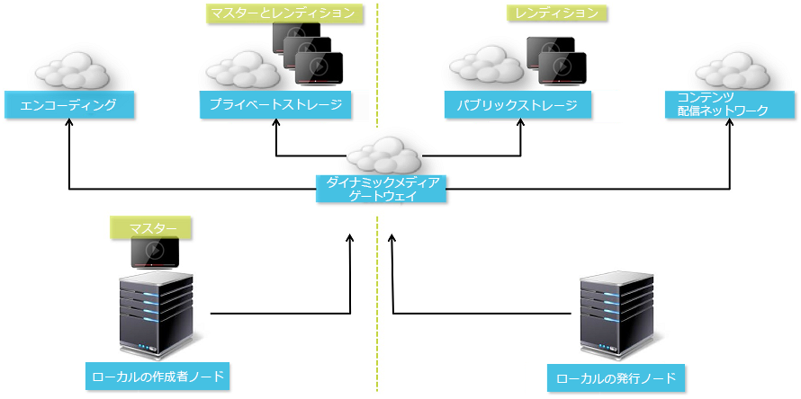
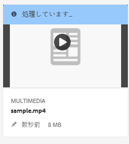
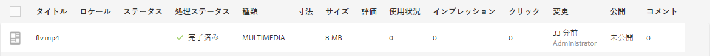
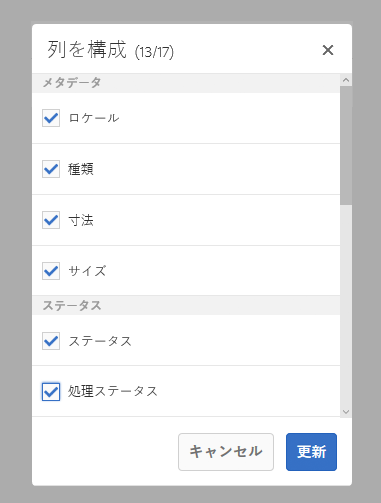
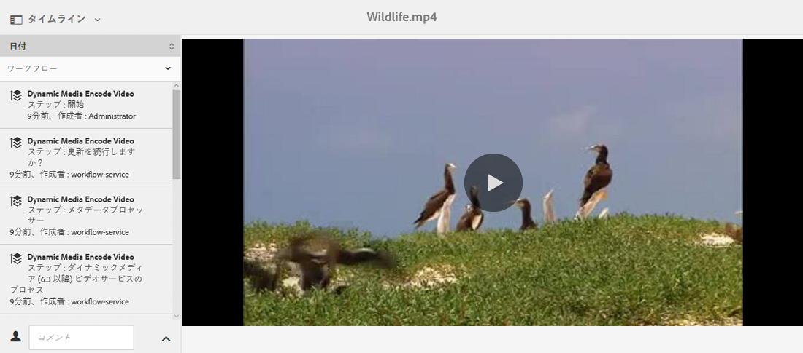
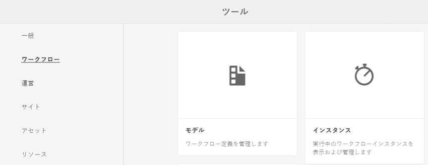
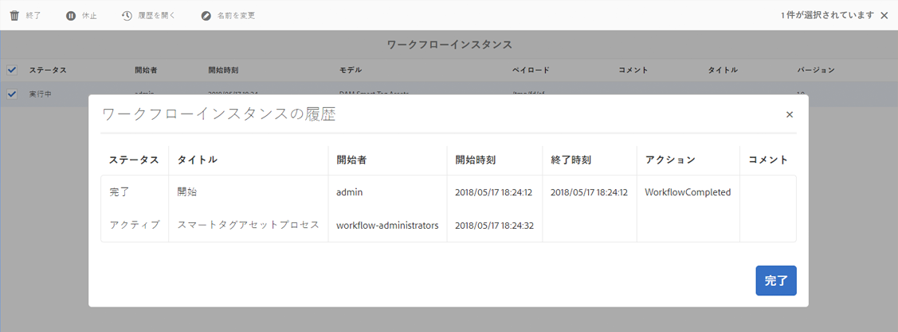
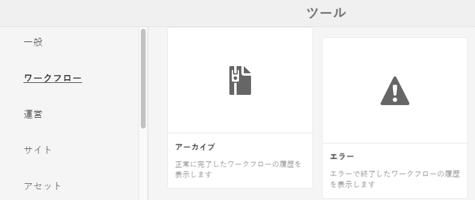
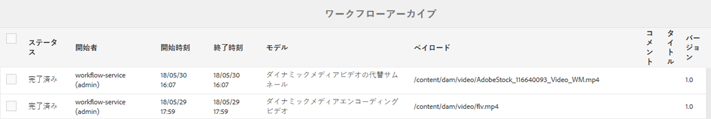

# ビデオ {#video}

ここでは、Dynamic Media でのビデオの操作について説明します。

## クイックスタート：ビデオ {#quick-start-videos}

次のワークフローの手順説明は、Dynamic Media 内のアダプティブビデオセットをすぐに使い始めることを目的としたものです。各手順に続いて、詳しい説明のあるトピックの見出しへのリンクが記載されています。

>[!NOTE]
>
>Dynamic Media のビデオを操作する前に、AEM 管理者が既に Dynamic Media Cloud Services を有効にして設定を完了していることを確認してください。
>
>* 詳しくは、 [Dynamic MediaCloud Servicesの設定 (Dynamic Media — ハイブリッドモードの設定 )](/help/assets/config-dynamic.md)
>* 詳しくは、 [Dynamic Media - Scene7モードの設定](config-dms7.md) および [Dynamic Media - Scene7モードのトラブルシューティング](troubleshoot-dms7.md)
>


1. 次の手順を実行して、**Dynamic Media ビデオをアップロード**&#x200B;します。

   * 独自のビデオエンコーディングプロファイルを作成します。または、Dynamic Mediaに付属している事前定義済みの「アダプティブビデオエンコーディング」プロファイルを使用することもできます。

      * [ビデオエンコーディングプロファイルの作成](video-profiles.md)
      * [ビデオエンコーディングのベストプラクティス](#best-practices-for-encoding-videos)に関する詳細
   * ビデオ処理プロファイルを、マスタービデオのアップロード先となる 1 つ以上のフォルダーに関連付けます。

      * [フォルダーへのビデオプロファイルの適用](video-profiles.md#applying-a-video-profile-to-folders).
      * 詳しくは、[処理プロファイルを使用するためのデジタルアセットの整理におけるベストプラクティス](organize-assets.md#organize-using-folders)を参照してください。
      * [デジタルアセットの整理](organize-assets.md)に関する詳細
   * フォルダーにプライマリソースビデオをアップロードします。フォルダーにビデオを追加すると、そのフォルダーに割り当てたビデオ処理プロファイルに従ってビデオがエンコードされます。

      * Dynamic Media では、最大長 30 分、最小解像度が 25 x 25 を超える短い形式のビデオが主にサポートされています。
      * 15 GB までのビデオファイルをアップロードできます。
      * [ビデオをアップロードします](managing-video-assets.md#uploading-and-previewing-video-assets)。
      * 詳しくは、[サポートされる入力ファイル形式](assets-formats.md#supported-multimedia-formats)を参照してください。
   * アセットビューまたはワークフロービューから[ビデオエンコーディングの進捗](#monitoring-video-encoding-and-youtube-publishing-progress)を監視します。


1. 次のいずれかの操作を行って、**Dynamic Media ビデオを管理します**。

   * ビデオアセットの整理、参照、検索

      * [デジタルアセットの編成](organize-assets.md)

         詳細情報： [処理プロファイルを使用するためのデジタルアセット編成のベストプラクティス](organize-assets.md#organize-using-folders)

      * [ビデオアセットの検索](search-video-assets.md)または[アセットの検索](managing-assets-touch-ui.md#searching-assets)。
   * ビデオアセットをプレビューして公開します。

      * ソースビデオとビデオのエンコードされたレンディションを、関連するサムネールと共に表示します。

         [ビデオのプレビュー](managing-video-assets.md#uploading-and-previewing-video-assets)または[アセットのプレビュー](previewing-assets.md)。

         [ビデオレンディションの表示](video-renditions.md)

[ビデオレンディションの管理。](managing-assets-touch-ui.md#managing-renditions)

      * [ビューアプリセットの管理](managing-viewer-presets.md)
      * [アセットの公開](publishing-dynamicmedia-assets.md)
   * ビデオのメタデータを操作します。

      * フレームレート、オーディオおよびビデオのビットレート、コーデックなど、エンコードされたビデオレンディションのプロパティを表示します。

         [ビデオレンディションのプロパティの表示](video-renditions.md)

      * タイトル、説明、タグ、カスタムメタデータフィールドなど、ビデオのプロパティを編集します。

[ビデオのプロパティの編集](managing-assets-touch-ui.md#editing-properties)

      * [デジタルアセット用のメタデータの管理](metadata.md)
      * [メタデータスキーマ](metadata-schemas.md)
   * ビデオのレビュー、承認、注釈の付け

      * [ビデオへの注釈](managing-video-assets.md#annotating-video-assets)または[アセットへの注釈](managing-assets-touch-ui.md#annotating)
      * [アセットへのワークフローの適用](assets-workflow.md) または [アセットでのワークフローの開始](managing-assets-touch-ui.md#starting-a-workflow-on-an-asset)
      * [フォルダーのアセットのレビュー](bulk-approval.md)
      * [プロジェクト](/help/sites-authoring/projects.md)


1. 次のいずれかの操作を行って、**Dynamic Media ビデオを公開します**。

   * Adobe Experience Managerを Web コンテンツ管理システムとして使用している場合、Web ページに直接ビデオを追加できます。

      * [Web ページへのビデオの追加](adding-dynamic-media-assets-to-pages.md)
   * サードパーティの Web コンテンツ管理システムを使用している場合、Web ページにビデオをリンクするか、ビデオを埋め込むことができます。

      * URL を使用したビデオの統合：

         [Web アプリケーションへの URL のリンク](linking-urls-to-yourwebapplication.md)。
      * Web ページの埋め込みコードを使用したビデオの統合：

         [Web ページへのビデオビューアの埋め込み](embed-code.md)。
   * [YouTube にビデオを公開します](#publishing-videos-to-youtube)。
   * [ビデオレポートを生成します](#viewing-video-reports)。
   * [ビデオへのキャプションの追加](#adding-captions-to-video).


## Dynamic Media でのビデオの操作 {#working-with-video-in-dynamic-media}

Dynamic Media のビデオは、高品質のアダプティブビデオを簡単に公開して、デスクトップ、iOS、Android、Blackberry、Windows などのモバイルデバイスを含む複数の画面にストリーミングするためのエンドツーエンドのソリューションです。アダプティブビデオセットでは、同じビデオを、400 kbps、800 kbps、1000 kbps などの様々なビットレートと形式でエンコードしたバージョンにグループ分けします。デスクトップコンピューターまたはモバイルデバイスによって、利用可能な帯域幅が検出されます。

例えば、iOS モバイルデバイスでは、3G、4G、Wi-Fi などの帯域幅が検出されます。次に、アダプティブビデオセット内の様々なビデオビットレートの中から、適切なエンコード済みビデオが自動的に選択されます。ビデオはデスクトップ、モバイルデバイスまたはタブレットにストリーミングされます。

また、デスクトップまたはモバイルデバイスでネットワークの状態が変化した場合は、ビデオ画質が自動的に動的に切り替わります。また、顧客がデスクトップでフルスクリーンモードに移行した場合、アダプティブビデオセットはより高い解像度を使用して応答し、顧客の表示エクスペリエンスを向上させます。 アダプティブビデオセットを使用すると、Dynamic Media ビデオを複数の画面やデバイスで再生する顧客に最適な再生を提供できます。

どのエンコードされたビデオを再生するか、または再生中に選択するかを決定するためにビデオプレーヤーが使用するロジックは、次のアルゴリズムに基づいています。

1. ビデオプレーヤーは、プレーヤー自体の「初期ビットレート」に設定されている値に最も近いビットレートに基づいて、初期ビデオフラグメントを読み込みます。
1. 次の条件を使用して、帯域幅の速度の変化に応じてビデオプレーヤーが切り替わります。

   1. プレーヤーは、推定帯域幅を越えない範囲で最大帯域幅のストリームを選択します。
   1. プレーヤーは、使用可能な帯域幅の 80％ほどを見積もります。ただし、使用可能な帯域幅が上昇した場合は、帯域幅を大きく見積もりすぎてすぐに元の帯域幅に戻ることを防ぐために、より控えめな 70％ほどの見積もりとなります。

アルゴリズムの技術情報について詳しくは、[https://android.googlesource.com/platform/frameworks/av/+/master/media/libstagefright/httplive/LiveSession.cpp](https://android.googlesource.com/platform/frameworks/av/+/master/media/libstagefright/httplive/LiveSession.cpp) を参照してください。

単一のビデオとアダプティブビデオセットの管理では、次の機能がサポートされています。

* 多数のサポートされるビデオ形式およびオーディオ形式からのビデオのアップロードと、複数の画面での再生用に MP4 H.264 形式へのビデオのエンコーディング。 事前定義済みのアダプティブビデオプリセット、または単一のビデオエンコーディングプリセットを使用するか、独自のエンコーディングをカスタマイズしてビデオの品質とサイズを制御することができます。

   * 生成されるアダプティブビデオセットには、MP4 ビデオが含まれます。
   * **メモ**：プライマリビデオ（ソースビデオ）はアダプティブビデオセットには追加されません。

* すべての HTML5 ビデオビューアーでビデオキャプションを追加します。
* ビデオアセットを効率的に管理するための完全なメタデータサポートを使用して、ビデオを整理、参照および検索します。
* Web やデスクトップおよびモバイルデバイス（iPhone、iPad、Android、Blackberry および Windows Phone を含む）へのアダプティブビデオセットの配信。

アダプティブビデオのストリーミングは、各種 iOS プラットフォームでサポートされています。詳しくは、 [Adobeビューアリファレンスガイド](https://experienceleague.adobe.com/docs/dynamic-media-developer-resources/library/homeviewers.html?lang=ja).

Dynamic Media では、MP4 H.264 ビデオのモバイルビデオ再生がサポートされています。このビデオ形式をサポートする Blackberry デバイスについては、[Blackberry でサポートされているビデオ形式](https://support.blackberry.com/kb/articleDetail?ArticleNumber=000005482)のページで確認できます。

このビデオ形式をサポートする Windows デバイスは、次の場所にあります。 [Windows Phone でサポートされるビデオ形式](https://msdn.microsoft.com/library/windows/apps/ff462087%28v=vs.105%29.aspx)

* 以下を含む Dynamic Media ビデオビューアープリセットを使用して、ビデオを再生します。

   * 単一のビデオビューアー
   * ビデオコンテンツと画像コンテンツの両方を組み合わせた混在メディアビューアー

* ブランド要件を満たすようにビデオプレーヤーを設定します。
* 単純な URL か埋め込みコードを使用して、ビデオを web サイト、モバイルサイトまたはモバイルアプリケーションに統合します。

<!-- See [Dynamic video playback](https://s7d9.scene7.com/s7/uvideo.jsp?asset=GeoRetail/Mop_AVS&config=GeoRetail/Universal_Video1&stageSize=640,480). -->

関連トピック [HTML5 ビューアについて](https://experienceleague.adobe.com/docs/dynamic-media-developer-resources/library/viewers-for-aem-assets-only/c-html5-aem-asset-viewers.html?lang=ja#viewers-for-aem-assets-only) (『Dynamic Mediaビューアリファレンスガイド』Adobe)。

## ベストプラクティス：HTML5 ビデオビューアの使用 {#best-practice-using-the-html-video-viewer}

Dynamic Media の HTML5 ビデオビューアプリセットは堅牢なビデオプレーヤーです。このプリセットを使用すれば、HTML5 ビデオ再生でよくある問題や、モバイルデバイスに関する問題（アダプティブストリーミング配信機能がない、デスクトップブラウザーの対応状況が限定的であるなど）の多くを回避することができます。

プレーヤーのデザイン側から見れば、ビデオプレーヤーの全機能を、標準の Web 開発ツールでデザインできます。例えば、HTML5 と CSS を使用して、ボタン、コントロールおよびカスタムのポスター画像背景をデザインして、カスタマイズした表示によって顧客に対応することができます。

ビューアの再生側では、ブラウザーのビデオ機能が自動的に検出されます。 次に、HLS ストリーミング（アダプティブビデオストリーミング）を使用してビデオを提供します。 これらの配信方法が使用できない場合は、HTML5 プログレッシブが代わりに使用されます。

HTML5 と CSS を使用して再生コンポーネントをデザインできる機能、埋め込み再生の機能、ブラウザーの機能に応じてアダプティブストリーミングまたはプログレッシブストリーミングを使用できる機能を 1 つのプレーヤーにまとめることで、リッチメディアコンテンツを配信する範囲をデスクトップユーザーとモバイルユーザーの両方に拡大して、ビデオエクスペリエンスを効率化することができます。

『Adobe ビューアリファレンスガイド』の [HTML5 ビューアについて](https://experienceleague.adobe.com/docs/dynamic-media-developer-resources/library/viewers-for-aem-assets-only/c-html5-aem-asset-viewers.html)も参照してください。

### HTML5 ビデオビューアを使用した、デスクトップコンピューターおよびモバイルデバイス上でのビデオ再生 {#playback-of-video-on-desktop-computers-and-mobile-devices-using-the-html-video-viewer}

デスクトップおよびモバイルへのアダプティブビデオストリーミングの場合、ビットレートの切り替えに使用されるビデオは、アダプティブビデオセット内のすべての MP4 ビデオに基づいています。

ビデオ再生は、HLS（HTTP ライブストリーミング）ビデオストリーミングまたはプログレッシブビデオダウンロードを使用しておこなわれます。 6.0、6.1、6.2 などのAEMの以前のバージョンでは、ビデオは HTTP 経由でストリーミングされていました。

ただし、AEM 6.3 以降では、DM ゲートウェイサービスの URL も常に HTTPS を使用するので、ビデオは HTTPS（HLS ビデオストリーミング）を介してストリーミングされるようになりました。 このデフォルトの動作では、お客様への影響はありません。 つまり、ブラウザーでサポートされていない場合を除き、ビデオストリーミングは常に HTTPS 上で行われます（次の表を参照）。したがって、

* HTTPS web サイトが HTTPS ビデオストリーミングに対応している場合は、ストリーミングが適しています。
* HTTP web サイトが HTTPS ビデオストリーミングに対応している場合は、ストリーミングが適しており、web ブラウザーから混合コンテンツに関する問題は発生しません。

HLS（HTTP ライブストリーミング）は、Appleのアダプティブビデオストリーミングの標準規格で、ネットワーク帯域幅の容量に基づいて再生を自動的に調整します。 また、ユーザーは、ビデオの残りのダウンロードを待たずに、ビデオ内の任意のポイントを「シーク」できます（HTTP ライブストリーミングも参照）。

プログレッシブビデオは、ユーザーのデスクトップ画面またはモバイルデバイスにビデオをローカルにダウンロードして保存することで配信されます。

デバイス、ブラウザーおよびデスクトップコンピューターやモバイルデバイスでの Dynamic Media ビデオビューアによるビデオの再生方法を次の表に示します。

<table> 
 <tbody> 
  <tr> 
   <td><strong>デバイス</strong></td>
   <td><strong>ブラウザー</strong></td>
   <td><strong>ビデオ再生モード</strong></td>
  </tr>
  <tr> 
   <td>デスクトップ</td>
   <td>Internate Explorer 9 および 10</td>
   <td>プログレッシブダウンロード。</td>
  </tr>
  <tr> 
   <td>デスクトップ</td>
   <td>Internate Explorer 11 以降</td>
   <td>Windows 8 および Windows 10 - HLS が要求された場合は常に HTTPS を強制的に使用します。 既知の制約事項：このブラウザー／オペレーティングシステムの組み合わせでは、HLS での HTTP は機能しません。<br /> <br /> Windows 7 - プログレッシブダウンロード。HTTP プロトコルと HTTPS プロトコルの選択に標準のロジックを使用します。</td>
  </tr>
  <tr> 
   <td>デスクトップ</td>
   <td>Firefox 23～44</td>
   <td>プログレッシブダウンロード。</td>
  </tr>
  <tr> 
   <td>デスクトップ</td>
   <td>Firefox 45 以降</td>
   <td>HLS ビデオストリーミング。</td>
  </tr>
  <tr> 
   <td>デスクトップ</td>
   <td>Chrome</td>
   <td>HLS ビデオストリーミング。</td>
  </tr>
  <tr> 
   <td>デスクトップ</td>
   <td>Safari（Mac）</td>
   <td>HLS ビデオストリーミング。</td>
  </tr>
  <tr> 
   <td>モバイル</td>
   <td>Chrome（Android 6 以前）</td>
   <td>プログレッシブダウンロード。</td>
  </tr>
  <tr> 
   <td>モバイル</td>
   <td>Chrome（Android 7 以降）</td>
   <td>HLS ビデオストリーミング。</td>
  </tr>
  <tr> 
   <td>モバイル</td>
   <td>Android（デフォルトのブラウザー）</td>
   <td>プログレッシブダウンロード。</td>
  </tr>
  <tr> 
   <td>モバイル</td>
   <td>Safari（iOS）</td>
   <td>HLS ビデオストリーミング。</td>
  </tr>
  <tr> 
   <td>モバイル</td>
   <td>Chrome（iOS）</td>
   <td>HLS ビデオストリーミング。</td>
  </tr>
  <tr> 
   <td>モバイル</td>
   <td>Blackberry</td>
   <td>HLS ビデオストリーミング。</td>
  </tr>
 </tbody>
</table>

## Dynamic Media ビデオソリューションのアーキテクチャ {#architecture-of-dynamic-media-video-solution}

次の図は、DMGateway を使用してアップロードおよびエンコードされ、一般向けに利用可能になったビデオのオーサリングワークフロー全体を示しています。



## ビデオのハイブリッド公開アーキテクチャ {#hybrid-publishing-architecture-for-videos}



## ビデオエンコーディングのベストプラクティス {#best-practices-for-encoding-videos}

Dynamic Media を有効にし、ビデオクラウドサービスを設定済みの場合、**[!UICONTROL Dynamic Media エンコードビデオ]**&#x200B;ワークフローがビデオをエンコードします。このワークフローは、ワークフローの処理履歴とエラー情報を取り込みます。詳しくは、[ビデオエンコーディングと YouTube への公開の進行状況の監視](#monitoring-video-encoding-and-youtube-publishing-progress)を参照してください。Dynamic Mediaを有効にし、ビデオクラウドサービスを設定済みの場合、 **[!UICONTROL Dynamic Media Encode Video]** ビデオをアップロードすると、ワークフローが自動的に有効になります。 （Dynamic Media を使用していない場合は、**[!UICONTROL DAM アセットの更新]**&#x200B;ワークフローが有効になります）。

<!-- DEAD ARTICLE AND VIDEO LINK The following are best-practice tips for encoding source video files.

For advice about video encoding, see the following:

* Article: *Streaming 101: The Basics — Codecs, Bandwidth, Data Rate, and Resolution:* [www.adobe.com/go/learn_s7_streaming101_en](https://www.adobe.com/go/learn_s7_streaming101_en).
* Video: *Video Encoding Basics:* [www.adobe.com/go/learn_s7_encoding_en](https://www.adobe.com/go/learn_s7_encoding_en). -->

### プライマリソースビデオファイル {#source-video-files}

ビデオファイルをエンコードする場合は、可能な限り高品質のソースビデオファイルを使用します。 以前にエンコードされたビデオファイルは使用しないでください。これらのファイルは既に圧縮されており、さらにエンコーディングすると標準を下回る品質のビデオが作成されます。

* Dynamic Media では、最大長 30 分、最小解像度が 25 x 25 を超える短い形式のビデオが主にサポートされています。
* 15 GB までのプライマリソースビデオファイルをアップロードできます。

次の表に、ソースビデオファイルをエンコードする前に推奨されるサイズ、縦横比、最小ビットレートを示します。

| サイズ | 縦横比 | 最低ビットレート |
|--- |--- |--- |
| 1024 x 768 | 4:3 | ほとんどのビデオで 4500 kbps |
| 1280 x 720 | 16:9 | ビデオ内のモーションの量に応じて 3,000～6,000 kbps。 |
| 1920 x 1080 | 16:9 | ビデオ内のモーションの量に応じて 6,000～8,000 kbps |

### ファイルのメタデータの取得 {#obtaining-a-file-s-metadata}

ファイルのメタデータを取得するには、ビデオ編集ツールを使用してメタデータを表示するか、メタデータを取得するために設計されたアプリケーションを使用します。 次に、サードパーティアプリケーションである MediaInfo を使用してビデオファイルのメタデータを取得する手順を示します。

1. この Web ページに移動： [https://mediaarea.net/en/MediaInfo](https://mediaarea.net/en/MediaInfo).
1. 使用している GUI バージョン用のインストーラを選択してダウンロードし、インストール手順に従います。
1. インストール後、ビデオファイルを右クリックし（Windows のみ）、 **[!UICONTROL MediaInfo]**&#x200B;または開く **[!UICONTROL MediaInfo]** をクリックし、ビデオファイルをアプリケーションにドラッグします。幅、高さ、fps など、ビデオファイルに関連付けられているすべてのメタデータが表示されます。

### 縦横比 {#aspect-ratio}

マスタービデオファイルのビデオエンコーディングプリセットを選択または作成する場合は、プリセットの縦横比がマスタービデオファイルと同じであることを確認します。 縦横比とは、ビデオの高さに対する幅の比率のことです。

ビデオファイルの縦横比を求めるには、ファイルのメタデータを取得し、そのファイルの幅と高さを記録します（前述のファイルのメタデータの取得を参照してください）。さらに、次の式を使用して縦横比を計算します。

*幅/高さ = 縦横比*

次の表に、数式の結果が一般的なアスペクト比に変換される方法を示します。

| 数式の結果 | 縦横比 |
|--- |--- |
| 1.33 | 4:3 |
| 0.75 | 3:4 |
| 1.78 | 16:9 |
| 0.56 | 9:16 |

例えば、幅が 1440 x 1080 のビデオの縦横比は1440/1080(1.33) です。この場合、縦横比が 4:3 のビデオエンコーディングプリセットを選択してビデオファイルをエンコードします。

### ビットレート {#bitrate}

ビットレートとは、1 秒間のビデオ再生を構成するエンコードされたデータの量です。ビットレートは、キロビット/秒（Kbps）単位で測定されます。

すべてのコーデックは非可逆圧縮を使用するので、ビットレートはビデオ画質の最も重要な要素となります。非可逆圧縮では、ビデオファイルを圧縮するほど画質が低下します。このため、他のすべての特性（解像度、フレームレートおよびコーデック）が等しいと、ビットレートが低いほど圧縮ファイルの品質が低下します。

ビットレートエンコーディングは、次の 2 つのタイプから選択できます。

* **固定ビットレートエンコーディング** (CBR)- CBR エンコーディング中は、ビットレートまたは 1 秒あたりのビット数が、エンコーディングプロセス全体で同じに保たれます。 CBR エンコーディングでは、設定されているデータレートが、ビデオ全体での設定値として使用されます。また、CBR エンコーディングでは、メディアファイルの品質は最適化されませんが、その分、空き容量の節約になります。

   ビデオ全体に同じようなモーションレベルが含まれている場合は、CBR を使用します。CBR は、ビデオコンテンツのストリーミングに最も一般的に使用されています。[カスタムで追加するビデオエンコーディングパラメーターの使用](video-profiles.md#using-custom-added-video-encoding-parameters)も参照してください。

* **可変ビットレートエンコーディング** (VBR) - VBR エンコーディングでは、圧縮形式で必要なデータに基づいて、データのレートが設定した下限から上限の範囲内で調整されます。 つまり、VBR エンコーディングプロセスでは、メディアファイルのビットレートが、そのニーズに応じて動的に増減します。

   VBR は、CBR よりエンコードに時間がかかりますが、生成されるメディアファイルは最高品質となります。VBR は、ビデオコンテンツの HTTP プログレッシブ配信に最も一般的に使用されます。

**VBR と CBR のどちらを使用するべきか** VBR と CBR のどちらを選択するべきかという話になると、ほとんどの場合、メディアファイルには VBR を使用することをお勧めします。VBR は、競争相手のビットレートでより高品質なファイルを提供します。 VBR を使用するときは、2 パスエンコーディングを使用し、最大ビットレートをターゲットビデオのビットレートの 1.5 倍に設定してください。

ビデオエンコーディングプリセットを選択するときには、ターゲットのエンドユーザーの接続速度を考慮してください。その速度の 80％のデータレートを持つプリセットを選択してください。例えば、ターゲットのエンドユーザーの接続速度が 1,000 Kbps の場合の最適なプリセットは、ビデオデータレートが 800 Kbps のプリセットです。

次の表に、一般的な接続速度のデータレートを示します。

| 速度（kbps） | 接続タイプ |
|--- |--- |
| 256 | ダイヤルアップ接続。 |
| 800 | 一般的なモバイル接続。 この接続では、3G エクスペリエンスに対して、400～最大 800 の範囲のデータレートをターゲットにします。 |
| 2,000 | 一般的なブロードバンドデスクトップ接続。この接続では、800～2,000 Kbps の範囲のデータレートがターゲットとなります。大部分のターゲットは、平均 1,200～1,500 Kbps です。 |
| 5,000 | 一般的な高ブロードバンド接続。この速度ではほとんどの消費者にビデオを配信できないので、これを範囲の上限としてエンコーディングすることはお勧めしません。 |

### 解像度 {#resolution}

**解像度**&#x200B;は、ビデオファイルの高さと幅をピクセル単位で表したものです。ほとんどのソースビデオは、1,920 x 1,080 などの高解像度で保存されます。ストリーミング用のソースビデオは、比較的低い解像度（640 x 480 以下）に圧縮されます。

解像度とデータレートは、ビデオ画質を決定する統合的な 2 つの要素です。同じビデオ画質を維持するには、ビデオファイルのピクセル数が多いほど（解像度が高いほど）、データレートを高くする必要があります。例えば、320 x 240 の解像度と 640 x 480 の解像度のビデオファイルで、フレームあたりのピクセル数を考えてみましょう。

| 解像度 | フレームあたりのピクセル数 |
|--- |--- |
| 320 x 240 | 76,800 |
| 640 x 480 | 307,200 |

640 x 480 ファイルのピクセル数は、フレームあたり 4 倍になります。この 2 つの解像度の例でデータレートを同じにするには、640 x 480 ファイルを 4 倍に圧縮します。これにより、ビデオの画質が低下する可能性があります。そのため、250 kbps のビデオデータレートの場合、320 x 240 の解像度では高画質になりますが、640 x 480 の解像度では高画質になりません。

一般に、使用するデータレートが高いほど、ビデオの外観が良くなり、使用する解像度が高いほど、（解像度が低い場合と比べて）表示品質を維持するために必要なデータレートが高くなります。

解像度とデータレートには関連があるので、ビデオをエンコードする際には次の 2 つの方法から選択できます。

* データレートを選択してから、選択したデータレートで美しく表示される最高の解像度でエンコードします。
* 解像度を選択してから、選択した解像度で高品質のビデオを配信するために必要になるデータレートでエンコードします。

マスタービデオファイルのビデオエンコーディングプリセットを選択（または作成）する場合、次の表を使用して正しい解像度をターゲットにします。

| 解像度 | 高さ（ピクセル） | 画面サイズ |
|--- |--- |--- |
| 240p | 240 | 小さい画面 |
| 300p | 300 | 小さい画面（通常はモバイルデバイス用） |
| 360p | 360 | 小さい画面 |
| 480p | 480 | 中程度の画面 |
| 720p | 720 | 大きな画面 |
| 1080p | 1080 | 高解像度の大画面 |

### Fps（1 秒あたりのフレーム数） {#fps-frames-per-second}

米国と日本では、ほとんどのビデオが 29.97 フレーム/秒（fps）で撮影されます。ヨーロッパでは、ほとんどのビデオが 25 fps で撮影されます。映画は 24 fps で撮影されます。

マスタービデオファイルの fps レートに一致するビデオエンコーディングプリセットを選択します。 例えば、マスタービデオが 25 fps の場合は、25 fps のエンコーディングプリセットを選択します。 デフォルトでは、すべてのカスタムエンコーディングでマスタービデオファイルの fps が使用されます。 そのため、ビデオエンコーディングプリセットを作成するときに、fps 設定を明示的に指定する必要はありません。

### ビデオエンコーディングのサイズ {#video-encoding-dimensions}

最適な結果を得るには、ソースビデオがすべてのエンコードされたビデオの整数倍になるようにエンコーディングのサイズを選択します。

この比率を計算するには、ソースの幅をエンコードされた幅で割って、幅の比率を求めます。次に、エンコードされた高さでソースの高さを割って、高さの比率を求めます。

結果の比率が整数の場合、ビデオは最適に縮小されています。結果の比率が整数でない場合は、余ったピクセルのアーティファクトがディスプレイに残るので、ビデオの画質に影響します。この影響は、ビデオにテキストが含まれている場合に顕著に現れます。

例えば、ソースビデオが 1920 x 1080 だとします。次の表では、エンコードされた 3 つのビデオで使用する、最適なエンコード設定を示しています。

<table> 
 <tbody> 
  <tr> 
   <th><p>ビデオタイプ</p> </th> 
   <th><p>幅 x 高さ</p> </th> 
   <th><p>幅の比率</p> </th> 
   <th><p>高さの比率</p> </th> 
  </tr>
  <tr> 
   <td><p>ソース</p> </td> 
   <td><p>1920 x 1080</p> </td> 
   <td><p>1</p> </td> 
   <td><p>1</p> </td> 
  </tr> 
  <tr> 
   <td><p>エンコード済み</p> </td> 
   <td><p>960 x 540</p> </td> 
   <td><p>2</p> </td> 
   <td><p>2</p> </td> 
  </tr> 
  <tr> 
   <td><p>エンコード済み</p> </td> 
   <td><p>640 x 360</p> </td> 
   <td><p>3</p> </td> 
   <td><p>3</p> </td> 
  </tr> 
  <tr> 
   <td><p>エンコード済み</p> </td> 
   <td><p>480 x 270</p> </td> 
   <td><p>4</p> </td> 
   <td><p>4</p> </td> 
  </tr> 
 </tbody> 
</table>

### エンコードされたビデオのファイル形式 {#encoded-video-file-format}

Dynamic Media では、MP4 H.264 ビデオエンコーディングプリセットの使用をお勧めします。MP4 ファイルは H.264 ビデオコーデックを使用するので、ビデオは高品質になるものの圧縮されたファイルサイズです。

## YouTubeへのビデオの公開 {#publishing-videos-to-youtube}

オンプレミスのAEMビデオアセットを、以前に作成したYouTubeチャネルに直接公開できます。

ビデオアセットをYouTubeに公開するには、タグを含んだAEM Assetsを設定します。 これらのタグを YouTube チャンネルに関連付けます。ビデオアセットのタグが YouTube チャンネルのタグと一致する場合、ビデオが YouTube に公開されます。ビデオアセットにタグが付いていない場合、YouTubeには公開されません。

YouTubeに公開すると、AEMの処理プロファイルシステムがバイパスされるので、ビデオエンコーディングプロファイルもバイパスされます。 YouTubeには独自のエンコーディングがあるので、ビデオ処理プロファイルは不要なので、このバイパスが発生します。 ただし、ほとんどの場合は、ビデオアセットに既にビデオ処理プロファイルを経由していることが予想されます。 ビデオ処理プロファイルをスキップしてYouTubeに直接公開する場合、AEM Asset のビデオアセットに表示可能なサムネールが表示されません。 また、Dynamic Media 実行モードでを実行する場合、エンコードされていないビデオは、Dynamic Mediaのアセットタイプのいずれでも機能しません。

ビデオアセットの YouTube サーバーへの公開において、YouTube との安全でセキュアなサーバー間認証を行うには、次のタスクを実行する必要があります。

1. [Google Cloud 設定](#configuring-google-cloud-settings)
1. [YouTube チャンネルの作成](#creating-a-youtube-channel)
1. [公開用タグの追加](#adding-tags-for-publishing)
1. [YouTube への公開のレプリケーションエージェントを有効にする](#enabling-the-youtube-publish-replication-agent)
1. [AEMでのYouTubeの設定](#setting-up-youtube-in-aem)
1. [（オプション）アップロードしたビデオのデフォルト YouTube プロパティ設定の自動化](#optional-automating-the-setting-of-default-youtube-properties-for-your-uploaded-videos)
1. [YouTube チャンネルへのビデオの公開](#publishing-videos-to-your-youtube-channel)
1. [（オプション）YouTube での公開済みビデオの確認](video.md#optional-verifying-the-published-video-on-youtube)
1. [Web アプリケーションへの YouTube URL のリンク](#linking-youtube-urls-to-your-web-application)

また、[ビデオを非公開にして YouTube から削除する](#unpublishing-videos-to-remove-them-from-youtube)こともできます。

### Google Cloud の設定 {#configuring-google-cloud-settings}

YouTubeに公開するには、Googleアカウントが必要です。GMAIL アカウントをお持ちの場合、既にGoogleアカウントをお持ちです。Googleアカウントをお持ちでない場合は、簡単に作成できます。ビデオアセットをYouTubeに公開するための資格情報が必要なので、アカウントが必要です。 既にアカウントを作成している場合は、このタスクをスキップして次に進みます。 [YouTubeチャネルの作成](#creating-a-youtube-channel).

>[!NOTE]
>
>以下の手順は、このドキュメントの作成時点では正しいものです。Google は、Web サイトを予告なく定期的に更新します。したがって、これらの手順は少し異なる場合があります。

**Google Cloud を設定するには：**

1. 新しい Google アカウントを作成します。

   [https://accounts.google.com/SignUp?service=mail](https://accounts.google.com/SignUp?service=mail)

   既に Google アカウントを持っている場合は、次のステップに進んでください。

1. [https://cloud.google.com/](https://cloud.google.com/) にアクセスします。
1. Google Cloud Platform ページの上部付近にあるをタップします。 **[!UICONTROL コンソール]**. 必要に応じて **ログイン** Googleアカウントの資格情報を使用して、
1. の **[!UICONTROL ダッシュボード]** ページ、タップ **[!UICONTROL プロジェクトを作成]**.
1. 内 **[!UICONTROL 新規プロジェクト]** ダイアログボックスで、プロジェクト名にを入力します。

   プロジェクト ID は、プロジェクト名に基づいています。 そのため、プロジェクト名は慎重に選んでください。プロジェクト名を後で変更することはできません。また、後でAdobe Experience ManagerでYouTubeを設定する際には、同じプロジェクト ID を再度入力する必要があります。 プロジェクトの ID を書き留めることができます。
1. 「**[!UICONTROL 作成]**」をタップします。

1. プロジェクトの **[!UICONTROL ダッシュボード]**、 **[!UICONTROL はじめに]** カード、タップ **[!UICONTROL API を有効にし、キーなどの資格情報を取得する]**.
1. の上部付近 **[!UICONTROL ダッシュボード]** ページ、タップ **[!UICONTROL API を有効にする]**.
1. の **[!UICONTROL ライブラリ]** ページの「 YouTube API」で、をタップします。 **[!UICONTROL YouTube Data API]**.
1. の上部付近 **[!UICONTROL YouTube Data API v3]** ページ、タップ **[!UICONTROL 有効にする]** をオンにします。
1. API を使用するには、資格情報が必要な場合があります。 必要に応じて、 **[!UICONTROL 資格情報を作成]**.
1. 次の **[!UICONTROL API をどこから呼び出しますか。]**」ドロップダウンリストから、「**[!UICONTROL ウェブサーバー（node.js、Tomcat など）]**」を選択します。。
1. の下 **[!UICONTROL アクセスするデータの種類]** 選択 **[!UICONTROL ユーザーデータ]**.
1. 「**[!UICONTROL 必要な認証情報」をタップします。]** button.
1. 以下 **[!UICONTROL OAuth 2.0 クライアント ID の作成]** 見出しに一意の名前を入力します。
1. の下のテキストフィールド **[!UICONTROL 承認済みの JavaScript オリジン]** 見出しに次のパスを入力します。パスに独自のドメインとポート番号を入力し、 **[!UICONTROL 入力]** リストにパスを追加するには、次の手順に従います。

   `https://<servername.domain>:<port_number>`

   例：`https://1a2b3c.mycompany.com:4321`

   **注意**:上記のパスの例は、説明用です。

1. の下のテキストフィールド **[!UICONTROL 承認済みのリダイレクト URI]** 見出しに、次のように入力します。パスには、独自のドメインとポート番号を入力します。入力が終わったら、Enter キーを押して、パスをリストに追加します。

   `https://<servername.domain>:<port#>/etc/cloudservices/youtube.youtubecredentialcallback.json`

   例：`https://1a2b3c.mycompany.com:4321/etc/cloudservices/youtube.youtubecredentialcallback.json`

   **注意**:上記のパスの例は、説明用です。

1. タップ **[!UICONTROL クライアント ID を作成]**.
1. 資格情報ページの、 **[!UICONTROL OAuth 2.0 同意画面の設定]** 」で、現在使用している Gmail アドレスを選択します。
1. の下のテキストフィールド **[!UICONTROL ユーザーに表示される製品名]** 」で、同意画面に表示する内容を入力します。

   同意画面は、AEM管理者がYouTubeに対して認証をおこなうと表示されます。AEMはYouTubeに権限を問い合わせます。

1. タップ **[!UICONTROL 続行]**.
1. 以下 **[!UICONTROL 認証情報のダウンロード]** 見出し、タップ **[!UICONTROL ダウンロード]**.
1. `client_id.json` ファイルを保存します。

   後でAdobe Experience ManagerでYouTubeを設定する際に、このダウンロードした JSON ファイルが必要になります。

1. 「**[!UICONTROL 完了]**」をタップします。

   次に、YouTubeチャネルを作成します。

### YouTube チャンネルの作成 {#creating-a-youtube-channel}

YouTube にビデオを公開するには、1 つ以上のチャンネルが必要です。既にYouTubeチャネルを作成している場合は、このタスクをスキップして、に移動できます。 **公開用タグの追加**.

>[!CAUTION]
>
>YouTube &amp;ast;before&amp;ast；で 1 つ以上のチャネルを既に設定していることを確認してくださいAEMの「YouTube設定」でチャネルを追加します ( [AEMでのYouTubeの設定](#setting-up-youtube-in-aem) を参照 )。 この確認をおこなわなくても、既存のチャネルが存在しないことを知らせる警告は表示されません。ただし、それでも、チャネルを追加する際に Google 認証がおこなわれますが、ビデオの送信先となるチャネルを選択するオプションがありません。

**YouTube チャンネルを作成するには：**

1. [https://www.youtube.com](https://www.youtube.com/) にアクセスし、Google アカウントの資格情報を使用してログインします。
1. YouTubeページの右上隅にあるプロフィール画像（内側に文字が表示されている、べた塗りの円が表示されている場合はその円）をタップし、 **[!UICONTROL YouTube設定]** （丸い歯車アイコン）。
1. の **[!UICONTROL 概要]** ページの **[!UICONTROL その他の機能]** 見出し、タップ **[!UICONTROL すべてのチャネルを表示するか、新しいチャネルを作成する]**.
1. の **[!UICONTROL チャネル]** ページ、タップ **[!UICONTROL 新しいチャネルを作成]**.
1. の **[!UICONTROL ブランドアカウント]** ページの **[!UICONTROL ブランドアカウント名]** 「 」フィールドで、ビデオアセットの公開先として選択するビジネス名または他のチャネル名を入力し、「 」をタップします **[!UICONTROL 作成]**.

   AEMでYouTubeをセットアップする際に再度入力する必要があるので、ここに入力した名前を覚えておいてください。

1. （オプション）必要に応じて、さらにチャンネルを追加します。

     次は、公開用タグを追加します。

### 公開用タグの追加 {#adding-tags-for-publishing}

ビデオをYouTubeに公開するために、AEMはタグを 1 つ以上のYouTubeチャネルに関連付けます。 公開用タグの追加については、[タグの管理](/help/sites-administering/tags.md)を参照してください。

また、AEM のデフォルトのタグを使用する場合は、このタスクをスキップして、次の [YouTube への公開のレプリケーションエージェントの有効化](#enabling-the-youtube-publish-replication-agent)タスクに進んでください。

### YouTube への公開のレプリケーションエージェントを有効にする {#enabling-the-youtube-publish-replication-agent}

1. AEMの左上隅にあるAEMロゴをタップし、左側のレールでをタップします。 **[!UICONTROL ツール/導入/レプリケーション/作成者のエージェント]**.
1. の **[!UICONTROL 作成者のエージェント]** ページ、タップ **[!UICONTROL YouTube Publish (youtube)]**.
1. ツールバーの「設定」の右にあるをタップします。 **[!UICONTROL 編集]**.
1. を選択します。 **[!UICONTROL 有効]** チェックボックスをオンにして、レプリケーションエージェントをオンにします。
1. タップ **[!UICONTROL OK]**.

   次に、AEMでYouTubeを設定します。

### AEMでのYouTubeの設定 {#setting-up-youtube-in-aem}

1. AEMの左上隅にあるAEMロゴをタップし、左側のレールでをタップします。 **[!UICONTROL ツール/導入/Cloud Services]**.
1. 以下 **[!UICONTROL サードパーティのサービス]** 見出し、「YouTube」の下の「 」をタップします。 **[!UICONTROL 今すぐ設定]**.
1. 内 **[!UICONTROL 設定を作成]** ダイアログボックスで、それぞれのフィールドにタイトル（必須）と名前（オプション）を入力します。
1. 「**[!UICONTROL 作成]**」をタップします。
1. 内 **[!UICONTROL YouTubeアカウント設定]** ダイアログボックス、 **[!UICONTROL アプリ名]** 「 」フィールドに、「 Google Project ID 」を入力します。

   このプロジェクト ID は、先ほど Google Cloud 設定を行ったときに指定したものです。

   を **[!UICONTROL YouTubeアカウント設定]** ダイアログボックスが開きます。すぐに戻って来る

1. プレーンテキストのエディターを使用して、「Google Cloud 設定」のタスクでダウンロードして保存しておいた JSON ファイルを開きます。
1. この JSON テキスト全体を選択してコピーします。
1. に戻る **[!UICONTROL YouTubeアカウント設定]** ダイアログボックス 「**[!UICONTROL JSON 設定]**」フィールドに JSON テキストを貼り付けます。
1. 「**[!UICONTROL OK]**」をタップします。

   次に、AEMでYouTubeチャネルを設定します。

1. 「**[!UICONTROL 利用可能なチャネル]**」の右にある「**[!UICONTROL +]**」（プラス記号のアイコン）をタップします。
1. 内 **[!UICONTROL YouTube Channel Settings]** ダイアログボックス、 **[!UICONTROL タイトル]** 「 」フィールドに、タスクで作成したチャネルの名前を入力します **C[!UICONTROL YouTubeチャネルの作成]** 早く

   オプションで、必要に応じて説明を追加できます。

1. 「**[!UICONTROL OK]**」をタップします。
1. YouTube または Google の認証画面が表示されます。まだ Google Cloud アカウントにログインしていない場合は、この手順をスキップします。

   * 上記の Google プロジェクト ID と JSON テキストに関連付けられた Google のユーザー名とパスワードを入力します。
   * アカウントのチャネル数に応じて、2 つ以上の項目が表示されます。チャネルを選択します。電子メールアドレスは選択しないでください。
   * 次のページで、「**[!UICONTROL 確定]**」をタップして、このチャネルへのアクセスを許可します。

1. 「**[!UICONTROL 許可]**」をタップします。

   次に、公開用のタグを設定します。

1. **公開用タグの設定** - **[!UICONTROL Cloud Services/YouTube]** ページで、 **[!UICONTROL 鉛筆]** アイコンをクリックして、使用するタグのリストを編集します。
1. ドロップダウンリストアイコン（上下逆のキャレット）をタップして、AEMで使用可能なタグのリストを表示します。
1. 1 つ以上のタグをタップして追加します。

   追加したタグを削除するには、そのタグを選択して、「**[!UICONTROL X]**」をタップします。

1. 使用するタグの追加が終了したら、「**[!UICONTROL OK]**」をタップします。

   次は、YouTube チャンネルにビデオを公開します。

### （オプション）アップロードしたビデオのデフォルト YouTube プロパティ設定の自動化 {#optional-automating-the-setting-of-default-youtube-properties-for-your-uploaded-videos}

ビデオのアップロード時にYouTubeプロパティを自動設定できます。 これを実現するには、AEMでメタデータ処理プロファイルを作成します。

メタデータ処理プロファイルを作成するには、まず「**[!UICONTROL フィールドラベル]**」、「**[!UICONTROL プロパティにマッピング]**」、「**[!UICONTROL 選択肢]**」の各フィールドの値をコピーします。これらはすべてビデオのメタデータスキーマで見つかります。次に、これらの値を追加して、YouTube ビデオメタデータ処理プロファイルを作成します。

**オプションで、アップロードしたビデオのデフォルトのYouTubeプロパティ設定を自動化するには：**

1. AEMの左上隅にあるAEMロゴをタップし、左側のレールでをタップします。 **[!UICONTROL ツール/アセット/メタデータスキーマ]**.
1. タップ **[!UICONTROL デフォルト]**. （「デフォルト値」の左側にある選択ボックスにチェックマークを追加しないでください）。
1. **[!UICONTROL デフォルト値]**&#x200B;ページで、「**[!UICONTROL ビデオ]**」の左側にあるボックスをオンにし、「**[!UICONTROL 編集]**」をタップします。
1. の **[!UICONTROL メタデータスキーマエディター]** ページで、 **[!UICONTROL 詳細]** タブをクリックします。
1. 「YouTubeパブリッシング」の見出しの下で、をタップします。 **[!UICONTROL YouTube Category]**. (「 YouTubeカテゴリ」ドロップダウンリストはタップしないでください )。
1. ページの右側の「**[!UICONTROL 設定]**」タブで次の手順を実行します。

   * 内 **[!UICONTROL フィールドラベル]** テキストフィールドで、値を選択してコピーします。

      コピーした値を、開いているテキストエディターに貼り付けます。 この値は、後でメタデータ処理プロファイルを作成する際に必要になります。テキストエディターを開いたままにします。

   * 「**[!UICONTROL プロパティにマッピング]**」テキストフィールドで、値を選択してコピーします。

      コピーした値を、開いているテキストエディターに貼り付けます。この値は、後でメタデータ処理プロファイルを作成する際に必要になります。テキストエディターを開いたままにします。

   * 「**[!UICONTROL 選択肢]**」の下で、使用するデフォルト値（「人とブログ」または「科学と技術」など）を選択してコピーします。

      コピーした値を、開いているテキストエディターに貼り付けます。この値は、後でメタデータ処理プロファイルを作成する際に必要になります。テキストエディターを開いたままにします。

1. 「YouTube への公開」の見出し下にある「**[!UICONTROL YouTube のプライバシー]**」をタップします。(「 YouTubeプライバシー」ドロップダウンリストはタップしないでください )。
1. ページの右側の「**[!UICONTROL 設定]**」タブで次の手順を実行します。

   * 内 **[!UICONTROL フィールドラベル]** テキストフィールドで、値を選択してコピーします。

      コピーした値を、開いているテキストエディターに貼り付けます。 この値は、後でメタデータ処理プロファイルを作成する際に必要になります。テキストエディターを開いたままにします。

   * 「**[!UICONTROL プロパティにマッピング]**」テキストフィールドで、値を選択してコピーします。

      コピーした値を、開いているテキストエディターに貼り付けます。この値は、後でメタデータ処理プロファイルを作成する際に必要になります。テキストエディターを開いたままにします。

   * **[!UICONTROL 選択肢]**&#x200B;で、使用するデフォルト値を選択してコピーします。選択肢は 2 つが 1 組になっています。1 組の下のフィールドは、コピーするデフォルト値（公開、非公開またはプライベート）です。

      コピーした値を、開いているテキストエディターに貼り付けます。この値は、後でメタデータ処理プロファイルを作成する際に必要になります。テキストエディターを開いたままにします。

1. の右上隅付近 **[!UICONTROL メタデータスキーマエディター]** ページ、タップ **[!UICONTROL キャンセル]**.
1. AEMの左上隅にあるAEMロゴをタップし、左側のレールでをタップします。 **[!UICONTROL ツール/Assets/メタデータプロファイル]**.

1. の **[!UICONTROL メタデータプロファイル]** ページの右上隅付近にあるをタップします。 **[!UICONTROL 作成]**. 内 **[!UICONTROL メタデータプロファイルを追加]** ダイアログボックス、 **[!UICONTROL プロファイルのタイトル]** テキストフィールドに、名前を入力します。 `YouTube Video`.
1. の **[!UICONTROL メタデータプロファイルエディター]** ページで、 **[!UICONTROL 進む]** タブをクリックします。
1. 次の手順を実行して、コピーした「YouTube への公開」の値を、プロファイルに追加します。

   * ページの右側で、 **[!UICONTROL フォームを作成]** タブをクリックします。
   * ラベル付きのコンポーネントをドラッグします **[!UICONTROL セクションヘッダー]** を左に移動し、フォーム領域にドロップします。
   * タップ **[!UICONTROL フィールドラベル]** をクリックして、コンポーネントを選択します。
   * ページの右側の、 **[!UICONTROL 設定]** タブ、 **[!UICONTROL フィールドラベル]** テキストフィールド、入力 `YouTube Publishing`.
   * 次をタップします。 **[!UICONTROL フォームを作成]** タブをクリックし、ラベルの付いたコンポーネントをドラッグします **[!UICONTROL 1 行のテキスト]** をクリックし、その下にドロップします。 **[!UICONTROL YouTube Publishing]** 」という見出しが表示されます。
   * タップ **[!UICONTROL フィールドラベル]** をクリックして、コンポーネントを選択します。
   * ページの右側の、 **[!UICONTROL 設定]** 」タブに、 **[!UICONTROL YouTube Publishing]** 値 (**[!UICONTROL フィールドラベル]** 値と **[!UICONTROL プロパティにマッピング]** の値 ) を含める必要があります。 貼り付け **[!UICONTROL 選択肢]** 値を **[!UICONTROL デフォルト値]** フィールドに入力します。

1. 次の手順を実行して、コピーした「YouTube のプライバシー」の値を、プロファイルに追加します。

   * ページの右側で、 **[!UICONTROL フォームを作成]** タブをクリックします。
   * ラベル付きのコンポーネントをドラッグします **[!UICONTROL セクションヘッダー]** を左に移動し、フォーム領域にドロップします。
   * タップ **[!UICONTROL フィールドラベル]** をクリックして、コンポーネントを選択します。
   * ページの右側にある「設定」タブで、「フィールドラベル」テキストフィールドに「 」と入力します。 `YouTube Privacy`.
   * 次をタップします。 **[!UICONTROL フォームを作成]** タブをクリックし、ラベルの付いたコンポーネントをドラッグします **[!UICONTROL 1 行のテキスト]** をクリックし、その下にドロップします。 **[!UICONTROL YouTube Privacy]** 」という見出しが表示されます。
   * タップ **[!UICONTROL フィールドラベル]** をクリックして、コンポーネントを選択します。
   * ページの右側の、 **[!UICONTROL 設定]** 」タブに、 **[!UICONTROL YouTube Publishing]** 値 (**[!UICONTROL フィールドラベル]** 値と **[!UICONTROL プロパティにマッピング]** の値 ) を含める必要があります。 貼り付け **[!UICONTROL 選択肢]** 値を **[!UICONTROL デフォルト値]** フィールドに入力します。

1. ページの右上隅にある「**[!UICONTROL 保存]**」をタップします。
1. YouTube への公開メタデータプロファイルを、ビデオのアップロード先フォルダーに適用します。メタデータプロファイルとビデオプロファイルの両方を設定する必要があります。

   詳しくは、[メタデータプロファイル](metadata-profiles.md)と[ビデオプロファイル](video-profiles.md)を参照してください。

### YouTube チャンネルへのビデオの公開 {#publishing-videos-to-your-youtube-channel}

次は、前の手順で追加したタグを、ビデオアセットに関連付けます。このプロセスによって、AEM は、YouTube チャンネルに公開するアセットを把握します。

AEM では、YouTube からのコンテンツの公開に **[!UICONTROL YouTube への公開]**&#x200B;ワークフローを使用します。このワークフローでは、進行状況を監視して、エラー情報を表示できます。詳しくは、[ビデオエンコーディングと YouTube への公開の進行状況の監視](#monitoring-video-encoding-and-youtube-publishing-progress)を参照してください。

**YouTube チャンネルにビデオを公開するには：**

1. AEMで、YouTubeチャネルに公開するビデオアセットに移動します。
1. ビデオアセットを選択します。

   選択したビデオアセット（元のソースビデオやエンコードされたレンディションなど）に関係なく、元のソースビデオは常にアップロードされます。

1. ツールバーの「**[!UICONTROL プロパティ]**」をタップします。
1. 内 **[!UICONTROL 基本]** タブの「メタデータ」見出しの下にあるをタップします。 **[!UICONTROL 参照]** 右 **[!UICONTROL タグ]** フィールドに入力します。
1. の **[!UICONTROL タグを選択]** ページで、使用するタグに移動し、1 つ以上のタグを選択します。
1. ページの右上隅にある **[!UICONTROL 確認]** アイコン
1. ビデオのプロパティページの右上隅にあるをタップします。 **[!UICONTROL 保存]**.
1. ツールバーで、 **[!UICONTROL 公開/公開]**.

   オプションで、YouTube チャンネルで公開済みビデオを確認できます。

### （オプション）YouTube での公開済みビデオの確認 {#optional-verifying-the-published-video-on-youtube}

YouTubeの公開（または非公開）の進行状況を監視できます。

詳しくは、[ビデオエンコーディングと YouTube への公開の進行状況の監視](#monitoring-video-encoding-and-youtube-publishing-progress)を参照してください。

公開に要する時間は、マスタービデオの形式、ファイルサイズ、アップロードトラフィックなどの多くの要因によって大きく異なります。 公開プロセスにかかる時間は、数分から数時間までの幅があります。また、高解像度の形式のレンダリングは、より遅くなることに注意してください。 例えば、720p と 1080p は、480p よりも表示にかなり長い時間がかかります。

8 時間後に、次のようなステータスメッセージが表示された場合 **[!UICONTROL アップロード済み（処理中、お待ちください）]**、サイトからビデオを削除して、もう一度アップロードしてみてください。

### Web アプリケーションへの YouTube URL のリンク {#linking-youtube-urls-to-your-web-application}

ビデオの公開後、Dynamic Media によって生成された YouTube URL 文字列を取得できます。YouTube URL をコピーしたらクリップボードに配置されるので、必要に応じて web サイトのページまたはアプリケーションに貼り付けることができます。

YouTube URL は、ビデオアセットを YouTube に公開するまではコピーできません。

**Web アプリケーションに YouTube URL をリンクするには：**

1. YouTube *公開済み* URL をコピーするビデオアセットを選択します。

   YouTube URL をコピーするには、*その前に*&#x200B;ビデオアセットを YouTube に&#x200B;*公開しておく*&#x200B;必要があります。

1. ツールバーの「**[!UICONTROL プロパティ]**」をタップします。
1. 次をタップします。 **[!UICONTROL 詳細]** タブをクリックします。
1. 以下 **[!UICONTROL YouTube Publishing]** 見出し、 **[!UICONTROL YouTube URL]** URL テキストをリストし、選択し、Web ブラウザーにコピーしてアセットをプレビューするか、Web コンテンツページに追加します。

### ビデオを非公開にしてYouTubeから削除 {#unpublishing-videos-to-remove-them-from-youtube}

AEM でビデオアセットを非公開にすると、そのビデオは YouTube から削除されます。

>[!CAUTION]
>
>YouTube内から直接ビデオを削除した場合、AEMは気づかず、そのビデオがYouTubeに公開されたままのように動作し続けます。 AEMを使用して、YouTubeからビデオアセットを常に非公開にする。

YouTubeからコンテンツを削除する場合、AEMは **[!UICONTROL YouTubeから非公開]** ワークフロー：進行状況を監視し、エラー情報を表示できます。
詳しくは、[ビデオエンコーディングと YouTube への公開の進行状況の監視](#monitoring-video-encoding-and-youtube-publishing-progress)を参照してください。

**ビデオを非公開にして YouTube から削除するには：**

1. AEMの左上隅にあるAEMロゴをタップし、左側のレールでをタップします。 **[!UICONTROL ツール]** > **[!UICONTROL Assets]**.
1. YouTube チャネルから非公開にするビデオアセットに移動します。
1. アセット選択モードで、1 つまたは複数の公開済みビデオアセットを選択します。
1. ツールバーで、 **[!UICONTROL 非公開]** > **[!UICONTROL 非公開]**.

## ビデオエンコーディングとYouTube公開の進行状況の監視 {#monitoring-video-encoding-and-youtube-publishing-progress}

ビデオエンコーディングが適用されているフォルダーに新しいビデオをアップロードする場合、または YouTube にビデオを公開する場合、ビデオエンコーディング/YouTube への公開の進行（失敗）を様々な方法で監視できます。 実際のYouTubeの公開の進行状況はログからのみ確認できますが、失敗したか成功したかは、以下の手順で説明するその他の方法で示します。 また、YouTubeの公開ワークフローまたはビデオエンコーディングが完了または中止された場合に、電子メール通知を受け取ることができます。

### 進行状況の監視 {#monitoring-progress}

進行状況を監視するには ( エンコーディングの失敗/YouTubeの公開を含む ):

1. アセットフォルダーでビデオエンコーディングの進行状況を表示します。

   * In **[!UICONTROL カード表示]**&#x200B;に設定すると、ビデオエンコーディングの進行状況がアセットにパーセント単位で表示されます。 エラーが発生した場合は、その情報もアセットに表示されます。

      

   * In **[!UICONTROL リスト表示]**&#x200B;を指定した場合、ビデオエンコーディングの進行状況は、 **[!UICONTROL 処理ステータス]** 列。 エラーがある場合は、そのメッセージも同じ列に表示されます。

      

      この列は、デフォルトでは表示されません。列を有効にするには、「 **[!UICONTROL 設定を表示]** から **[!UICONTROL 件数]** ドロップダウンメニューで、 **[!UICONTROL 処理ステータス]** 列とタップ **[!UICONTROL 更新]**.

      

1. アセット詳細の進行状況を表示します。アセットをタップしたら、ドロップダウンメニューを開いて、「 」を選択します。 **[!UICONTROL タイムライン]**. タイムラインを、エンコーディングや YouTube への公開などのワークフローアクティビティに絞り込むには、「**[!UICONTROL ワークフロー]**」を選択します。

   

   エンコーディングなどのワークフロー情報は、タイムラインに表示されます。 YouTube公開の場合、 **[!UICONTROL ワークフロー]** タイムラインには、YouTubeチャネルの名前とYouTubeビデオの URL も含まれます。 また、 **[!UICONTROL ワークフロー]** タイムライン。

   >[!NOTE]
   >
   >での複数のワークフロー設定が原因で、失敗/エラーメッセージが最終的に記録されるまでには長い時間がかかる場合があります。 **[!UICONTROL 再試行]**, **[!UICONTROL 再試行遅延]**、および **[!UICONTROL timeout]** から [http://localhost:4502/system/console/configMgr](http://localhost:4502/system/console/configMgr)例：
   >
   >* Apache Sling ジョブキューの構成
   >* Adobe Granite ワークフロー外部プロセスジョブハンドラー
   >* Granite ワークフロータイムアウトキュー

   > 
   >これらの設定の&#x200B;**[!UICONTROL 再試行]**、**[!UICONTROL 再試行遅延]**&#x200B;および&#x200B;**[!UICONTROL タイムアウト]**&#x200B;プロパティは調整できます。

1. 進行中のワークフローについては、 **ワークフローインスタンス** 次の場所から利用可能： **[!UICONTROL ツール/ワークフロー/インスタンス]**.

   >[!NOTE]
   >
   >**[!UICONTROL ツール]**&#x200B;メニューにアクセスするには、管理者権限が必要となる場合があります。

   

   インスタンスを選択し、「**[!UICONTROL 履歴を開く]**」をタップします。

   

   次の **[!UICONTROL ワークフローインスタンス]** 領域に、ワークフローを休止、終了または名前変更することもできます。 詳しくは、[ワークフローの管理](/help/sites-administering/workflows-administering.md)を参照してください。

1. 失敗したジョブについては、 **ワークフローエラー** 次の場所から利用可能： **[!UICONTROL ツール/ワークフロー/エラー]**. **[!UICONTROL ワークフローエラー]**&#x200B;に、エラーが発生したすべてのワークフローアクティビティが表示されます。

   >[!NOTE]
   >
   >**[!UICONTROL ツール]**&#x200B;メニューにアクセスするには、管理者権限が必要となる場合があります。

   

   >[!NOTE]
   >
   >での複数のワークフロー設定が原因で、エラーメッセージが最終的に記録されるまでには長い時間がかかる場合があります。 **[!UICONTROL 再試行]**, **[!UICONTROL 再試行遅延]**、および **[!UICONTROL timeout]** から [http://localhost:4502/system/console/configMgr](http://localhost:4502/system/console/configMgr)例：
   >
   >* Apache Sling ジョブキューの構成
   >* Adobe Granite ワークフロー外部プロセスジョブハンドラー
   >* Granite ワークフロータイムアウトキュー

   >
   >これらの設定の&#x200B;**[!UICONTROL 再試行]**、**[!UICONTROL 再試行遅延]**&#x200B;および&#x200B;**[!UICONTROL タイムアウト]**&#x200B;プロパティは調整できます。

1. 完了したワークフローについては、 **[!UICONTROL ワークフローアーカイブ]** 次の場所から利用可能： **[!UICONTROL ツール/ワークフロー/アーカイブ]**. **[!UICONTROL ワークフローアーカイブ]**&#x200B;に、完了したすべてのワークフローアクティビティが表示されます。

   **[!UICONTROL ツール]**&#x200B;メニューにアクセスするには、管理者権限が必要となる場合があります。

   

1. 中止または失敗したワークフロージョブに関する電子メール通知を受け取ることができます。 これらのメール通知は、管理者が設定できます。詳しくは、 [電子メール通知の設定](#configuring-e-mail-notifications).

#### メール通知の設定 {#configuring-e-mail-notifications}

**[!UICONTROL ツール]**&#x200B;メニューにアクセスするには、管理者権限が必要となる場合があります。

通知の設定方法は、エンコーディングジョブに関する通知と、YouTube への公開ジョブに関する通知のどちらを希望しているかによって異なります。

* エンコーディングジョブの場合は、すべてのAEMワークフローの電子メール通知の設定ページ ( ) にアクセスできます。 **[!UICONTROL ツール/操作/ Web コンソール]** そして、次を検索して **[!UICONTROL Day CQ Workflow Email Notification Service]**. 詳しくは、 [AEMでの電子メール通知の設定](/help/sites-administering/notification.md). 「**[!UICONTROL Notify on Abort]**」または「**[!UICONTROL Notify on Complete]**」のチェックボックスをオン／オフにできます。

* YouTube への公開ジョブの場合、次の手順に従います。

1. AEMで、 **[!UICONTROL ツール]** > **[!UICONTROL ワークフロー]** > **[!UICONTROL モデル]**.
1. を選択します。 **[!UICONTROL YouTubeに公開]** 「ワークフロー」、「 **[!UICONTROL 編集]**.
1. を右クリックします。 **[!UICONTROL YouTube Upload]** ワークフローステップをタップし、 **[!UICONTROL 編集]**.
1. 次をタップします。 **[!UICONTROL 引数]s** タブをクリックします。
1. 次のチェックボックスをオンまたはオフにすることができます。

   * **[!UICONTROL 公開開始]**
   * **[!UICONTROL 公開失敗]**
   * **[!UICONTROL 公開の完了]**：チャネルと URL に関する情報を含む

   チェックボックスをオフにすると、指定した電子メール通知がYouTubeパブリッシュワークフローから受け取らなくなります。

   >[!NOTE]
   >
   >これらのメールは YouTube に固有で、かつ一般的なワークフローメール通知です。その結果、2 組の電子メール通知 ( **Day CQ Workflow Email Notification Service** およびYouTube固有のものは、設定に応じて異なります。

## ビデオレポートの表示 {#viewing-video-reports}

ビデオレポートは、Dynamic Media — ハイブリッドモードを実行している場合に使用できます。Dynamic Media - Scene7モードを実行している場合、レポートは使用できません。

ビデオレポートには、指定した期間における様々な集計指標が表示されます。ユーザーはビデオレポートを使用して、公開済みの個々のビデオやビデオの集合が期待どおりに動作しているかを監視できます。次のトップの指標データは、Web サイト全体のすべての公開済みビデオについて集計されるものです。

* ビデオ開始
* 完了率
* ビデオの平均視聴時間
* ビデオの合計視聴時間
* 訪問あたりのビデオ数

すべての&#x200B;*公開済み*&#x200B;ビデオの表も表示されるので、ビデオ開始数の合計に基づいて、web サイトで視聴された上位のビデオを追跡できます。

リスト内のビデオ名をタップすると、ビデオのオーディエンス保持（ドロップオフ）レポートが折れ線グラフの形式で表示されます。グラフには、ビデオの再生中の任意の時間のビュー数が表示されます。ビデオを再生すると、縦棒はプレーヤーの時間インジケーターと同期して追跡されます。折れ線グラフのデータの下落は、オーディエンスが興味のない場所から離脱した場所を示します。

ビデオが Adobe Experience Manager Dynamic Media 以外でエンコードされた場合、オーディエンス保持（ドロップオフ）グラフおよび表内の再生率データは利用できません。

関連トピック [Dynamic MediaCloud Services](/help/assets/config-dynamic.md).

>[!NOTE]
>
>トラッキングとレポートのデータは、Dynamic Media 独自のビデオプレーヤーと関連するビデオプレーヤープリセットの使用にのみ基づいています。したがって、他のビデオプレーヤーを介して再生されたビデオを追跡してレポートすることはできません。

デフォルトでは、ビデオレポートを最初に開いたときに、今月初めから今月の今日の日付までのビデオデータが表示されます。ただし、このデフォルトの日付範囲を上書きして、独自の日付範囲を指定することができます。次回ビデオレポートを開くと、指定した日付範囲が使用されます。

ビデオレポートの正常動作のために、Dynamic Media Cloud Services の設定時に、レポートスイート ID が自動的に作成されます。そのときに、そのレポートスイート ID がパブリッシュサーバーにプッシュされ、アセットのプレビューの際に URL のコピー機能で使用できるようになります。ただし、そのためにはパブリッシュサーバーを事前にセットアップしておく必要があります。パブリッシュサーバーがセットアップされていない場合でも、公開してビデオレポートを確認することはできますが、その際には Dynamic Media クラウド設定に戻って「**OK**」をタップする必要があります。

**ビデオレポートを表示するには：**

1. AEMの左上隅にあるAEMロゴをタップし、左側のレールでをタップします。 **[!UICONTROL ツール]** > **[!UICONTROL Assets]** > **[!UICONTROL ビデオレポート]**.
1. ビデオレポートページで、次のいずれかの操作を行います。

   * 右上付近にある&#x200B;**[!UICONTROL ビデオレポートを更新]**&#x200B;アイコンをタップします。

      「更新」を使用する必要があるのは、レポートの最終日が今日の日付である場合のみです。この操作によって、前回のレポート実行以降に発生したビデオトラッキングを確認できます。

   * 右上付近にある&#x200B;**[!UICONTROL 日付選択]**アイコンをタップします。


      ビデオデータを表示する開始日と終了日の範囲を指定し、「**[!UICONTROL レポートを実行]**」をタップします。
   この **[!UICONTROL 上位の指標]** グループボックスで、すべての *公開済み* サイト内のビデオ。

1. 上位の公開済みビデオを示した表で、ビデオ名をタップしてビデオを再生し、そのビデオのオーディエンス保持（ドロップオフ）レポートを表示します。

### Dynamic Media HTML5 ビューア SDK を使用して作成したビデオビューアに基づいたビデオレポートの表示 {#viewing-video-reports-based-on-a-video-viewer-that-you-created-using-the-scene-hmtl-viewer-sdk}

Dynamic Media で標準提供されているビデオビューアを使用している場合、または標準提供のビデオビューアからカスタムのビューアプリセットを作成した場合は、ビデオレポートを表示するための追加手順は必要ありません。ただし、HTML5 Viewer SDK API に基づいて独自のビデオビューアを作成した場合は、次の手順を使用して、ビデオビューアがDynamic Mediaビデオレポートにトラッキングイベントを送信していることを確認します。

独自のビデオビューアを作成するには、[Adobe Dynamic Media ビューアリファレンスガイド](https://experienceleague.adobe.com/docs/dynamic-media-developer-resources/library/homeviewers.html?lang=ja)および [HTML5 ビューア SDK API](https://s7d1.scene7.com/s7sdk/3.10/docs/jsdoc/index.html) を参照します。

HTML5 Viewer SDK API を使用して作成したビデオビューアに基づいてビデオレポートを表示するには：

1. 公開済みのビデオアセットに移動します。
1. アセットのページの左上隅付近にある、ドロップダウンリストで「**[!UICONTROL ビューア]**」を選択します。
1. 任意のビデオビューアのプリセットを選択し、埋め込みコードをコピーします。
1. 埋め込みコード内で、以下を使用して行を見つけます。

   `videoViewer.setParam("config2", "<value>");`

   `config2` パラメーターは、HTML5 ビューアでの追跡を有効にします。また、ビデオレポートの設定情報や、お客様固有の Adobe Analytics 設定を含む、会社固有のプリセットでもあります。

   config2 パラメーターの正しい値は、**[!UICONTROL 埋め込みコード]**&#x200B;のコピー機能と **[!UICONTROL URL]** のコピー機能のどちらでも検索できます。**[!UICONTROL URL]** コピーコマンドから取得した URL 内で探すべきパラメーターは、`&config2=<value>` です。この値はほぼ常に `companypreset` ですが、一部のケースでは `companypreset-1`、`companypreset-2` などとなっていることもあります。

1. カスタムのビデオビューアコードで、次の操作をおこなって、ビューアページに AppMeasurementBridge.jsp を追加します。

   * 最初に、`&preset` パラメーターが必要かどうかを判断します。

      `config2` パラメーターが `companypreset` の場合、`&preset=parameter` は&#x200B;*不要*&#x200B;です。

      `config2` がその他の場合は、プリセットパラメーターを `config2` パラメーターと同じに設定します。例えば、`config2=companypreset-2` の場合、`&param2=companypreset-2` を AppMeasurmentBridge.jsp の URL に追加します。

   * 次に、AppMeasurementBridge.jsp にスクリプトを追加します。

      `<script language="javascript" type="text/javascript" src="https://s7d1.scene7.com/s7viewers/AppMeasurementBridge.jsp?company=robindallas&preset=companypreset-2"></script>`

1. 次の操作をおこなって、TrackingManager コンポーネントを作成します。

   * `s7sdk.Util.init();` をコールした後に、次の行を追加して、TrackingManager インスタンスを作成し、イベントを追跡します。

      `var trackingManager = new s7sdk.TrackingManager();`

   * 以下を行って、TrackingManager にコンポーネントを接続します。

      `s7sdk.Event.SDK_READY` イベントハンドラーで、追跡するコンポーネントを TrackingManager に関連付けます。

      例えば、コンポーネントが `videoPlayer` の場合、

      `trackingManager.attach(videoPlayer);`

      追加して、コンポーネントを trackingManager に関連付けます。ページ上の複数のビューアを追跡するには、複数のトラッキングマネージャーコンポーネントを使用します。

   * 次のコードを追加して、AppMeasurementBridge オブジェクトを作成します。

      ```
      var appMeasurementBridge = new AppMeasurementBridge(); appMeasurementBridge.setVideoPlayer(videoPlayer);
      ```

   * 次のコードを追加して、トラッキング関数を追加します。

      ```
      trackingManager.setCallback(appMeasurementBridge.track, 
       appMeasurementBridge);
      ```
   appMeasurementBridge オブジェクトには組み込みのトラッキング関数があります。ただし、複数のトラッキングシステムやその他の機能をサポートするために、独自のトラッキング関数を作成することもできます。

<!--    For more information, see *Using the TrackingManager Component* in the *Scene7 HTML5 Viewer SDK User Guide* available for download from [Adobe Developer Connection](https://help.adobe.com/en_US/scene7/using/WSef8d5860223939e2-43dedf7012b792fc1d5-8000.html). -->

## ビデオへのクローズドキャプションの追加 {#adding-captions-to-video}

クローズドキャプションを 1 つのビデオまたはアダプティブビデオセットに追加することにより、ビデオの配信先をグローバルマーケットまで拡大できます。キャプションを追加すると、オーディオをダビングする必要がなくなり、または異なる言語ごとにオーディオを再録音するネイティブスピーカーを使用する必要がなくなります。 ビデオは、録画された言語で再生されます。様々な言語を使う人々が音声を理解できるように、外国語の字幕が表示されます。

クローズドキャプションを使用すると、耳が聞こえない人や聞こえにくい人に対して、より高いアクセシビリティを提供できます。

>[!NOTE]
>
>使用するビデオプレーヤーがキャプションの表示に対応する必要があります。

Dynamic Mediaには、キャプションファイルを JSON(JavaScript Object Notation) 形式に変換する機能があります。 このように変換できるので、JSON テキストを、ビデオの完全なトランスクリプトとして表示せずに Web ページに埋め込むことができます。この後、検索エンジンがコンテンツをクロールしてインデックスを作成します。これにより、ビデオを見つけやすくなるとともに、ビデオコンテンツについての追加情報を顧客に提供することができます。

詳しくは、 [静的（画像以外の）コンテンツの提供](https://experienceleague.adobe.com/docs/dynamic-media-developer-resources/image-serving-api/image-serving-api/c-serving-static-nonimage-contents.html?lang=ja#image-serving-api) 内 *Dynamic Mediaの画像サービングおよびレンダリング API のヘルプ* を参照してください。

**ビデオにキャプションまたはサブタイトルを追加するには:**

1. サードパーティのアプリケーションまたはサービスを使用して、ビデオのキャプションやサブタイトルのファイルを作成します。

   WebVTT（Web Video Text Tracks）標準に従ってファイルを作成してください。キャプションファイル名の拡張子は .vtt です。WebVTT キャプション標準をよく確認してください。

   [WebVTT：Web Video Text Tracks 形式（英語）](https://dev.w3.org/html5/webvtt/)を参照してください。

   Dynamic Media 以外でキャプションやサブタイトルのファイルの作成に使用できる、無料と有料のツールやサービスが用意されています。例えば、スタイル設定のない単純なビデオキャプションファイルを作成するには、以下の無料のオンラインキャプションオーサリング編集ツールを使用できます。

   [WebVTT Caption Maker](https://testdrive-archive.azurewebsites.net/Graphics/CaptionMaker/Default.html)

   良い結果を得るためには、このツールを Explorer 9 以上、Google Chrome、または Safari で使用してください。

   ツールの **[!UICONTROL ビデオファイルの URL を入力]** 「 」フィールドにビデオファイルの URL をコピーして貼り付け、をタップします。 **[!UICONTROL 読み込み]**. [アセットの URL の取得](linking-urls-to-yourwebapplication.md#obtaining-a-url-for-an-asset)を参照して、ビデオファイルそのものの URL を取得し、それを「**[!UICONTROL ビデオファイルの URL を入力]**」フィールドに貼り付けてください。その後、Internet Explorer、Chrome、または Safari で、ビデオを再生できます。

   ここで、サイトの画面に表示される指示に従って、WebVTT ファイルを作成して保存します。完了したら、キャプションファイルの内容をコピーしてプレーンテキストエディターに貼り付け、ファイル名拡張子.vtt を付けて保存します。

   >[!NOTE]
   >
   >複数言語のビデオサブタイトルを用意してグローバル対応する場合、WebVTT 標準では、サポート対象の言語ごとに個別の .vtt ファイルを作成して呼び出す必要があります。

   通常、キャプション VTT ファイルにはビデオファイルと同じ名前を付け、-EN、-FR、-DE などの言語ロケールを付けます。 そうしておくと、既存の Web コンテンツ管理システムを使用してビデオの URL を自動的に生成する際に役立ちます。

1. AEM で、WebVTT キャプションファイルを DAM にアップロードします。
1. アップロードしたキャプションファイルを関連付ける、*公開済み*&#x200B;ビデオアセットに移動します。

   URL をコピーするには、その&#x200B;*前に*&#x200B;アセットを&#x200B;*公開*&#x200B;しておく必要があります。

   [アセットの公開](publishing-dynamicmedia-assets.md)を参照してください。

1. 次のいずれかの操作を行います。

   * ポップアップビデオビューアエクスペリエンスの場合、「**[!UICONTROL URL]**」をタップします。URL ダイアログボックスで、URL を選択してクリップボードにコピーし、その URL を単純なテキストエディターに貼り付けます。コピーしたビデオの URL を次の構文で追加します。

      `&caption=<server_path>/is/content/<path_to_caption.vtt_file,1>`

      キャプションパスの末尾にある `,1` に注意します。パスの .vtt ファイル名拡張子の直後で、ビデオプレーヤーバーのクローズドキャプションボタンの有効（オン）と無効（オフ）を切り替えることができます。それぞれ、`,1` または `,0` を設定します。

   * 埋め込みビデオビューアエクスペリエンスの場合、「**[!UICONTROL 埋め込みコード]**」をタップします。埋め込みコードダイアログボックスで、埋め込みコードを選択してクリップボードにコピーし、そのコードを単純なテキストエディターに貼り付けます。コピーした埋め込みコードを次の構文で追加します。

      `videoViewer.setParam("caption","<path_to_caption.vtt_file,1>");`

      キャプションパスの末尾にある `,1` に注意します。パスの .vtt ファイル名拡張子の直後で、ビデオプレーヤーバーのクローズドキャプションボタンの有効（オン）と無効（オフ）を切り替えることができます。それぞれ、`,1` または `,0` を設定します。

## ビデオへのチャプターマーカーの追加 {#adding-chapter-markers-to-video}

1 つのビデオまたはアダプティブビデオセットにチャプターマーカーを追加すると、長編ビデオの視聴と操作が簡単になります。ビデオを再生する際に、ビデオタイムライン（ビデオスクラバとも呼ばれます）のチャプターマーカーをタップすると、目標地点に簡単に移動したり、新しいコンテンツ、デモ、チュートリアルなどにすぐに移動したりできます。

>[!NOTE]
>
>ビデオプレーヤーが、チャプターマーカーの使用をサポートしている必要があります。Dynamic Media ビデオプレーヤーは、チャプターマーカーをサポートしていますが、サードパーティのビデオプレーヤーは、チャプターマーカーを必ずしもサポートしているとは限りません。

必要であれば、ビデオビューアプリセットを使用するのではなく、チャプター機能を備えた独自のカスタムビデオビューアを作成して、ブランディングできます。チャプターナビゲーション機能を備えた独自の HTML5 ビューアの作成方法については、『Adobe HTML5 Viewer SDK API』の「Customizing Behavior Using Modifiers」で `s7sdk.video.VideoPlayer` クラスと `s7sdk.video.VideoScrubber` クラスの説明を参照してください。[HTML5 Viewer SDK API](https://s7d1.scene7.com/s7sdk/3.10/docs/jsdoc/index.html) ドキュメントを参照してください。

ビデオのチャプターリストを作成する方法は、キャプションを作成する方法とほとんど同じです。つまり、WebVTT ファイルを作成します。ただし、この WebVTT ファイルは、WebVTT キャプションファイルと分けておく必要があります（キャプションファイルを使用する場合）。キャプションとチャプターを 1 つの WebVTT ファイルにまとめることはできません。

チャプターナビゲーション機能を備えた WebVTT ファイルを作成する際に使用するフォーマットの例として、次のサンプルを使用できます。

### ビデオチャプターナビゲーション機能を備えた WebVTT ファイル {#webvtt-file-with-video-chapter-navigation}

```xml
WEBVTT 
Chapter 1 
00:00.000 --> 01:04.364 
The bicycle store behind it all. 
Chapter 2 
01:04.364 --> 02:00.944 
Creative Cloud. 
Chapter 3 
02:00.944 --> 03:02.937 
Ease of management for a working solution. 
Chapter 4 
03:02.937 --> 03:35.000 
Cost-efficient access to rapidly evolving technology.
```

上記の例では、`Chapter 1` はキュー識別子で、オプションです。`00:00:000 --> 01:04:364` のキュー時間は、チャプターの開始時間と終了時間を、`00:00:000` という形式で指定しています。最後の 3 桁はミリ秒で、`000` のまま残しておくこともできます。チャプタータイトルの `The bicycle store behind it all` は、チャプターの内容を示す実際の説明です。ユーザーが、ビデオのタイムラインのビジュアルキューポイントにマウスポインターを置くと、キュー識別子、開始キュー時間およびチャプタータイトルが、ビデオプレーヤー内にポップアップ表示されます。

 HTML5 ビデオビューアを使用するので、作成するチャプターファイルが WebVTT（Web Video Text Tracks）標準に準拠していることを確認してください。チャプターファイル名の拡張子は.vtt です。 WebVTT キャプション標準をよく確認してください。

 詳しくは、[WebVTT: The Web Video Text Tracks Format](https://dev.w3.org/html5/webvtt/) を参照してください。

**ビデオにチャプターマーカーを追加するには：**

1. AEMの外部で単純なテキストエディターを使用して、ビデオチャプターファイルを作成します。

   英語以外の言語でビデオチャプターをグローバルにサポートする場合、WebVTT 標準では、サポートする言語ごとに個別の.vtt ファイルを作成して呼び出す必要があります。

1. 保存する `.vtt` ファイルを UTF8 エンコードで作成し、チャプタータイトルテキストの文字レンディションに関する問題を回避します。

   一般に、チャプター VTT ファイルの名前には、ビデオファイルと同じ名前を付けて、名前の末尾にチャプターを追加します。そうしておくと、既存の Web コンテンツ管理システムを使用してビデオの URL を自動的に生成する際に役立ちます。
1. AEM で、WebVTT チャプターファイルをアップロードします。

   [アセットのアップロード](managing-assets-touch-ui.md#uploading-assets)を参照してください。

1. 次のいずれかの操作を行います。

   <table> 
     <tbody> 
      <tr> 
       <td>ポップアップビデオビューアエクスペリエンスの場合</td> 
       <td> 
       <ol> 
       <li>アップロードしたチャプターファイルを関連付ける、<i>公開済み</i>ビデオアセットに移動します。URL をコピーするには、その<i>前に</i>アセットを<i>公開</i>しておく必要があります。<a href="/help/assets/publishing-dynamicmedia-assets.md">アセットの公開</a>を参照してください。</li> 
       <li>ドロップダウンメニューから、 <strong>ビューア</strong>.</li> 
       <li>左側のレールで、ビデオビューアプリセット名をタップします。 ビデオのプレビューが別のページで開きます。</li> 
       <li>左側のレールの下部にある「<strong>URL</strong>」をタップします。</li> 
       <li>URL ダイアログボックスで、URL を選択してクリップボードにコピーし、その URL を単純なテキストエディターに貼り付けます。</li> 
       <li>コピーしたビデオの URL を次の構文と共に追加し、コピーした URL とチャプターファイルに関連付けます。<br /> <br /> <code>&amp;navigation=&lt;<i>full_copied_URL_path_to_chapter_file</i>.vtt&gt;</code><br /> </li> 
      </ol> </td> 
      </tr> 
      <tr> 
       <td>埋め込みビデオビューアエクスペリエンスの場合<br /> </td> 
       <td> 
       <ol> 
       <li>アップロードしたチャプターファイルを関連付ける、<i>公開済み</i>ビデオアセットに移動します。URL をコピーするには、その<i>前に</i>アセットを<i>公開</i>しておく必要があります。<a href="/help/assets/publishing-dynamicmedia-assets.md">アセットの公開</a>を参照してください。</li> 
       <li>ドロップダウンメニューから、 <strong>ビューア</strong>.</li> 
       <li>左側のレールで、ビデオビューアプリセット名をタップします。 ビデオのプレビューが別のページで開きます。</li> 
       <li>左側のレールの下部にあるをタップします。 <strong>埋め込み</strong>.</li> 
       <li>埋め込みコードダイアログボックスで、コード全体を選択してクリップボードにコピーし、そのコードを単純なテキストエディターに貼り付けます。</li> 
       <li>ビデオの埋め込みコードを次の構文と共に追加し、コピーした URL とチャプターファイルに関連付けます。<br /> <br /> <code>videoViewer.setParam("navigation","&lt;<i>full_copied_URL_path_to_chapter_file</i>.vtt&gt;"</code></li> 
      </ol> </td> 
      </tr> 
     </tbody> 
    </table>

## ビデオサムネールについて {#about-video-thumbnails}

Dynamic Media で自動的に生成された 10 個のサムネイル画像の中から 1 つを選択して、ビデオに追加できます。AEM Sites、AEM MobileまたはAEM Screensのオーサリング環境で、Dynamic Mediaコンポーネントでビデオアセットが使用されると、ビデオプレーヤーに選択したサムネールが表示されます。 サムネールは、ビデオ全体のコンテンツを最もよく表す静的な画像として機能し、さらに、ユーザーが再生ボタンをタップするよう促します。

ビデオの合計時間に基づいて、Dynamic Mediaは 1%、11%、21%、31%、41%、51%、61%、71%、81%、91%のサムネール画像をビデオに取り込みます（デフォルト）。 10 個のサムネイルが保持されるので、後で別のサムネールを選択する場合にシリーズを再生成する必要はありません。10 個のサムネール画像をプレビューし、ビデオで使用する画像を選択します。デフォルトに変更する場合は、CRXDE Liteを使用して、サムネール画像の生成時間間隔を設定できます。 例えば、ビデオから均等に配置された 4 つのサムネイル画像のみを生成する場合は、間隔を 24%、49%、74%、99%に設定できます。

ビデオのアップロード後、web サイトにビデオを公開する前に、いつでもビデオサムネiルを追加できるのが理想です。

Dynamic Media で生成されたサムネイルを使用する代わりに、ビデオを表すカスタムサムネイルをアップロードすることもできます。例えば、ビデオのタイトルを持つカスタムサムネール画像や、目を引く開封画像、ビデオから取り込んだ非常に具体的な画像を作成できます。 アップロードするカスタムビデオサムネール画像の最大解像度は 1280 x 720 ピクセル（最小幅は 640 ピクセル）で、2MB 以下である必要があります。

>[!NOTE]
>
>カスタムビデオサムネールは、Dynamic Media — ハイブリッドモードを実行している場合にのみ使用できます。

### ビデオサムネールの追加 {#adding-a-video-thumbnail}

1. ビデオサムネールを追加する、アップロード済みビデオアセットに移動します。
1. アセット選択モードで、 **[!UICONTROL リスト表示]** または **[!UICONTROL カード表示]**、ビデオアセットをタップします。
1. ツールバーで、「**[!UICONTROL プロパティを表示]**」アイコン（中に「i」がある円）をタップします。
1. ビデオの **[!UICONTROL プロパティ]** ページ、タップ **[!UICONTROL サムネールを変更]**.
1. の **[!UICONTROL サムネールを変更]** ページで、ツールバーの **[!UICONTROL フレームを選択]**.

   Dynamic Mediaは、カスタマイズしたデフォルトの時間間隔または時間間隔に基づいて、ビデオから一連のサムネール画像を生成します。

1. 生成されたサムネイル画像をプレビューし、ビデオに追加する画像を選択します。
1. 「**[!UICONTROL 変更を保存]**」をタップします。

   ビデオのサムネイル画像が更新され、選択したサムネールが使用されます。後でサムネール画像を変更する場合は、「**[!UICONTROL サムネールを変更]**」ページに戻って新しいサムネイルを選択します。

   新しいデフォルトの時間間隔を設定した場合、または新しいビデオをアップロードして既存のビデオを置き換える場合は、Dynamic Mediaにサムネールを再生成させる必要があります。

   詳しくは、 [ビデオサムネールが生成されるデフォルトの時間間隔の設定](#configuring-the-default-time-interval-that-video-thumbnails-are-generated).

#### ビデオサムネールが生成されるデフォルトの時間間隔の設定 {#configuring-the-default-time-interval-that-video-thumbnails-are-generated}

新しいデフォルトの時間間隔を設定して保存すると、今後アップロードするビデオにのみに変更が自動的に適用されます。以前にアップロードしたビデオには、新しいデフォルトは自動的に適用されません。既存のビデオの場合は、サムネールを再生成する必要があります。

詳しくは、 [ビデオサムネールの追加](#adding-a-video-thumbnail).

ビデオサムネールが生成されるデフォルトの時間間隔を設定するには、

1. AEM で、**[!UICONTROL ツール]**／**[!UICONTROL 一般]**／**[!UICONTROL CRXDE Lite]** をタップします。

1. CRXDE Lite ページの左側にあるディレクトリパネルで、`o etc/dam/imageserver/configuration/jcr:content/settings.` に移動します。

   ディレクトリパネルが表示されない場合は、「ホーム」タブの左側にある「>>」アイコンをタップする必要がある場合があります。

1. 右下のパネルの **[!UICONTROL プロパティ]** タブ、ダブルタップ `thumbnailtime`.
1. thumbnailtime を編集ダイアログボックスで、テキストフィールドに間隔値を割合で入力します。

   * プラス記号 (+) アイコンをタップして、1 つ以上の間隔値フィールドを追加します。 アイコンを表示するには、ダイアログボックスの下部までスクロールする必要がある場合があります。
   * 間隔値フィールドの右側にあるマイナス記号 (-) アイコンをタップして、リストから削除します。
   * 上向き矢印アイコンと下向き矢印アイコンをタップして、間隔値を並べ替えます。

1. タップ **[!UICONTROL OK]** に戻る **[!UICONTROL プロパティ]** タブをクリックします。
1. CRXDE Liteページの左上隅付近にあるをタップします。 **[!UICONTROL すべて保存]**&#x200B;次に、 **[!UICONTROL ホームに戻る]** アイコンを使用してAEMに戻ります。

   詳しくは、 [ビデオサムネールを追加する。](#adding-a-video-thumbnail)

### カスタムビデオサムネールの追加 {#adding-a-custom-video-thumbnail}

>[!NOTE]
>
>この機能は、Dynamic Media — ハイブリッドモードを実行している場合にのみ使用できます。

1. ビデオサムネールを追加する、アップロード済みビデオアセットに移動します。
1. アセット選択モードで、 **[!UICONTROL リスト表示]** または **[!UICONTROL カード表示]**、ビデオアセットをタップします。
1. ツールバーで、「**[!UICONTROL プロパティを表示]**」アイコン（中に「i」がある円）をタップします。
1. ビデオの **[!UICONTROL プロパティ]** ページ、タップ **[!UICONTROL サムネールを変更]**.
1. の **[!UICONTROL サムネールを変更]** ページで、ツールバーの **[!UICONTROL 新しいサムネールをアップロード]**.
1. 使用するサムネール画像に移動して選択し、をタップします。 **[!UICONTROL 開く]** 画像のAEMへのアップロードを開始するには
1. 画像が正常にアップロードされた後、 **[!UICONTROL サムネールを変更]** ページ、タップ **[!UICONTROL 変更を保存]**.

   カスタムサムネールがビデオに追加されます。
