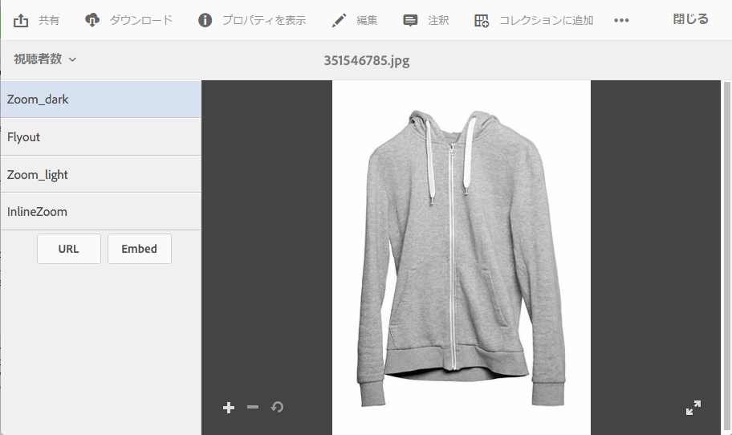

# Dynamic Media ビューアプリセットの適用 {#applying-viewer-presets}

>[!CAUTION]
>
>AEM 6.4 の拡張サポートは終了し、このドキュメントは更新されなくなりました。 詳細は、 [技術サポート期間](https://helpx.adobe.com/jp/support/programs/eol-matrix.html). サポートされているバージョンを見つける [ここ](https://experienceleague.adobe.com/docs/?lang=ja).

ビューアプリセットは、ユーザーのコンピューター画面やモバイルデバイスでのリッチメディアアセットの表示方法を決定する様々な設定のコレクションです。作成者は、管理者がアセットに対して作成した任意のビューアプリセットを適用できます。

ビューアプリセットの管理、作成、並べ替え、削除をおこなう必要のある管理者は、[ビューアプリセットの管理](managing-viewer-presets.md)を参照してください。

[ビューアプリセットの公開](managing-viewer-presets.md#publishing-viewer-presets)も参照してください。

使用しているパブリッシュモードによっては、ビューアプリセットを公開する必要がない場合があります。ビューアプリセットで問題が発生した場合は、[Dynamic Media - Scene7 モードのトラブルシューティング](troubleshoot-dms7.md#viewers)を参照してください。

## アセットへの Dynamic Media ビューアプリセットの適用 {#applying-a-viewer-preset-to-an-asset}

1. アセットを開き、左側のレールで「**[!UICONTROL ビューア]**」をタップします。

   

   * 「**[!UICONTROL URL]**」ボタンと「**[!UICONTROL 埋め込み]**」ボタンは、ビューアプリセットの選択後に表示されます。
   * アセットの&#x200B;**[!UICONTROL 詳細表示]**&#x200B;で「ビューア」を選択すると、多数のビューアプリセットが表示されます。表示されるプリセットの数を増やすことができます。[表示されるビューアプリセットの数を増やす](managing-viewer-presets.md)を参照してください。

1. 左側のウィンドウからビューアを選択してアセットに適用します。結果が右側のウィンドウに表示されます。[この URL を共有用にコピー](linking-urls-to-yourwebapplication.md)して、他のユーザーと共有することもできます。

## ビューアプリセットの URL の取得 {#obtaining-viewer-preset-urls}

ビューアプリセットの URL を取得する方法については、[Web アプリケーションへの URL のリンク](linking-urls-to-yourwebapplication.md)を参照してください。
