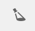

# 3D アセットの表示  {#viewing-d-assets}

>[!IMPORTANT]
>
>AEM 6.4でのAEM 3Dのサポートは終了しました。 Adobeでは、[AEMの3Dアセット機能をCloud Service](https://experienceleague.adobe.com/docs/experience-manager-cloud-service/assets/dynamicmedia/assets-3d.html#dynamicmedia)または[AEM 6.5.3以降として使用することをお勧めします。](https://experienceleague.adobe.com/docs/experience-manager-65/assets/dynamic/assets-3d.html#dynamic) を表示3Dアセットに追加します。

このドキュメントでは、3D アセットをアセットの詳細で表示する方法と 3D コンポーネント内のアセットをサイトで表示する方法の両方について説明します。

## アセットの詳細ページでの 3D アセットの表示  {#viewing-d-assets-in-the-asset-details-page}

AEM のアセットの詳細ページから、インタラクティブ 3D ビューアを使用できます。このビューアには、3D アセットをオービット、ズームおよびパンできるインタラクティブなカメラコントロールのコレクションが含まれます。

AEM 3D のデフォルトのステージを使用する他に、サードパーティ製アプリケーションで作成して AEM にアップロードしたステージも使用できます。

[AEM 3D でのステージの使用](about-the-use-of-stages-in-aem-3d.md)を参照してください。

>[!NOTE]
>
>3D アセットを表示するには、デバイスまたはデスクトップのブラウザーが WebGL に対応している必要があります。また、基盤となるグラフィックハードウェアには、目的のサイズと複雑度のモデルをレンダリングできるだけの性能とメモリが必要です。シャドウの表示などの特定のプレビュー機能は、すべてのブラウザーで利用できません。

### 3D アセットを表示する際のパフォーマンスに関する考慮事項 {#performance-considerations-when-you-view-d-assets}

アセットの詳細ページビューで 3D アセットを開くのにかかる時間は、いくつかの要因に依存します。以下の要因が含まれます。

* サーバーへの帯域幅と遅延。
* モデルサイズ（面の数）。
* マップの数とサイズ。
* ステージの複雑さ。例えば、IBL 画像のサイズなどです。

さらに、カメラをインタラクティブに操作する際に、ワークステーション、ノートパソコン、モバイルタッチデバイスなどのクライアントコンピューターの性能を考慮することも重要です。グラフィック性能に優れ、ある程度パワフルなシステムなら、インタラクティブな 3D 表示をよりスムーズで満足なものにすることができます。

**表示3Dアセット**:

1. 3D アセットが AEM にアップロードされていることを確認します。

   [AEM での 3D アセットのアップロードと処理](upload-processing-3d-assets.md)を参照してください。

1. AEMの&#x200B;**[!UICONTROL ナビゲーション]**&#x200B;ページで、**[!UICONTROL アセット]**&#x200B;をタップします。
1. ページの右上隅付近にある「**[!UICONTROL 表示]**」ドロップダウンリストで「**[!UICONTROL カード表示]**」をタップします。
1. 表示する 3D アセットに移動します。
1. 3D アセットのカードをタップして、アセットの詳細ページで開きます。
1. 次のいずれかの操作をおこないます。

   * アセットの詳細ページの右下隅にあるカメラコントロールパレットを使用して、アセットの様々な表示を変更します。

      従来の Apple のシングルボタンマウスなど、スクロールホイールのない非接触型入力デバイスを使用している場合は、ズームモードまたはパースペクティブモードでも 3D アセットのズームまたはパースペクティブを変更できます。このアクションは、`SHIFT` キーを押しながらマウスボタンを押して上または下方向にドラッグすることによって、実行します。

      一般的なノートコンピューターのタッチパッドを使用していると、多くの場合、2 本指を使用したジェスチャでズーム動作またはパースペクティブ動作をコントロールすることは困難です。そのような場合は、`SHIFT` キーを押しながらアクションを実行します。そうすると、ピンチジェスチャの速度が低下し、必要とする正確なズームレベルまたはパースペクティブを実現しやすくなります。または、`SHIFT`キーを押しながら1本の指で上下にドラッグして、ズームや遠近法の動作に影響を与えることもできます。
   <table> 
    <tbody> 
      <tr> 
      <td><strong>カメラコントロール名</strong>  </td> 
      <td><strong>説明</strong></td> 
      </tr> 
      <tr> 
      <td>
ズーム
 
または
 
パースペクティブ
 </td> 
      <td>
タップまたはクリックしてズームモードとパースペクティブモードを切り替えます。
 
または、<code>ALT/OPTION</code> キーを押しながらアクションを実行して、一時的にパースペクティブモードに切り替えます。 キーを放すとズームモードに戻ります。
 
      <ul> 
      <li><strong>ズーム</strong> — ドリーインおよびドリーアウトの動作で、カメラを表示しているアセットに近づくか遠ざけ  ます。ズームは、マウスのスクロールホイール（利用可能な場合）、モバイルデバイスでの 2 本の指によるピンチ操作、あるいは Shift キーを押したまま左マウスボタンを使用して上または下にドラッグしたときのデフォルトの動作です。</li> 
      <li><strong>パースペクティブ</strong>-表示内のアセットの相対サイズを維持しながら、表示の焦点距離（の場とも呼ばれます）を変更します。パースペクティブは、スクロールホイール（利用可能な場合）、モバイルデバイスでの 2 本の指によるピンチ操作、あるいは Shift キーを押したまま左マウスボタンを使用して上または下にドラッグする動作の代替の動作です。</li> 
      </ul> </td> 
      </tr> 
      <tr> 
      <td>
オービット
 
または
 
パン
 </td> 
      <td>
タップまたはクリックしてオービットモードとパンモードを切り替えます。
 
または、<code>ALT/OPTION</code> キーを押しながらアクションを実行して、一時的にパンモードに切り替えます。キーを放すとオービットモードに戻ります。
 
      <ul> 
      <li><strong>[軌道</strong>]:3Dアセットの中心付近にあるターゲット点を中心とする球上のビューカメラを既定値に移動します。オービットは、モバイルデバイスでの左ボタンドラッグまたはシングルタッチドラッグのデフォルトの動作です。</li> 
      <li><strong>[パン</strong>]：ビュー平面内のカメラを移動します。ターゲットポイントはカメラ対応して移動するので、以降のオービットアクションでは、カメラは新しいターゲットポイントを中心として移動します。パンは、左ボタンドラッグおよびシングルタッチドラッグの代替動作です。</li> 
      </ul> </td> 
      </tr> 
      <tr> 
      <td>
調査
 
または
 
ターゲット
 </td> 
      <td>
タップまたはクリックして調査モードとターゲットモードを切り替えます。
 
      <ul> 
      <li><strong>Examine</strong>-Tapキーを押すか、クリックしてターゲットモードに入ります。</li> 
      <li><strong>ターゲット</strong>- 3Dアセットの任意の場所をタップまたはクリックして、アセットのその部分の表示を中央に配置します。 オービットアクションでは、新しいターゲットポイントが使用されます。</li> 
      </ul> </td> 
      </tr> 
      <tr> 
      <td>リセット</td> 
      <td>タップまたはクリックして、視野のターゲットポイントをモデルの中心に戻します。リセットでも、アセット全体を表示したり、適切な表示サイズで表示するために、カメラを近づけたり遠ざけたりします。 </td> 
      </tr> 
    </tbody> 
    </table>

   * アセットの詳細ページの右上隅近くにある&#x200B;**[!UICONTROL ステージセレクター]**&#x200B;アイコンをタップします。 3D アセットに適用する背景とライティングを含むステージ名を選択します。

   

   ステージは、3Dモデルが表示される環境 — 背景、接地面、照明を提供します。

   [AEM 3D でのステージの使用](about-the-use-of-stages-in-aem-3d.md)を参照してください。

   * アセットの詳細ページの右上隅近くにある「**[!UICONTROL カメラセレクター]**」アイコンをタップし、3Dアセットに適用するカメラ表示を選択します。

   

   多くの場合、ステージには事前定義済みのカメラが含まれています。現在のカメラを再選択して、事前定義済みの設定に戻すことができます。

   [AEM 3D でのステージの使用](about-the-use-of-stages-in-aem-3d.md)を参照してください。

1. ページの右上隅にある「**[!UICONTROL 保存]**」をタップします。
1. 次のいずれかの操作をおこないます。

   * 3D アセットをレンダリングします。

      [3D アセットのレンダリング](rendering-3d-assets.md)を参照してください。

   * ページの右上隅にある「**[!UICONTROL 閉じる]**」をタップして、アセットページに戻ります。

## Sites 3D コンポーネント内の 3D アセットの表示 {#viewing-d-assets-in-the-sites-d-component}

>[!NOTE]
>
>この節は、Adobe Dimension以外の3Dアセットタイプで使用される従来のwebGLビューアにのみ適用されます。

デバイスのタイプに応じて、様々な方法で 3D コンポーネント機能にアクセスします。

詳しくは、次のトピックを参照してください。

* [タッチスクリーンデバイス](#touchscreen-devices)
* [タッチパッドデバイス](#touchpad-devices)
* [マウスおよびトラックボールデバイス](#mouse-and-trackball-devices)

[3Dコンポーネントを含むWebページのプレビュー](using-the-3d-sites-component.md#previewing-a-web-page-that-has-a-d-component)も参照してください。

### タッチスクリーンデバイス {#touchscreen-devices}

タッチスクリーンデバイスで 3D コンポーネントを操作するには：

1. 1 本の指でドラッグまたはスワイプして、オブジェクトの周囲で視点（「カメラ」）を移動（「オービット」）します。あらゆる方向からオブジェクトを表示できます。

1. 2 本の指でピンチして、カメラをオブジェクトに近づけたり、オブジェクトから遠ざけたりします。このアクションはズームインまたはズームアウトと同様です。このアクションを使用して、オブジェクトを詳しく調べることができます。また、「+」ボタンを押したままにしてカメラをオブジェクトに近づけたり、「-」ボタンを押したままにしてカメラをオブジェクトから遠ざけたりすることもできます。

1. 2 本の指でドラッグして、カメラをパンします。このアクションではカメラを横方向に移動して、ズームインしたままオブジェクトの様々な部分を見ることができます。または、「**[!UICONTROL オービット/パンの切り替え]**」ボタンをタップしてパンモードに切り替え、1本指のドラッグでカメラをパンします。 「**[!UICONTROL オービット/パンの切り替え]**」ボタンをタップして、**[!UICONTROL オービット]**&#x200B;モードに戻ります。

1. **[!UICONTROL ビューアをリセット]**&#x200B;をタップして、カメラをリセットします。このアクションにより、オブジェクト全体の表示に戻り、自動スピンが有効になっている場合は自動スピンが再開されます。

1. **[!UICONTROL 全画面表示]**&#x200B;をタップして、全画面表示モードに切り替えます（デバイスでサポートされている場合）。**[!UICONTROL 全画面表示]**&#x200B;を再度タップすると、3D ビューアはページ埋め込みモードに戻ります。

### タッチパッドデバイス {#touchpad-devices}

タッチパッドデバイスで 3D コンポーネントを操作するには：

1. （左）タッチパッドボタンを押しながら 1 本の指でドラッグして、オブジェクトの周囲で視点（「カメラ」）を移動（「オービット」）します。あらゆる方向からオブジェクトを表示できます。

1. タッチパッドボタンを押し込まずに 2 本の指で下方向または上方向にドラッグして、カメラをオブジェクトに近づけたり、オブジェクトから遠ざけたりします。このアクションはズームインまたはズームアウトと同様です。このアクションを使用して、オブジェクトを詳しく調べることができます。または、**[!UICONTROL ズームイン]**&#x200B;ボタンまたは&#x200B;**[!UICONTROL ズームアウト]**&#x200B;ボタンを押したままにして、カメラをオブジェクトの近くまたは遠くに移動します。

1. **Alt/option**&#x200B;キーと（左）タッチパッドボタンを押しながら1本指でドラッグし、カメラをパンします。 このアクションではカメラを横方向に移動して、ズームインしたままオブジェクトの様々な部分を見ることができます。または、[**[!UICONTROL オービット/パンの切り替え]**]ボタンをクリックして[**[!UICONTROL パン]**]モードに切り替え、（左）ボタンを押しながら1本指でドラッグしてカメラをパンします。 [**[!UICONTROL オービット/パンの切り替え]**]ボタンをもう一度クリックして、[**[!UICONTROL オービット]**]モードに戻ります。

1. 「**[!UICONTROL ビューアをリセット]**」をクリックして、カメラをリセットします。 このアクションにより、オブジェクト全体の表示に戻り、自動スピンが有効になっている場合は自動スピンが再開されます。

1. 「**[!UICONTROL フルスクリーン]**」をクリックしてフルスクリーンモードに切り替えます。 キーボードの&#x200B;**Escape**&#x200B;キーを使用するか、「**[!UICONTROL フルスクリーン]**」を再度クリックして、3Dビューアをページ埋め込みモードに戻します。

### マウスおよびトラックボールデバイス {#mouse-and-trackball-devices}

マウスおよびトラックボールデバイスで 3D コンポーネントを操作するには：

1. 左マウスボタンを押しながらドラッグして、オブジェクトの周囲で視点（「カメラ」）を移動（「オービット」）します。あらゆる方向からオブジェクトを表示できます。

1. スクロールホイールを使用して、カメラをオブジェクトに近づけたり、オブジェクトから遠ざけたりします。このアクションはズームインまたはズームアウトと同様です。このアクションを使用して、オブジェクトを詳しく調べることができます。または、**[!UICONTROL ズームイン]**&#x200B;ボタンまたは&#x200B;**[!UICONTROL ズームアウト]**&#x200B;ボタンを押したままにして、カメラをオブジェクトの近くまたは遠くに移動します。

1. **Alt/option**&#x200B;キーを押しながらドラッグし、マウスの左ボタンを押して、カメラをパンします。 このアクションではカメラを横方向に移動して、ズームインしたままオブジェクトの様々な部分を見ることができます。または、[**[!UICONTROL オービット/パンの切り替え]**]ボタンをクリックして[**[!UICONTROL パン]**]モードに切り替え、マウスの左ボタンを押しながらドラッグしてカメラをパンします。 [**[!UICONTROL オービット/パンの切り替え]**]を再度クリックして、[**[!UICONTROL オービット]**]モードに戻ります。
1. 「**[!UICONTROL ビューアをリセット]**」をクリックして、カメラをリセットします。 このアクションにより、オブジェクト全体の表示に戻り、自動スピンが有効になっている場合は自動スピンが再開されます。
1. 「**[!UICONTROL フルスクリーン]**」をクリックしてフルスクリーンモードに切り替えます。 キーボードの&#x200B;**[!UICONTROL Escape]**&#x200B;キーを使用するか、「**[!UICONTROL フルスクリーン]**」を再度クリックして、3Dビューアをページ埋め込みモードに戻します。

