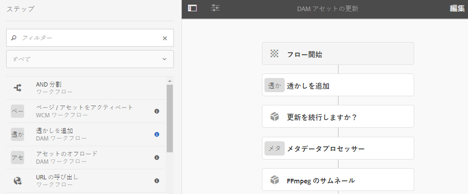

# デジタルアセットの透かしの設定 {#watermarking}

[!DNL Adobe Experience Manager Assets] では、アセットにデジタル透かしを追加して、アセットの信頼性と著作権の所有権を確認できます。[!DNL Experience Manager Assets] では、PNG および JPEG ファイル上の透かしとしてテキストを使用できます。

Adobe Experience Manager(AEM)Assetsでは、画像にデジタル透かしを追加して、アセットの信頼性や著作権の所有権を確認できます。 AEM Assets では、PNG および JPEG ファイル上の透かしとしてテキストを使用できます。

アセットに透かしを適用できるようにするには、[!UICONTROL DAMアセットの更新]ワークフローに透かし処理ステップを追加します。

1. [!DNL Experience Manager]ユーザーインターフェイスにアクセスし、**[!UICONTROL ツール]** / **[!UICONTROL ワークフロー]** / **[!UICONTROL モデル]**&#x200B;に移動します。
1. ワークフローモデルページで、**[!UICONTROL DAM アセットの更新]**&#x200B;ワークフローを選択し、「**[!UICONTROL 編集]**」をクリックします。

1. サイドパネルから、「**[!UICONTROL 透かしを追加]**」ステップをドラッグし、「[!UICONTROL DAMアセットの更新]」ワークフローに追加します。

   

   >[!NOTE]
   >
   >[!UICONTROL 透かしを追加]ステップを、[!UICONTROL サムネールを処理]ステップの前の任意の場所に配置します。

1. 「**[!UICONTROL 透かしを追加]**」ステップを開いて、プロパティを表示します。
1. 「**[!UICONTROL 引数]**」タブで、各種フィールド（テキスト、フォントタイプ、サイズ、カラー、位置、向きなど）に有効な値を指定します。変更を確定するには、「**[!UICONTROL 完了]**」をクリックします。

   

1. 透かしステップを追加した **[!UICONTROL DAM アセットの更新]**&#x200B;ワークフローを保存します。
1. AEMユーザーインターフェイスから、サンプルアセットをアップロードします。 透かしは、上記の手順で設定した位置に、フォントサイズや色などと共に表示されます。

プログラムによって、または動的情報を使用してPDFドキュメントに透かしを追加するには、[AEM Document Services](/help/forms/using/overview-aem-document-services.md)の機能を使用することを検討してください。

## ヒントと制限事項 {#tips-limitations}

* テキストベースの透かしのみがサポートされます。 [!UICONTROL 透かしを追加処理]の作成時に画像をアップロードできる場合でも、画像は透かしとして使用されません。
* 透かしはPNGおよびJPEGファイルのみがサポートされています。 その他のアセット形式は透かしにはなりません。
