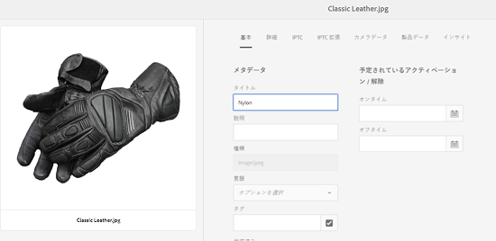
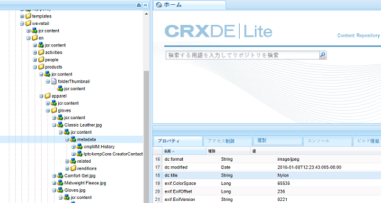
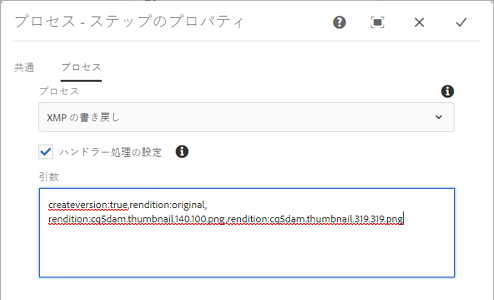

# レンディションへの XMP の書き戻し {#xmp-writeback-to-renditions}

[!DNL Adobe Experience Manager Assets] の XMP 書き戻し機能では、メタデータの変更内容を元のアセットのレンディションに複製します。Assets 内からアセットのメタデータを変更した場合、またはアセットをアップロードした場合、変更内容は最初にアセット階層のメタデータノードに保存されます。

XMP の書き戻し機能によって、メタデータの変更が、アセットのすべてのレンディションまたは特定のレンディションに反映されます。この機能は、`jcr` 名前空間を使用するメタデータプロパティのみを書き戻します。つまり、`dc:title` という名前のプロパティは書き戻されますが、`mytitle` という名前のプロパティは書き戻されません。

「`Classic Leather`」というタイトルのアセットの「[!UICONTROL タイトル]」プロパティを「`Nylon`」に変更するシナリオについて考えます。

この場合、 [!DNL Experience Manager] Assets は変更を **[!UICONTROL タイトル]** プロパティを `dc:title` パラメーターは、アセット階層に保存されたアセットメタデータ用のものです。

ただし、[!DNL Experience Manager Assets] では、メタデータの変更はアセットのレンディションに自動的に反映されません。詳しくは、 [XMPの書き戻しを有効にする方法](#enabling-xmp-writeback).

## XMP の書き戻しの有効化 {#enabling-xmp-writeback}

アセットのアップロード時にメタデータの変更をアセットのレンディションに反映させるには、設定マネージャーで「**Adobe CQ DAM Rendition Maker**」の設定を変更します。

1. 次の場所から Configuration Manager を開きます。 `https://[aem_server]:[port]/system/console/configMgr`.
1. 「**[!UICONTROL Adobe CQ DAM Rendition Maker]**」設定を開きます。
1. 「**[!UICONTROL Propagate XMP]**」オプションを選択し、変更を保存します。

   

## 特定のレンディションに対するXMPの書き戻しを有効にする {#enabling-xmp-writeback-for-specific-renditions}

XMP の書き戻し機能によって、選択されたレンディションにメタデータの変更が反映されるようにするには、これらのレンディションを DAM メタデータ書き戻しワークフローの「XMP の書き戻しプロセスワークフロー」ステップに指定します。デフォルトでは、このステップには元のレンディションが設定されています。

XMP の書き戻し機能でメタデータをレンディションサムネール 140.100.png および 319.319.png に反映するには、次の手順を実行します。

1. Experience Managerで、 **[!UICONTROL ツール/ワークフロー/モデル]**.
1. 次の [!UICONTROL モデル] ページで、 **[!UICONTROL DAM メタデータの書き戻し]** ワークフローモデル。
1. **[!UICONTROL DAM メタデータの書き戻し]**&#x200B;ページで、「**[!UICONTROL XMP の書き戻しプロセス]**」ステップを開きます。
1. **[!UICONTROL ステップのプロパティ]**&#x200B;ダイアログボックスで、「**[!UICONTROL プロセス]**」タブをタップまたはクリックします。
1. 内 **[!UICONTROL 引数]** ボックス、追加 `rendition:cq5dam.thumbnail.140.100.png,rendition:cq5dam.thumbnail.319.319.png`.タップまたはクリック **[!UICONTROL OK]**.

   

1. 新しい属性でDynamic Media画像のピラミッドTIFFレンディションを再生成するには、 **[!UICONTROL Dynamic Media Process Image Assets]** DAM メタデータの書き戻しワークフローにステップインします。
PTIFF レンディションは、Dynamic Mediaハイブリッドモードでのみ、ローカルで作成および格納されます。 ワークフローを保存します。

メタデータの変更がレンディションに反映されます。 `thumbnail.140.100.png` および `thumbnail.319.319.png` 他のものではなく、資産の

>[!NOTE]
>
>64 ビット Linux でのXMPの書き戻しの問題については、 [64 ビット RedHat Linux でXMPの書き戻しを有効にする方法](https://helpx.adobe.com/experience-manager/kb/enable-xmp-write-back-64-bit-redhat.html).
>
>サポートされるプラットフォームについて詳しくは、 [XMPメタデータの書き戻しの前提条件](/help/sites-deploying/technical-requirements.md#requirements-for-aem-assets-xmp-metadata-write-back).

## XMP メタデータのフィルタリング {#filtering-xmp-metadata}

[!DNL Experience Manager Assets] は、アセットの取り込み時にアセットバイナリから読み取られ JCR に保存されるXMPメタデータのプロパティ/ノードのブロックリストと許可リストの両方のフィルタリングをサポートしています。

ブロックリストを使用したフィルターは、除外するよう指定されたプロパティを除く、すべての XMP メタデータプロパティを読み込みます。ただし、膨大な量の XMP メタデータ（例えば、10,000 個のプロパティを持つ 1,000 個のノード）を含む INDD ファイルなどのアセットタイプの場合、フィルタリングするノードの名前が必ずしも事前にわかるわけではありません。ブロックリストを使用してフィルタリングすると、XMPメタデータが多数含まれる多数のアセットを読み込むことができる場合は、 [!DNL Experience Manager] インスタンスまたはクラスターで、監視キューの記録など、安定性の問題が発生する場合があります。

この問題は、許可リストを介した XMP メタデータのフィルターで解決できます。このフィルターは、読み込む XMP プロパティを定義するので、許可リストに定義されていない XMP プロパティや不明な XMP プロパティは無視されます。下位互換性を確保するために、ブロックリストを使用するフィルターにこれらのプロパティの一部を追加できます。

>[!NOTE]
>
>フィルタリングは、アセットバイナリの XMP ソースから派生したプロパティに対してのみ機能します。EXIF 形式や IPTC 形式などの XMP 以外のソースから派生したプロパティについては、フィルタリングは機能しません。例えば、アセットの作成日は、`CreateDate` という名前のプロパティに EXIF TIFF 形式で格納されています。[!DNL Experience Manager] この値を `exif:DateTimeOriginal`. この場合は XMP 以外のソースなので、このプロパティにはフィルタリングは機能しません。

1. 次の場所から Configuration Manager を開きます。 `https://[aem_server]:[port]/system/console/configMgr`.
1. 「**[!UICONTROL Adobe CQ DAM XmpFilter]**」設定を開きます。
1. 許可リストを使用したフィルタリングを適用するには、「**[!UICONTROL Apply Allowlist to XMP Properties]**」を選択し、インポートするプロパティを「**[!UICONTROL Allowed XML Names for XMP filtering]**」ボックスで指定します。

   

1. 許可リストを使用してフィルターを適用した後、ブロックされたXMPのプロパティを除外するには、 **[!UICONTROL Blocked XML Names for XMP filtering]** ボックス 変更内容を保存します。

   >[!NOTE]
   >
   >「**[!UICONTROL Apply Blocklist to XMP Properties]**」チェックボックスは、デフォルトでオンになっています。つまり、ブロックリストを使用したフィルタリングは、デフォルトで有効になっています。このフィルターを無効にするには、「 **[!UICONTROL XMPプロブロックリストパティに適用]** オプション。
