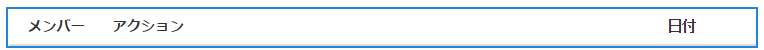
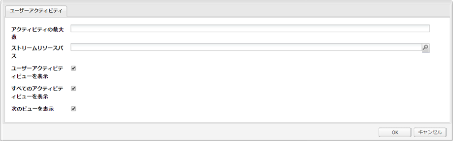
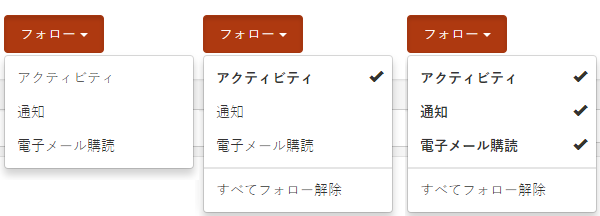

# アクティビティストリーム機能 {#activity-streams-feature}

## はじめに {#introduction}

フォーラムやブログへの投稿など、サインインしたコミュニティメンバーのアクティビティは、ストリームに収集され、`Activity Streams`コンポーネントの設定を通じて様々な方法でフィルタリングおよび表示できます。

コミュニティメンバーが関心のある投稿をフォローしたり、他のコミュニティメンバーのアクティビティをフォローしているときは、フォロー機能によって、アクティビティを別の見方で捉えることができます。

ドキュメントのこのセクションでは、以下の内容について説明します。

* アクティビティストリームコンポーネントのAEMサイトへの追加
* アクティビティストリームコンポーネントの設定

## アクティビティストリームをページに追加 {#adding-activity-streams-to-a-page}

`Activity Streams`コンポーネントをオーサリングモードでページに追加する場合は、コンポーネントブラウザーを使用して

* `Communities / Activity Streams`

コンポーネントを探し、ページ上のアクティビティストリームを表示したい位置にドラッグします。

必要な情報については、[コミュニティコンポーネントの基本](basics.md)を参照してください。

[必須のクライアント側ライブラリ](essentials-activities.md#essentials-for-client-side)を含めると、`Activity Streams`コンポーネントは次のように表示されます。

## アクティビティストリームの設定 {#configuring-activity-streams}

配置済みの`Activity Streams`コンポーネントを選択し、`Configure`アイコンを選択すると、編集ダイアログが開きます。

「**[!UICONTROL ユーザーアクティビティ]**」タブでは、表示するアクティビティを指定します。

* **[!UICONTROL アクティビティ]**
の最大数表示するアクティビティの数
* **[!UICONTROL ストリームリソースパス]**&#x200B;空白のままにすると、コミュニティサイトまたはコミュニティグループがデフォルトになります。ストリームリソースパスは、アクティビティのソースを識別します。 初期設定は空白です。
* **[!UICONTROL ユーザーアクティビティビューを表示]**&#x200B;オンにすると、アクティビティページに、現在のメンバーがコミュニティ内で生成するアクティビティに基づいてアクティビティをフィルタリングできるタブが表示されます。初期設定はオンです。
* **[!UICONTROL すべてのアクティビティを表]**
示オンにすると、アクティビティページにタブが表示されます。このタブには、現在のメンバーがアクセス権を持つコミュニティ内で生成されたすべてのアクティビティが含まれます。初期設定はオンです。
* **[!UICONTROL 次のビューを表]**
示オンにすると、アクティビティページに、現在のメンバーがフォローしているアクティビティに基づいてアクティビティをフィルタリングするタブが表示されます。初期設定はオンです。

## フォロービュー {#following-view}

フォローを有効にするようにコンポーネントを設定する必要があります。以下を可能にする機能には、[blog](blog-feature.md)、[forum](forum.md)、[Q&amp;A](working-with-qna.md)、[calendar](calendar.md)、[filelibrary](file-library.md)、[comments](comments.md)があります。

**フォロー**&#x200B;ボタンは、エントリをアクティビティ、[通知](notifications.md)、[購読](subscriptions.md)としてフォローする手段を提供します。 「**フォロー**」ボタンを選択するたびに、選択のオン/オフを切り替えることができます。 `Email Subscriptions`は、設定時にのみ表示されます。

フォロー方法が選択されると、ボタンのテキストが「**フォロー中**」に変わります。 便宜上、`Unfollow All`を選択してすべてのメソッドをオフに切り替えることができます。

「**フォロー**」ボタンが表示されます。

* 別のメンバーのプロファイルを表示する場合
* フォーラム、Q&amp;A、ブログなどのメイン機能ページ
   * その一般的な機能のすべてのアクティビティに従う

* フォーラムトピック、Q&amp;A質問、ブログ記事などの特定のエントリ
   * その特定のエントリのすべてのアクティビティに従う

## 追加情報 {#additional-information}

開発者向けの詳細情報は、[アクティビティストリームの基本事項](essentials-activities.md)ページを参照してください。
