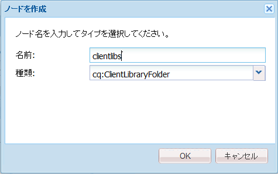
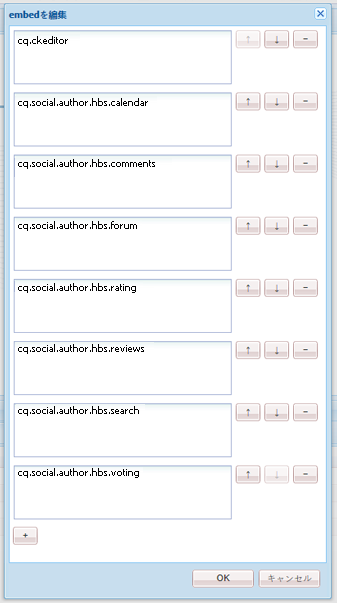
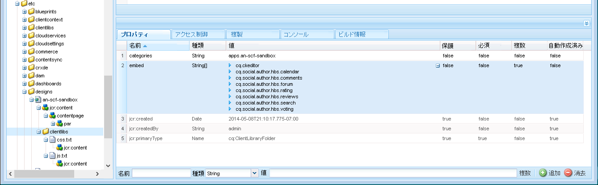
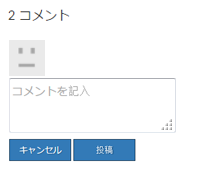
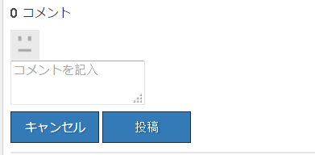

# clientlib の追加 {#add-clientlibs}

>[!CAUTION]
>
>AEM 6.4 の拡張サポートは終了し、このドキュメントは更新されなくなりました。 詳細は、 [技術サポート期間](https://helpx.adobe.com/jp/support/programs/eol-matrix.html). サポートされているバージョンを見つける [ここ](https://experienceleague.adobe.com/docs/?lang=ja).

## ClientLibraryFolder(clientlibs) の追加 {#add-a-clientlibraryfolder-clientlibs}

という名前の ClientLibraryFolder を作成します。 `clientlibs`サイトのページをレンダリングするために使用される JS と CSS を含む

この `categories`このクライアントライブラリに与えられるプロパティ値は、コンテンツページからこの clientlib を直接含めたり、他の clientlib に埋め込んだりするために使用される識別子です。

1. 使用 **[!UICONTROL CRXDE Lite]**、展開 `/etc/designs`

1. 右クリック `an-scf-sandbox` を選択し、 `Create Node`

   * 名前：`clientlibs`
   * 型：`cq:ClientLibraryFolder`

1. クリック **[!UICONTROL OK]**



内 **[!UICONTROL プロパティ]** 新しい `clientlibs` ノードに、 **`categories`** プロパティ：

* 名前：**[!UICONTROL categories]**
* タイプ：**[!UICONTROL String]**
* 値： **[!UICONTROL apps.an-scf-sandbox]**
* クリック **[!UICONTROL 追加]**
* クリック **[!UICONTROL すべて保存]**

注意：categories 値の前に「apps」を付けます。 は、「所有アプリケーション」が/libs ではなく/apps フォルダー内にあることを識別する規則です。  重要：プレースホルダーを追加 `js.txt` および `css.txt` ファイル。 （正式には cq:ClientLibraryFolder ではありません。）


1. 右クリック **`/etc/designs/an-scf-sandbox/clientlibs`**
1. 選択 **[!UICONTROL ファイルを作成…]**
1. 入力 **[!UICONTROL 名前]**: `css.txt`

1. 選択 **[!UICONTROL ファイルを作成…]**
1. 入力 **[!UICONTROL 名前]**: `js.txt`

1. クリック **[!UICONTROL すべて保存]**


css.txt と js.txt の最初の行は、以下のファイルのリストを検索する基本の場所を示します。

css.txt の内容を次のように設定してみます。

```
#base=.
 style.css
```

次に、clientlibs の下に style.css という名前のファイルを作成し、コンテンツを次のように設定します。

`body {`

`background-color: #b0c4de;`

`}`

## SCF Clientlibs を埋め込む {#embed-scf-clientlibs}

内 **[!UICONTROL プロパティ]** タブ `clientlibs` ノードで、複数値の String プロパティを入力します。 **[!UICONTROL 埋め込み]**. これにより、必要な [SCF コンポーネントのクライアント側ライブラリ (clientlibs)](client-customize.md#clientlibs-for-scf). このチュートリアルでは、コミュニティコンポーネントに必要な clientlib の多くを追加します。

**注意** 各ページにダウンロードされる clientlib の利便性とサイズ/速度に関する考慮事項があるので、実稼動サイトで使用する方法にはこの方法が望ましい場合とそうでない場合があります。

1 つのページで 1 つの機能のみを使用する場合は、その機能の完全な clientlib を &lt;% ui:includeClientLib categories=cq.social.hbs.forum&quot; %> のように、直接ページに含めることができます。

この場合、すべてを含めるので、作成者の clientlib であるより基本的な SCF clientlibs を選択します。

* 名前：**`embed`**
* 型：**`String`**

* Click **`Multi`**
* 値：**`cq.social.scf`**

   *&lt;enter> ダイアログがポップアップ表示されます*

   *クリック&#x200B;**[+]**各エントリの後に、次の clientlib カテゴリを追加します。*

   * **`cq.ckeditor`**
   * **`cq.social.author.hbs.comments`**
   * **`cq.social.author.hbs.forum`**
   * **`cq.social.author.hbs.rating`**
   * **`cq.social.author.hbs.reviews`**
   * **`cq.social.author.hbs.voting`**
   * クリック **[!UICONTROL OK]**

* クリック **[!UICONTROL すべて保存]**



このように `/etc/designs/an-scf-sandbox/clientlibs` がリポジトリに表示されます。



## PlayPage テンプレートに clientlibs を含める {#include-clientlibs-in-playpage-template}

を含めずに、 `apps.an-scf-sandbox` 必要な JavaScript とスタイルが使用できないので、ページの ClientLibraryFolder カテゴリ、SCF コンポーネントは機能しないか、スタイル設定されません。

例えば、clientlibs を含めないと、SCF コメントコンポーネントはスタイル設定されていない状態で表示されます。



apps.an-scf-sandbox clientlibs を含めると、SCF コメントコンポーネントのスタイルが表示されます。



include ステートメントは、 `<head>` セクション `<html>` スクリプト デフォルト **`foundation head.jsp`** には、オーバーレイ可能なスクリプトが含まれます。 **`headlibs.jsp`**.

**headlibs.jsp をコピーし、clientlibs を含めます。**

1. 使用 **[!UICONTROL CRXDE Lite]**&#x200B;を選択します。 **`/libs/foundation/components/page/headlibs.jsp`**
1. 右クリックして「 」を選択します。 **[!UICONTROL コピー]** （または、ツールバーから「コピー」を選択します）。
1. **`/apps/an-scf-sandbox/components/playpage`** を選択します。
1. 右クリックして「 」を選択します。 **[!UICONTROL 貼り付け]** （または、ツールバーから「貼り付け」を選択します）。
1. ダブルクリック **`headlibs.jsp`** 開ける
1. ファイルの末尾に次の行を追加します。

   **`<ui:includeClientLib categories="apps.an-scf-sandbox"/>`**

1. クリック **[!UICONTROL すべて保存]**


```xml
<%@ page session="false" %><%
%><%@include file="/libs/foundation/global.jsp" %><%
%><ui:includeClientLib categories="cq.foundation-main"/><%
%>
<cq:include script="/libs/cq/cloudserviceconfigs/components/servicelibs/servicelibs.jsp"/>
<% currentDesign.writeCssIncludes(pageContext); %>
<ui:includeClientLib categories="apps.an-scf-sandbox"/>
```

ブラウザーに Web サイトを読み込み、背景が青の影でないかどうかを確認します。

[http://localhost:4502/content/an-scf-sandbox/en/play.html](http://localhost:4502/content/an-scf-sandbox/en/play.html)


## これまでの作業の保存 {#saving-your-work-so-far}

この時点では、最小限のサンドボックスが存在し、再生中にリポジトリが破損し、再起動したい場合は、サーバーをオフにし、crx-quickstart/フォルダーの名前を変更または削除し、サーバーをオンにし、この保存済みパッケージをアップロードしてインストールし、最も基本的な手順を繰り返す必要がありません。

このパッケージは、 [サンプルページの作成](create-sample-page.md) 飛び込んで遊び始めるのを待ちきれない人のためのチュートリアル！

パッケージを作成するには：


* 送信者 **[!UICONTROL CRXDE Lite]**、 [パッケージアイコン](http://localhost:4502/crx/packmgr/)
* クリック **[!UICONTROL パッケージを作成]**

   * パッケージ名: `an-scf-sandbox-minimal-pkg`
   * バージョン：`0.1`
   * グループ： &lt;leave as=&quot;&quot; default=&quot;&quot;>
   * クリック **[!UICONTROL OK]**

* クリック **[!UICONTROL 編集]**

   * 選択 **[!UICONTROL フィルター]** タブ

      * クリック **[!UICONTROL フィルターを追加]**
      * ルートパス： &lt;browse to=&quot;&quot; span=&quot;&quot; id=&quot;0&quot; translate=&quot;no&quot; />>`/apps/an-scf-sandbox`
      * クリック **[!UICONTROL 完了]**
      * クリック **[!UICONTROL フィルターを追加]**
      * ルートパス： &lt;browse to=&quot;&quot; span=&quot;&quot; id=&quot;0&quot; translate=&quot;no&quot; />>`/etc/designs/an-scf-sandbox`
      * クリック **[!UICONTROL 完了]**
      * クリック **[!UICONTROL フィルターを追加]**
      * ルートパス： &lt;browse to=&quot;&quot; span=&quot;&quot; id=&quot;0&quot; translate=&quot;no&quot; />>`/content/an-scf-sandbox`
      * クリック **[!UICONTROL 完了]**
   * 「**[!UICONTROL 保存]**」をクリックします。


* クリック **[!UICONTROL ビルド]**

これで、 **[!UICONTROL ダウンロード]** ディスクに保存し **[!UICONTROL パッケージをアップロード]** 他の場所では、選択 **[!UICONTROL 詳細 > レプリケート]** サンドボックスを localhost パブリッシュインスタンスにプッシュしてサンドボックスの領域を拡張するために使用します。
