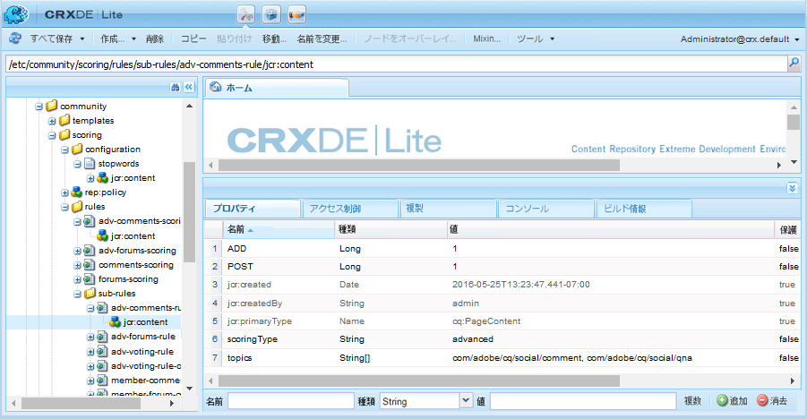

# 高度なスコアとバッジ {#advanced-scoring-and-badges}

## 概要 {#overview}

高度なスコアを使用すると、メンバーをエキスパートとして識別するバッジを授与できます。高度なスコアリングでは、数量に基づいてポイントを割り当てます *および* メンバーが作成したコンテンツの品質。一方、基本スコアでは、作成したコンテンツの量に基づいてポイントを割り当てます。

この違いは、スコアの計算に使用されるスコアエンジンによるものです。基本スコアエンジンは、単純な計算を適用します。 高度なスコアエンジンは、トピックの自然言語処理 (NLP) を通じて推測される、価値のある関連コンテンツに貢献するアクティブなメンバーに対して報酬を与えるアダプティブなアルゴリズムです。

このスコアアルゴリズムでは、コンテンツの関連度に加え、投票や回答の割合など、メンバーのアクティビティが考慮されます。基本的なスコアリングには定量的なものも含まれますが、高度なスコアリングではアルゴリズム的に使用されます。

したがって、高度なスコアエンジンの分析を意味あるものにするには、十分なデータが必要です。作成されるコンテンツの量と品質に応じてアルゴリズムが継続的に調整されるので、エキスパートになるための達成度のしきい値は、常に再評価されます。 また、 *減衰* メンバーの古い投稿の エキスパートメンバーが、事前に決定した時点で、エキスパートの地位を得た問題への参加を停止した場合 ( [スコアエンジンの設定](#configurable-scoring-engine)) エキスパートとしての地位を失う可能性があります。

高度なスコアの設定方法は、基本スコアとほとんど同じです。

* 基本的なスコアと高度なスコアおよびバッジルールは次のとおりです。 [コンテンツに適用済み](implementing-scoring.md#apply-rules-to-content) 同じように
   * 基本スコアと高度なスコアおよびバッジルールを同じコンテンツに適用できる
* [コンポーネントのバッジの有効化](implementing-scoring.md#enable-badges-for-component) 汎用

スコアルールおよびバッジルールの設定では、以下の点が異なります。

* 設定可能な高度なスコアエンジン
* 高度なスコアルール：
   * `scoringType` に設定 **[!UICONTROL 詳細]**
   * ストップワードが必要

* 高度なバッジルール：
   * `badgingType` に設定 **[!UICONTROL 詳細]**
   * `badgingLevels` を授与するエキスパートレベルの数に設定
   * 必要 `badgingPaths` しきい値の代わりのバッジの配列配列配列がポイントとバッジをマッピングします

>[!NOTE]
>
>高度なスコアおよびバッジ機能を使用するには、 [エキスパート特定パッケージ](https://experience.adobe.com/#/downloads/content/software-distribution/en/aem.html?package=%2Fcontent%2Fsoftware-distribution%2Fen%2Fdetails.html%2Fcontent%2Fdam%2Faem%2Fpublic%2Fadobe%2Fpackages%2Fcq610%2Fsocial%2Ffeaturepack%2Fcq-social-expert-identification-pkg).

## 設定可能なスコアエンジン {#configurable-scoring-engine}

この高度なスコアエンジンには OSGi 設定が用意されており、パラメーターを設定して高度なスコアアルゴリズムを調整できます。

* **[!UICONTROL スコア付けの重み付け]**
トピックの場合、スコアの計算時に最も優先度が高い動詞を指定します。 1 つ以上のトピックを入力できますが、次に限定されます **1 つの話題に対する 1 つの動詞**. 詳しくは、 [トピックと動詞](implementing-scoring.md#topics-and-verbs).

   次の形式で入力 `topic,verb` コンマはエスケープされます。 次に例を示します。

   `/social/forum/hbs/social/forum\,ADD`

   デフォルトでは、Q&amp;A とフォーラムコンポーネントの ADD 動詞が設定されています。

* **[!UICONTROL スコアリング範囲]**

   高度なスコアの範囲は、0 からこの値までとして定義されます。

   デフォルト値は 100 であり、スコア範囲は 0 ～ 100 となります。

* **[!UICONTROL エンティティの減衰時間間隔]**

   このパラメーターは、すべてのエンティティのスコアが低下するまでの時間数を表します。 これは、コミュニティサイト上にある古いコンテンツをスコアに含めないようにするために必要な設定です。

   デフォルト値は 216000 時間（約 24 年）です。

* **[!UICONTROL スコア付け成長率]**

   スコアを指定します。 0 から scoring range 値までの範囲でスコア値を指定します。この値を超えると、エキスパートの数を制限するために上昇率が低下します。

   デフォルト値は 50 です。

## 高度なスコアルール {#advanced-scoring-rules}

基本スコアでは、バッジ獲得に必要な量はあらかじめ決まっています。

高度なスコアでは、システム内の上質なデータの量に基づいて、バッジ獲得に必要な量が継続的に調整されます。スコアは、ベルカーブと同様の方法で継続的に計算されます。

あるトピックでエキスパートのバッジを獲得したメンバーが、その後あまり活動しなくなった場合は、時間経過に伴う減衰によってバッジを失う可能性があります。

### ScoringType {#scoringtype}

スコアルールは、スコアサブルールの集まりです。各サブルールは、それぞれ `scoringType` を宣言します。

高度なスコアエンジンを呼び出すには、`scoringType` を `advanced` に設定する必要があります。

[スコアサブルール](implementing-scoring.md#scoring-sub-rules)を参照してください。

### ストップワード {#stopwords}

高度なスコアパッケージでは、ストップワードファイルを含む設定フォルダーがインストールされます。

* `/etc/community/scoring/configuration/stopwords`

高度なスコアのアルゴリズムは、ストップワードファイルに含まれる単語のリストに基づいて、コンテンツ処理中に無視して構わない一般的な英単語を識別します。

このファイルが変更されることはありません。

ストップワードファイルが存在しない場合は、スコアエンジンによりエラーがスローされます。

## 高度なバッジルール {#advanced-badging-rules}

高度なバッジルールのプロパティは、[基本バッジルールのプロパティ](implementing-scoring.md#badging-rules)とは異なります。

ポイントとバッジ画像を関連付ける必要はなく、許可するエキスパートの数と、授与するバッジ画像を指定するだけで十分です。

| **プロパティ** | **タイプ** | **値の説明** |
|---------------|----------|--------------------------------------------------------------------------------------------------------------------------------------------------------------------------------------------------------------------------------------------------------------------------------------------------------------------------------------------------------------------------------|
| badgingPath | String[] | （必須）badgingLevels の数までのバッジ画像の複数値文字列。 バッジ画像のパスを指定するときは、最も高いレベルのエキスパートに授与するものを最初に指定する必要があります。badgingLevels で指定された値よりもバッジの数が少ない場合、足りない部分には配列内の最終要素のバッジが使用されます。例：/etc/community/badging/images/expert-badge/jcr:content/expert.png |
| badgingLevels | Long | （オプション）与える専門知識のレベルを指定します。 例えば、エキスパートとほぼエキスパート（2 つのバッジ）が必要な場合は、値を 2 に設定します。 badgingLevel は、badgingPath プロパティにリストされるエキスパート関連のバッジ画像の数に対応している必要があります。 初期設定は 1 です。 |
| badgingType | 文字列 | （必須）スコアリングエンジンを「basic」または「advanced」として識別します。 &quot;advanced&quot;に設定し、それ以外の場合、デフォルトは&quot;basic&quot;です。 |
| scoringRules | 文字列[] | （オプション）バッジルールを、リストされたスコアルールで識別されるスコアイベントに制限する複数値の文字列。例：/etc/community/scoring/rules/adv-comments-scoringDefault は、制限なしです。 |

## このリリースに含まれるルールとバッジ {#included-rules-and-badge}

### このリリースに含まれるバッジ {#included-badge}

このベータリリースには、以下の報奨ベースのエキスパートバッジが含まれています。

* 専門家

   `/etc/community/badging/images/expert-badge/jcr:content/expert.png`

アクティビティに対する報奨としてエキスパートのバッジを表示するには、以下の 2 つの設定をする必要があります。

* `badges` フォーラムや Q&amp;A コンポーネントなど、機能に対して有効にする必要があります
* 高度なスコアルールとバッジルールを、コンポーネントが配置されているページ（または上位ページ）に適用します。

以下の基本情報を参照してください。

* [コンポーネントのバッジの有効化](implementing-scoring.md#enable-badges-for-component)
* [ルールの適用](implementing-scoring.md#apply-rules-to-content)

### このリリースに含まれているスコアルールとサブルール {#included-scoring-rules-and-sub-rules}

ベータリリースには、 [フォーラム機能](functions.md#forum-function) （フォーラム機能のフォーラムおよびコメントコンポーネントごとに 1 つずつ）:

1. /etc/community/scoring/rules/adv-comments-scoring

   * `subRules[]` =

      /etc/community/scoring/rules/sub rules/adv-comments-rule

      /etc/community/scoring/rules/sub rules/adv-voting-rule-owner

      /etc/community/scoring/rules/sub rules/adv-voting-rule

2. /etc/community/scoring/rules/adv-forums-scoring

   * `subRules[]` =

      /etc/community/scoring/rules/sub rules/adv-forums-rule

      /etc/community/scoring/rules/sub rules/adv-comments-rule

      /etc/community/scoring/rules/sub rules/adv-voting-rule-owner

**備考:**

* 両方 `rules`および `sub-rules` ノードはタイプです `cq:Page`
* `subRules` は String 型の属性です[] 規則の `jcr:content` ノード
* `sub-rules` は、複数のスコアルール間で共有できます。
* `rules` は、リポジトリ内の誰でも読み取れる場所に配置する必要があります。
   * ルール名は場所にかかわらず一意である必要があります。

### このリリースに含まれるバッジルール {#included-badging-rules}

このリリースには、 [高度なフォーラムおよびコメントのスコアリングルール](#included-scoring-rules-and-sub-rules).

* /etc/community/badging/rules/adv-comments-badging
* /etc/community/badging/rules/adv-forums-badging

**備考:**

* `rules` ノードはタイプです `cq:Page`
* `rules` は、リポジトリ内の誰でも読み取れる場所に配置する必要があります。
   * ルール名は場所にかかわらず一意である必要があります。
