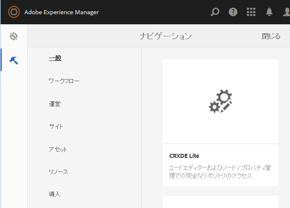
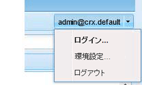

# SCF サンドボックスの作成 {#create-an-scf-sandbox}

>[!CAUTION]
>
>AEM 6.4 の拡張サポートは終了し、このドキュメントは更新されなくなりました。 詳細は、 [技術サポート期間](https://helpx.adobe.com/jp/support/programs/eol-matrix.html). サポートされているバージョンを見つける [ここ](https://experienceleague.adobe.com/docs/?lang=ja).

AEM 6.1 Communities 以降では、サンドボックスをすばやく作成する最も簡単な方法は、コミュニティサイトを作成することです。 詳しくは、 [AEM Communitiesの概要](getting-started.md).

開発者にとっても便利なツールは、 [コミュニティコンポーネントガイド](components-guide.md)：コミュニティのコンポーネントと機能の調査と迅速なプロトタイピングを可能にします。

Web サイトを作成する練習は、コミュニティ機能を含むAEM Web サイトの構造を理解するのに役立ちます。また、を使用して作業を検討するための簡単なページも提供します。 [ソーシャルコンポーネントフレームワーク (SCF)](scf.md).

このチュートリアルは、AEMを初めて使用する開発者が SCF コンポーネントの使用に関心を持つ場合を主に対象としています。 SCF サンドボックスサイトの作成に関する手順は、のチュートリアルと同様です。 [完全に機能するインターネット Web サイトを作成する方法](../../help/sites-developing/website.md) これは、ナビゲーション、ロゴ、検索、ツールバー、子ページのリスト表示など、サイト構造に重点を置いたものです。

開発はオーサーインスタンスでおこなわれますが、サイトでの実験はパブリッシュインスタンスで行うのが最適です。

このチュートリアルの手順は次のとおりです。

* [Web サイト構造のセットアップ](setup-website.md)
* [初期サンドボックスアプリケーション](initial-app.md)
* [初期サンドボックスコンテンツ](initial-content.md)
* [サンドボックスアプリケーションの開発](develop-app.md)
* [clientlib の追加](add-clientlibs.md)
* [サンドボックスコンテンツの開発](develop-content.md)

>[!CAUTION]
>
>このチュートリアルでは、 [コミュニティサイトコンソール](sites-console.md). 例えば、このチュートリアルでは、ログイン、自己登録、 [ソーシャルログイン](social-login.md)、メッセージング、プロファイルなど。
>
>シンプルなコミュニティサイトをお勧めする場合は、 [サンプルページの作成](create-sample-page.md) チュートリアル

## 前提条件 {#prerequisites}

このチュートリアルでは、AEMオーサーが 1 つ、AEMパブリッシュインスタンスが 1 つ、 [最新リリース](deploy-communities.md#latest-releases) コミュニティの

AEMプラットフォームを初めて使用する開発者向けの便利なリンクを次に示します。

* [はじめに](../../help/sites-deploying/deploy.md#getting-started) - AEMインスタンスをデプロイする場合

   * [基本](../../help/sites-developing/the-basics.md) - Web サイトや機能の開発者向け
   * [作成者向けの最初の手順](../../help/sites-authoring/first-steps.md)  — ページコンテンツのオーサリング用

## CRXDE Lite開発環境の使用 {#using-crxde-lite-development-environment}

AEM開発者は、時間の大部分を [CRXDE Lite](../../help/sites-developing/developing-with-crxde-lite.md) オーサーインスタンス上の開発環境。 CRXDE Liteは、CRX リポジトリへのアクセスを制限されていません。 クラシック UI ツールとタッチ操作対応 UI コンソールを使用すると、CRX リポジトリの特定の部分に対して、より構造化されたアクセスを提供できます。

管理者権限でログインした後、CRXDE Liteにアクセスする方法は様々です。

1. グローバルナビゲーションから、「ナビゲーション」を選択します。 **[!UICONTROL ツール/CRXDE Lite]**.

   

2. 次の [クラシック UI のようこそページ](http://localhost:4502/welcome.html)をクリックし、下にスクロールして **[!UICONTROL CRXDE Lite]** をクリックします。

   

3. 直接参照先 `CRXDE Lite`: `<server>:<port>/crx/de`

   例えば、ローカルのオーサーインスタンスの場合は、次のようになります。 ` [http://localhost:4502/crx/de](http://localhost:4502/crx/de)`

CRXDE Liteを使用するには、開発者または管理者の権限でサインインする必要があります。 デフォルトの localhost インスタンスの場合は、を使用してログインできます。

* `username: admin`
* `password: admin`

**注意** このログインがタイムアウトすると、CRXDe Lite ツールバーの右側にあるプルダウンを使用して、定期的に再ログインする必要があります。

ログインしていない場合、JCR リポジトリを移動したり、編集/保存操作を実行したりすることはできません。

***迷ったら再ログインしてください！***

