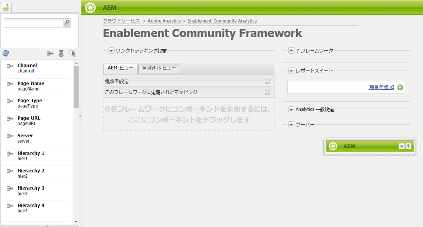

# コミュニティ機能のための Analytics の設定 {#analytics-configuration-for-communities-features}

## 概要 {#overview}

Adobe Analytics と Adobe Experience Manager（AEM）は、どちらも Adobe Marketing Cloud のソリューションです。

Adobe Analytics を AEM Communities と連携させ、サポートされるコミュニティ機能をメンバーが操作した際にイベントが Adobe Analytics に送信され、レポートが生成されるように設定することができます。

例えば、イネーブルメントコミュニティサイトのメンバーが自分に割り当てられているビデオリソースを再生すると、リソースプレイヤーによって、イベント（ビデオハートビートのデータを含む）が自動的に Analytics に送信されます。コミュニティサイトでは、管理者はビデオの再生に関する様々なレポートを閲覧できます。

さらに、Analytics は以下の処理のために必要です。

* 公開環境で次の操作を行います。

   * Reporting on community [trends](trends.md)
   * サイト訪問者が「最も頻繁に閲覧」、「最もアクティブ」、「最も「いいね！」をクリック」で並べ替えられるようにする
   * UGCリストでの表示数

* 作成者環境で、次の操作を行います。

   * Display of participation data in the [members management console](members.md) (views, posts, follows, likes)
   * Trend summary, video heartbeat and videio device for enablement resource [reports](reports.md)

サポートされるコミュニティ機能は以下のとおりです。

* [有効化リソース](resources.md)
* [フォーラム](forum.md)
* [Q&amp;A](working-with-qna.md)
* [ブログ](blog-feature.md)
* [ファイルライブラリ](file-library.md)
* [カレンダー](calendar.md)

ドキュメントのこのセクションでは、Analytics のレポートスイートとコミュニティ機能を接続する方法について説明します。基本的な手順は以下のとおりです。

1. すべての AEM インスタンス上で暗号化や復号化が正しく実行されるよう、[暗号鍵をレプリケート](#replicate-the-crypto-key)する
1. Adobe Analytics の[レポートスイート](#adobe-analytics-report-suite-for-video-reporting)を準備する
1. AEM Analytics [クラウドサービス](#aem-analytics-cloud-service-configuration)と[フレームワーク](#aem-analytics-framework-configuration)を作成する
1. [コミュニティサイトでのAnalytics](#enable-analytics-for-a-community-site) の有効化
1. Analytics と AEM 変数との間のマッピングを[検証](#verify-analytics-to-aem-variable-mapping)する
1. Identify [primary publisher](#primary-publisher)
1. [コミュニティサイトの公開](#publish-community-site-and-analytics-cloud-service)
1. Configure [import of report data](#obtaining-reports-from-analytics) from Adobe Analytics to the community site

## 前提条件 {#prerequisites}

Analytics をコミュニティ機能と連携するよう設定するには、アカウント担当者と協力して Adobe Analytics アカウントと[レポートスイート](#adobe-analytics-report-suite-for-video-reporting)をセットアップする必要があります。設定が完了したら、次の情報を使用できます。

* 会社名

   Adobe Analyticsアカウントに関連付けられている会社
* ユーザー名

   Analyticsアカウントの管理を承認されたユーザーのログインユーザー名。

   （Webサービスアクセス権限を含む）

* パスワード

   認証済みユーザーのログインパスワード

* Analyticsデータセンター

   アカウントのAnalyticsデータセンターのURL

* レポートスイート

   使用するAnalyticsレポートスイートの名前

## Adobe Analytics Report Suite for Video Reporting {#adobe-analytics-report-suite-for-video-reporting}

Using the Adobe Marketing Cloud&#39;s [Report Suite Manager](https://docs.adobe.com/content/help/en/analytics/admin/manage-report-suites/new-report-suite/new-report-suite.html), Analytics report suites can be configured so that a community site may be enabled to provide reports for Communities features.

By signing in to [Adobe Marketing Cloud](https://docs.adobe.com/content/help/en/analytics/analyze/analysis-workspace/home.html) with [Company Name and Username](analytics.md#prerequisites), it is possible to configure a new or existing report suite to have:

* [11 個のコンバージョン変数](https://docs.adobe.com/content/help/en/analytics/admin/admin-tools/conversion-variables/conversion-var-admin.html)（evar）

   * **`evar1`** 有効 **`evar11`** にする
   * 既存のeVarを再利用（名前変更）したり、Communities機能で使用する新しいeVarを作成できます。

* [7 個の成功イベント](https://docs.adobe.com/content/help/en/analytics/admin/admin-tools/success-events/success-event.html)（event）

   * **`event1`** 有効 **`event7`** にする
   * 型 **`Counter`**

      * **string not required****`Counter (no subrelations)`**
   * 既存のイベントを再利用（名前変更）したり、Communities機能で使用する新しいユーザーを作成できます。


* [ビデオ管理](https://docs.adobe.com/content/help/en/media-analytics/using/media-overview.html)

   * ビデオレポートコンソール

      * Enable（有効） `Video Core`
      * 「保存」を選択します
   * ビデオコア測定コンソール

      *  `Use Solution Variables`
      * 「保存」を選択します


**新しいレポートスイート**&#x200B;を使用する場合、新しいレポートスイートには、4 個の evar と 6 個の event 変数しかないことに注意してください。コミュニティサイトでは 11 個の ever と 7 個の event 変数が必要です。

**既存のレポートスイート**&#x200B;を使用する場合は、コミュニティサイト用の Analytics フレームワークをアクティベートする前に、[変数マッピングを変更](#modifying-analytics-variable-mapping)する必要があります。Communities専用の変数に関する懸念は、アカウント担当者にお問い合わせください。

>[!CAUTION]
>
>**以下の範囲内の変数を使用している既存のレポートスイートを使用する場合は、**
>
>* **`evar1`** から **`evar11`** まで
>* **`event1`** から **`event7`** まで

>
>
**次に、コミュニティサイトが公開される前に** 、Analyticsがコミュニティサイトに対して有効にされたときにAnalytics変数に自動的にマッピングされたAEM変数を移動して、既存のマッピングを復元することが重要です。
>
>To restore the pre-existing mapping and move AEM variables to other Analytics variables, see the section on [Modifying Analytics Variable Mapping](#modifying-analytics-variable-mapping).
>
>この作業をしておかないと、修復不可能なデータ損傷が発生することがあります。

### Video Heartbeat Analytics {#video-heartbeat-analytics}

Video Heartbeat Analyticsのライセンスを受けると、が割り当てら `Marketing Cloud Org Id` れます。

To enable Video Heartbeat reporting after [configuring the Analytics report suite for video reporting](#adobe-analytics-report-suite-for-video-reporting):

* [Analyticsクラウドサービスの作成](#aem-analytics-cloud-service-configuration)
* Enable [Analytics for a community site](#enable-analytics-for-a-community-site)
* をコミュニティサイト `Marketing Cloud Org Id` に関連付ける

The `Marketing Cloud Org Id` may be entered at the time of [community site creation](sites-console.md#enablement) or later by [modifying](sites-console.md#modifying-site-properties) the community site properties. [](#aem-analytics-cloud-service-configuration)


Video Heartbeat Analytics が有効になっている場合、ビデオプレーヤー用の Javascript（JS）コードによって Video Heartbeat ライブラリコード（JS）がインスタンス化されます。このコードは、Analytics ビデオ追跡サーバーにビデオステータスの更新を 10 秒間隔（設定不可）で送信するすべてのロジックを処理し、最後にメイン Analytics サーバーにビデオセッションの累積レポートを送信するすべてのロジックを処理します。

有効にしない場合、Video Heartbeat コードはインスタンス化されず、ビデオの再生状況と再開位置の追跡のみが報告のために SRP に維持されます。

## AEM Analytics クラウドサービス設定 {#aem-analytics-cloud-service-configuration}

作成者インスタンスの標準UIを使用して、Adobe AnalyticsをAEMコミュニティサイトと統合する、新しいAnalytics統合を作成するには：

* From global navigation: **[!UICONTROL Tools > Deployment > Cloud Services]**
* Scroll down to **[!UICONTROL Adobe Analytics]**
* Select either **[!UICONTROL Configure Now]** or **[!UICONTROL Show Configurations]**


### 設定を作成ダイアログ {#create-configuration-dialog}

* Select `[+]` icon next to **[!UICONTROL Available Configurations]** to create a new configuration

設定を作成ダイアログでは、設定を識別するための値を入力します。


* **[!UICONTROL タイトル]**

   （必須）設定の表示タイトル。

   For example, enter *Enablement Community Analytics*

* **[!UICONTROL 名前]**

   （オプション）指定しなかった場合、名前はデフォルトでタイトルから派生した有効なノード名になります。

   例えば、「communities」と入力します。**


* **[!UICONTROL テンプレート]**

    `Adobe Analytics Configuration`

* 「**[!UICONTROL 作成]**」を選択します。
   * 設定ページを起動し、 `Analytics Settings` ダイアログを開く

### Analytics 設定ダイアログ {#analytics-settings-dialog}

新しい Analytics 設定を初めて作成したときには、その設定と、Analytics 設定を入力するための新しいダイアログが表示されます。This dialog requires the [prerequisite account information](#prerequisites) obtained from the account representative.


* **[!UICONTROL 会社]**

   Adobe Analyticsアカウントに関連付けられている会社

* **[!UICONTROL ユーザー名]**

   Analyticsアカウントの管理を承認されたユーザーのログインユーザー名。

* **[!UICONTROL パスワード]**

   認証済みユーザーのログインパスワード

* **[!UICONTROL データセンター]**

   レポートスイートをホストするAnalyticsデータセンターを選択します

* **[!UICONTROL ページに追跡タグを追加しない]**

   デフォルトのままにする（オフ）

* **[!UICONTROL AppMeasurement を使用]**

   デフォルトのままにする（オフ）

* **[!UICONTROL ページインプレッション数を夜間に読み込まない (作成者)]**

   デフォルトのままにする（オフ）

* **[!UICONTROL ページインプレッション数を夜間に読み込まない (発行)]**

   デフォルトのままにする（オン）

設定を保存するには：


* Select **[!UICONTROL Connect to Analytics]**

   * 成功しなかった場合、

      * エントリの先頭に空白が含まれていないことを確認する
      * 別のデータセンターを試す
      * アカウント担当者にお問い合わせください

* 「**[!UICONTROL OK]**」を選択します。


### フレームワークの作成 {#create-framework}

Adobe Analytics への基本的な接続を正しく設定したら、コミュニティサイトのフレームワークを作成または編集する必要があります。フレームワークの目的は、Communities機能(AEM)変数をAnalytics（レポートスイート）変数にマッピングすることです。

* Select `[+]` icon next to **[!UICONTROL Available Frameworks]** to create a new framework


* **[!UICONTROL タイトル]**

   （必須）フレームワークの表示タイトル

   For example, enter *Enablement Community Framework*

* **[!UICONTROL 名前]**

   （オプション）指定しなかった場合、名前はデフォルトでタイトルから派生した有効なノード名になります。

   例えば、「communities」と入力します。**

* **[!UICONTROL テンプレート]**

    `Adobe Analytics Framework`

* 「**[!UICONTROL 作成]**」を選択します。

Analytics フレームワークを作成すると、フレームワークを設定するための画面が開きます。

## AEM Analytics フレームワーク設定 {#aem-analytics-framework-configuration}

このフレームワークは、AEM 変数を Analytics（evar および event）変数にマップするためのものです。The Analytics variables available for mapping are [defined in the report suite](#adobe-analytics-report-suite-for-video-reporting).



### レポートスイートの選択 {#select-report-suite}

ビデオレポート用にセットアップされているレポートスイートを選択します。

レポートスイートがまだ作成されていない、または適切に設定されていない場合は、前のセクションを参照してください。\
[Adobe Analytics Report Suite for Video Reporting](#adobe-analytics-report-suite-for-video-reporting)

サイドキックは必要ないので、レポートスイート設定にアクセスするときの邪魔にならないよう最小化しておくことができます。

#### 「項目を追加」選択前および選択後のレポートスイートダイアログ {#report-suites-dialog-before-and-after-selecting-add-item}


1. 「**[!UICONTROL 項目を追加 +]**」を選択します。2 つのドロップダウンボックスが表示されます。
1. Choose a `Report suite` the report suites associated with the Company account should be available for selection
1. 開いたダイアログで **[!UICONTROL 「はい]** 」を選択します。 ```Load default server settings? Do you want to load the default server settings and overwrite current values in the Server section?```
1. 選択肢 `Run Mode`\
   「 **[!UICONTROL 公開」を選択]**


これで Analytic クラウドサービスとフレームワークの準備が完了しました。マッピングは、このAnalyticsサービスを有効にしてコミュニティサイトを作成すると定義されます。

## コミュニティサイトに対する Analytics の有効化 {#enable-analytics-for-a-community-site}

### 新しいコミュニティサイトに対する有効化 {#enable-for-new-community-site}

[新しいコミュニティサイトの作成](sites-console.md)中に Analytics クラウドサービスを追加するには：


* 手順3
* Under the [ANALYTICS tab](sites-console.md#analytics):

   * Check the **[!UICONTROL Enable Analytics]** checkbox
   * ドロップダウンボックスからフレームワークを選択します

* Analytics フレームワーク設定に戻り、変数マッピングを調整します（オプション）。

### 既存のコミュニティサイトに対する有効化 {#enable-for-existing-community-site}

Analytics クラウドサービスを[既存のコミュニティサイト](sites-console.md#modifying-site-properties)に追加するには：


* Navigate to the **[!UICONTROL Communities > Sites]** console
* コミュニティサイトの[サイトの編集]アイコンを選択します
* 設定を選択します
* 「解析」セクションで、次の操作を行います。

   * Check the **[!UICONTROL Enable Analytics]** checkbox
   * ドロップダウンボックスからフレームワークを選択します


* Analytics フレームワーク設定に戻り、変数マッピングを調整します（オプション）。

### カスタマイズされたサイトに対する有効化 {#enable-for-customized-sites}

コミュニティサイトで Analytics の追跡とインポートが正常に機能するようにするには、`scf-js-site-title` クラスと href 属性のページ要素が存在する必要があります。Only one such element should exist on the page, such as it does in an unmodified `sitepage.hbs` script for a community site. The value of `siteUrl` is extracted and sent to Adobe Analytics as the *site path*.

```xml
# present in default sitepage.hbs
# only one scf-js-site-title class should be included
# this example sets it to be hidden as it serves no visual purpose
<div
    class="navbar-brand scf-js-site-title"
    href="{{siteUrl}}.html"
    style="visibility: hidden;"
>
</div>
```

For a **customized community site** that overlays the `sitepage.hbs` script, ensure the element is present. The `siteUrl`variable will be set when rendered on the server before serving to the client.

Communities コンポーネントが含まれているが[サイト作成ウィザード](sites-console.md)で作成されていない&#x200B;**一般的な AEM サイト**&#x200B;の場合は、要素を追加する必要があります。hrefの値は、サイトへのパスである必要があります。 For example, if the site path is `/content/my/company/en`, then use:

```xml
<div
    class="navbar-brand scf-js-site-title"
    href="/content/my/company/en.html"
    style="visibility: hidden;"
>
</div>
```

## コミュニティ機能のための Analytics {#analytics-for-communities-features}

Analytics は複数のコミュニティ機能で自動的に使用されます。

The author environment&#39;s [OSGi configuration](../../help/sites-deploying/configuring-osgi.md), `AEM Communities Analytics Component Configuration`, provides a listing of the components that have been instrumented for Analytics. 変数の自動マッピングは、リストに表示されているコンポーネントによって決まります。

Analytics 用の新しいカスタムコンポーネントを作成した場合は、この設定済みコンポーネントのリストに追加する必要があります。

### コンポーネントの設定 {#component-configuration}


Note: the `journal` components are used to implement the blog feature.

### Analytics と AEM 変数とのマッピング {#mapped-analytics-to-aem-variables}

Analytics を有効にしてクラウド設定フレームワークを選択したコミュニティサイトを保存すると、AEM 変数が Analytics の evar および event に自動的にマップされます。マップ先はそれぞれ evar1 と event1 から始まり、変数名の数値部分は 1 ずつ増加していきます。

evar1 ～ evar11 および event1 ～ event7 の範囲内のいずれかの変数がマップされた既存のレポートスイートを使用する場合は、[AEM 変数を再マップ](#modifying-analytics-variable-mapping)して、元のマッピングを復元する必要があります。

[使用の手引きのチュートリアル](getting-started-enablement.md)に従った場合のデフォルトのマッピング例を以下に示します。


#### 各イベントと共に送信される eVars のマップ {#map-of-evars-sent-with-each-event}

|  | イネーブルメントリソースのタイプ | サイトのタイトル | 機能のタイプ | グループのタイトル | グループのパス | UGCのタイプ | UGCのタイトル | ユーザー（メンバー） | UGCのパス | サイトのパス |
|------------------------|------------------------|-----------|--------------|------------|-----------|---------|----------|--------------|---------|----------|
|  | **eVar1** | **eVar2** | **eVar3** | **eVar4** | **eVar5** | **eVar6** | **eVar7** | **eVar8** | **eVar9** | **eVar10** |
| event1 リソース再生 | (a) | - | - | - | - | - | - | - | (i) | - |
| event2 SCFView | (a) | (b) | (c) | (d) | (E) | （f） | （g） | （h） | (i) | （j） |
| event3 SCFCreate（投稿） | - | (b) | (c) | (d) | (E) | （f） | （g） | （h） | (i) | （j） |
| event4 SCFFollow | - | (b) | (c) | (d) | (E) | （f） | （g） | （h） | (i) | （j） |
| event5 SCFVoteUp | - | (b) | (c) | (d) | (E) | （f） | （g） | （h） | (i) | （j） |
| event6 SCFVoteDown | - | (b) | (c) | (d) | (E) | （f） | （g） | （h） | (i) | （j） |
| event7 SCFRate | - | (b) | (c) | (d) | (E) | （f） | （g） | （h） | (i) | （j） |

**eVar の値の例：**

* [MIME type](https://www.iana.org/assignments/media-types): video/mp4
* [コミュニティサイトのタイトル](sites-console.md#step13asitetemplate): Geometrixxコミュニティ
* [コミュニティ関数名](functions.md): フォーラム
* [コミュニティグループ名](creating-groups.md#creating-a-new-group): ハイキング
* コミュニティグループコンテンツへのパス： /content/sites/communities/jp/groups/hiking
* [UGCコンポーネントresourceType](essentials.md): social/forum/components/hbs/topic
* UGCコンポーネントタイトル： トピックのハイク
* ログイン（認証可能なID）: aaron.mcdonald@mailinator.com
* SRP path to UGC: /content/usergenerated/asi/.../forum/jmtz-topic3 or *path of component to follow*: /content/sites/communities/en/jcr:content/content/primary/forum
* コミュニティサイトコンテンツへのパス： /content/sites/community/en

### Analytics 変数のマッピングの変更 {#modifying-analytics-variable-mapping}

Analytics の evar および event と AEM 変数とのマッピングは、Analytics をコミュニティサイトに対して有効にした後に、フレームワーク設定から表示できるようになります。

Analytics を有効にした後、コミュニティサイトを公開する前に、フレームワーク内で必要な Analytics の evar または event を左のレールからマッピングテーブルの適切な行にドラッグ＆ドロップすることで、マッピングを変更できます。

マッピングの重複を避けるために、置き換えられた Analytics の evar または event は列から削除するようにしてください（削除するには、カーソルを合わせたときに Analytics 変数要素の右に表示される「X」を選択します）。

Communities の ever および event がレポートスイート内の既存のマッピングを上書きする場合は、データの損失を避けるために、コミュニティ機能の AEM 変数を他の Analytics の ever や event に割り当てて、元のマッピングを復元してください。

>[!CAUTION]
>
>Analytics を有効にしたコミュニティサイトを[公開](#publishing-the-community-site)する前に再マップすることが重要です。そうしないと、データが損失するおそれがあります。

#### 手順 1 の例：Analytics の evar14 をマッピングテーブルにドラッグ {#example-step-dragging-analytics-evar-into-mapping-table}


#### 手順 2 の例：「x」を選択し、置き換える evar11 を削除 {#example-step-selecting-x-to-remove-replaced-evar}


#### 手順 3 の例：AEM 変数 eventdata.siteId を Analytics の evar14 に再マップ {#example-step-aem-var-eventdata-siteid-remapped-to-analytics-evar}


## コミュニティサイトの公開 {#publishing-the-community-site}

### Analytics と AEM 変数とのマッピングの検証 {#verify-analytics-to-aem-variable-mapping}

コミュニティサイトの公開前に、変数マッピングを確認することを推奨します。サイトの公開時には、Analytics クラウドサービスとフレームワークも公開されます。

以下の節を参照してください。

* [Analytics と AEM 変数とのマッピング](#mapped-analytics-to-aem-variables)
* [Analytics 変数のマッピングの変更](#modifying-analytics-variable-mapping)

>[!CAUTION]
>
>**以下の範囲内の変数を使用している既存のレポートスイートを使用する場合は、**
>
>* **`evar1`** から **`evar11`** まで
>* **`event1`** から **`event7`** まで

>
>
**次に、コミュニティサイトが公開される前に** 、既存のマッピングを復元し、自動的にマップされたCommunities AEM変数（コミュニティサイトでAnalyticsが有効な場合）を、他のAnalytics変数に移動することが重要です。 この再マッピングは、すべてのCommunitiesコンポーネントで一貫している必要があります。
>
>この作業をしておかないと、修復不可能なデータ損傷が発生することがあります。

### プライマリパブリッシャー {#primary-publisher}

選択したデプロイメントが[パブリッシュファーム](topologies.md#tarmk-publish-farm)の場合は、レポートデータのポーリングをおこなう Adobe Analytics が [SRP](working-with-srp.md) に書き込めるよう、1 つの AEM パブリッシュインスタンスをプライマリパブリッシャーに指定する必要があります。

By default, the `AEM Communities Publisher Configuration` OSGi configuration identifies its publish instance as the primary publisher, such that all publish instances in a publish farm would self-identify as the primary.

したがって、すべてのセカンダリパブリッシュインスタンスの設定を編集して、「**Primary Publisher**」チェックボックスをオフにする必要があります。

For specific instructions, see the primary publisher section of [Deploying Communities](deploy-communities.md#primary-publisher).

>[!CAUTION]
>
>複数の発行インスタンスからのポーリングを防ぐようにプライマリ発行者を設定することが重要です。

### 暗号鍵のレプリケーション {#replicate-the-crypto-key}

Adobe Analytics の資格情報は暗号化されます。作成者と発行者間で暗号化された解析資格情報のレプリケーションまたは送信を容易にするには、すべてのAEMインスタンスで同じプライマリ暗号化キーを共有する必要があります。

To do so, follow the instructions at [Replicate the Crypto Key](deploy-communities.md#replicate-the-crypto-key).

### コミュニティサイトと Analytics クラウドサービスの公開 {#publish-community-site-and-analytics-cloud-service}

Analytics クラウドサービスをコミュニティサイトに対して有効にし、また必要に応じて [Analytics 変数と AEM 変数とのマッピングを調整](#mapped-analytics-to-aem-variables)したら、[コミュニティサイトの（再）公開](sites-console.md#publishing-the-site)をおこない、設定をパブリッシュ環境にレプリケートする必要があります。

## Analytics からのレポートの取得 {#obtaining-reports-from-analytics}

### レポート管理 {#report-management}

作成者およびプライマリパブリッシャーの [OSGi設定](../../help/sites-deploying/configuring-osgi.md)( `AEM Communities Analytics Report Management`OSGi設定)は、Analyticsのクエリに使用されます。

オーサー環境では、リアルタイムレポートを入手するにはクエリを使用します。

プライマリパブリッシャーでは、レポートインポーターの分析データ読み込みに備えた情報提供のためにクエリを使用します。

クエリの間隔は、デフォルトで 10 秒間です。

### レポートインポーター {#report-importer}

Once an Analytics enabled community site has been published, the primary publisher&#39;s [OSGi configuration](../../help/sites-deploying/configuring-osgi.md), `AEM Communities Analytics Report Importer`, may be configured to set the default polling interval for those configurations which are not individually configured in CRXDE.

The polling interval controls the frequency of requests to Adobe Analytics for data to be pulled and saved into [SRP](working-with-srp.md).

データが「ビッグデータ」に類するものである場合は、ポーリングの頻度を上げるとコミュニティサイトに大きな負荷がかかる場合があります。

デフォルトのポーリングの&#x200B;**読み込みインターバル**&#x200B;は、12 時間に設定されています。


### コンポーネントレポートのカスタマイズ {#component-report-customization}

現在、追跡する指標をカスタマイズするには、リポジトリ内にノードを作成し、その指標に関するレポートを生成する期間を定義します。

現在、このカスタマイズの例を確認できるのはフォーラムトピックのみです。

* プライマリパブリッシャ
* 管理者権限でサインイン
* [CRXDE Liteに移動](../../help/sites-developing/developing-with-crxde-lite.md)

   * 例：[http://localhost:4503/crx/de](http://localhost:4503/crx/de)

* Under the `jcr:content` node of the language root

   * 例：`/content/sites/engage/en/jcr:content`

* Analyticsレポート用に設定されたコンポーネントに移動します

   * 例：`analytics/reportConfigs/social_forum_components_hbs_topic`

* 作成された期間に注目してください

   * `last30Days`
   * `last90Days`
   * `thisYear`

* Notice the `total`node

   * Modifying the `interval` property will override the Report Importer interval
   * 値は秒単位で、4時間（14400秒）に設定します。


## Analytics でのユーザーデータの管理 {#manage-user-data-in-analytics}

Adobe Analytics は、ユーザーデータのアクセス、書き出し、削除をおこなう API を提供しています。詳しくは、[アクセス要求および削除要求の送信](https://docs.adobe.com/content/help/en/analytics/admin/data-governance/gdpr-submit-access-delete.html)を参照してください。

## リソース {#resources}

* Adobe Marketing Cloud：[Analytics ヘルプとリファレンス](https://docs.adobe.com/content/help/en/analytics/landing/home.html)
* AEM: [Integrating with Adobe Analytics](../../help/sites-administering/adobeanalytics.md)
* AEM: [Analytics with External Providers](../../help/sites-administering/external-providers.md)

